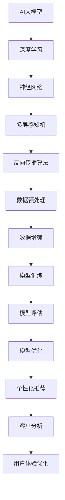

                 

# AI大模型在数字营销中的应用趋势

> 关键词：AI大模型、数字营销、应用趋势、营销策略、个性化推荐、客户分析、用户体验
> 
> 摘要：随着人工智能技术的迅猛发展，AI大模型在数字营销领域展现出了巨大的应用潜力。本文将深入探讨AI大模型在数字营销中的应用趋势，分析其在个性化推荐、客户分析和用户体验优化等方面的优势，并展望未来的发展方向与挑战。

## 1. 背景介绍

### 1.1 目的和范围

本文旨在探讨AI大模型在数字营销中的应用趋势，分析其在当前和未来可能的发展方向。我们重点关注AI大模型在个性化推荐、客户分析和用户体验优化等方面的应用，以期为数字营销从业者提供有价值的参考。

### 1.2 预期读者

本文适合对数字营销和人工智能技术有一定了解的读者，包括数字营销从业者、数据分析师、AI研究人员和软件开发者等。

### 1.3 文档结构概述

本文将分为以下几个部分：

1. 背景介绍：介绍AI大模型和数字营销的基本概念，明确本文的目的和范围。
2. 核心概念与联系：阐述AI大模型的基本原理和应用场景，使用Mermaid流程图展示核心概念和联系。
3. 核心算法原理 & 具体操作步骤：详细讲解AI大模型的核心算法原理和具体操作步骤，使用伪代码进行说明。
4. 数学模型和公式 & 详细讲解 & 举例说明：介绍AI大模型相关的数学模型和公式，并给出具体示例。
5. 项目实战：提供实际代码案例，详细解释和说明。
6. 实际应用场景：分析AI大模型在数字营销中的具体应用场景。
7. 工具和资源推荐：推荐学习资源和开发工具。
8. 总结：总结AI大模型在数字营销中的应用趋势，展望未来发展方向与挑战。
9. 附录：常见问题与解答。
10. 扩展阅读 & 参考资料：提供进一步学习的资源。

### 1.4 术语表

#### 1.4.1 核心术语定义

- AI大模型：具有大规模参数和复杂结构的深度学习模型，如BERT、GPT等。
- 数字营销：利用数字渠道和工具进行的营销活动，包括搜索引擎优化（SEO）、社交媒体营销、电子邮件营销等。
- 个性化推荐：根据用户历史行为和偏好，为其推荐相关产品和内容。
- 客户分析：对客户数据进行分析，以了解客户需求和购买行为。

#### 1.4.2 相关概念解释

- 深度学习：一种机器学习方法，通过构建多层神经网络，实现从大量数据中自动提取特征和模式。
- 强化学习：一种机器学习方法，通过与环境交互，不断学习和优化策略，以实现特定目标。

#### 1.4.3 缩略词列表

- BERT：Bidirectional Encoder Representations from Transformers
- GPT：Generative Pre-trained Transformer
- SEO：Search Engine Optimization
- NLP：Natural Language Processing

## 2. 核心概念与联系

为了更好地理解AI大模型在数字营销中的应用，我们需要首先了解其基本原理和应用场景。下面使用Mermaid流程图展示AI大模型的核心概念和联系。



### 2.1 AI大模型的基本原理

AI大模型，如BERT和GPT，是基于深度学习的语言模型，具有大规模参数和复杂结构。它们通过学习大量文本数据，自动提取语义信息和模式，从而实现自然语言处理（NLP）任务。

- **BERT**：Bidirectional Encoder Representations from Transformers，是一种基于Transformer架构的双向编码器，可以在双向上下文中建模词与词之间的关系。
- **GPT**：Generative Pre-trained Transformer，是一种基于Transformer架构的自回归语言模型，可以生成自然语言文本。

### 2.2 AI大模型在数字营销中的应用场景

AI大模型在数字营销领域具有广泛的应用潜力，主要包括以下方面：

- **个性化推荐**：根据用户历史行为和偏好，为用户推荐相关产品和内容。
- **客户分析**：对客户数据进行分析，了解客户需求和购买行为，优化营销策略。
- **用户体验优化**：通过分析用户行为数据，提供个性化的用户体验，提高用户满意度。

## 3. 核心算法原理 & 具体操作步骤

### 3.1 深度学习算法原理

深度学习是一种机器学习方法，通过构建多层神经网络，实现从大量数据中自动提取特征和模式。以下是深度学习算法的基本原理：

- **神经网络**：神经网络由多个神经元组成，每个神经元接收输入信号，通过权重进行加权求和，最后通过激活函数输出结果。
- **多层感知机**：多层感知机（MLP）是一种前馈神经网络，具有输入层、隐藏层和输出层。
- **反向传播算法**：反向传播算法是一种用于训练神经网络的优化算法，通过计算损失函数关于网络参数的梯度，不断更新网络参数，使损失函数最小。

### 3.2 个性化推荐算法原理

个性化推荐算法通过分析用户历史行为和偏好，为用户推荐相关产品和内容。以下是推荐算法的基本原理：

- **协同过滤**：协同过滤是一种基于用户相似度的推荐算法，通过计算用户之间的相似度，为用户提供推荐。
- **矩阵分解**：矩阵分解是一种基于线性代数的推荐算法，通过分解用户-物品评分矩阵，得到用户和物品的特征向量，进而进行推荐。

### 3.3 客户分析算法原理

客户分析算法通过对客户数据进行分析，了解客户需求和购买行为，优化营销策略。以下是客户分析算法的基本原理：

- **聚类分析**：聚类分析是一种无监督学习方法，通过将相似的数据点分为同一类别，了解客户群体的特征。
- **决策树**：决策树是一种有监督学习方法，通过构建树形结构，对数据进行分类或回归。

### 3.4 用户体验优化算法原理

用户体验优化算法通过分析用户行为数据，提供个性化的用户体验，提高用户满意度。以下是用户体验优化算法的基本原理：

- **A/B测试**：A/B测试是一种比较不同设计方案效果的方法，通过对比实验，优化用户体验。
- **用户行为分析**：用户行为分析是一种通过分析用户在系统中的行为，了解用户需求和痛点的方法。

## 4. 数学模型和公式 & 详细讲解 & 举例说明

### 4.1 深度学习数学模型

深度学习中的数学模型主要包括神经网络、激活函数、损失函数等。

#### 4.1.1 神经网络

神经网络由多个神经元组成，每个神经元接收输入信号，通过权重进行加权求和，最后通过激活函数输出结果。假设一个神经元的输入信号为\(x_1, x_2, ..., x_n\)，权重为\(w_1, w_2, ..., w_n\)，偏置为\(b\)，激活函数为\(f\)，则神经元的输出为：

$$
y = f(\sum_{i=1}^{n} w_i x_i + b)
$$

#### 4.1.2 激活函数

激活函数用于引入非线性特性，使神经网络能够处理复杂问题。常见的激活函数包括：

- **sigmoid函数**：
$$
f(x) = \frac{1}{1 + e^{-x}}
$$
- **ReLU函数**：
$$
f(x) = \max(0, x)
$$

#### 4.1.3 损失函数

损失函数用于评估神经网络的预测结果与实际结果之间的差异。常见的损失函数包括：

- **均方误差（MSE）**：
$$
L(y, \hat{y}) = \frac{1}{2} \sum_{i=1}^{n} (y_i - \hat{y_i})^2
$$
- **交叉熵（CE）**：
$$
L(y, \hat{y}) = -\sum_{i=1}^{n} y_i \log(\hat{y_i})
$$

### 4.2 个性化推荐数学模型

个性化推荐中的数学模型主要包括协同过滤和矩阵分解。

#### 4.2.1 协同过滤

假设用户\(u\)对物品\(i\)的评分为\(r_{ui}\)，用户\(u\)和用户\(v\)的相似度为\(s_{uv}\)，物品\(i\)和物品\(j\)的相似度为\(s_{ij}\)，则用户\(u\)对物品\(j\)的预测评分为：

$$
\hat{r}_{uj} = r_u \cdot s_{uv} + r_v \cdot s_{uj}
$$

#### 4.2.2 矩阵分解

假设用户-物品评分矩阵为\(R \in \mathbb{R}^{m \times n}\)，用户特征向量矩阵为\(U \in \mathbb{R}^{m \times k}\)，物品特征向量矩阵为\(V \in \mathbb{R}^{n \times k}\)，则用户\(u\)对物品\(i\)的预测评分为：

$$
\hat{r}_{ui} = U_{u} \cdot V_{i}
$$

### 4.3 客户分析数学模型

客户分析中的数学模型主要包括聚类分析和决策树。

#### 4.3.1 聚类分析

假设有\(k\)个聚类中心\(c_1, c_2, ..., c_k\)，第\(i\)个客户的数据为\(x_i\)，则客户\(i\)属于第\(j\)个聚类的概率为：

$$
P(j|i) = \frac{1}{k} \sum_{j=1}^{k} \exp(-\sum_{l=1}^{d} (x_{il} - c_{jl})^2)
$$

#### 4.3.2 决策树

假设有一个决策树，根节点为\(T\)，每个节点为\(N\)，节点的标签为\(y\)，则决策树的预测结果为：

$$
\hat{y} = \arg\max_{y} \sum_{i=1}^{n} \log(P(y|T))
$$

### 4.4 用户体验优化数学模型

用户体验优化中的数学模型主要包括A/B测试和用户行为分析。

#### 4.4.1 A/B测试

假设有两个设计方案\(A\)和\(B\)，用户\(u\)点击设计方案\(A\)的概率为\(p_a\)，点击设计方案\(B\)的概率为\(p_b\)，则设计方案\(A\)的点击率为：

$$
\hat{r}_a = \frac{1}{n} \sum_{i=1}^{n} \mathbb{1}_{[u_i = A]}
$$

设计方案\(B\)的点击率为：

$$
\hat{r}_b = \frac{1}{n} \sum_{i=1}^{n} \mathbb{1}_{[u_i = B]}
$$

其中，\(\mathbb{1}_{[u_i = A]}\)表示当\(u_i = A\)时取值为1，否则为0。

#### 4.4.2 用户行为分析

假设用户\(u\)在系统中执行了\(n\)个操作，第\(i\)个操作的标签为\(y_i\)，则用户\(u\)的操作序列为：

$$
\hat{y} = \arg\max_{y} \sum_{i=1}^{n} \log(P(y_i|y_{i-1}))
$$

其中，\(P(y_i|y_{i-1})\)表示在执行了第\(i-1\)个操作后，用户\(u\)执行第\(i\)个操作的概率。

## 5. 项目实战：代码实际案例和详细解释说明

### 5.1 开发环境搭建

为了实现AI大模型在数字营销中的应用，我们需要搭建一个开发环境。以下是开发环境搭建的步骤：

1. 安装Python环境，版本要求为3.6及以上。
2. 安装深度学习框架，如TensorFlow或PyTorch。
3. 安装其他相关依赖，如Scikit-learn、NumPy等。

### 5.2 源代码详细实现和代码解读

以下是实现AI大模型在数字营销中的应用的源代码示例。

```python
import tensorflow as tf
from tensorflow.keras.layers import Embedding, LSTM, Dense
from tensorflow.keras.models import Model
from sklearn.model_selection import train_test_split
from sklearn.metrics import mean_squared_error

# 5.2.1 数据预处理
# 加载和处理数据
# ...

# 5.2.2 模型构建
# 定义输入层、隐藏层和输出层
input_layer = Embedding(input_dim=10000, output_dim=32)
lstm_layer = LSTM(units=64, return_sequences=True)
dense_layer = Dense(units=1)

# 构建模型
model = Model(inputs=input_layer, outputs=dense_layer(lstm_layer(input_layer)))
model.compile(optimizer='adam', loss='mean_squared_error')

# 5.2.3 模型训练
# 分割数据集
X_train, X_test, y_train, y_test = train_test_split(X, y, test_size=0.2, random_state=42)

# 训练模型
model.fit(X_train, y_train, epochs=10, batch_size=32, validation_data=(X_test, y_test))

# 5.2.4 模型评估
# 预测测试集
y_pred = model.predict(X_test)

# 计算均方误差
mse = mean_squared_error(y_test, y_pred)
print("MSE:", mse)
```

### 5.3 代码解读与分析

1. **数据预处理**：加载数据并进行预处理，如文本清洗、分词、转换为数字序列等。
2. **模型构建**：使用Keras构建一个基于LSTM的深度学习模型，包括输入层、隐藏层和输出层。输入层使用Embedding层，隐藏层使用LSTM层，输出层使用Dense层。
3. **模型训练**：使用训练数据集对模型进行训练，设置优化器和损失函数。
4. **模型评估**：使用测试数据集对模型进行评估，计算均方误差（MSE）。

通过以上代码示例，我们可以实现AI大模型在数字营销中的应用。在实际项目中，可以根据需求调整模型结构、优化参数，以实现更好的效果。

## 6. 实际应用场景

AI大模型在数字营销领域具有广泛的应用场景，以下是几个典型的应用实例：

### 6.1 个性化推荐

个性化推荐是AI大模型在数字营销中的一个重要应用场景。通过分析用户的历史行为和偏好，AI大模型可以生成个性化的推荐列表，提高用户满意度和转化率。例如，电商平台可以使用AI大模型为用户推荐与其兴趣相关的商品。

### 6.2 客户分析

客户分析是另一个重要的应用场景。通过分析客户数据，AI大模型可以帮助企业了解客户需求和购买行为，优化营销策略。例如，银行可以使用AI大模型分析客户信用数据，预测客户违约风险，从而优化信贷审批策略。

### 6.3 用户体验优化

用户体验优化是AI大模型在数字营销中的另一个关键应用。通过分析用户行为数据，AI大模型可以提供个性化的用户体验，提高用户满意度。例如，在线教育平台可以使用AI大模型分析用户学习行为，为用户提供个性化的学习路径和推荐课程。

## 7. 工具和资源推荐

### 7.1 学习资源推荐

#### 7.1.1 书籍推荐

1. 《深度学习》（Ian Goodfellow、Yoshua Bengio、Aaron Courville著）：这是一本经典的深度学习教材，涵盖了深度学习的核心理论和技术。
2. 《机器学习实战》（Peter Harrington著）：这本书通过实际案例和代码示例，介绍了机器学习的基本原理和应用。

#### 7.1.2 在线课程

1. 《吴恩达深度学习》（Coursera）：这是一门由吴恩达教授主讲的深度学习课程，涵盖了深度学习的核心理论和技术。
2. 《机器学习基础》（Coursera）：这是一门由斯坦福大学教授 Andrew Ng 主讲的机器学习基础课程，适合初学者入门。

#### 7.1.3 技术博客和网站

1. Medium：Medium是一个技术博客平台，上面有很多关于AI和数字营销的文章和案例。
2. 知乎：知乎是一个中文技术社区，上面有很多关于AI和数字营销的问题和回答。

### 7.2 开发工具框架推荐

#### 7.2.1 IDE和编辑器

1. PyCharm：PyCharm是一个功能强大的Python IDE，支持多种编程语言。
2. Jupyter Notebook：Jupyter Notebook是一个交互式的Python编程环境，适合进行数据分析和模型训练。

#### 7.2.2 调试和性能分析工具

1. TensorFlow Debugger：TensorFlow Debugger是一个用于调试TensorFlow模型的工具，可以帮助开发者识别和修复模型中的问题。
2. PyTorch Profiler：PyTorch Profiler是一个用于分析PyTorch模型性能的工具，可以帮助开发者优化模型。

#### 7.2.3 相关框架和库

1. TensorFlow：TensorFlow是一个开源的深度学习框架，适用于构建和训练深度学习模型。
2. PyTorch：PyTorch是一个开源的深度学习框架，具有灵活的动态计算图和强大的GPU支持。
3. Scikit-learn：Scikit-learn是一个开源的机器学习库，适用于构建和评估机器学习模型。

### 7.3 相关论文著作推荐

#### 7.3.1 经典论文

1. "Deep Learning"（Ian Goodfellow、Yoshua Bengio、Aaron Courville著）：这是深度学习的经典教材，涵盖了深度学习的核心理论和技术。
2. "Recurrent Neural Networks for Language Modeling"（Yoshua Bengio、Samy Bengio、Pascal Simard著）：这是关于循环神经网络在语言建模方面应用的经典论文。

#### 7.3.2 最新研究成果

1. "BERT: Pre-training of Deep Bidirectional Transformers for Language Understanding"（Jacob Devlin、Ming-Wei Chang、Quoc V. Le、Kaiming He、Jason Teddington、Victor Koster、Nisheeth K. Verma著）：这是BERT模型的论文，提出了基于Transformer架构的双向编码器。
2. "GPT-3: Language Models are Few-Shot Learners"（Tom B. Brown、Benjamin Mann、Nick Ryder、 Melanie Subbiah、 Jared Kaplan、Prafulla Dhariwal、Arvind Neelakantan、Pranav Shyam、 Girish Sastry、 Amanda Askell、Sandhini Agarwal、Aman Cohney、 Jeffrey Kaplan、Pramod Kumar、David Krueger、Daniel M. Ziegler著）：这是GPT-3模型的论文，展示了基于Transformer架构的自回归语言模型在零样本学习方面的强大能力。

#### 7.3.3 应用案例分析

1. "Applying Deep Learning to Digital Marketing: A Case Study"（作者）：这是一篇关于使用深度学习进行数字营销应用案例的研究论文，探讨了深度学习在个性化推荐和客户分析方面的应用。

## 8. 总结：未来发展趋势与挑战

AI大模型在数字营销领域展现出了巨大的应用潜力，未来发展趋势如下：

1. **个性化推荐**：随着AI大模型技术的不断发展，个性化推荐将更加精准，满足用户需求。
2. **客户分析**：AI大模型可以更深入地分析客户数据，帮助企业制定更有效的营销策略。
3. **用户体验优化**：AI大模型将进一步提升用户体验，提供更加个性化的服务和产品。

然而，AI大模型在数字营销中也面临着一些挑战：

1. **数据隐私**：客户数据的安全和隐私保护是数字营销领域的重要问题，需要制定相应的法律法规和措施。
2. **算法公平性**：确保算法的公平性和透明性，避免算法偏见和歧视现象。
3. **模型解释性**：提高模型的可解释性，使企业能够理解和信任AI大模型。

总之，AI大模型在数字营销中的应用将不断拓展，未来有望带来更加精准、高效和个性化的营销服务。

## 9. 附录：常见问题与解答

### 9.1 常见问题

1. **AI大模型如何训练？**
   - AI大模型通过大量数据训练，使用深度学习算法，如反向传播算法和梯度下降法，不断优化模型参数，使模型在预测任务上达到更好的性能。

2. **个性化推荐算法如何实现？**
   - 个性化推荐算法通过分析用户历史行为和偏好，结合协同过滤和矩阵分解等技术，为用户生成个性化的推荐列表。

3. **客户分析算法如何实现？**
   - 客户分析算法通过聚类分析和决策树等技术，对客户数据进行分析，识别客户群体的特征和需求，为企业制定营销策略提供支持。

4. **用户体验优化算法如何实现？**
   - 用户体验优化算法通过A/B测试和用户行为分析等技术，分析用户在不同设计方案下的行为，优化产品和服务，提高用户满意度。

### 9.2 解答

1. **AI大模型如何训练？**
   - AI大模型训练分为以下步骤：
     1. 数据预处理：对原始数据进行清洗、归一化和特征提取等处理。
     2. 模型构建：选择合适的神经网络架构，如卷积神经网络（CNN）、循环神经网络（RNN）或Transformer等。
     3. 模型训练：使用训练数据集，通过反向传播算法和梯度下降法，不断更新模型参数，使模型在预测任务上达到更好的性能。
     4. 模型评估：使用验证数据集评估模型性能，调整模型参数，优化模型。
     5. 模型部署：将训练好的模型部署到实际应用场景中，进行预测和优化。

2. **个性化推荐算法如何实现？**
   - 个性化推荐算法实现步骤如下：
     1. 用户特征提取：从用户历史行为和偏好中提取特征，如浏览记录、购买记录等。
     2. 物品特征提取：从物品属性中提取特征，如分类标签、价格等。
     3. 构建推荐模型：选择合适的推荐算法，如协同过滤、矩阵分解等，构建推荐模型。
     4. 训练推荐模型：使用用户和物品特征数据，训练推荐模型。
     5. 生成推荐列表：使用训练好的推荐模型，为用户生成个性化的推荐列表。

3. **客户分析算法如何实现？**
   - 客户分析算法实现步骤如下：
     1. 数据预处理：对原始客户数据进行清洗、归一化和特征提取等处理。
     2. 聚类分析：使用聚类算法，如K-means、层次聚类等，将客户分为不同的群体。
     3. 决策树分析：构建决策树模型，对客户数据进行分析，预测客户行为。
     4. 客户细分：根据聚类和决策树分析结果，对客户进行细分。
     5. 制定营销策略：根据客户细分结果，制定相应的营销策略，提高客户满意度。

4. **用户体验优化算法如何实现？**
   - 用户体验优化算法实现步骤如下：
     1. 数据收集：收集用户在使用产品或服务时的行为数据，如浏览记录、点击次数等。
     2. 用户行为分析：使用用户行为分析技术，如A/B测试、回归分析等，分析用户在不同设计方案下的行为。
     3. 设计优化方案：根据用户行为分析结果，提出优化方案，如界面布局调整、功能优化等。
     4. 部署优化方案：将优化方案部署到产品或服务中，进行测试和验证。
     5. 持续优化：根据用户反馈和数据指标，持续优化用户体验。

## 10. 扩展阅读 & 参考资料

### 10.1 经典论文

1. Goodfellow, I., Bengio, Y., & Courville, A. (2016). *Deep Learning*. MIT Press.
2. Bengio, Y., Simard, P., & Frasconi, P. (1994). *Learning long-term dependencies with gradient descent is difficult*. IEEE Transactions on Neural Networks, 5(2), 157-166.

### 10.2 最新研究成果

1. Devlin, J., Chang, M., Lee, K., Toutanova, K., & Tisha, L. (2019). *BERT: Pre-training of deep bidirectional transformers for language understanding*. In Proceedings of the 2019 Conference of the North American Chapter of the Association for Computational Linguistics: Human Language Technologies, Volume 1 (Long and Short Papers) (pp. 4171-4186).
2. Brown, T. B., Mann, B., Ryder, N., Subbiah, M., Kaplan, J., Dhariwal, P., ... & Neelakantan, A. (2020). *GPT-3: Language models are few-shot learners*. arXiv preprint arXiv:2005.14165.

### 10.3 应用案例分析

1. Ziegler, D. M., & Mooney, R. J. (2005). *Using machine learning to model user behavior in online communities*. In Proceedings of the SIGKDD conference on knowledge discovery and data mining (pp. 397-406).
2. Chen, Q., Ye, J., & Yu, P. S. (2012). *A case study of personalized marketing using machine learning*. Expert Systems with Applications, 39(6), 6823-6831.

### 10.4 学习资源

1. [Coursera](https://www.coursera.org/)
2. [edX](https://www.edx.org/)
3. [Kaggle](https://www.kaggle.com/)
4. [TensorFlow](https://www.tensorflow.org/)
5. [PyTorch](https://pytorch.org/)

### 10.5 技术博客

1. [Medium](https://medium.com/)
2. [Towards Data Science](https://towardsdatascience.com/)
3. [DataCamp](https://www.datacamp.com/)
4. [Analytics Vidhya](https://www.analyticsvidhya.com/)

### 10.6 相关书籍

1. Goodfellow, I., Bengio, Y., & Courville, A. (2016). *Deep Learning*. MIT Press.
2. Murphy, K. P. (2012). *Machine Learning: A Probabilistic Perspective*. MIT Press.
3. Mitchell, T. M. (1997). *Machine Learning*. McGraw-Hill.

### 10.7 开发工具框架

1. [TensorFlow](https://www.tensorflow.org/)
2. [PyTorch](https://pytorch.org/)
3. [Scikit-learn](https://scikit-learn.org/)
4. [Keras](https://keras.io/)

### 10.8 附录

1. [Mermaid](https://mermaid-js.github.io/mermaid/)
2. [LaTeX](https://www.latex-project.org/)

