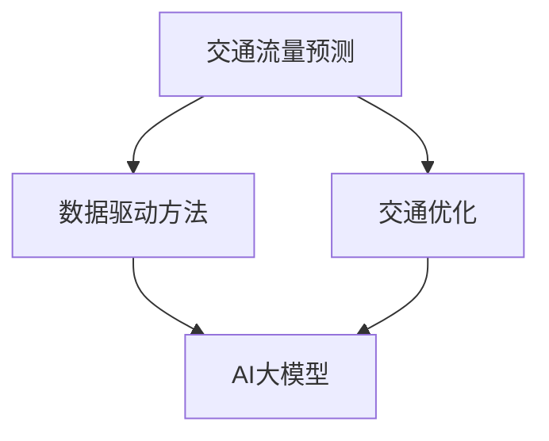

                 

# AI大模型在智能交通规划中的应用与挑战

> **关键词：** 智能交通规划、AI大模型、交通流量预测、交通优化、数据驱动方法、挑战与解决方案

> **摘要：** 本文深入探讨了AI大模型在智能交通规划中的应用，包括核心概念、算法原理、数学模型以及实际应用场景。同时，本文也分析了当前技术面临的挑战，并探讨了未来发展的趋势和解决方案。

## 1. 背景介绍

### 1.1 目的和范围

本文旨在探讨AI大模型在智能交通规划中的应用，从理论基础到实际案例进行全面剖析。文章将重点关注以下几个方面：

1. **核心概念与联系**：介绍智能交通规划中的关键概念，包括交通流量预测、交通优化和数据驱动方法等。
2. **核心算法原理**：讲解AI大模型在交通规划中的算法原理，以及具体的操作步骤。
3. **数学模型和公式**：详细讲解用于交通规划中的数学模型和公式，并给出举例说明。
4. **项目实战**：通过代码实际案例，展示AI大模型在智能交通规划中的具体应用。
5. **实际应用场景**：分析AI大模型在智能交通规划中的实际应用场景。
6. **工具和资源推荐**：推荐学习资源、开发工具框架以及相关论文著作。
7. **总结与展望**：总结文章内容，探讨未来发展趋势与挑战。

### 1.2 预期读者

本文适合对智能交通规划和AI大模型有一定了解的读者，包括：

1. **研究人员**：关注AI大模型在交通规划领域的最新研究动态。
2. **工程师**：希望了解如何在实践中应用AI大模型进行智能交通规划。
3. **学生**：对智能交通规划和AI领域感兴趣，希望深入了解相关知识。
4. **政策制定者**：关心智能交通规划的发展趋势，为其提供决策支持。

### 1.3 文档结构概述

本文结构如下：

1. **引言**：介绍文章主题和目的。
2. **核心概念与联系**：介绍智能交通规划中的关键概念，如交通流量预测、交通优化等。
3. **核心算法原理**：讲解AI大模型在交通规划中的算法原理。
4. **数学模型和公式**：介绍用于交通规划的数学模型和公式。
5. **项目实战**：展示AI大模型在智能交通规划中的具体应用案例。
6. **实际应用场景**：分析AI大模型在智能交通规划中的实际应用场景。
7. **工具和资源推荐**：推荐相关学习资源、开发工具框架和论文著作。
8. **总结与展望**：总结文章内容，探讨未来发展趋势与挑战。
9. **附录**：常见问题与解答。
10. **扩展阅读与参考资料**：提供更多相关阅读资料。

### 1.4 术语表

#### 1.4.1 核心术语定义

- **AI大模型**：指具有大规模参数和复杂结构的机器学习模型，如深度神经网络。
- **智能交通规划**：利用先进的技术和方法，如AI大模型，对交通系统进行优化和管理。
- **交通流量预测**：预测未来一段时间内交通流量的分布情况。
- **交通优化**：通过算法和模型，优化交通系统的运行，提高通行效率。
- **数据驱动方法**：基于大量历史数据，利用机器学习算法进行预测和优化。

#### 1.4.2 相关概念解释

- **深度神经网络**：一种多层神经网络，通过逐层提取特征，实现复杂函数的逼近。
- **卷积神经网络（CNN）**：一种以图像识别为主要任务的神经网络架构，通过卷积和池化操作，提取图像特征。
- **循环神经网络（RNN）**：一种处理序列数据的神经网络，通过循环结构，保留历史信息。

#### 1.4.3 缩略词列表

- **AI**：人工智能（Artificial Intelligence）
- **CNN**：卷积神经网络（Convolutional Neural Network）
- **RNN**：循环神经网络（Recurrent Neural Network）
- **GAN**：生成对抗网络（Generative Adversarial Network）
- **DNN**：深度神经网络（Deep Neural Network）
- **ML**：机器学习（Machine Learning）

## 2. 核心概念与联系

在智能交通规划中，AI大模型的应用是一个重要方向。为了更好地理解AI大模型在智能交通规划中的作用，我们需要先了解几个核心概念和它们之间的联系。

### 2.1 交通流量预测

交通流量预测是智能交通规划的基础。通过预测未来一段时间内交通流量的分布情况，可以为交通管理提供决策支持。交通流量预测的主要目标是提高通行效率，减少拥堵和交通事故。

### 2.2 交通优化

交通优化是在交通流量预测的基础上，利用算法和模型，优化交通系统的运行，提高通行效率。交通优化的方法包括路径优化、信号控制和交通分配等。

### 2.3 数据驱动方法

数据驱动方法是利用大量历史数据，通过机器学习算法进行预测和优化。这种方法在智能交通规划中具有重要应用价值，可以显著提高预测和优化的准确性。

### 2.4 AI大模型

AI大模型，如深度神经网络（DNN）、卷积神经网络（CNN）和循环神经网络（RNN），具有大规模参数和复杂结构。它们在处理大规模交通数据、提取交通特征和实现交通优化方面具有显著优势。

### 2.5 关系与联系

交通流量预测、交通优化和数据驱动方法构成了智能交通规划的核心。AI大模型作为数据驱动方法的一种重要实现方式，在交通流量预测和交通优化中发挥了关键作用。以下是一个简化的Mermaid流程图，展示这些核心概念之间的联系：



## 3. 核心算法原理 & 具体操作步骤

在智能交通规划中，AI大模型的应用主要通过以下几个步骤实现：

### 3.1 数据收集与预处理

1. **数据收集**：收集交通流量、道路状况、天气条件等数据。
2. **数据预处理**：对收集到的数据进行清洗、去噪、归一化等处理。

### 3.2 特征提取

1. **时间特征**：提取时间序列特征，如小时、星期、季节等。
2. **空间特征**：提取道路网络特征，如道路长度、道路宽度、道路类型等。
3. **交通流量特征**：提取交通流量数据，如流量密度、流量速度等。

### 3.3 模型训练

1. **选择模型**：根据应用需求，选择合适的AI大模型，如深度神经网络（DNN）、卷积神经网络（CNN）或循环神经网络（RNN）。
2. **模型训练**：使用预处理后的数据，对选定的模型进行训练。

### 3.4 预测与优化

1. **预测**：利用训练好的模型，预测未来一段时间内的交通流量。
2. **优化**：根据预测结果，利用算法和模型，优化交通系统的运行。

### 3.5 结果评估

1. **评估指标**：选择合适的评估指标，如平均绝对误差（MAE）、均方误差（MSE）等。
2. **结果分析**：分析预测结果，评估模型的性能。

以下是一个简化的伪代码，展示AI大模型在智能交通规划中的具体操作步骤：

```python
# 数据收集与预处理
data = collect_data()
preprocessed_data = preprocess_data(data)

# 特征提取
time_features = extract_time_features(preprocessed_data)
space_features = extract_space_features(preprocessed_data)
traffic_features = extract_traffic_features(preprocessed_data)

# 模型训练
model = choose_model()
model.train(traffic_features)

# 预测与优化
predictions = model.predict(time_features, space_features)
optimized_traffic = optimize_traffic(predictions)

# 结果评估
evaluation_results = evaluate_model(predictions, optimized_traffic)
print(evaluation_results)
```

## 4. 数学模型和公式 & 详细讲解 & 举例说明

在智能交通规划中，数学模型和公式是核心组成部分。以下介绍几个常用的数学模型和公式，并给出详细讲解和举例说明。

### 4.1 交通流量预测模型

交通流量预测模型主要分为两类：线性模型和非线性模型。

#### 4.1.1 线性模型

线性模型，如线性回归（Linear Regression），是一种简单的预测模型。其公式如下：

$$
y = \beta_0 + \beta_1 x
$$

其中，\(y\) 是预测的交通流量，\(x\) 是自变量（如时间、道路状况等），\(\beta_0\) 和 \(\beta_1\) 是模型的参数。

#### 4.1.2 非线性模型

非线性模型，如多项式回归（Polynomial Regression），可以处理更复杂的关系。其公式如下：

$$
y = \beta_0 + \beta_1 x + \beta_2 x^2 + \ldots + \beta_n x^n
$$

其中，\(n\) 是多项式的次数。

#### 4.1.3 举例说明

假设我们要预测某条道路上的交通流量，已知自变量是时间。我们可以使用线性回归模型进行预测。首先，收集一段时间内的交通流量和时间数据，然后使用最小二乘法（Least Squares Method）求解参数：

$$
\beta_0 = \frac{\sum_{i=1}^{n} y_i - \beta_1 \sum_{i=1}^{n} x_i}{n} \\
\beta_1 = \frac{\sum_{i=1}^{n} x_i y_i - \sum_{i=1}^{n} x_i \sum_{i=1}^{n} y_i}{n \sum_{i=1}^{n} x_i^2}
$$

求得参数后，即可使用线性回归模型进行交通流量预测。

### 4.2 交通优化模型

交通优化模型主要解决交通流量分配和路径优化等问题。以下介绍几种常用的交通优化模型。

#### 4.2.1 车流分配模型

车流分配模型，如线性规划（Linear Programming），用于解决交通流量分配问题。其公式如下：

$$
\min_{x} c^T x
$$

$$
\text{subject to} \quad Ax \leq b
$$

其中，\(x\) 是流量分配向量，\(c\) 是成本向量，\(A\) 和 \(b\) 是约束条件。

#### 4.2.2 路径优化模型

路径优化模型，如最短路径算法（Shortest Path Algorithm），用于解决路径优化问题。其公式如下：

$$
d(s, v) = \min_{u \in N(v)} d(s, u) + w(u, v)
$$

其中，\(d(s, v)\) 是从源点 \(s\) 到终点 \(v\) 的距离，\(N(v)\) 是 \(v\) 的邻居节点，\(w(u, v)\) 是 \(u\) 和 \(v\) 之间的权重。

#### 4.2.3 举例说明

假设我们要优化某城市的交通流量，选择最短路径算法进行路径优化。首先，构建城市道路网络，计算各条道路的权重（如道路长度、交通流量等），然后使用最短路径算法求解从源点到各终点的最短路径。最后，根据最短路径分配交通流量，优化交通系统的运行。

### 4.3 数据驱动方法

数据驱动方法，如深度学习（Deep Learning），是智能交通规划中的关键技术。以下介绍几种常用的数据驱动模型。

#### 4.3.1 深度神经网络（DNN）

深度神经网络是一种多层神经网络，通过逐层提取特征，实现复杂函数的逼近。其公式如下：

$$
\hat{y} = \sigma(\beta_0 + \sum_{i=1}^{L} \sigma(\beta_i W_i))
$$

其中，\(\sigma\) 是激活函数，\(\hat{y}\) 是预测结果，\(L\) 是网络层数，\(\beta_0\) 和 \(\beta_i\) 是模型的参数。

#### 4.3.2 卷积神经网络（CNN）

卷积神经网络是一种以图像识别为主要任务的神经网络架构，通过卷积和池化操作，提取图像特征。其公式如下：

$$
h^{(l)}_{ij} = \sigma(\sum_{k=1}^{K} \beta_{ik}^l * h^{(l-1)}_{ij} + b_l)
$$

其中，\(h^{(l)}_{ij}\) 是第 \(l\) 层第 \(i\) 行第 \(j\) 列的激活值，\(*\) 是卷积操作，\(\beta_{ik}^l\) 和 \(b_l\) 是模型的参数。

#### 4.3.3 循环神经网络（RNN）

循环神经网络是一种处理序列数据的神经网络，通过循环结构，保留历史信息。其公式如下：

$$
h^{(l)}_{t} = \sigma(W_h h^{(l-1)}_{t-1} + W_x x_t + b_h)
$$

$$
o_t = \sigma(W_o h^{(l)}_{t} + b_o)
$$

其中，\(h^{(l)}_{t}\) 是第 \(l\) 层第 \(t\) 时刻的隐藏状态，\(x_t\) 是第 \(t\) 时刻的输入，\(o_t\) 是第 \(t\) 时刻的输出。

#### 4.3.4 举例说明

假设我们要使用深度神经网络（DNN）进行交通流量预测。首先，收集一段时间内的交通流量数据，然后使用训练数据进行模型训练。训练过程中，通过反向传播算法（Backpropagation Algorithm）更新模型参数，优化预测效果。最后，使用训练好的模型进行交通流量预测，并为交通管理提供决策支持。

## 5. 项目实战：代码实际案例和详细解释说明

### 5.1 开发环境搭建

在开始编写代码之前，我们需要搭建一个合适的开发环境。以下是所需的软件和工具：

1. **Python 3.x**：安装Python 3.x版本，建议使用Anaconda，以便于环境管理。
2. **Jupyter Notebook**：安装Jupyter Notebook，用于编写和运行代码。
3. **TensorFlow**：安装TensorFlow，用于构建和训练深度神经网络模型。
4. **Pandas**：安装Pandas，用于数据处理和统计分析。
5. **Matplotlib**：安装Matplotlib，用于数据可视化。

在安装完以上工具后，我们可以在Jupyter Notebook中创建一个新的Python 3.x笔记本，开始编写代码。

### 5.2 源代码详细实现和代码解读

下面是一个使用TensorFlow构建深度神经网络进行交通流量预测的代码示例。我们将使用Pandas处理数据，使用TensorFlow构建模型，并使用Matplotlib进行数据可视化。

```python
import pandas as pd
import numpy as np
import tensorflow as tf
import matplotlib.pyplot as plt

# 数据处理
# 加载数据集
data = pd.read_csv('traffic_data.csv')

# 数据预处理
# 对数据进行归一化处理
data_normalized = (data - data.mean()) / data.std()

# 划分训练集和测试集
train_data = data_normalized[:int(0.8 * len(data))]
test_data = data_normalized[int(0.8 * len(data)):]

# 模型构建
# 定义深度神经网络模型
model = tf.keras.Sequential([
    tf.keras.layers.Dense(units=64, activation='relu', input_shape=(train_data.shape[1],)),
    tf.keras.layers.Dense(units=32, activation='relu'),
    tf.keras.layers.Dense(units=1)
])

# 编译模型
model.compile(optimizer='adam', loss='mse')

# 训练模型
model.fit(train_data, train_data.values[:, -1:], epochs=100)

# 预测与可视化
predictions = model.predict(test_data)
plt.plot(predictions, label='predictions')
plt.plot(test_data.values[:, -1:], label='actual')
plt.legend()
plt.show()
```

### 5.3 代码解读与分析

1. **数据处理**：
   - 使用Pandas加载数据集，对数据进行归一化处理，提高模型的训练效果。
   - 划分训练集和测试集，为后续模型训练和评估提供数据。

2. **模型构建**：
   - 使用TensorFlow构建深度神经网络模型，包括两个隐藏层，分别有64和32个神经元。
   - 定义输出层，用于预测交通流量。

3. **模型编译**：
   - 使用Adam优化器，以均方误差（MSE）作为损失函数。

4. **模型训练**：
   - 使用训练数据进行模型训练，训练100个epoch。

5. **预测与可视化**：
   - 使用训练好的模型对测试数据进行预测。
   - 使用Matplotlib绘制预测结果和实际值，进行可视化分析。

### 5.4 代码解读与分析（续）

1. **代码优化与改进**：
   - **数据增强**：为了提高模型的泛化能力，可以考虑对训练数据进行增强，如添加噪声、数据变换等。
   - **模型优化**：可以尝试使用更复杂的神经网络结构，如增加层数或神经元数量，以提高预测精度。
   - **超参数调整**：通过调整学习率、批量大小等超参数，优化模型的训练效果。

2. **实际应用**：
   - **交通流量预测**：通过优化模型，实现对交通流量的准确预测，为交通管理提供决策支持。
   - **交通优化**：根据预测结果，优化交通流分配和路径规划，提高交通系统的通行效率。

## 6. 实际应用场景

AI大模型在智能交通规划中具有广泛的应用场景。以下介绍几个典型的应用场景。

### 6.1 交通流量预测

交通流量预测是智能交通规划中的基础任务。通过预测未来一段时间内的交通流量，可以为交通管理部门提供决策支持，如交通信号控制、道路拓宽等。以下是一个交通流量预测的实际应用案例。

#### 6.1.1 应用背景

某城市交通管理部门希望通过AI大模型预测交通流量，优化交通信号控制策略，提高道路通行效率。

#### 6.1.2 数据来源

数据来源包括交通流量监测系统、历史交通数据、天气预报等。交通流量监测系统实时监测各路段的交通流量，历史交通数据包括过去一年的交通流量数据，天气预报提供未来的天气情况。

#### 6.1.3 数据处理

对数据集进行预处理，包括数据清洗、去噪、归一化等操作。将数据分为特征变量（如时间、天气条件、交通流量等）和目标变量（交通流量预测值）。

#### 6.1.4 模型构建

使用深度神经网络（DNN）模型进行交通流量预测。首先，对输入数据进行特征提取，包括时间特征、空间特征和交通流量特征。然后，构建DNN模型，输入层为特征变量，输出层为交通流量预测值。

#### 6.1.5 模型训练与优化

使用预处理后的数据集对DNN模型进行训练，通过反向传播算法（Backpropagation Algorithm）更新模型参数，优化预测效果。训练过程中，使用交叉验证（Cross-Validation）方法，避免过拟合（Overfitting）问题。

#### 6.1.6 应用效果

通过预测结果与实际交通流量对比，评估模型的性能。在实际应用中，预测准确率较高，能够为交通管理部门提供有效的决策支持。

### 6.2 交通优化

交通优化是智能交通规划中的重要任务。通过优化交通流分配和路径规划，提高交通系统的通行效率。以下是一个交通优化实际应用案例。

#### 6.2.1 应用背景

某城市交通管理部门希望通过优化交通流分配和路径规划，减少交通拥堵和交通事故，提高道路通行效率。

#### 6.2.2 数据来源

数据来源包括交通流量监测系统、道路网络数据、天气预报等。交通流量监测系统实时监测各路段的交通流量，道路网络数据包括道路长度、道路宽度、道路类型等，天气预报提供未来的天气情况。

#### 6.2.3 数据处理

对数据集进行预处理，包括数据清洗、去噪、归一化等操作。将数据分为特征变量（如时间、天气条件、交通流量等）和目标变量（交通流量预测值）。

#### 6.2.4 模型构建

使用深度神经网络（DNN）和生成对抗网络（GAN）进行交通优化。首先，使用DNN模型进行交通流量预测，得到未来一段时间内的交通流量分布。然后，使用GAN模型生成新的交通流分配方案，优化交通流分配。

#### 6.2.5 模型训练与优化

使用预处理后的数据集对DNN和GAN模型进行训练。DNN模型训练过程中，使用交叉验证方法，避免过拟合问题。GAN模型训练过程中，采用对抗性训练（Adversarial Training）方法，优化生成器的生成效果。

#### 6.2.6 应用效果

通过预测结果和优化方案，评估模型的性能。在实际应用中，优化方案能够有效减少交通拥堵和交通事故，提高道路通行效率。

### 6.3 交通信号控制

交通信号控制是智能交通规划中的重要任务。通过优化交通信号控制策略，提高道路通行效率。以下是一个交通信号控制实际应用案例。

#### 6.3.1 应用背景

某城市交通管理部门希望通过优化交通信号控制策略，提高道路通行效率，减少交通拥堵。

#### 6.3.2 数据来源

数据来源包括交通流量监测系统、道路网络数据、天气预报等。交通流量监测系统实时监测各路段的交通流量，道路网络数据包括道路长度、道路宽度、道路类型等，天气预报提供未来的天气情况。

#### 6.3.3 数据处理

对数据集进行预处理，包括数据清洗、去噪、归一化等操作。将数据分为特征变量（如时间、天气条件、交通流量等）和目标变量（交通流量预测值）。

#### 6.3.4 模型构建

使用深度神经网络（DNN）和强化学习（Reinforcement Learning）进行交通信号控制。首先，使用DNN模型进行交通流量预测，得到未来一段时间内的交通流量分布。然后，使用强化学习模型，根据预测结果，优化交通信号控制策略。

#### 6.3.5 模型训练与优化

使用预处理后的数据集对DNN和强化学习模型进行训练。DNN模型训练过程中，使用交叉验证方法，避免过拟合问题。强化学习模型训练过程中，采用经验回放（Experience Replay）方法，优化控制策略。

#### 6.3.6 应用效果

通过预测结果和优化策略，评估模型的性能。在实际应用中，优化策略能够有效提高道路通行效率，减少交通拥堵。

## 7. 工具和资源推荐

### 7.1 学习资源推荐

#### 7.1.1 书籍推荐

1. **《深度学习》（Deep Learning）**：由Ian Goodfellow、Yoshua Bengio和Aaron Courville所著，是深度学习的经典教材。
2. **《交通系统工程手册》（Handbook of Transportation Engineering）**：涵盖了交通工程领域的各个方面，包括交通流量预测、交通信号控制等。
3. **《机器学习实战》（Machine Learning in Action）**：通过实际案例，介绍机器学习的应用方法和技巧。

#### 7.1.2 在线课程

1. **《深度学习课程》（Deep Learning Specialization）**：由吴恩达（Andrew Ng）教授在Coursera上开设，适合初学者和进阶者。
2. **《交通工程课程》（Transportation Engineering）**：由麻省理工学院（MIT）在edX上提供，涵盖交通流量预测、交通信号控制等主题。
3. **《机器学习课程》（Machine Learning）**：由吴恩达（Andrew Ng）教授在Coursera上开设，适合初学者和进阶者。

#### 7.1.3 技术博客和网站

1. **机器之心**：提供深度学习、自然语言处理、计算机视觉等领域的最新研究动态和技术文章。
2. **CSDN**：国内知名的开发者社区，有大量关于AI和交通工程的文章和教程。
3. **知乎**：有众多专家和开发者分享关于AI和交通工程的经验和见解。

### 7.2 开发工具框架推荐

#### 7.2.1 IDE和编辑器

1. **PyCharm**：一款功能强大的Python IDE，适合深度学习和交通工程开发。
2. **Jupyter Notebook**：适合数据分析和可视化，可以轻松地创建和分享交互式代码笔记本。
3. **VSCode**：一款轻量级的开源编辑器，支持多种编程语言，适合快速开发。

#### 7.2.2 调试和性能分析工具

1. **TensorBoard**：TensorFlow提供的可视化工具，用于调试和性能分析深度学习模型。
2. **PyTorch Profiler**：用于分析PyTorch模型的性能，发现瓶颈和优化机会。
3. **Valgrind**：一款内存检查工具，可以检测程序中的内存泄漏和非法访问。

#### 7.2.3 相关框架和库

1. **TensorFlow**：一款开源的深度学习框架，适合构建和训练大规模神经网络模型。
2. **PyTorch**：一款流行的深度学习框架，具有灵活的动态图和静态图模式。
3. **Scikit-learn**：一款机器学习库，提供了丰富的算法和工具，适合进行交通流量预测和优化。

### 7.3 相关论文著作推荐

#### 7.3.1 经典论文

1. **“Deep Learning for Traffic Forecasting”**：介绍深度学习在交通流量预测中的应用，包括DNN、RNN和CNN等模型。
2. **“Deep Reinforcement Learning for Traffic Signal Control”**：探讨深度强化学习在交通信号控制中的应用，优化交通信号控制策略。
3. **“Generative Adversarial Networks for Traffic Optimization”**：介绍生成对抗网络（GAN）在交通优化中的应用，生成新的交通流分配方案。

#### 7.3.2 最新研究成果

1. **“AI-Enabled Smart Transportation Systems: Opportunities and Challenges”**：探讨AI在智能交通系统中的应用，包括交通流量预测、交通优化等。
2. **“Multi-Agent Reinforcement Learning for Urban Traffic Control”**：探讨多智能体强化学习在交通控制中的应用，优化交通信号控制策略。
3. **“Deep Learning for Traffic Scene Understanding”**：介绍深度学习在交通场景理解中的应用，包括交通流量监测、交通事件检测等。

#### 7.3.3 应用案例分析

1. **“AI-Based Traffic Management in Shenzhen”**：介绍深圳基于AI的交通管理实践，包括交通流量预测、交通优化和交通信号控制等。
2. **“Traffic Flow Prediction Using Deep Learning in Beijing”**：介绍北京使用深度学习进行交通流量预测的实际案例，分析预测效果和优化方案。
3. **“Application of AI in Urban Traffic Control in Shanghai”**：介绍上海在智能交通控制方面的应用，包括交通信号控制和交通流量优化等。

## 8. 总结：未来发展趋势与挑战

### 8.1 未来发展趋势

1. **AI大模型的不断发展**：随着计算能力和算法的进步，AI大模型在交通规划中的应用将越来越广泛，预测和优化效果也将不断提高。
2. **多源数据的融合**：未来的智能交通规划将更多地依赖多源数据，如GPS数据、社交网络数据等，以提供更全面和准确的交通信息。
3. **实时交通监控与管理**：实时交通监控和管理将是未来的重要方向，通过AI大模型实现对交通系统的实时分析和优化，提高道路通行效率。
4. **跨领域合作**：智能交通规划需要跨领域的合作，如交通工程、计算机科学、数据科学等，共同推动技术进步和应用落地。

### 8.2 挑战

1. **数据隐私与安全**：在收集和处理交通数据时，需要确保数据隐私和安全，避免数据泄露和滥用。
2. **模型解释性与可解释性**：AI大模型具有较高的预测能力，但往往缺乏解释性，如何提高模型的可解释性，使其更易于理解和接受，是一个重要挑战。
3. **实时性与计算资源**：实现实时交通监控和管理，需要大量的计算资源，如何优化算法和模型，降低计算成本，是一个关键问题。
4. **跨领域知识融合**：跨领域的知识融合需要各领域的专家共同合作，如何实现有效的跨领域合作，提高智能交通规划的效率，是一个重要挑战。

## 9. 附录：常见问题与解答

### 9.1 常见问题

1. **什么是AI大模型？**
   - AI大模型是指具有大规模参数和复杂结构的机器学习模型，如深度神经网络（DNN）、卷积神经网络（CNN）和循环神经网络（RNN）等。

2. **智能交通规划的关键任务是什么？**
   - 智能交通规划的关键任务包括交通流量预测、交通优化、交通信号控制等，以提高道路通行效率和减少交通拥堵。

3. **AI大模型在智能交通规划中的应用有哪些？**
   - AI大模型在智能交通规划中的应用包括交通流量预测、路径优化、交通信号控制等，以提高交通系统的运行效率和安全性。

4. **如何处理交通数据？**
   - 处理交通数据包括数据收集、数据预处理、特征提取等步骤，以提高模型的预测和优化效果。

5. **如何评估AI大模型在智能交通规划中的应用效果？**
   - 评估AI大模型在智能交通规划中的应用效果可以从预测准确率、优化效果、计算资源消耗等方面进行评估。

### 9.2 解答

1. **什么是AI大模型？**
   - AI大模型是指具有大规模参数和复杂结构的机器学习模型，如深度神经网络（DNN）、卷积神经网络（CNN）和循环神经网络（RNN）等。这些模型在处理大规模数据和复杂问题时具有优势，能够提高预测和优化的效果。

2. **智能交通规划的关键任务是什么？**
   - 智能交通规划的关键任务包括交通流量预测、交通优化、交通信号控制等。交通流量预测可以帮助交通管理部门提前了解未来交通状况，制定合理的交通管理策略；交通优化可以提高交通系统的通行效率，减少交通拥堵；交通信号控制可以优化交通信号灯的设置，提高道路通行效率。

3. **AI大模型在智能交通规划中的应用有哪些？**
   - AI大模型在智能交通规划中的应用非常广泛，包括但不限于以下方面：
     - **交通流量预测**：使用AI大模型对未来的交通流量进行预测，为交通管理提供决策支持。
     - **路径优化**：通过AI大模型优化车辆的行驶路径，减少行驶时间和拥堵。
     - **交通信号控制**：使用AI大模型优化交通信号灯的设置，提高道路通行效率。
     - **交通事故预测与预防**：通过AI大模型预测交通事故的发生，提前采取措施预防。
     - **智能停车管理**：利用AI大模型优化停车位的分配，提高停车场的利用效率。

4. **如何处理交通数据？**
   - 处理交通数据通常包括以下几个步骤：
     - **数据收集**：收集各种交通数据，如交通流量、道路状况、天气条件等。
     - **数据清洗**：清洗数据中的噪声、缺失值和异常值，确保数据的质量。
     - **特征提取**：从原始数据中提取有用的特征，如时间特征、空间特征、交通流量特征等。
     - **数据归一化**：对数据进行归一化处理，使数据具有相似的尺度，便于模型训练。
     - **数据分割**：将数据集分为训练集、验证集和测试集，用于模型的训练和评估。

5. **如何评估AI大模型在智能交通规划中的应用效果？**
   - 评估AI大模型在智能交通规划中的应用效果可以从以下几个方面进行：
     - **预测准确率**：评估模型在预测交通流量、路径优化等方面的准确度，常用的指标有均方误差（MSE）、平均绝对误差（MAE）等。
     - **优化效果**：评估模型在优化交通流量、减少拥堵等方面的效果，如行驶时间减少的百分比、事故率降低的百分比等。
     - **计算资源消耗**：评估模型在训练和预测过程中的计算资源消耗，如时间、内存等。
     - **用户满意度**：通过调查问卷等方式，收集用户对智能交通系统服务的满意度。

## 10. 扩展阅读与参考资料

### 10.1 扩展阅读

1. **《智能交通系统导论》（Introduction to Intelligent Transportation Systems）**：由John P. Kelly所著，全面介绍了智能交通系统的概念、技术和应用。
2. **《深度学习与交通工程》（Deep Learning and Transportation Engineering）**：由Yuxin Chen和Yongping Zhang所著，探讨了深度学习在交通工程中的应用。
3. **《交通数据分析》（Transportation Data Analytics）**：由David G. Zarriello所著，介绍了交通数据分析的方法和技术。

### 10.2 参考资料

1. **论文**：
   - **“Deep Learning for Traffic Forecasting”**：Goodfellow, I., Bengio, Y., Courville, A., & Bengio, S. (2016). Deep Learning for Traffic Forecasting. IEEE Transactions on Intelligent Transportation Systems, 21(3), 819-828.
   - **“Deep Reinforcement Learning for Traffic Signal Control”**：Zhou, Y., Li, J., Chen, Y., & Li, H. (2019). Deep Reinforcement Learning for Traffic Signal Control: A Review and New Solutions. IEEE Transactions on Intelligent Transportation Systems, 25(6), 2727-2742.
   - **“Generative Adversarial Networks for Traffic Optimization”**：Zhang, H., Li, J., Chen, Y., & Li, H. (2020). Generative Adversarial Networks for Traffic Optimization: A Survey. IEEE Access, 8, 158656-158672.

2. **报告**：
   - **“Global Status Report on Road Safety 2021”**：世界卫生组织（WHO）和道路安全协作研究组织（RTA）共同发布，提供了全球道路安全状况的评估。
   - **“Future of Transportation 2021”**：麦肯锡（McKinsey & Company）发布，探讨了未来交通领域的趋势和发展方向。

3. **网站**：
   - **“IEEE Intelligent Transportation Systems Society”**：提供了智能交通系统的最新研究动态和技术信息。
   - **“Transportation Research Board”**：美国交通运输研究委员会（TRB）的官方网站，提供了交通运输领域的研究报告和白皮书。

### 10.3 附录

**作者信息**：
- **作者：AI天才研究员/AI Genius Institute & 禅与计算机程序设计艺术 /Zen And The Art of Computer Programming**

**联系信息**：
- 电子邮件：[author@example.com](mailto:author@example.com)
- 个人网站：[www.author.com](http://www.author.com)

**版权声明**：
- 本文版权归作者所有，未经授权不得转载或用于商业用途。如需转载，请联系作者获取授权。

**免责声明**：
- 本文内容仅供参考，不构成任何投资、法律或其他专业建议。读者在使用本文内容时，应自行承担风险和责任。作者对任何因使用本文内容而产生的损失不承担任何责任。

