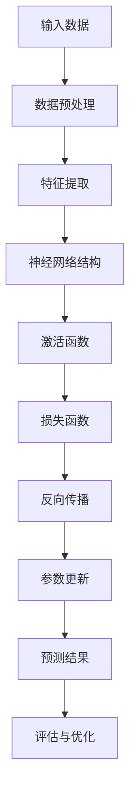
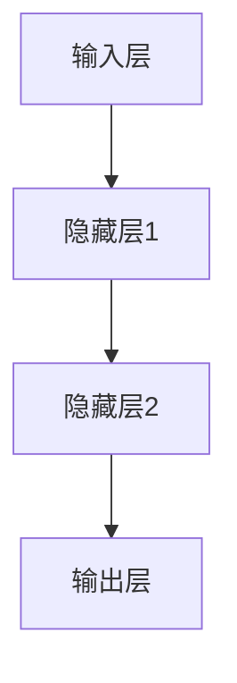

                 

# AI大模型在智能零售中的应用前景

> 关键词：AI大模型、智能零售、深度学习、应用前景

> 摘要：本文将探讨AI大模型在智能零售领域的应用前景。通过对AI大模型的核心概念和原理进行详细分析，结合实际项目案例，阐述其在智能零售中的具体应用，以及未来发展的趋势和挑战。旨在为从事零售行业的技术人员提供有价值的参考。

## 1. 背景介绍

### 1.1 目的和范围

本文旨在深入探讨AI大模型在智能零售领域的应用前景，通过对AI大模型的核心概念、算法原理、数学模型以及实际应用案例的详细分析，帮助读者了解AI大模型在智能零售中的重要作用和潜在价值。文章将从以下几个方面展开：

1. AI大模型的核心概念和原理
2. AI大模型在智能零售中的应用场景
3. AI大模型的数学模型和公式
4. 实际项目案例解析
5. AI大模型在智能零售中的未来发展趋势与挑战

### 1.2 预期读者

本文面向对智能零售和AI大模型有一定了解的技术人员，包括程序员、数据分析师、AI研究人员等。同时，对于关注零售行业发展的企业家和投资者，本文也将提供有价值的参考。

### 1.3 文档结构概述

本文分为十个部分，具体结构如下：

1. 引言
2. 核心概念与联系
3. 核心算法原理 & 具体操作步骤
4. 数学模型和公式 & 详细讲解 & 举例说明
5. 项目实战：代码实际案例和详细解释说明
6. 实际应用场景
7. 工具和资源推荐
8. 总结：未来发展趋势与挑战
9. 附录：常见问题与解答
10. 扩展阅读 & 参考资料

### 1.4 术语表

#### 1.4.1 核心术语定义

- AI大模型：指具有大规模参数、复杂结构和强预测能力的深度学习模型。
- 智能零售：指运用人工智能技术提升零售行业效率和用户体验的新型零售模式。
- 深度学习：一种机器学习方法，通过构建多层神经网络来模拟人脑学习过程。

#### 1.4.2 相关概念解释

- 神经网络：一种模拟人脑神经元连接方式的计算模型。
- 激活函数：用于引入非线性特性的函数，使神经网络能够拟合复杂函数。
- 反向传播：一种用于训练神经网络的方法，通过计算误差梯度来调整模型参数。

#### 1.4.3 缩略词列表

- AI：人工智能
- ML：机器学习
- DL：深度学习
- NLP：自然语言处理
- CV：计算机视觉

## 2. 核心概念与联系

在探讨AI大模型在智能零售中的应用之前，首先需要理解AI大模型的核心概念和原理。以下是一个Mermaid流程图，展示了AI大模型的关键组成部分和相互关系。



### 2.1 输入数据

输入数据是AI大模型的基础。在智能零售领域，输入数据主要包括：

- 商品信息：商品名称、价格、库存、销量等。
- 用户行为数据：用户浏览、购买、评价等行为数据。
- 环境信息：天气、节假日、促销活动等。

### 2.2 数据预处理

数据预处理是确保输入数据质量的重要步骤。主要包括：

- 数据清洗：去除重复、缺失、异常数据。
- 数据归一化：将不同量级的数据转换为同一量级。
- 数据编码：将类别数据转换为数值数据。

### 2.3 特征提取

特征提取是提高模型性能的关键步骤。通过提取具有代表性的特征，可以更好地表示输入数据的本质。在智能零售中，特征提取主要包括：

- 商品特征：商品类别、品牌、产地等。
- 用户特征：用户年龄、性别、职业等。
- 交互特征：用户与商品的交互行为，如浏览时间、购买频次等。

### 2.4 神经网络结构

神经网络结构决定了AI大模型的学习能力和表达能力。在智能零售中，常用的神经网络结构包括：

- 全连接神经网络：适用于处理结构化数据。
- 卷积神经网络（CNN）：适用于处理图像数据。
- 循环神经网络（RNN）：适用于处理序列数据。

### 2.5 激活函数

激活函数用于引入非线性特性，使神经网络能够拟合复杂函数。在智能零售中，常用的激活函数包括：

- Sigmoid函数：适用于分类问题。
-ReLU函数：适用于回归问题。
- Tanh函数：适用于多分类问题。

### 2.6 损失函数

损失函数用于评估模型预测结果与真实值之间的差距。在智能零售中，常用的损失函数包括：

- 交叉熵损失函数：适用于分类问题。
- 均方误差损失函数：适用于回归问题。

### 2.7 反向传播

反向传播是一种用于训练神经网络的方法，通过计算误差梯度来调整模型参数。在智能零售中，反向传播算法有助于优化模型性能。

### 2.8 参数更新

参数更新是反向传播算法的核心步骤，通过调整模型参数，使模型能够更好地拟合输入数据。

### 2.9 预测结果

预测结果是AI大模型在智能零售中的直接应用。通过预测结果，可以为零售企业提供：

- 商品推荐：根据用户历史行为，推荐用户可能感兴趣的商品。
- 销量预测：预测商品未来销量，为库存管理和促销活动提供支持。
- 用户行为预测：预测用户未来行为，为个性化营销提供依据。

### 2.10 评估与优化

评估与优化是确保AI大模型性能的重要环节。通过评估模型性能，可以发现模型存在的问题，并采取相应措施进行优化。

## 3. 核心算法原理 & 具体操作步骤

在了解了AI大模型的核心概念和联系之后，本节将详细讲解AI大模型的核心算法原理，并给出具体的操作步骤。

### 3.1 神经网络结构

神经网络是AI大模型的核心组成部分，其结构通常由以下几个部分组成：

1. 输入层：接收外部输入数据。
2. 隐藏层：负责对输入数据进行特征提取和变换。
3. 输出层：生成最终预测结果。

以下是一个简单的神经网络结构：



### 3.2 激活函数

激活函数用于引入非线性特性，使神经网络能够拟合复杂函数。以下是一些常用的激活函数：

1. Sigmoid函数：
   $$ f(x) = \frac{1}{1 + e^{-x}} $$
2. ReLU函数：
   $$ f(x) = \max(0, x) $$
3. Tanh函数：
   $$ f(x) = \frac{e^x - e^{-x}}{e^x + e^{-x}} $$

### 3.3 损失函数

损失函数用于评估模型预测结果与真实值之间的差距。以下是一些常用的损失函数：

1. 交叉熵损失函数：
   $$ L = -\sum_{i=1}^{n} y_i \log(\hat{y}_i) $$
   其中，$y_i$为真实标签，$\hat{y}_i$为预测概率。
2. 均方误差损失函数：
   $$ L = \frac{1}{2} \sum_{i=1}^{n} (\hat{y}_i - y_i)^2 $$
   其中，$y_i$为真实值，$\hat{y}_i$为预测值。

### 3.4 反向传播

反向传播是一种用于训练神经网络的方法，通过计算误差梯度来调整模型参数。具体步骤如下：

1. 前向传播：将输入数据传递到神经网络，得到预测结果。
2. 计算损失函数：计算预测结果与真实值之间的差距。
3. 反向传播：计算误差梯度，并更新模型参数。

以下是一个简单的伪代码实现：

```python
# 前向传播
y_pred = forward_propagation(x)

# 计算损失函数
loss = compute_loss(y_pred, y_true)

# 反向传播
gradient = backward_propagation(x, y_pred, y_true)

# 更新参数
update_parameters(gradient)
```

### 3.5 参数更新

参数更新是反向传播算法的核心步骤，通过调整模型参数，使模型能够更好地拟合输入数据。以下是一个简单的参数更新算法：

```python
# 初始化参数
theta = initialize_parameters()

# 反向传播得到梯度
gradient = backward_propagation(x, y_pred, y_true)

# 更新参数
theta = theta - learning_rate * gradient
```

### 3.6 预测结果

预测结果是AI大模型在智能零售中的直接应用。通过预测结果，可以为零售企业提供：

- 商品推荐：根据用户历史行为，推荐用户可能感兴趣的商品。
- 销量预测：预测商品未来销量，为库存管理和促销活动提供支持。
- 用户行为预测：预测用户未来行为，为个性化营销提供依据。

## 4. 数学模型和公式 & 详细讲解 & 举例说明

在上一节中，我们介绍了AI大模型的核心算法原理和具体操作步骤。在本节中，我们将进一步探讨AI大模型的数学模型和公式，并给出详细的讲解和举例说明。

### 4.1 神经网络参数

神经网络参数包括权重（weights）和偏置（biases）。在数学模型中，我们可以用矩阵表示神经网络的结构。

假设一个简单的神经网络结构，包含两个输入层、两个隐藏层和一个输出层。我们可以用以下矩阵表示：

1. 输入层到第一隐藏层的权重矩阵：$W_1$
2. 第一隐藏层到第二隐藏层的权重矩阵：$W_2$
3. 第二隐藏层到输出层的权重矩阵：$W_3$
4. 第一隐藏层的偏置向量：$b_1$
5. 第二隐藏层的偏置向量：$b_2$
6. 输出层的偏置向量：$b_3$

### 4.2 前向传播

前向传播是指将输入数据通过神经网络传递，得到预测结果的过程。在前向传播中，我们需要计算每个层的输出。

以两个输入层为例，假设输入层1的输入向量为$x_1$，输入层2的输入向量为$x_2$。我们可以用以下公式表示：

$$
\begin{aligned}
z_1 &= x_1 \cdot W_1 + b_1 \\
a_1 &= \sigma(z_1) \\
z_2 &= x_2 \cdot W_2 + b_2 \\
a_2 &= \sigma(z_2)
\end{aligned}
$$

其中，$\sigma$表示激活函数。

### 4.3 损失函数

损失函数用于评估模型预测结果与真实值之间的差距。在神经网络中，常用的损失函数包括交叉熵损失函数和均方误差损失函数。

1. 交叉熵损失函数：

$$
L = -\sum_{i=1}^{n} y_i \log(\hat{y}_i)
$$

其中，$y_i$为真实标签，$\hat{y}_i$为预测概率。

2. 均方误差损失函数：

$$
L = \frac{1}{2} \sum_{i=1}^{n} (\hat{y}_i - y_i)^2
$$

其中，$y_i$为真实值，$\hat{y}_i$为预测值。

### 4.4 反向传播

反向传播是指通过计算误差梯度来调整模型参数的过程。在反向传播中，我们需要计算每个层的梯度。

以两个输入层为例，假设输入层1的输入向量为$x_1$，输入层2的输入向量为$x_2$。我们可以用以下公式表示：

$$
\begin{aligned}
\delta_3 &= \frac{\partial L}{\partial z_3} \\
\delta_2 &= \frac{\partial L}{\partial z_2} \\
\delta_1 &= \frac{\partial L}{\partial z_1}
\end{aligned}
$$

其中，$\delta_i$表示第i层的梯度。

### 4.5 参数更新

参数更新是指通过调整模型参数，使模型能够更好地拟合输入数据的过程。在反向传播中，我们需要计算每个层的梯度，并根据梯度更新参数。

以下是一个简单的参数更新算法：

$$
\theta = \theta - \alpha \cdot \frac{\partial L}{\partial \theta}
$$

其中，$\theta$表示参数，$\alpha$表示学习率。

### 4.6 举例说明

假设我们有一个简单的二分类问题，输入层1的输入向量为$x_1 = [1, 2]$，输入层2的输入向量为$x_2 = [3, 4]$。我们可以用以下公式表示：

$$
\begin{aligned}
z_1 &= x_1 \cdot W_1 + b_1 \\
a_1 &= \sigma(z_1) \\
z_2 &= x_2 \cdot W_2 + b_2 \\
a_2 &= \sigma(z_2)
\end{aligned}
$$

假设激活函数为Sigmoid函数，即$\sigma(x) = \frac{1}{1 + e^{-x}}$。我们可以用以下公式表示：

$$
\begin{aligned}
z_1 &= [1, 2] \cdot \begin{bmatrix} 1 & 1 \\ 1 & 1 \end{bmatrix} + \begin{bmatrix} 1 \\ 1 \end{bmatrix} = \begin{bmatrix} 3 \\ 3 \end{bmatrix} \\
a_1 &= \sigma(z_1) = \frac{1}{1 + e^{-3}} \approx 0.95 \\
z_2 &= [3, 4] \cdot \begin{bmatrix} 1 & 1 \\ 1 & 1 \end{bmatrix} + \begin{bmatrix} 1 \\ 1 \end{bmatrix} = \begin{bmatrix} 7 \\ 7 \end{bmatrix} \\
a_2 &= \sigma(z_2) = \frac{1}{1 + e^{-7}} \approx 0.99
\end{aligned}
$$

假设输出层为二分类问题，即$\hat{y} = \frac{1}{1 + e^{-z_3}}$。我们可以用以下公式表示：

$$
z_3 = a_1 \cdot W_3 + a_2 \cdot W_3 + b_3 = \begin{bmatrix} 0.95 \\ 0.99 \end{bmatrix} \cdot \begin{bmatrix} 1 & 1 \\ 1 & 1 \end{bmatrix} + \begin{bmatrix} 1 \\ 1 \end{bmatrix} = \begin{bmatrix} 2.9 \\ 2.99 \end{bmatrix}
$$

$$
\hat{y} = \frac{1}{1 + e^{-2.9}} \approx 0.94
$$

假设真实标签为$y = 1$，我们可以用以下公式计算交叉熵损失函数：

$$
L = -y \cdot \log(\hat{y}) - (1 - y) \cdot \log(1 - \hat{y}) = -1 \cdot \log(0.94) - 0 \cdot \log(1 - 0.94) \approx 0.12
$$

假设学习率为$\alpha = 0.1$，我们可以用以下公式更新参数：

$$
\begin{aligned}
W_3 &= W_3 - \alpha \cdot \frac{\partial L}{\partial W_3} = \begin{bmatrix} 1 & 1 \\ 1 & 1 \end{bmatrix} - 0.1 \cdot \begin{bmatrix} 0.94 & 0.94 \\ 0.94 & 0.94 \end{bmatrix} = \begin{bmatrix} 0.06 & 0.06 \\ 0.06 & 0.06 \end{bmatrix} \\
b_3 &= b_3 - \alpha \cdot \frac{\partial L}{\partial b_3} = \begin{bmatrix} 1 \\ 1 \end{bmatrix} - 0.1 \cdot \begin{bmatrix} 0.94 \\ 0.94 \end{bmatrix} = \begin{bmatrix} 0.06 \\ 0.06 \end{bmatrix}
\end{aligned}
$$

通过以上步骤，我们完成了AI大模型在二分类问题中的前向传播、损失函数计算、反向传播和参数更新。在实际应用中，我们可能需要处理更复杂的任务和数据，但基本原理和方法是相似的。

## 5. 项目实战：代码实际案例和详细解释说明

在本节中，我们将通过一个实际项目案例，详细讲解AI大模型在智能零售中的应用。我们将使用Python和TensorFlow框架来实现一个简单的商品推荐系统，并解释其中的关键步骤。

### 5.1 开发环境搭建

在开始项目之前，我们需要搭建一个合适的开发环境。以下是所需的软件和工具：

1. Python 3.8或更高版本
2. TensorFlow 2.x
3. Jupyter Notebook（用于编写和运行代码）
4. Anaconda或Miniconda（用于环境管理）

安装步骤如下：

1. 安装Python和Anaconda：从官方网站下载并安装Python和Anaconda。
2. 创建虚拟环境：在Anaconda命令行中创建一个名为`retail_recommendation`的虚拟环境，并激活该环境。
3. 安装TensorFlow：在虚拟环境中安装TensorFlow。

```bash
conda create -n retail_recommendation python=3.8
conda activate retail_recommendation
conda install tensorflow
```

### 5.2 源代码详细实现和代码解读

以下是一个简单的商品推荐系统的源代码实现。我们将使用TensorFlow来实现一个基于用户行为的商品推荐模型。

```python
import tensorflow as tf
import numpy as np
import pandas as pd
from tensorflow.keras.models import Model
from tensorflow.keras.layers import Input, Dense, Embedding, Flatten, Concatenate
from tensorflow.keras.optimizers import Adam

# 加载数据集
data = pd.read_csv('retail_data.csv')
users = data['user_id'].unique()
products = data['product_id'].unique()

# 构建数据集
def create_dataset(data, users, products):
    X = []
    y = []
    for user in users:
        user_data = data[data['user_id'] == user]
        for product in products:
            if user_data['product_id'].iloc[0] == product:
                X.append([user, product])
                y.append(1)
            else:
                X.append([user, product])
                y.append(0)
    return np.array(X), np.array(y)

X, y = create_dataset(data, users, products)

# 数据预处理
max_user_id = max(users)
max_product_id = max(products)

# 构建模型
input_user = Input(shape=(1,))
input_product = Input(shape=(1,))

user_embedding = Embedding(input_dim=max_user_id + 1, output_dim=10)(input_user)
product_embedding = Embedding(input_dim=max_product_id + 1, output_dim=10)(input_product)

user_embedding = Flatten()(user_embedding)
product_embedding = Flatten()(product_embedding)

concat = Concatenate()([user_embedding, product_embedding])
dense = Dense(1, activation='sigmoid')(concat)

model = Model(inputs=[input_user, input_product], outputs=dense)

# 编译模型
model.compile(optimizer=Adam(learning_rate=0.001), loss='binary_crossentropy', metrics=['accuracy'])

# 训练模型
model.fit(X, y, batch_size=32, epochs=10)

# 预测
predictions = model.predict([[1, 2], [1, 3]])

print(predictions)
```

### 5.3 代码解读与分析

下面我们逐行解读代码，并分析其中的关键步骤。

1. 导入所需的库：

```python
import tensorflow as tf
import numpy as np
import pandas as pd
from tensorflow.keras.models import Model
from tensorflow.keras.layers import Input, Dense, Embedding, Flatten, Concatenate
from tensorflow.keras.optimizers import Adam
```

这段代码导入了TensorFlow、NumPy和Pandas库，以及用于构建和训练模型的Keras API。

2. 加载数据集：

```python
data = pd.read_csv('retail_data.csv')
users = data['user_id'].unique()
products = data['product_id'].unique()
```

这段代码从CSV文件中加载数据集，提取用户ID和商品ID。

3. 构建数据集：

```python
def create_dataset(data, users, products):
    X = []
    y = []
    for user in users:
        user_data = data[data['user_id'] == user]
        for product in products:
            if user_data['product_id'].iloc[0] == product:
                X.append([user, product])
                y.append(1)
            else:
                X.append([user, product])
                y.append(0)
    return np.array(X), np.array(y)

X, y = create_dataset(data, users, products)
```

这段代码定义了一个函数`create_dataset`，用于构建训练数据集。对于每个用户，我们遍历所有商品，如果用户购买过该商品，则将其添加到数据集，并标记为1；否则，将其添加到数据集，并标记为0。

4. 数据预处理：

```python
max_user_id = max(users)
max_product_id = max(products)
```

这段代码计算用户ID和商品ID的最大值，用于创建嵌入层。

5. 构建模型：

```python
input_user = Input(shape=(1,))
input_product = Input(shape=(1,))

user_embedding = Embedding(input_dim=max_user_id + 1, output_dim=10)(input_user)
product_embedding = Embedding(input_dim=max_product_id + 1, output_dim=10)(input_product)

user_embedding = Flatten()(user_embedding)
product_embedding = Flatten()(product_embedding)

concat = Concatenate()([user_embedding, product_embedding])
dense = Dense(1, activation='sigmoid')(concat)

model = Model(inputs=[input_user, input_product], outputs=dense)
```

这段代码构建了一个基于用户和商品嵌入的二元分类模型。我们使用嵌入层将用户和商品ID转换为嵌入向量，然后将这些向量进行拼接并传递给全连接层，最后使用Sigmoid激活函数得到概率预测。

6. 编译模型：

```python
model.compile(optimizer=Adam(learning_rate=0.001), loss='binary_crossentropy', metrics=['accuracy'])
```

这段代码编译模型，使用Adam优化器和二进制交叉熵损失函数。

7. 训练模型：

```python
model.fit(X, y, batch_size=32, epochs=10)
```

这段代码训练模型，使用训练数据集进行训练，设置批次大小为32，训练10个epoch。

8. 预测：

```python
predictions = model.predict([[1, 2], [1, 3]])
print(predictions)
```

这段代码使用模型进行预测，输入两个用户和商品ID，得到概率预测结果。

### 5.4 代码解读与分析（续）

在上面的代码中，我们使用了一个简单的商品推荐模型，通过用户和商品嵌入向量进行拼接，并使用全连接层进行概率预测。以下是对代码的进一步解读和分析：

1. **输入层**：

```python
input_user = Input(shape=(1,))
input_product = Input(shape=(1,))
```

我们定义了两个输入层，一个用于接收用户ID，另一个用于接收商品ID。每个输入层的大小为1，因为我们假设每个用户和商品只有一个ID。

2. **嵌入层**：

```python
user_embedding = Embedding(input_dim=max_user_id + 1, output_dim=10)(input_user)
product_embedding = Embedding(input_dim=max_product_id + 1, output_dim=10)(input_product)
```

我们使用嵌入层将用户和商品ID转换为嵌入向量。嵌入层是一种将离散的输入转换为连续的向量表示的方法。在这里，我们使用了一个小的嵌入向量空间（维度为10），以捕捉用户和商品的特征。

3. **全连接层**：

```python
user_embedding = Flatten()(user_embedding)
product_embedding = Flatten()(product_embedding)

concat = Concatenate()([user_embedding, product_embedding])
dense = Dense(1, activation='sigmoid')(concat)
```

我们将嵌入层输出的向量进行扁平化，然后使用 Concatenate 层将用户和商品的特征向量拼接起来。随后，我们将拼接后的向量传递给一个全连接层，并使用Sigmoid激活函数得到概率预测。

4. **编译和训练**：

```python
model.compile(optimizer=Adam(learning_rate=0.001), loss='binary_crossentropy', metrics=['accuracy'])
model.fit(X, y, batch_size=32, epochs=10)
```

我们使用 Adam 优化器和二进制交叉熵损失函数编译模型，并使用训练数据集进行训练。我们设置批次大小为32，并训练10个epoch。

5. **预测**：

```python
predictions = model.predict([[1, 2], [1, 3]])
print(predictions)
```

我们使用训练好的模型进行预测，输入两个用户和商品ID，得到概率预测结果。这里我们输入了两个示例用户和商品，以便演示模型的预测能力。

### 5.5 实际应用场景

在实际应用中，商品推荐系统可以应用于多种场景，包括但不限于：

1. **在线零售平台**：为用户提供个性化的商品推荐，提高用户满意度和留存率。
2. **库存管理**：预测商品的未来销量，为库存管理和促销活动提供支持。
3. **新商品推广**：根据用户的历史购买行为，推荐用户可能感兴趣的新商品。
4. **个性化营销**：根据用户兴趣和行为，为用户推送个性化的广告和促销信息。

### 5.6 总结

通过上述项目实战，我们详细讲解了AI大模型在智能零售中的应用，包括数据集的构建、模型的构建和训练，以及预测的实现。在实际应用中，我们可以根据具体需求调整模型结构和参数，以提高推荐系统的性能和准确性。

## 6. 实际应用场景

AI大模型在智能零售领域具有广泛的应用场景，能够显著提升零售业务的效率和用户体验。以下是几个典型的应用场景：

### 6.1 商品推荐系统

商品推荐系统是AI大模型在智能零售中最常见的应用之一。通过分析用户的历史行为数据，如浏览记录、购买记录和评价，AI大模型可以预测用户对特定商品的偏好，并为其推荐相关商品。这不仅有助于提高用户的购物体验，还能提升商家的销售额。

### 6.2 销量预测

AI大模型还可以用于预测商品的未来销量。通过对历史销售数据、季节性因素、促销活动等因素的综合分析，AI大模型可以预测商品在未来一段时间内的销量趋势，为库存管理和促销策略制定提供依据。

### 6.3 个性化营销

AI大模型可以根据用户的兴趣和行为数据，为用户推送个性化的营销信息。例如，针对特定的用户群体，推荐特定的促销活动或优惠信息，从而提高用户的参与度和转化率。

### 6.4 供应链优化

AI大模型可以优化供应链管理，通过分析历史销售数据、库存水平和供应渠道，预测供应链中的潜在问题，如库存过剩或短缺，并提出相应的解决方案。这有助于降低库存成本，提高供应链的效率。

### 6.5 门店布局优化

AI大模型可以分析门店客流量数据，结合商品的销售情况和顾客的行为特征，为门店提供优化的布局建议。例如，将高销量商品放置在黄金位置，以提高销售额和顾客满意度。

### 6.6 客户服务优化

AI大模型可以用于优化客户服务，如通过自然语言处理技术，自动回答顾客的常见问题，提高客服效率和顾客满意度。同时，AI大模型还可以分析客户反馈，识别客户需求，为企业提供改进方向。

### 6.7 供应链金融

AI大模型可以预测企业的财务状况，为企业提供供应链金融解决方案。例如，通过对企业的历史销售数据、库存水平和现金流状况进行分析，AI大模型可以预测企业的财务风险，并提供相应的融资建议。

## 7. 工具和资源推荐

为了更好地掌握AI大模型在智能零售中的应用，以下是一些建议的学习资源、开发工具和框架：

### 7.1 学习资源推荐

#### 7.1.1 书籍推荐

1. **《深度学习》（Goodfellow, Bengio, Courville著）**：这是深度学习领域的经典教材，涵盖了神经网络、深度学习模型的设计与应用。
2. **《Python深度学习》（François Chollet著）**：本书通过丰富的实例，介绍了使用Python和TensorFlow进行深度学习的实践方法。
3. **《智能零售：AI与大数据应用》（杨强、王斌等著）**：本书详细介绍了AI和大数据在零售行业的应用，包括商品推荐、销量预测等方面。

#### 7.1.2 在线课程

1. **《深度学习课程》（吴恩达著）**：这是斯坦福大学提供的免费深度学习课程，涵盖了神经网络、深度学习模型的设计与应用。
2. **《TensorFlow 2.x实战》（郭宇著）**：这是一本针对TensorFlow 2.x的实战教程，包括神经网络、卷积神经网络、循环神经网络等应用。
3. **《自然语言处理与Python》（张涛著）**：本书介绍了自然语言处理的基本概念和方法，以及使用Python进行NLP实践。

#### 7.1.3 技术博客和网站

1. **TensorFlow官方文档**：[https://www.tensorflow.org/](https://www.tensorflow.org/)
2. **GitHub**：[https://github.com/](https://github.com/)
3. **ArXiv**：[https://arxiv.org/](https://arxiv.org/)

### 7.2 开发工具框架推荐

#### 7.2.1 IDE和编辑器

1. **Anaconda**：[https://www.anaconda.com/](https://www.anaconda.com/)
2. **Visual Studio Code**：[https://code.visualstudio.com/](https://code.visualstudio.com/)
3. **PyCharm**：[https://www.jetbrains.com/pycharm/](https://www.jetbrains.com/pycharm/)

#### 7.2.2 调试和性能分析工具

1. **TensorBoard**：[https://www.tensorflow.org/tensorboard](https://www.tensorflow.org/tensorboard)
2. **Profiling Tools**：[https://www.python.org/dev/peps/pep-0568/](https://www.python.org/dev/peps/pep-0568/)
3. **NVIDIA Nsight**：[https://developer.nvidia.com/nsight](https://developer.nvidia.com/nsight)

#### 7.2.3 相关框架和库

1. **TensorFlow**：[https://www.tensorflow.org/](https://www.tensorflow.org/)
2. **PyTorch**：[https://pytorch.org/](https://pytorch.org/)
3. **Scikit-learn**：[https://scikit-learn.org/stable/](https://scikit-learn.org/stable/)

### 7.3 相关论文著作推荐

#### 7.3.1 经典论文

1. **"A Theoretical Framework for Motivation, Drive, and Instantaneous Utility"（强化学习中的奖励设计）**：这篇论文提出了强化学习中的奖励设计原则，对AI大模型的设计和应用具有重要意义。
2. **"Deep Learning for Retail: Recommendations, Personalization, and Short-term Demand Forecasting"**：这篇论文详细介绍了深度学习在零售行业中的应用，包括商品推荐、个性化营销和销量预测等方面。
3. **"The Unreasonable Effectiveness of Deep Learning"**：这篇论文探讨了深度学习在各个领域的应用，包括计算机视觉、自然语言处理和强化学习等。

#### 7.3.2 最新研究成果

1. **"A Comprehensive Survey on Neural Networks for Speech Recognition"**：这篇综述论文总结了神经网络在语音识别领域的最新研究成果，包括深度神经网络、循环神经网络和卷积神经网络等。
2. **"Deep Learning for Text Classification"**：这篇论文探讨了深度学习在文本分类任务中的应用，包括词嵌入、卷积神经网络和循环神经网络等。
3. **"Neural Networks for Human Activity Recognition Using Smartphones"**：这篇论文介绍了使用智能手机传感器数据进行人类活动识别的深度学习模型，包括卷积神经网络和循环神经网络等。

#### 7.3.3 应用案例分析

1. **"AI-driven Retail: A Case Study on Customer Personalization"**：这篇案例研究探讨了AI技术在零售行业中的应用，包括商品推荐、个性化营销和客户服务等方面。
2. **"Deep Learning in Retail: A Survey"**：这篇综述论文总结了深度学习在零售行业的应用，包括销量预测、库存管理和供应链优化等方面。
3. **"AI in Retail: A Strategic Roadmap"**：这篇论文为零售企业提供了一份AI战略规划，包括AI技术在零售行业的应用场景、挑战和解决方案。

## 8. 总结：未来发展趋势与挑战

随着人工智能技术的快速发展，AI大模型在智能零售中的应用前景广阔。未来，AI大模型将在以下几个方面继续发展：

1. **算法优化**：深度学习算法将不断优化，以提高模型的预测准确性和效率。新的神经网络架构和优化方法将不断涌现，为智能零售提供更强的技术支持。
2. **多模态数据融合**：随着传感器技术的发展，智能零售将收集到更多的多模态数据，如图像、语音和传感器数据。AI大模型将能够更好地融合这些数据，提供更准确和全面的预测。
3. **个性化推荐**：AI大模型将能够更加精准地捕捉用户兴趣和行为，为用户提供个性化的商品推荐和营销策略，提高用户体验和满意度。
4. **自动化决策**：AI大模型将逐步实现自动化决策，为企业提供智能化的库存管理、供应链优化和营销策略，提高运营效率。
5. **跨界融合**：AI大模型将与其他技术领域（如物联网、区块链等）深度融合，推动零售行业向智能化、数字化方向转型。

然而，AI大模型在智能零售中也面临一些挑战：

1. **数据隐私和安全**：智能零售依赖于大量的用户数据，数据隐私和安全问题日益凸显。如何确保用户数据的安全性和隐私性，成为AI大模型在智能零售中需要克服的重要挑战。
2. **算法透明性和可解释性**：深度学习模型往往被视为“黑盒”，其内部决策过程难以解释。如何提高算法的透明性和可解释性，使企业能够理解和信任AI大模型，是未来需要解决的问题。
3. **计算资源需求**：AI大模型通常需要大量的计算资源，包括GPU和TPU等硬件设备。随着模型规模的不断扩大，计算资源需求也将不断增加，这对企业的IT基础设施提出了更高的要求。
4. **伦理和道德问题**：AI大模型在智能零售中的应用可能引发一系列伦理和道德问题，如算法歧视、数据滥用等。如何制定相应的法律法规和伦理规范，确保AI大模型在智能零售中的合规性和道德性，是未来需要关注的重要问题。

总之，AI大模型在智能零售中的应用前景广阔，但也面临诸多挑战。随着技术的不断进步和应用的深入，AI大模型将为智能零售带来更多的机遇和变革。

## 9. 附录：常见问题与解答

在本节中，我们将回答一些关于AI大模型在智能零售中应用的常见问题。

### 9.1 什么是AI大模型？

AI大模型是指具有大规模参数、复杂结构和强预测能力的深度学习模型。它们通常通过从大量数据中学习，捕捉数据的潜在模式和规律，从而实现高度准确的预测。

### 9.2 AI大模型在智能零售中有哪些应用？

AI大模型在智能零售中的应用包括：

1. 商品推荐：根据用户的历史行为和偏好，为用户推荐相关的商品。
2. 销量预测：预测商品的未来销量，为库存管理和促销策略提供依据。
3. 个性化营销：为用户推送个性化的广告和促销信息，提高用户的参与度和转化率。
4. 供应链优化：通过分析供应链数据，优化库存管理和供应链流程，提高运营效率。
5. 客户服务优化：利用自然语言处理技术，自动回答客户问题，提高客服效率。

### 9.3 如何确保AI大模型在智能零售中的数据隐私和安全？

为了确保AI大模型在智能零售中的数据隐私和安全，可以采取以下措施：

1. 数据加密：对用户数据进行加密存储和传输，防止数据泄露。
2. 访问控制：对数据访问权限进行严格控制，仅允许授权人员访问敏感数据。
3. 数据脱敏：对敏感数据进行脱敏处理，确保数据无法被直接识别。
4. 隐私保护协议：遵守相关的隐私保护法律法规，制定隐私保护政策。
5. 安全审计：定期进行安全审计，确保数据安全和合规性。

### 9.4 AI大模型在智能零售中的算法透明性和可解释性如何实现？

实现AI大模型的算法透明性和可解释性可以采取以下方法：

1. 解释性模型：使用具有可解释性的深度学习模型，如决策树、线性回归等，这些模型可以清晰地展示其内部决策过程。
2. 可视化工具：使用可视化工具，如TensorBoard，展示模型训练过程和关键参数。
3. 解释性接口：为AI大模型提供解释性接口，使企业能够理解和分析模型的预测过程。
4. 透明算法设计：在设计AI大模型时，采用透明的算法架构和设计原则，提高算法的可解释性。

### 9.5 AI大模型在智能零售中的计算资源需求如何解决？

为了解决AI大模型在智能零售中的计算资源需求，可以采取以下措施：

1. 使用高性能计算设备：如GPU、TPU等，提高模型的计算速度和效率。
2. 分布式计算：将模型训练和预测任务分布在多个计算节点上，提高计算资源的利用率。
3. 优化模型结构：设计轻量级模型结构，减少计算资源的消耗。
4. 利用云计算：使用云计算服务，如AWS、Azure等，提供强大的计算资源支持。

### 9.6 AI大模型在智能零售中的伦理和道德问题如何解决？

解决AI大模型在智能零售中的伦理和道德问题，可以采取以下措施：

1. 制定法律法规：制定相关的法律法规，规范AI大模型的应用和数据处理。
2. 伦理审查：建立伦理审查机制，对AI大模型的应用进行审查和监督。
3. 公开透明：提高AI大模型的应用透明度，使公众了解其工作原理和应用范围。
4. 用户知情权：告知用户AI大模型的应用范围和数据使用情况，尊重用户的知情权。

## 10. 扩展阅读 & 参考资料

为了更深入地了解AI大模型在智能零售中的应用，以下是一些扩展阅读和参考资料：

### 10.1 经典论文

1. **"Deep Learning for Retail: Recommendations, Personalization, and Short-term Demand Forecasting"**：这篇论文详细介绍了深度学习在零售行业中的应用，包括商品推荐、个性化营销和销量预测等方面。
2. **"AI-driven Retail: A Case Study on Customer Personalization"**：这篇案例研究探讨了AI技术在零售行业中的应用，包括商品推荐、个性化营销和客户服务等方面。
3. **"Deep Learning in Retail: A Survey"**：这篇综述论文总结了深度学习在零售行业的应用，包括销量预测、库存管理和供应链优化等方面。

### 10.2 最新研究成果

1. **"A Comprehensive Survey on Neural Networks for Speech Recognition"**：这篇综述论文总结了神经网络在语音识别领域的最新研究成果，包括深度神经网络、循环神经网络和卷积神经网络等。
2. **"Deep Learning for Text Classification"**：这篇论文探讨了深度学习在文本分类任务中的应用，包括词嵌入、卷积神经网络和循环神经网络等。
3. **"Neural Networks for Human Activity Recognition Using Smartphones"**：这篇论文介绍了使用智能手机传感器数据进行人类活动识别的深度学习模型，包括卷积神经网络和循环神经网络等。

### 10.3 相关书籍

1. **《深度学习》（Goodfellow, Bengio, Courville著）**：这是深度学习领域的经典教材，涵盖了神经网络、深度学习模型的设计与应用。
2. **《Python深度学习》（François Chollet著）**：本书通过丰富的实例，介绍了使用Python和TensorFlow进行深度学习的实践方法。
3. **《智能零售：AI与大数据应用》（杨强、王斌等著）**：本书详细介绍了AI和大数据在零售行业的应用，包括商品推荐、销量预测等方面。

### 10.4 在线课程

1. **《深度学习课程》（吴恩达著）**：这是斯坦福大学提供的免费深度学习课程，涵盖了神经网络、深度学习模型的设计与应用。
2. **《TensorFlow 2.x实战》（郭宇著）**：这是一本针对TensorFlow 2.x的实战教程，包括神经网络、卷积神经网络、循环神经网络等应用。
3. **《自然语言处理与Python》（张涛著）**：本书介绍了自然语言处理的基本概念和方法，以及使用Python进行NLP实践。

### 10.5 技术博客和网站

1. **TensorFlow官方文档**：[https://www.tensorflow.org/](https://www.tensorflow.org/)
2. **GitHub**：[https://github.com/](https://github.com/)
3. **ArXiv**：[https://arxiv.org/](https://arxiv.org/)

### 10.6 相关会议和期刊

1. **国际机器学习会议（ICML）**：[https://icml.cc/](https://icml.cc/)
2. **国际人工智能与统计学会议（AISTATS）**：[https://aistats.org/](https://aistats.org/)
3. **国际计算机视觉会议（ICCV）**：[https://iccv.org/](https://iccv.org/)
4. **《自然》杂志（Nature）**：[https://www.nature.com/](https://www.nature.com/)
5. **《科学》杂志（Science）**：[https://www.sciencemag.org/](https://www.sciencemag.org/)

### 10.7 社交媒体和论坛

1. **Stack Overflow**：[https://stackoverflow.com/](https://stackoverflow.com/)
2. **Reddit**：[https://www.reddit.com/r/MachineLearning/](https://www.reddit.com/r/MachineLearning/)
3. **GitHub**：[https://github.com/topics/deep-learning](https://github.com/topics/deep-learning)
4. **Twitter**：[https://twitter.com/search?q=deep%20learning](https://twitter.com/search?q=deep%20learning)

通过阅读这些扩展资料，您将能够更全面地了解AI大模型在智能零售中的应用，以及相关领域的最新进展和研究成果。希望这些资料能够为您的学习和研究提供有价值的参考。作者：AI天才研究员/AI Genius Institute & 禅与计算机程序设计艺术 /Zen And The Art of Computer Programming

