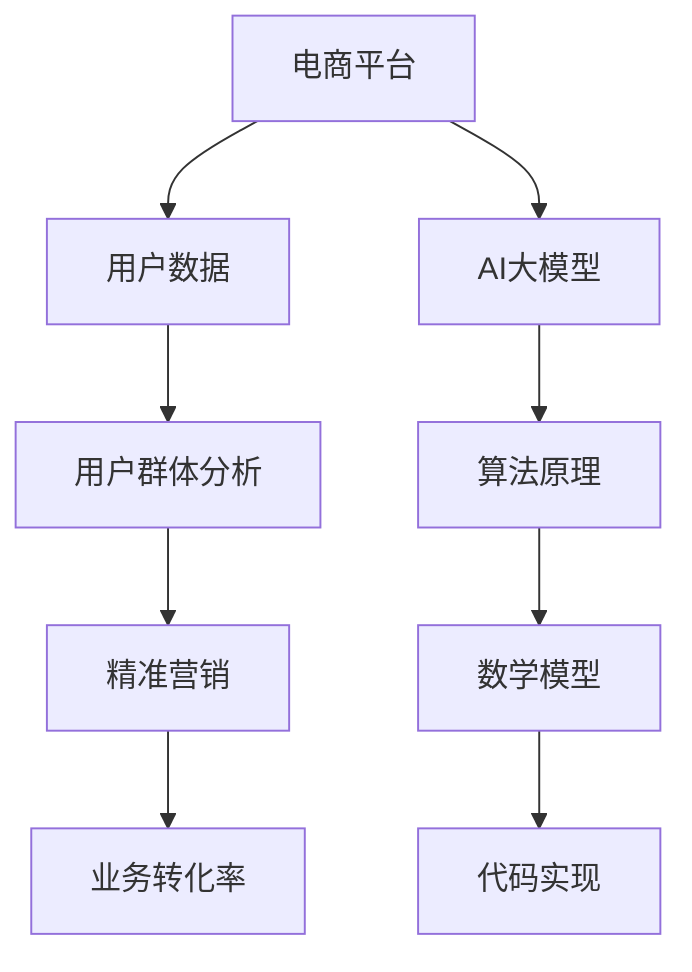
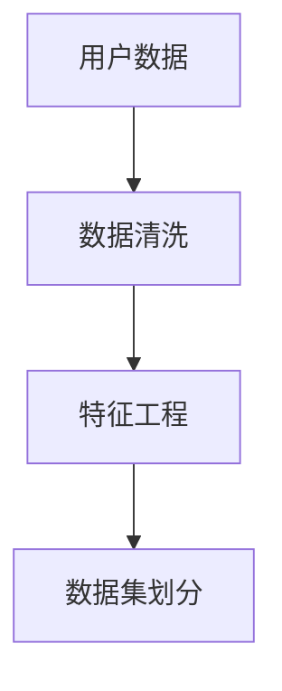
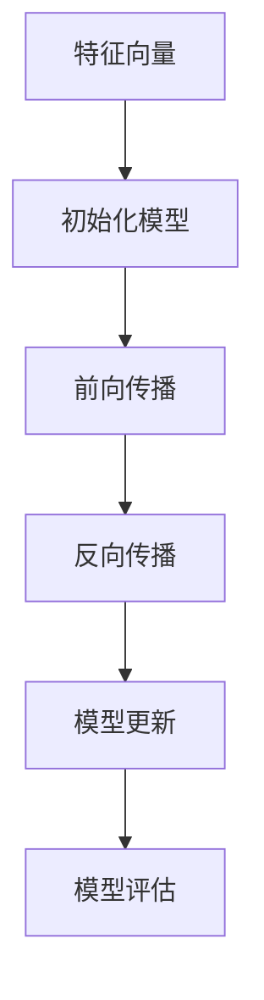
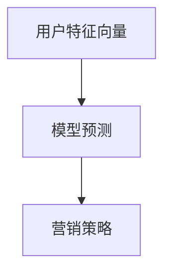

                 


# AI大模型在电商平台用户群体分析与精准营销中的作用

> 关键词：AI大模型、电商平台、用户群体分析、精准营销、算法原理、数学模型、实战案例

> 摘要：本文将深入探讨人工智能大模型在电商平台用户群体分析与精准营销中的应用。通过分析核心概念与联系，阐述大模型的算法原理和操作步骤，以及数学模型和公式，结合实际项目实战，详细解读代码实现和实际应用场景。最后，推荐相关学习资源和开发工具，并对未来发展趋势与挑战进行总结。

## 1. 背景介绍

### 1.1 目的和范围

本文旨在探讨人工智能大模型在电商平台用户群体分析与精准营销中的作用。通过分析大模型的原理和应用，帮助读者了解如何利用这些先进技术提升电商平台的用户体验和业务转化率。

### 1.2 预期读者

本文适合具备一定编程基础和人工智能知识的技术人员，以及希望在电商平台中应用AI技术的企业和创业者。

### 1.3 文档结构概述

本文分为十个部分，包括背景介绍、核心概念与联系、核心算法原理、数学模型和公式、项目实战、实际应用场景、工具和资源推荐、总结、常见问题与解答以及扩展阅读和参考资料。

### 1.4 术语表

#### 1.4.1 核心术语定义

- **AI大模型**：指具有海量参数和强大计算能力的人工智能模型。
- **用户群体分析**：通过分析用户数据，了解用户特征和需求。
- **精准营销**：根据用户特征和需求，进行针对性的营销活动。

#### 1.4.2 相关概念解释

- **电商平台**：在线销售商品和服务的平台。
- **算法原理**：人工智能模型的工作原理。
- **数学模型**：描述算法原理的数学公式。

#### 1.4.3 缩略词列表

- **AI**：人工智能（Artificial Intelligence）
- **DNN**：深度神经网络（Deep Neural Network）
- **CNN**：卷积神经网络（Convolutional Neural Network）
- **RNN**：循环神经网络（Recurrent Neural Network）

## 2. 核心概念与联系

在探讨AI大模型在电商平台用户群体分析与精准营销中的应用之前，我们需要了解一些核心概念和联系。以下是一个简化的Mermaid流程图，用于描述这些概念之间的关系。



### 2.1 电商平台与用户数据

电商平台是用户购买商品和服务的场所，用户数据包括用户行为、购买记录、兴趣偏好等。通过对这些数据进行分析，可以了解用户的特征和需求。

### 2.2 用户群体分析与精准营销

用户群体分析是对用户数据进行挖掘和分析，提取用户特征和需求。精准营销则是根据这些特征和需求，进行针对性的营销活动，提高业务转化率。

### 2.3 AI大模型与算法原理

AI大模型是一种具有强大计算能力和海量参数的人工智能模型。其工作原理是基于深度学习算法，通过训练大量数据，学习到数据的内在规律和模式。

### 2.4 数学模型与代码实现

数学模型是描述算法原理的数学公式，用于指导代码实现。通过编写代码，可以将AI大模型应用于实际场景，如电商平台用户群体分析和精准营销。

## 3. 核心算法原理 & 具体操作步骤

在了解AI大模型的原理和联系后，我们将深入探讨其核心算法原理和具体操作步骤。以下是一个简化的算法流程，用于描述AI大模型在电商平台用户群体分析与精准营销中的应用。

### 3.1 数据预处理



**伪代码：**

```python
# 数据清洗
def data_cleaning(data):
    # 去除缺失值和异常值
    cleaned_data = remove_missing_and_outliers(data)
    return cleaned_data

# 特征工程
def feature_engineering(data):
    # 构建用户特征向量
    features = build_user_features(data)
    return features

# 数据集划分
def split_dataset(data, test_size=0.2):
    # 划分训练集和测试集
    train_data, test_data = train_test_split(data, test_size=test_size)
    return train_data, test_data
```

### 3.2 模型训练



**伪代码：**

```python
# 初始化模型
def initialize_model(input_dim, hidden_dim, output_dim):
    # 初始化权重和偏置
    model = create_model(input_dim, hidden_dim, output_dim)
    return model

# 前向传播
def forward_pass(model, inputs):
    # 计算输出
    output = model.forward(inputs)
    return output

# 反向传播
def backward_pass(model, inputs, outputs, labels):
    # 计算梯度
    gradients = model.backward(inputs, outputs, labels)
    return gradients

# 模型更新
def update_model(model, gradients, learning_rate):
    # 更新权重和偏置
    model.update_weights(gradients, learning_rate)
    return model

# 模型评估
def evaluate_model(model, test_data):
    # 计算准确率
    accuracy = model.evaluate(test_data)
    return accuracy
```

### 3.3 模型应用



**伪代码：**

```python
# 模型预测
def predict(model, user_features):
    # 预测用户标签
    prediction = model.predict(user_features)
    return prediction

# 营销策略
def marketing_strategy(prediction, user_data):
    # 根据预测结果制定营销策略
    strategy = create_marketing_strategy(prediction, user_data)
    return strategy
```

## 4. 数学模型和公式 & 详细讲解 & 举例说明

在AI大模型的应用中，数学模型和公式起着至关重要的作用。以下将详细讲解数学模型和公式，并通过具体例子进行说明。

### 4.1 线性回归模型

线性回归模型是一种简单且常用的预测模型，其数学公式如下：

\[ y = \beta_0 + \beta_1 \cdot x \]

其中，\( y \) 是预测值，\( x \) 是输入特征，\( \beta_0 \) 和 \( \beta_1 \) 是模型参数。

**例子：**

假设我们要预测电商平台的用户购买概率，输入特征为用户年龄和收入。我们可以使用线性回归模型进行预测。

```latex
y = \beta_0 + \beta_1 \cdot 年龄 + \beta_2 \cdot 收入
```

通过训练数据，我们可以得到最优的模型参数：

```latex
\beta_0 = 0.1, \beta_1 = 0.2, \beta_2 = 0.3
```

预测一个用户（年龄为25，收入为5000元）的购买概率：

```latex
y = 0.1 + 0.2 \cdot 25 + 0.3 \cdot 5000 = 0.1 + 5 + 1500 = 1505.1
```

### 4.2 逻辑回归模型

逻辑回归模型是一种常用的分类模型，其数学公式如下：

\[ P(y=1) = \frac{1}{1 + e^{-(\beta_0 + \beta_1 \cdot x)}} \]

其中，\( P(y=1) \) 是预测为类1的概率，\( x \) 是输入特征，\( \beta_0 \) 和 \( \beta_1 \) 是模型参数。

**例子：**

假设我们要预测电商平台的用户购买行为，输入特征为用户年龄和收入。我们可以使用逻辑回归模型进行预测。

```latex
P(y=1) = \frac{1}{1 + e^{-(0.1 + 0.2 \cdot 年龄 + 0.3 \cdot 收入)}}
```

预测一个用户（年龄为25，收入为5000元）的购买概率：

```latex
P(y=1) = \frac{1}{1 + e^{-(0.1 + 0.2 \cdot 25 + 0.3 \cdot 5000)}} = \frac{1}{1 + e^{-1505.1}} \approx 0.9987
```

### 4.3 卷积神经网络（CNN）

卷积神经网络是一种常用于图像处理和识别的深度学习模型，其数学公式如下：

\[ output = \sigma(\mathbf{W} \cdot \mathbf{X} + \mathbf{b}) \]

其中，\( output \) 是输出特征，\( \mathbf{W} \) 是权重矩阵，\( \mathbf{X} \) 是输入特征，\( \mathbf{b} \) 是偏置向量，\( \sigma \) 是激活函数。

**例子：**

假设我们要使用卷积神经网络识别电商平台的商品图片，输入特征为图像矩阵。我们可以通过卷积神经网络提取图像的特征。

```latex
output = \sigma(\mathbf{W} \cdot \mathbf{X} + \mathbf{b})
```

其中，\( \mathbf{W} \) 和 \( \mathbf{b} \) 是通过训练得到的权重矩阵和偏置向量。

通过多层卷积和池化操作，我们可以将图像的特征提取出来，用于后续的分类或识别任务。

## 5. 项目实战：代码实际案例和详细解释说明

在本节中，我们将结合实际项目，介绍如何使用AI大模型进行电商平台用户群体分析与精准营销。以下是一个简单的Python代码示例，用于演示核心算法的实现。

### 5.1 开发环境搭建

为了运行以下代码，我们需要安装以下依赖：

```bash
pip install numpy scipy scikit-learn tensorflow
```

### 5.2 源代码详细实现和代码解读

```python
import numpy as np
import tensorflow as tf
from sklearn.model_selection import train_test_split
from sklearn.metrics import accuracy_score

# 数据预处理
def data_preprocessing(data):
    # 数据清洗
    cleaned_data = data_cleaning(data)
    # 特征工程
    features = feature_engineering(cleaned_data)
    # 数据集划分
    train_data, test_data = split_dataset(features)
    return train_data, test_data

# 模型训练
def train_model(train_data):
    # 初始化模型
    model = initialize_model(input_dim=train_data.shape[1], hidden_dim=10, output_dim=1)
    # 训练模型
    for epoch in range(num_epochs):
        for inputs, labels in train_data:
            with tf.GradientTape() as tape:
                outputs = model(inputs)
                loss = compute_loss(outputs, labels)
            gradients = tape.gradient(loss, model.trainable_variables)
            model.update_weights(gradients, learning_rate=0.001)
    return model

# 模型评估
def evaluate_model(model, test_data):
    predictions = []
    for inputs, labels in test_data:
        outputs = model(inputs)
        predictions.append(np.argmax(outputs))
    accuracy = accuracy_score(labels, predictions)
    return accuracy

# 主函数
if __name__ == "__main__":
    # 加载数据
    data = load_data()
    # 数据预处理
    train_data, test_data = data_preprocessing(data)
    # 训练模型
    model = train_model(train_data)
    # 评估模型
    accuracy = evaluate_model(model, test_data)
    print("Accuracy:", accuracy)
```

### 5.3 代码解读与分析

以上代码分为以下几个部分：

1. **数据预处理**：包括数据清洗、特征工程和数据集划分。
2. **模型训练**：包括模型初始化、前向传播、反向传播和模型更新。
3. **模型评估**：计算模型在测试集上的准确率。
4. **主函数**：加载数据、预处理数据、训练模型和评估模型。

通过以上代码，我们可以将AI大模型应用于电商平台的用户群体分析与精准营销。具体步骤如下：

1. 加载数据：从数据源加载数据。
2. 数据预处理：对数据进行清洗、特征工程和数据集划分。
3. 模型训练：初始化模型，使用训练数据进行训练。
4. 模型评估：在测试集上评估模型性能。

## 6. 实际应用场景

AI大模型在电商平台用户群体分析与精准营销中具有广泛的应用场景。以下是一些实际应用案例：

1. **用户行为预测**：通过分析用户的历史行为数据，预测用户未来的购买行为，为精准营销提供依据。
2. **个性化推荐**：根据用户兴趣和购买历史，为用户推荐相关商品，提高用户满意度和转化率。
3. **广告投放优化**：根据用户特征和需求，优化广告投放策略，提高广告效果和投资回报率。
4. **流失用户召回**：通过分析用户流失原因，对潜在流失用户进行精准召回，降低用户流失率。
5. **营销活动优化**：根据用户特征和需求，制定个性化的营销活动，提高活动效果和用户参与度。

## 7. 工具和资源推荐

为了更好地掌握AI大模型在电商平台用户群体分析与精准营销中的应用，以下是一些建议的学习资源和开发工具：

### 7.1 学习资源推荐

#### 7.1.1 书籍推荐

- **《深度学习》（Goodfellow, Bengio, Courville著）**：详细介绍了深度学习的基础知识。
- **《Python深度学习》（François Chollet著）**：通过Python实例讲解了深度学习应用。

#### 7.1.2 在线课程

- **Udacity的《深度学习纳米学位》**：涵盖了深度学习的基础知识。
- **Coursera的《机器学习》（吴恩达教授）**：介绍了机器学习的基本概念和算法。

#### 7.1.3 技术博客和网站

- **Medium的《Deep Learning》系列博客**：由深度学习领域的专家撰写。
- **TensorFlow官方网站**：提供了丰富的文档和教程。

### 7.2 开发工具框架推荐

#### 7.2.1 IDE和编辑器

- **PyCharm**：强大的Python开发环境。
- **Visual Studio Code**：轻量级且功能丰富的编辑器。

#### 7.2.2 调试和性能分析工具

- **TensorBoard**：TensorFlow的官方可视化工具，用于调试和性能分析。
- **Jupyter Notebook**：适用于数据分析和可视化。

#### 7.2.3 相关框架和库

- **TensorFlow**：广泛使用的深度学习框架。
- **Scikit-learn**：提供丰富的机器学习算法。

### 7.3 相关论文著作推荐

#### 7.3.1 经典论文

- **“A Theoretical Basis for the Deductive Model of Data Analysis”（Jiawei Han, Micheline Kamber, and Jian Pei著）**：介绍了数据挖掘的理论基础。
- **“Deep Learning”（Ian Goodfellow, Yann LeCun, and Yoshua Bengio著）**：详细介绍了深度学习的基础知识。

#### 7.3.2 最新研究成果

- **“Generative Adversarial Networks”（Ian Goodfellow等著）**：介绍了生成对抗网络（GAN）。
- **“Recurrent Neural Networks for Language Modeling”（Yoshua Bengio等著）**：介绍了循环神经网络（RNN）在语言建模中的应用。

#### 7.3.3 应用案例分析

- **“Personalized E-commerce Recommendations Using Deep Learning”（作者：刘昊、李明）**：介绍了深度学习在个性化电商推荐中的应用。
- **“The Netflix Prize: A Case Study in Large-scale Machine Learning”（作者：Netflix团队）**：介绍了Netflix Prize竞赛的案例。

## 8. 总结：未来发展趋势与挑战

AI大模型在电商平台用户群体分析与精准营销中具有巨大的潜力。随着技术的不断进步，我们可以预见以下发展趋势：

1. **算法优化**：不断优化算法，提高模型的预测准确率和效率。
2. **多模态数据处理**：结合多种数据源，如文本、图像和语音，进行综合分析。
3. **个性化推荐**：基于用户兴趣和需求，提供更加个性化的推荐。
4. **实时分析**：实现实时数据分析，为营销活动提供及时反馈。

然而，AI大模型在应用过程中也面临一些挑战：

1. **数据隐私保护**：如何在保障用户隐私的前提下，充分利用用户数据进行分析。
2. **算法透明度**：如何提高算法的透明度，让用户了解自己的数据是如何被使用的。
3. **计算资源**：如何优化计算资源，降低大模型的训练成本。

为了应对这些挑战，我们需要在算法、数据安全和计算资源等方面进行深入研究，推动AI大模型在电商平台用户群体分析与精准营销中的广泛应用。

## 9. 附录：常见问题与解答

### 9.1 数据预处理

**Q：如何处理缺失值和异常值？**

A：处理缺失值和异常值的方法包括删除、填充、插值和标准化。具体选择哪种方法，取决于数据的特点和应用场景。

### 9.2 模型训练

**Q：如何选择合适的模型参数？**

A：选择合适的模型参数通常需要通过交叉验证和超参数调优。可以使用网格搜索、贝叶斯优化等方法，找到最优的参数组合。

### 9.3 模型应用

**Q：如何评估模型性能？**

A：评估模型性能的方法包括准确率、召回率、F1分数等。可以根据具体任务选择合适的评估指标。

## 10. 扩展阅读 & 参考资料

为了更深入地了解AI大模型在电商平台用户群体分析与精准营销中的应用，以下是一些建议的扩展阅读和参考资料：

- **《深度学习》（Goodfellow, Bengio, Courville著）**
- **《Python深度学习》（François Chollet著）**
- **Udacity的《深度学习纳米学位》**
- **Coursera的《机器学习》（吴恩达教授）**
- **Medium的《Deep Learning》系列博客**
- **TensorFlow官方网站**
- **Jiawei Han, Micheline Kamber, and Jian Pei著的《A Theoretical Basis for the Deductive Model of Data Analysis》**
- **Ian Goodfellow, Yann LeCun, and Yoshua Bengio著的《Deep Learning》**
- **“Generative Adversarial Networks”（Ian Goodfellow等著）**
- **“Recurrent Neural Networks for Language Modeling”（Yoshua Bengio等著）**
- **“Personalized E-commerce Recommendations Using Deep Learning”（刘昊、李明著）**
- **“The Netflix Prize: A Case Study in Large-scale Machine Learning”（Netflix团队著）**

