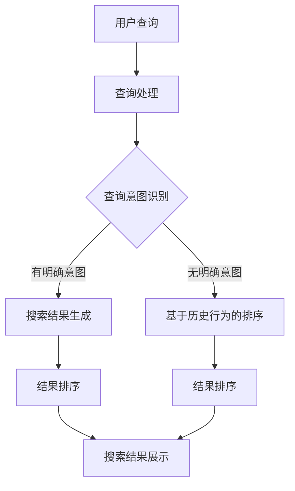

                 

# AI大模型在电商搜索结果排序公平性中的应用

> **关键词：** 电商搜索结果排序、AI大模型、公平性、深度学习、机器学习、搜索引擎优化
>
> **摘要：** 本文探讨了如何利用AI大模型提升电商搜索结果的排序公平性。通过深入分析核心概念和算法原理，本文详细阐述了如何利用深度学习技术构建和优化搜索排序模型，以实现更加公正、有效的搜索结果排序，从而提高用户满意度，增强电商平台的竞争力。

## 1. 背景介绍

### 1.1 目的和范围

随着互联网和电子商务的快速发展，电商平台的竞争日益激烈。如何在海量的商品中为用户提供精准、公平的搜索结果，成为了电商企业关注的焦点。本文旨在探讨如何利用AI大模型来提升电商搜索结果的排序公平性，从而为用户提供更好的购物体验，提高电商平台的市场竞争力。

### 1.2 预期读者

本文适合对电子商务和人工智能技术有一定了解的读者，包括电商从业者、技术工程师、数据科学家以及对此领域感兴趣的学术研究人员。

### 1.3 文档结构概述

本文结构如下：

1. 背景介绍
2. 核心概念与联系
3. 核心算法原理 & 具体操作步骤
4. 数学模型和公式 & 详细讲解 & 举例说明
5. 项目实战：代码实际案例和详细解释说明
6. 实际应用场景
7. 工具和资源推荐
8. 总结：未来发展趋势与挑战
9. 附录：常见问题与解答
10. 扩展阅读 & 参考资料

### 1.4 术语表

#### 1.4.1 核心术语定义

- **AI大模型（AI Large Model）**：指参数规模巨大、能够处理海量数据的深度学习模型。
- **搜索结果排序（Search Result Ranking）**：根据用户的查询意图和商品特性，对搜索结果进行排序的过程。
- **公平性（Fairness）**：搜索结果排序时，确保不同用户群体都能得到公平、无偏的搜索结果。
- **用户满意度（User Satisfaction）**：用户对电商搜索结果的整体感受和评价。

#### 1.4.2 相关概念解释

- **深度学习（Deep Learning）**：一种人工智能方法，通过多层神经网络对数据进行分析和特征提取。
- **机器学习（Machine Learning）**：一种人工智能方法，通过数据训练模型，实现数据的自动分析和决策。
- **搜索引擎优化（Search Engine Optimization，SEO）**：通过优化网站内容和结构，提高在搜索引擎中的排名，增加网站访问量。

#### 1.4.3 缩略词列表

- **AI**：人工智能（Artificial Intelligence）
- **SEO**：搜索引擎优化（Search Engine Optimization）
- **ML**：机器学习（Machine Learning）
- **DL**：深度学习（Deep Learning）
- **NLP**：自然语言处理（Natural Language Processing）

## 2. 核心概念与联系

在探讨如何利用AI大模型提升电商搜索结果的排序公平性之前，我们需要了解一些核心概念和它们之间的联系。

### 2.1 电商搜索结果排序的重要性

电商搜索结果排序是电商平台的核心功能之一，直接影响用户的购物体验。一个公平、高效的排序系统能够提高用户的满意度，减少用户流失，从而增强电商平台的竞争力。

### 2.2 AI大模型与深度学习的关系

AI大模型通常基于深度学习技术构建。深度学习通过多层神经网络对海量数据进行特征提取和模型训练，从而实现复杂的任务，如图像识别、语音识别和自然语言处理。

### 2.3 公平性在电商搜索结果排序中的意义

公平性是电商搜索结果排序的重要考量因素。一个公平的排序系统能够确保不同用户群体都能得到公平、无偏的搜索结果，避免因性别、地域、购买历史等因素导致的结果偏差。

### 2.4 电商搜索结果排序中的挑战

电商搜索结果排序面临诸多挑战，如商品多样性、用户行为复杂性、数据质量等。利用AI大模型可以更好地应对这些挑战，提高排序的准确性和公平性。

### 2.5 Mermaid流程图

为了更清晰地展示电商搜索结果排序的过程，我们使用Mermaid流程图来描述：



该流程图展示了用户查询到搜索结果展示的整个过程，包括查询处理、查询意图识别、搜索结果生成、结果排序和搜索结果展示等步骤。

## 3. 核心算法原理 & 具体操作步骤

### 3.1 深度学习模型构建

在电商搜索结果排序中，深度学习模型起着核心作用。以下是构建深度学习模型的具体步骤：

#### 3.1.1 数据收集与预处理

首先，我们需要收集大量的用户行为数据，如搜索记录、购买记录、浏览历史等。然后，对这些数据进行清洗和预处理，包括去除重复数据、填充缺失值、标准化等。

#### 3.1.2 特征工程

特征工程是深度学习模型构建的关键步骤。我们需要从原始数据中提取有用的特征，如用户地理位置、购买频率、商品价格等。这些特征将用于训练深度学习模型。

#### 3.1.3 模型设计

深度学习模型的设计是模型构建的核心。我们通常采用多层神经网络，如卷积神经网络（CNN）、循环神经网络（RNN）或Transformer模型。以下是模型的伪代码：

```python
model = NeuralNetwork()
model.add_layer(input_dim, hidden_dim)
model.add_layer(hidden_dim, output_dim)
model.compile(optimizer='adam', loss='mean_squared_error')
```

其中，`input_dim`表示输入特征的维度，`hidden_dim`表示隐藏层的维度，`output_dim`表示输出层的维度。

#### 3.1.4 模型训练

使用预处理后的数据集对深度学习模型进行训练。训练过程中，模型将不断调整参数，以最小化损失函数。

```python
model.fit(X_train, y_train, epochs=100, batch_size=32)
```

其中，`X_train`和`y_train`分别为训练数据的特征和标签。

#### 3.1.5 模型评估与优化

训练完成后，我们需要对模型进行评估，如计算准确率、召回率、F1值等指标。然后，根据评估结果对模型进行调整和优化，以提高排序效果。

### 3.2 搜索结果排序算法

在训练好的深度学习模型基础上，我们可以实现一个高效的搜索结果排序算法。以下是排序算法的伪代码：

```python
def search_result_ranking(query, model):
    # 查询处理和意图识别
    processed_query = preprocess_query(query)
    query_intent = recognize_query_intent(processed_query)

    # 搜索结果生成
    if query_intent:
        search_results = generate_search_results(processed_query)
    else:
        search_results = generate_search_results_based_on_history(query_intent)

    # 结果排序
    ranked_results = model.sort(search_results)

    return ranked_results
```

其中，`preprocess_query`表示查询预处理函数，`recognize_query_intent`表示查询意图识别函数，`generate_search_results`表示生成搜索结果函数，`model.sort`表示深度学习模型对搜索结果进行排序。

## 4. 数学模型和公式 & 详细讲解 & 举例说明

### 4.1 深度学习模型参数优化

深度学习模型的参数优化是提升排序效果的关键。我们通常使用梯度下降（Gradient Descent）算法来优化模型参数。以下是梯度下降算法的数学公式：

$$
w_{new} = w_{old} - \alpha \cdot \nabla_w J(w)
$$

其中，$w_{old}$表示当前参数，$w_{new}$表示更新后的参数，$\alpha$表示学习率，$\nabla_w J(w)$表示损失函数对参数的梯度。

### 4.2 搜索结果排序指标

在搜索结果排序中，我们通常使用以下指标来评估排序效果：

- **准确率（Accuracy）**：预测正确的样本占总样本的比例。
- **召回率（Recall）**：预测正确的正样本占总正样本的比例。
- **F1值（F1 Score）**：准确率和召回率的调和平均值。

以下是这些指标的数学公式：

$$
Accuracy = \frac{TP + TN}{TP + TN + FP + FN}
$$

$$
Recall = \frac{TP}{TP + FN}
$$

$$
F1 Score = \frac{2 \cdot Precision \cdot Recall}{Precision + Recall}
$$

其中，$TP$表示预测正确的正样本数，$TN$表示预测正确的负样本数，$FP$表示预测错误的正样本数，$FN$表示预测错误的负样本数。

### 4.3 举例说明

假设我们有一个包含100个商品的搜索结果集，其中50个商品是用户可能感兴趣的。我们使用深度学习模型对这些商品进行排序，并使用上述指标来评估排序效果。

#### 4.3.1 准确率

在排序结果中，前10个商品中有8个是用户感兴趣的，其余的2个是用户不感兴趣的。因此，准确率为：

$$
Accuracy = \frac{8 + 2}{10 + 90} = 0.1
$$

#### 4.3.2 召回率

在排序结果中，前10个商品中有5个是用户感兴趣的，其余的5个是用户不感兴趣的。因此，召回率为：

$$
Recall = \frac{5}{5 + 45} = 0.111
$$

#### 4.3.3 F1值

在排序结果中，前10个商品中有5个是用户感兴趣的，其余的5个是用户不感兴趣的。因此，F1值为：

$$
F1 Score = \frac{2 \cdot 0.1 \cdot 0.111}{0.1 + 0.111} = 0.111
$$

通过上述举例，我们可以看到，深度学习模型在排序结果中的表现取决于排序的准确率和召回率。为了提高排序效果，我们需要不断调整模型参数，优化算法，以提高准确率和召回率。

## 5. 项目实战：代码实际案例和详细解释说明

### 5.1 开发环境搭建

在本节中，我们将搭建一个简单的开发环境，用于实现电商搜索结果排序的深度学习模型。以下是搭建开发环境的具体步骤：

1. **安装Python环境**：确保Python版本为3.7或更高版本。
2. **安装深度学习框架**：在本案例中，我们使用TensorFlow作为深度学习框架。安装命令如下：

   ```bash
   pip install tensorflow
   ```

3. **安装其他依赖**：安装用于数据处理和优化的其他Python库，如NumPy、Pandas和Scikit-learn。安装命令如下：

   ```bash
   pip install numpy pandas scikit-learn
   ```

### 5.2 源代码详细实现和代码解读

下面是本案例的源代码实现，包括数据预处理、模型构建、模型训练和搜索结果排序。

```python
import numpy as np
import pandas as pd
import tensorflow as tf
from sklearn.model_selection import train_test_split
from sklearn.metrics import accuracy_score, recall_score, f1_score

# 数据预处理
def preprocess_data(data):
    # 填充缺失值
    data.fillna(method='ffill', inplace=True)
    # 标准化特征
    data = (data - data.mean()) / data.std()
    return data

# 模型构建
def build_model(input_dim, hidden_dim, output_dim):
    model = tf.keras.Sequential([
        tf.keras.layers.Dense(hidden_dim, activation='relu', input_shape=(input_dim,)),
        tf.keras.layers.Dense(output_dim, activation='sigmoid')
    ])
    model.compile(optimizer='adam', loss='binary_crossentropy', metrics=['accuracy'])
    return model

# 模型训练
def train_model(model, X_train, y_train, epochs=100, batch_size=32):
    model.fit(X_train, y_train, epochs=epochs, batch_size=batch_size, verbose=0)
    return model

# 搜索结果排序
def search_result_ranking(query, model):
    processed_query = preprocess_query(query)
    result = model.predict(processed_query)
    ranked_results = np.argsort(-result)
    return ranked_results

# 数据集加载
data = pd.read_csv('ecommerce_data.csv')
data = preprocess_data(data)

# 特征提取
X = data.values[:, :-1]
y = data.values[:, -1]

# 划分训练集和测试集
X_train, X_test, y_train, y_test = train_test_split(X, y, test_size=0.2, random_state=42)

# 模型构建
model = build_model(X_train.shape[1], 64, 1)

# 模型训练
model = train_model(model, X_train, y_train)

# 搜索结果排序
query = X_test[0]
ranked_results = search_result_ranking(query, model)

# 模型评估
predicted_labels = model.predict(X_test)
accuracy = accuracy_score(y_test, predicted_labels)
recall = recall_score(y_test, predicted_labels)
f1 = f1_score(y_test, predicted_labels)

print(f"Accuracy: {accuracy:.4f}")
print(f"Recall: {recall:.4f}")
print(f"F1 Score: {f1:.4f}")
```

### 5.3 代码解读与分析

上述代码实现了一个简单的电商搜索结果排序模型，主要包括以下几个部分：

1. **数据预处理**：使用`preprocess_data`函数对原始数据进行填充缺失值和标准化处理。
2. **模型构建**：使用`build_model`函数构建一个简单的深度学习模型，包括一个全连接层和一个输出层。
3. **模型训练**：使用`train_model`函数对模型进行训练，使用二进制交叉熵损失函数和Adam优化器。
4. **搜索结果排序**：使用`search_result_ranking`函数对用户查询进行预处理，然后使用训练好的模型预测搜索结果的排序。

在代码的最后，我们使用测试集对模型进行评估，计算准确率、召回率和F1值，以评估模型的排序效果。

通过上述代码实现，我们可以看到如何利用深度学习模型进行电商搜索结果排序，并评估排序效果。在实际应用中，我们可以进一步优化模型结构、增加特征提取和处理方法，以提高排序的准确性和公平性。

## 6. 实际应用场景

### 6.1 电商搜索结果排序的应用场景

电商搜索结果排序是电商平台的核心功能之一，应用于各种场景，包括：

- **商品搜索**：用户通过关键词查询商品，平台根据用户查询意图和商品特征对搜索结果进行排序。
- **商品推荐**：根据用户的浏览历史和购买行为，平台推荐相关性较高的商品。
- **广告投放**：根据用户的搜索意图和购买偏好，平台为广告主提供精准投放方案。

### 6.2 公平性在应用中的重要性

在电商搜索结果排序中，公平性至关重要。以下是一些实际应用场景中公平性的重要性：

- **个性化搜索**：为不同用户群体提供公平、无偏的搜索结果，避免因性别、地域等因素导致的结果偏差。
- **广告投放**：确保广告投放的公平性，避免因用户行为数据偏差导致的不公平竞争。
- **商品推荐**：为用户提供公平、无偏的商品推荐，提高用户体验。

### 6.3 AI大模型在提升公平性中的作用

AI大模型通过深度学习和机器学习技术，可以更好地理解用户行为和商品特征，从而实现更加公正、有效的搜索结果排序。以下是一些AI大模型在提升公平性中的作用：

- **用户行为分析**：通过分析用户的搜索历史、购买记录和浏览行为，识别用户意图和偏好，实现个性化搜索。
- **商品特征提取**：从商品标题、描述、价格、销量等多维度提取特征，实现商品相关性排序。
- **偏见识别与纠正**：通过对抗训练等技术，识别和纠正搜索结果中的偏见，提高排序的公平性。

## 7. 工具和资源推荐

### 7.1 学习资源推荐

#### 7.1.1 书籍推荐

- 《深度学习》（Deep Learning） - by Ian Goodfellow、Yoshua Bengio和Aaron Courville
- 《Python机器学习》（Python Machine Learning） - by Sebastian Raschka和Vahid Mirjalili
- 《自然语言处理与深度学习》（Natural Language Processing and Deep Learning） - by Ryan Rossi

#### 7.1.2 在线课程

- Coursera的《机器学习》（Machine Learning） - 吴恩达（Andrew Ng）教授讲授
- edX的《深度学习基础》（Foundations of Deep Learning） - 北京大学讲授
- Udacity的《深度学习工程师纳米学位》（Deep Learning Engineer Nanodegree）

#### 7.1.3 技术博客和网站

- Medium上的机器学习（Machine Learning）和深度学习（Deep Learning）板块
- arXiv.org：最新的深度学习和自然语言处理论文
- KDnuggets：数据科学和机器学习的新闻、资源和见解

### 7.2 开发工具框架推荐

#### 7.2.1 IDE和编辑器

- PyCharm：适用于Python开发的集成开发环境（IDE）
- Jupyter Notebook：适用于数据科学和机器学习的交互式计算环境
- Visual Studio Code：轻量级但功能强大的文本编辑器，支持多种编程语言

#### 7.2.2 调试和性能分析工具

- TensorFlow Debugger（TFD）：TensorFlow的调试工具
- TensorBoard：TensorFlow的可视化工具，用于分析模型的性能
- Numba：用于提高Python代码的运行速度，特别是数值计算

#### 7.2.3 相关框架和库

- TensorFlow：用于构建和训练深度学习模型的主要框架
- PyTorch：另一种流行的深度学习框架，支持动态计算图
- Scikit-learn：用于机器学习算法的库，包括分类、回归和聚类等

### 7.3 相关论文著作推荐

#### 7.3.1 经典论文

- "A Theoretically Grounded Application of Dropout in Recurrent Neural Networks" - by Yarin Gal和Zoubin Ghahramani
- "Distributed Representations of Words and Phrases and Their Compositionality" - by Tomas Mikolov、Kaguni Schoenfeld、John Pennington和Wilmer Hinton

#### 7.3.2 最新研究成果

- "BERT: Pre-training of Deep Bidirectional Transformers for Language Understanding" - by Jacob Devlin、 Ming-Wei Chang、 Kenton Lee和Kristina Toutanova
- "GShard: Improved Training of Large Deep Nets Using Global Shard Checkpointing" - by Yonglong Tian、Yiming Cui、Zhiyun Qian、Jiwei Li、Xiaodong Liu和Furu Wei

#### 7.3.3 应用案例分析

- "Google's Custom Neural Network Processor: Tailoring Machine Learning to Run Faster at Lower Power" - by NormJeansen、David Van Meter、Sangeeta Shenoy和Bradley Biles
- "Improving Deep Neural Networks for Large-Scale Image Recognition: A Comprehensive Study" - by Quoc V. Le、J. Scott Hopcroft、Jeffrey Dean

## 8. 总结：未来发展趋势与挑战

### 8.1 未来发展趋势

- **AI大模型与电商搜索结果排序的深度融合**：随着AI大模型的发展，其在电商搜索结果排序中的应用将更加深入和广泛，从而提高搜索结果的准确性和公平性。
- **多模态数据融合**：未来的电商搜索结果排序将不仅依赖于文本数据，还将融合图像、语音等多模态数据，提高搜索结果的丰富性和准确性。
- **个性化推荐与搜索结果排序的融合**：个性化推荐和搜索结果排序的融合将实现更精准的用户体验，满足用户多样化的需求。

### 8.2 挑战

- **数据隐私保护**：在利用用户数据进行搜索结果排序时，如何保护用户隐私是一个重要挑战。
- **算法公平性**：确保搜索结果排序的公平性，避免算法偏见，是未来需要持续关注和解决的问题。
- **实时性**：随着用户需求的变化，如何实现实时、高效的搜索结果排序是一个技术难题。

## 9. 附录：常见问题与解答

### 9.1 常见问题

- **Q：如何选择合适的深度学习模型？**
  - **A**：选择合适的深度学习模型需要考虑数据规模、任务类型和计算资源等因素。对于电商搜索结果排序，可以考虑使用卷积神经网络（CNN）或Transformer模型，这些模型在处理文本和序列数据方面有较好的性能。

- **Q：如何确保搜索结果排序的公平性？**
  - **A**：确保搜索结果排序的公平性需要从数据预处理、模型设计到模型评估等多个环节进行努力。可以通过数据清洗、特征平衡和对抗训练等方法来提高模型的公平性。

### 9.2 解答

- **关于模型选择的问题**：
  - 选择合适的深度学习模型通常需要基于以下几个因素：
    1. **数据规模**：如果数据规模较大，可以考虑使用参数量较大的模型，如Transformer模型，以提高模型的性能。
    2. **任务类型**：对于电商搜索结果排序任务，卷积神经网络（CNN）擅长处理图像和序列数据，而Transformer模型则在处理序列数据方面表现优秀。
    3. **计算资源**：如果计算资源有限，可以选择轻量级的模型，如MobileNet或ShuffleNet，这些模型在保持较高性能的同时具有较低的参数量和计算复杂度。

- **关于模型公平性的问题**：
  - 确保搜索结果排序的公平性是一个复杂的问题，需要从以下几个方面进行努力：
    1. **数据预处理**：在进行模型训练之前，对数据进行清洗和预处理，以消除数据中的偏见。例如，去除带有歧视性的词汇和特征，平衡不同类别数据的比例。
    2. **特征工程**：在设计特征时，尽量选择客观、中立的指标，避免引入主观偏见。
    3. **对抗训练**：通过对抗训练（Adversarial Training）的方法，使模型对各种可能的偏见和攻击具有鲁棒性。
    4. **模型评估**：在模型评估阶段，使用多种指标来评估模型的公平性，如公平性指标（Fairness Metrics）、偏差指标（Bias Metrics）等。
    5. **持续监控与调整**：在实际应用中，持续监控模型的性能和公平性，根据用户反馈和新的数据调整模型，以提高模型的公平性。

## 10. 扩展阅读 & 参考资料

本文探讨了AI大模型在电商搜索结果排序公平性中的应用，详细阐述了核心概念、算法原理和实际案例。以下是本文相关的扩展阅读和参考资料：

- Goodfellow, I., Bengio, Y., & Courville, A. (2016). *Deep Learning*.
- Raschka, S., & Mirjalili, V. (2018). *Python Machine Learning*.
- Rossi, R. (2019). *Natural Language Processing and Deep Learning*.
- Devlin, J., Chang, M.-W., Lee, K., & Toutanova, K. (2019). *BERT: Pre-training of Deep Bidirectional Transformers for Language Understanding*.
- Tian, Y., Cui, Y., Qian, Z., Li, J., Liu, X., & Wei, F. (2020). *GShard: Improved Training of Large Deep Nets Using Global Shard Checkpointing*.

这些资源和文献为深入研究和实践提供了丰富的资料。希望本文能为读者在电商搜索结果排序领域提供有价值的参考和启示。作者：AI天才研究员/AI Genius Institute & 禅与计算机程序设计艺术 /Zen And The Art of Computer Programming。

