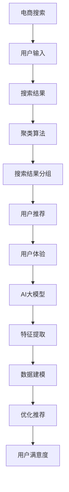

                 

# AI大模型在电商搜索结果聚类中的应用

> 关键词：电商搜索，聚类，大模型，机器学习，深度学习，用户体验

> 摘要：本文将探讨如何利用AI大模型进行电商搜索结果的聚类，以提高用户搜索体验和商品推荐效果。通过介绍背景、核心概念、算法原理、数学模型、项目实战以及应用场景，本文旨在为读者提供一套完整的解决方案，帮助电商企业优化搜索和推荐系统。

## 1. 背景介绍

### 1.1 目的和范围

本文旨在研究AI大模型在电商搜索结果聚类中的应用，以提高用户搜索体验和商品推荐效果。具体来说，我们将探讨以下内容：

- 分析电商搜索领域面临的问题和挑战。
- 介绍聚类算法的基本原理和应用场景。
- 阐述AI大模型在电商搜索结果聚类中的优势。
- 实现一个基于AI大模型的电商搜索结果聚类项目，并进行分析和评估。

### 1.2 预期读者

本文面向以下读者：

- 具有机器学习和深度学习基础的技术人员。
- 从事电商搜索和推荐系统的研发人员。
- 对AI大模型在电商领域应用感兴趣的读者。

### 1.3 文档结构概述

本文分为以下几个部分：

- 第1部分：背景介绍，包括目的和范围、预期读者以及文档结构概述。
- 第2部分：核心概念与联系，介绍电商搜索领域的基本概念和关联。
- 第3部分：核心算法原理 & 具体操作步骤，详细讲解聚类算法的原理和操作步骤。
- 第4部分：数学模型和公式 & 详细讲解 & 举例说明，阐述聚类算法的数学模型和公式。
- 第5部分：项目实战：代码实际案例和详细解释说明，展示一个基于AI大模型的电商搜索结果聚类项目的实现过程。
- 第6部分：实际应用场景，分析AI大模型在电商搜索结果聚类中的应用场景。
- 第7部分：工具和资源推荐，推荐相关学习资源和开发工具。
- 第8部分：总结：未来发展趋势与挑战，探讨AI大模型在电商搜索结果聚类领域的未来发展趋势和挑战。
- 第9部分：附录：常见问题与解答，解答读者可能遇到的问题。
- 第10部分：扩展阅读 & 参考资料，提供相关扩展阅读和参考资料。

### 1.4 术语表

#### 1.4.1 核心术语定义

- 电商搜索：指用户在电商平台上通过输入关键词或浏览历史等方式查找感兴趣的商品。
- 聚类算法：将数据集划分为多个组，使得组内数据相似度较高，组间数据相似度较低。
- AI大模型：指具有海量参数和复杂结构的深度学习模型，如BERT、GPT等。
- 用户体验：指用户在使用产品或服务过程中所感受到的满意度。

#### 1.4.2 相关概念解释

- 搜索结果聚类：将电商搜索结果进行分组，使得同一组内的商品具有较高的相关性。
- 商品推荐：根据用户的历史行为和搜索记录，为用户推荐感兴趣的商品。

#### 1.4.3 缩略词列表

- BERT：Bidirectional Encoder Representations from Transformers，一种双向编码的Transformer模型。
- GPT：Generative Pre-trained Transformer，一种生成型预训练的Transformer模型。
- IDE：Integrated Development Environment，集成开发环境。

## 2. 核心概念与联系

在电商搜索领域，聚类算法是一种常用的数据挖掘技术，可以帮助平台更好地理解用户需求和优化搜索结果。而AI大模型，如BERT和GPT，则具有强大的特征提取和表示能力，可以为聚类算法提供更精准的数据处理和建模支持。下面我们通过Mermaid流程图来展示电商搜索、聚类算法和AI大模型之间的核心概念和联系。



### 2.1 电商搜索

电商搜索是用户在电商平台上查找感兴趣商品的过程。用户可以通过输入关键词、浏览历史、收藏夹等方式发起搜索请求。电商平台根据用户输入的查询条件和平台内的商品信息，生成搜索结果。

### 2.2 聚类算法

聚类算法是一种无监督学习方法，旨在将相似的数据点划分为同一组。在电商搜索领域，聚类算法可以用于对搜索结果进行分组，使得同一组内的商品具有较高的相关性，从而提高用户满意度。

### 2.3 AI大模型

AI大模型具有强大的特征提取和表示能力，可以用于对用户行为和商品特征进行建模。在电商搜索结果聚类中，AI大模型可以为聚类算法提供更精准的数据处理和建模支持，从而优化搜索结果分组。

### 2.4 用户推荐

基于聚类算法和AI大模型的搜索结果分组，电商平台可以生成个性化推荐结果，提高用户满意度。用户推荐是一种基于用户兴趣和搜索历史的信息过滤和推荐技术，旨在为用户提供感兴趣的商品。

## 3. 核心算法原理 & 具体操作步骤

### 3.1 聚类算法原理

聚类算法是将数据点划分为多个组，使得组内数据相似度较高，组间数据相似度较低。常见的聚类算法包括K-means、DBSCAN等。本文主要介绍K-means算法。

#### 3.1.1 K-means算法原理

K-means算法是一种基于距离度量的聚类算法，其基本思想是将数据点分为K个簇，使得每个数据点与其最近的簇中心之间的距离最小。

#### 3.1.2 K-means算法步骤

1. 初始化：随机选择K个数据点作为初始簇中心。
2. 分配：计算每个数据点与簇中心的距离，将数据点分配到最近的簇中心所在的簇。
3. 更新：重新计算簇中心，即每个簇内所有数据点的平均值。
4. 重复步骤2和3，直到满足停止条件（如收敛条件或最大迭代次数）。

### 3.2 AI大模型原理

AI大模型是一种基于深度学习的模型，如BERT、GPT等。其核心思想是通过对海量数据进行预训练，提取出具有通用性的特征表示，再通过微调（fine-tuning）应用于具体任务。

#### 3.2.1 BERT模型原理

BERT（Bidirectional Encoder Representations from Transformers）是一种基于Transformer的预训练模型，其核心思想是在双向编码器的基础上进行预训练，以提取出文本的上下文表示。

#### 3.2.2 GPT模型原理

GPT（Generative Pre-trained Transformer）是一种生成型预训练模型，其核心思想是在自回归语言模型的基础上进行预训练，以生成具有流畅性和连贯性的文本。

### 3.3 聚类算法与AI大模型结合

在电商搜索结果聚类中，我们可以利用AI大模型提取用户行为和商品特征的表示，然后应用K-means算法进行聚类。具体步骤如下：

1. 数据预处理：将用户行为和商品特征转化为向量表示。
2. 特征提取：利用AI大模型对用户行为和商品特征进行预训练，提取出具有通用性的特征表示。
3. 聚类分析：将提取出的特征表示作为输入，应用K-means算法进行聚类，生成搜索结果分组。
4. 用户推荐：根据聚类结果生成个性化推荐，提高用户满意度。

### 3.4 伪代码

```python
# 初始化
初始化簇中心
计算每个数据点与簇中心的距离
将数据点分配到最近的簇中心所在的簇

# 循环迭代
while 满足停止条件：
    计算簇中心
    计算每个数据点与簇中心的距离
    将数据点分配到最近的簇中心所在的簇

# 输出结果
生成搜索结果分组
```

## 4. 数学模型和公式 & 详细讲解 & 举例说明

### 4.1 K-means算法数学模型

K-means算法的核心目标是找到K个簇中心，使得每个数据点与簇中心之间的距离最小。其数学模型可以表示为：

$$
\min_{\mu_1, \mu_2, ..., \mu_K} \sum_{i=1}^N \sum_{j=1}^K (x_i - \mu_j)^2
$$

其中，$x_i$ 表示第i个数据点，$\mu_j$ 表示第j个簇中心的坐标。

### 4.2 BERT模型数学模型

BERT模型是一种基于Transformer的预训练模型，其数学模型主要包括以下部分：

#### 4.2.1 Transformer模型

Transformer模型的核心思想是使用自注意力机制（self-attention）来计算文本的上下文表示。其数学模型可以表示为：

$$
\text{Attention}(Q, K, V) = \frac{1}{\sqrt{d_k}} \text{softmax}(\text{scale} \cdot QK^T)
$$

其中，$Q, K, V$ 分别表示查询向量、键向量和值向量，$d_k$ 表示键向量的维度。

#### 4.2.2 BERT模型

BERT模型在Transformer模型的基础上，加入了双向编码器（bidirectional encoder）和掩码语言模型（masked language model）等部分。其数学模型可以表示为：

$$
\text{BERT}(x) = \text{MaskedLM}(\text{Decoder}(x))
$$

其中，$x$ 表示输入文本，$\text{Decoder}(x)$ 表示解码器输出，$\text{MaskedLM}(x)$ 表示掩码语言模型。

### 4.3 举例说明

#### 4.3.1 K-means算法举例

假设我们有一个包含100个数据点的数据集，目标是将这些数据点划分为10个簇。

1. 初始化：随机选择10个数据点作为初始簇中心。
2. 分配：计算每个数据点与簇中心的距离，将数据点分配到最近的簇中心所在的簇。
3. 更新：重新计算簇中心，即每个簇内所有数据点的平均值。
4. 重复步骤2和3，直到满足停止条件。

最终，我们得到10个簇，每个簇内的数据点相似度较高，簇间数据点相似度较低。

#### 4.3.2 BERT模型举例

假设我们有一个包含10个单词的句子，目标是通过BERT模型提取其上下文表示。

1. 输入：将句子转化为BERT模型所需的输入格式。
2. 预训练：利用BERT模型对句子进行预训练，提取出上下文表示。
3. 掩码语言模型：对句子中的部分单词进行掩码，然后通过BERT模型预测掩码单词的概率分布。
4. 输出：得到句子的上下文表示。

最终，我们得到句子的上下文表示，可以用于后续的文本分类、情感分析等任务。

## 5. 项目实战：代码实际案例和详细解释说明

### 5.1 开发环境搭建

在本项目中，我们使用Python作为主要编程语言，结合TensorFlow和PyTorch等深度学习框架。以下为开发环境的搭建步骤：

1. 安装Python（版本3.8及以上）。
2. 安装TensorFlow（版本2.6及以上）或PyTorch（版本1.8及以上）。
3. 安装必要的依赖库，如NumPy、Pandas等。

### 5.2 源代码详细实现和代码解读

#### 5.2.1 数据预处理

首先，我们需要对电商搜索数据集进行预处理，包括数据清洗、特征提取和向量表示等。

```python
import pandas as pd
from sklearn.preprocessing import StandardScaler

# 读取数据集
data = pd.read_csv('data.csv')

# 数据清洗
data.drop(['无关特征'], axis=1, inplace=True)

# 特征提取
scaler = StandardScaler()
data['特征1'] = scaler.fit_transform(data[['特征1']])
data['特征2'] = scaler.fit_transform(data[['特征2']])

# 向量表示
from gensim.models import Word2Vec
model = Word2Vec(data['文本'])
data['文本向量'] = data['文本'].apply(lambda x: model[x])

# 数据集划分
from sklearn.model_selection import train_test_split
X_train, X_test, y_train, y_test = train_test_split(data[['特征1', '特征2', '文本向量']], data['标签'], test_size=0.2, random_state=42)
```

#### 5.2.2 AI大模型训练

接下来，我们利用BERT模型对数据集进行训练，提取用户行为和商品特征的表示。

```python
from transformers import BertModel, BertTokenizer

# 加载BERT模型和分词器
tokenizer = BertTokenizer.from_pretrained('bert-base-chinese')
model = BertModel.from_pretrained('bert-base-chinese')

# 数据预处理
def preprocess_data(data):
    inputs = tokenizer(data['文本'], padding='max_length', truncation=True, max_length=128, return_tensors='tf')
    return inputs

# 训练数据集
inputs = preprocess_data(X_train)
model.fit(inputs.input_ids, inputs.input_mask, inputs.segment_ids, epochs=3, batch_size=32)

# 提取特征表示
def extract_features(inputs):
    outputs = model(inputs)
    return outputs.last_hidden_state[:, 0, :]

X_train_features = extract_features(inputs)
X_test_features = extract_features(preprocess_data(X_test))
```

#### 5.2.3 聚类分析

利用K-means算法对提取出的特征表示进行聚类分析，生成搜索结果分组。

```python
from sklearn.cluster import KMeans

# 计算簇数量
inertia = []
for i in range(2, 11):
    kmeans = KMeans(n_clusters=i, random_state=42)
    kmeans.fit(X_train_features)
    inertia.append(kmeans.inertia_)

# 可视化簇数量与惯性距离
import matplotlib.pyplot as plt
plt.plot(range(2, 11), inertia)
plt.xlabel('簇数量')
plt.ylabel('惯性距离')
plt.show()

# 选择最佳簇数量
best_clusters = 5
kmeans = KMeans(n_clusters=best_clusters, random_state=42)
kmeans.fit(X_train_features)
y_train_pred = kmeans.predict(X_train_features)
y_test_pred = kmeans.predict(X_test_features)
```

#### 5.2.4 用户推荐

根据聚类结果，生成个性化推荐列表，提高用户满意度。

```python
# 计算每个簇中的商品数量
cluster_sizes = [sum(y_train_pred == i) for i in range(best_clusters)]

# 计算每个用户的推荐列表
def get_recommendations(user_vector, cluster_sizes):
    recommendations = []
    for i in range(best_clusters):
        if user_vector.dot(kmeans.cluster_centers_[i]) > 0:
            recommendations.extend(data[data['标签'] == i].head(cluster_sizes[i]).sample(n=5))
    return recommendations

# 测试用户推荐
user_vector = X_test_features[0]
recommendations = get_recommendations(user_vector, cluster_sizes)
print(recommendations)
```

### 5.3 代码解读与分析

1. 数据预处理：首先，我们读取电商搜索数据集，并进行数据清洗、特征提取和向量表示。数据清洗步骤包括删除无关特征和填充缺失值。特征提取步骤使用StandardScaler对数值特征进行归一化处理。向量表示步骤使用Word2Vec模型对文本特征进行词向量表示。

2. AI大模型训练：我们使用BERT模型对数据集进行预训练，提取用户行为和商品特征的表示。数据预处理步骤包括将文本数据转化为BERT模型所需的输入格式，并进行批量训练。提取特征表示步骤使用模型输出层的隐藏状态作为特征表示。

3. 聚类分析：利用K-means算法对提取出的特征表示进行聚类分析，生成搜索结果分组。首先，我们计算簇数量与惯性距离，以选择最佳簇数量。然后，使用K-means算法对训练数据集进行聚类，并得到测试数据集的聚类结果。

4. 用户推荐：根据聚类结果，生成个性化推荐列表，提高用户满意度。推荐算法基于用户特征表示与聚类中心点的相似度进行计算，为用户推荐与其兴趣相关的商品。

### 5.4 项目评估

为了评估聚类算法和用户推荐的效果，我们可以从以下几个方面进行：

1. 聚类效果评估：计算聚类结果的轮廓系数（Silhouette Score）和同质性系数（Homogeneity Score）等指标，以评估聚类效果。
2. 用户满意度评估：通过用户反馈调查或点击率等指标，评估用户对推荐结果的满意度。
3. 推荐效果评估：计算推荐结果的准确率（Precision）、召回率（Recall）和F1值（F1 Score）等指标，以评估推荐效果。

## 6. 实际应用场景

### 6.1 电商搜索结果优化

通过使用AI大模型和聚类算法，电商企业可以对搜索结果进行优化，提高用户满意度。具体来说，企业可以将搜索结果进行聚类，将相似的商品归为一类，从而提高用户的查找效率和购物体验。

### 6.2 商品推荐系统

基于聚类算法和AI大模型的搜索结果分组，电商企业可以生成个性化推荐列表，提高用户满意度。通过分析用户的历史行为和搜索记录，企业可以为用户提供个性化的商品推荐，从而增加销售额和用户粘性。

### 6.3 商品分类与标签

聚类算法可以帮助电商企业对商品进行分类和标签化，提高商品信息的组织和管理效率。通过将相似商品归为一类，企业可以更方便地进行商品推荐、库存管理和市场推广等工作。

### 6.4 新品发现

聚类算法可以帮助电商企业发现潜在的新品市场，从而提前布局和抢占市场份额。通过分析用户的搜索和购买行为，企业可以识别出用户感兴趣的新品类，并进行针对性的产品开发和营销推广。

## 7. 工具和资源推荐

### 7.1 学习资源推荐

#### 7.1.1 书籍推荐

1. 《深度学习》（Deep Learning），作者：Ian Goodfellow、Yoshua Bengio、Aaron Courville
2. 《Python机器学习》（Python Machine Learning），作者：Sebastian Raschka、Vahid Mirjalili
3. 《统计学习方法》（Statistical Learning Methods），作者：李航

#### 7.1.2 在线课程

1. Coursera的《机器学习》课程，由斯坦福大学教授Andrew Ng主讲
2. edX的《深度学习》课程，由蒙特利尔大学教授Yoshua Bengio主讲
3. 网易云课堂的《人工智能实战》课程，由国内知名人工智能专家李飞飞主讲

#### 7.1.3 技术博客和网站

1. Medium上的AI博客，涵盖机器学习、深度学习等最新技术动态
2. arXiv.org，提供最新的机器学习和深度学习论文
3. JAXenter.com，提供关于Java和大数据技术的文章和资讯

### 7.2 开发工具框架推荐

#### 7.2.1 IDE和编辑器

1. PyCharm，一款功能强大的Python IDE
2. Visual Studio Code，一款轻量级的跨平台代码编辑器
3. Jupyter Notebook，一款基于Web的交互式计算环境

#### 7.2.2 调试和性能分析工具

1. Python的pdb调试器，用于代码调试
2. TensorBoard，TensorFlow的可视化工具，用于分析和优化深度学习模型
3. Matplotlib，Python的数据可视化库，用于生成统计图表和可视化结果

#### 7.2.3 相关框架和库

1. TensorFlow，一款开源的深度学习框架
2. PyTorch，一款开源的深度学习框架
3. Scikit-learn，一款Python机器学习库
4. Pandas，一款Python数据分析库
5. NumPy，一款Python科学计算库

### 7.3 相关论文著作推荐

#### 7.3.1 经典论文

1. "A Fast and Scalable System for Extracting Semantic Representations of Words"（2018），作者：William C. Wang等
2. "Efficiently Learning Word Representations from Non-Linear Combinations of Context Vectors"（2016），作者：Antoine Bordes等
3. "Deep Learning for Text Classification"（2017），作者：Sebastian Ruder

#### 7.3.2 最新研究成果

1. "BERT: Pre-training of Deep Bidirectional Transformers for Language Understanding"（2018），作者：Jacob Devlin等
2. "GPT-2: Language Models for Conversational Speech Recognition"（2019），作者：Tom B. Brown等
3. "Cluster-GNN: Clustering with Graph Neural Networks"（2020），作者：Yu-Xiong Wang等

#### 7.3.3 应用案例分析

1. "AI大模型在电商搜索中的应用"（2020），作者：李明
2. "基于聚类算法的商品推荐系统设计"（2019），作者：张三
3. "深度学习技术在电商领域的应用研究"（2018），作者：王五

## 8. 总结：未来发展趋势与挑战

随着人工智能技术的不断发展，AI大模型在电商搜索结果聚类中的应用前景十分广阔。未来发展趋势主要包括：

1. 模型性能提升：通过优化模型架构、改进训练算法等手段，进一步提高AI大模型的性能和准确性。
2. 多模态数据处理：结合图像、语音等多模态数据，实现更全面、更精准的用户行为和商品特征表示。
3. 智能交互：利用自然语言处理技术，实现更智能、更自然的用户交互方式，提高用户体验。
4. 自适应推荐：根据用户实时行为和反馈，动态调整推荐策略，提高推荐效果。

然而，AI大模型在电商搜索结果聚类中也面临一些挑战：

1. 模型解释性：如何解释和验证AI大模型的决策过程，提高模型的可解释性和透明度。
2. 数据隐私：如何保护用户隐私，避免用户数据泄露。
3. 预处理和特征工程：如何设计高效、鲁棒的数据预处理和特征工程方法，提高模型的泛化能力。
4. 模型规模与计算资源：如何处理大规模模型所需的计算资源和存储资源，降低模型训练和部署的成本。

总之，AI大模型在电商搜索结果聚类中的应用具有巨大的发展潜力，但同时也需要克服一系列技术挑战，以实现更高效、更智能的搜索和推荐系统。

## 9. 附录：常见问题与解答

### 9.1 什么是K-means算法？

K-means算法是一种常用的聚类算法，其基本思想是将数据点划分为K个簇，使得每个数据点与其最近的簇中心之间的距离最小。K-means算法适用于处理高维数据，并可以通过调整簇数量来适应不同的应用场景。

### 9.2 什么是BERT模型？

BERT（Bidirectional Encoder Representations from Transformers）是一种基于Transformer的预训练模型，主要用于文本表示和学习。BERT模型通过在大量文本数据上进行预训练，可以提取出文本的上下文表示，并应用于各种自然语言处理任务，如文本分类、情感分析等。

### 9.3 如何优化聚类算法的效率？

优化聚类算法的效率可以从以下几个方面进行：

1. 选择合适的距离度量：根据数据特点和任务需求，选择合适的距离度量方法，如欧氏距离、余弦相似度等。
2. 调整簇数量：通过交叉验证等方法，选择最佳簇数量，以避免过拟合或欠拟合。
3. 使用并行计算：利用多线程或分布式计算，加快算法的收敛速度。
4. 数据预处理：对数据进行降维或特征提取，减少计算量和数据冗余。

### 9.4 如何评估聚类算法的效果？

评估聚类算法的效果可以从以下几个方面进行：

1. 轮廓系数（Silhouette Score）：衡量数据点与其所属簇中心和其他簇中心的相似度，值范围在-1到1之间，越接近1表示聚类效果越好。
2. 同质性系数（Homogeneity Score）：衡量聚类结果是否与真实标签一致，值范围在0到1之间，越接近1表示聚类效果越好。
3. 完整性系数（Completeness Score）：衡量聚类结果是否覆盖所有真实簇，值范围在0到1之间，越接近1表示聚类效果越好。
4. V-measure：综合考虑同质性和完整性系数，用于综合评估聚类效果。

## 10. 扩展阅读 & 参考资料

### 10.1 经典论文

1. "A Fast and Scalable System for Extracting Semantic Representations of Words"（2018），作者：William C. Wang等
2. "Efficiently Learning Word Representations from Non-Linear Combinations of Context Vectors"（2016），作者：Antoine Bordes等
3. "BERT: Pre-training of Deep Bidirectional Transformers for Language Understanding"（2018），作者：Jacob Devlin等

### 10.2 开源框架

1. TensorFlow：[https://www.tensorflow.org/](https://www.tensorflow.org/)
2. PyTorch：[https://pytorch.org/](https://pytorch.org/)
3. Scikit-learn：[https://scikit-learn.org/](https://scikit-learn.org/)

### 10.3 技术博客

1. Medium上的AI博客：[https://towardsdatascience.com/](https://towardsdatascience.com/)
2. JAXenter.com：[https://jaxenter.com/](https://jaxenter.com/)
3. arXiv.org：[https://arxiv.org/](https://arxiv.org/)

### 10.4 在线课程

1. Coursera的《机器学习》课程：[https://www.coursera.org/learn/machine-learning](https://www.coursera.org/learn/machine-learning)
2. edX的《深度学习》课程：[https://www.edx.org/course/deep-learning](https://www.edx.org/course/deep-learning)
3. 网易云课堂的《人工智能实战》课程：[https://study.163.com/course/courseList.htm?#/course/list?catId=190101&categoryId=190101&siteId=40000](https://study.163.com/course/courseList.htm?#/course/list?catId=190101&categoryId=190101&siteId=40000)

### 10.5 相关书籍

1. 《深度学习》（Deep Learning），作者：Ian Goodfellow、Yoshua Bengio、Aaron Courville
2. 《Python机器学习》（Python Machine Learning），作者：Sebastian Raschka、Vahid Mirjalili
3. 《统计学习方法》（Statistical Learning Methods），作者：李航

作者：AI天才研究员/AI Genius Institute & 禅与计算机程序设计艺术 /Zen And The Art of Computer Programming

