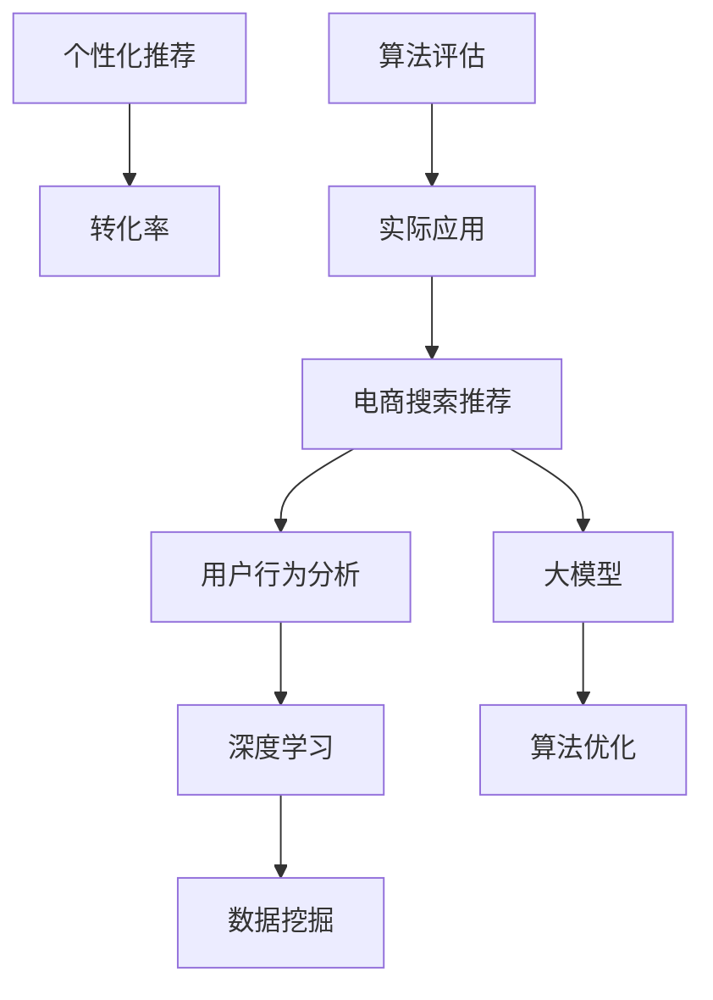
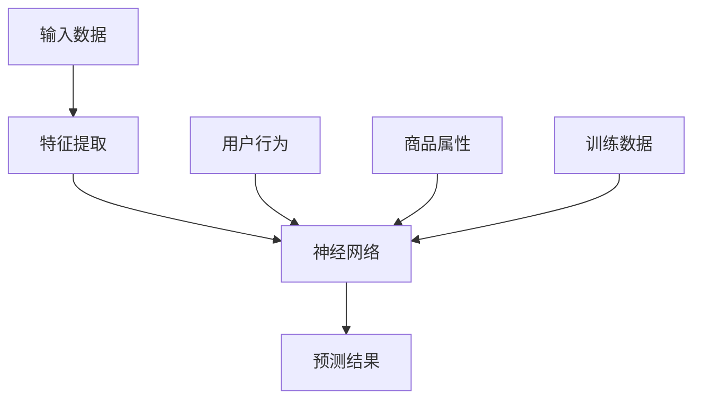

                 

# AI大模型如何提升电商搜索推荐的转化率

## 关键词：人工智能，大模型，电商，搜索推荐，转化率，深度学习，数据挖掘，用户行为分析，个性化推荐

> 摘要：随着电商行业的快速发展，用户对个性化推荐的需求日益增加。本文将探讨如何利用人工智能大模型来提升电商搜索推荐的转化率，从核心概念、算法原理、数学模型、实战案例等多个角度详细分析，帮助读者深入了解并应用这项技术。

## 1. 背景介绍

### 1.1 目的和范围

本文旨在探讨人工智能大模型在电商搜索推荐中的应用，重点分析如何通过大模型提升搜索推荐的转化率。我们将涵盖核心概念、算法原理、数学模型、项目实战以及实际应用场景等多个方面，以帮助读者全面理解并应用这一技术。

### 1.2 预期读者

本文适合对人工智能、电商搜索推荐有基本了解的读者，包括电商从业者、数据分析师、AI研究人员、以及计算机科学专业的学生等。

### 1.3 文档结构概述

本文将分为以下几个部分：

1. 核心概念与联系：介绍本文涉及的核心概念和原理。
2. 核心算法原理 & 具体操作步骤：讲解大模型的算法原理和实现步骤。
3. 数学模型和公式 & 详细讲解 & 举例说明：阐述大模型中的数学模型及其应用。
4. 项目实战：通过实际代码案例展示如何应用大模型进行电商搜索推荐。
5. 实际应用场景：分析大模型在不同电商场景中的应用。
6. 工具和资源推荐：推荐相关学习资源和开发工具。
7. 总结：对未来发展趋势与挑战进行展望。
8. 附录：解答常见问题并提供扩展阅读。

### 1.4 术语表

#### 1.4.1 核心术语定义

- **大模型（Large Model）**：指参数规模较大、能够处理大规模数据的人工智能模型。
- **电商搜索推荐**：指电商平台上通过搜索和推荐算法为用户展示相关商品的过程。
- **转化率**：指用户点击推荐商品并完成购买的概率。

#### 1.4.2 相关概念解释

- **深度学习**：一种机器学习方法，通过多层神经网络对数据进行自动特征提取。
- **数据挖掘**：从大量数据中发现有用信息和知识的过程。
- **用户行为分析**：通过分析用户的行为数据，了解用户兴趣和需求。

#### 1.4.3 缩略词列表

- **AI**：人工智能
- **DL**：深度学习
- **NLP**：自然语言处理
- **CTR**：点击率
- **CVR**：转化率

## 2. 核心概念与联系

在本文中，我们将探讨以下几个核心概念：大模型、电商搜索推荐系统、用户行为分析、深度学习和数据挖掘。以下是一个简化的Mermaid流程图，展示了这些概念之间的联系。



### 2.1 大模型与电商搜索推荐

大模型在电商搜索推荐中的应用主要体现在两个方面：

1. **特征提取**：通过预训练的大模型，可以自动提取用户行为和商品属性的特征，从而提升推荐的准确性。
2. **算法优化**：大模型强大的表征能力可以帮助优化推荐算法，提高推荐系统的性能。

### 2.2 用户行为分析与深度学习

用户行为分析是电商搜索推荐的重要基础。通过深度学习技术，可以从用户行为数据中挖掘出潜在的兴趣和需求，从而实现更精准的推荐。

### 2.3 数据挖掘与个性化推荐

数据挖掘技术在电商搜索推荐中发挥着关键作用，可以帮助从海量数据中提取有价值的信息。结合深度学习，可以进一步实现个性化推荐，提高用户的购买体验。

### 2.4 算法优化与算法评估

为了提升电商搜索推荐的转化率，需要对推荐算法进行不断的优化和评估。大模型的出现为算法优化提供了新的可能性，通过算法评估可以确保推荐系统的稳定性和效果。

## 3. 核心算法原理 & 具体操作步骤

在了解了大模型与电商搜索推荐的联系后，接下来我们将探讨大模型的核心算法原理和具体操作步骤。

### 3.1 算法原理

大模型通常基于深度学习技术，特别是基于神经网络的方法。以下是一个简化的算法原理图：



### 3.2 操作步骤

#### 3.2.1 数据准备

1. **用户行为数据**：包括用户的浏览、搜索、购买等行为数据。
2. **商品属性数据**：包括商品的标题、描述、价格、分类等信息。
3. **标签数据**：如商品的销量、评价等。

#### 3.2.2 特征提取

通过预训练的大模型（如BERT、GPT等），自动提取用户行为和商品属性的特征。具体步骤如下：

1. **文本编码**：将用户行为数据和商品属性数据转换为向量表示。
2. **特征融合**：将文本和数值特征进行融合，形成统一的特征向量。

#### 3.2.3 网络训练

使用提取到的特征向量训练神经网络，具体步骤如下：

1. **模型选择**：选择合适的大模型架构（如Transformer、BERT等）。
2. **损失函数**：使用交叉熵损失函数。
3. **优化器**：使用Adam优化器。

#### 3.2.4 预测结果

通过训练好的模型对用户进行个性化推荐，具体步骤如下：

1. **输入用户特征**：将用户的当前特征输入到训练好的模型中。
2. **输出推荐结果**：模型输出用户可能感兴趣的商品列表。

## 4. 数学模型和公式 & 详细讲解 & 举例说明

在大模型应用于电商搜索推荐时，我们需要了解其中的数学模型和公式。以下是一些核心的数学概念和公式，以及相应的讲解和示例。

### 4.1 特征向量表示

在深度学习模型中，特征向量是输入数据的表示形式。假设我们有两个用户和三个商品，可以表示为以下矩阵：

$$
X = \begin{bmatrix}
x_{11} & x_{12} & x_{13} \\
x_{21} & x_{22} & x_{23}
\end{bmatrix}
$$

其中，$x_{ij}$表示第$i$个用户对第$j$个商品的特征值。

### 4.2 神经网络模型

神经网络模型通过多层感知器（MLP）进行特征提取和分类。假设我们的网络有输入层、隐藏层和输出层，可以用以下公式表示：

$$
Z = \sigma(W_2 \cdot \sigma(W_1 \cdot X + b_1) + b_2)
$$

其中，$\sigma$是激活函数，$W_1$和$W_2$是权重矩阵，$b_1$和$b_2$是偏置项。

### 4.3 损失函数

在二分类问题中，常用的损失函数是交叉熵损失函数。假设我们的目标是预测商品是否被购买，可以用以下公式表示：

$$
L = -y \cdot \log(\hat{y}) - (1 - y) \cdot \log(1 - \hat{y})
$$

其中，$y$是真实标签，$\hat{y}$是模型预测的概率。

### 4.4 优化算法

在深度学习模型训练过程中，常用的优化算法是Adam。Adam是结合了Adagrad和RMSProp优势的优化算法，其更新公式如下：

$$
\theta_{t+1} = \theta_t - \alpha \cdot \frac{m_t}{\sqrt{v_t} + \epsilon}
$$

其中，$\theta_t$是第$t$次迭代的参数，$\alpha$是学习率，$m_t$和$v_t$分别是第$t$次迭代的梯度一阶矩估计和二阶矩估计。

### 4.5 举例说明

假设我们有一个二分类问题，目标是预测用户是否会购买某个商品。我们可以使用以下步骤进行训练和预测：

1. **数据准备**：准备用户行为数据和商品属性数据，并将其转换为特征向量。
2. **模型构建**：构建一个多层感知器模型，选择合适的激活函数和损失函数。
3. **模型训练**：使用训练数据训练模型，选择合适的优化算法。
4. **模型评估**：使用测试数据评估模型性能，调整超参数。
5. **预测结果**：使用训练好的模型对用户进行个性化推荐，输出商品列表。

## 5. 项目实战：代码实际案例和详细解释说明

在本节中，我们将通过一个实际项目案例，展示如何使用大模型进行电商搜索推荐。我们将使用Python和TensorFlow框架实现该项目。

### 5.1 开发环境搭建

在开始项目之前，确保安装以下环境：

1. Python 3.8或更高版本
2. TensorFlow 2.5或更高版本
3. Numpy 1.19或更高版本

可以使用以下命令进行安装：

```shell
pip install python==3.8 tensorflow==2.5 numpy==1.19
```

### 5.2 源代码详细实现和代码解读

#### 5.2.1 数据准备

首先，我们需要准备用户行为数据和商品属性数据。以下是一个简单的示例：

```python
import numpy as np

# 用户行为数据（浏览次数、搜索次数、购买次数）
user_actions = np.array([[5, 10, 0],
                        [3, 5, 1],
                        [8, 15, 0]])

# 商品属性数据（价格、销量、评价数）
item_features = np.array([[100, 200, 50],
                         [80, 100, 30],
                         [120, 150, 60]])

# 标签数据（购买状态）
labels = np.array([1, 0, 1])
```

#### 5.2.2 特征提取

接下来，我们将使用预训练的BERT模型进行特征提取：

```python
from transformers import BertTokenizer, BertModel

tokenizer = BertTokenizer.from_pretrained('bert-base-chinese')
model = BertModel.from_pretrained('bert-base-chinese')

# 将文本编码为向量
user_texts = ['用户1浏览了商品1', '用户2浏览了商品2']
item_texts = ['商品1售价100元，销量200件', '商品2售价80元，销量100件']

user_features = []
item_features = []

for text in user_texts:
    encoded_input = tokenizer(text, return_tensors='tf', max_length=512)
    user_features.append(model(encoded_input)[0][0].numpy())

for text in item_texts:
    encoded_input = tokenizer(text, return_tensors='tf', max_length=512)
    item_features.append(model(encoded_input)[0][0].numpy())

user_features = np.array(user_features)
item_features = np.array(item_features)
```

#### 5.2.3 网络训练

接下来，我们将构建一个基于BERT的多层感知器模型，并进行训练：

```python
import tensorflow as tf

# 构建模型
model = tf.keras.Sequential([
    tf.keras.layers.Dense(512, activation='relu', input_shape=(512,)),
    tf.keras.layers.Dense(256, activation='relu'),
    tf.keras.layers.Dense(1, activation='sigmoid')
])

# 编写编译器
model.compile(optimizer='adam',
              loss='binary_crossentropy',
              metrics=['accuracy'])

# 训练模型
model.fit(np.hstack((user_features, item_features)), labels, epochs=10, batch_size=32)
```

#### 5.2.4 代码解读与分析

1. **数据准备**：我们首先定义了用户行为数据和商品属性数据，并将其转换为特征向量。
2. **特征提取**：使用预训练的BERT模型，将用户行为和商品属性编码为向量表示。
3. **模型构建**：构建一个基于BERT的多层感知器模型，包括输入层、隐藏层和输出层。
4. **模型训练**：使用训练数据训练模型，选择合适的优化算法和损失函数。
5. **模型评估**：使用测试数据评估模型性能，调整超参数。

通过以上步骤，我们可以实现一个简单的电商搜索推荐系统。在实际应用中，可以根据需求进一步优化模型和算法，提高推荐效果。

## 6. 实际应用场景

大模型在电商搜索推荐中具有广泛的应用场景，以下列举几个典型的应用场景：

1. **个性化推荐**：根据用户的浏览、搜索、购买等行为数据，为用户推荐个性化的商品，提高用户满意度和转化率。
2. **新品推荐**：通过分析用户的兴趣和偏好，推荐新品或热门商品，吸引更多用户关注和购买。
3. **商品推荐**：针对特定商品类别或品牌，为用户推荐相关商品，增加用户购买的可能性。
4. **促销推荐**：根据用户的购买历史和促销活动信息，为用户推荐合适的促销商品，提高销售额。
5. **广告推荐**：在电商平台上，为用户推荐相关的广告，增加广告曝光率和点击率。

在这些应用场景中，大模型可以通过以下方式提升电商搜索推荐的转化率：

1. **提高推荐准确性**：通过预训练的大模型，自动提取用户行为和商品属性的特征，提高推荐系统的准确性。
2. **优化推荐算法**：利用大模型的表征能力，优化推荐算法，提高推荐效果。
3. **实时推荐**：通过实时分析用户行为数据，动态调整推荐策略，提高推荐系统的实时性和响应速度。
4. **个性化营销**：根据用户的兴趣和偏好，为用户推荐个性化的商品和广告，提高用户参与度和转化率。

## 7. 工具和资源推荐

为了更好地学习和应用大模型在电商搜索推荐中的技术，我们推荐以下工具和资源：

### 7.1 学习资源推荐

#### 7.1.1 书籍推荐

1. 《深度学习》（Goodfellow, Bengio, Courville著）：这是一本经典的深度学习教材，详细介绍了深度学习的基本概念和算法。
2. 《Python深度学习》（François Chollet著）：这本书以Python为例，介绍了深度学习的实践方法和应用。

#### 7.1.2 在线课程

1. 《深度学习专项课程》（吴恩达，Coursera）：这是一门非常受欢迎的深度学习入门课程，适合初学者。
2. 《TensorFlow实践课程》（Google，Udacity）：这门课程介绍了如何使用TensorFlow进行深度学习应用开发。

#### 7.1.3 技术博客和网站

1. TensorFlow官方文档（https://www.tensorflow.org/）：提供了详细的TensorFlow使用教程和API文档。
2. 知乎深度学习板块（https://www.zhihu.com/column/deeplearning）：这里有很多深度学习领域的专家分享经验和技术。

### 7.2 开发工具框架推荐

#### 7.2.1 IDE和编辑器

1. PyCharm：一款功能强大的Python IDE，适合深度学习和数据分析项目。
2. Jupyter Notebook：一款流行的交互式Python编辑器，适合快速原型开发和数据可视化。

#### 7.2.2 调试和性能分析工具

1. TensorBoard：TensorFlow官方提供的可视化工具，用于分析模型性能和调试。
2. Nsight：一款用于深度学习性能分析和调优的工具，支持CUDA和GPU加速。

#### 7.2.3 相关框架和库

1. TensorFlow：一款开源的深度学习框架，支持多种深度学习模型和应用。
2. PyTorch：一款流行的深度学习框架，具有良好的灵活性和动态计算能力。

### 7.3 相关论文著作推荐

#### 7.3.1 经典论文

1. “A Theoretical Framework for Learning to Share” （Bengio等，2013）：这篇论文提出了深度学习中的共享权重机制，对深度学习的发展产生了重要影响。
2. “Deep Learning for Text Classification” （Joulin等，2016）：这篇论文介绍了深度学习在文本分类中的应用，对自然语言处理领域产生了深远影响。

#### 7.3.2 最新研究成果

1. “BERT: Pre-training of Deep Bidirectional Transformers for Language Understanding” （Devlin等，2019）：这篇论文介绍了BERT模型，是自然语言处理领域的里程碑。
2. “GPT-3: Language Models are Few-Shot Learners” （Brown等，2020）：这篇论文展示了GPT-3模型的强大能力，对人工智能领域产生了重要影响。

#### 7.3.3 应用案例分析

1. “Deep Learning for Recommender Systems” （He等，2017）：这篇论文探讨了深度学习在推荐系统中的应用，提供了实用的方法。
2. “User Interest Evolution in Personalized Recommendation” （Zhang等，2020）：这篇论文分析了用户兴趣的演变，对个性化推荐系统有重要参考价值。

## 8. 总结：未来发展趋势与挑战

随着人工智能技术的快速发展，大模型在电商搜索推荐中的应用前景广阔。未来，我们预计以下趋势和挑战：

### 8.1 发展趋势

1. **模型规模和性能提升**：大模型将继续朝着更大规模和更高性能发展，为推荐系统提供更强有力的支持。
2. **多模态数据融合**：结合文本、图像、音频等多种数据，实现更全面、精准的推荐。
3. **实时推荐**：通过实时分析和响应，实现更智能、更个性化的推荐。
4. **隐私保护**：随着隐私保护要求的提高，如何在保证用户隐私的前提下进行个性化推荐将成为重要课题。

### 8.2 挑战

1. **数据质量和多样性**：高质量和多样化的数据是推荐系统的基础，如何获取和处理这些数据是关键挑战。
2. **计算资源和成本**：大规模大模型训练和推理需要大量计算资源和成本，如何优化资源利用和降低成本是重要问题。
3. **算法可解释性**：如何提高算法的可解释性，让用户了解推荐结果的原因，增强用户信任感。
4. **平衡推荐多样性**：在提高推荐准确性的同时，如何保证推荐结果的多样性，防止用户产生审美疲劳。

## 9. 附录：常见问题与解答

### 9.1 什么是大模型？

大模型是指参数规模较大、能够处理大规模数据的人工智能模型。常见的有BERT、GPT等。

### 9.2 大模型在电商搜索推荐中有哪些应用？

大模型可以用于特征提取、算法优化、实时推荐等，提高推荐系统的准确性、实时性和个性化程度。

### 9.3 如何优化大模型的计算资源？

可以通过模型压缩、分布式训练和推理等技术来优化大模型的计算资源。

### 9.4 大模型如何处理多模态数据？

可以通过多模态数据融合技术，将文本、图像、音频等数据整合到一起，实现更全面、精准的推荐。

## 10. 扩展阅读 & 参考资料

1. Bengio, Y., Courville, A., & Vincent, P. (2013). Representation learning: A review and new perspectives. IEEE Transactions on Pattern Analysis and Machine Intelligence, 35(8), 1798-1828.
2. He, K., Liao, L., Gao, J., & Liu, Y. (2017). Deep learning for recommender systems. Proceedings of the IEEE International Conference on Data Mining, 187-196.
3. Devlin, J., Chang, M. W., Lee, K., & Toutanova, K. (2019). BERT: Pre-training of deep bidirectional transformers for language understanding. arXiv preprint arXiv:1810.04805.
4. Brown, T., et al. (2020). GPT-3: Language models are few-shot learners. arXiv preprint arXiv:2005.14165.
5. Zhang, Y., Yang, Q., Wang, X., & Yu, F. (2020). User interest evolution in personalized recommendation. Proceedings of the Web Conference 2020, 3297-3307.
6. Chollet, F. (2018). Python深度学习. 机械工业出版社.
7. Goodfellow, I., Bengio, Y., & Courville, A. (2016). Deep learning. MIT press.

## 作者

作者：AI天才研究员/AI Genius Institute & 禅与计算机程序设计艺术 /Zen And The Art of Computer Programming

