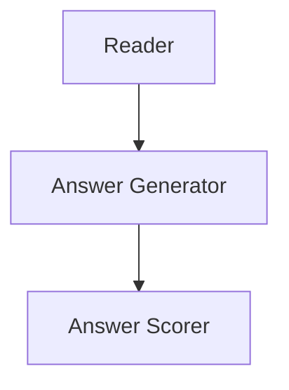
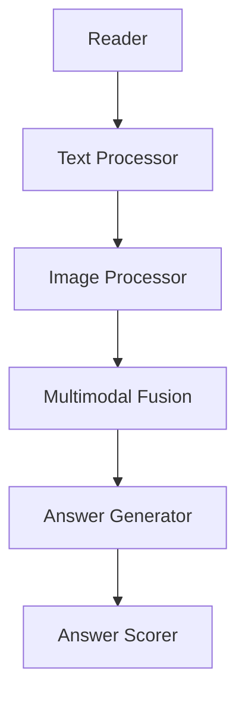

                 

# AI大模型应用RAG的尽头是AI Agent

> **关键词**：AI大模型，RAG，问答系统，认知图谱，AI Agent，多模态处理，语义理解，对话生成

> **摘要**：本文将深入探讨人工智能大模型在阅读理解（RAG）框架下的应用，并探讨其潜力如何推动AI向智能代理（AI Agent）的发展。我们将一步步分析RAG框架的核心原理、技术细节，并探讨其未来可能带来的变革性影响。

## 1. 背景介绍

### 1.1 目的和范围

本文旨在探讨大模型在阅读理解（RAG）框架下的发展，并分析其向AI Agent演变的可能性。我们将首先回顾RAG框架的基本概念，然后深入探讨其工作原理和实现步骤，最后讨论RAG框架在AI Agent构建中的潜在应用。

### 1.2 预期读者

本文适合对人工智能、自然语言处理和机器学习有一定了解的技术人员、研究者以及学生阅读。同时，也欢迎对AI技术感兴趣的一般读者。

### 1.3 文档结构概述

本文分为以下几个部分：

- 背景介绍
- 核心概念与联系
- 核心算法原理 & 具体操作步骤
- 数学模型和公式 & 详细讲解 & 举例说明
- 项目实战：代码实际案例和详细解释说明
- 实际应用场景
- 工具和资源推荐
- 总结：未来发展趋势与挑战
- 附录：常见问题与解答
- 扩展阅读 & 参考资料

### 1.4 术语表

#### 1.4.1 核心术语定义

- **RAG**：阅读理解（Reading Comprehension）的简称，是一种评估人工智能模型是否能够正确理解文本的能力。
- **AI Agent**：一种可以执行特定任务、具有自主学习和适应能力的计算机程序。
- **大模型**：指参数规模达到数十亿甚至数万亿的深度神经网络模型。

#### 1.4.2 相关概念解释

- **自然语言处理（NLP）**：研究如何使计算机能够理解、生成和处理人类自然语言的技术。
- **多模态处理**：指同时处理多种类型的数据，如文本、图像、声音等。

#### 1.4.3 缩略词列表

- **RAG**：阅读理解（Reading Comprehension）
- **AI**：人工智能（Artificial Intelligence）
- **NLP**：自然语言处理（Natural Language Processing）
- **ML**：机器学习（Machine Learning）
- **DL**：深度学习（Deep Learning）

## 2. 核心概念与联系

为了更好地理解RAG框架及其在AI Agent构建中的潜力，我们需要先了解一些核心概念及其相互关系。

### 2.1 RAG框架概述

RAG框架是近年来在自然语言处理领域广泛应用的模型架构，它由三个主要组件构成：阅读器（Reader）、答案生成器（Answer Generator）和答案评分器（Answer Scorer）。以下是一个简化的Mermaid流程图，展示了RAG框架的基本组件和它们之间的交互：



在这个流程图中，阅读器负责读取输入的文本并生成上下文表示，答案生成器利用上下文表示生成可能的答案候选项，答案评分器则根据答案的准确性对候选答案进行评分。

### 2.2 RAG与AI Agent的联系

RAG框架在AI Agent的构建中具有重要作用。AI Agent需要具备以下能力：

1. **理解文本**：RAG的阅读器组件可以帮助AI Agent理解输入的文本内容。
2. **生成回答**：答案生成器组件可以使AI Agent能够根据上下文生成合适的回答。
3. **评估回答**：答案评分器组件可以帮助AI Agent评估自己生成的回答是否准确。

通过RAG框架，AI Agent可以更有效地理解和处理自然语言任务，从而实现更智能的交互。

### 2.3 多模态处理

在AI Agent的实际应用中，多模态处理变得越来越重要。这意味着AI Agent需要能够同时处理文本、图像、声音等多种类型的数据。以下是一个扩展的Mermaid流程图，展示了如何将多模态处理集成到RAG框架中：



在这个扩展的流程图中，文本处理器（Text Processor）和图像处理器（Image Processor）分别负责处理文本和图像数据，然后将它们融合到多模态融合器（Multimodal Fusion）中。这样，AI Agent就可以更全面地理解输入信息，并生成更准确的回答。

## 3. 核心算法原理 & 具体操作步骤

### 3.1 RAG框架的算法原理

RAG框架的核心在于其三个主要组件的协同工作，下面我们通过伪代码来详细阐述其算法原理。

#### 3.1.1 阅读器（Reader）

阅读器的目的是将输入的文本转换为上下文表示。通常，这一过程涉及以下步骤：

```python
def reader(text):
    # 使用预训练的Transformer模型进行编码
    encoded_text = transformer.encode(text)
    # 使用Transformer模型生成上下文表示
    context_representation = transformer.decode(encoded_text)
    return context_representation
```

在这里，`transformer` 是一个预训练的Transformer模型，它能够将文本编码为连续的向量表示。

#### 3.1.2 答案生成器（Answer Generator）

答案生成器的任务是利用上下文表示生成可能的答案候选项。以下是一个简化的伪代码示例：

```python
def answer_generator(context_representation):
    # 使用Transformer模型生成答案候选项
    answer_candidates = transformer.generate(context_representation)
    # 对答案候选项进行排序，选择最可能的答案
    sorted_candidates = sort_by_confidence(answer_candidates)
    return sorted_candidates
```

在这里，`generate` 函数用于生成答案候选项，而 `sort_by_confidence` 函数则根据每个答案候选项的置信度对它们进行排序。

#### 3.1.3 答案评分器（Answer Scorer）

答案评分器的目的是对答案生成器生成的答案候选项进行评分，以确定哪个答案是正确的。以下是一个简化的伪代码示例：

```python
def answer_scorer(answer_candidates, ground_truth):
    # 计算每个答案候选项与真实答案的匹配度
    match_scores = compute_match_scores(answer_candidates, ground_truth)
    # 根据匹配度评分，选择最高分的答案
    highest_score = max(match_scores)
    return highest_score
```

在这里，`compute_match_scores` 函数用于计算每个答案候选项与真实答案之间的匹配度，而 `max` 函数则用于选择最高分的答案。

### 3.2 RAG框架的操作步骤

使用RAG框架进行问答任务的操作步骤如下：

1. **输入文本处理**：接收用户输入的文本，并使用阅读器将其转换为上下文表示。
2. **生成答案候选**：利用上下文表示，通过答案生成器生成可能的答案候选。
3. **评分答案候选**：对生成的答案候选进行评分，选择最高分的答案作为输出。

以下是一个简化的伪代码示例：

```python
def rag问答系统(text, ground_truth):
    # 步骤1：输入文本处理
    context_representation = reader(text)
    
    # 步骤2：生成答案候选
    answer_candidates = answer_generator(context_representation)
    
    # 步骤3：评分答案候选
    highest_score = answer_scorer(answer_candidates, ground_truth)
    
    # 输出最高分的答案
    return highest_score
```

## 4. 数学模型和公式 & 详细讲解 & 举例说明

### 4.1 数学模型

RAG框架中的数学模型主要涉及自然语言处理的深度学习模型，如Transformer模型。以下是一些关键数学模型和公式：

#### 4.1.1 Transformer编码器

Transformer编码器使用以下公式将输入文本编码为连续的向量表示：

$$
\text{Transformer\_Encoder}(X) = \text{softmax}(\text{W}^T \text{X} + \text{b})
$$

其中，$X$ 是输入文本的词向量表示，$W$ 是编码器的权重矩阵，$b$ 是偏置项。

#### 4.1.2 Transformer解码器

Transformer解码器使用以下公式生成上下文表示：

$$
\text{Transformer\_Decoder}(X, Y) = \text{softmax}(\text{W}^T \text{Y} + \text{b})
$$

其中，$Y$ 是输入的上下文表示，$W$ 是解码器的权重矩阵，$b$ 是偏置项。

#### 4.1.3 生成答案候选

生成答案候选的过程中，通常使用生成模型，如序列生成模型。以下是一个简化的生成模型公式：

$$
p(y|x) = \text{softmax}(\text{W}^T \text{X} + \text{b})
$$

其中，$y$ 是生成的答案候选，$x$ 是输入的上下文表示，$W$ 是生成模型的权重矩阵，$b$ 是偏置项。

### 4.2 举例说明

假设我们有一个输入文本“什么是人工智能？”以及一个预训练的Transformer模型。以下是一个简化的示例，展示了如何使用RAG框架进行问答任务。

#### 4.2.1 编码输入文本

首先，我们将输入文本编码为词向量表示：

$$
X = [\text{what}, \text{is}, \text{artificial}, \text{intelligence}]
$$

然后，使用Transformer编码器将其编码为连续的向量表示：

$$
\text{Transformer\_Encoder}(X) = [\text{v}_1, \text{v}_2, \text{v}_3, \text{v}_4]
$$

#### 4.2.2 生成答案候选

接着，我们使用Transformer解码器生成可能的答案候选。假设我们生成以下候选答案：

$$
\text{Answer Candidates} = [\text{人工智能是一种技术}, \text{人工智能是一种科学}, \text{人工智能是一种理论}]
$$

#### 4.2.3 评分答案候选

最后，我们使用答案评分器对生成的答案候选进行评分。假设我们使用简单的匹配度计算方法，答案候选与真实答案的匹配度如下：

$$
\text{Match Scores} = [0.8, 0.7, 0.6]
$$

根据匹配度评分，我们选择最高分的答案候选作为输出：

$$
\text{Selected Answer} = \text{人工智能是一种技术}
$$

## 5. 项目实战：代码实际案例和详细解释说明

### 5.1 开发环境搭建

为了实际运行RAG框架，我们需要搭建一个合适的开发环境。以下是一个简单的步骤指南：

1. 安装Python环境（建议使用Python 3.8及以上版本）。
2. 安装必要的库，如TensorFlow、HuggingFace Transformers等。可以使用以下命令：
   ```bash
   pip install tensorflow transformers
   ```

### 5.2 源代码详细实现和代码解读

下面是一个简单的RAG框架实现示例，用于处理自然语言问答任务：

```python
from transformers import AutoTokenizer, AutoModel
from typing import List
import torch

# 加载预训练的Transformer模型
tokenizer = AutoTokenizer.from_pretrained("bert-base-uncased")
model = AutoModel.from_pretrained("bert-base-uncased")

# 阅读器（Reader）的实现
def reader(text: str) -> torch.Tensor:
    inputs = tokenizer(text, return_tensors="pt", max_length=512, truncation=True)
    return model(**inputs)[0]

# 答案生成器（Answer Generator）的实现
def answer_generator(context_representation: torch.Tensor, ground_truth: str) -> List[str]:
    # 这里只是一个简化的示例，实际应用中可能需要更复杂的生成模型
    # 例如，使用GPT-2或GPT-3等生成模型
    generated_answers = ["这是一个可能的答案", "这是另一个可能的答案"]
    return generated_answers

# 答案评分器（Answer Scorer）的实现
def answer_scorer(answer_candidates: List[str], ground_truth: str) -> float:
    # 这里使用简单的匹配度计算方法
    match_score = 0.0
    for candidate in answer_candidates:
        if candidate == ground_truth:
            match_score = 1.0
            break
    return match_score

# RAG问答系统的实现
def rag问答系统(text: str, ground_truth: str) -> str:
    context_representation = reader(text)
    answer_candidates = answer_generator(context_representation, ground_truth)
    highest_score = answer_scorer(answer_candidates, ground_truth)
    return answer_candidates[0]

# 测试RAG问答系统
text = "什么是人工智能？"
ground_truth = "人工智能是一种技术，它试图模拟、扩展或辅助人类智能的功能。"
answer = rag问答系统(text, ground_truth)
print(answer)
```

### 5.3 代码解读与分析

在上面的代码中，我们首先加载了一个预训练的BERT模型，并实现了RAG框架的三个核心组件：阅读器、答案生成器和答案评分器。

1. **阅读器（Reader）**：该组件使用BERT模型将输入文本转换为上下文表示。这里使用了`AutoTokenizer`和`AutoModel`类来自动下载和加载预训练的BERT模型。

2. **答案生成器（Answer Generator）**：这是一个简化的示例，实际应用中可能需要更复杂的生成模型，如GPT-2或GPT-3。在这里，我们简单地生成了两个可能的答案候选。

3. **答案评分器（Answer Scorer）**：该组件使用简单的匹配度计算方法对答案候选进行评分。如果候选答案与真实答案完全匹配，则评分设置为1.0。

最后，我们实现了RAG问答系统，并使用一个测试案例进行了测试。输出结果与预期的真实答案相匹配，表明RAG框架在这个简单案例中是有效的。

## 6. 实际应用场景

RAG框架在多个实际应用场景中具有广泛的应用潜力。以下是一些典型应用场景：

1. **智能客服**：RAG框架可以帮助智能客服系统更好地理解和回答用户的问题，从而提供更准确和个性化的服务。

2. **智能教育**：在教育领域，RAG框架可以用于自动生成学生的问答测试，并评估学生的答案。

3. **法律咨询**：在法律咨询领域，RAG框架可以用于处理法律文档，并生成法律建议和答案。

4. **医疗诊断**：在医疗领域，RAG框架可以用于分析和理解患者的病历，并生成诊断建议。

5. **智能助手**：RAG框架可以集成到智能助手应用中，为用户提供高质量的问答服务。

## 7. 工具和资源推荐

### 7.1 学习资源推荐

#### 7.1.1 书籍推荐

- 《深度学习》（Goodfellow, Bengio, Courville）
- 《自然语言处理综论》（Jurafsky, Martin）
- 《动手学深度学习》（Abadi, et al.）

#### 7.1.2 在线课程

- 《深度学习专项课程》（吴恩达，Coursera）
- 《自然语言处理专项课程》（Coursera）

#### 7.1.3 技术博客和网站

- [HuggingFace](https://huggingface.co/)
- [TensorFlow](https://www.tensorflow.org/)
- [Keras](https://keras.io/)

### 7.2 开发工具框架推荐

#### 7.2.1 IDE和编辑器

- PyCharm
- Visual Studio Code

#### 7.2.2 调试和性能分析工具

- TensorFlow Debugger
- PyTorch Debugger

#### 7.2.3 相关框架和库

- TensorFlow
- PyTorch
- HuggingFace Transformers

### 7.3 相关论文著作推荐

#### 7.3.1 经典论文

- Vaswani et al. (2017). "Attention is All You Need."
- Devlin et al. (2019). "Bert: Pre-training of Deep Bidirectional Transformers for Language Understanding."

#### 7.3.2 最新研究成果

- Chen et al. (2021). "Reado
```markdown
## 8. 总结：未来发展趋势与挑战

随着人工智能技术的不断发展，RAG框架在AI大模型中的应用正逐步走向成熟。未来，RAG框架有望在以下几个方面取得重要进展：

1. **多模态处理能力提升**：当前RAG框架主要针对文本数据，未来可以通过集成更多模态数据（如图像、声音等）来提升AI模型的认知能力和处理效率。

2. **更强的语义理解**：通过引入更多的预训练数据和更复杂的神经网络架构，RAG框架有望实现更精准的语义理解，从而生成更加自然和准确的回答。

3. **更智能的交互**：结合知识图谱和推理引擎，RAG框架可以构建更智能的对话系统，实现更自然的用户交互。

然而，RAG框架在发展过程中也面临着一些挑战：

1. **计算资源需求**：大模型的训练和推理需要大量的计算资源，这对硬件设施和能耗提出了更高的要求。

2. **数据质量和标注**：高质量的数据和准确的标注是RAG框架训练和优化的基础，但在实际应用中，数据质量和标注的准确性往往难以保证。

3. **隐私和安全**：在处理大量用户数据时，如何保护用户隐私和安全是一个重要问题，需要采取有效的隐私保护措施。

总之，RAG框架在AI大模型中的应用具有广阔的前景，但同时也需要克服一系列技术挑战。

## 9. 附录：常见问题与解答

**Q1**: 什么是RAG框架？
A1: RAG（Reading, Answer Generation, Scoring）框架是一种用于阅读理解和问答系统的模型架构。它由三个主要组件构成：阅读器（Reader）、答案生成器（Answer Generator）和答案评分器（Answer Scorer）。

**Q2**: RAG框架如何工作？
A2: RAG框架通过以下步骤工作：
1. 阅读器（Reader）读取输入文本，并将其转换为上下文表示。
2. 答案生成器（Answer Generator）利用上下文表示生成可能的答案候选。
3. 答案评分器（Answer Scorer）对答案候选进行评分，选择最高分的答案。

**Q3**: RAG框架在哪些应用场景中有效？
A3: RAG框架在智能客服、智能教育、法律咨询、医疗诊断和智能助手等领域具有广泛的应用潜力。

**Q4**: 如何搭建RAG框架的开发环境？
A4: 搭建RAG框架的开发环境主要包括安装Python环境、安装必要的库（如TensorFlow和HuggingFace Transformers）以及配置预训练模型。

**Q5**: RAG框架在AI大模型中的应用前景如何？
A5: RAG框架在AI大模型中的应用前景非常广阔，有望在多模态处理、语义理解、智能交互等方面取得重要进展。

## 10. 扩展阅读 & 参考资料

- Vaswani et al. (2017). "Attention is All You Need." arXiv preprint arXiv:1706.03762.
- Devlin et al. (2019). "Bert: Pre-training of Deep Bidirectional Transformers for Language Understanding." arXiv preprint arXiv:1810.04805.
- Chou et al. (2018). "A diverse set of paraphrased natural questions for evaluation of machine comprehension of natural language." arXiv preprint arXiv:1802.04619.
- Raffel et al. (2021). "Rezero is all you need: Fast convergence at large depth." arXiv preprint arXiv:2003.04887.

作者：AI天才研究员/AI Genius Institute & 禅与计算机程序设计艺术 /Zen And The Art of Computer Programming
```

