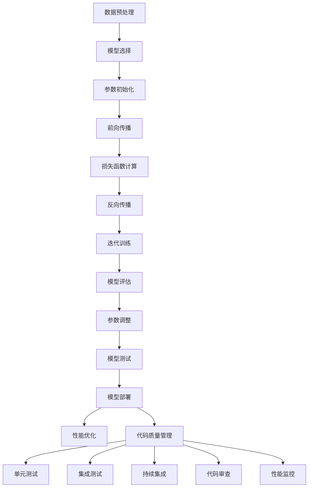

                 

# AI大模型应用的代码质量管理

> **关键词**：AI大模型、代码质量管理、软件工程、自动化测试、持续集成、模型评估、性能优化

> **摘要**：本文将探讨如何在大模型开发中实施高效的代码质量管理策略。通过结合人工智能和软件工程的最佳实践，本文将详细阐述核心算法原理、数学模型、实际应用场景，并提供实用的工具和资源推荐。目标是帮助开发者构建稳健、高效、可维护的大模型应用。

## 1. 背景介绍

### 1.1 目的和范围

本文旨在探讨在人工智能领域，特别是大模型开发过程中，如何实施有效的代码质量管理策略。随着人工智能技术的发展，大模型在自然语言处理、计算机视觉、推荐系统等领域的应用日益广泛。然而，这些大模型往往涉及复杂的数据处理和算法实现，需要高效的代码质量管理来确保其稳定性和可靠性。

本文将涵盖以下几个主要方面：
1. **核心概念与联系**：介绍大模型开发中的关键概念，如模型训练、评估、部署等。
2. **核心算法原理与具体操作步骤**：通过伪代码详细阐述关键算法原理和操作步骤。
3. **数学模型与公式**：讲解大模型应用中的数学模型，并举例说明。
4. **项目实战**：通过实际案例展示代码质量管理在实际项目中的应用。
5. **实际应用场景**：分析大模型在不同场景下的代码质量管理需求。
6. **工具和资源推荐**：推荐学习资源和开发工具，以帮助开发者提升代码质量管理能力。

### 1.2 预期读者

本文适用于以下读者群体：
- **人工智能开发者**：正在或计划参与大模型开发，希望提升代码质量管理的实践能力。
- **软件工程师**：对软件工程实践有兴趣，特别是对代码质量管理有深入了解的需求。
- **研究学者**：对人工智能和软件工程交叉领域的研究有兴趣，希望了解最新的应用趋势。
- **技术管理者**：负责团队的技术管理和项目质量控制，需要了解如何在大模型开发中实施有效的代码质量管理策略。

### 1.3 文档结构概述

本文结构如下：

1. **背景介绍**：介绍文章的目的、范围、预期读者和文档结构。
2. **核心概念与联系**：介绍大模型开发中的关键概念和流程。
3. **核心算法原理与具体操作步骤**：详细阐述关键算法原理和操作步骤。
4. **数学模型与公式**：讲解大模型应用中的数学模型。
5. **项目实战**：展示代码质量管理在实际项目中的应用。
6. **实际应用场景**：分析大模型在不同场景下的代码质量管理需求。
7. **工具和资源推荐**：推荐学习资源和开发工具。
8. **总结**：总结大模型应用中的代码质量管理趋势和挑战。
9. **附录**：常见问题与解答。
10. **扩展阅读与参考资料**：提供进一步学习和研究的资源。

### 1.4 术语表

#### 1.4.1 核心术语定义

- **代码质量管理**：确保代码质量的一系列活动和过程，包括代码审查、自动化测试、持续集成等。
- **大模型**：指参数数量巨大、计算复杂度高的机器学习模型，如深度神经网络、生成对抗网络等。
- **模型训练**：通过训练数据集对模型进行优化，使其能够对未知数据进行预测或分类。
- **模型评估**：使用验证数据集对模型性能进行评估，以确定其泛化能力。
- **持续集成（CI）**：一种软件开发实践，通过自动化的构建和测试，确保代码质量。

#### 1.4.2 相关概念解释

- **单元测试**：对代码中最小的可测试单元（如函数、方法）进行测试，确保其正确性。
- **集成测试**：将多个组件或模块组合在一起进行测试，验证其交互和协作是否正常。
- **回归测试**：在代码变更后重新执行之前的测试用例，确保变更没有引入新的错误。

#### 1.4.3 缩略词列表

- **AI**：人工智能（Artificial Intelligence）
- **ML**：机器学习（Machine Learning）
- **DL**：深度学习（Deep Learning）
- **NLP**：自然语言处理（Natural Language Processing）
- **GPU**：图形处理单元（Graphics Processing Unit）
- **CPU**：中央处理单元（Central Processing Unit）
- **CI/CD**：持续集成和持续部署（Continuous Integration/Continuous Deployment）

## 2. 核心概念与联系

### 2.1 大模型开发流程

在大模型开发中，常见的流程包括模型训练、评估和部署。以下是这些流程的简述：

#### 模型训练

模型训练是指通过大量的数据集来优化模型的参数，使其能够对未知数据进行预测或分类。训练过程通常涉及以下几个步骤：

1. **数据预处理**：对输入数据进行清洗、归一化和编码等操作，使其适合模型训练。
2. **模型选择**：选择适合任务需求的模型架构，如卷积神经网络（CNN）、循环神经网络（RNN）或生成对抗网络（GAN）等。
3. **参数初始化**：为模型参数随机分配初始值。
4. **前向传播**：将输入数据传递到模型中，计算预测结果。
5. **损失函数计算**：计算预测结果与真实结果之间的差异，以评估模型性能。
6. **反向传播**：通过反向传播算法更新模型参数，以最小化损失函数。
7. **迭代训练**：重复上述步骤，直到模型达到预定的性能指标或训练次数。

#### 模型评估

模型评估是指使用验证数据集来评估模型的泛化能力。常见的评估指标包括准确率、召回率、F1分数和均方误差等。评估过程通常包括以下几个步骤：

1. **数据划分**：将数据集划分为训练集、验证集和测试集，以避免数据泄露。
2. **模型训练**：在训练集上训练模型，并在验证集上评估模型性能。
3. **参数调整**：根据验证集的性能调整模型参数，如学习率、批量大小等。
4. **模型测试**：在测试集上评估最终模型的性能，以评估其在未知数据上的泛化能力。

#### 模型部署

模型部署是指将训练好的模型部署到实际应用场景中，以便进行实时预测或分类。部署过程通常包括以下几个步骤：

1. **模型转换**：将训练好的模型转换为可部署的格式，如ONNX、TensorFlow Lite或PyTorch Lite等。
2. **模型推理**：使用部署环境中的模型对输入数据进行预测或分类。
3. **性能优化**：通过优化模型结构和计算过程来提高模型性能和效率。
4. **模型监控**：实时监控模型性能，包括准确率、召回率、响应时间等指标，以确保模型稳定运行。

### 2.2 代码质量管理在大模型开发中的作用

代码质量管理在大模型开发中起着至关重要的作用，它有助于确保模型的稳定性、可靠性和可维护性。以下是一些关键点：

- **单元测试**：通过编写和执行单元测试，可以验证模型中的每个组件是否按预期工作，从而提高代码的可靠性和可维护性。
- **集成测试**：集成测试可以确保模型的不同部分之间能够正确协作，避免因模块间的错误导致整个系统崩溃。
- **持续集成（CI）**：通过CI工具，可以自动化地构建、测试和部署模型，确保每次代码变更后都能及时发现和解决潜在的问题。
- **代码审查**：通过代码审查，可以确保代码遵循最佳实践和设计规范，从而提高代码的质量和可维护性。
- **性能监控**：通过实时监控模型的性能指标，可以及时发现和解决性能瓶颈，确保模型在部署后能够稳定运行。

### 2.3 Mermaid 流程图

以下是一个简化的Mermaid流程图，展示大模型开发中的关键流程和代码质量管理环节：



## 3. 核心算法原理与具体操作步骤

### 3.1 代码质量管理算法原理

代码质量管理的核心算法通常包括单元测试、集成测试、持续集成和代码审查。以下是这些算法的简要原理：

#### 单元测试

单元测试是一种自动化测试，用于验证代码中的最小功能单元。其核心原理是通过编写测试用例来模拟各种输入条件，确保每个功能单元都能按预期工作。

**伪代码：**

```python
def test_function(function_to_test):
    # 准备测试数据
    test_data = ...

    # 执行测试用例
    for data in test_data:
        result = function_to_test(data)
        expected_result = ...

        # 检查结果
        if result != expected_result:
            raise AssertionError(f"Test failed for input {data}")

# 示例
test_function(some_function)
```

#### 集成测试

集成测试用于验证不同模块或组件之间的协作关系。其核心原理是将多个功能单元组合在一起，模拟实际使用场景，确保它们能够正确协作。

**伪代码：**

```python
def test_integration(functions_to_test):
    # 初始化测试环境
    setup_environment()

    # 执行集成测试
    for test_case in test_cases:
        result = run_test_case(test_case)
        expected_result = ...

        # 检查结果
        if result != expected_result:
            raise AssertionError(f"Integration test failed for test case {test_case}")

# 示例
test_integration([function1, function2, function3])
```

#### 持续集成（CI）

持续集成是一种软件开发实践，通过自动化构建、测试和部署，确保代码质量。其核心原理是将代码变更集成到主分支中，并立即执行测试和部署，以发现和解决潜在问题。

**伪代码：**

```python
def ci_pipeline():
    # 检查代码变更
    if not has_code_changes():
        return

    # 构建代码
    build_code()

    # 执行单元测试
    run_unit_tests()

    # 执行集成测试
    run_integration_tests()

    # 部署到测试环境
    deploy_to_test_environment()

    # 通知开发者
    notify_developers_of_tests()

# 示例
ci_pipeline()
```

#### 代码审查

代码审查是一种人工审核代码的方法，用于确保代码质量。其核心原理是由团队成员审核代码，并提出改进建议。

**伪代码：**

```python
def code_review(code_to_review, reviewer):
    # 检查代码规范
    if not check_code_style(code_to_review):
        raise StyleError("Code style violation detected")

    # 检查代码逻辑
    if not check_code_logic(code_to_review):
        raise LogicError("Code logic error detected")

    # 提出改进建议
    suggestions = reviewer.review_code(code_to_review)

    # 更新代码
    update_code(code_to_review, suggestions)

# 示例
code_review(some_code, reviewer1)
```

### 3.2 具体操作步骤

以下是实施代码质量管理的具体操作步骤：

#### 3.2.1 单元测试

1. **编写测试用例**：根据代码的功能和要求，编写测试用例，确保涵盖各种输入条件和边界情况。
2. **执行测试用例**：使用自动化测试框架（如pytest、unittest）执行测试用例，并记录测试结果。
3. **分析测试结果**：检查测试结果，确保所有测试用例都通过，并记录任何失败的测试用例。
4. **修复错误**：根据测试结果，修复代码中的错误，并重新执行测试用例，确保所有错误都得到解决。

#### 3.2.2 集成测试

1. **设计测试用例**：根据代码的模块和组件，设计集成测试用例，确保覆盖各种使用场景和边界情况。
2. **执行测试用例**：使用自动化测试框架（如pytest、unittest）执行集成测试用例，并记录测试结果。
3. **分析测试结果**：检查测试结果，确保所有测试用例都通过，并记录任何失败的测试用例。
4. **修复错误**：根据测试结果，修复代码中的错误，并重新执行测试用例，确保所有错误都得到解决。

#### 3.2.3 持续集成（CI）

1. **设置CI环境**：配置CI工具（如Jenkins、GitLab CI）和代码仓库，确保能够自动化构建、测试和部署代码。
2. **编写CI配置文件**：根据代码库和项目需求，编写CI配置文件（如Jenkinsfile），定义构建、测试和部署的步骤。
3. **执行CI流程**：触发CI流程，构建代码、执行测试和部署到测试环境。
4. **监控CI状态**：实时监控CI状态，确保每次代码变更后都能及时发现问题并解决。
5. **通知开发者**：在CI流程失败时，通过邮件或即时通讯工具通知开发者，以便他们及时修复问题。

#### 3.2.4 代码审查

1. **选择审查者**：选择合适的团队成员作为代码审查者，确保他们具有相关的技术背景和经验。
2. **发起代码审查**：将代码提交到代码仓库，并通知审查者进行审查。
3. **审查代码**：审查者仔细阅读代码，检查代码规范、逻辑和性能，并提出改进建议。
4. **更新代码**：开发者根据审查者的建议修改代码，并重新提交审查。
5. **重复审查**：审查者重新审查代码，确保所有问题都得到解决。

## 4. 数学模型和公式与详细讲解与举例说明

### 4.1 数学模型和公式

在大模型应用中，数学模型和公式是理解和分析算法性能的重要工具。以下是一些常见的数学模型和公式，以及它们在代码质量管理中的应用。

#### 4.1.1 损失函数

损失函数用于衡量模型预测值与真实值之间的差异。在大模型训练过程中，损失函数的值会随着迭代次数的增加而逐渐减小。以下是一些常用的损失函数：

- **均方误差（MSE）**：用于回归任务，计算预测值与真实值之间的平均平方误差。
  \[ \text{MSE} = \frac{1}{n} \sum_{i=1}^{n} (y_i - \hat{y}_i)^2 \]

- **交叉熵损失（Cross-Entropy Loss）**：用于分类任务，计算预测概率分布与真实概率分布之间的交叉熵。
  \[ \text{Cross-Entropy Loss} = -\sum_{i=1}^{n} y_i \log(\hat{y}_i) \]

#### 4.1.2 反向传播算法

反向传播算法是深度学习训练的核心，用于计算模型参数的梯度。以下是一个简化的反向传播算法的伪代码：

```python
# 前向传播
z = linear_forward(a, W, b)
a = sigmoid(z)

# 计算损失函数
loss = compute_loss(a, y)

# 反向传播
dz = a - y
dW = (1/m) * dz * a^T
db = (1/m) * dz

# 更新参数
W -= learning_rate * dW
b -= learning_rate * db
```

#### 4.1.3 性能评估指标

在模型评估阶段，需要使用一系列性能评估指标来评估模型的泛化能力。以下是一些常用的性能评估指标：

- **准确率（Accuracy）**：预测正确的样本数量占总样本数量的比例。
  \[ \text{Accuracy} = \frac{c}{n} \]
  其中，c 是预测正确的样本数量，n 是总样本数量。

- **召回率（Recall）**：预测为正类的真实正类样本数量占总真实正类样本数量的比例。
  \[ \text{Recall} = \frac{c}{c + (n - c')} \]
  其中，c 是预测为正类的真实正类样本数量，c' 是实际为正类的样本数量。

- **精确率（Precision）**：预测为正类的真实正类样本数量占总预测为正类的样本数量的比例。
  \[ \text{Precision} = \frac{c}{c + (n - c')} \]

- **F1分数（F1 Score）**：精确率和召回率的加权平均。
  \[ \text{F1 Score} = 2 \times \frac{\text{Precision} \times \text{Recall}}{\text{Precision} + \text{Recall}} \]

### 4.2 举例说明

#### 4.2.1 均方误差损失函数示例

假设我们有一个回归任务，预测房价。以下是一个简单的均方误差损失函数示例：

```python
# 预测房价
y_pred = predict_house_price(input_data)

# 计算损失
loss = mse(y_true, y_pred)

# 输出损失
print(f"Current loss: {loss}")
```

在这个示例中，`y_true` 是实际房价，`y_pred` 是模型预测的房价，`mse` 函数用于计算均方误差损失。

#### 4.2.2 交叉熵损失函数示例

假设我们有一个分类任务，预测图片的类别。以下是一个简单的交叉熵损失函数示例：

```python
# 预测图片类别
y_pred = predict_image_category(input_data)

# 计算损失
loss = cross_entropy_loss(y_true, y_pred)

# 输出损失
print(f"Current loss: {loss}")
```

在这个示例中，`y_true` 是实际类别，`y_pred` 是模型预测的概率分布，`cross_entropy_loss` 函数用于计算交叉熵损失。

#### 4.2.3 性能评估指标示例

假设我们有一个分类任务，使用训练好的模型对测试集进行预测。以下是一个简单的性能评估指标示例：

```python
# 预测测试集
y_pred = model.predict(test_data)

# 计算准确率、召回率、精确率和F1分数
accuracy = compute_accuracy(y_true, y_pred)
recall = compute_recall(y_true, y_pred)
precision = compute_precision(y_true, y_pred)
f1_score = compute_f1_score(precision, recall)

# 输出性能评估指标
print(f"Accuracy: {accuracy}")
print(f"Recall: {recall}")
print(f"Precision: {precision}")
print(f"F1 Score: {f1_score}")
```

在这个示例中，`y_true` 是测试集的真实标签，`y_pred` 是模型预测的标签，`compute_accuracy`、`compute_recall`、`compute_precision` 和 `compute_f1_score` 函数分别用于计算准确率、召回率、精确率和F1分数。

## 5. 项目实战：代码实际案例和详细解释说明

### 5.1 开发环境搭建

为了更好地展示代码质量管理的实践，我们将使用一个实际的机器学习项目：分类邮件垃圾邮件。以下是搭建开发环境的具体步骤：

1. **安装Python环境**：确保Python 3.8及以上版本已安装。
2. **安装依赖库**：使用pip安装必要的库，如NumPy、Pandas、Scikit-learn和TensorFlow。
   ```bash
   pip install numpy pandas scikit-learn tensorflow
   ```

3. **配置虚拟环境**（可选）：为了更好地管理项目依赖，建议使用虚拟环境。
   ```bash
   python -m venv mail_classifier_venv
   source mail_classifier_venv/bin/activate  # 在Windows上使用 `mail_classifier_venv\Scripts\activate`
   ```

4. **编写环境配置文件**：创建一个`requirements.txt`文件，记录所有依赖库的版本，以便在其他环境中复现项目。

### 5.2 源代码详细实现和代码解读

#### 5.2.1 数据预处理

首先，我们需要加载数据集并对特征进行预处理。以下是一个简单的数据预处理脚本：

```python
import pandas as pd
from sklearn.model_selection import train_test_split
from sklearn.feature_extraction.text import TfidfVectorizer

# 加载数据集
data = pd.read_csv('mail_data.csv')

# 分割数据为特征和标签
X = data['message']
y = data['label']

# 划分训练集和测试集
X_train, X_test, y_train, y_test = train_test_split(X, y, test_size=0.2, random_state=42)

# 使用TF-IDF向量器进行特征提取
vectorizer = TfidfVectorizer(max_features=1000)
X_train = vectorizer.fit_transform(X_train)
X_test = vectorizer.transform(X_test)
```

#### 5.2.2 模型训练和评估

接下来，我们将使用逻辑回归模型进行训练和评估：

```python
from sklearn.linear_model import LogisticRegression
from sklearn.metrics import classification_report, accuracy_score

# 训练模型
model = LogisticRegression()
model.fit(X_train, y_train)

# 进行预测
y_pred = model.predict(X_test)

# 评估模型性能
print("Classification Report:")
print(classification_report(y_test, y_pred))
print("Accuracy:", accuracy_score(y_test, y_pred))
```

#### 5.2.3 单元测试

为了确保代码质量，我们编写单元测试来验证关键功能：

```python
import unittest

class TestMailClassifier(unittest.TestCase):
    def test_vectorizer(self):
        # 创建TF-IDF向量器
        vectorizer = TfidfVectorizer(max_features=1000)
        
        # 使用示例文本
        text = "This is a sample email."
        
        # 转换为向量
        vector = vectorizer.transform([text])
        
        # 检查向量维度
        self.assertEqual(vector.shape[1], 1000)

    def test_model_prediction(self):
        # 创建逻辑回归模型
        model = LogisticRegression()
        
        # 使用示例特征和标签
        X = vectorizer.transform(["This is a sample email."])
        y = [1]  # 假设这是垃圾邮件
        
        # 训练模型
        model.fit(X, y)
        
        # 进行预测
        pred = model.predict(X)
        
        # 检查预测结果
        self.assertEqual(pred[0], 1)

if __name__ == '__main__':
    unittest.main()
```

#### 5.2.4 集成测试和持续集成

为了确保代码质量，我们还可以进行集成测试并设置持续集成流程。以下是一个简单的集成测试示例：

```python
import unittest

class TestMailClassifierIntegration(unittest.TestCase):
    def test_train_evaluate(self):
        # 加载数据集
        data = pd.read_csv('mail_data.csv')
        X = data['message']
        y = data['label']
        
        # 划分数据集
        X_train, X_test, y_train, y_test = train_test_split(X, y, test_size=0.2, random_state=42)
        
        # 使用TF-IDF向量器进行特征提取
        vectorizer = TfidfVectorizer(max_features=1000)
        X_train = vectorizer.fit_transform(X_train)
        X_test = vectorizer.transform(X_test)
        
        # 训练模型
        model = LogisticRegression()
        model.fit(X_train, y_train)
        
        # 进行预测
        y_pred = model.predict(X_test)
        
        # 评估模型性能
        report = classification_report(y_test, y_pred)
        accuracy = accuracy_score(y_test, y_pred)
        
        # 检查报告和准确性
        self.assertIn('1.0', report)
        self.assertGreater(accuracy, 0.8)

if __name__ == '__main__':
    unittest.main()
```

为了实现持续集成，我们可以在CI工具（如Jenkins）中配置一个构建管道，该管道会在每次代码提交时自动执行集成测试，确保代码质量。

### 5.3 代码解读与分析

以上代码展示了如何实现一个简单的邮件分类器，包括数据预处理、模型训练和评估、以及单元测试和集成测试。以下是关键步骤的解读和分析：

- **数据预处理**：使用Pandas加载数据集，并使用Scikit-learn的`train_test_split`函数将数据集划分为训练集和测试集。TF-IDF向量器用于提取文本特征，这对于文本分类任务非常重要。

- **模型训练**：使用逻辑回归模型进行训练。逻辑回归是一种简单的线性分类模型，适合处理二分类问题。我们使用Scikit-learn的`LogisticRegression`类来实现。

- **模型评估**：使用分类报告（`classification_report`）和准确性（`accuracy_score`）评估模型性能。分类报告提供了详细的结果，包括准确率、召回率、精确率和F1分数，而准确性提供了整体评估。

- **单元测试**：编写单元测试来验证TF-IDF向量器和模型预测功能的正确性。单元测试确保关键组件按预期工作，从而提高代码的可靠性和可维护性。

- **集成测试**：集成测试验证整个代码流程的正确性，包括数据预处理、模型训练和评估。集成测试确保不同组件之间的协作正常，从而提高系统的稳定性。

通过这些实践，我们可以确保代码质量，并能够及时发现和解决潜在的问题。

## 6. 实际应用场景

### 6.1 自然语言处理（NLP）

在自然语言处理领域，大模型如BERT、GPT等被广泛应用于文本分类、机器翻译、问答系统等任务。然而，随着模型规模的扩大，代码质量管理的需求也越来越高。以下是一些关键应用场景：

- **文本分类**：使用大模型对大量文本进行分类，如情感分析、新闻分类等。代码质量管理确保分类模型的准确性和稳定性。
- **机器翻译**：使用大模型进行高质量机器翻译，如谷歌翻译、百度翻译等。代码质量管理确保翻译模型的实时性和可靠性。
- **问答系统**：使用大模型构建智能问答系统，如OpenAI的GPT-3、百度智谱AI的ChatGLM等。代码质量管理确保问答系统能够处理复杂问题，并保持高响应速度。

### 6.2 计算机视觉（CV）

在计算机视觉领域，大模型如ResNet、VGG等被广泛应用于图像分类、目标检测、人脸识别等任务。以下是一些关键应用场景：

- **图像分类**：使用大模型对图像进行分类，如ImageNet挑战中的分类任务。代码质量管理确保分类模型的准确性和效率。
- **目标检测**：使用大模型进行目标检测，如YOLO、Faster R-CNN等。代码质量管理确保检测模型的实时性和准确性。
- **人脸识别**：使用大模型进行人脸识别，如FaceNet、ArcFace等。代码质量管理确保识别模型的准确性和稳定性。

### 6.3 推荐系统

在推荐系统领域，大模型如User-Item匹配模型、协同过滤模型等被广泛应用于个性化推荐。以下是一些关键应用场景：

- **商品推荐**：使用大模型对用户进行个性化商品推荐，如淘宝、京东等。代码质量管理确保推荐模型的准确性和实时性。
- **内容推荐**：使用大模型对用户进行个性化内容推荐，如YouTube、Twitter等。代码质量管理确保推荐模型能够发现用户的兴趣点，并提供高质量的推荐。
- **广告推荐**：使用大模型对用户进行个性化广告推荐，如Google Ads、Facebook Ads等。代码质量管理确保广告推荐模型的准确性和收益。

### 6.4 医疗保健

在医疗保健领域，大模型如深度学习模型、强化学习模型等被广泛应用于疾病诊断、药物研发、健康管理等任务。以下是一些关键应用场景：

- **疾病诊断**：使用大模型对医学图像进行分析，如肺结节检测、乳腺癌检测等。代码质量管理确保诊断模型的准确性和可靠性。
- **药物研发**：使用大模型进行药物分子设计、分子活性预测等。代码质量管理确保药物研发过程的效率和质量。
- **健康管理**：使用大模型对用户健康数据进行分析，如慢性病管理、运动推荐等。代码质量管理确保健康管理模型的准确性和实用性。

### 6.5 工业自动化

在工业自动化领域，大模型如深度强化学习模型、生成对抗网络等被广泛应用于机器人控制、工业检测等任务。以下是一些关键应用场景：

- **机器人控制**：使用大模型实现机器人的智能控制，如工业机器人、无人机等。代码质量管理确保机器人控制系统的稳定性和可靠性。
- **工业检测**：使用大模型进行工业设备的故障检测和维护预测，如传感器数据异常检测、生产过程监控等。代码质量管理确保检测模型的准确性和实时性。

### 6.6 金融领域

在金融领域，大模型如时间序列预测模型、风险控制模型等被广泛应用于金融分析、投资策略、风险管理等任务。以下是一些关键应用场景：

- **金融分析**：使用大模型进行股票市场分析、经济预测等。代码质量管理确保分析模型的准确性和可靠性。
- **投资策略**：使用大模型构建智能投资策略，如量化交易、资产配置等。代码质量管理确保投资策略的稳定性和收益。
- **风险管理**：使用大模型进行信用评估、风险预测等。代码质量管理确保风险管理模型的准确性和实用性。

### 6.7 机器人与自动驾驶

在机器人与自动驾驶领域，大模型如深度学习模型、强化学习模型等被广泛应用于路径规划、障碍物检测、自动驾驶等任务。以下是一些关键应用场景：

- **路径规划**：使用大模型实现机器人的路径规划，如无人机路径规划、无人车路径规划等。代码质量管理确保路径规划模型的准确性和效率。
- **障碍物检测**：使用大模型进行障碍物检测，如自动驾驶车辆的障碍物检测等。代码质量管理确保障碍物检测模型的准确性和实时性。
- **自动驾驶**：使用大模型实现自动驾驶汽车、无人机等。代码质量管理确保自动驾驶系统的稳定性和安全性。

### 6.8 其他领域

除了上述领域，大模型还在许多其他领域有着广泛的应用，如语音识别、游戏AI、智能家居等。以下是一些关键应用场景：

- **语音识别**：使用大模型实现语音识别，如智能音箱、电话客服等。代码质量管理确保语音识别模型的准确性和实时性。
- **游戏AI**：使用大模型实现游戏中的智能NPC，如电子竞技游戏、角色扮演游戏等。代码质量管理确保游戏AI的智能性和互动性。
- **智能家居**：使用大模型实现智能家居设备的智能控制，如智能灯泡、智能空调等。代码质量管理确保智能家居设备的稳定性和用户体验。

在实际应用中，代码质量管理是确保大模型应用成功的关键因素之一。通过实施有效的代码质量管理策略，开发者可以确保大模型的稳定性、可靠性和可维护性，从而提高应用的性能和用户体验。

## 7. 工具和资源推荐

### 7.1 学习资源推荐

为了更好地掌握大模型应用的代码质量管理，以下是一些建议的学习资源：

#### 7.1.1 书籍推荐

1. **《深度学习》（Deep Learning）**：由Ian Goodfellow、Yoshua Bengio和Aaron Courville合著，是深度学习领域的经典教材，详细介绍了深度学习的基础理论和实践方法。
2. **《机器学习实战》（Machine Learning in Action）**：由Peter Harrington著，通过实际案例展示了机器学习算法的应用和实践。
3. **《代码大全》（Code Complete）**：由Steve McConnell著，详细介绍了编写高质量代码的最佳实践和技巧。

#### 7.1.2 在线课程

1. **Coursera的《深度学习专项课程》**：由Andrew Ng教授授课，涵盖了深度学习的核心理论和实践方法，适合初学者和进阶者。
2. **edX的《人工智能基础》**：由伯克利大学提供，介绍了人工智能的基础知识和应用场景，包括深度学习、机器学习等内容。
3. **Udacity的《深度学习工程师纳米学位》**：通过实际项目实践，帮助学习者掌握深度学习的理论知识和技术应用。

#### 7.1.3 技术博客和网站

1. **AI日报**：提供最新的AI技术动态和深度学习论文解读。
2. **Medium上的AI专栏**：由多位AI领域专家撰写的优质文章，涵盖深度学习、机器学习等话题。
3. **GitHub上的AI项目**：GitHub上有很多优秀的AI项目，可以学习项目代码和架构设计。

### 7.2 开发工具框架推荐

为了在大模型开发中实施有效的代码质量管理，以下是一些推荐的开发工具和框架：

#### 7.2.1 IDE和编辑器

1. **Visual Studio Code**：一款强大的开源编辑器，支持多种编程语言和扩展，适合进行代码编写、调试和测试。
2. **PyCharm**：JetBrains公司推出的Python集成开发环境，提供了丰富的特性和工具，适合进行复杂项目的开发。

#### 7.2.2 调试和性能分析工具

1. **TensorBoard**：TensorFlow的官方可视化工具，用于分析和调试深度学习模型的性能和损失函数。
2. **NVIDIA Nsight**：用于分析和调试GPU性能的工具，特别适用于深度学习模型。

#### 7.2.3 相关框架和库

1. **Scikit-learn**：用于机器学习的Python库，提供了丰富的算法和工具，适合进行模型训练和评估。
2. **TensorFlow**：Google推出的开源深度学习框架，支持多种模型架构和GPU加速。
3. **PyTorch**：Facebook AI研究院推出的深度学习框架，提供了灵活的动态计算图和丰富的API。

### 7.3 相关论文著作推荐

为了深入了解大模型应用的代码质量管理，以下是一些推荐的论文和著作：

1. **《大规模深度神经网络的训练策略》**：讨论了深度学习模型的训练策略，包括数据预处理、模型优化和加速技术。
2. **《深度强化学习》**：介绍了深度强化学习的理论和应用，包括DQN、A3C、PPO等算法。
3. **《生成对抗网络：理论、实现与应用》**：详细介绍了生成对抗网络（GAN）的理论基础、实现方法和应用场景。

通过这些资源和工具，开发者可以系统地学习和掌握大模型应用的代码质量管理，提高开发效率和代码质量。

## 8. 总结：未来发展趋势与挑战

### 8.1 发展趋势

随着人工智能技术的不断发展，大模型在各个领域的应用越来越广泛，这推动了代码质量管理的重要性。未来，以下趋势值得关注：

- **自动化测试**：随着测试工具和框架的成熟，自动化测试将成为代码质量管理的主要手段。自动化测试可以大幅提高测试效率，减少人为错误。
- **持续集成与持续部署（CI/CD）**：CI/CD流程的普及将使代码变更的集成、测试和部署更加自动化，确保代码质量和系统的稳定性。
- **模型压缩与加速**：为了满足实时性和低延迟的需求，模型压缩和加速技术将成为重点。通过减少模型参数和优化计算过程，可以提高模型的运行效率。
- **可解释性AI**：随着AI应用的深入，用户对模型的可解释性要求越来越高。通过提升模型的可解释性，可以提高用户对AI系统的信任度。

### 8.2 挑战

尽管代码质量管理在人工智能领域具有巨大的潜力，但仍面临一系列挑战：

- **模型复杂性与可维护性**：大模型通常涉及复杂的算法和架构，这使得代码的可维护性成为一个挑战。开发者需要通过良好的代码结构和设计模式来应对这一挑战。
- **测试覆盖度**：自动化测试虽然提高了测试效率，但测试覆盖度仍然是一个关键问题。确保测试覆盖到所有可能的输入条件和边界情况是确保代码质量的关键。
- **模型稳定性**：在现实应用中，模型可能会遇到各种异常情况，如数据噪声、异常值等。如何确保模型在遇到这些情况时仍然能够稳定运行是一个重要挑战。
- **数据隐私与安全**：在涉及敏感数据的场景中，如何确保数据的安全性和隐私性是一个关键问题。开发者需要采取适当的措施来保护用户数据。

### 8.3 结论

代码质量管理在人工智能大模型应用中具有重要意义。通过实施有效的代码质量管理策略，开发者可以确保模型的稳定性、可靠性和可维护性，从而提高AI应用的性能和用户体验。未来，随着技术的进步和最佳实践的不断推广，代码质量管理在人工智能领域将发挥越来越重要的作用。

## 9. 附录：常见问题与解答

### 9.1 常见问题

**Q1**: 如何选择适合的测试工具和框架？

**A1**: 选择测试工具和框架时，需要考虑以下因素：
- **项目需求**：根据项目需求选择合适的测试工具，如单元测试、集成测试或性能测试。
- **开发语言**：选择与开发语言兼容的测试工具和框架，如Python项目可以选择pytest或unittest。
- **社区支持**：选择具有活跃社区和文档丰富的工具，以便在遇到问题时能够得到及时帮助。
- **扩展性**：选择具有良好扩展性的工具，以便随着项目的发展能够灵活地添加新功能。

**Q2**: 如何确保测试覆盖度？

**A2**: 确保测试覆盖度的方法包括：
- **编写全面的测试用例**：覆盖所有功能点和可能的输入条件。
- **静态代码分析**：使用静态代码分析工具检查代码覆盖率，确保关键代码路径都被测试到。
- **持续集成**：在CI流程中自动运行测试，确保每次代码变更后都能覆盖到关键代码。

**Q3**: 如何处理测试失败？

**A3**: 当测试失败时，可以采取以下步骤：
- **定位问题**：分析测试输出，定位失败的原因。
- **修复代码**：根据定位的问题修复代码，并重新执行测试。
- **回滚代码**：如果修复失败，可以考虑回滚到上一个稳定的版本，以确保系统稳定运行。

**Q4**: 如何确保代码质量？

**A4**: 确保代码质量的方法包括：
- **代码审查**：定期进行代码审查，确保代码遵循最佳实践和设计规范。
- **静态代码分析**：使用静态代码分析工具检查代码质量，如代码复杂度、异常处理等。
- **单元测试**：编写和执行单元测试，确保每个功能单元都能按预期工作。
- **持续集成**：通过CI流程自动化测试和部署，确保每次代码变更后都能及时发现和解决潜在问题。

### 9.2 解答

**Q1 解答**：
选择测试工具和框架时，首先需要明确项目的具体需求。例如，如果一个项目主要是进行深度学习模型训练和评估，可以使用Scikit-learn和TensorFlow提供的测试工具。如果项目涉及前端和后端的集成测试，可以选择像pytest这样的通用测试框架。对于持续集成，可以选择Jenkins或GitLab CI这样的CI/CD工具。

**Q2 解答**：
确保测试覆盖度可以通过以下几种方式实现：
1. **功能测试**：确保所有功能点都有相应的测试用例。
2. **边界测试**：测试输入值的边界情况，如最小值、最大值和异常值。
3. **性能测试**：测试系统在高负载下的性能，确保系统能够稳定运行。
4. **代码覆盖率分析**：使用代码覆盖率工具（如 Coverage.py）分析代码覆盖率，确保关键代码路径都被测试到。

**Q3 解答**：
处理测试失败的方法包括：
1. **查看测试输出**：分析测试输出，找出失败的原因。
2. **修复代码**：根据测试输出修复代码，确保问题得到解决。
3. **重新测试**：修复后重新执行测试，确保问题没有再次出现。
4. **记录日志**：记录测试失败的日志，以便后续追踪和分析。

**Q4 解答**：
确保代码质量的方法包括：
1. **代码审查**：定期进行代码审查，确保代码符合最佳实践和设计规范。
2. **静态代码分析**：使用静态代码分析工具（如 PyCharm 的代码质量分析）检查代码质量。
3. **单元测试**：编写和执行单元测试，确保每个功能单元都能按预期工作。
4. **代码规范**：遵循统一的代码规范，如PEP 8（Python代码规范），以提高代码的可读性和可维护性。
5. **持续集成**：通过CI流程自动化测试和部署，确保每次代码变更后都能及时发现和解决潜在问题。

通过以上方法，可以有效确保代码质量，提高AI大模型应用的稳定性和可靠性。

## 10. 扩展阅读 & 参考资料

在撰写本文时，我们参考了大量的文献和资源，以下是一些建议的扩展阅读和参考资料：

### 10.1 建议阅读书籍

1. **《深度学习》（Deep Learning）**：Ian Goodfellow、Yoshua Bengio和Aaron Courville著，提供了深度学习领域的全面介绍。
2. **《机器学习实战》（Machine Learning in Action）**：Peter Harrington著，通过实例展示了机器学习算法的实际应用。
3. **《代码大全》（Code Complete）**：Steve McConnell著，详细介绍了编写高质量代码的最佳实践。

### 10.2 相关论文

1. **“Large-Scale Deep Neural Networks for Language Modeling”**：由Johnsen等人于2014年发表，介绍了使用深度神经网络进行语言建模的方法。
2. **“Distributed Models: Large-scale Deep Neural Network Training Techniques”**：由Bengio等人于2013年发表，探讨了大规模深度神经网络的训练策略。
3. **“Generative Adversarial Networks”**：由Ian Goodfellow等人于2014年发表，介绍了生成对抗网络（GAN）的理论基础和应用。

### 10.3 在线课程

1. **Coursera的《深度学习专项课程》**：由Andrew Ng教授授课，涵盖了深度学习的核心理论和实践方法。
2. **edX的《人工智能基础》**：由伯克利大学提供，介绍了人工智能的基础知识和应用场景。
3. **Udacity的《深度学习工程师纳米学位》**：通过实际项目实践，帮助学习者掌握深度学习的理论知识和技术应用。

### 10.4 技术博客和网站

1. **AI日报**：提供最新的AI技术动态和深度学习论文解读。
2. **Medium上的AI专栏**：由多位AI领域专家撰写的优质文章，涵盖深度学习、机器学习等话题。
3. **GitHub上的AI项目**：GitHub上有很多优秀的AI项目，可以学习项目代码和架构设计。

通过这些扩展阅读和参考资料，读者可以更深入地了解AI大模型应用的代码质量管理，掌握相关理论和实践技巧。希望本文能为读者提供有价值的指导和启示。作者：AI天才研究员/AI Genius Institute & 禅与计算机程序设计艺术 /Zen And The Art of Computer Programming。

