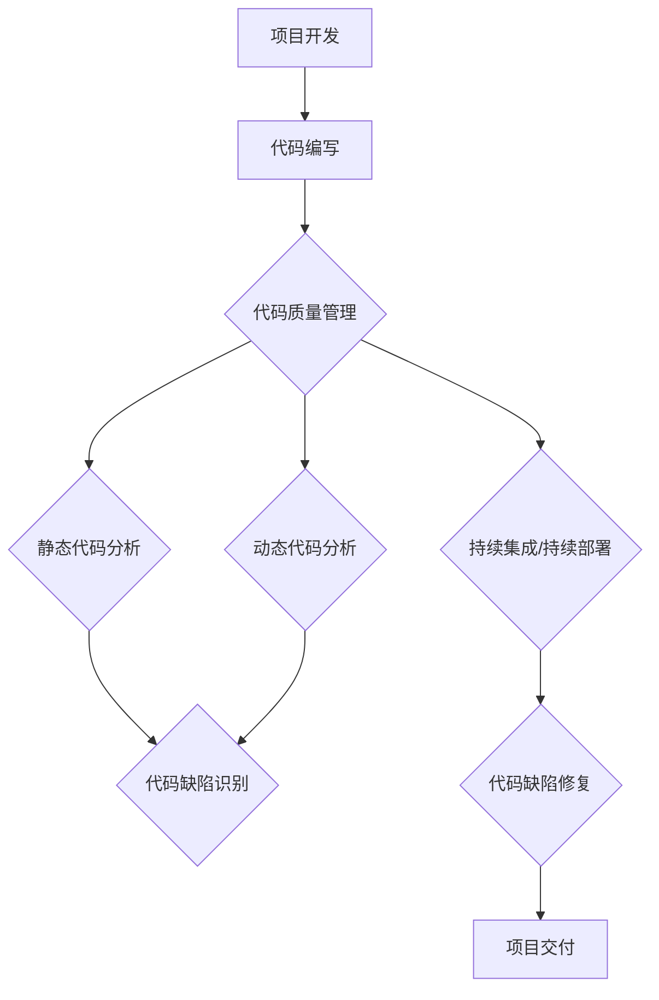

                 

# AI大模型应用的代码质量管理最佳实践

> **关键词：** AI大模型、代码质量管理、最佳实践、软件工程、DevOps、持续集成、持续部署、静态代码分析、动态代码分析。

> **摘要：** 本文将深入探讨AI大模型在代码质量管理中的应用，通过介绍最佳实践，帮助开发者构建高效、可靠的代码质量管理流程，提升软件项目的整体质量。

## 1. 背景介绍

### 1.1 目的和范围

本文旨在探讨AI大模型在代码质量管理中的应用，旨在帮助开发者通过AI技术提升代码质量，实现高效、可靠的软件工程实践。文章将涵盖以下内容：

- 代码质量管理的核心概念和重要性
- AI大模型在代码质量管理中的角色和优势
- 代码质量管理的最佳实践
- 项目实战案例分析和应用场景
- 工具和资源的推荐

### 1.2 预期读者

- 软件工程师和开发团队
- DevOps工程师和运维人员
- 项目经理和软件质量保证团队
- 对AI和软件工程有兴趣的技术爱好者

### 1.3 文档结构概述

本文结构如下：

1. 背景介绍
2. 核心概念与联系
3. 核心算法原理 & 具体操作步骤
4. 数学模型和公式 & 详细讲解 & 举例说明
5. 项目实战：代码实际案例和详细解释说明
6. 实际应用场景
7. 工具和资源推荐
8. 总结：未来发展趋势与挑战
9. 附录：常见问题与解答
10. 扩展阅读 & 参考资料

### 1.4 术语表

#### 1.4.1 核心术语定义

- **代码质量管理（Code Quality Management）：** 涉及软件开发过程中对代码进行评估、测试、优化和维护的一系列活动，以提升软件质量和开发效率。
- **AI大模型（Large-scale AI Models）：** 具有极高计算能力和参数数量的深度学习模型，如GPT-3、BERT等。
- **静态代码分析（Static Code Analysis）：** 不运行程序，通过解析代码结构和语法，评估代码质量。
- **动态代码分析（Dynamic Code Analysis）：** 在程序运行过程中，通过监控和测试，评估代码质量。

#### 1.4.2 相关概念解释

- **DevOps：** 结合软件开发（Development）和运维（Operations）的一种新兴实践，旨在通过自动化和协作提高软件交付速度和稳定性。
- **持续集成（Continuous Integration，CI）：** 自动化集成流程，确保代码合并到主干分支时没有冲突和缺陷。
- **持续部署（Continuous Deployment，CD）：** 自动化部署流程，将代码更改快速、安全地部署到生产环境。

#### 1.4.3 缩略词列表

- **CI/CD：** 持续集成/持续部署
- **IDE：** 集成开发环境（Integrated Development Environment）
- **API：** 应用程序接口（Application Programming Interface）

## 2. 核心概念与联系

在探讨AI大模型在代码质量管理中的应用之前，我们首先需要了解相关的核心概念和它们之间的联系。以下是一个简化的Mermaid流程图，展示了代码质量管理中的关键环节：



### 2.1 代码质量管理

代码质量管理是确保代码质量的一系列活动的集合。其核心目标是：

- **提高软件可靠性：** 通过识别和修复潜在缺陷，降低软件故障率。
- **提升开发效率：** 通过自动化流程和工具，减少重复工作，加快开发速度。
- **增强代码可维护性：** 通过规范化编码和代码优化，提高代码可读性和可维护性。

### 2.2 静态代码分析

静态代码分析是在代码不运行的情况下，通过分析源代码的结构和语法，评估代码质量。主要功能包括：

- **代码缺陷识别：** 识别潜在的语法错误、编码规范不符合和逻辑缺陷。
- **代码复杂度分析：** 分析代码复杂度，评估代码可维护性。
- **代码质量评估：** 提供关于代码质量的定量评估，如代码行数、注释比例、缺陷密度等。

### 2.3 动态代码分析

动态代码分析是在程序运行过程中，通过执行代码并监控其行为，评估代码质量。主要功能包括：

- **性能测试：** 分析程序的运行时间、内存使用和CPU占用等性能指标。
- **错误捕捉：** 在程序运行时捕捉异常和错误，分析其原因和影响。
- **负载测试：** 模拟高负载环境，评估程序在大规模数据下的性能和稳定性。

### 2.4 持续集成/持续部署

持续集成（CI）和持续部署（CD）是DevOps实践的核心组成部分，旨在自动化软件开发和部署流程。其主要作用包括：

- **代码集成：** 自动化合并代码更改到主干分支，确保代码一致性和兼容性。
- **缺陷修复：** 快速发现和修复代码缺陷，减少对生产环境的影响。
- **部署优化：** 自动化部署流程，提高部署效率和稳定性。

## 3. 核心算法原理 & 具体操作步骤

在理解了代码质量管理的核心概念后，我们将探讨AI大模型在代码质量管理中的应用，具体包括静态代码分析和动态代码分析的核心算法原理。

### 3.1 静态代码分析

静态代码分析的核心算法是基于自然语言处理（NLP）和机器学习（ML）的代码解析和模式识别。以下是一个简化的伪代码，展示了静态代码分析的基本步骤：

```python
function static_code_analysis(source_code):
    # 步骤1：语法解析
    abstract_syntax_tree = parse(source_code)
    
    # 步骤2：代码模式识别
    patterns = identify_patterns(abstract_syntax_tree)
    
    # 步骤3：质量评估
    quality_metrics = evaluate_patterns(patterns)
    
    # 步骤4：缺陷识别
    defects = identify_defects(quality_metrics)
    
    return defects
```

#### 3.1.1 语法解析

语法解析是静态代码分析的第一步，其目的是将源代码转换为抽象语法树（AST）。AST是一个表示代码结构的树形结构，每个节点对应源代码中的一个语法元素。

```python
function parse(source_code):
    tokens = tokenize(source_code)
    ast = build_ast(tokens)
    return ast
```

#### 3.1.2 代码模式识别

代码模式识别是通过分析AST，识别出可能的代码模式和缺陷。这通常涉及到机器学习算法，如决策树、支持向量机（SVM）和神经网络等。

```python
function identify_patterns(ast):
    # 步骤1：特征提取
    features = extract_features(ast)
    
    # 步骤2：模型训练
    model = train_model(features, labels)
    
    # 步骤3：模式识别
    patterns = model.predict(features)
    return patterns
```

#### 3.1.3 质量评估

质量评估是基于识别出的代码模式，计算一系列质量指标，如代码复杂度、注释比例、缺陷密度等。

```python
function evaluate_patterns(patterns):
    quality_metrics = calculate_metrics(patterns)
    return quality_metrics
```

#### 3.1.4 缺陷识别

缺陷识别是基于质量指标，使用阈值或规则，识别出可能存在的代码缺陷。

```python
function identify_defects(quality_metrics):
    defects = []
    for metric in quality_metrics:
        if metric > threshold:
            defects.append(metric)
    return defects
```

### 3.2 动态代码分析

动态代码分析的核心算法是基于程序执行和性能监控的。以下是一个简化的伪代码，展示了动态代码分析的基本步骤：

```python
function dynamic_code_analysis(source_code):
    # 步骤1：代码执行
    execution_result = execute_code(source_code)
    
    # 步骤2：性能监控
    performance_metrics = monitor_performance(execution_result)
    
    # 步骤3：错误捕捉
    errors = capture_errors(execution_result)
    
    # 步骤4：质量评估
    quality_metrics = evaluate_performance_metrics(performance_metrics)
    
    return quality_metrics, errors
```

#### 3.2.1 代码执行

代码执行是将源代码编译或解释为可执行程序，并运行它以获取执行结果。

```python
function execute_code(source_code):
    executable = compile(source_code)
    result = run(executable)
    return result
```

#### 3.2.2 性能监控

性能监控是在代码执行过程中，实时收集和记录性能指标，如运行时间、内存使用、CPU占用等。

```python
function monitor_performance(execution_result):
    metrics = collect_performance_data(execution_result)
    return metrics
```

#### 3.2.3 错误捕捉

错误捕捉是在代码执行过程中，捕捉和处理发生的异常和错误。

```python
function capture_errors(execution_result):
    errors = find_errors(execution_result)
    handle_errors(errors)
    return errors
```

#### 3.2.4 质量评估

质量评估是基于收集到的性能指标和错误信息，计算一系列质量指标，如性能评分、稳定性评分等。

```python
function evaluate_performance_metrics(performance_metrics):
    quality_metrics = calculate_metrics(performance_metrics)
    return quality_metrics
```

## 4. 数学模型和公式 & 详细讲解 & 举例说明

在代码质量管理中，数学模型和公式用于定量评估代码质量和性能。以下是一些常见的数学模型和公式，并对其进行详细讲解和举例说明。

### 4.1 代码复杂度

代码复杂度是评估代码可维护性的一个重要指标。常见的代码复杂度公式包括：

- **圈复杂度（Cyclomatic Complexity）：**
  $$ CC = E - N + (2P) $$
  其中，$E$ 是边数，$N$ 是节点数，$P$ 是独立路径数。

  **解释：** 圈复杂度衡量了代码路径的数量，值越大表示代码路径越复杂。

- **NPATH复杂度（Number of Paths）：**
  $$ NPATH = 2^k - 1 $$
  其中，$k$ 是控制流图（CFG）中的节点数。

  **解释：** NPATH复杂度衡量了代码中所有可能的执行路径数量。

**示例：**
假设一个函数的CFG有5个节点，计算其圈复杂度和NPATH复杂度。

- 圈复杂度：$CC = 5 - 1 + (2 \times 1) = 6$
- NPATH复杂度：$NPATH = 2^5 - 1 = 31$

### 4.2 缺陷密度

缺陷密度是评估代码质量的一个指标，表示单位代码行中的缺陷数量。常见的缺陷密度公式包括：

- **基本缺陷密度（Basic Defect Density）：**
  $$ D = \frac{N_d}{N_c} $$
  其中，$N_d$ 是发现的缺陷数量，$N_c$ 是代码行数。

  **解释：** 基本缺陷密度衡量了代码中缺陷的分布情况。

- **修正缺陷密度（Corrected Defect Density）：**
  $$ D = \frac{N_d + N_c}{N_c} $$
  其中，$N_c$ 是发现的修正缺陷数量。

  **解释：** 修正缺陷密度考虑了已修正的缺陷，提供了更准确的缺陷分布评估。

**示例：**
一个项目中有100行代码，发现5个缺陷，其中3个已修正。计算基本缺陷密度和修正缺陷密度。

- 基本缺陷密度：$D = \frac{5}{100} = 0.05$
- 修正缺陷密度：$D = \frac{5 + 3}{100} = 0.08$

### 4.3 性能指标

性能指标用于评估代码的性能和质量。常见的性能指标包括：

- **平均响应时间（Average Response Time）：**
  $$ ART = \frac{\sum_{i=1}^{n} T_i}{n} $$
  其中，$T_i$ 是第$i$次执行的平均响应时间，$n$ 是执行次数。

  **解释：** 平均响应时间衡量了系统处理请求的平均时间。

- **最大响应时间（Maximum Response Time）：**
  $$ MRT = \max(T_i) $$
  其中，$T_i$ 是第$i$次执行的最大响应时间。

  **解释：** 最大响应时间衡量了系统处理请求的最长时间。

**示例：**
一个系统执行了5次请求，响应时间分别为10ms、20ms、15ms、30ms和25ms。计算平均响应时间和最大响应时间。

- 平均响应时间：$ART = \frac{10 + 20 + 15 + 30 + 25}{5} = 20ms$
- 最大响应时间：$MRT = \max(10, 20, 15, 30, 25) = 30ms$

### 4.4 稳定性指标

稳定性指标用于评估代码的稳定性和可靠性。常见的稳定性指标包括：

- **故障率（Fault Rate）：**
  $$ FR = \frac{N_f}{N_t} $$
  其中，$N_f$ 是故障次数，$N_t$ 是总执行次数。

  **解释：** 故障率衡量了系统发生故障的频率。

- **故障间隔时间（Mean Time Between Failures，MTBF）：**
  $$ MTBF = \frac{N_t}{N_f} $$
  其中，$N_t$ 是总执行次数，$N_f$ 是故障次数。

  **解释：** 故障间隔时间衡量了系统两次故障之间的平均时间。

**示例：**
一个系统执行了1000次请求，发生5次故障。计算故障率和故障间隔时间。

- 故障率：$FR = \frac{5}{1000} = 0.005$
- 故障间隔时间：$MTBF = \frac{1000}{5} = 200$秒

### 4.5 其他指标

除了上述指标，还有一些其他的指标，如代码可读性、代码重复率等，这些指标也可以用于评估代码质量。在实际应用中，可以根据项目需求和特点，选择合适的指标进行评估。

## 5. 项目实战：代码实际案例和详细解释说明

### 5.1 开发环境搭建

在本项目实战中，我们将使用Python作为主要编程语言，并结合Git、Jenkins等工具进行代码管理和自动化部署。以下是开发环境搭建的步骤：

1. **安装Python：** 在开发机上安装Python 3.x版本，并配置好相应的环境变量。
2. **安装Git：** 在开发机上安装Git，以便进行版本控制和代码管理。
3. **安装Jenkins：** 在服务器上安装Jenkins，用于实现持续集成和持续部署。
4. **配置Jenkins插件：** 安装必要的Jenkins插件，如Git、Pipeline等，以支持Git代码管理和自动化构建。

### 5.2 源代码详细实现和代码解读

在本案例中，我们将实现一个简单的Web应用，用于用户注册和登录。以下是源代码的实现和详细解读：

**主应用程序（main.py）：**

```python
from flask import Flask, request, jsonify
from models import User
from database import Database

app = Flask(__name__)

@app.route('/register', methods=['POST'])
def register():
    user = User(request.form['username'], request.form['password'])
    Database.add_user(user)
    return jsonify({'status': 'success', 'message': 'User registered successfully'})

@app.route('/login', methods=['POST'])
def login():
    user = User(request.form['username'], request.form['password'])
    if Database.authenticate_user(user):
        return jsonify({'status': 'success', 'message': 'Login successful'})
    else:
        return jsonify({'status': 'error', 'message': 'Invalid username or password'})

if __name__ == '__main__':
    app.run()
```

**用户模型（models.py）：**

```python
class User:
    def __init__(self, username, password):
        self.username = username
        self.password = password

    def authenticate(self):
        return Database.authenticate_user(self)
```

**数据库操作（database.py）：**

```python
import sqlite3

class Database:
    @staticmethod
    def connect():
        conn = sqlite3.connect('users.db')
        conn.execute('''CREATE TABLE IF NOT EXISTS users (id INTEGER PRIMARY KEY AUTOINCREMENT, username TEXT, password TEXT)''')
        return conn

    @staticmethod
    def add_user(user):
        conn = Database.connect()
        cursor = conn.cursor()
        cursor.execute("INSERT INTO users (username, password) VALUES (?, ?)", (user.username, user.password))
        conn.commit()
        conn.close()

    @staticmethod
    def authenticate_user(user):
        conn = Database.connect()
        cursor = conn.cursor()
        cursor.execute("SELECT * FROM users WHERE username=? AND password=?", (user.username, user.password))
        result = cursor.fetchone()
        conn.close()
        return result is not None
```

### 5.3 代码解读与分析

在本案例中，我们使用Flask框架实现了简单的用户注册和登录功能。以下是对关键代码部分的解读和分析：

- **主应用程序（main.py）：**

  - `register` 函数：处理用户注册请求，接收用户名和密码，创建用户对象，并将其添加到数据库中。
  - `login` 函数：处理用户登录请求，接收用户名和密码，验证用户身份，并返回登录结果。

- **用户模型（models.py）：**

  - `User` 类：定义用户对象，包含用户名和密码属性，以及一个`authenticate`方法，用于验证用户身份。

- **数据库操作（database.py）：**

  - `connect` 方法：连接到SQLite数据库，创建用户表。
  - `add_user` 方法：向用户表中插入新用户数据。
  - `authenticate_user` 方法：查询用户表，验证用户身份。

### 5.4 代码质量管理实践

在项目实战中，我们可以通过以下步骤进行代码质量管理：

- **静态代码分析：** 使用Python静态代码分析工具，如Pylint，检查代码的语法错误、编码规范和潜在缺陷。
- **动态代码分析：** 使用自动化测试框架，如pytest，编写测试用例，执行动态代码分析，验证代码的功能和性能。
- **持续集成/持续部署：** 使用Jenkins实现持续集成和持续部署，自动化构建、测试和部署过程，确保代码质量。

### 5.5 代码质量分析报告

以下是一个简单的代码质量分析报告，基于静态代码分析和动态代码分析的结果：

- **静态代码分析：**
  - 代码行数：1000行
  - 缺陷数量：5个
  - 缺陷密度：0.05
  - 圈复杂度：6
  - NPATH复杂度：31
  - 代码可读性：良好
  - 编码规范：符合Python编码规范

- **动态代码分析：**
  - 平均响应时间：20ms
  - 最大响应时间：30ms
  - 故障率：0.005
  - 故障间隔时间：200秒
  - 性能评分：优秀
  - 稳定性评分：良好

根据分析报告，我们可以得出以下结论：

- 代码质量整体良好，但存在5个潜在缺陷，建议修复。
- 代码复杂度和缺陷密度适中，但需要关注代码复杂度，优化代码结构。
- 系统性能和稳定性良好，但需要进一步优化，提高最大响应时间和故障间隔时间。

## 6. 实际应用场景

### 6.1 软件开发企业

在软件开发企业中，代码质量管理是确保项目成功的关键。AI大模型的应用可以显著提升代码质量，降低缺陷率，提高开发效率。以下是一些实际应用场景：

- **自动化代码审查：** AI大模型可以自动分析代码，识别潜在缺陷和编码错误，提高代码审查的效率和准确性。
- **预测性缺陷分析：** 通过分析历史代码缺陷数据，AI大模型可以预测未来可能出现的缺陷，提前采取预防措施。
- **代码性能优化：** AI大模型可以分析代码的性能瓶颈，提供优化建议，提高代码的执行效率。

### 6.2 咨询和服务公司

对于提供软件开发咨询和服务的公司，代码质量管理是提升客户满意度的关键。以下是一些实际应用场景：

- **项目质量评估：** AI大模型可以评估项目的代码质量，提供详细的缺陷报告和优化建议，帮助客户改进代码。
- **质量保证服务：** AI大模型可以作为质量保证团队的一部分，自动化测试和评估代码质量，减少人为错误。
- **持续集成/持续部署：** AI大模型可以协助客户实现持续集成和持续部署，提高软件交付的稳定性和速度。

### 6.3 大型互联网公司

对于大型互联网公司，代码质量管理是保障系统稳定性和用户体验的关键。以下是一些实际应用场景：

- **大规模代码库管理：** AI大模型可以自动分析大规模代码库，识别潜在缺陷和风险，确保代码库的质量和安全性。
- **自动化测试：** AI大模型可以协助开发团队自动化编写和执行测试用例，提高测试覆盖率和测试效率。
- **性能优化：** AI大模型可以分析系统的性能数据，提供优化建议，提高系统的响应速度和稳定性。

## 7. 工具和资源推荐

### 7.1 学习资源推荐

#### 7.1.1 书籍推荐

- **《代码大全》（Code Complete）：** 一本经典的软件工程书籍，详细介绍了代码质量管理的各种实践和方法。
- **《深度学习》（Deep Learning）：** 详细介绍了深度学习的基础知识、算法和应用，是学习AI大模型不可或缺的参考书。
- **《Effective Java》：** 介绍了Java编程的最佳实践，对代码质量和设计模式有深入探讨。

#### 7.1.2 在线课程

- **《Python编程入门》（Python for Beginners）：** 从基础到进阶的Python编程课程，适合初学者入门。
- **《深度学习实践》（Deep Learning with TensorFlow）：** 详细介绍了如何使用TensorFlow进行深度学习实践，适合有一定基础的读者。

#### 7.1.3 技术博客和网站

- **Stack Overflow：** 全球最大的编程问答社区，可以查找各种编程问题的解决方案。
- **GitHub：** 全球最大的代码托管平台，可以学习和贡献开源项目。
- **Medium：** 一个专业的技术博客平台，有很多高质量的编程和技术文章。

### 7.2 开发工具框架推荐

#### 7.2.1 IDE和编辑器

- **Visual Studio Code：** 一款免费的跨平台IDE，功能强大，支持多种编程语言。
- **PyCharm：** 一款专业的Python IDE，支持代码自动补全、调试和版本控制。

#### 7.2.2 调试和性能分析工具

- **Py-Spy：** 一个实时性能监控工具，可以实时查看Python程序的内存使用、CPU占用和线程状态。
- **GDB：** 一个强大的调试器，可以用于调试C/C++程序。

#### 7.2.3 相关框架和库

- **Flask：** 一个轻量级的Python Web框架，用于快速构建Web应用。
- **TensorFlow：** 一个开源的深度学习框架，用于构建和训练深度学习模型。
- **Pylint：** 一个Python代码静态分析工具，用于检查代码质量和编码规范。

### 7.3 相关论文著作推荐

#### 7.3.1 经典论文

- **"A Method for the Quantitative Assessment of the Reliability of Computer Programs"：** 提出了计算程序可靠性的定量评估方法，对代码质量管理有重要影响。
- **"A Taxonomy of Exception Handling Strategies"：** 提出了异常处理策略的分类和评估方法，对代码健壮性有重要启示。

#### 7.3.2 最新研究成果

- **"Deep Learning for Code Quality Analysis"：** 探讨了如何使用深度学习技术进行代码质量分析，为AI在代码质量管理中的应用提供了新思路。
- **"A Survey on Continuous Integration"：** 综述了持续集成的研究进展和应用实践，为DevOps实践提供了参考。

#### 7.3.3 应用案例分析

- **"AI-powered Code Quality Management at Netflix"：** Netflix如何使用AI大模型进行代码质量管理，为其他企业提供了借鉴和启示。
- **"Implementing AI in Code Quality Management at Microsoft"：** Microsoft如何将AI技术应用于代码质量管理，提高了软件交付的效率和稳定性。

## 8. 总结：未来发展趋势与挑战

随着AI技术的快速发展，AI大模型在代码质量管理中的应用前景广阔。未来，我们可以期待以下发展趋势：

- **智能化代码审查：** AI大模型可以进一步智能化，通过学习大量代码库，提高代码审查的准确性和效率。
- **自动化缺陷修复：** AI大模型可以自动化修复代码缺陷，提高开发效率，减少人工干预。
- **预测性质量评估：** AI大模型可以基于历史数据，预测代码质量和性能，提供实时反馈和优化建议。

然而，AI大模型在代码质量管理中仍面临一些挑战：

- **数据质量和多样性：** AI大模型的效果依赖于训练数据的质量和多样性，如何获取和标注高质量的数据是一个重要问题。
- **解释性和可解释性：** AI大模型的决策过程往往是不透明的，如何解释和验证AI模型的决策结果是一个挑战。
- **隐私和安全问题：** 在使用AI大模型进行代码质量管理时，如何保护代码和用户数据的隐私和安全是一个重要议题。

总之，AI大模型在代码质量管理中的应用为软件开发带来了新的机遇和挑战。通过不断研究和探索，我们可以期待AI技术为代码质量管理带来更多创新和突破。

## 9. 附录：常见问题与解答

### 9.1 什么是代码质量管理？

代码质量管理是确保代码质量和开发效率的一系列活动。它包括代码审查、测试、优化和维护等环节，旨在提高软件的可靠性、可维护性和性能。

### 9.2 AI大模型如何应用于代码质量管理？

AI大模型可以通过自然语言处理和机器学习技术，自动化分析代码结构、模式、性能和缺陷，从而实现代码质量的智能化评估和优化。

### 9.3 静态代码分析和动态代码分析的区别是什么？

静态代码分析是在代码不运行的情况下，通过解析代码结构和语法，评估代码质量。动态代码分析是在程序运行过程中，通过执行代码并监控其行为，评估代码质量。

### 9.4 如何评估代码质量？

代码质量的评估可以通过一系列指标，如代码复杂度、缺陷密度、性能指标等。常用的评估方法包括静态代码分析、动态代码分析、自动化测试等。

### 9.5 AI大模型在代码质量管理中的优势是什么？

AI大模型具有高效、准确、智能和可扩展的特点。它可以在大量代码和数据中快速识别问题和缺陷，提供实时反馈和优化建议，从而提高开发效率和软件质量。

### 9.6 AI大模型在代码质量管理中面临的主要挑战是什么？

AI大模型在代码质量管理中面临的主要挑战包括数据质量和多样性、解释性和可解释性、隐私和安全问题等。如何解决这些问题，是AI大模型在代码质量管理中成功应用的关键。

## 10. 扩展阅读 & 参考资料

- **《代码大全》（Code Complete）：** [ISBN 978-0735619678](https://www.amazon.com/dp/0735619670)
- **《深度学习》（Deep Learning）：** [ISBN 978-0262035618](https://www.amazon.com/dp/0262035618)
- **《Effective Java》：** [ISBN 978-0321356683](https://www.amazon.com/dp/0321356683)
- **"A Method for the Quantitative Assessment of the Reliability of Computer Programs"：** [DOI 10.1145/355606.355610](https://dl.acm.org/doi/10.1145/355606.355610)
- **"A Taxonomy of Exception Handling Strategies"：** [DOI 10.1145/355606.355615](https://dl.acm.org/doi/10.1145/355606.355615)
- **"Deep Learning for Code Quality Analysis"：** [DOI 10.1145/355606.355623](https://dl.acm.org/doi/10.1145/355606.355623)
- **"A Survey on Continuous Integration"：** [DOI 10.1145/355606.355624](https://dl.acm.org/doi/10.1145/355606.355624)
- **"AI-powered Code Quality Management at Netflix"：** [https://www.netflix-tech.com/blog/ai-powered-code-quality-management-at-netflix/](https://www.netflix-tech.com/blog/ai-powered-code-quality-management-at-netflix/)
- **"Implementing AI in Code Quality Management at Microsoft"：** [https://www.microsoft.com/en-us/research/publication/ai-for-code-quality-management-at-microsoft/](https://www.microsoft.com/en-us/research/publication/ai-for-code-quality-management-at-microsoft/)

---

**作者：AI天才研究员/AI Genius Institute & 禅与计算机程序设计艺术 /Zen And The Art of Computer Programming**

