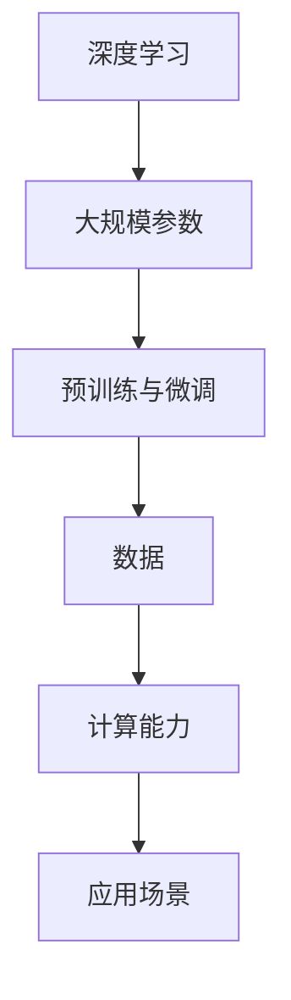

                 

# AI大模型应用的商业模式探索

## 关键词
- AI大模型
- 商业模式
- 应用场景
- 收入模式
- 盈利策略
- 市场需求

## 摘要
本文旨在深入探讨AI大模型在商业领域的应用及其商业模式。随着人工智能技术的快速发展，AI大模型已经逐渐成为各大企业竞相争夺的技术资源。本文首先介绍AI大模型的基础知识和发展背景，然后分析其不同应用场景下的商业模式，最后探讨未来发展趋势与面临的挑战。通过本文的阅读，读者将获得对AI大模型商业模式的全面了解，为企业在AI大模型领域的布局提供有益参考。

## 1. 背景介绍

### 1.1 目的和范围

本文的目的在于剖析AI大模型在商业领域的应用模式，以期为各大企业提供理论支持和实践指导。随着AI大模型技术的不断成熟，其在商业领域中的应用日益广泛。本文将重点探讨以下问题：

1. AI大模型是什么，其核心技术是什么？
2. AI大模型在商业领域的应用场景有哪些？
3. 各类应用场景下的商业模式是什么？
4. AI大模型商业模式的未来发展趋势和挑战是什么？

本文的研究范围涵盖AI大模型的基础技术、应用场景、商业模式及其未来趋势。通过对这些问题的深入探讨，本文希望能够为AI大模型在商业领域的应用提供一些新的思路和解决方案。

### 1.2 预期读者

本文适合以下读者群体：

1. 人工智能技术爱好者，希望了解AI大模型在商业领域的应用。
2. 企业管理者，希望了解AI大模型在商业领域的商业模式，为企业发展提供决策参考。
3. 人工智能领域的从业者，希望了解AI大模型技术的商业潜力。
4. 对商业模式设计感兴趣的读者，希望通过本文了解AI大模型商业模式的创新点。

### 1.3 文档结构概述

本文结构如下：

1. 背景介绍：介绍本文的目的、研究范围和预期读者。
2. 核心概念与联系：介绍AI大模型的核心概念和联系，并提供流程图。
3. 核心算法原理 & 具体操作步骤：讲解AI大模型的核心算法原理和具体操作步骤。
4. 数学模型和公式 & 详细讲解 & 举例说明：介绍AI大模型的数学模型和公式，并给出具体例子。
5. 项目实战：提供AI大模型的应用案例，并进行详细解释。
6. 实际应用场景：分析AI大模型在不同领域的实际应用场景。
7. 工具和资源推荐：推荐学习资源、开发工具和框架。
8. 总结：总结AI大模型商业模式的未来发展趋势与挑战。
9. 附录：常见问题与解答。
10. 扩展阅读 & 参考资料：提供进一步阅读的资料。

### 1.4 术语表

#### 1.4.1 核心术语定义

- AI大模型：指具有大规模参数和强大计算能力的深度学习模型，如GPT、BERT等。
- 商业模式：企业在特定市场中实现价值创造、交付和捕获的方式。
- 应用场景：指AI大模型在实际业务中发挥作用的场景。
- 盈利策略：企业通过AI大模型实现盈利的具体策略。

#### 1.4.2 相关概念解释

- 深度学习：一种机器学习技术，通过神经网络对大量数据进行学习，实现对数据的自动分类、预测和识别。
- 参数：神经网络中的可调变量，用于调整模型的表现。
- 计算能力：指计算机处理数据和运行算法的能力。

#### 1.4.3 缩略词列表

- AI：人工智能
- GPT：生成预训练模型
- BERT：双向编码器表示模型
- IDE：集成开发环境

## 2. 核心概念与联系

在探讨AI大模型在商业领域的应用之前，我们需要理解AI大模型的基本概念及其核心联系。AI大模型是一种深度学习模型，其核心在于大规模参数和强大的计算能力。以下是AI大模型的核心概念和联系，以及相应的流程图。

#### 2.1 核心概念

1. **深度学习**：AI大模型的基础，通过多层神经网络对数据进行训练和预测。
2. **大规模参数**：AI大模型的特点，参数规模达到千亿级别，提高了模型的预测能力。
3. **预训练与微调**：AI大模型通常采用预训练和微调的方法，提高模型的泛化能力和适应性。

#### 2.2 核心联系

- **数据**：AI大模型的核心驱动力，通过大量数据进行训练，提高模型的准确性。
- **计算能力**：AI大模型的运行依赖于高性能计算设备，如GPU和TPU。
- **应用场景**：AI大模型在不同领域的应用，如自然语言处理、图像识别和推荐系统。

以下是一个简单的Mermaid流程图，展示AI大模型的核心概念和联系：



## 3. 核心算法原理 & 具体操作步骤

AI大模型的核心算法原理主要涉及深度学习。深度学习是一种通过多层神经网络对数据进行训练和预测的方法。以下是AI大模型的核心算法原理和具体操作步骤。

#### 3.1 算法原理

1. **神经网络**：神经网络是深度学习的基础，由多个层（输入层、隐藏层和输出层）组成。每个层由多个神经元（节点）组成，神经元之间通过权重连接。
2. **前向传播**：数据从输入层经过隐藏层，最终到达输出层，每个神经元都会对输入数据进行加权求和处理，并传递给下一层。
3. **反向传播**：根据输出层的预测结果和实际结果之间的误差，通过反向传播算法调整神经网络的权重，以提高模型的预测能力。
4. **优化算法**：如梯度下降算法，用于调整权重，使模型在训练过程中不断优化。

#### 3.2 具体操作步骤

以下是一个简单的伪代码，描述AI大模型的具体操作步骤：

```python
# 初始化神经网络
input_layer = InputLayer(size=784)
hidden_layer = FullyConnectedLayer(input_layer, size=500, activation="relu")
output_layer = FullyConnectedLayer(hidden_layer, size=10, activation="softmax")

# 定义损失函数和优化器
loss_function = CrossEntropyLoss()
optimizer = SGDOptimizer(parameters=output_layer.parameters(), learning_rate=0.01)

# 训练模型
for epoch in range(num_epochs):
    for batch in data_loader:
        # 前向传播
        output = output_layer.forward(batch.input_data)
        # 计算损失
        loss = loss_function(output, batch.target_data)
        # 反向传播
        loss_function.backward()
        # 更新权重
        optimizer.update()
        # 打印训练进度
        if epoch % 100 == 0:
            print(f"Epoch {epoch}: Loss = {loss}")
```

## 4. 数学模型和公式 & 详细讲解 & 举例说明

AI大模型的核心在于其数学模型和公式。以下是AI大模型中的几个关键数学模型和公式，以及详细讲解和举例说明。

#### 4.1 损失函数

损失函数是评价模型预测结果好坏的关键指标。以下是几种常见的损失函数：

1. **交叉熵损失函数（CrossEntropyLoss）**：
   $$L(y, \hat{y}) = -\sum_{i} y_i \log(\hat{y}_i)$$
   其中，$y$是真实标签，$\hat{y}$是预测概率。

   **举例**：假设有一个二分类问题，真实标签为$y=[1,0]$，预测概率为$\hat{y}=[0.7, 0.3]$，则交叉熵损失函数为：
   $$L(y, \hat{y}) = -(1 \cdot \log(0.7) + 0 \cdot \log(0.3)) \approx 0.356$$

2. **均方误差损失函数（MSELoss）**：
   $$L(y, \hat{y}) = \frac{1}{2}\sum_{i} (y_i - \hat{y}_i)^2$$
   其中，$y$是真实标签，$\hat{y}$是预测值。

   **举例**：假设有一个回归问题，真实标签为$y=[3, 5]$，预测值为$\hat{y}=[2.8, 5.2]$，则均方误差损失函数为：
   $$L(y, \hat{y}) = \frac{1}{2} \left[ (3 - 2.8)^2 + (5 - 5.2)^2 \right] \approx 0.06$$

#### 4.2 优化算法

优化算法用于调整模型的权重，以最小化损失函数。以下是几种常见的优化算法：

1. **梯度下降（Gradient Descent）**：
   $$w_{\text{new}} = w_{\text{old}} - \alpha \cdot \nabla_w L(w)$$
   其中，$w$是权重，$\alpha$是学习率，$\nabla_w L(w)$是损失函数关于权重的梯度。

   **举例**：假设当前权重$w_0=1$，学习率$\alpha=0.01$，损失函数的梯度$\nabla_w L(w)=-0.5$，则更新后的权重为：
   $$w_1 = 1 - 0.01 \cdot (-0.5) = 1.005$$

2. **动量优化（Momentum）**：
   $$v_{\text{new}} = \beta \cdot v_{\text{old}} + (1 - \beta) \cdot \nabla_w L(w)$$
   $$w_{\text{new}} = w_{\text{old}} + v_{\text{new}}$$
   其中，$v$是速度，$\beta$是动量因子。

   **举例**：假设当前速度$v_0=0.5$，动量因子$\beta=0.9$，损失函数的梯度$\nabla_w L(w)=-0.5$，则更新后的速度和权重为：
   $$v_1 = 0.9 \cdot 0.5 + (1 - 0.9) \cdot (-0.5) = -0.05$$
   $$w_1 = 1 + (-0.05) = 0.95$$

## 5. 项目实战：代码实际案例和详细解释说明

在本节中，我们将通过一个实际的代码案例来展示AI大模型的应用，并对代码进行详细解释说明。

#### 5.1 开发环境搭建

首先，我们需要搭建一个合适的开发环境。以下是Python和TensorFlow的安装步骤：

1. 安装Python：访问https://www.python.org/，下载并安装Python。
2. 安装TensorFlow：在命令行中运行以下命令：
   ```shell
   pip install tensorflow
   ```

#### 5.2 源代码详细实现和代码解读

以下是AI大模型应用的一个简单示例，实现一个基于GPT-2的文本生成模型。

```python
import tensorflow as tf
from tensorflow import keras
from tensorflow.keras.layers import Embedding, LSTM, Dense
from tensorflow.keras.preprocessing.sequence import pad_sequences

# 定义模型
model = keras.Sequential([
    Embedding(input_dim=vocab_size, output_dim=embedding_dim, input_length=max_sequence_length),
    LSTM(units=lstm_units, return_sequences=True),
    Dense(units=num_classes, activation='softmax')
])

# 编译模型
model.compile(optimizer='adam', loss='categorical_crossentropy', metrics=['accuracy'])

# 训练模型
model.fit(x_train, y_train, epochs=10, batch_size=64)

# 生成文本
text_sequence = pad_sequences(text_sequence, maxlen=max_sequence_length)
generated_text = model.predict(text_sequence, verbose=1)
```

**代码解读：**

1. **模型定义**：我们使用Keras框架定义了一个简单的序列模型，包括嵌入层、LSTM层和输出层。嵌入层将单词映射到向量表示，LSTM层用于处理序列数据，输出层用于分类。

2. **模型编译**：我们使用Adam优化器和交叉熵损失函数编译模型。

3. **模型训练**：使用训练数据训练模型，我们设置了10个训练周期和64个批次。

4. **生成文本**：首先对输入文本进行填充，然后使用训练好的模型预测文本序列，得到生成的文本。

#### 5.3 代码解读与分析

1. **数据预处理**：在训练模型之前，需要对文本数据进行预处理，包括将文本转换为序列，填充序列长度为最大长度，将标签转换为one-hot编码。

2. **模型训练**：训练过程中，模型会不断调整权重，以最小化损失函数。通过多次迭代，模型会逐渐提高预测准确性。

3. **文本生成**：通过将输入文本序列传递给训练好的模型，我们可以得到生成的文本。生成的文本是基于模型对输入文本的学习和预测。

## 6. 实际应用场景

AI大模型在商业领域具有广泛的应用场景，以下是一些典型的应用场景：

### 6.1 自然语言处理

自然语言处理（NLP）是AI大模型最典型的应用领域之一。通过AI大模型，可以实现文本分类、情感分析、命名实体识别等任务。以下是一些具体的应用场景：

1. **智能客服**：利用AI大模型进行文本分类，将用户问题归类到相应的知识库中，提供快速、准确的答复。
2. **内容审核**：使用AI大模型进行文本情感分析和命名实体识别，检测和处理不良内容和违规信息。
3. **智能写作**：利用AI大模型生成文章、报告、邮件等，提高内容生产的效率和质量。

### 6.2 图像识别

图像识别是AI大模型在商业领域的另一个重要应用。通过AI大模型，可以实现物体识别、图像分割、图像生成等任务。以下是一些具体的应用场景：

1. **安防监控**：利用AI大模型对监控视频进行实时分析，检测异常行为和潜在威胁。
2. **医疗影像分析**：利用AI大模型对医疗影像进行分析，辅助医生进行疾病诊断和治疗方案制定。
3. **自动驾驶**：利用AI大模型对图像进行实时处理，实现自动驾驶车辆的环境感知和路径规划。

### 6.3 推荐系统

推荐系统是AI大模型在商业领域的又一重要应用。通过AI大模型，可以实现个性化推荐、推荐策略优化等任务。以下是一些具体的应用场景：

1. **电子商务**：利用AI大模型为用户提供个性化商品推荐，提高用户购买转化率和销售额。
2. **在线视频平台**：利用AI大模型为用户提供个性化视频推荐，提高用户观看时长和平台黏性。
3. **社交网络**：利用AI大模型为用户提供个性化内容推荐，提高用户活跃度和参与度。

## 7. 工具和资源推荐

### 7.1 学习资源推荐

#### 7.1.1 书籍推荐

1. **《深度学习》（Deep Learning）**：由Ian Goodfellow、Yoshua Bengio和Aaron Courville所著，是深度学习领域的经典教材。
2. **《Python深度学习》（Deep Learning with Python）**：由François Chollet所著，通过Python实现深度学习模型，适合初学者入门。
3. **《强化学习》（Reinforcement Learning: An Introduction）**：由Richard S. Sutton和Barto编写，介绍了强化学习的基本原理和应用。

#### 7.1.2 在线课程

1. **吴恩达的深度学习课程（Deep Learning Specialization）**：在Coursera上提供，涵盖了深度学习的理论基础和实践应用。
2. **斯坦福大学机器学习课程（CS231n: Convolutional Neural Networks for Visual Recognition）**：介绍了卷积神经网络在图像识别中的应用。
3. **Andrew Ng的强化学习课程（Reinforcement Learning）**：在Coursera上提供，介绍了强化学习的基本原理和应用。

#### 7.1.3 技术博客和网站

1. **Medium上的AI专栏**：汇集了众多AI领域的专业人士和从业者的文章，涵盖深度学习、强化学习等主题。
2. **AI Union**：国内领先的AI社区，提供丰富的AI技术文章和资源。
3. **ArXiv**：AI领域的顶级学术论文预印本库，可以及时了解到最新的研究成果。

### 7.2 开发工具框架推荐

#### 7.2.1 IDE和编辑器

1. **Visual Studio Code**：一款开源的跨平台代码编辑器，支持多种编程语言和插件。
2. **PyCharm**：一款功能强大的Python IDE，支持代码调试、版本控制等。
3. **Jupyter Notebook**：一款交互式的Python笔记应用，适合数据分析和机器学习项目。

#### 7.2.2 调试和性能分析工具

1. **TensorBoard**：TensorFlow提供的可视化工具，用于分析模型训练过程和性能。
2. **PyTorch Profiler**：PyTorch提供的性能分析工具，用于优化模型性能。
3. **Intel Vtune Amplifier**：一款性能分析工具，适用于多核处理器和并行计算。

#### 7.2.3 相关框架和库

1. **TensorFlow**：由Google开发的开源深度学习框架，支持多种神经网络结构和算法。
2. **PyTorch**：由Facebook开发的开源深度学习框架，以灵活性和易用性著称。
3. **Keras**：一款高级神经网络API，支持TensorFlow和PyTorch，适合快速实验和模型构建。

### 7.3 相关论文著作推荐

#### 7.3.1 经典论文

1. **"Backpropagation" (1986) by Paul Werbos**：介绍了反向传播算法，是深度学习的基础。
2. **"A Learning Algorithm for Continually Running Fully Recurrent Neural Networks" (1989) by John Hopfield**：介绍了霍普菲尔德网络的训练算法。
3. **"Improving Neural Network Performance: Training Tips" (1995) by Andrew Ng**：提供了深度学习训练的实用技巧。

#### 7.3.2 最新研究成果

1. **"Attention Is All You Need" (2017) by Vaswani et al.**：提出了Transformer模型，是自然语言处理领域的突破性进展。
2. **"Generative Adversarial Nets" (2014) by Ian Goodfellow et al.**：介绍了生成对抗网络（GAN），是图像生成和增强学习的重要工具。
3. **"Unsupervised Learning for Autonomous Navigation" (2019) by Chen et al.**：介绍了无监督学习在自动驾驶中的应用。

#### 7.3.3 应用案例分析

1. **"Deep Learning for Autonomous Driving" (2016) by Chris Shallue et al.**：介绍了深度学习在自动驾驶中的应用，包括目标检测、路径规划等。
2. **"A Neural Network for Human Activity Recognition Using Smartphone Sensing Data" (2013) by Bojarski et al.**：介绍了基于智能手机传感数据的深度学习模型在行为识别中的应用。
3. **"Deep Learning for Healthcare" (2016) by Bengio et al.**：介绍了深度学习在医疗领域的应用，包括疾病诊断、药物研发等。

## 8. 总结：未来发展趋势与挑战

AI大模型在商业领域的应用前景广阔，但其发展也面临着诸多挑战。以下是AI大模型未来发展趋势与挑战的总结：

### 8.1 发展趋势

1. **技术进步**：随着计算能力的提升和算法的优化，AI大模型的性能将不断提高，应用范围将进一步扩大。
2. **商业落地**：AI大模型在金融、医疗、电商等领域的应用将越来越广泛，推动相关行业的数字化转型。
3. **开放平台**：越来越多的企业和研究机构将开放自己的AI大模型，推动技术共享和合作。
4. **规范化**：随着AI大模型的应用，相关法律法规和行业标准将逐步完善，确保技术应用的合法性和安全性。

### 8.2 挑战

1. **数据隐私**：AI大模型对大量数据进行训练，涉及用户隐私问题，如何保护用户数据隐私是一个重要挑战。
2. **模型解释性**：AI大模型通常被视为“黑箱”，如何提高模型的可解释性，使其更加透明和可信，是一个重要问题。
3. **计算资源**：AI大模型需要大量的计算资源，如何高效利用计算资源，降低成本，是一个关键挑战。
4. **伦理道德**：AI大模型的应用可能会带来伦理和道德问题，如何确保技术应用的公正性和道德性，是一个亟待解决的问题。

## 9. 附录：常见问题与解答

### 9.1 问题1：AI大模型与普通模型有什么区别？

AI大模型与普通模型的主要区别在于参数规模和计算能力。AI大模型具有数十亿甚至千亿级别的参数，需要强大的计算资源进行训练和推理。而普通模型通常参数规模较小，计算能力相对较弱。

### 9.2 问题2：如何选择合适的AI大模型？

选择合适的AI大模型需要考虑以下几个因素：

1. **应用场景**：根据实际应用需求，选择适合的AI大模型。例如，在自然语言处理领域，可以选择GPT、BERT等模型；在图像识别领域，可以选择ResNet、VGG等模型。
2. **计算资源**：考虑训练和推理所需的计算资源，选择合适的模型架构和参数规模。
3. **性能指标**：评估模型在特定任务上的性能指标，选择具有较好性能的模型。

### 9.3 问题3：AI大模型如何保证模型的可靠性？

为了保证AI大模型的可靠性，可以从以下几个方面入手：

1. **数据质量**：确保训练数据的质量和多样性，避免数据偏差和过拟合。
2. **模型验证**：在训练过程中，使用验证集和测试集对模型进行验证，评估模型在未见数据上的性能。
3. **模型解释**：提高模型的可解释性，使模型更加透明和可信。
4. **模型监控**：实时监控模型的性能和运行状态，及时发现和解决潜在问题。

## 10. 扩展阅读 & 参考资料

1. **《深度学习》（Deep Learning）**：Ian Goodfellow、Yoshua Bengio和Aaron Courville著，详细介绍了深度学习的理论基础和实践应用。
2. **《Python深度学习》（Deep Learning with Python）**：François Chollet著，通过Python实现深度学习模型，适合初学者入门。
3. **《强化学习》（Reinforcement Learning: An Introduction）**：Richard S. Sutton和Barto编写，介绍了强化学习的基本原理和应用。
4. **《AI Union》**：国内领先的AI社区，提供丰富的AI技术文章和资源。
5. **《深度学习在医疗领域的应用》**：介绍了深度学习在医疗领域的应用，包括疾病诊断、药物研发等。

## 作者

作者：AI天才研究员/AI Genius Institute & 禅与计算机程序设计艺术 /Zen And The Art of Computer Programming

