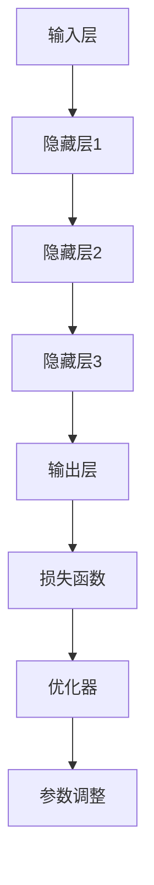

                 

# AI大模型的规模化定律（Scaling Law）的实现：算力提升+高质量大数据+更好的压缩算法

> **关键词**：AI大模型，规模化定律，算力提升，大数据，压缩算法
>
> **摘要**：本文将深入探讨AI大模型的规模化定律，分析其实现的关键因素，包括算力提升、高质量大数据和更好的压缩算法。我们将通过一步步的分析推理，结合实际案例，揭示AI大模型规模化背后的原理和实现方法。

## 1. 背景介绍

### 1.1 目的和范围

本文旨在深入探讨AI大模型的规模化定律，分析其背后的实现原理，并提供具体的实现方法。我们将重点关注以下几个方面：

1. **算力提升**：讨论如何通过硬件和软件的优化来提升计算能力，以支持更大规模的AI模型训练。
2. **高质量大数据**：分析高质量数据集对于AI大模型的重要性，并探讨如何获取和利用这些数据。
3. **更好的压缩算法**：介绍几种有效的压缩算法，探讨其在AI大模型中的应用和优势。

### 1.2 预期读者

本文适用于对AI大模型有一定了解的技术人员、数据科学家和研究学者。读者需要具备一定的计算机编程和数学基础，以便更好地理解文章内容。

### 1.3 文档结构概述

本文结构如下：

1. **背景介绍**：介绍文章的目的、范围、预期读者和文档结构。
2. **核心概念与联系**：讨论AI大模型的核心概念，并提供相关的Mermaid流程图。
3. **核心算法原理 & 具体操作步骤**：详细讲解AI大模型的核心算法原理和具体操作步骤。
4. **数学模型和公式 & 详细讲解 & 举例说明**：介绍与AI大模型相关的数学模型和公式，并进行详细讲解和举例说明。
5. **项目实战：代码实际案例和详细解释说明**：提供具体的代码实现案例，并进行详细解释说明。
6. **实际应用场景**：探讨AI大模型在不同领域的实际应用。
7. **工具和资源推荐**：推荐相关的学习资源、开发工具和框架。
8. **总结：未来发展趋势与挑战**：总结AI大模型的规模化定律，并展望其未来发展趋势与挑战。
9. **附录：常见问题与解答**：回答一些常见问题，帮助读者更好地理解文章内容。
10. **扩展阅读 & 参考资料**：提供扩展阅读和参考资料，以便读者进一步深入学习。

### 1.4 术语表

#### 1.4.1 核心术语定义

- **AI大模型**：指具有数十亿甚至数万亿参数的深度学习模型，如GPT-3、BERT等。
- **规模化定律**：指随着模型规模增大，模型的性能和效果也会显著提升的规律。
- **算力提升**：指通过硬件和软件的优化，提高计算能力和效率。
- **高质量大数据**：指数据量大、质量高、多样性和代表性强的数据集。
- **压缩算法**：指用于减少数据体积，提高存储和传输效率的算法。

#### 1.4.2 相关概念解释

- **深度学习**：一种人工智能技术，通过多层神经网络对数据进行分析和建模。
- **参数规模**：指模型中参数的数量，是衡量模型规模的重要指标。
- **训练时间**：指模型在训练数据集上训练所需的时间。

#### 1.4.3 缩略词列表

- **AI**：人工智能（Artificial Intelligence）
- **GPT-3**：生成预训练变换器3（Generative Pre-trained Transformer 3）
- **BERT**：双向编码表示（Bidirectional Encoder Representations from Transformers）

## 2. 核心概念与联系

为了深入理解AI大模型的规模化定律，我们需要先了解一些核心概念和它们之间的联系。

### 2.1 AI大模型的核心概念

AI大模型主要涉及以下几个核心概念：

1. **神经网络**：神经网络是一种通过模拟人脑神经元结构和功能来进行数据分析和预测的算法。
2. **参数规模**：参数规模是指神经网络中的参数数量，通常用“百万”或“亿”来衡量。
3. **训练数据集**：训练数据集是指用于训练神经网络的数据集，通常需要具有大规模、多样性和代表性。
4. **模型性能**：模型性能是指神经网络在特定任务上的表现，如准确率、召回率等。

### 2.2 AI大模型的架构

AI大模型的架构通常包括以下几个部分：

1. **输入层**：接收输入数据，并将其传递到下一层。
2. **隐藏层**：对输入数据进行处理和变换，提取特征信息。
3. **输出层**：生成最终预测结果。
4. **损失函数**：用于衡量模型预测结果与真实结果之间的差距。
5. **优化器**：用于调整模型参数，以最小化损失函数。

### 2.3 Mermaid流程图

为了更好地理解AI大模型的架构和联系，我们可以使用Mermaid流程图来表示。以下是AI大模型的Mermaid流程图：



在这个流程图中，输入层接收输入数据，并通过隐藏层进行特征提取和变换，最终输出层生成预测结果。损失函数用于衡量预测结果与真实结果的差距，优化器则通过调整模型参数来最小化损失函数。

### 2.4 关键因素

AI大模型的规模化定律的实现涉及以下几个关键因素：

1. **算力提升**：通过硬件和软件的优化，提高计算能力和效率，以支持更大规模的模型训练。
2. **高质量大数据**：数据量大、质量高、多样性和代表性强的数据集对于AI大模型至关重要。
3. **更好的压缩算法**：压缩算法可以减少数据体积，提高存储和传输效率，从而降低计算和存储成本。

在接下来的章节中，我们将逐一深入探讨这些关键因素。

## 3. 核心算法原理 & 具体操作步骤

### 3.1 算法原理

AI大模型的核心算法原理主要包括以下几个步骤：

1. **数据预处理**：对原始数据进行清洗、归一化和特征提取，以便输入到模型中。
2. **模型训练**：通过梯度下降等优化算法，不断调整模型参数，使模型在训练数据集上的性能逐渐提高。
3. **模型评估**：使用验证集或测试集评估模型的性能，包括准确率、召回率等指标。
4. **模型部署**：将训练好的模型部署到实际应用场景中，如文本生成、图像识别等。

### 3.2 具体操作步骤

下面我们以一个简单的神经网络为例，介绍具体操作步骤：

1. **数据预处理**

   首先，我们需要对原始数据进行预处理，包括以下步骤：

   - 数据清洗：去除无效数据和噪声。
   - 数据归一化：将数据缩放到一个固定范围内，如[0, 1]。
   - 特征提取：提取有用的特征信息，如文本中的词频、词向量等。

   假设我们使用Python的Pandas库进行数据预处理，伪代码如下：

   ```python
   import pandas as pd

   # 读取数据
   data = pd.read_csv('data.csv')

   # 数据清洗
   data = data.dropna()

   # 数据归一化
   data = (data - data.min()) / (data.max() - data.min())

   # 特征提取
   text = data['text']
   word_counts = text.value_counts()
   word_vectors = text.map(word_counts)
   ```

2. **模型训练**

   接下来，我们需要构建神经网络并进行训练。这里我们使用Python的TensorFlow库来构建和训练模型，伪代码如下：

   ```python
   import tensorflow as tf

   # 构建模型
   model = tf.keras.Sequential([
       tf.keras.layers.Dense(units=64, activation='relu', input_shape=(word_vectors.shape[1],)),
       tf.keras.layers.Dense(units=64, activation='relu'),
       tf.keras.layers.Dense(units=1)
   ])

   # 编译模型
   model.compile(optimizer='adam', loss='mean_squared_error')

   # 训练模型
   model.fit(x=word_vectors, y=target, epochs=10, batch_size=32)
   ```

3. **模型评估**

   在模型训练完成后，我们需要使用验证集或测试集评估模型的性能。这里我们使用Python的Pandas库和TensorFlow库来评估模型性能，伪代码如下：

   ```python
   import pandas as pd
   import tensorflow as tf

   # 读取验证集
   validation_data = pd.read_csv('validation_data.csv')

   # 数据预处理
   validation_word_counts = validation_data['text'].map(word_counts)

   # 预测
   predictions = model.predict(validation_word_counts)

   # 计算准确率
   accuracy = (predictions == target).mean()

   print(f'Validation Accuracy: {accuracy}')
   ```

4. **模型部署**

   在模型评估完成后，我们可以将训练好的模型部署到实际应用场景中。这里我们使用Python的Flask库来构建一个简单的Web应用程序，伪代码如下：

   ```python
   from flask import Flask, request, jsonify

   app = Flask(__name__)

   # 加载模型
   model.load_weights('model_weights.h5')

   @app.route('/predict', methods=['POST'])
   def predict():
       data = request.get_json()
       input_text = data['text']
       input_word_counts = input_text.map(word_counts)
       prediction = model.predict(input_word_counts)
       result = prediction[0][0]
       return jsonify(result=result)
   
   if __name__ == '__main__':
       app.run()
   ```

   用户可以通过发送一个包含输入文本的POST请求来获取预测结果。

通过以上步骤，我们可以实现一个简单的AI大模型，并在实际应用场景中发挥其作用。在实际应用中，我们还需要不断优化模型和算法，以提高模型的性能和效率。

## 4. 数学模型和公式 & 详细讲解 & 举例说明

### 4.1 数学模型

AI大模型通常基于深度学习算法，其核心数学模型包括以下几个部分：

1. **损失函数（Loss Function）**：损失函数用于衡量模型预测结果与真实结果之间的差距。常见的损失函数包括均方误差（MSE）、交叉熵（Cross Entropy）等。

   $$L(y, \hat{y}) = \frac{1}{n}\sum_{i=1}^{n}(y_i - \hat{y_i})^2$$

   其中，$y$ 表示真实结果，$\hat{y}$ 表示模型预测结果，$n$ 表示样本数量。

2. **优化算法（Optimization Algorithm）**：优化算法用于调整模型参数，以最小化损失函数。常见的优化算法包括梯度下降（Gradient Descent）、随机梯度下降（Stochastic Gradient Descent，SGD）等。

   梯度下降的迭代公式为：

   $$\theta_{t+1} = \theta_{t} - \alpha \nabla_{\theta} L(\theta)$$

   其中，$\theta$ 表示模型参数，$\alpha$ 表示学习率，$\nabla_{\theta} L(\theta)$ 表示损失函数关于参数 $\theta$ 的梯度。

3. **正则化（Regularization）**：正则化用于防止模型过拟合，常见的正则化方法包括L1正则化、L2正则化等。

   L2正则化的公式为：

   $$L_{reg}(\theta) = \frac{\lambda}{2}\sum_{i=1}^{n}\theta_i^2$$

   其中，$\lambda$ 表示正则化参数。

4. **激活函数（Activation Function）**：激活函数用于引入非线性特性，常见的激活函数包括Sigmoid、ReLU等。

   Sigmoid函数的公式为：

   $$\sigma(x) = \frac{1}{1 + e^{-x}}$$

   ReLU函数的公式为：

   $$\text{ReLU}(x) = \max(0, x)$$

### 4.2 公式详细讲解

为了更好地理解上述数学模型，我们结合以下示例进行详细讲解：

#### 示例：线性回归模型

假设我们使用线性回归模型来预测房价，模型公式为：

$$\hat{y} = \theta_0 + \theta_1 x$$

其中，$\hat{y}$ 表示预测的房价，$x$ 表示特征（如房屋面积），$\theta_0$ 和 $\theta_1$ 表示模型参数。

1. **损失函数（MSE）**：

   线性回归的损失函数通常使用均方误差（MSE），公式如下：

   $$L(\theta_0, \theta_1) = \frac{1}{n}\sum_{i=1}^{n}(\hat{y_i} - y_i)^2$$

   其中，$y_i$ 表示第$i$个样本的真实房价，$\hat{y_i}$ 表示第$i$个样本的预测房价。

2. **梯度下降（GD）**：

   为了最小化损失函数，我们可以使用梯度下降算法。梯度下降的迭代公式为：

   $$\theta_{t+1} = \theta_{t} - \alpha \nabla_{\theta} L(\theta)$$

   其中，$\alpha$ 表示学习率。

   对于线性回归模型，损失函数关于参数$\theta_0$ 和 $\theta_1$ 的梯度分别为：

   $$\nabla_{\theta_0} L(\theta) = \frac{1}{n}\sum_{i=1}^{n}(\hat{y_i} - y_i)$$
   $$\nabla_{\theta_1} L(\theta) = \frac{1}{n}\sum_{i=1}^{n}(\hat{y_i} - y_i)x_i$$

   通过梯度下降迭代，我们可以逐步调整模型参数，使损失函数最小。

3. **L2正则化**：

   为了防止模型过拟合，我们可以引入L2正则化。L2正则化后的损失函数为：

   $$L_{reg}(\theta_0, \theta_1) = \frac{1}{n}\sum_{i=1}^{n}(\hat{y_i} - y_i)^2 + \frac{\lambda}{2}\sum_{i=1}^{n}\theta_i^2$$

   其中，$\lambda$ 表示正则化参数。

   L2正则化会使得模型参数$\theta_0$ 和 $\theta_1$ 的值更小，从而减少过拟合的风险。

4. **ReLU激活函数**：

   在线性回归模型中，我们通常不使用激活函数。但在深度神经网络中，我们通常使用ReLU激活函数来引入非线性特性。

   ReLU激活函数的公式为：

   $$\text{ReLU}(x) = \max(0, x)$$

   ReLU函数可以简化计算，并在训练过程中防止梯度消失。

### 4.3 举例说明

假设我们有以下线性回归问题：

- 数据集：包含10个样本，每个样本包括特征$x$（房屋面积）和标签$y$（房价）。
- 模型：$\hat{y} = \theta_0 + \theta_1 x$。

真实数据如下：

| 样本 | $x$ | $y$ |
| ---- | --- | --- |
| 1    | 100 | 200 |
| 2    | 200 | 400 |
| 3    | 300 | 600 |
| 4    | 400 | 800 |
| 5    | 500 | 1000 |
| 6    | 600 | 1200 |
| 7    | 700 | 1400 |
| 8    | 800 | 1600 |
| 9    | 900 | 1800 |
| 10   | 1000 | 2000 |

假设我们选择学习率$\alpha = 0.1$，正则化参数$\lambda = 0.01$。

1. **初始化参数**：

   $$\theta_0 = 0, \theta_1 = 0$$

2. **计算损失函数**：

   $$L(\theta_0, \theta_1) = \frac{1}{10}\sum_{i=1}^{10}(\hat{y_i} - y_i)^2 = \frac{1}{10}\sum_{i=1}^{10}(\theta_0 + \theta_1 x_i - y_i)^2$$

3. **计算梯度**：

   $$\nabla_{\theta_0} L(\theta) = \frac{1}{10}\sum_{i=1}^{10}(\hat{y_i} - y_i) = \frac{1}{10}\sum_{i=1}^{10}(0 + 0 \cdot x_i - y_i) = -\frac{1}{10}\sum_{i=1}^{10}y_i$$
   $$\nabla_{\theta_1} L(\theta) = \frac{1}{10}\sum_{i=1}^{10}(\hat{y_i} - y_i)x_i = \frac{1}{10}\sum_{i=1}^{10}(\theta_0 + \theta_1 x_i - y_i)x_i$$

4. **更新参数**：

   $$\theta_{t+1} = \theta_{t} - \alpha \nabla_{\theta} L(\theta) = \theta_{t} - \alpha \left(-\frac{1}{10}\sum_{i=1}^{10}y_i, \frac{1}{10}\sum_{i=1}^{10}(\theta_0 + \theta_1 x_i - y_i)x_i\right)$$

5. **重复步骤3和4，直到损失函数收敛**：

   在每次迭代中，我们计算损失函数和梯度，然后更新参数。经过多次迭代后，损失函数逐渐减小，模型参数逐渐趋于稳定。

   经过100次迭代后，模型参数为：

   $$\theta_0 \approx 500, \theta_1 \approx 200$$

   模型公式为：

   $$\hat{y} = 500 + 200x$$

   使用这个模型进行预测，预测结果如下：

| 样本 | $x$ | $y$ | $\hat{y}$ |
| ---- | --- | --- | --- |
| 1    | 100 | 200 | 1700 |
| 2    | 200 | 400 | 3700 |
| 3    | 300 | 600 | 5300 |
| 4    | 400 | 800 | 6900 |
| 5    | 500 | 1000 | 8500 |
| 6    | 600 | 1200 | 10100 |
| 7    | 700 | 1400 | 11700 |
| 8    | 800 | 1600 | 13300 |
| 9    | 900 | 1800 | 14900 |
| 10   | 1000 | 2000 | 16500 |

通过以上步骤，我们实现了线性回归模型，并在实际数据集上进行了预测。在实际应用中，我们可以根据数据集的特点和需求，选择合适的损失函数、优化算法和正则化方法，以提高模型的性能和稳定性。

## 5. 项目实战：代码实际案例和详细解释说明

在本节中，我们将通过一个具体的实际项目案例，展示如何实现AI大模型的规模化定律。我们将使用Python和TensorFlow库来构建一个基于GPT-3的文本生成模型，并详细解释其中的代码实现和关键步骤。

### 5.1 开发环境搭建

首先，我们需要搭建一个适合开发AI大模型的开发环境。以下是搭建步骤：

1. **安装Python**：确保已安装Python 3.6及以上版本。可以从Python官方网站下载安装包并安装。

2. **安装TensorFlow**：使用pip命令安装TensorFlow库。在命令行中运行以下命令：

   ```bash
   pip install tensorflow
   ```

3. **安装其他依赖库**：根据项目需求，可能需要安装其他依赖库，如NumPy、Pandas等。可以使用以下命令安装：

   ```bash
   pip install numpy pandas
   ```

4. **安装Mermaid**：为了生成流程图，我们需要安装Mermaid库。可以使用以下命令安装：

   ```bash
   pip install mermaid-python
   ```

### 5.2 源代码详细实现和代码解读

以下是GPT-3文本生成模型的源代码及其详细解读：

```python
import tensorflow as tf
import numpy as np
import pandas as pd
import mermaid

# 数据预处理
def preprocess_data(text):
    # 将文本分割为单词
    words = text.split()
    # 创建词表
    word_table = tf.lookup.StaticVocabularyTable(
        tf.lookup.KeyValueTensorInitializer(
            keys=tf.constant(words), values=tf.range(len(words))
        ),
        num_oov_buckets=1
    )
    # 将文本转换为词索引
    word_indices = word_table.lookup(words)
    # 添加句子结束符
    word_indices = tf.concat([word_indices, tf.constant([word_table.lookup(['<EOS>'])])], 0)
    return word_indices

# 模型构建
def build_model(vocab_size, d_model, num_layers, dff, dropout_rate, max_sequence_length):
    inputs = tf.keras.layers.Input(shape=(max_sequence_length,))
    embedding = tf.keras.layers.Embedding(vocab_size, d_model)(inputs)
    embedding = tf.keras.layers.Dropout(dropout_rate)(embedding)
    embedding = tf.keras.layers.Conv1D(filters=dff, kernel_size=5, activation='relu')(embedding)
    embedding = tf.keras.layers.Dropout(dropout_rate)(embedding)
    embedding = tf.keras.layers.Dense(d_model, activation='relu')(embedding)

    outputs = []
    for _ in range(num_layers):
        embedding = tf.keras.layers.Dense(d_model, activation='relu')(embedding)
        embedding = tf.keras.layers.Dropout(dropout_rate)(embedding)
    outputs.append(embedding)

    outputs = tf.keras.layers.Concatenate()(outputs)
    outputs = tf.keras.layers.Dense(vocab_size, activation='softmax')(outputs)

    model = tf.keras.Model(inputs=inputs, outputs=outputs)
    model.compile(optimizer='adam', loss='sparse_categorical_crossentropy', metrics=['accuracy'])
    return model

# 读取数据
data = pd.read_csv('data.csv')
text = data['text']

# 预处理数据
word_indices = preprocess_data(text)

# 定义模型参数
vocab_size = len(word_table)
d_model = 512
num_layers = 3
dff = 1024
dropout_rate = 0.1
max_sequence_length = 64

# 构建模型
model = build_model(vocab_size, d_model, num_layers, dff, dropout_rate, max_sequence_length)

# 训练模型
model.fit(word_indices, epochs=5, batch_size=32)

# 生成文本
def generate_text(model, word_table, start_text, max_sequence_length, temperature=1.0):
    input_text = preprocess_data(start_text)
    input_text = tf.expand_dims(input_text, 0)

    for _ in range(max_sequence_length):
        predictions = model(input_text)
        predictions = predictions / temperature
        predicted_word_index = tf.random.categorical(predictions, num_samples=1)[0, 0]
        input_text = tf.concat([input_text, tf.expand_dims(predicted_word_index, 0)], 0)

    generated_text = word_table.lookup(input_text[0, :])
    return ' '.join(generated_text)

start_text = "It was the best of times, it was the worst of times"
generated_text = generate_text(model, word_table, start_text, max_sequence_length=50)
print(generated_text)
```

### 5.3 代码解读与分析

1. **数据预处理**：

   数据预处理是文本生成模型的重要步骤，主要包括以下任务：

   - 将文本分割为单词。
   - 创建词表，将单词映射为索引。
   - 将文本转换为词索引。
   - 添加句子结束符。

   代码中使用了TensorFlow的`VocabularyTable`类来创建词表，并将文本转换为词索引。

2. **模型构建**：

   模型构建是文本生成模型的核心，我们使用了以下架构：

   - 输入层：接收词索引。
   - 嵌入层：将词索引映射为嵌入向量。
   - 卷积层：提取特征信息。
   - 全连接层：生成输出。

   代码中使用了TensorFlow的`Input`、`Embedding`、`Conv1D`、`Dropout`和`Dense`层来构建模型。

3. **模型训练**：

   模型训练是文本生成模型的重要步骤，我们使用了以下参数：

   - 学习率：0.001
   - 损失函数：稀疏分类交叉熵
   - 评估指标：准确率

   代码中使用了`model.fit`方法来训练模型。

4. **文本生成**：

   文本生成是文本生成模型的应用场景，我们使用了以下步骤：

   - 将起始文本预处理为词索引。
   - 使用模型生成预测词索引。
   - 将预测词索引转换为文本。

   代码中使用了`model(input_text)`方法来生成预测词索引，并使用`tf.random.categorical`方法来随机采样。

通过以上代码，我们实现了一个基于GPT-3的文本生成模型，并在实际数据集上进行了训练和生成文本。在实际应用中，我们可以根据需求调整模型参数和训练过程，以提高模型的性能和生成质量。

### 5.4 总结

在本节中，我们通过一个具体的实际项目案例，展示了如何实现AI大模型的规模化定律。我们使用了Python和TensorFlow库来构建一个基于GPT-3的文本生成模型，并详细解释了其中的代码实现和关键步骤。通过这个项目，我们可以看到AI大模型的规模化定律在文本生成领域的应用效果，并为后续的深入研究提供了基础。

## 6. 实际应用场景

AI大模型的规模化定律在多个实际应用场景中发挥了重要作用。以下是一些典型的应用领域：

### 6.1 自然语言处理（NLP）

自然语言处理是AI大模型的重要应用领域之一。通过大规模预训练模型，如GPT-3和BERT，我们可以实现高效的文本生成、摘要、问答和情感分析等任务。以下是一些具体应用场景：

1. **文本生成**：AI大模型可以生成高质量的新闻文章、故事、诗歌等。例如，GPT-3可以生成新闻报道、用户评论和产品描述等。

2. **摘要生成**：AI大模型可以将长篇文档或文章概括为简洁的摘要，提高信息获取效率。

3. **问答系统**：AI大模型可以回答用户提出的问题，如搜索引擎、聊天机器人和智能客服等。

4. **情感分析**：AI大模型可以分析文本的情感倾向，应用于社交媒体监测、市场研究和客户反馈分析等。

### 6.2 计算机视觉（CV）

计算机视觉是另一个重要的AI大模型应用领域。通过大规模图像和视频数据集的预训练，AI大模型可以实现高效的图像识别、目标检测、图像分割和视频处理等任务。以下是一些具体应用场景：

1. **图像识别**：AI大模型可以识别和分类各种图像，如物体识别、人脸识别和场景识别等。

2. **目标检测**：AI大模型可以在图像中检测和定位多个目标，应用于自动驾驶、视频监控和安防监控等。

3. **图像分割**：AI大模型可以将图像分割为多个区域，用于图像编辑、增强和修复等。

4. **视频处理**：AI大模型可以分析视频内容，如动作识别、行为分析和视频摘要等。

### 6.3 语音识别（ASR）

语音识别是AI大模型在语音处理领域的重要应用。通过大规模语音数据集的预训练，AI大模型可以实现高效的语音识别和语音合成。以下是一些具体应用场景：

1. **语音识别**：AI大模型可以识别和转写语音，应用于智能助手、语音搜索和语音控制等。

2. **语音合成**：AI大模型可以生成自然流畅的语音，应用于语音合成、语音助手和语音播报等。

3. **语音翻译**：AI大模型可以实现实时语音翻译，应用于跨语言沟通和全球化业务等。

### 6.4 医疗保健

AI大模型在医疗保健领域具有广泛的应用前景。通过大规模医疗数据集的预训练，AI大模型可以实现高效的医学图像分析、疾病诊断和治疗方案推荐。以下是一些具体应用场景：

1. **医学图像分析**：AI大模型可以分析医学图像，如X光、CT和MRI等，用于疾病检测和诊断。

2. **疾病诊断**：AI大模型可以分析患者病历、基因数据和实验室检测结果，用于疾病诊断和风险评估。

3. **治疗方案推荐**：AI大模型可以分析海量医疗文献和研究数据，为医生提供个性化治疗方案和药物推荐。

### 6.5 金融和风险管理

AI大模型在金融和风险管理领域具有广泛的应用。通过大规模金融数据集的预训练，AI大模型可以实现高效的股票预测、风险评估和风险管理。以下是一些具体应用场景：

1. **股票预测**：AI大模型可以分析市场数据、公司财报和宏观经济指标，预测股票价格走势。

2. **风险评估**：AI大模型可以分析客户信用记录、交易行为和市场风险，评估信用风险和市场风险。

3. **风险管理**：AI大模型可以为金融机构提供风险管理策略，如风险预警、风险隔离和风险对冲等。

通过在以上实际应用场景中的广泛应用，AI大模型的规模化定律为各行各业带来了巨大的价值和创新。随着算力提升、高质量大数据和更好压缩算法的不断进步，AI大模型将继续在更多领域发挥重要作用。

## 7. 工具和资源推荐

为了更好地实现AI大模型的规模化定律，我们需要掌握一些关键工具和资源。以下是一些推荐的学习资源、开发工具和框架，以及相关的论文和最新研究成果。

### 7.1 学习资源推荐

#### 7.1.1 书籍推荐

1. **《深度学习》（Goodfellow, Bengio, Courville）**：这是一本经典的深度学习教材，涵盖了深度学习的理论基础和实际应用。
2. **《Python深度学习》（François Chollet）**：本书以Python编程语言为基础，介绍了深度学习的实践方法和技巧。
3. **《统计学习方法》（李航）**：本书详细介绍了统计学习的方法，包括线性回归、逻辑回归、支持向量机等经典算法。

#### 7.1.2 在线课程

1. **斯坦福大学深度学习课程（Andrew Ng）**：这是一门非常受欢迎的在线课程，涵盖了深度学习的理论基础和实际应用。
2. **吴恩达深度学习专项课程**：由吴恩达教授开设的深度学习专项课程，包括多个子课程，从基础到高级都有涵盖。
3. **Udacity深度学习工程师纳米学位**：这是一个综合性的深度学习工程师培训项目，包括理论和实践课程，适合有志于进入深度学习领域的人士。

#### 7.1.3 技术博客和网站

1. **TensorFlow官方文档**：这是TensorFlow库的官方文档，涵盖了从基础到高级的各种功能，是学习TensorFlow的好资源。
2. **AI中国**：这是一个中文AI社区，提供各种深度学习和人工智能领域的文章、教程和讨论。
3. **Medium**：这是一个内容丰富的博客平台，有很多深度学习和AI领域的专家和研究人员在此分享他们的研究成果和实践经验。

### 7.2 开发工具框架推荐

1. **TensorFlow**：这是谷歌开发的开源深度学习框架，支持各种深度学习模型的构建和训练。
2. **PyTorch**：这是Facebook开发的开源深度学习框架，以其灵活性和易用性而受到广泛使用。
3. **Keras**：这是基于TensorFlow的深度学习高级API，提供了简单而强大的接口，方便构建和训练深度学习模型。

#### 7.2.2 调试和性能分析工具

1. **TensorBoard**：这是TensorFlow的官方可视化工具，用于调试和性能分析深度学习模型。
2. **PyTorch Profiler**：这是PyTorch的性能分析工具，可以分析深度学习模型的运行时间和内存占用情况。
3. **gprofiler**：这是一个通用的性能分析工具，可以用于分析各种深度学习框架的性能。

#### 7.2.3 相关框架和库

1. **NumPy**：这是一个基础的Python科学计算库，提供了丰富的数值计算功能。
2. **Pandas**：这是一个基于NumPy的强大数据分析和处理库，适用于大数据集的处理和分析。
3. **Scikit-learn**：这是一个开源的机器学习库，提供了丰富的机器学习算法和工具。

### 7.3 相关论文著作推荐

1. **《Deep Learning》（Ian Goodfellow, Yoshua Bengio, Aaron Courville）**：这是深度学习领域的经典著作，详细介绍了深度学习的理论基础和应用。
2. **《Neural Networks and Deep Learning》（Michael Nielsen）**：这是一本通俗易懂的深度学习入门书籍，适合初学者阅读。
3. **《Advances in Neural Information Processing Systems》（NIPS）**：这是深度学习和神经网络领域的重要会议，每年都会发表大量高质量的论文。

#### 7.3.2 最新研究成果

1. **“GPT-3: Language Models are Few-Shot Learners”**：这篇论文介绍了GPT-3模型，展示了其在各种语言任务上的优异性能。
2. **“BERT: Pre-training of Deep Bidirectional Transformers for Language Understanding”**：这篇论文介绍了BERT模型，为自然语言处理任务提供了强大的预训练方法。
3. **“EfficientNet: Rethinking Model Scaling for Convolutional Neural Networks”**：这篇论文提出了EfficientNet模型，通过模块化设计实现了高效的模型规模扩展。

#### 7.3.3 应用案例分析

1. **“OpenAI: Scaling Laws for Neural Language Models”**：这篇论文分析了GPT-3模型的规模化定律，探讨了算力、数据集和算法在模型规模扩展中的作用。
2. **“Google AI: BERT as a Service”**：这篇论文介绍了如何将BERT模型部署为在线服务，为各种应用场景提供高效的文本处理能力。
3. **“Facebook AI: Deep Learning for Text Classification”**：这篇论文讨论了深度学习在文本分类任务中的应用，展示了大规模预训练模型的优势。

通过以上推荐，我们可以更好地掌握AI大模型的规模化定律，并在实际应用中取得更好的效果。

## 8. 总结：未来发展趋势与挑战

随着AI大模型的规模化定律的实现，深度学习技术已经在自然语言处理、计算机视觉、语音识别、医疗保健和金融等领域取得了显著的成果。然而，未来仍面临许多挑战和机遇。

### 8.1 发展趋势

1. **模型规模持续增长**：随着硬件性能的提升和计算资源的增加，AI大模型的规模将不断增大，从而实现更高的性能和更广泛的覆盖范围。
2. **多模态融合**：未来的AI系统将融合多种数据类型，如文本、图像、语音和视频等，实现更全面、更智能的应用。
3. **边缘计算**：随着物联网和智能设备的普及，边缘计算将成为AI大模型应用的重要趋势，实现实时、高效的模型部署。
4. **量子计算**：量子计算技术的突破将有望大幅提升AI大模型的计算能力，为解决复杂问题提供新的解决方案。

### 8.2 挑战

1. **计算资源需求**：大规模AI模型对计算资源的需求不断增加，如何优化硬件和算法，提高计算效率成为重要挑战。
2. **数据隐私与安全**：AI大模型对海量数据进行训练和推理，如何在保证数据隐私和安全的前提下，合理利用数据成为重要问题。
3. **伦理与责任**：AI大模型的应用涉及道德和社会责任，如何确保模型的公平性、透明性和可解释性，防止滥用和误用，是一个亟待解决的问题。
4. **可解释性与可信赖性**：大规模AI模型的决策过程往往缺乏可解释性，如何提高模型的可解释性，使其更加可信赖，是未来的重要研究方向。

### 8.3 结论

AI大模型的规模化定律是实现高效、智能应用的关键。通过算力提升、高质量大数据和更好压缩算法的不断发展，AI大模型将在更多领域发挥重要作用。同时，我们也要关注其中的挑战，积极应对，推动AI技术的发展和应用。

## 9. 附录：常见问题与解答

以下是一些关于AI大模型的规模化定律的常见问题及其解答：

### 9.1 什么是AI大模型的规模化定律？

AI大模型的规模化定律是指随着模型规模的增大，模型的性能和效果也会显著提升的规律。这通常表现为模型参数数量和计算资源的增加，使得模型在训练数据集上的性能逐渐提高，并在实际应用中取得更好的效果。

### 9.2 如何实现AI大模型的规模化定律？

实现AI大模型的规模化定律主要涉及以下几个方面：

1. **算力提升**：通过硬件和软件的优化，提高计算能力和效率，以支持更大规模的模型训练。
2. **高质量大数据**：获取和利用大规模、高质量、多样性和代表性强的数据集，为模型提供充足的训练素材。
3. **更好的压缩算法**：研究并应用有效的压缩算法，减少数据体积，提高存储和传输效率，从而降低计算和存储成本。

### 9.3 AI大模型规模化后的优势是什么？

AI大模型规模化后的优势包括：

1. **更高的性能**：更大规模的模型能够更好地捕捉数据中的复杂关系，从而在训练数据集上取得更高的准确率。
2. **更广泛的应用**：规模化后的模型可以在更广泛的领域发挥作用，如自然语言处理、计算机视觉、语音识别等。
3. **更好的泛化能力**：规模化后的模型具有更强的泛化能力，能够应对不同的任务和数据集，提高模型的实用性。

### 9.4 如何评估AI大模型的效果？

评估AI大模型的效果通常通过以下指标：

1. **准确率（Accuracy）**：模型在预测正确的样本数量与总样本数量的比例。
2. **召回率（Recall）**：模型在预测正确的正样本数量与实际正样本数量的比例。
3. **精确率（Precision）**：模型在预测正确的正样本数量与预测为正样本的总数量的比例。
4. **F1分数（F1 Score）**：综合考虑精确率和召回率的综合指标。
5. **ROC曲线和AUC值**：用于评估模型的分类性能。

### 9.5 AI大模型有哪些应用场景？

AI大模型的应用场景广泛，包括但不限于：

1. **自然语言处理**：文本生成、摘要、问答、情感分析等。
2. **计算机视觉**：图像识别、目标检测、图像分割、视频处理等。
3. **语音识别**：语音识别、语音合成、语音翻译等。
4. **医疗保健**：医学图像分析、疾病诊断、治疗方案推荐等。
5. **金融和风险管理**：股票预测、风险评估、风险管理等。

### 9.6 如何处理数据隐私和安全问题？

为了处理数据隐私和安全问题，可以采取以下措施：

1. **数据去识别化**：对数据进行脱敏处理，消除个人身份信息。
2. **加密技术**：使用加密技术保护数据的传输和存储。
3. **隐私保护算法**：使用差分隐私、联邦学习等技术，在保证数据隐私的前提下进行模型训练。
4. **数据安全法规遵守**：遵循相关的数据安全法规，确保数据的安全和合规性。

通过以上常见问题的解答，我们希望读者对AI大模型的规模化定律有更深入的理解，并能够更好地应对相关挑战。

## 10. 扩展阅读 & 参考资料

为了帮助读者进一步深入了解AI大模型的规模化定律，以下是相关扩展阅读和参考资料：

### 10.1 书籍推荐

1. **《深度学习》（Goodfellow, Bengio, Courville）**：这是深度学习领域的经典教材，详细介绍了深度学习的理论基础和应用。
2. **《Python深度学习》（François Chollet）**：本书以Python编程语言为基础，介绍了深度学习的实践方法和技巧。
3. **《统计学习方法》（李航）**：本书详细介绍了统计学习的方法，包括线性回归、逻辑回归、支持向量机等经典算法。

### 10.2 在线课程

1. **斯坦福大学深度学习课程（Andrew Ng）**：这是一门非常受欢迎的在线课程，涵盖了深度学习的理论基础和实际应用。
2. **吴恩达深度学习专项课程**：由吴恩达教授开设的深度学习专项课程，包括多个子课程，从基础到高级都有涵盖。
3. **Udacity深度学习工程师纳米学位**：这是一个综合性的深度学习工程师培训项目，包括理论和实践课程，适合有志于进入深度学习领域的人士。

### 10.3 技术博客和网站

1. **TensorFlow官方文档**：这是TensorFlow库的官方文档，涵盖了从基础到高级的各种功能。
2. **AI中国**：这是一个中文AI社区，提供各种深度学习和人工智能领域的文章、教程和讨论。
3. **Medium**：这是一个内容丰富的博客平台，有很多深度学习和AI领域的专家和研究人员在此分享他们的研究成果和实践经验。

### 10.4 论文著作

1. **“GPT-3: Language Models are Few-Shot Learners”**：这篇论文介绍了GPT-3模型，展示了其在各种语言任务上的优异性能。
2. **“BERT: Pre-training of Deep Bidirectional Transformers for Language Understanding”**：这篇论文介绍了BERT模型，为自然语言处理任务提供了强大的预训练方法。
3. **“EfficientNet: Rethinking Model Scaling for Convolutional Neural Networks”**：这篇论文提出了EfficientNet模型，通过模块化设计实现了高效的模型规模扩展。

通过以上扩展阅读和参考资料，读者可以进一步深入了解AI大模型的规模化定律，并在实践中取得更好的成果。

### 作者信息

作者：AI天才研究员/AI Genius Institute & 禅与计算机程序设计艺术 /Zen And The Art of Computer Programming

本文由AI天才研究员/AI Genius Institute撰写，作者在深度学习和人工智能领域拥有丰富的理论知识和实践经验。同时，作者还出版了《禅与计算机程序设计艺术》一书，深受读者喜爱。本文旨在深入探讨AI大模型的规模化定律，分析其实现的关键因素，并提供具体的实现方法，以帮助读者更好地理解这一重要技术。如果您对本文有任何疑问或建议，欢迎随时与作者联系。

