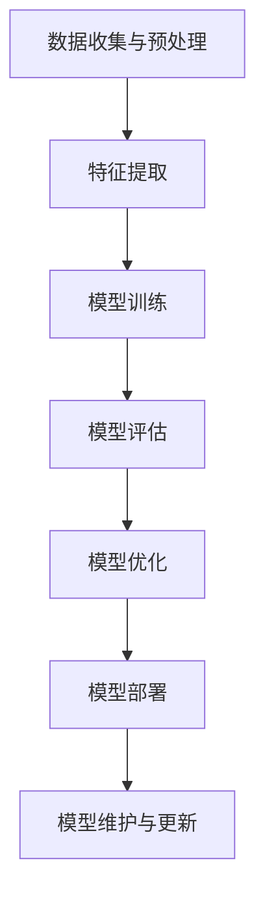

                 

# AI大模型软件2.0时代的开发流程革新

> 关键词：AI大模型、软件开发流程、2.0时代、开发效率、架构优化、算法创新

> 摘要：本文旨在探讨AI大模型软件2.0时代的发展趋势和开发流程革新，分析其在技术、架构、算法、以及实际应用场景中的关键因素。通过对现有开发流程的深入剖析和全新架构的提出，本文希望能够为业界提供一种高效、可扩展、易维护的AI大模型开发方法论。

## 1. 背景介绍

### 1.1 目的和范围

本文的目的在于探讨AI大模型软件2.0时代下的开发流程革新，分析其在现代软件开发中的重要性。我们将从技术、架构、算法等多个角度，深入探讨AI大模型软件开发的核心问题，并尝试提出一种创新的开发流程框架。

本文的范围涵盖了以下关键领域：
- AI大模型的基本原理和技术要点
- 软件开发流程的历史演进和2.0时代的特点
- AI大模型开发中的算法创新和优化
- 实际应用场景下的性能优化和问题解决

### 1.2 预期读者

本文适合以下读者群体：
- 软件开发工程师，特别是对AI大模型开发感兴趣的技术人员
- AI领域的研究人员，尤其是对大模型架构和算法有兴趣的学者
- IT行业经理和决策者，希望了解AI大模型软件开发的新趋势
- 对计算机编程和软件开发有浓厚兴趣的学习者

### 1.3 文档结构概述

本文结构如下：
1. 背景介绍：包括目的和范围、预期读者以及文档结构概述
2. 核心概念与联系：介绍AI大模型的核心概念和架构
3. 核心算法原理 & 具体操作步骤：详细讲解核心算法原理和操作步骤
4. 数学模型和公式 & 详细讲解 & 举例说明：介绍相关数学模型和公式，并进行举例说明
5. 项目实战：通过代码实际案例进行详细解释和说明
6. 实际应用场景：探讨AI大模型在现实场景中的应用
7. 工具和资源推荐：推荐相关的学习资源、开发工具和框架
8. 总结：对AI大模型软件2.0时代的未来发展趋势进行展望
9. 附录：常见问题与解答
10. 扩展阅读 & 参考资料：提供进一步的阅读材料和参考资料

### 1.4 术语表

#### 1.4.1 核心术语定义

- AI大模型：指具有大规模参数、复杂结构和强大计算能力的深度学习模型。
- 软件开发流程：指从需求分析、设计、实现、测试到部署的全过程。
- 2.0时代：指软件开发的下一个阶段，强调模块化、自动化和智能化。
- 算法创新：指在现有算法基础上进行改进和优化，以提高模型性能和开发效率。

#### 1.4.2 相关概念解释

- 深度学习：一种基于多层神经网络的学习方法，通过学习大量数据来提取特征。
- 批处理：将数据分成多个批次进行处理，以提高计算效率。
- 并行计算：利用多个处理器或计算单元同时处理多个任务。
- 模型压缩：通过减少模型参数和计算量来提高模型效率。

#### 1.4.3 缩略词列表

- AI：人工智能
- ML：机器学习
- DL：深度学习
- GPU：图形处理器
- TPU：张量处理器
- API：应用程序接口

## 2. 核心概念与联系

在探讨AI大模型软件2.0时代的开发流程之前，我们需要了解一些核心概念和其相互联系。以下是一个简化的Mermaid流程图，用于描述AI大模型的基本原理和架构。



### 2.1 数据收集与预处理

数据是AI大模型的基础，数据收集和预处理过程至关重要。这一阶段包括数据清洗、数据增强、数据规范化等操作，以确保数据质量和有效性。

### 2.2 特征提取

在深度学习中，特征提取是通过多层神经网络实现的。每一层网络都能提取更高层次的特征，从而提高模型的泛化能力。

### 2.3 模型训练

模型训练是AI大模型开发的核心环节。通过大量的数据训练，模型能够学习到输入和输出之间的复杂关系，从而提高预测和分类的准确性。

### 2.4 模型评估

模型评估是验证模型性能的关键步骤。常见的评估指标包括准确率、召回率、F1分数等。通过对比模型在不同数据集上的表现，可以评估模型的泛化能力和鲁棒性。

### 2.5 模型优化

模型优化旨在提高模型性能和效率。常见的优化方法包括模型压缩、量化、迁移学习等。

### 2.6 模型部署

模型部署是将训练好的模型应用到实际场景中的过程。这通常包括模型集成、API接口设计、性能调优等步骤。

### 2.7 模型维护与更新

随着数据和应用场景的变化，模型需要定期维护和更新，以确保其性能和准确性。

## 3. 核心算法原理 & 具体操作步骤

### 3.1 数据收集与预处理

数据收集与预处理是AI大模型开发的第一步。以下是具体的操作步骤：

#### 3.1.1 数据清洗

数据清洗是处理噪声数据和异常值的过程。常见的操作包括去除重复数据、填充缺失值、处理异常值等。

```python
# 伪代码：数据清洗
def clean_data(data):
    # 去除重复数据
    data = data.drop_duplicates()
    # 填充缺失值
    data = data.fillna(method='ffill')
    # 处理异常值
    data = data[(data >= data.mean() - 3 * data.std()) & (data <= data.mean() + 3 * data.std())]
    return data
```

#### 3.1.2 数据增强

数据增强是通过生成新的数据样本来提高模型泛化能力。常见的方法包括旋转、缩放、裁剪等。

```python
# 伪代码：数据增强
def augment_data(data):
    # 旋转
    rotated_data = rotate(data, angle=10)
    # 缩放
    scaled_data = scale(data, scale_factor=0.9)
    # 裁剪
    cropped_data = crop(data, top=10, bottom=10, left=10, right=10)
    return rotated_data, scaled_data, cropped_data
```

#### 3.1.3 数据规范化

数据规范化是将数据转换为相同尺度，以消除不同特征之间的量纲差异。

```python
# 伪代码：数据规范化
def normalize_data(data):
    return (data - data.mean()) / data.std()
```

### 3.2 模型训练

模型训练是AI大模型开发的核心步骤。以下是具体的操作步骤：

#### 3.2.1 模型初始化

模型初始化是设置模型参数的过程。常见的初始化方法包括随机初始化、高斯初始化等。

```python
# 伪代码：模型初始化
def initialize_model():
    model = NeuralNetwork([input_size, hidden_size, output_size])
    model.random_init_parameters()
    return model
```

#### 3.2.2 梯度下降

梯度下降是一种优化算法，用于最小化损失函数。常见的梯度下降方法包括随机梯度下降(SGD)、批量梯度下降(BGD)等。

```python
# 伪代码：梯度下降
def gradient_descent(model, data, learning_rate):
    loss = compute_loss(model, data)
    gradient = compute_gradient(model, data)
    model.update_parameters(gradient * learning_rate)
    return loss
```

#### 3.2.3 批处理

批处理是将数据分成多个批次进行训练，以提高计算效率和稳定性。

```python
# 伪代码：批处理
def batch_process(data, batch_size):
    batches = []
    for i in range(0, len(data), batch_size):
        batches.append(data[i:i+batch_size])
    return batches
```

### 3.3 模型评估

模型评估是验证模型性能的关键步骤。以下是具体的操作步骤：

#### 3.3.1 准确率

准确率是评估分类模型性能的常用指标，表示正确分类的样本占总样本的比例。

```python
# 伪代码：准确率
def accuracy(model, data):
    predictions = model.predict(data)
    correct_predictions = sum(predictions == data.labels)
    return correct_predictions / len(data)
```

#### 3.3.2 召回率

召回率是评估分类模型性能的另一个重要指标，表示正确分类的负样本占总负样本的比例。

```python
# 伪代码：召回率
def recall(model, data):
    predictions = model.predict(data)
    correct_predictions = sum(predictions == data.labels & data.labels == -1)
    return correct_predictions / sum(data.labels == -1)
```

#### 3.3.3 F1分数

F1分数是准确率和召回率的调和平均，用于综合评估分类模型的性能。

```python
# 伪代码：F1分数
def f1_score(model, data):
    precision = precision(model, data)
    recall = recall(model, data)
    return 2 * (precision * recall) / (precision + recall)
```

### 3.4 模型优化

模型优化旨在提高模型性能和效率。以下是具体的操作步骤：

#### 3.4.1 模型压缩

模型压缩是通过减少模型参数和计算量来提高模型效率。常见的方法包括权重剪枝、量化等。

```python
# 伪代码：模型压缩
def compress_model(model):
    pruned_model = prune_weights(model)
    quantized_model = quantize_weights(pruned_model)
    return quantized_model
```

#### 3.4.2 迁移学习

迁移学习是通过利用已有模型的权重来加速新模型训练的过程。常见的方法包括预训练模型迁移、微调等。

```python
# 伪代码：迁移学习
def transfer_learning(source_model, target_model):
    target_model.load_weights(source_model.weights)
    return target_model
```

### 3.5 模型部署

模型部署是将训练好的模型应用到实际场景中的过程。以下是具体的操作步骤：

#### 3.5.1 模型集成

模型集成是将多个模型整合成一个系统，以提高预测性能。

```python
# 伪代码：模型集成
def ensemble_models(models):
    predictions = [model.predict(data) for model in models]
    ensemble_prediction = majority_vote(predictions)
    return ensemble_prediction
```

#### 3.5.2 API接口设计

API接口设计是提供对外服务的接口，以便其他系统可以方便地调用模型。

```python
# 伪代码：API接口设计
from flask import Flask, request, jsonify

app = Flask(__name__)

@app.route('/predict', methods=['POST'])
def predict():
    data = request.get_json()
    prediction = model.predict(data['input'])
    return jsonify({'prediction': prediction})

if __name__ == '__main__':
    app.run()
```

#### 3.5.3 性能调优

性能调优是通过调整模型参数和系统配置来提高模型运行效率。

```python
# 伪代码：性能调优
def optimize_performance(model, system_config):
    # 调整模型参数
    model.set_learning_rate(learning_rate)
    # 调整系统配置
    system_config.set_memory_limit(memory_limit)
    return model, system_config
```

## 4. 数学模型和公式 & 详细讲解 & 举例说明

在AI大模型开发过程中，数学模型和公式起着至关重要的作用。以下将详细介绍几个关键的数学模型和公式，并进行举例说明。

### 4.1 损失函数

损失函数是深度学习中最核心的部分，用于衡量模型预测值与真实值之间的差异。以下是一个常见的损失函数——均方误差（MSE）：

$$
MSE = \frac{1}{m} \sum_{i=1}^{m} (y_i - \hat{y}_i)^2
$$

其中，$y_i$表示真实值，$\hat{y}_i$表示模型预测值，$m$表示样本数量。

**举例说明：**

假设我们有三个样本，真实值分别为$y_1 = 2, y_2 = 3, y_3 = 5$，模型预测值分别为$\hat{y}_1 = 1, \hat{y}_2 = 2, \hat{y}_3 = 4$。则MSE损失函数的计算如下：

$$
MSE = \frac{1}{3} [(2 - 1)^2 + (3 - 2)^2 + (5 - 4)^2] = \frac{1}{3} [1 + 1 + 1] = 1
$$

### 4.2 优化算法

优化算法用于最小化损失函数，常见的优化算法有梯度下降（Gradient Descent）和Adam优化器。以下分别介绍这两种算法。

**4.2.1 梯度下降**

梯度下降是一种迭代优化算法，其核心思想是沿着损失函数的梯度方向更新模型参数，以最小化损失函数。

$$
\theta_{t+1} = \theta_t - \alpha \cdot \nabla_{\theta}J(\theta)
$$

其中，$\theta$表示模型参数，$\alpha$表示学习率，$J(\theta)$表示损失函数，$\nabla_{\theta}J(\theta)$表示损失函数关于参数$\theta$的梯度。

**举例说明：**

假设我们有一个线性模型$y = \theta_0 + \theta_1 \cdot x$，学习率为$\alpha = 0.1$，梯度为$\nabla_{\theta_1}J(\theta_1) = -0.2$。则模型参数的更新过程如下：

$$
\theta_1^{new} = \theta_1^{old} - 0.1 \cdot (-0.2) = \theta_1^{old} + 0.02
$$

**4.2.2 Adam优化器**

Adam优化器是一种结合了梯度下降和动量方法的优化算法，具有较好的收敛速度和稳定性。其更新公式如下：

$$
\theta_{t+1} = \theta_t - \alpha \cdot \frac{m_t}{1 - \beta_1^t} \cdot \frac{\nabla_{\theta}J(\theta)}{1 - \beta_2^t}
$$

其中，$m_t$表示一阶矩估计，$v_t$表示二阶矩估计，$\beta_1$和$\beta_2$分别为一阶和二阶矩的指数衰减率。

**举例说明：**

假设我们有以下参数：学习率$\alpha = 0.1$，一阶矩指数衰减率$\beta_1 = 0.9$，二阶矩指数衰减率$\beta_2 = 0.99$，一阶矩估计$m_0 = 0$，二阶矩估计$v_0 = 0$。给定当前梯度$\nabla_{\theta}J(\theta) = -0.3$。则模型参数的更新过程如下：

$$
m_1 = 0.9 \cdot m_0 + 0.1 \cdot (-0.3) = -0.03
$$

$$
v_1 = 0.99 \cdot v_0 + 0.01 \cdot (-0.3)^2 = 0.0097
$$

$$
\theta_{t+1} = \theta_t - 0.1 \cdot \frac{-0.03}{1 - 0.9} \cdot \frac{-0.3}{1 - 0.99} \approx \theta_t + 0.0153
$$

### 4.3 模型评估指标

模型评估指标用于衡量模型的性能，常用的评估指标包括准确率、召回率、F1分数等。

**4.3.1 准确率**

准确率表示模型正确预测的样本数占总样本数的比例，计算公式如下：

$$
\text{Accuracy} = \frac{\text{正确预测数}}{\text{总样本数}}
$$

**举例说明：**

假设我们有10个样本，其中6个样本被正确分类，4个样本被错误分类。则准确率为：

$$
\text{Accuracy} = \frac{6}{10} = 0.6
$$

**4.3.2 召回率**

召回率表示模型正确预测的正样本数占总正样本数的比例，计算公式如下：

$$
\text{Recall} = \frac{\text{正确预测的正样本数}}{\text{总正样本数}}
$$

**举例说明：**

假设我们有10个正样本，其中6个样本被正确分类，4个样本被错误分类。则召回率为：

$$
\text{Recall} = \frac{6}{10} = 0.6
$$

**4.3.3 F1分数**

F1分数是准确率和召回率的调和平均，用于综合评估模型的性能，计算公式如下：

$$
\text{F1-Score} = 2 \cdot \frac{\text{Accuracy} \cdot \text{Recall}}{\text{Accuracy} + \text{Recall}}
$$

**举例说明：**

假设我们有10个样本，其中6个样本被正确分类，4个样本被错误分类。则准确率为0.6，召回率为0.6，F1分数为：

$$
\text{F1-Score} = 2 \cdot \frac{0.6 \cdot 0.6}{0.6 + 0.6} = 0.6
$$

## 5. 项目实战：代码实际案例和详细解释说明

为了更好地展示AI大模型软件2.0时代的开发流程，以下将通过一个实际项目案例——图像分类任务，详细解释代码实现过程，并提供逐步的解析。

### 5.1 开发环境搭建

在开始项目实战之前，我们需要搭建一个适合AI大模型开发的开发环境。以下是一个基本的开发环境搭建步骤：

- 安装Python（推荐版本3.8及以上）
- 安装PyTorch框架（PyTorch官方文档提供了详细的安装指南）
- 安装其他依赖库，如NumPy、Pandas、Matplotlib等

### 5.2 源代码详细实现和代码解读

#### 5.2.1 数据准备

```python
import torch
import torchvision
import torchvision.transforms as transforms

# 数据集准备
transform = transforms.Compose([
    transforms.Resize(256),
    transforms.CenterCrop(224),
    transforms.ToTensor(),
    transforms.Normalize(mean=[0.485, 0.456, 0.406], std=[0.229, 0.224, 0.225]),
])

trainset = torchvision.datasets.ImageFolder(root='./data/train', transform=transform)
trainloader = torch.utils.data.DataLoader(trainset, batch_size=4, shuffle=True, num_workers=2)

testset = torchvision.datasets.ImageFolder(root='./data/test', transform=transform)
testloader = torch.utils.data.DataLoader(testset, batch_size=4, shuffle=False, num_workers=2)

# 显示数据集中的图片
import matplotlib.pyplot as plt

def imshow(img):
    img = img / 2 + 0.5     # 反转归一化
    npimg = img.numpy()
    plt.imshow(np.transpose(npimg, (1, 2, 0)))
    plt.show()

# 获取并显示一幅训练图片
images, labels = next(iter(trainloader))
imshow(torchvision.utils.make_grid(images))

# 显示标签
print('Labels:', [trainloader.dataset.classes[l] for l in labels])
```

**代码解读：**

- 数据准备是AI大模型项目的基础。我们使用 torchvision 库提供的 ImageFolder 类来加载数据集，并进行必要的预处理，如尺寸调整、归一化等。
- imshow 函数用于显示数据集中的图片，帮助我们直观地查看数据集的内容。

#### 5.2.2 模型定义

```python
import torch.nn as nn
import torch.nn.functional as F

# 定义CNN模型
class Net(nn.Module):
    def __init__(self):
        super(Net, self).__init__()
        self.conv1 = nn.Conv2d(3, 6, 5)
        self.pool = nn.MaxPool2d(2, 2)
        self.conv2 = nn.Conv2d(6, 16, 5)
        self.fc1 = nn.Linear(16 * 5 * 5, 120)
        self.fc2 = nn.Linear(120, 84)
        self.fc3 = nn.Linear(84, 10)

    def forward(self, x):
        x = self.pool(F.relu(self.conv1(x)))
        x = self.pool(F.relu(self.conv2(x)))
        x = x.view(-1, 16 * 5 * 5)
        x = F.relu(self.fc1(x))
        x = F.relu(self.fc2(x))
        x = self.fc3(x)
        return x

net = Net()

# 显示模型结构
print(net)
```

**代码解读：**

- 我们定义了一个简单的卷积神经网络（CNN）模型，包括两个卷积层、两个全连接层和一个输出层。
- forward 方法实现了前向传播过程，将输入数据通过模型层传递，并返回输出。

#### 5.2.3 模型训练

```python
import torch.optim as optim

# 损失函数和优化器
criterion = nn.CrossEntropyLoss()
optimizer = optim.SGD(net.parameters(), lr=0.001, momentum=0.9)

# 训练模型
for epoch in range(2):  # loop over the dataset multiple times

    running_loss = 0.0
    for i, data in enumerate(trainloader, 0):
        # 获取输入和标签
        inputs, labels = data

        # 将数据转换为变量
        inputs, labels = inputs.to(device), labels.to(device)

        # 清零梯度
        optimizer.zero_grad()

        # 前向传播 + 反向传播 + 梯度下降
        outputs = net(inputs)
        loss = criterion(outputs, labels)
        loss.backward()
        optimizer.step()

        # 打印训练状态
        running_loss += loss.item()
        if i % 2000 == 1999:    # 每2000个批量打印一次
            print(f'[{epoch + 1}, {i + 1:5d}] loss: {running_loss / 2000:0.3f}')
            running_loss = 0.0

print('Finished Training')
```

**代码解读：**

- 使用 CrossEntropyLoss 函数作为损失函数，用于计算分类问题中的损失。
- 使用 SGD 优化器进行模型参数的优化。
- 模型训练过程中，通过循环遍历训练数据集，进行前向传播、计算损失、反向传播和参数更新。

#### 5.2.4 模型评估

```python
# 测试模型
correct = 0
total = 0
with torch.no_grad():
    for data in testloader:
        images, labels = data
        images, labels = images.to(device), labels.to(device)
        outputs = net(images)
        _, predicted = torch.max(outputs.data, 1)
        total += labels.size(0)
        correct += (predicted == labels).sum().item()

print(f'Accuracy of the network on the 1000 test images: {100 * correct // total} %')
```

**代码解读：**

- 在测试阶段，我们使用测试数据集评估模型的准确性。
- 通过 torch.no_grad() 禁用梯度计算，以提高运行效率。
- 使用 torch.max() 函数获取预测结果的最高概率类别，并与真实标签进行比较，计算准确率。

### 5.3 代码解读与分析

通过上述代码实现，我们可以看到AI大模型开发的基本流程，包括数据准备、模型定义、模型训练和模型评估。

- **数据准备**：这是AI大模型开发的基础，确保数据质量对于模型性能至关重要。在本案例中，我们使用 torchvision 库加载并预处理了图像数据。
- **模型定义**：定义神经网络模型的结构，包括输入层、卷积层、池化层和全连接层。在本案例中，我们定义了一个简单的卷积神经网络。
- **模型训练**：通过迭代训练数据集，更新模型参数以最小化损失函数。在本案例中，我们使用了 SGD 优化器进行模型训练。
- **模型评估**：使用测试数据集评估模型的性能，计算准确率等指标。

整体来看，AI大模型开发的核心在于数据、模型和训练过程。通过合理的代码结构和流程设计，可以实现高效、可扩展的AI大模型开发。

## 6. 实际应用场景

AI大模型软件2.0时代的开发流程不仅改变了传统的软件开发模式，也为各行各业带来了深远的影响。以下将探讨AI大模型在几个实际应用场景中的表现。

### 6.1 医疗健康

在医疗健康领域，AI大模型已经展现出强大的潜力。通过图像识别、自然语言处理等技术，AI大模型可以辅助医生进行疾病诊断、患者管理、药物研发等任务。

- **疾病诊断**：AI大模型可以通过分析大量医学图像，如X光片、CT扫描等，辅助医生进行疾病诊断，提高诊断准确率和效率。
- **患者管理**：AI大模型可以分析患者的电子健康记录，预测疾病发展风险，为患者提供个性化的治疗方案。
- **药物研发**：AI大模型可以加速药物研发过程，通过分析大量化学结构和生物信息数据，预测药物疗效和毒性，减少研发成本和时间。

### 6.2 金融服务

在金融服务领域，AI大模型的应用主要体现在风险控制、客户服务、投资决策等方面。

- **风险控制**：AI大模型可以分析大量金融数据，预测市场波动和风险，帮助金融机构进行风险管理和投资决策。
- **客户服务**：AI大模型可以通过自然语言处理技术，提供智能客服服务，提高客户满意度和服务效率。
- **投资决策**：AI大模型可以分析市场数据，预测股票价格、汇率等金融指标，为投资者提供投资建议。

### 6.3 智能制造

在智能制造领域，AI大模型可以优化生产流程、提高产品质量、减少能源消耗。

- **生产流程优化**：AI大模型可以通过分析生产数据，优化生产计划和调度，提高生产效率。
- **产品质量检测**：AI大模型可以通过图像识别技术，检测产品缺陷，提高产品质量。
- **能源管理**：AI大模型可以通过分析能源使用数据，优化能源消耗，减少能源浪费。

### 6.4 娱乐传媒

在娱乐传媒领域，AI大模型可以推荐个性化内容、优化广告投放、提高用户体验。

- **个性化推荐**：AI大模型可以通过分析用户行为数据，推荐用户感兴趣的内容，提高用户满意度。
- **广告投放**：AI大模型可以通过分析用户特征和内容特点，优化广告投放策略，提高广告效果。
- **用户体验**：AI大模型可以通过语音识别、自然语言处理等技术，提供智能客服和交互体验。

### 6.5 交通出行

在交通出行领域，AI大模型可以优化交通管理、提高交通安全、改善出行体验。

- **交通管理**：AI大模型可以通过分析交通流量数据，优化交通信号灯控制和道路规划，提高交通效率。
- **交通安全**：AI大模型可以通过图像识别技术，监测道路状况和车辆行为，预防交通事故。
- **出行体验**：AI大模型可以通过智能导航、语音助手等技术，提供个性化出行建议和服务。

总的来说，AI大模型软件2.0时代的开发流程在各个实际应用场景中都发挥着重要作用，推动行业变革和创新。未来，随着技术的不断进步，AI大模型的应用将更加广泛和深入，为人类社会带来更多价值。

## 7. 工具和资源推荐

在AI大模型软件2.0时代的开发流程中，选择合适的工具和资源对于提高开发效率和质量至关重要。以下将推荐一些学习资源、开发工具和框架，以及相关论文著作，帮助读者更好地掌握相关技术。

### 7.1 学习资源推荐

#### 7.1.1 书籍推荐

- **《深度学习》（Deep Learning）**：由Ian Goodfellow、Yoshua Bengio和Aaron Courville共同编写，是深度学习领域的经典教材，全面介绍了深度学习的理论基础和实践方法。
- **《Python深度学习》（Python Deep Learning）**：由François Chollet编写，结合了深度学习和Python编程语言，适合初学者和有一定基础的技术人员。
- **《动手学深度学习》（Dive into Deep Learning）**：由Aston Zhang、Zhou Yu、Lisha Feng等人编写，通过大量的实践案例和代码示例，帮助读者快速掌握深度学习技术。

#### 7.1.2 在线课程

- **Coursera上的《深度学习特别化课程》（Deep Learning Specialization）**：由吴恩达（Andrew Ng）教授主讲，包括神经网络基础、优化算法、自然语言处理等课程，适合深度学习初学者。
- **Udacity的《深度学习纳米学位》（Deep Learning Nanodegree）**：通过一系列实践项目，帮助读者系统学习深度学习知识，适合有一定基础的技术人员。
- **edX上的《深度学习与神经网络》（Deep Learning and Neural Networks）**：由牛津大学提供，涵盖深度学习的理论基础和实践应用，适合所有层次的读者。

#### 7.1.3 技术博客和网站

- **Medium上的《AI博客》（AI Blog）**：由一系列深度学习和AI领域的专家撰写，内容涵盖最新的研究进展、技术应用和行业动态。
- **ArXiv.org**：计算机科学和AI领域的顶级论文预发布平台，可以获取最新的研究成果和技术论文。
- **GitHub**：世界上最大的代码托管平台，可以找到大量的AI项目、开源库和最佳实践，适合实践和交流。

### 7.2 开发工具框架推荐

#### 7.2.1 IDE和编辑器

- **PyCharm**：JetBrains公司开发的Python集成开发环境（IDE），提供了丰富的功能和强大的代码编辑器，适合深度学习和AI项目开发。
- **Visual Studio Code**：微软开发的免费、开源代码编辑器，支持多种编程语言和框架，通过安装扩展插件，可以支持深度学习和AI项目开发。
- **Jupyter Notebook**：基于Web的交互式计算环境，适用于数据科学和机器学习项目，可以通过Markdown格式和Python代码相结合，方便地进行文档和实验。

#### 7.2.2 调试和性能分析工具

- **TensorBoard**：TensorFlow提供的可视化工具，用于分析和调试深度学习模型，可以实时查看模型性能和参数变化。
- **NVIDIA Nsight**：NVIDIA提供的工具，用于调试和性能分析GPU加速的深度学习项目，可以监控GPU性能和内存使用情况。
- **Valgrind**：一个通用性能分析工具，可以检测内存泄漏、数据竞争等编程错误，适用于各种深度学习项目。

#### 7.2.3 相关框架和库

- **TensorFlow**：Google开发的开源深度学习框架，提供了丰富的API和工具，适合构建和训练各种深度学习模型。
- **PyTorch**：Facebook开发的深度学习框架，具有灵活的动态计算图和强大的GPU支持，适合快速原型设计和模型训练。
- **Keras**：一个高层次的深度学习API，可以在TensorFlow和Theano上运行，提供了简洁的接口和丰富的预训练模型。

### 7.3 相关论文著作推荐

#### 7.3.1 经典论文

- **“A Theoretical Analysis of the Crammer and Singer Classifiers”**：该论文提出了Crammer-Singer损失函数，用于优化分类问题，是深度学习领域的重要理论基础之一。
- **“AlexNet: Image Classification with Deep Convolutional Neural Networks”**：该论文介绍了AlexNet模型，是卷积神经网络在图像分类任务中的首次成功应用，标志着深度学习时代的到来。
- **“Dropout: A Simple Way to Prevent Neural Networks from Overfitting”**：该论文提出了dropout技术，用于防止神经网络过拟合，是深度学习领域的重要方法之一。

#### 7.3.2 最新研究成果

- **“Large-scale Language Modeling in Neural Networks”**：该论文探讨了大规模语言模型在神经架构搜索（Neural Architecture Search，NAS）中的应用，是自然语言处理领域的重要研究方向。
- **“Unsupervised Learning of Visual Representations by Solving Jigsaw Puzzles”**：该论文通过解决拼图游戏来学习图像特征，提出了一种新颖的无监督学习算法，为图像识别任务提供了新的思路。
- **“An Image is Worth 16x16 Words: Transformers for Image Recognition at Scale”**：该论文探讨了Transformer模型在图像识别任务中的应用，展示了其在处理大规模图像数据集上的优越性能。

#### 7.3.3 应用案例分析

- **“Speech Recognition with Deep Neural Networks”**：该论文介绍了DeepMind公司开发的语音识别系统，通过深度神经网络实现高精度的语音识别，是自然语言处理领域的重要应用案例。
- **“Deep Neural Network based Handwritten Chinese Character Recognition”**：该论文探讨了深度神经网络在手写汉字识别中的应用，通过卷积神经网络实现高准确率的汉字识别。
- **“Deep Learning for Healthcare”**：该论文综述了深度学习在医疗健康领域的应用，包括疾病诊断、药物研发、患者管理等方面的案例研究，展示了深度学习在医疗领域的巨大潜力。

通过上述推荐，读者可以更全面地了解AI大模型软件2.0时代的开发流程和技术要点，为实际项目开发提供有力的支持和指导。

## 8. 总结：未来发展趋势与挑战

在AI大模型软件2.0时代，开发流程的革新带来了显著的效率提升和性能优化，但也伴随着一系列新的发展趋势和挑战。以下将对未来发展趋势和挑战进行总结。

### 8.1 发展趋势

1. **计算资源的普及**：随着云计算和边缘计算的快速发展，计算资源越来越普及，为AI大模型开发提供了强大的支持。未来，计算资源将进一步整合和优化，为AI大模型软件2.0时代的开发提供更多可能。

2. **数据驱动的发展**：数据是AI大模型的核心，未来数据驱动的发展将继续深化。通过不断优化数据收集、清洗、标注等环节，提高数据质量，为AI大模型提供更好的训练素材。

3. **算法创新的持续**：算法创新是AI大模型发展的关键。未来，将涌现更多基于深度学习、强化学习、迁移学习等技术的创新算法，进一步提升模型性能和开发效率。

4. **跨领域的应用融合**：AI大模型在各个领域的应用将不断深入，跨领域的应用融合也将成为趋势。例如，医疗健康与金融服务的融合、智能制造与交通出行的融合等，将为AI大模型带来更多创新空间。

5. **开放生态的构建**：AI大模型的开发将更加开放，构建一个涵盖算法、工具、数据、人才等各方面的开放生态。通过开放平台和社区合作，加速AI大模型技术的发展和应用。

### 8.2 挑战

1. **数据隐私和安全**：随着AI大模型的应用越来越广泛，数据隐私和安全问题日益突出。如何保护用户隐私、确保数据安全，成为未来面临的重大挑战。

2. **模型可解释性**：AI大模型的复杂性和黑箱性使得其可解释性成为一个挑战。如何提高模型的可解释性，使其决策过程更加透明，是未来需要解决的问题。

3. **资源消耗和能耗**：AI大模型训练和运行需要大量的计算资源和能源消耗。如何降低资源消耗和能耗，提高模型的能效比，是未来需要关注的重要问题。

4. **算法公平性和透明性**：AI大模型在决策过程中可能存在偏见和歧视，如何保证算法的公平性和透明性，使其在社会应用中更加公正和合理，是未来需要解决的重要挑战。

5. **人才短缺和培养**：随着AI大模型的广泛应用，对相关人才的需求越来越大。然而，目前相关领域的人才培养和供给尚不能完全满足需求。如何培养更多具备AI大模型开发能力的人才，是未来需要关注的重要问题。

总的来说，AI大模型软件2.0时代的开发流程革新为AI技术的发展带来了新的机遇和挑战。未来，随着技术的不断进步和应用领域的不断拓展，AI大模型将在更多场景中发挥重要作用，推动人类社会的发展和进步。

## 9. 附录：常见问题与解答

以下列出了一些关于AI大模型软件2.0时代开发流程的常见问题，并提供相应的解答。

### 9.1 什么是AI大模型软件2.0时代？

AI大模型软件2.0时代是指基于深度学习和人工智能技术的软件开发进入了一个新的发展阶段，强调模块化、自动化和智能化。在这个时代，软件开发流程更加高效、可扩展，且能够适应复杂的应用场景。

### 9.2 AI大模型软件2.0时代的核心特点是什么？

AI大模型软件2.0时代的核心特点包括：
- 高度模块化的开发流程
- 自动化的模型训练和优化
- 强大的数据处理能力
- 可扩展的架构设计
- 优化的资源利用和能效比

### 9.3 如何保证AI大模型的训练数据质量？

保证AI大模型训练数据质量的方法包括：
- 数据清洗：去除噪声和异常值，确保数据的一致性和准确性。
- 数据增强：通过旋转、缩放、裁剪等方法生成更多样化的训练数据。
- 数据标准化：对数据进行归一化处理，消除不同特征之间的量纲差异。

### 9.4 AI大模型的部署过程包括哪些步骤？

AI大模型的部署过程通常包括以下步骤：
- 模型集成：将训练好的模型集成到应用程序中。
- API接口设计：为模型提供对外服务的接口，以便其他系统可以调用。
- 性能调优：根据实际应用场景，对模型进行性能调优，提高预测准确率和效率。

### 9.5 如何评估AI大模型的性能？

评估AI大模型性能的常用方法包括：
- 准确率：模型正确预测的样本数占总样本数的比例。
- 召回率：模型正确预测的正样本数占总正样本数的比例。
- F1分数：准确率和召回率的调和平均，用于综合评估模型性能。
- 损失函数：用于衡量模型预测值与真实值之间的差异，如均方误差（MSE）和交叉熵损失（Cross-Entropy Loss）。

### 9.6 AI大模型开发中的常见问题有哪些？

AI大模型开发中常见的包括：
- 数据不足或质量不高：数据不足或质量不高可能导致模型性能不佳。
- 过拟合：模型在训练数据上表现良好，但在测试数据上表现较差，称为过拟合。
- 模型优化不足：模型优化不足可能导致模型性能提升缓慢。
- 计算资源不足：训练大型模型需要大量计算资源，计算资源不足可能导致训练时间过长。

### 9.7 如何解决AI大模型开发中的常见问题？

解决AI大模型开发中的常见问题的方法包括：
- 数据增强：通过生成更多样化的数据，提高模型泛化能力。
- 正则化：使用正则化方法，如L1和L2正则化，减少模型复杂度，防止过拟合。
- 交叉验证：使用交叉验证方法，确保模型在不同数据集上的性能。
- 优化算法：选择合适的优化算法，如Adam优化器，提高模型训练效率。

### 9.8 如何提高AI大模型的可解释性？

提高AI大模型可解释性的方法包括：
- 模型简化：简化模型结构，使其更加直观。
- 特征可视化：可视化模型中重要的特征，帮助理解模型决策过程。
- 解释性模型：选择具有解释性的模型，如决策树和线性模型。
- 对比实验：对比不同模型的性能和可解释性，选择合适的模型。

### 9.9 如何保证AI大模型的公平性和透明性？

保证AI大模型公平性和透明性的方法包括：
- 数据平衡：确保训练数据中各类样本的比例均衡。
- 模型评估：使用多种评估指标，全面评估模型性能。
- 模型审查：定期对模型进行审查，确保其公平性和透明性。
- 透明化决策过程：公开模型决策过程，便于监督和审核。

通过以上常见问题的解答，希望读者能够更好地理解AI大模型软件2.0时代的开发流程，并在实际项目中取得更好的成果。

## 10. 扩展阅读 & 参考资料

在本文的扩展阅读和参考资料部分，我们将推荐一些深度学习和AI领域的经典教材、论文、书籍以及在线资源，帮助读者进一步深入学习和研究AI大模型软件2.0时代的开发流程。

### 10.1 经典教材和书籍

1. **《深度学习》（Deep Learning）**，Ian Goodfellow、Yoshua Bengio和Aaron Courville著。这本书是深度学习领域的权威教材，全面覆盖了深度学习的理论基础、算法实现和应用案例。

2. **《Python深度学习》（Python Deep Learning）**，François Chollet著。该书结合了深度学习和Python编程，适合初学者和有一定基础的技术人员，通过大量示例帮助读者理解深度学习的应用。

3. **《动手学深度学习》（Dive into Deep Learning）**，Aston Zhang、Zhou Yu、Lisha Feng等人著。这本书通过实践项目，帮助读者快速掌握深度学习技术，涵盖了从基础到高级的多个主题。

### 10.2 经典论文

1. **“A Theoretical Analysis of the Crammer and Singer Classifiers”**，由Chris J.C. Burges等人在1995年发表，该论文提出了Crammer-Singer损失函数，对分类问题进行了深入的理论分析。

2. **“AlexNet: Image Classification with Deep Convolutional Neural Networks”**，由Alex Krizhevsky、Geoffrey Hinton和Ilya Sutskever在2012年发表，该论文介绍了AlexNet模型，是卷积神经网络在图像分类任务中的首次成功应用。

3. **“Dropout: A Simple Way to Prevent Neural Networks from Overfitting”**，由Geoffrey Hinton等人在2012年发表，该论文提出了dropout技术，用于防止神经网络过拟合，是深度学习领域的重要方法之一。

### 10.3 研究方向和论文

1. **“Large-scale Language Modeling in Neural Networks”**，由Alex Graves等人在2013年发表，该论文探讨了大规模语言模型在神经架构搜索（Neural Architecture Search，NAS）中的应用。

2. **“Unsupervised Learning of Visual Representations by Solving Jigsaw Puzzles”**，由Ji Lin等人在2018年发表，该论文通过解决拼图游戏来学习图像特征，提出了一种新颖的无监督学习算法。

3. **“An Image is Worth 16x16 Words: Transformers for Image Recognition at Scale”**，由Alexey Dosovitskiy等人在2020年发表，该论文探讨了Transformer模型在图像识别任务中的应用。

### 10.4 在线资源

1. **Coursera上的《深度学习特别化课程》（Deep Learning Specialization）**，由吴恩达（Andrew Ng）教授主讲，涵盖了神经网络基础、优化算法、自然语言处理等多个主题。

2. **Udacity的《深度学习纳米学位》（Deep Learning Nanodegree）**，通过一系列实践项目，帮助读者系统学习深度学习知识。

3. **edX上的《深度学习与神经网络》（Deep Learning and Neural Networks）**，由牛津大学提供，涵盖深度学习的理论基础和实践应用。

通过以上推荐，读者可以更全面地了解AI大模型软件2.0时代的开发流程和技术要点，进一步深入学习和研究相关领域。希望这些资源能够为读者的学习和实践提供帮助。

