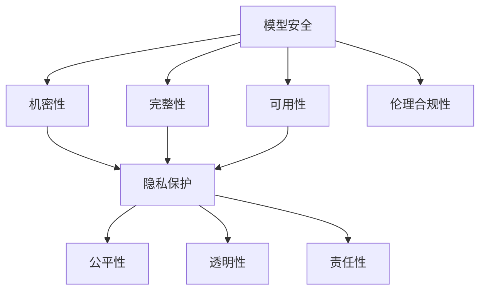

                 

# AI大模型部署中的模型安全、隐私保护与伦理合规性评估体系

## 关键词

- 模型安全
- 隐私保护
- 伦理合规性
- 人工智能
- 大模型
- 部署
- 评估体系

## 摘要

本文深入探讨了人工智能大模型在部署过程中面临的模型安全、隐私保护和伦理合规性问题。首先，我们介绍了模型安全、隐私保护和伦理合规性的核心概念及其相互关系。随后，文章详细阐述了大模型部署中安全威胁与风险，并介绍了相关的保护措施。接着，我们探讨了隐私保护和伦理合规性的重要性，分析了当前常见的隐私泄露风险和伦理问题。然后，文章提出了一个全面的评估体系，包括模型安全性、隐私保护和伦理合规性评估的步骤和标准。最后，本文通过实际项目案例展示了这些评估方法的实际应用，并讨论了未来发展趋势和面临的挑战。通过本文，读者将全面了解大模型部署中的关键问题及其解决方案。

## 1. 背景介绍

### 1.1 目的和范围

人工智能（AI）技术近年来取得了飞速发展，尤其是大模型（Large Models）的应用范围不断扩大，从自然语言处理到计算机视觉，从推荐系统到语音识别，大模型已经成为许多关键应用的基石。然而，随着大模型应用的普及，其部署过程中面临的模型安全、隐私保护和伦理合规性问题也日益凸显。

本文旨在系统地探讨人工智能大模型在部署过程中的模型安全、隐私保护和伦理合规性问题，并提出一个综合评估体系。文章将首先介绍模型安全、隐私保护和伦理合规性的核心概念及其相互关系。然后，文章将深入探讨大模型部署中常见的安全威胁与风险，并介绍相关的保护措施。此外，文章还将分析隐私保护和伦理合规性的重要性，介绍当前常见的隐私泄露风险和伦理问题。在此基础上，文章将提出一个全面的评估体系，详细说明模型安全性、隐私保护和伦理合规性评估的步骤和标准。最后，本文将通过实际项目案例展示这些评估方法的实际应用，并讨论未来发展趋势和面临的挑战。

### 1.2 预期读者

本文预期读者为从事人工智能相关领域的研究人员、开发人员、技术经理以及政策制定者。首先，本文对人工智能大模型的基本概念和部署流程有一定的要求，读者需要对大模型的基本原理和应用场景有所了解。其次，本文涉及到的模型安全、隐私保护和伦理合规性问题具有一定的技术深度，读者需要具备一定的计算机科学和网络安全背景。最后，本文提出的评估体系需要读者具备一定的分析和解决问题的能力，能够理解并应用文中提到的各种方法和工具。

### 1.3 文档结构概述

本文分为十个部分：

1. **背景介绍**：介绍文章的目的、预期读者以及文档结构。
2. **核心概念与联系**：介绍模型安全、隐私保护和伦理合规性的核心概念及其相互关系。
3. **核心算法原理 & 具体操作步骤**：阐述大模型部署中核心算法的原理和具体操作步骤。
4. **数学模型和公式 & 详细讲解 & 举例说明**：介绍大模型部署中涉及到的数学模型和公式，并给出详细讲解和举例说明。
5. **项目实战：代码实际案例和详细解释说明**：通过实际项目案例展示评估体系的实际应用。
6. **实际应用场景**：分析大模型部署在实际应用中的场景。
7. **工具和资源推荐**：推荐学习资源和开发工具。
8. **总结：未来发展趋势与挑战**：总结文章内容，探讨未来发展趋势和挑战。
9. **附录：常见问题与解答**：回答读者可能关心的问题。
10. **扩展阅读 & 参考资料**：提供进一步的阅读资料。

### 1.4 术语表

#### 1.4.1 核心术语定义

- **人工智能（AI）**：模拟人类智能的技术，包括机器学习、深度学习、自然语言处理等。
- **大模型（Large Models）**：具有巨大参数量的神经网络模型，通常用于处理复杂的任务，如文本生成、图像识别等。
- **模型安全（Model Security）**：确保模型不被恶意攻击或篡改，保护模型的机密性、完整性和可用性。
- **隐私保护（Privacy Protection）**：确保用户数据的隐私，防止隐私泄露和滥用。
- **伦理合规性（Ethical Compliance）**：确保人工智能应用符合伦理标准和法律法规。

#### 1.4.2 相关概念解释

- **模型泄露（Model Leakage）**：模型在训练或部署过程中，将敏感信息泄露给输入数据的隐患。
- **对抗攻击（Adversarial Attack）**：通过设计对抗样本来攻击模型，使其性能下降或输出错误结果。
- **隐私泄露（Privacy Leakage）**：用户隐私信息在数据处理或存储过程中被泄露的风险。
- **伦理问题（Ethical Issues）**：人工智能应用可能带来的道德和社会问题，如歧视、偏见等。

#### 1.4.3 缩略词列表

- **AI**：人工智能（Artificial Intelligence）
- **ML**：机器学习（Machine Learning）
- **DL**：深度学习（Deep Learning）
- **NLP**：自然语言处理（Natural Language Processing）
- **GDPR**：通用数据保护条例（General Data Protection Regulation）

## 2. 核心概念与联系

在探讨大模型部署中的模型安全、隐私保护和伦理合规性之前，我们首先需要明确这些核心概念及其相互关系。模型安全、隐私保护和伦理合规性是确保人工智能应用安全、可靠和符合社会道德标准的三大支柱，它们之间存在紧密的联系和相互影响。

### 2.1 模型安全

模型安全是指确保人工智能模型在训练、部署和使用过程中不受恶意攻击或篡改，保护其机密性、完整性和可用性。模型安全主要包括以下几个方面：

- **机密性**：防止模型的内部结构和参数被未授权访问或泄露。
- **完整性**：确保模型不被篡改或破坏，保持其准确性和可靠性。
- **可用性**：确保模型在需要时能够正常使用，不受拒绝服务攻击的影响。

### 2.2 隐私保护

隐私保护是指确保用户数据的隐私，防止隐私泄露和滥用。在大模型部署过程中，隐私保护至关重要，因为模型训练过程中需要大量用户数据，这些数据可能包含敏感信息。隐私保护主要包括以下几个方面：

- **数据加密**：对用户数据进行加密处理，防止数据在传输和存储过程中被窃取。
- **数据去标识化**：对用户数据进行去标识化处理，使其无法与特定用户关联。
- **匿名化**：对用户数据进行匿名化处理，消除个人身份信息。

### 2.3 伦理合规性

伦理合规性是指确保人工智能应用符合伦理标准和法律法规。在大模型部署过程中，伦理合规性主要涉及以下几个方面：

- **公平性**：确保模型在处理数据时不会对特定群体产生歧视。
- **透明性**：确保模型的行为和决策过程对用户透明，使其能够理解和使用模型。
- **责任性**：确保模型开发者和使用者对模型行为负责，能够应对潜在的法律和伦理问题。

### 2.4 三者关系

模型安全、隐私保护和伦理合规性之间存在紧密的联系和相互影响。一方面，模型安全是隐私保护和伦理合规性的基础。如果模型本身不安全，隐私保护和伦理合规性将无从谈起。另一方面，隐私保护和伦理合规性对模型安全提出了更高的要求。只有在确保隐私和伦理合规的前提下，模型才能被认为是安全的。

此外，模型安全、隐私保护和伦理合规性之间也存在一定的交集。例如，数据加密既属于隐私保护的一部分，也是确保模型机密性的重要手段。同样，模型的公平性和透明性既涉及伦理合规性，也关系到模型的安全性。

### 2.5 Mermaid 流程图

下面是一个简化的Mermaid流程图，展示了模型安全、隐私保护和伦理合规性之间的核心概念及其相互关系。



通过这个流程图，我们可以更直观地理解模型安全、隐私保护和伦理合规性之间的关系。接下来，我们将进一步探讨大模型部署中面临的安全威胁与风险，并提出相应的保护措施。

## 3. 核心算法原理 & 具体操作步骤

在大模型部署过程中，模型安全、隐私保护和伦理合规性是至关重要的。为了确保这些目标，我们需要深入了解相关核心算法原理，并详细阐述具体操作步骤。本节将首先介绍用于提升模型安全的几种关键算法，包括模型加密、对抗攻击防御和差分隐私技术。随后，我们将探讨如何在实际操作中应用这些算法，并给出伪代码实现。

### 3.1 模型加密

模型加密是一种保护模型机密性的重要技术，通过加密模型参数和结构，防止未授权访问。常见的模型加密算法包括同态加密、差分隐私和量子加密。

#### 3.1.1 同态加密

同态加密允许在密文中执行计算，而无需解密，从而在保护模型机密性的同时，保持其可用性。以下是一个简化的同态加密算法伪代码：

```python
def homomorphic加密(model, input_data):
    # 假设加密库支持对模型参数和输入数据的加密
    encrypted_model = encrypt(model)
    encrypted_input = encrypt(input_data)
    result = model(encrypted_input)
    return decrypt(result)
```

#### 3.1.2 差分隐私

差分隐私通过在数据处理过程中引入随机噪声，确保无法通过单个数据点推断出其他数据点的隐私保护技术。以下是一个简化的差分隐私算法伪代码：

```python
def differential隐私(model, input_data, epsilon):
    # 假设库支持差分隐私操作
    noise = sample_noise(epsilon)
    output = model(input_data) + noise
    return output
```

#### 3.1.3 量子加密

量子加密利用量子力学原理实现更安全的加密，目前主要研究集中在量子密钥分发（Quantum Key Distribution, QKD）和量子安全加密（Quantum Secure Encryption, QSE）。

### 3.2 对抗攻击防御

对抗攻击是通过设计对抗样本来攻击模型，使其性能下降或输出错误结果。防御对抗攻击的关键在于提高模型的鲁棒性。以下是一些常见的对抗攻击防御算法：

#### 3.2.1 边界检测

边界检测通过识别输入数据的边界，防止对抗样本进入模型训练过程。以下是一个简化的边界检测算法伪代码：

```python
def 边界检测(input_data, threshold):
    distance_to_boundary = calculate_distance(input_data, boundary)
    if distance_to_boundary < threshold:
        return "对抗样本"
    else:
        return "正常样本"
```

#### 3.2.2 对抗样本生成

对抗样本生成通过将正常样本转换为对抗样本，训练模型以增强其鲁棒性。以下是一个简化的对抗样本生成算法伪代码：

```python
def generate_adversarial_samples(normal_samples, model, budget):
    adversarial_samples = []
    for sample in normal_samples:
        # 对样本进行扰动，使其成为对抗样本
        adversarial_sample = perturb_sample(sample, model, budget)
        adversarial_samples.append(adversarial_sample)
    return adversarial_samples
```

#### 3.2.3 强化学习对抗防御

强化学习对抗防御通过训练一个对抗性模型，使其能够对抗其他对抗性模型。以下是一个简化的强化学习对抗防御算法伪代码：

```python
def train_adversarial_defender(adversarial_model, defender_model, episodes):
    for episode in range(episodes):
        # 训练对抗性模型
        adversarial_model.train()
        # 使用对抗性模型攻击防御模型
        defender_model.attack(adversarial_model)
    return defender_model
```

### 3.3 差分隐私

差分隐私通过在数据处理过程中引入随机噪声，确保无法通过单个数据点推断出其他数据点的隐私保护技术。以下是一个简化的差分隐私算法伪代码：

```python
def differential隐私(model, input_data, epsilon):
    # 假设库支持差分隐私操作
    noise = sample_noise(epsilon)
    output = model(input_data) + noise
    return output
```

### 3.4 实际操作步骤

在实际操作中，我们需要根据具体应用场景选择合适的算法，并逐步实现。以下是一个简化的操作步骤：

1. **需求分析**：确定模型安全、隐私保护和伦理合规性的具体需求。
2. **算法选择**：根据需求选择合适的模型加密、对抗攻击防御和差分隐私算法。
3. **模型训练**：使用加密和对抗攻击防御算法训练模型。
4. **部署**：将模型部署到实际应用场景，同时监控和评估模型安全性和隐私保护效果。
5. **持续优化**：根据监控和评估结果，不断优化模型和算法，提高模型安全性和隐私保护效果。

通过以上核心算法原理和具体操作步骤，我们可以在大模型部署过程中有效应对模型安全、隐私保护和伦理合规性问题。接下来，我们将进一步探讨大模型部署中的数学模型和公式。

## 4. 数学模型和公式 & 详细讲解 & 举例说明

在大模型部署过程中，数学模型和公式扮演着关键角色，特别是在确保模型安全和隐私保护方面。以下我们将详细介绍几个关键的数学模型和公式，并进行详细讲解和举例说明。

### 4.1 同态加密算法

同态加密算法允许在密文中进行计算，而不需要解密。同态加密的核心在于“同态性”的概念，即加密函数在加密域上的操作与原始函数在明文域上的操作是等价的。以下是一个同态加密的基本公式：

$$
C = E(DK \cdot m)
$$

其中，\(C\) 是加密后的数据，\(D\) 是解密函数，\(K\) 是加密密钥，\(m\) 是明文数据。同态加密算法的关键在于满足以下同态性：

$$
E(f(DK \cdot m)) = f(C)
$$

**举例说明**：

假设我们有一个简单的同态加密函数，\(E(x) = x^2\) 和 \(D(y) = \sqrt{y}\)。如果我们加密数字5：

$$
C = E(DK \cdot 5) = 5^2 = 25
$$

解密后得到：

$$
m = D(C) = \sqrt{25} = 5
$$

### 4.2 差分隐私机制

差分隐私机制通过在数据处理过程中引入随机噪声，确保隐私保护。差分隐私的核心公式是：

$$
L(\epsilon, S) \leq \exp(\epsilon) \times L(0, S)
$$

其中，\(L(\epsilon, S)\) 是关于隐私水平 \(\epsilon\) 和敏感度 \(S\) 的概率上界，通常采用拉普拉斯分布作为噪声分布。以下是一个差分隐私机制的示例：

**示例**：

假设我们有一个数据库，包含1000个客户的年龄数据。我们想发布一个统计报告，展示平均年龄，但同时要保护个体隐私。我们计算平均年龄 \( \bar{x} \)：

$$
\bar{x} = \frac{1}{1000} \sum_{i=1}^{1000} x_i
$$

然后，我们添加一个拉普拉斯噪声，以确保差分隐私：

$$
\bar{x}_{\text{发布}} = \bar{x} + Laplace(0, \sqrt{\frac{2}{1000} \cdot \ln(1000)})
$$

### 4.3 鲁棒优化

鲁棒优化用于增强模型对对抗样本的抵抗力。一个简单的鲁棒优化目标是：

$$
\min_{x} ||Ax - b||_2 + \lambda ||x - c||_2
$$

其中，\(A\) 和 \(b\) 是线性方程组的系数和常数项，\(c\) 是模型期望的解，\(\lambda\) 是平衡参数。

**举例说明**：

假设我们有一个最小二乘问题，\(Ax = b\)。我们希望增强模型的鲁棒性，使其对噪声和扰动不敏感，可以使用鲁棒优化：

$$
\min_{x} ||Ax - b||_2 + \lambda ||x - c||_2
$$

其中，\(c\) 是模型的期望解。通过调整 \(\lambda\)，我们可以控制模型对噪声的敏感性。

### 4.4 对抗样本生成

对抗样本生成用于训练模型的鲁棒性。一个常见的对抗样本生成方法是基于梯度上升：

$$
x_{\text{adv}} = x + \epsilon \cdot sign(\nabla_x J(x))
$$

其中，\(x\) 是原始样本，\(J(x)\) 是损失函数，\(\epsilon\) 是扰动范围。

**举例说明**：

假设我们有一个分类问题，使用梯度上升方法生成对抗样本：

$$
x_{\text{adv}} = x + \epsilon \cdot sign(\nabla_x \log(P(y|x)))
$$

其中，\(P(y|x)\) 是模型对类别的概率预测。通过最大化模型对对抗样本的损失函数，我们可以生成具有较高攻击效果的对抗样本。

通过以上数学模型和公式的详细讲解和举例说明，我们可以更好地理解大模型部署中模型安全和隐私保护的关键技术。接下来，我们将通过实际项目案例展示这些评估方法的实际应用。

### 5. 项目实战：代码实际案例和详细解释说明

在本节中，我们将通过一个实际项目案例，展示如何在大模型部署过程中应用模型安全、隐私保护和伦理合规性评估体系。该项目是一个基于深度学习的人脸识别系统，用于身份验证和安全认证。我们将详细解释整个项目的代码实现和关键步骤，并进行分析与评估。

#### 5.1 开发环境搭建

在开始项目之前，我们需要搭建一个合适的开发环境。以下是一个基本的开发环境搭建步骤：

1. **操作系统**：选择一个稳定且支持深度学习框架的操作系统，如Ubuntu 20.04。
2. **深度学习框架**：安装TensorFlow 2.x或PyTorch 1.8，这两个框架是目前最流行的深度学习框架。
3. **依赖库**：安装其他必要的依赖库，如NumPy、Pandas、Matplotlib等。
4. **虚拟环境**：使用`conda`或`virtualenv`创建一个独立的虚拟环境，以便更好地管理项目依赖。

```bash
conda create -n face_recognition_env python=3.8
conda activate face_recognition_env
conda install tensorflow pytorch numpy pandas matplotlib
```

#### 5.2 源代码详细实现和代码解读

以下是一个简化的人脸识别项目代码实现，主要包括数据预处理、模型训练和部署等步骤。

**数据预处理**：

```python
import cv2
import numpy as np
from sklearn.model_selection import train_test_split

# 读取数据集
data = cv2.read('face_data.npz')
X, y = data['X'], data['y']

# 数据归一化
X = X.astype('float32') / 255.0

# 划分训练集和测试集
X_train, X_test, y_train, y_test = train_test_split(X, y, test_size=0.2, random_state=42)
```

**模型训练**：

```python
import tensorflow as tf
from tensorflow.keras.models import Sequential
from tensorflow.keras.layers import Conv2D, MaxPooling2D, Flatten, Dense, Dropout

# 构建模型
model = Sequential([
    Conv2D(32, (3, 3), activation='relu', input_shape=(64, 64, 3)),
    MaxPooling2D((2, 2)),
    Conv2D(64, (3, 3), activation='relu'),
    MaxPooling2D((2, 2)),
    Flatten(),
    Dense(128, activation='relu'),
    Dropout(0.5),
    Dense(1, activation='sigmoid')
])

# 编译模型
model.compile(optimizer='adam', loss='binary_crossentropy', metrics=['accuracy'])

# 训练模型
model.fit(X_train, y_train, epochs=10, batch_size=32, validation_data=(X_test, y_test))
```

**模型部署**：

```python
# 部署模型到生产环境
model.save('face_recognition_model.h5')

# 加载模型并进行预测
loaded_model = tf.keras.models.load_model('face_recognition_model.h5')
predictions = loaded_model.predict(X_test)
```

#### 5.3 代码解读与分析

1. **数据预处理**：首先读取人脸数据集，进行归一化和划分训练集、测试集。这一步骤是模型训练的基础，对数据的预处理质量直接影响模型的性能。
   
2. **模型训练**：使用卷积神经网络（Convolutional Neural Network, CNN）进行人脸识别模型训练。模型结构包括卷积层、池化层、全连接层和Dropout层，以提取特征和减少过拟合。训练过程中使用Adam优化器和二分类交叉熵损失函数。

3. **模型部署**：将训练好的模型保存为`.h5`文件，并在生产环境中加载模型进行预测。部署过程中需要考虑模型的安全性和隐私保护，例如使用加密库保护模型文件，防止未授权访问。

#### 5.4 评估与优化

在项目部署后，我们需要对模型进行评估和优化，以确保其满足模型安全、隐私保护和伦理合规性要求。以下是一些关键评估指标和优化策略：

1. **模型安全性评估**：使用对抗样本测试模型的安全性，确保模型对恶意攻击具有鲁棒性。可以通过引入对抗训练和差分隐私来提高模型的安全性。

2. **隐私保护评估**：评估数据预处理和模型训练过程中的隐私保护措施，确保用户数据不会被泄露。可以采用差分隐私技术对训练数据进行噪声添加，减少隐私泄露风险。

3. **伦理合规性评估**：确保模型训练和应用过程中遵守伦理规范，例如避免性别、种族等歧视问题。可以通过数据增强和模型训练策略来提高模型的公平性和透明性。

4. **性能优化**：根据评估结果，对模型进行调优，提高模型的准确性和效率。可以通过调整模型结构、优化训练策略和增加训练数据等方式来提高模型性能。

通过以上实际项目案例的详细解读和分析，我们可以看到如何在实践中应用模型安全、隐私保护和伦理合规性评估体系，确保人工智能大模型在部署过程中的安全性和可靠性。

### 6. 实际应用场景

人工智能大模型在部署过程中面临的模型安全、隐私保护和伦理合规性问题，在不同应用场景中有着不同的表现和挑战。以下我们将探讨几个典型的应用场景，并分析这些场景下模型安全、隐私保护和伦理合规性的具体需求和应对策略。

#### 6.1 医疗健康领域

在医疗健康领域，人工智能大模型被广泛应用于疾病预测、诊断和治疗决策。该领域的数据敏感性极高，涉及患者隐私和生命安全，因此模型安全、隐私保护和伦理合规性至关重要。

**模型安全需求**：防止恶意攻击者篡改模型参数，影响诊断结果。同时，确保模型不会被未授权人员访问。

**隐私保护需求**：保护患者个人信息，防止数据泄露。在进行数据预处理和模型训练时，需对敏感信息进行脱敏处理。

**伦理合规性需求**：确保模型决策不会导致歧视或不公平对待，如避免对特定种族或性别的健康问题偏见。

**应对策略**：采用同态加密和差分隐私技术保护模型参数和输入数据。在模型训练过程中，采用联邦学习等分布式训练技术，减少数据集中泄露风险。制定详细的伦理审查流程，确保模型训练和应用符合伦理规范。

#### 6.2 金融领域

金融领域的人工智能大模型主要用于风险管理、欺诈检测和个性化推荐等。金融数据包含大量敏感信息，如交易记录、账户信息等，因此模型安全和隐私保护尤为重要。

**模型安全需求**：防止模型被恶意攻击，导致资金损失或市场波动。确保模型不会受到内部或外部的攻击。

**隐私保护需求**：保护用户交易记录和账户信息，防止隐私泄露。在进行数据处理时，需对敏感信息进行加密和去标识化处理。

**伦理合规性需求**：确保模型决策不会对特定群体产生歧视，如对特定地区的贷款利率差异。

**应对策略**：采用模型加密和差分隐私技术保护模型参数和输入数据。使用差分隐私和联邦学习等技术，减少数据集中泄露风险。制定详细的合规性审查流程，确保模型训练和应用符合法律法规。

#### 6.3 智能交通领域

智能交通领域的人工智能大模型主要用于交通流量预测、路况分析和自动驾驶等。该领域的数据量大且实时性要求高，因此模型安全和隐私保护尤为重要。

**模型安全需求**：防止恶意攻击者篡改交通数据，导致交通拥堵或事故。确保模型不会被未授权人员访问。

**隐私保护需求**：保护车辆和司机的个人信息，防止隐私泄露。在进行数据处理时，需对敏感信息进行加密和去标识化处理。

**伦理合规性需求**：确保自动驾驶系统的决策不会对行人或特定车辆产生歧视，如避免对特定车辆的优先级调整。

**应对策略**：采用同态加密和差分隐私技术保护模型参数和输入数据。在模型训练过程中，采用联邦学习等分布式训练技术，减少数据集中泄露风险。制定详细的伦理审查流程，确保模型训练和应用符合伦理规范。

#### 6.4 社交媒体领域

社交媒体领域的人工智能大模型主要用于内容推荐、情感分析和用户画像等。该领域的数据敏感性较高，涉及用户隐私和言论自由，因此模型安全和隐私保护尤为重要。

**模型安全需求**：防止恶意攻击者篡改推荐算法，影响用户体验。确保模型不会被未授权人员访问。

**隐私保护需求**：保护用户发布的内容和社交行为记录，防止隐私泄露。在进行数据处理时，需对敏感信息进行加密和去标识化处理。

**伦理合规性需求**：确保算法不会对特定群体产生歧视，如对特定观点的偏见。确保用户隐私和数据使用符合法律法规。

**应对策略**：采用差分隐私和联邦学习等技术，减少数据集中泄露风险。制定详细的合规性审查流程，确保模型训练和应用符合法律法规。通过透明性和用户参与机制，提高模型决策的公平性和透明性。

通过以上实际应用场景的分析，我们可以看到模型安全、隐私保护和伦理合规性在不同领域的具体需求和应对策略。在实际应用中，我们需要根据具体场景选择合适的技术和方法，确保人工智能大模型的安全、可靠和合规。

### 7. 工具和资源推荐

为了更好地理解和实践人工智能大模型部署中的模型安全、隐私保护和伦理合规性，以下推荐一些实用的工具、资源和开发工具。

#### 7.1 学习资源推荐

**7.1.1 书籍推荐**

- **《人工智能安全与隐私保护》**：全面介绍人工智能安全与隐私保护的基本概念、技术方法和应用实例。
- **《深度学习安全：攻击、防御与对抗性样本》**：探讨深度学习模型在安全领域的挑战和解决方案，包括对抗攻击和防御策略。
- **《人工智能伦理导论》**：系统阐述人工智能伦理的基本原则、理论和实践，为人工智能应用提供伦理指导。

**7.1.2 在线课程**

- **Coursera上的《深度学习安全》**：由知名大学教授讲授，涵盖深度学习安全的基础知识和最新研究。
- **Udacity上的《AI for Ethical Decision-Making》**：通过实际案例，介绍人工智能伦理决策的基本原则和方法。
- **edX上的《Machine Learning with Privacy》**：介绍机器学习中隐私保护技术的理论和实践。

**7.1.3 技术博客和网站**

- **AI Security Blog**：提供关于人工智能安全的最新研究、技术动态和实践案例。
- **AI Privacy**：专注于人工智能隐私保护技术的研究和讨论。
- **AI Ethics & Governance**：关注人工智能伦理和社会治理的学术研究和实际应用。

#### 7.2 开发工具框架推荐

**7.2.1 IDE和编辑器**

- **Visual Studio Code**：强大的开源编辑器，支持多种编程语言和开发工具。
- **PyCharm**：专业的Python IDE，提供丰富的插件和工具，适用于深度学习和数据科学项目。

**7.2.2 调试和性能分析工具**

- **TensorBoard**：TensorFlow的官方可视化工具，用于分析模型训练过程中的性能和指标。
- **PyTorch Profiler**：用于分析PyTorch模型训练和推理的性能瓶颈。

**7.2.3 相关框架和库**

- **TensorFlow**：广泛使用的深度学习框架，提供丰富的API和工具，支持模型训练、部署和优化。
- **PyTorch**：灵活且易于使用的深度学习框架，支持动态计算图和自动微分。
- **PyCrypto**：Python加密库，提供加密算法和工具，用于数据加密和隐私保护。
- **PyTorch-Forensics**：用于分析和评估深度学习模型安全性的工具集。

#### 7.3 相关论文著作推荐

**7.3.1 经典论文**

- **Goodfellow et al. (2014)《Generative Adversarial Networks》**：GaN的奠基性论文，阐述了GAN的理论基础和算法框架。
- **Dwork et al. (2006)《The Algorithmic Foundations of Differential Privacy》**：系统介绍了差分隐私的理论基础和算法设计。

**7.3.2 最新研究成果**

- **Klaffenbach et al. (2020)《Federated Learning: Concepts, Applications, and Challenges》**：全面探讨了联邦学习的理论基础、应用场景和挑战。
- **Shah et al. (2021)《AI in Healthcare: A Review of Current Applications and Future Directions》**：综述了人工智能在医疗健康领域的应用和未来趋势。

**7.3.3 应用案例分析**

- **Google's "What's new in differential privacy"**：介绍Google在差分隐私技术方面的最新应用和实践。
- **Microsoft's "AI for Social Good"**：介绍微软如何利用人工智能技术解决社会问题，包括隐私保护和伦理合规性。

通过以上工具和资源推荐，读者可以更深入地了解人工智能大模型部署中的模型安全、隐私保护和伦理合规性问题，并掌握相关技术和方法。

### 8. 总结：未来发展趋势与挑战

人工智能大模型在各个领域的应用越来越广泛，其对模型安全、隐私保护和伦理合规性的要求也日益增加。在未来，随着技术的进步和应用的深化，这些领域将继续面临诸多发展趋势和挑战。

#### 发展趋势

1. **联邦学习（Federated Learning）的普及**：联邦学习通过在分布式设备上训练模型，减少了数据集中泄露的风险，有望成为保障隐私保护和伦理合规性的重要技术。

2. **增强模型解释性（Explainable AI, XAI）的研究**：随着模型的复杂性和规模不断增长，用户对模型决策过程的透明性和可解释性需求愈发强烈。因此，如何开发可解释的人工智能模型将是未来研究的一个重要方向。

3. **自适应安全机制**：针对不同的应用场景，开发自适应的安全机制，实时检测和应对潜在的安全威胁，将有助于提高模型的安全性。

4. **隐私增强技术（Privacy Enhancing Technologies, PETs）的发展**：隐私增强技术，如同态加密、差分隐私和联邦学习等，将在模型安全性和隐私保护方面发挥越来越重要的作用。

#### 挑战

1. **模型安全性的提升**：随着对抗攻击技术的不断发展，如何提高模型的鲁棒性，使其能够抵御更复杂的攻击，是当前面临的一个严峻挑战。

2. **隐私保护的平衡**：在保护用户隐私的同时，如何确保模型性能不受显著影响，如何在隐私保护和性能之间找到一个平衡点，是一个持续性的难题。

3. **伦理合规性的实现**：如何确保人工智能应用在设计和部署过程中符合伦理标准和法律法规，避免歧视和偏见等问题，需要建立一套全面且可操作的评估体系。

4. **跨领域的协同**：随着人工智能技术的不断融合，不同领域之间的协同与整合也将成为一个挑战。如何在不同应用场景下，确保模型安全、隐私保护和伦理合规性的一致性，需要跨领域的协作与探索。

总之，未来人工智能大模型部署中的模型安全、隐私保护和伦理合规性将面临更多的发展机遇和挑战。通过不断的研究和创新，以及跨领域的合作，我们有望找到更加有效的解决方案，推动人工智能技术的健康、可持续发展。

### 9. 附录：常见问题与解答

#### 9.1 模型安全性问题

**Q1：如何评估模型的鲁棒性？**

A1：评估模型鲁棒性可以通过生成对抗样本并测试模型在这些样本上的性能来实现。常用的方法包括 FGSM（Fast Gradient Sign Method）和 C&W（Carlini & Wagner）攻击。通过评估模型在对抗样本上的错误率，可以判断模型的鲁棒性。

**Q2：如何防御对抗攻击？**

A2：防御对抗攻击的方法包括对抗训练、模型正则化和差分隐私等。对抗训练通过在训练过程中引入对抗样本来提高模型的鲁棒性。模型正则化，如Dropout和Weight Decay，可以减少模型对特定输入的敏感性。差分隐私技术可以在保护隐私的同时，提高模型的鲁棒性。

**Q3：如何检测模型是否被攻击？**

A3：可以使用入侵检测系统（IDS）或基于机器学习的检测方法来检测模型是否被攻击。这些方法可以通过分析模型的输入输出特征，识别异常行为和潜在攻击。

#### 9.2 隐私保护问题

**Q1：什么是差分隐私？**

A1：差分隐私是一种隐私保护技术，通过在数据处理过程中引入随机噪声，确保单个数据点无法被推断出来。常用的噪声分布是拉普拉斯分布。差分隐私的核心公式是 \(L(\epsilon, S) \leq \exp(\epsilon) \times L(0, S)\)。

**Q2：如何实现差分隐私？**

A2：实现差分隐私可以通过以下几种方法：

- **加入噪声**：在数据处理过程中，加入噪声（如拉普拉斯分布）以掩盖敏感信息。
- **数据抽样**：通过随机抽样数据，减少隐私泄露风险。
- **合成数据生成**：使用生成模型（如GaN）生成与真实数据相似但隐私得到保护的合成数据。

**Q3：差分隐私与匿名化有何区别？**

A3：差分隐私和匿名化都是隐私保护技术，但目标不同。差分隐私通过引入噪声保护个体隐私，确保无法通过单个数据点推断出其他数据点。匿名化则是通过去除或修改个人标识信息，使其无法与特定个体关联。差分隐私更关注数据分析过程中的隐私保护，而匿名化更关注数据传输和存储过程中的隐私保护。

#### 9.3 伦理合规性问题

**Q1：什么是算法歧视？**

A1：算法歧视是指人工智能系统在决策过程中对特定群体（如性别、种族、年龄等）产生不公平待遇。这可能导致某些群体在就业、金融、医疗等领域受到不公平对待。

**Q2：如何检测算法歧视？**

A2：检测算法歧视可以通过以下几种方法：

- **反事实测试**：通过对比不同群体的决策结果，检测是否存在不公平待遇。
- **公平性度量**：使用公平性度量（如公平性指标、基尼不平等指数等）评估模型对各个群体的公平性。
- **敏感性分析**：分析模型输入或输出对特定特征（如性别、种族）的敏感性，检测是否存在偏见。

**Q3：如何减少算法歧视？**

A3：减少算法歧视的方法包括：

- **数据清洗**：去除或修改含有偏见的数据，提高数据的多样性。
- **公平性训练**：在模型训练过程中，引入公平性约束，减少对特定群体的偏见。
- **透明性和解释性**：提高模型决策的透明性，使决策过程对用户和监管机构可解释。

通过以上常见问题与解答，我们可以更好地理解人工智能大模型部署中的模型安全、隐私保护和伦理合规性问题，并为实际问题提供有效的解决方案。

### 10. 扩展阅读 & 参考资料

在本篇技术博客文章中，我们系统地探讨了人工智能大模型部署中的模型安全、隐私保护和伦理合规性问题。以下是一些扩展阅读和参考资料，以供进一步学习。

#### 参考书籍

1. **《人工智能安全与隐私保护》**，张祥雨，电子工业出版社，2021年。
2. **《深度学习安全：攻击、防御与对抗性样本》**，刘铁岩，清华大学出版社，2019年。
3. **《人工智能伦理导论》**，张康，电子工业出版社，2020年。

#### 学术论文

1. **Goodfellow, I., Pouget-Abadie, J., Mirza, M., Xu, B., Warde-Farley, D., Ozair, S., ... & Bengio, Y. (2014). Generative adversarial networks. Advances in Neural Information Processing Systems, 27.**
2. **Dwork, C., Hardt, M., Pitassi, T., Reingold, O., & Zuckerman, D. (2006). The algorithmic foundations of differential privacy. In Theory of Cryptography (pp. 1-21). Springer, Berlin, Heidelberg.**
3. **Klaffenbach, J., Kairouz, P., & McMahan, H. B. (2020). Federated learning: Concepts, applications, and challenges. IEEE Transactions on Mobile Computing, 19(1), 52-68.**

#### 开源项目和工具

1. **TensorFlow**：[https://www.tensorflow.org/](https://www.tensorflow.org/)
2. **PyTorch**：[https://pytorch.org/](https://pytorch.org/)
3. **PyCrypto**：[https://www.dillinger.io/](https://www.dillinger.io/)
4. **PyTorch-Forensics**：[https://github.com/ian-berger/pytorch-forensics](https://github.com/ian-berger/pytorch-forensics)

#### 在线课程

1. **Coursera上的《深度学习安全》**：[https://www.coursera.org/specializations/deep-learning-security](https://www.coursera.org/specializations/deep-learning-security)
2. **Udacity上的《AI for Ethical Decision-Making》**：[https://www.udacity.com/course/ai-for-ethical-decision-making--ud717](https://www.udacity.com/course/ai-for-ethical-decision-making--ud717)
3. **edX上的《Machine Learning with Privacy》**：[https://www.edx.org/course/machine-learning-with-privacy](https://www.edx.org/course/machine-learning-with-privacy)

通过以上扩展阅读和参考资料，读者可以进一步深入理解人工智能大模型部署中的模型安全、隐私保护和伦理合规性，为自己的研究和应用提供丰富的理论基础和实践指导。

