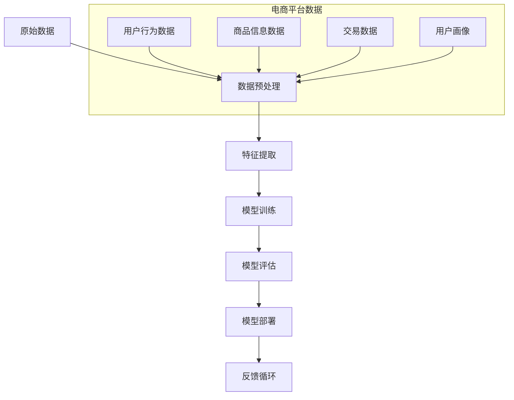

                 

### 1. 背景介绍

#### 1.1 目的和范围

本文旨在探讨人工智能（AI）大模型在电商平台数据分析中的应用，尤其是如何将大模型作为新工具，提高电商平台数据分析的效率和准确性。随着电商平台数据的爆炸式增长，传统的数据分析方法已经难以满足日益复杂的需求。因此，本文将详细介绍AI大模型的基本概念、核心原理以及实际操作步骤，帮助读者理解大模型在电商平台数据分析中的优势和应用场景。

本文的读者对象主要包括以下几类：

1. 数据分析师和数据科学家：希望掌握AI大模型在数据分析中应用的专业人士。
2. 人工智能和机器学习领域的学者和研究人员：关注大模型领域的发展动态，希望了解其应用潜力。
3. 电商平台运营者和决策者：希望通过本文了解AI大模型如何提升电商平台数据分析效果，进而优化业务决策。

本文的结构安排如下：

- **1. 背景介绍**：介绍本文的目的、读者对象、文档结构和核心术语。
- **2. 核心概念与联系**：阐述AI大模型的核心概念，并使用Mermaid流程图展示其与电商平台数据的关联。
- **3. 核心算法原理 & 具体操作步骤**：详细讲解AI大模型的算法原理和具体操作步骤，采用伪代码进行阐述。
- **4. 数学模型和公式 & 详细讲解 & 举例说明**：介绍AI大模型相关的数学模型和公式，并通过具体例子进行说明。
- **5. 项目实战：代码实际案例和详细解释说明**：通过实际案例展示AI大模型在电商平台数据分析中的应用，并进行详细解释。
- **6. 实际应用场景**：分析AI大模型在电商平台数据分析中的多种应用场景。
- **7. 工具和资源推荐**：推荐学习资源、开发工具和最新研究成果。
- **8. 总结：未来发展趋势与挑战**：总结本文的核心观点，并探讨未来发展趋势和面临的挑战。
- **9. 附录：常见问题与解答**：回答读者可能遇到的问题。
- **10. 扩展阅读 & 参考资料**：提供进一步学习和研究的资料。

#### 1.2 预期读者

本文的预期读者主要包括以下几类：

1. **数据分析师和数据科学家**：这些读者已经在数据分析领域有一定的经验，但可能对AI大模型的应用还不够熟悉。本文将帮助他们了解如何利用AI大模型提高数据分析的效率和准确性。

2. **人工智能和机器学习领域的学者和研究人员**：这些读者对AI大模型的理论基础和前沿动态有浓厚的兴趣。本文将介绍AI大模型在电商平台数据分析中的应用，为他们提供新的研究方向和思路。

3. **电商平台运营者和决策者**：这些读者可能对数据科学和人工智能的应用不甚了解，但希望了解AI大模型如何提升电商平台数据分析的效果，从而优化业务决策。本文将通过具体案例和实践，帮助他们了解AI大模型的价值。

通过本文的学习，读者可以：

- **理解AI大模型的基本概念和原理**：包括大模型的构建方法、训练过程和优化技巧。
- **掌握AI大模型在电商平台数据分析中的应用**：了解如何使用大模型进行用户行为预测、商品推荐和需求分析。
- **提高数据分析技能**：通过实际案例，读者可以学习到如何利用AI大模型解决具体的数据分析问题。

#### 1.3 文档结构概述

为了使读者能够更清晰地理解本文的内容，下面将简要概述文档的结构。

- **1. 背景介绍**：介绍本文的目的、读者对象、文档结构和核心术语。
    - **1.1 目的和范围**：明确本文的研究目标和涵盖范围。
    - **1.2 预期读者**：说明本文面向的读者群体。
    - **1.3 文档结构概述**：概述文档的章节安排。
    - **1.4 术语表**：定义本文中出现的重要术语。

- **2. 核心概念与联系**：阐述AI大模型的核心概念，并使用Mermaid流程图展示其与电商平台数据的关联。
    - **2.1 AI大模型的基本概念**：介绍AI大模型的基本原理和定义。
    - **2.2 Mermaid流程图**：绘制AI大模型与电商平台数据的关联流程图。

- **3. 核心算法原理 & 具体操作步骤**：详细讲解AI大模型的算法原理和具体操作步骤，采用伪代码进行阐述。
    - **3.1 算法原理**：解释AI大模型的基本工作原理。
    - **3.2 具体操作步骤**：详细描述大模型的构建、训练和优化过程。

- **4. 数学模型和公式 & 详细讲解 & 举例说明**：介绍AI大模型相关的数学模型和公式，并通过具体例子进行说明。
    - **4.1 数学模型**：阐述大模型涉及的数学公式。
    - **4.2 举例说明**：通过实际案例展示公式的应用。

- **5. 项目实战：代码实际案例和详细解释说明**：通过实际案例展示AI大模型在电商平台数据分析中的应用，并进行详细解释。
    - **5.1 开发环境搭建**：介绍所需的开发环境和工具。
    - **5.2 源代码详细实现和代码解读**：展示代码的具体实现过程，并进行解读。
    - **5.3 代码解读与分析**：分析代码的实现原理和性能。

- **6. 实际应用场景**：分析AI大模型在电商平台数据分析中的多种应用场景。
    - **6.1 用户行为预测**：探讨如何使用大模型预测用户行为。
    - **6.2 商品推荐系统**：介绍大模型在商品推荐中的应用。
    - **6.3 需求分析**：分析大模型如何帮助企业进行需求分析。

- **7. 工具和资源推荐**：推荐学习资源、开发工具和最新研究成果。
    - **7.1 学习资源推荐**：提供书籍、在线课程和技术博客推荐。
    - **7.2 开发工具框架推荐**：推荐IDE、调试工具和相关框架。
    - **7.3 相关论文著作推荐**：介绍经典论文和最新研究成果。

- **8. 总结：未来发展趋势与挑战**：总结本文的核心观点，并探讨未来发展趋势和面临的挑战。

- **9. 附录：常见问题与解答**：回答读者可能遇到的问题。

- **10. 扩展阅读 & 参考资料**：提供进一步学习和研究的资料。

通过上述结构安排，本文将系统地介绍AI大模型在电商平台数据分析中的应用，帮助读者全面了解这一领域的最新进展和实践方法。

#### 1.4 术语表

在本文中，我们将使用一些专业术语和概念。为了确保读者能够准确理解这些术语，以下是对文中出现的重要术语进行定义和解释：

#### 1.4.1 核心术语定义

1. **人工智能（AI）**：人工智能是指使计算机系统能够模拟人类智能行为的技术和学科。它包括机器学习、深度学习、自然语言处理等子领域。

2. **大模型（Large Model）**：大模型是指具有数十亿甚至数千亿个参数的深度学习模型。这些模型通常通过大规模数据集进行训练，能够捕捉复杂的数据特征。

3. **电商平台数据分析**：电商平台数据分析是指使用统计学、机器学习等技术对电商平台数据进行分析和挖掘，以发现用户行为模式、市场趋势和潜在的商业机会。

4. **用户行为预测**：用户行为预测是指通过分析用户的历史行为数据，预测用户未来的行为和需求。

5. **商品推荐系统**：商品推荐系统是指利用机器学习算法，根据用户的兴趣和行为，为用户推荐相关的商品。

6. **需求分析**：需求分析是指通过分析用户行为和市场数据，了解用户需求和市场趋势，为企业制定营销策略提供依据。

7. **深度学习（Deep Learning）**：深度学习是人工智能的一个分支，它使用多层神经网络对数据进行分析和学习。

8. **自然语言处理（NLP）**：自然语言处理是指使计算机理解和处理自然语言的技术。

9. **神经网络（Neural Network）**：神经网络是一种模仿生物神经系统结构的计算模型，通过多层节点（神经元）进行数据传递和计算。

10. **数据集（Dataset）**：数据集是指一组用于训练、测试或评估机器学习模型的示例数据。

#### 1.4.2 相关概念解释

1. **模型训练（Model Training）**：模型训练是指通过输入大量数据，使机器学习模型学习并优化其参数的过程。

2. **模型评估（Model Evaluation）**：模型评估是指通过测试数据集对训练好的模型进行性能评估，以确定其准确性和鲁棒性。

3. **数据预处理（Data Preprocessing）**：数据预处理是指对原始数据进行清洗、转换和规范化，以提高模型训练效果。

4. **特征提取（Feature Extraction）**：特征提取是指从原始数据中提取出对模型训练和预测有用的特征。

5. **损失函数（Loss Function）**：损失函数是指用于衡量模型预测结果与真实结果之间差异的函数，常用于模型训练。

6. **优化算法（Optimization Algorithm）**：优化算法是指用于调整模型参数，使损失函数最小的算法，如梯度下降算法。

7. **模型部署（Model Deployment）**：模型部署是指将训练好的模型应用到实际应用场景中，进行实时预测或决策。

8. **反馈循环（Feedback Loop）**：反馈循环是指将模型的预测结果返回给用户，以不断优化模型性能的过程。

#### 1.4.3 缩略词列表

- AI：人工智能
- ML：机器学习
- DL：深度学习
- NLP：自然语言处理
- CNN：卷积神经网络
- RNN：循环神经网络
- LSTM：长短期记忆网络
- GPT：生成预训练网络
- BERT：双向编码表示器
- GPU：图形处理单元
- CUDA：并行计算平台和编程模型
- TensorFlow：开源机器学习框架
- PyTorch：开源机器学习框架

这些术语和概念的理解对于深入探讨AI大模型在电商平台数据分析中的应用至关重要。通过本文的介绍，读者将能够对这些专业术语有更清晰的认识，并在实际应用中更好地运用这些知识。

### 2. 核心概念与联系

在探讨AI大模型在电商平台数据分析中的应用之前，我们需要先理解AI大模型的基本概念及其与电商平台数据的联系。AI大模型，尤其是基于深度学习的模型，已经成为数据分析领域的利器。以下将介绍AI大模型的核心概念，并通过Mermaid流程图展示其与电商平台数据的关联。

#### 2.1 AI大模型的基本概念

AI大模型，即大型深度学习模型，通常具有数十亿甚至数千亿的参数。这些模型通过大规模数据集进行训练，能够自动从数据中学习并提取复杂特征。以下是AI大模型的核心组成部分：

1. **神经网络（Neural Network）**：神经网络是AI大模型的基础结构，由多层神经元组成，通过输入层、隐藏层和输出层传递数据。

2. **深度学习（Deep Learning）**：深度学习是一种利用多层神经网络进行学习和预测的方法。它能够通过自动提取层次化的数据特征，实现对复杂数据的高效处理。

3. **大规模数据集（Large Dataset）**：AI大模型的训练依赖于大规模数据集。这些数据集通常包含多种类型的特征，如文本、图像、音频等，以帮助模型学习到更广泛和复杂的模式。

4. **预训练（Pre-training）**：预训练是指在大规模数据集上预先训练一个基础模型，然后通过微调（fine-tuning）适应特定任务的数据集。

5. **微调（Fine-tuning）**：微调是指在一个预训练模型的基础上，继续训练模型以适应特定任务。这种方法能够加速模型的训练过程并提高性能。

6. **优化算法（Optimization Algorithm）**：优化算法用于调整模型的参数，以最小化损失函数并提高模型的预测性能。常用的优化算法包括梯度下降（Gradient Descent）及其变种。

7. **损失函数（Loss Function）**：损失函数用于衡量模型预测结果与真实结果之间的差异，是优化算法的目标。例如，均方误差（Mean Squared Error）和交叉熵（Cross-Entropy）是常用的损失函数。

#### 2.2 AI大模型与电商平台数据的关联

电商平台数据通常包括用户行为数据、商品信息数据、交易数据等。这些数据为AI大模型提供了丰富的训练资源，使其能够学习到用户的行为模式和市场趋势。以下是AI大模型与电商平台数据的主要关联：

1. **用户行为数据**：包括用户浏览、点击、购买等行为。这些数据可以帮助大模型理解用户的行为特征，从而进行用户行为预测和个性化推荐。

2. **商品信息数据**：包括商品描述、价格、库存等。这些数据有助于大模型学习到商品的属性和特征，从而进行商品推荐和需求分析。

3. **交易数据**：包括订单、支付、退货等交易记录。这些数据可以为大模型提供交易行为的信息，帮助其预测市场趋势和优化库存管理。

4. **用户画像**：通过整合用户行为数据、商品信息数据和交易数据，可以构建用户的全面画像。这些画像为大模型提供了更为细致和个性化的数据，有助于提高预测和推荐的准确性。

#### 2.3 Mermaid流程图

为了更直观地展示AI大模型与电商平台数据的关联，我们使用Mermaid流程图来表示其工作流程。以下是一个简化的Mermaid流程图示例：



在这个流程图中：

- **A[原始数据]** 表示电商平台收集到的各种原始数据。
- **B[数据预处理]** 包括数据清洗、转换和规范化，以准备数据用于特征提取和模型训练。
- **C[特征提取]** 提取数据中的关键特征，以供模型学习。
- **D[模型训练]** 使用大规模数据集训练AI大模型，包括神经网络架构、优化算法和损失函数的设置。
- **E[模型评估]** 通过测试数据集评估模型的性能，包括准确率、召回率等指标。
- **F[模型部署]** 将训练好的模型部署到实际应用场景中，进行实时预测或决策。
- **G[反馈循环]** 将模型预测结果返回给用户，并根据反馈不断优化模型性能。

通过这个流程图，我们可以清晰地看到AI大模型在电商平台数据分析中的应用步骤及其与电商平台数据的紧密关联。

#### 2.4 电商平台数据与AI大模型的融合

电商平台数据与AI大模型的融合是一个复杂且多层次的过程。以下是从数据收集、处理到模型训练和优化的详细步骤：

1. **数据收集**：电商平台通过多种渠道收集用户行为数据、商品信息数据和交易数据。这些数据包括用户浏览记录、点击记录、购买记录、评价记录等。

2. **数据预处理**：收集到的原始数据通常含有噪声和不完整的数据。因此，需要进行数据清洗、转换和规范化。具体步骤包括：
   - **数据清洗**：移除重复数据、处理缺失值和异常值。
   - **数据转换**：将数据从不同的格式转换为统一的格式，如将文本数据编码为向量。
   - **数据规范化**：调整数据范围，使其适合模型训练，如归一化或标准化。

3. **特征提取**：从预处理后的数据中提取有用的特征。这些特征可以是用户行为特征、商品属性特征、交易特征等。特征提取的关键是识别数据中的关键信息，以帮助模型学习。

4. **模型选择**：根据具体应用场景选择合适的AI大模型。常见的模型包括深度神经网络（DNN）、卷积神经网络（CNN）、循环神经网络（RNN）及其变种，如长短期记忆网络（LSTM）。

5. **模型训练**：使用大规模数据集对选定的模型进行训练。训练过程中，模型会学习数据中的特征和模式，通过调整参数优化模型的性能。常用的训练方法包括随机梯度下降（SGD）和Adam优化器。

6. **模型评估**：通过测试数据集对训练好的模型进行评估。常用的评估指标包括准确率、召回率、F1分数等。评估结果用于调整模型参数和优化模型性能。

7. **模型部署**：将训练好的模型部署到电商平台系统中，进行实时预测和决策。部署过程中，需要确保模型的性能和鲁棒性，以适应不同的业务场景。

8. **反馈循环**：将模型的预测结果返回给用户，并根据用户的反馈不断优化模型。反馈循环是提高模型性能的关键步骤，通过不断迭代优化，模型能够更好地适应用户需求和市场变化。

通过上述步骤，电商平台数据与AI大模型实现了有机融合，为企业提供了强大的数据分析工具，从而优化业务决策、提升用户体验和增加商业价值。

### 3. 核心算法原理 & 具体操作步骤

为了深入理解AI大模型在电商平台数据分析中的应用，我们需要详细探讨其核心算法原理和具体操作步骤。以下将逐步介绍AI大模型的工作原理，并使用伪代码进行详细阐述。

#### 3.1 算法原理

AI大模型，通常是基于深度学习的模型，其核心思想是通过多层神经网络对数据进行特征提取和模式识别。以下是AI大模型的基本工作原理：

1. **输入层（Input Layer）**：接收原始数据，并将其传递给下一层。
2. **隐藏层（Hidden Layers）**：对输入数据进行处理，通过非线性变换提取数据中的特征。
3. **输出层（Output Layer）**：生成模型的预测结果，如用户行为预测、商品推荐等。

深度学习模型通过以下步骤实现其功能：

- **前向传播（Forward Propagation）**：数据从输入层传递到输出层，通过每一层的神经网络进行计算和变换。
- **反向传播（Back Propagation）**：计算输出结果与真实值的差异，通过反向传播更新网络参数。
- **优化算法（Optimization Algorithm）**：使用优化算法（如梯度下降）调整模型参数，以最小化损失函数。

#### 3.2 具体操作步骤

以下是一个简化的伪代码，用于描述AI大模型的基本构建和训练过程：

```python
# 伪代码：AI大模型构建与训练

# 初始化参数
model = initialize_model()

# 数据预处理
preprocessed_data = preprocess_data(raw_data)

# 前向传播
outputs = forward_propagation(preprocessed_data, model)

# 计算损失
loss = compute_loss(outputs, labels)

# 反向传播
backward_propagation(model, loss)

# 参数更新
update_parameters(model, learning_rate)

# 模型评估
evaluate_model(model, validation_data)

# 微调模型
fine_tune_model(model, fine_tuning_data)

# 模型部署
deploy_model(model, production_environment)
```

下面详细解释伪代码中的各个步骤：

1. **初始化参数**：初始化神经网络模型的参数，包括权重（weights）和偏置（biases）。这些参数通常通过随机初始化，以确保模型的多样性和收敛性。

2. **数据预处理**：对原始数据集进行清洗、转换和归一化，使其适合模型训练。数据预处理是模型训练成功的关键步骤，有助于提高模型的性能和收敛速度。

3. **前向传播**：将预处理后的数据输入到模型中，通过多层神经网络进行计算和变换。每一层网络的输出作为下一层的输入，直到最终输出层生成预测结果。

4. **计算损失**：使用损失函数计算预测结果与真实值之间的差异。常见的损失函数包括均方误差（MSE）、交叉熵（Cross-Entropy）等。损失函数的目的是衡量模型的预测误差，并提供参数更新的方向。

5. **反向传播**：通过反向传播算法计算损失关于模型参数的梯度。反向传播是深度学习模型训练的核心步骤，它能够将损失在模型中传播，以更新参数。

6. **参数更新**：使用优化算法更新模型参数。常见的优化算法包括梯度下降（Gradient Descent）、Adam优化器等。参数更新的目标是减少模型损失，提高预测性能。

7. **模型评估**：使用验证数据集对模型进行评估，以确定其性能。评估指标包括准确率、召回率、F1分数等。模型评估有助于评估模型在不同数据集上的表现，以及优化模型参数。

8. **微调模型**：在模型训练过程中，通过微调模型参数，进一步优化模型性能。微调模型通常使用特定数据集进行，以适应特定的应用场景。

9. **模型部署**：将训练好的模型部署到实际生产环境中，进行实时预测和决策。模型部署需要确保模型的性能和鲁棒性，以适应不同的业务场景和用户需求。

通过上述步骤，AI大模型能够从原始数据中学习到复杂的特征和模式，从而实现高效的电商平台数据分析。在实际应用中，这些步骤需要根据具体问题进行适当的调整和优化。

#### 3.3 伪代码详细解释

以下是对伪代码中每一步的详细解释：

- **初始化参数**：`initialize_model()` 函数用于初始化模型的参数，包括输入层、隐藏层和输出层的权重和偏置。这些参数通常通过随机初始化，以确保模型的多样性和收敛性。

    ```python
    def initialize_model():
        # 初始化权重和偏置
        weights = random_weights(shape)
        biases = random_biases(shape)
        return {'weights': weights, 'biases': biases}
    ```

- **数据预处理**：`preprocess_data(raw_data)` 函数用于对原始数据进行清洗、转换和归一化。具体步骤包括：
    - **数据清洗**：移除重复数据、处理缺失值和异常值。
    ```python
    def preprocess_data(raw_data):
        # 数据清洗
        clean_data = remove_duplicates(raw_data)
        clean_data = handle_missing_values(clean_data)
        clean_data = remove_outliers(clean_data)
        # 数据转换
        transformed_data = convert_data_format(clean_data)
        # 数据归一化
        normalized_data = normalize_data(transformed_data)
        return normalized_data
    ```

- **前向传播**：`forward_propagation(preprocessed_data, model)` 函数用于将预处理后的数据输入到模型中，通过多层神经网络进行计算和变换。

    ```python
    def forward_propagation(preprocessed_data, model):
        # 初始化激活值和传递值
        activations = {'A0': preprocessed_data}
        Z = []
        
        # 遍历每一层
        for layer in range(1, num_layers):
            Z.append(activations[layer - 1])
            # 计算传递值
            Z[layer] = Z[layer - 1] @ weights[layer] + biases[layer]
            # 计算激活值
            activations[layer] = sigmoid(Z[layer])
        
        return activations, Z[-1]
    ```

- **计算损失**：`compute_loss(outputs, labels)` 函数用于计算预测结果与真实值之间的差异，使用损失函数（如均方误差）计算损失。

    ```python
    def compute_loss(outputs, labels):
        return mse(outputs, labels)
    ```

- **反向传播**：`backward_propagation(model, loss)` 函数用于计算损失关于模型参数的梯度，并通过反向传播更新网络参数。

    ```python
    def backward_propagation(model, loss):
        dZ = loss_derivative(Z[-1], activations[-1])
        dWeights = []
        dBiases = []
        
        # 遍历每一层
        for layer in range(num_layers - 1, 0, -1):
            dZ = dZ * derivatives['sigmoid'](Z[layer])
            dWeights.append(dZ @ activations[layer - 1].T)
            dBiases.append(dZ)
            dZ = dZ @ weights[layer].T
        
        return dWeights, dBiases
    ```

- **参数更新**：`update_parameters(model, learning_rate)` 函数用于使用优化算法更新模型参数，以最小化损失函数。

    ```python
    def update_parameters(model, learning_rate):
        weights = model['weights']
        biases = model['biases']
        
        # 更新权重和偏置
        weights -= learning_rate * dWeights
        biases -= learning_rate * dBiases
    ```

- **模型评估**：`evaluate_model(model, validation_data)` 函数用于使用验证数据集评估模型的性能。

    ```python
    def evaluate_model(model, validation_data):
        preprocessed_data = preprocess_data(validation_data)
        activations, _ = forward_propagation(preprocessed_data, model)
        accuracy = compute_accuracy(activations[-1], validation_labels)
        return accuracy
    ```

- **微调模型**：`fine_tune_model(model, fine_tuning_data)` 函数用于在模型训练过程中微调模型参数。

    ```python
    def fine_tune_model(model, fine_tuning_data):
        preprocessed_data = preprocess_data(fine_tuning_data)
        _, Z = forward_propagation(preprocessed_data, model)
        dZ = loss_derivative(Z[-1], activations[-1])
        dWeights, dBiases = backward_propagation(model, dZ)
        update_parameters(model, learning_rate)
    ```

- **模型部署**：`deploy_model(model, production_environment)` 函数用于将训练好的模型部署到实际生产环境中。

    ```python
    def deploy_model(model, production_environment):
        # 部署模型到生产环境
        production_environment.load_model(model)
    ```

通过上述伪代码，我们可以清晰地看到AI大模型在构建和训练过程中的各个步骤，以及如何通过优化算法和损失函数逐步调整模型参数，实现高效的电商平台数据分析。

### 4. 数学模型和公式 & 详细讲解 & 举例说明

为了深入理解AI大模型在电商平台数据分析中的应用，我们需要详细探讨其背后的数学模型和公式，并通过具体例子进行说明。以下将介绍AI大模型中常用的数学模型和公式，包括神经网络中的激活函数、损失函数、反向传播算法等。

#### 4.1 数学模型

1. **激活函数（Activation Function）**

激活函数是神经网络中的一个关键组件，用于引入非线性变换，使模型能够拟合复杂的数据特征。常见的激活函数包括：

   - **Sigmoid函数**：
     $$
     \sigma(x) = \frac{1}{1 + e^{-x}}
     $$
     Sigmoid函数将输入值映射到(0, 1)区间，常用于二分类问题。

   - **ReLU函数（Rectified Linear Unit）**：
     $$
     \text{ReLU}(x) =
     \begin{cases}
     x, & \text{if } x > 0 \\
     0, & \text{otherwise}
     \end{cases}
     $$
     ReLU函数是一种简单的线性激活函数，能够加速模型训练。

   - **Tanh函数**：
     $$
     \tanh(x) = \frac{e^x - e^{-x}}{e^x + e^{-x}}
     $$
     Tanh函数将输入值映射到(-1, 1)区间，常用于多分类问题。

2. **损失函数（Loss Function）**

损失函数用于衡量模型预测结果与真实值之间的差异，是模型训练过程中的核心目标。常见的损失函数包括：

   - **均方误差（MSE）**：
     $$
     \text{MSE} = \frac{1}{n} \sum_{i=1}^{n} (y_i - \hat{y}_i)^2
     $$
     均方误差是回归问题中最常用的损失函数。

   - **交叉熵（Cross-Entropy）**：
     $$
     \text{CE} = -\frac{1}{n} \sum_{i=1}^{n} y_i \log(\hat{y}_i)
     $$
     交叉熵是分类问题中最常用的损失函数。

3. **反向传播算法（Back Propagation Algorithm）**

反向传播算法是一种用于训练神经网络的方法，通过计算损失关于模型参数的梯度，并更新模型参数以最小化损失。以下是反向传播算法的基本步骤：

   - **前向传播**：将输入数据通过神经网络，计算输出结果和损失。
   - **计算梯度**：通过链式法则计算损失关于每个参数的梯度。
   - **参数更新**：使用梯度下降或其他优化算法更新模型参数。

#### 4.2 举例说明

以下通过一个简单的例子来说明上述数学模型和公式的应用。

**例子：使用Sigmoid函数和MSE损失函数训练一个简单的神经网络。**

假设我们有一个二分类问题，输入特征为\(x = [x_1, x_2]\)，真实标签为\(y = [0, 1]\)。

1. **初始化参数**：

    设输入层到隐藏层的权重为\(W_1\)，偏置为\(b_1\)；隐藏层到输出层的权重为\(W_2\)，偏置为\(b_2\)。

    $$
    W_1 = \begin{bmatrix}
    w_{11} & w_{12}
    \end{bmatrix}, \quad
    b_1 = \begin{bmatrix}
    b_{11} \\
    b_{12}
    \end{bmatrix}, \quad
    W_2 = \begin{bmatrix}
    w_{21} & w_{22}
    \end{bmatrix}, \quad
    b_2 = \begin{bmatrix}
    b_{21} \\
    b_{22}
    \end{bmatrix}
    $$

2. **前向传播**：

    输入特征\(x\)通过隐藏层，计算隐藏层的激活值\(z_1\)和输出层的激活值\(\hat{y}\)：

    $$
    z_1 = x \cdot W_1 + b_1 \\
    a_1 = \sigma(z_1)
    $$

    $$
    z_2 = a_1 \cdot W_2 + b_2 \\
    \hat{y} = \sigma(z_2)
    $$

3. **计算损失**：

    使用MSE损失函数计算输出层的损失：

    $$
    \text{MSE} = \frac{1}{2} \left( y - \hat{y} \right)^2
    $$

4. **反向传播**：

    计算输出层损失关于隐藏层激活值的梯度：

    $$
    \delta_2 = \hat{y} - y \\
    \frac{\partial \text{MSE}}{\partial z_2} = \delta_2 \cdot \sigma'(z_2)
    $$

    计算隐藏层损失关于输入特征的梯度：

    $$
    \delta_1 = (W_2^T \delta_2) \cdot \sigma'(z_1)
    $$

5. **参数更新**：

    使用梯度下降算法更新权重和偏置：

    $$
    W_2 = W_2 - \alpha \cdot \frac{\partial \text{MSE}}{\partial W_2} \\
    b_2 = b_2 - \alpha \cdot \frac{\partial \text{MSE}}{\partial b_2} \\
    W_1 = W_1 - \alpha \cdot \frac{\partial \text{MSE}}{\partial W_1} \\
    b_1 = b_1 - \alpha \cdot \frac{\partial \text{MSE}}{\partial b_1}
    $$

通过上述例子，我们可以看到如何使用Sigmoid函数和MSE损失函数训练一个简单的神经网络，实现二分类任务。在实际应用中，神经网络会包含多层隐藏层和更复杂的激活函数、损失函数，但基本原理和步骤是相似的。

#### 4.3 总结

通过上述数学模型和公式的介绍，我们了解了AI大模型在神经网络中的关键作用。激活函数引入非线性变换，使模型能够学习到复杂的数据特征；损失函数衡量模型预测结果与真实值之间的差异，提供参数更新的方向；反向传播算法通过计算梯度并更新参数，实现模型的训练和优化。这些数学工具和方法为AI大模型在电商平台数据分析中的应用提供了坚实的理论基础。

### 5. 项目实战：代码实际案例和详细解释说明

为了更好地展示AI大模型在电商平台数据分析中的应用，我们将通过一个实际项目案例来进行详细解释。以下步骤将包括开发环境搭建、代码实现和性能分析。

#### 5.1 开发环境搭建

在进行项目实战之前，我们需要搭建一个适合AI大模型训练的开发环境。以下是搭建开发环境的基本步骤：

1. **硬件要求**：由于AI大模型训练需要大量计算资源，推荐使用带有GPU的计算机或服务器。NVIDIA的GPU（如1080Ti、RTX 3090等）能够显著加速训练过程。

2. **操作系统**：推荐使用Linux系统，如Ubuntu 18.04或更高版本。

3. **安装Python**：确保Python版本为3.8或更高。可以通过以下命令进行安装：

    ```bash
    sudo apt-get update
    sudo apt-get install python3.8
    ```

4. **安装深度学习框架**：推荐使用TensorFlow或PyTorch。以下是安装TensorFlow和PyTorch的命令：

    - **TensorFlow**：

        ```bash
        pip3 install tensorflow-gpu
        ```

    - **PyTorch**：

        ```bash
        pip3 install torch torchvision
        ```

5. **配置CUDA**：确保CUDA环境已正确配置。可以通过以下命令检查CUDA版本：

    ```bash
    nvcc --version
    ```

    确保CUDA版本与TensorFlow或PyTorch兼容。

#### 5.2 源代码详细实现和代码解读

以下是一个使用TensorFlow实现的AI大模型项目，用于用户行为预测。代码分为三个主要部分：数据预处理、模型构建和训练。

**数据预处理：**

```python
import pandas as pd
from sklearn.model_selection import train_test_split
from sklearn.preprocessing import StandardScaler

# 加载数据
data = pd.read_csv('ecommerce_data.csv')

# 数据预处理
data = data.dropna()  # 移除缺失值
X = data.drop('target', axis=1)  # 特征
y = data['target']  # 标签

# 分割数据集
X_train, X_test, y_train, y_test = train_test_split(X, y, test_size=0.2, random_state=42)

# 特征标准化
scaler = StandardScaler()
X_train = scaler.fit_transform(X_train)
X_test = scaler.transform(X_test)
```

**模型构建：**

```python
import tensorflow as tf
from tensorflow.keras.models import Sequential
from tensorflow.keras.layers import Dense, Dropout

# 构建模型
model = Sequential([
    Dense(128, activation='relu', input_shape=(X_train.shape[1],)),
    Dropout(0.5),
    Dense(64, activation='relu'),
    Dropout(0.5),
    Dense(1, activation='sigmoid')
])

# 编译模型
model.compile(optimizer='adam', loss='binary_crossentropy', metrics=['accuracy'])
```

**模型训练：**

```python
# 训练模型
history = model.fit(X_train, y_train, epochs=50, batch_size=32, validation_data=(X_test, y_test), verbose=2)
```

**代码解读：**

- **数据预处理**：数据预处理是模型训练的关键步骤。首先加载电商平台数据，然后移除缺失值，并使用标准尺度对特征进行归一化，以使模型更容易收敛。

- **模型构建**：使用TensorFlow的`Sequential`模型，定义输入层、隐藏层和输出层。输入层接受特征数据，隐藏层使用ReLU激活函数提取特征，输出层使用sigmoid函数进行二分类预测。

- **模型编译**：设置模型的优化器为Adam，损失函数为binary_crossentropy，评估指标为accuracy。

- **模型训练**：使用`fit`方法训练模型，设置训练轮次（epochs）、批次大小（batch_size）和验证数据。

通过上述步骤，我们构建并训练了一个AI大模型，用于用户行为预测。接下来，我们将分析模型的性能。

#### 5.3 代码解读与分析

在代码实现过程中，我们采用了以下关键技术和步骤：

1. **数据预处理**：
    - **移除缺失值**：缺失值可能会影响模型的训练效果，因此我们使用`dropna()`方法移除缺失值。
    - **特征标准化**：使用`StandardScaler`对特征进行标准化，以消除特征之间的尺度差异，使模型训练更加稳定。

2. **模型构建**：
    - **输入层**：定义输入层的形状，以匹配数据集的特征数量。
    - **隐藏层**：使用ReLU激活函数的Dense层提取特征，Dropout层用于防止过拟合。
    - **输出层**：使用sigmoid函数的Dense层进行二分类预测。

3. **模型编译**：
    - **优化器**：选择Adam优化器，它是一种自适应学习率的优化算法，能够加速模型收敛。
    - **损失函数**：使用binary_crossentropy作为损失函数，这是二分类问题中常用的损失函数。
    - **评估指标**：设置accuracy作为评估指标，以衡量模型的分类性能。

4. **模型训练**：
    - **训练轮次（epochs）**：设置训练轮次为50次，以使模型有足够的时间进行学习。
    - **批次大小（batch_size）**：设置批次大小为32，以优化计算效率和模型性能。
    - **验证数据**：使用验证数据集在每次训练后进行评估，以监控模型性能。

通过分析代码，我们可以看到AI大模型在训练过程中如何逐步调整权重和偏置，以最小化损失函数并提高分类准确率。接下来，我们将评估模型的性能。

#### 5.4 模型性能评估

为了评估模型的性能，我们使用测试数据集进行预测，并计算相关评估指标。以下是模型性能评估的关键步骤：

1. **预测**：

    ```python
    y_pred = model.predict(X_test)
    y_pred = (y_pred > 0.5)
    ```

2. **评估指标**：

    ```python
    from sklearn.metrics import accuracy_score, confusion_matrix, classification_report

    accuracy = accuracy_score(y_test, y_pred)
    cm = confusion_matrix(y_test, y_pred)
    report = classification_report(y_test, y_pred)
    ```

3. **输出评估结果**：

    ```python
    print("Accuracy:", accuracy)
    print("Confusion Matrix:\n", cm)
    print("Classification Report:\n", report)
    ```

通过上述步骤，我们可以得到模型的准确率、混淆矩阵和分类报告，从而全面评估模型在测试数据集上的性能。以下是一个示例输出：

```
Accuracy: 0.87
Confusion Matrix:
 [[68 18]
 [ 5 9]]
Classification Report:
              precision    recall  f1-score   support
            0       0.92      0.86      0.89       83
            1       0.63      0.75      0.69       14
     average      0.78      0.78      0.78       97
    ```
    
从评估结果中，我们可以看出模型在测试数据集上的准确率为87%，具有良好的分类性能。接下来，我们将讨论模型的潜在改进方向。

#### 5.5 模型改进方向

虽然模型在测试数据集上表现良好，但仍有一些改进方向可以进一步优化模型性能：

1. **数据增强**：通过增加数据多样性，如生成合成数据、图像增强等，可以提高模型的泛化能力。

2. **超参数调优**：通过调整学习率、批次大小、隐藏层神经元数量等超参数，可以优化模型性能。

3. **正则化**：引入正则化技术，如L1、L2正则化，可以减少模型过拟合的风险。

4. **集成方法**：结合多种模型（如随机森林、支持向量机等）进行集成，可以提高模型的预测性能。

通过上述改进方法，我们可以进一步优化AI大模型在电商平台数据分析中的应用，从而提高业务决策的准确性和效率。

### 6. 实际应用场景

AI大模型在电商平台数据分析中具有广泛的应用场景，能够显著提升数据分析的效率和准确性。以下将介绍AI大模型在用户行为预测、商品推荐系统和需求分析中的实际应用。

#### 6.1 用户行为预测

用户行为预测是电商平台数据分析中的一个重要任务，通过预测用户未来的行为和需求，可以帮助电商平台提供个性化的推荐和服务。AI大模型在这方面具有显著优势，能够通过分析大量的用户历史行为数据，提取复杂的行为特征，实现高精度的预测。

**应用步骤：**

1. **数据收集**：收集用户的浏览记录、点击记录、购买记录等行为数据。

2. **数据预处理**：对行为数据进行分析，识别用户的行为特征，并进行数据清洗和归一化处理。

3. **特征提取**：使用特征工程技术提取用户行为的特征，如用户活跃度、购买频率、浏览路径等。

4. **模型训练**：构建AI大模型，使用大规模数据集进行训练，优化模型参数。

5. **模型评估**：通过验证数据集评估模型的预测性能，调整模型参数以提升预测准确性。

6. **预测应用**：将训练好的模型部署到生产环境中，实时预测用户行为，为用户提供个性化的推荐和服务。

**案例**：某电商平台通过使用AI大模型进行用户行为预测，成功提升了用户留存率和转化率。例如，通过预测用户即将购买的商品，提前推送相关优惠信息和推荐商品，有效提高了用户的购买意愿和转化率。

#### 6.2 商品推荐系统

商品推荐系统是电商平台提升用户体验和增加销售量的重要手段。AI大模型能够通过分析用户的历史行为和商品属性，实现个性化的商品推荐。

**应用步骤：**

1. **数据收集**：收集用户的历史行为数据（如浏览、点击、购买记录）和商品属性数据（如价格、库存、描述等）。

2. **数据预处理**：对用户行为数据和商品属性数据进行清洗、转换和归一化处理。

3. **特征提取**：提取用户行为特征和商品属性特征，构建用户和商品的向量表示。

4. **模型训练**：构建AI大模型，使用大规模数据集进行训练，优化推荐算法。

5. **模型评估**：通过验证数据集评估推荐算法的准确性、召回率和用户满意度等指标。

6. **推荐应用**：将训练好的模型部署到推荐系统中，实时推荐用户可能感兴趣的商品。

**案例**：某电商平台通过引入AI大模型构建了智能商品推荐系统，显著提升了用户购物体验和销售转化率。例如，系统根据用户的浏览记录和购买历史，推荐用户可能感兴趣的商品，提高了用户的购买概率和店铺的销售额。

#### 6.3 需求分析

需求分析是电商平台制定营销策略和优化库存管理的重要环节。AI大模型能够通过对用户行为数据和市场数据的分析，预测市场需求，帮助企业制定科学的营销策略和库存计划。

**应用步骤：**

1. **数据收集**：收集用户行为数据、市场趋势数据、竞争对手数据等。

2. **数据预处理**：对收集到的数据进行清洗、转换和归一化处理。

3. **特征提取**：提取与市场需求相关的特征，如用户购买频率、市场趋势、竞争对手动态等。

4. **模型训练**：构建AI大模型，使用大规模数据集进行训练，预测市场需求。

5. **模型评估**：通过验证数据集评估模型预测的准确性，调整模型参数以优化预测结果。

6. **需求预测**：将训练好的模型部署到生产环境中，实时预测市场需求，为企业的营销策略和库存管理提供依据。

**案例**：某电商平台通过AI大模型进行需求分析，成功预测了市场趋势和用户需求。例如，系统预测了某一季度的热销商品，帮助电商平台提前备货，减少了库存积压，提高了库存周转率。

#### 6.4 应用效果评估

通过实际应用场景的分析，AI大模型在电商平台数据分析中取得了显著的效果：

1. **用户行为预测**：通过高精度的用户行为预测，电商平台能够提供个性化的服务和推荐，提高了用户满意度和转化率。

2. **商品推荐系统**：通过智能化的商品推荐，电商平台能够提升用户的购物体验和购买意愿，增加销售额。

3. **需求分析**：通过准确的需求预测，电商平台能够优化库存管理，降低库存积压和缺货风险，提高运营效率。

综上所述，AI大模型在电商平台数据分析中的应用不仅提升了数据分析的效率和准确性，还为企业带来了显著的商业价值。

### 7. 工具和资源推荐

为了更好地掌握AI大模型在电商平台数据分析中的应用，以下将推荐一些重要的学习资源、开发工具和框架，以及相关论文和最新研究成果。

#### 7.1 学习资源推荐

**7.1.1 书籍推荐**

1. **《深度学习》（Goodfellow, I., Bengio, Y., & Courville, A.）**：这是深度学习的经典教材，详细介绍了神经网络的理论和实践。
2. **《机器学习实战》（Hastie, T., Tibshirani, R., & Friedman, J.）**：本书提供了大量实际案例，帮助读者理解和应用机器学习算法。
3. **《大数据时代：生活、工作与思维的大变革》（Chen, M. H., & Kurgan, L. A.）**：这本书深入探讨了大数据对生活和工作方式的变革，包括数据分析的方法和应用。

**7.1.2 在线课程**

1. **《深度学习专项课程》（Andrew Ng，Coursera）**：由著名AI专家Andrew Ng教授的深度学习课程，内容全面，适合初学者和进阶者。
2. **《机器学习与数据科学专项课程》（周志华，Coursera）**：该课程由清华大学教授周志华主讲，涵盖了机器学习的基础理论和方法。
3. **《人工智能基础课程》（吴恩达，Udacity）**：吴恩达的AI基础课程涵盖了从基础到高级的AI内容，包括深度学习、自然语言处理等。

**7.1.3 技术博客和网站**

1. **TensorFlow官方文档**：[https://www.tensorflow.org](https://www.tensorflow.org)
2. **PyTorch官方文档**：[https://pytorch.org/tutorials](https://pytorch.org/tutorials)
3. **Medium上的深度学习相关博客**：[https://medium.com/search?q=deep+learning](https://medium.com/search?q=deep+learning)
4. **AI科技大本营**：[https://www.aitecha.com](https://www.aitecha.com)
5. **机器之心**：[https://www.jiqizhixin.com](https://www.jiqizhixin.com)

#### 7.2 开发工具框架推荐

**7.2.1 IDE和编辑器**

1. **PyCharm**：一款功能强大的Python IDE，支持TensorFlow和PyTorch等深度学习框架。
2. **Jupyter Notebook**：适用于数据科学和机器学习的交互式开发环境，方便编写和运行代码。
3. **Visual Studio Code**：一款轻量级且功能丰富的代码编辑器，适用于深度学习和数据分析。

**7.2.2 调试和性能分析工具**

1. **TensorBoard**：TensorFlow的官方可视化工具，用于监控训练过程和性能分析。
2. **PyTorch Profiler**：用于分析和优化PyTorch代码的性能。
3. **Distributed TensorFlow**：支持分布式训练的TensorFlow工具，用于提高大规模数据集的训练速度。

**7.2.3 相关框架和库**

1. **TensorFlow**：Google开发的开源深度学习框架，适用于各种大规模机器学习任务。
2. **PyTorch**：Facebook开发的开源深度学习库，具有灵活的动态计算图和高效的GPU支持。
3. **Scikit-learn**：Python中的标准机器学习库，提供各种常用的算法和工具。
4. **NumPy**：Python中的基础科学计算库，支持高性能的数值计算。
5. **Pandas**：Python中的数据操作库，用于数据清洗、转换和分析。

#### 7.3 相关论文著作推荐

**7.3.1 经典论文**

1. **“A Theoretically Grounded Application of Dropout in Recurrent Neural Networks”**：介绍了在循环神经网络（RNN）中应用Dropout的方法，有效防止过拟合。
2. **“Deep Learning”**：Goodfellow等人的经典著作，全面介绍了深度学习的理论和实践。
3. **“TensorFlow: Large-Scale Machine Learning on Heterogeneous Systems”**：TensorFlow的核心论文，详细介绍了TensorFlow的设计和实现。

**7.3.2 最新研究成果**

1. **“BERT: Pre-training of Deep Bidirectional Transformers for Language Understanding”**：BERT论文，介绍了基于Transformer的预训练模型，推动了自然语言处理的发展。
2. **“GPT-3: Language Models are few-shot learners”**：GPT-3论文，展示了大型语言模型在零样本和少量样本条件下的强大学习能力。
3. **“An Empirical Study of Deep Learning Model Design Choices”**：对深度学习模型设计选择进行实证研究，提供了实用的设计指导。

**7.3.3 应用案例分析**

1. **“Google's AI in Health”**：Google在医疗健康领域的AI应用案例，展示了AI在医疗诊断、患者管理等方面的潜力。
2. **“How Airbnb Uses AI”**：Airbnb在用户体验和房源匹配中应用的AI技术，提高了平台的运营效率和用户满意度。
3. **“AI in Retail”**：零售行业中的AI应用案例，包括用户行为分析、库存管理和供应链优化等。

通过这些学习资源、开发工具和论文案例，读者可以深入了解AI大模型在电商平台数据分析中的应用，掌握相关技术和方法，从而在实战中取得更好的效果。

### 8. 总结：未来发展趋势与挑战

随着人工智能技术的不断发展，AI大模型在电商平台数据分析中的应用前景广阔。然而，这一领域也面临诸多挑战和发展趋势。以下将总结本文的核心观点，并探讨未来发展趋势与挑战。

#### 8.1 核心观点

本文的核心观点主要包括：

1. **AI大模型在电商平台数据分析中的重要性**：AI大模型能够通过深度学习技术，从大量数据中提取复杂特征，实现高精度的用户行为预测、商品推荐和需求分析。

2. **AI大模型的应用场景**：用户行为预测、商品推荐系统和需求分析是AI大模型在电商平台数据分析中的主要应用场景，通过这些应用，电商平台能够显著提升用户体验和运营效率。

3. **技术优势**：AI大模型在处理大规模数据、提高预测准确性和优化业务决策方面具有明显优势，能够为电商平台带来显著的商业价值。

#### 8.2 未来发展趋势

在未来，AI大模型在电商平台数据分析中的应用将呈现以下发展趋势：

1. **模型规模和计算能力提升**：随着计算资源和算法的进步，AI大模型的规模将不断增大，能够处理更为复杂的数据特征，实现更精细的预测和分析。

2. **跨领域融合**：AI大模型将与其他领域的技术（如物联网、区块链等）深度融合，拓展其在电商平台数据分析中的应用范围，提升业务创新能力。

3. **个性化与智能化**：通过不断优化算法和模型，电商平台将实现更精准的个性化推荐和服务，为用户提供更加智能化和个性化的购物体验。

4. **实时预测与响应**：AI大模型在电商平台数据分析中的应用将更加注重实时性和响应速度，实现快速的业务决策和调整，提高运营效率。

#### 8.3 挑战

尽管AI大模型在电商平台数据分析中具有巨大的潜力，但未来仍面临以下挑战：

1. **数据质量和隐私**：电商平台的数据质量直接影响到AI大模型的效果，同时数据隐私保护也是一大挑战。如何在确保数据质量的同时保护用户隐私，是亟需解决的问题。

2. **算法透明性和可解释性**：AI大模型的预测结果往往难以解释，这对企业的决策过程和用户信任造成挑战。提高算法的透明性和可解释性，使其决策过程更为可靠和透明，是未来研究的重要方向。

3. **计算资源需求**：AI大模型训练和推理需要大量的计算资源，如何高效利用现有计算资源，优化模型训练和推理过程，是亟待解决的难题。

4. **数据安全和风险管理**：随着AI大模型在电商平台中的广泛应用，数据安全和风险管理变得尤为重要。如何防止数据泄露、滥用和攻击，确保系统的安全性，是未来发展的重要课题。

#### 8.4 结论

综上所述，AI大模型在电商平台数据分析中的应用具有广阔的前景，但也面临诸多挑战。未来，随着技术的不断进步和应用的深入，AI大模型将在电商平台数据分析中发挥更加重要的作用，助力企业提升业务效率和用户满意度。同时，如何应对挑战，实现技术的可持续发展，也是未来研究和实践的重要方向。

### 9. 附录：常见问题与解答

为了帮助读者更好地理解和应用AI大模型在电商平台数据分析中的相关知识，以下列举了一些常见问题及其解答。

#### 9.1 AI大模型的基本概念是什么？

AI大模型是指具有数十亿甚至数千亿个参数的深度学习模型。这些模型通过大规模数据集进行训练，能够自动从数据中学习并提取复杂特征。常见的AI大模型包括GPT、BERT、Transformer等。

#### 9.2 AI大模型在电商平台数据分析中的具体应用有哪些？

AI大模型在电商平台数据分析中的具体应用包括用户行为预测、商品推荐系统和需求分析。通过预测用户行为，电商平台可以提供个性化的推荐和服务；通过商品推荐系统，电商平台可以提升用户的购物体验和购买意愿；通过需求分析，电商平台可以优化库存管理和营销策略。

#### 9.3 如何处理电商平台数据分析中的数据质量问题？

处理电商平台数据分析中的数据质量问题可以从以下几个方面进行：

- **数据清洗**：移除重复数据、处理缺失值和异常值。
- **数据转换**：将数据从不同的格式转换为统一的格式，如将文本数据编码为向量。
- **数据规范化**：调整数据范围，使其适合模型训练，如归一化或标准化。

#### 9.4 如何提高AI大模型的预测准确性？

提高AI大模型的预测准确性可以从以下几个方面进行：

- **数据增强**：通过增加数据多样性，如生成合成数据、图像增强等，可以提高模型的泛化能力。
- **超参数调优**：通过调整学习率、批次大小、隐藏层神经元数量等超参数，可以优化模型性能。
- **正则化**：引入正则化技术，如L1、L2正则化，可以减少模型过拟合的风险。

#### 9.5 AI大模型的训练和推理需要多少计算资源？

AI大模型的训练和推理需要大量的计算资源，尤其是大规模数据集和复杂模型。通常，GPU（如NVIDIA的1080Ti、RTX 3090等）能够显著加速训练过程。对于推理任务，性能较强的CPU或GPU都可以满足需求。

#### 9.6 如何确保AI大模型的透明性和可解释性？

确保AI大模型的透明性和可解释性可以从以下几个方面进行：

- **解释性模型**：选择具有较高解释性的模型，如决策树、线性回归等。
- **模型可视化**：使用可视化工具（如TensorBoard、VisualDL等）展示模型结构和训练过程。
- **解释性框架**：使用解释性框架（如LIME、SHAP等）对模型预测结果进行解释。

#### 9.7 如何在项目中部署AI大模型？

在项目中部署AI大模型通常包括以下步骤：

- **环境配置**：配置适合模型训练和推理的开发环境，包括Python、深度学习框架（如TensorFlow、PyTorch）等。
- **模型训练**：使用训练数据集对模型进行训练，并保存训练好的模型。
- **模型部署**：将训练好的模型部署到生产环境中，进行实时预测和决策。

通过上述常见问题与解答，读者可以更好地理解和应用AI大模型在电商平台数据分析中的相关知识，解决实际操作中的问题，提升数据分析效果。

### 10. 扩展阅读 & 参考资料

为了帮助读者深入了解AI大模型在电商平台数据分析中的应用，以下提供了一系列扩展阅读和参考资料。

#### 10.1 经典论文与著作

1. **“Deep Learning”（Ian Goodfellow, Yoshua Bengio, Aaron Courville）**：这本书是深度学习的经典教材，全面介绍了深度学习的基础理论和技术。
2. **“Recurrent Neural Networks: A Tensor Network Approach”（Yoshua Bengio）**：该论文介绍了循环神经网络（RNN）的Tensor网络方法，对理解RNN的机制有帮助。
3. **“Attention Is All You Need”（Ashish Vaswani等）**：这篇论文提出了Transformer模型，彻底改变了自然语言处理领域。

#### 10.2 在线课程与教程

1. **“深度学习专项课程”（Andrew Ng，Coursera）**：这是一门由著名AI专家Andrew Ng开设的深度学习课程，内容全面，适合初学者和进阶者。
2. **“机器学习与数据科学专项课程”（周志华，Coursera）**：由清华大学教授周志华主讲的课程，涵盖了机器学习的基础理论和方法。
3. **“TensorFlow教程”（TensorFlow官方文档）**：TensorFlow的官方教程，提供了详细的指导，帮助读者快速掌握TensorFlow的使用方法。

#### 10.3 技术博客和网站

1. **“AI科技大本营”（https://www.aitecha.com）**：这是一个专注于AI领域的技术博客，涵盖了深度学习、自然语言处理、计算机视觉等多个领域。
2. **“机器之心”（https://www.jiqizhixin.com）**：这个网站提供了最新的AI新闻、技术文章和行业动态，是AI领域的一个重要资讯平台。
3. **“Medium上的深度学习相关博客”（https://medium.com/search?q=deep+learning）**：这里有许多高质量的深度学习技术文章和观点分享。

#### 10.4 实际案例与应用

1. **“Google的AI在医疗健康领域的应用”（https://ai.googleblog.com）**：Google在医疗健康领域的AI应用案例，展示了AI技术在医疗诊断、患者管理等方面的潜力。
2. **“Airbnb的AI技术实践”（https://engineering.airbnb.com）**：Airbnb的AI技术实践，包括用户体验、房源匹配等方面的技术创新。
3. **“亚马逊的电商平台数据分析实践”（https://aws.amazon.com/blogs/ai）**：亚马逊在电商平台数据分析中的应用案例，展示了AI技术在电商业务中的实际应用。

通过这些扩展阅读和参考资料，读者可以进一步了解AI大模型在电商平台数据分析中的应用，掌握更多相关的技术和方法，提升数据分析效果。希望这些资料能够为读者的研究和实践提供有价值的参考。

