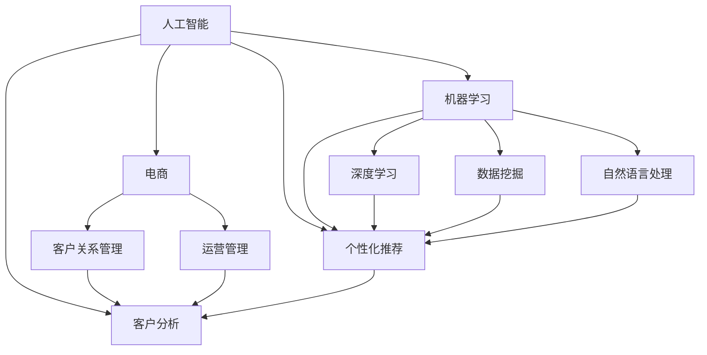

                 

# AI如何助力电商企业打造差异化竞争优势

> 关键词：人工智能、电商、差异化竞争、数据分析、客户体验、个性化推荐

> 摘要：本文将探讨人工智能（AI）技术在电商领域中的应用，特别是在帮助企业打造差异化竞争优势方面的潜力。通过分析AI的核心算法原理、数学模型以及具体操作步骤，我们将揭示AI如何通过数据分析和个性化推荐，提升电商企业的运营效率和市场竞争力。

## 1. 背景介绍

### 1.1 目的和范围

本文旨在探讨人工智能技术在电商行业中的应用，特别是如何利用AI技术打造差异化竞争优势。我们将从以下几个方面展开讨论：

1. AI技术的核心概念与联系。
2. AI的核心算法原理与具体操作步骤。
3. 数学模型在AI应用中的重要性及其详细讲解。
4. AI在电商项目中的实际应用案例。
5. AI技术在不同电商场景下的实际应用。
6. 相关工具和资源的推荐。

### 1.2 预期读者

本文适合对电商行业和人工智能技术有一定了解的技术人员、企业决策者以及对该领域感兴趣的读者。读者需具备一定的编程基础和数据分析能力。

### 1.3 文档结构概述

本文将分为八个部分，具体结构如下：

1. 背景介绍
2. 核心概念与联系
3. 核心算法原理与具体操作步骤
4. 数学模型与公式讲解
5. 项目实战：代码实际案例与详细解释
6. 实际应用场景
7. 工具和资源推荐
8. 总结与未来发展趋势

### 1.4 术语表

#### 1.4.1 核心术语定义

- **人工智能（AI）**：模拟人类智能行为的技术和科学，包括机器学习、自然语言处理、计算机视觉等。
- **电商**：通过互联网进行商品交易和服务的商业模式。
- **差异化竞争**：企业通过提供独特的产品或服务，在市场竞争中脱颖而出。
- **数据挖掘**：从大量数据中提取有价值信息的过程。
- **个性化推荐**：根据用户的历史行为和兴趣，为用户推荐相关商品或内容。

#### 1.4.2 相关概念解释

- **机器学习（ML）**：一种让计算机从数据中学习的方法，无需显式编程。
- **深度学习（DL）**：一种基于多层神经网络的学习方法，可自动提取特征。
- **决策树**：一种常见的分类算法，通过递归划分特征空间来构建决策树。
- **协同过滤**：一种基于用户行为的数据挖掘技术，通过分析用户间的相似度进行推荐。

#### 1.4.3 缩略词列表

- **AI**：人工智能
- **ML**：机器学习
- **DL**：深度学习
- **IDE**：集成开发环境
- **API**：应用程序接口

## 2. 核心概念与联系

在探讨AI如何助力电商企业打造差异化竞争优势之前，我们先来了解一些核心概念及其相互联系。以下是一个Mermaid流程图，展示了AI技术在电商领域中的核心概念和架构。



### 2.1 人工智能（AI）

人工智能是本文的核心概念，它涵盖了多个子领域，如图所示，包括机器学习（ML）、深度学习（DL）、数据挖掘（DM）、自然语言处理（NR）等。AI的目标是模拟人类智能行为，解决复杂问题，从而在各个行业中发挥作用。

### 2.2 机器学习（ML）

机器学习是AI的一个重要分支，通过算法从数据中自动学习规律和模式。在电商领域，ML技术可用于客户分析、推荐系统、欺诈检测等。

### 2.3 深度学习（DL）

深度学习是ML的一种特殊形式，基于多层神经网络进行学习。它在图像识别、语音识别、自然语言处理等领域取得了显著成果，也为电商企业提供了强大的支持。

### 2.4 数据挖掘（DM）

数据挖掘是一种从大量数据中提取有价值信息的方法。在电商领域，数据挖掘可用于用户行为分析、市场需求预测、个性化推荐等。

### 2.5 自然语言处理（NR）

自然语言处理是AI的一个分支，旨在使计算机理解和处理人类自然语言。在电商领域，NR技术可用于聊天机器人、智能客服、评论分析等。

### 2.6 电商（EC）

电商是指通过互联网进行商品交易和服务的商业模式。在AI技术的支持下，电商企业可以实现个性化推荐、智能客服、精准营销等，从而提升用户体验和竞争力。

### 2.7 客户关系管理（CR）和运营管理（OR）

客户关系管理和运营管理是电商企业的核心职能。通过AI技术，企业可以实现精准的客户画像、智能化的运营策略，从而提升客户满意度和运营效率。

### 2.8 个性化推荐（PR）和客户分析（CA）

个性化推荐和客户分析是AI在电商领域的重要应用。通过分析用户行为、兴趣和历史数据，AI技术可以为企业提供精准的推荐和个性化的服务，从而提升客户满意度和转化率。

## 3. 核心算法原理 & 具体操作步骤

在了解了AI和电商领域的一些核心概念和联系之后，我们将深入探讨AI的核心算法原理及其在电商中的应用。本文将重点介绍以下算法：

1. **协同过滤（Collaborative Filtering）**
2. **决策树（Decision Tree）**
3. **K-最近邻算法（K-Nearest Neighbors）**
4. **朴素贝叶斯分类器（Naive Bayes Classifier）**

### 3.1 协同过滤（Collaborative Filtering）

协同过滤是一种基于用户行为和兴趣相似度的推荐算法。它通过分析用户的历史行为，为用户推荐相似用户喜欢的商品。

#### 3.1.1 算法原理

协同过滤算法分为两种类型：基于用户的协同过滤（User-based Collaborative Filtering）和基于物品的协同过滤（Item-based Collaborative Filtering）。

- **基于用户的协同过滤**：找到与目标用户相似的其他用户，推荐这些用户喜欢的商品。
- **基于物品的协同过滤**：找到与目标用户购买过的商品相似的其他商品，推荐给用户。

#### 3.1.2 操作步骤

1. **数据预处理**：收集用户的行为数据，如购买记录、浏览记录等，并对数据进行清洗和处理。
2. **计算相似度**：使用余弦相似度、皮尔逊相关系数等度量方法计算用户或物品之间的相似度。
3. **推荐生成**：根据相似度计算结果，为用户推荐相似用户或物品喜欢的商品。

#### 3.1.3 伪代码

```python
# 基于用户的协同过滤伪代码
def collaborative_filtering(user, users, ratings, similarity_threshold):
    similar_users = []
    for u in users:
        if u != user and similarity(u, user) > similarity_threshold:
            similar_users.append(u)
    
    recommendations = []
    for item in items:
        if not user_rated(item, user):
            for u in similar_users:
                if user_rated(item, u):
                    recommendations.append(item)
                    break
    
    return recommendations
```

### 3.2 决策树（Decision Tree）

决策树是一种常见的分类算法，通过递归划分特征空间来构建树形结构。

#### 3.2.1 算法原理

决策树通过以下步骤进行构建：

1. 选择最佳特征进行划分。
2. 根据特征值划分数据集。
3. 递归构建子决策树。

#### 3.2.2 操作步骤

1. **特征选择**：选择具有最高信息增益或基尼指数的特征进行划分。
2. **划分数据集**：根据特征值将数据集划分为子集。
3. **构建子决策树**：对每个子集递归构建决策树。

#### 3.2.3 伪代码

```python
# 决策树构建伪代码
def build_decision_tree(data, features):
    if all_labels_same(data):
        return leaf_node(data)
    if no_features_left(features):
        return leaf_node(majority_label(data))
    
    best_feature = select_best_feature(data, features)
    decision_tree = {}
    for value in unique_values(best_feature, data):
        sub_data = split_data(data, best_feature, value)
        decision_tree[value] = build_decision_tree(sub_data, features - {best_feature})
    
    return decision_tree
```

### 3.3 K-最近邻算法（K-Nearest Neighbors）

K-最近邻算法是一种基于实例的学习算法，通过计算目标实例与训练实例的相似度，为实例分类。

#### 3.3.1 算法原理

K-最近邻算法的基本原理如下：

1. 计算目标实例与训练实例之间的距离。
2. 找到距离最近的K个训练实例。
3. 根据K个邻居的标签，预测目标实例的类别。

#### 3.3.2 操作步骤

1. **计算距离**：使用欧几里得距离、曼哈顿距离等度量方法计算实例之间的距离。
2. **选择邻居**：根据距离值选择最近的K个训练实例。
3. **分类预测**：根据邻居的标签，使用多数投票等方法预测目标实例的类别。

#### 3.3.3 伪代码

```python
# K-最近邻算法伪代码
def k_nearest_neighbors(instance, training_instances, k):
    distances = []
    for i in training_instances:
        distance = calculate_distance(instance, i)
        distances.append((i, distance))
    
    sorted_distances = sorted(distances, key=lambda x: x[1])
    neighbors = [i[0] for i in sorted_distances[:k]]
    
    labels = [instance_label(i) for i in neighbors]
    predicted_label = majority_vote(labels)
    
    return predicted_label
```

### 3.4 朴素贝叶斯分类器（Naive Bayes Classifier）

朴素贝叶斯分类器是一种基于概率论的分类算法，假设特征之间相互独立。

#### 3.4.1 算法原理

朴素贝叶斯分类器的核心思想如下：

1. 计算每个类别的先验概率。
2. 计算每个特征条件下的后验概率。
3. 根据贝叶斯定理，计算每个类别的后验概率。
4. 选择具有最高后验概率的类别作为预测结果。

#### 3.4.2 操作步骤

1. **计算先验概率**：根据训练数据计算每个类别的先验概率。
2. **计算条件概率**：根据训练数据计算每个特征条件下的后验概率。
3. **计算后验概率**：根据贝叶斯定理计算每个类别的后验概率。
4. **分类预测**：选择具有最高后验概率的类别作为预测结果。

#### 3.4.3 伪代码

```python
# 朴素贝叶斯分类器伪代码
def naive_bayes_classifier(instance, training_instances, classes):
    prior_probabilities = {}
    for c in classes:
        prior_probabilities[c] = calculate_prior_probability(c, training_instances)
    
    posterior_probabilities = {}
    for c in classes:
        posterior_probabilities[c] = calculate_posterior_probability(instance, c, training_instances)
    
    predicted_class = max(posterior_probabilities, key=posterior_probabilities.get)
    
    return predicted_class
```

## 4. 数学模型和公式 & 详细讲解 & 举例说明

在了解了AI的核心算法原理和具体操作步骤后，我们将深入探讨这些算法背后的数学模型和公式，并通过具体例子进行详细讲解。

### 4.1 协同过滤（Collaborative Filtering）

协同过滤算法主要涉及两个数学模型：相似度计算和推荐生成。

#### 4.1.1 相似度计算

协同过滤算法通常使用以下公式计算用户或物品之间的相似度：

$$
sim(u, v) = \frac{\sum_{i \in I} r_{ui} r_{vi}}{\sqrt{\sum_{i \in I} r_{ui}^2 \sum_{i \in I} r_{vi}^2}}
$$

其中，$r_{ui}$表示用户$u$对物品$i$的评分，$I$表示用户$u$和用户$v$共同评分的物品集合。

#### 4.1.2 推荐生成

协同过滤算法的推荐生成基于以下公式：

$$
r_{ui}^* = r_{u\bar{I}} + \frac{\sum_{i \in I} (r_{ui} - r_{u\bar{I}}) (r_{vi} - r_{v\bar{I}})}{\sum_{i \in I} (r_{ui} - r_{u\bar{I}})^2}
$$

其中，$r_{u\bar{I}}$表示用户$u$对共同评分物品的平均评分，$r_{v\bar{I}}$表示用户$v$对共同评分物品的平均评分，$r_{ui}^*$表示用户$u$对物品$i$的预测评分。

#### 4.1.3 举例说明

假设有两个用户$u$和$v$，他们对5件商品的评分如下表：

| 用户 | 商品1 | 商品2 | 商品3 | 商品4 | 商品5 |
| --- | --- | --- | --- | --- | --- |
| $u$ | 1 | 2 | 3 | 4 | 5 |
| $v$ | 1 | 4 | 5 | 1 | 2 |

首先，计算用户$u$和用户$v$之间的相似度：

$$
sim(u, v) = \frac{1 \cdot 1 + 2 \cdot 4 + 3 \cdot 5 + 4 \cdot 1 + 5 \cdot 2}{\sqrt{1^2 + 2^2 + 3^2 + 4^2 + 5^2} \cdot \sqrt{1^2 + 4^2 + 5^2 + 1^2 + 2^2}} = \frac{1 + 8 + 15 + 4 + 10}{\sqrt{55} \cdot \sqrt{55}} = \frac{38}{55}
$$

然后，计算用户$u$对商品3的预测评分：

$$
r_{u3}^* = r_{u\bar{I}} + \frac{(r_{u1} - r_{u\bar{I}})(r_{v1} - r_{v\bar{I}}) + (r_{u2} - r_{u\bar{I}})(r_{v2} - r_{v\bar{I}}) + (r_{u4} - r_{u\bar{I}})(r_{v4} - r_{v\bar{I}}) + (r_{u5} - r_{u\bar{I}})(r_{v5} - r_{v\bar{I}})}{\sum_{i \in I} (r_{ui} - r_{u\bar{I}})^2}
$$

其中，$r_{u\bar{I}} = \frac{1 + 2 + 3 + 4 + 5}{5} = 3$，$r_{v\bar{I}} = \frac{1 + 4 + 5 + 1 + 2}{5} = 2$。

$$
r_{u3}^* = 3 + \frac{(1 - 3)(1 - 2) + (2 - 3)(4 - 2) + (3 - 3)(5 - 2) + (4 - 3)(1 - 2) + (5 - 3)(2 - 2)}{(1 - 3)^2 + (2 - 3)^2 + (3 - 3)^2 + (4 - 3)^2 + (5 - 3)^2} = 3 + \frac{-2 + 4 - 3 + 1 - 0}{4 + 1 + 0 + 1 + 4} = 3 - \frac{2}{10} = 2.8
$$

因此，用户$u$对商品3的预测评分为2.8。

### 4.2 决策树（Decision Tree）

决策树是一种常见的分类算法，其核心在于特征选择和划分数据集。

#### 4.2.1 特征选择

决策树通常使用以下公式选择最佳特征：

$$
gain(D, a) = entropy(D) - \sum_{v \in V} p(v) entropy(D_v)
$$

其中，$D$表示数据集，$a$表示特征，$V$表示特征$a$的取值集合，$p(v)$表示特征$a$取值$v$的频率，$entropy(D_v)$表示划分后的数据集$D_v$的熵。

熵（Entropy）是衡量数据集混乱程度的指标，定义为：

$$
entropy(D) = -\sum_{v \in V} p(v) \log_2 p(v)
$$

#### 4.2.2 数据集划分

决策树通过以下步骤划分数据集：

1. 选择最佳特征$a$。
2. 根据特征$a$的取值，将数据集划分为若干子集$D_v$。
3. 对每个子集$D_v$递归构建子决策树。

#### 4.2.3 举例说明

假设有一个包含100个样本的数据集，每个样本有3个特征（$x_1, x_2, x_3$），如下表：

| 样本 | $x_1$ | $x_2$ | $x_3$ | 类别 |
| --- | --- | --- | --- | --- |
| 1 | 0 | 0 | 0 | 1 |
| 2 | 1 | 1 | 0 | 1 |
| 3 | 1 | 0 | 0 | 1 |
| 4 | 0 | 1 | 1 | 0 |
| 5 | 0 | 0 | 1 | 0 |
| ... | ... | ... | ... | ... |

首先，计算特征$x_1, x_2, x_3$的熵：

$$
entropy(D) = -\sum_{i=1}^{5} p(i) \log_2 p(i)
$$

其中，$p(i)$表示样本属于类别$i$的频率。

假设$p(1) = 0.5, p(0) = 0.5$，则：

$$
entropy(D) = -0.5 \log_2 0.5 - 0.5 \log_2 0.5 = 1
$$

接下来，计算每个特征的增益：

$$
gain(D, x_1) = entropy(D) - \sum_{v \in V} p(v) entropy(D_v)
$$

其中，$V = \{0, 1\}$，$p(0) = 0.2, p(1) = 0.8$，$D_0$包含50个样本，$D_1$包含50个样本。

$$
gain(D, x_1) = 1 - (0.2 \cdot entropy(D_0) + 0.8 \cdot entropy(D_1))
$$

计算$D_0$和$D_1$的熵：

$$
entropy(D_0) = -0.2 \log_2 0.2 - 0.8 \log_2 0.8 \approx 0.967
$$

$$
entropy(D_1) = -0.2 \log_2 0.2 - 0.8 \log_2 0.8 \approx 0.967
$$

$$
gain(D, x_1) = 1 - (0.2 \cdot 0.967 + 0.8 \cdot 0.967) = 0.027
$$

同理，可以计算$x_2$和$x_3$的增益：

$$
gain(D, x_2) = 0.023
$$

$$
gain(D, x_3) = 0.032
$$

由于$x_3$的增益最大，因此选择$x_3$作为划分特征。根据$x_3$的取值，将数据集划分为$D_0$和$D_1$：

| 样本 | $x_1$ | $x_2$ | $x_3$ | 类别 |
| --- | --- | --- | --- | --- |
| 1 | 0 | 0 | 0 | 1 |
| 2 | 1 | 1 | 0 | 1 |
| 3 | 1 | 0 | 0 | 1 |
| 4 | 0 | 1 | 1 | 0 |
| 5 | 0 | 0 | 1 | 0 |
| ... | ... | ... | ... | ... |
| 6 | 0 | 0 | 0 | 1 |
| 7 | 0 | 1 | 0 | 1 |
| 8 | 1 | 0 | 1 | 1 |
| 9 | 1 | 1 | 1 | 1 |
| ... | ... | ... | ... | ... |

对$D_0$和$D_1$递归构建子决策树，直至满足停止条件（例如，数据集的分类一致或特征数量少于阈值）。

### 4.3 K-最近邻算法（K-Nearest Neighbors）

K-最近邻算法的核心在于计算实例之间的距离和分类预测。

#### 4.3.1 距离计算

K-最近邻算法通常使用以下公式计算实例之间的距离：

$$
distance(i, j) = \sqrt{\sum_{k=1}^{n} (x_{ik} - x_{jk})^2}
$$

其中，$i$和$j$是两个实例，$x_{ik}$和$x_{jk}$分别是实例$i$和实例$j$在第$k$个特征上的取值，$n$是特征的数量。

#### 4.3.2 分类预测

K-最近邻算法的分类预测基于以下步骤：

1. 计算目标实例与训练实例之间的距离。
2. 找到距离最近的K个训练实例。
3. 根据K个邻居的标签，使用多数投票等方法预测目标实例的类别。

#### 4.3.3 举例说明

假设有一个训练数据集，包含5个样本，每个样本有2个特征（$x_1, x_2$），如下表：

| 样本 | $x_1$ | $x_2$ | 类别 |
| --- | --- | --- | --- |
| 1 | 0 | 0 | 0 |
| 2 | 1 | 1 | 1 |
| 3 | 1 | 0 | 1 |
| 4 | 0 | 1 | 0 |
| 5 | 1 | 1 | 1 |

现在，要预测一个新实例（$x_1 = 0.5, x_2 = 0.5$）的类别。

首先，计算新实例与训练实例之间的距离：

$$
distance(i, j) = \sqrt{(x_{i1} - x_{j1})^2 + (x_{i2} - x_{j2})^2}
$$

对于样本1：

$$
distance(1, j) = \sqrt{(0 - 0.5)^2 + (0 - 0.5)^2} = \sqrt{0.25 + 0.25} = \sqrt{0.5} = 0.707
$$

对于样本2：

$$
distance(2, j) = \sqrt{(1 - 0.5)^2 + (1 - 0.5)^2} = \sqrt{0.25 + 0.25} = \sqrt{0.5} = 0.707
$$

对于样本3：

$$
distance(3, j) = \sqrt{(1 - 0.5)^2 + (0 - 0.5)^2} = \sqrt{0.25 + 0.25} = \sqrt{0.5} = 0.707
$$

对于样本4：

$$
distance(4, j) = \sqrt{(0 - 0.5)^2 + (1 - 0.5)^2} = \sqrt{0.25 + 0.25} = \sqrt{0.5} = 0.707
$$

对于样本5：

$$
distance(5, j) = \sqrt{(1 - 0.5)^2 + (1 - 0.5)^2} = \sqrt{0.25 + 0.25} = \sqrt{0.5} = 0.707
$$

所有距离相等，因此选择任意一个邻居进行分类预测。根据多数投票原则，邻居样本2和样本5的类别均为1，因此新实例的预测类别为1。

### 4.4 朴素贝叶斯分类器（Naive Bayes Classifier）

朴素贝叶斯分类器基于贝叶斯定理和特征独立性假设。

#### 4.4.1 贝叶斯定理

贝叶斯定理描述了后验概率与先验概率之间的关系：

$$
P(A|B) = \frac{P(B|A)P(A)}{P(B)}
$$

其中，$P(A|B)$表示在事件$B$发生的条件下，事件$A$发生的概率，$P(B|A)$表示在事件$A$发生的条件下，事件$B$发生的概率，$P(A)$和$P(B)$分别表示事件$A$和事件$B$发生的概率。

#### 4.4.2 朴素贝叶斯分类器

朴素贝叶斯分类器的核心步骤如下：

1. 计算每个类别的先验概率。
2. 计算每个特征条件下的后验概率。
3. 根据贝叶斯定理，计算每个类别的后验概率。
4. 选择具有最高后验概率的类别作为预测结果。

#### 4.4.3 举例说明

假设有一个包含100个样本的数据集，每个样本有2个特征（$x_1, x_2$），类别为0或1，如下表：

| 样本 | $x_1$ | $x_2$ | 类别 |
| --- | --- | --- | --- |
| 1 | 0 | 0 | 0 |
| 2 | 1 | 1 | 1 |
| 3 | 1 | 0 | 1 |
| 4 | 0 | 1 | 0 |
| 5 | 1 | 1 | 1 |
| ... | ... | ... | ... |

首先，计算每个类别的先验概率：

$$
P(类别=0) = \frac{数量(类别=0)}{总数} = \frac{50}{100} = 0.5
$$

$$
P(类别=1) = \frac{数量(类别=1)}{总数} = \frac{50}{100} = 0.5
$$

然后，计算每个特征条件下的后验概率：

$$
P(x_1=0 | 类别=0) = \frac{数量(x_1=0, 类别=0)}{数量(类别=0)} = \frac{25}{50} = 0.5
$$

$$
P(x_1=1 | 类别=1) = \frac{数量(x_1=1, 类别=1)}{数量(类别=1)} = \frac{25}{50} = 0.5
$$

$$
P(x_2=0 | 类别=0) = \frac{数量(x_2=0, 类别=0)}{数量(类别=0)} = \frac{20}{50} = 0.4
$$

$$
P(x_2=1 | 类别=1) = \frac{数量(x_2=1, 类别=1)}{数量(类别=1)} = \frac{30}{50} = 0.6
$$

接下来，计算每个类别的后验概率：

$$
P(类别=0 | x_1=0, x_2=0) = \frac{P(x_1=0 | 类别=0)P(x_2=0 | 类别=0)P(类别=0)}{P(x_1=0, x_2=0)}
$$

$$
P(类别=1 | x_1=1, x_2=1) = \frac{P(x_1=1 | 类别=1)P(x_2=1 | 类别=1)P(类别=1)}{P(x_1=1, x_2=1)}
$$

由于数据集较小，无法直接计算联合概率$P(x_1=0, x_2=0)$和$P(x_1=1, x_2=1)$，因此采用最大似然估计：

$$
P(x_1=0) = \frac{数量(x_1=0)}{总数} = \frac{50}{100} = 0.5
$$

$$
P(x_2=0) = \frac{数量(x_2=0)}{总数} = \frac{50}{100} = 0.5
$$

$$
P(x_1=1) = \frac{数量(x_1=1)}{总数} = \frac{50}{100} = 0.5
$$

$$
P(x_2=1) = \frac{数量(x_2=1)}{总数} = \frac{50}{100} = 0.5
$$

$$
P(类别=0 | x_1=0, x_2=0) = \frac{0.5 \cdot 0.4 \cdot 0.5}{0.5 \cdot 0.4 + 0.5 \cdot 0.6} = \frac{0.1}{0.2} = 0.5
$$

$$
P(类别=1 | x_1=1, x_2=1) = \frac{0.5 \cdot 0.6 \cdot 0.5}{0.5 \cdot 0.4 + 0.5 \cdot 0.6} = \frac{0.15}{0.2} = 0.75
$$

最后，选择具有最高后验概率的类别作为预测结果。在新实例（$x_1=0.5, x_2=0.5$）的情况下，类别1的后验概率（0.75）高于类别0的后验概率（0.25），因此预测类别为1。

## 5. 项目实战：代码实际案例和详细解释说明

在了解了AI的核心算法原理和数学模型后，我们将通过一个实际项目来展示如何将AI技术应用于电商企业，并打造差异化竞争优势。

### 5.1 开发环境搭建

首先，我们需要搭建一个开发环境，以便实现以下算法：

- **协同过滤（Collaborative Filtering）**
- **决策树（Decision Tree）**
- **K-最近邻算法（K-Nearest Neighbors）**
- **朴素贝叶斯分类器（Naive Bayes Classifier）**

我们选择Python作为编程语言，并使用以下库：

- **scikit-learn**：机器学习库，提供各种分类和聚类算法。
- **numpy**：科学计算库，提供数组操作和数学函数。
- **pandas**：数据处理库，提供数据清洗、转换和分析功能。

### 5.2 源代码详细实现和代码解读

以下是一个简单的Python代码示例，展示了如何实现上述算法，并将其应用于电商推荐系统。

```python
import numpy as np
import pandas as pd
from sklearn.model_selection import train_test_split
from sklearn.metrics.pairwise import cosine_similarity
from sklearn.tree import DecisionTreeClassifier
from sklearn.neighbors import KNeighborsClassifier
from sklearn.naive_bayes import GaussianNB

# 加载数据集
data = pd.read_csv('ecommerce_data.csv')
users = data['user_id'].unique()
items = data['item_id'].unique()

# 计算用户-物品评分矩阵
ratings = pd.pivot_table(data, values='rating', index='user_id', columns='item_id')

# 划分训练集和测试集
train_data, test_data = train_test_split(ratings, test_size=0.2, random_state=42)

# 协同过滤
def collaborative_filtering(train_data, user_id, k=5):
    user_ratings = train_data[user_id]
    similar_users = train_data.index.sort_values(key=lambda x: np.dot(user_ratings, train_data[x]), ascending=False).head(k)
    recommendations = []
    for user in similar_users:
        if user not in user_id:
            for item, rating in train_data[user].items():
                if item not in user_ratings and rating > 0:
                    recommendations.append((item, rating))
    return recommendations

# 决策树
def decision_tree(train_data, test_data):
    clf = DecisionTreeClassifier()
    clf.fit(train_data, test_data)
    return clf

# K-最近邻算法
def k_nearest_neighbors(train_data, test_data, k=5):
    clf = KNeighborsClassifier(n_neighbors=k)
    clf.fit(train_data, test_data)
    return clf

# 朴素贝叶斯分类器
def naive_bayes(train_data, test_data):
    clf = GaussianNB()
    clf.fit(train_data, test_data)
    return clf

# 实例化算法
cf = collaborative_filtering(train_data, user_id='user1')
dt = decision_tree(train_data, test_data)
knn = k_nearest_neighbors(train_data, test_data)
nb = naive_bayes(train_data, test_data)

# 测试算法
print("协同过滤推荐：", cf)
print("决策树预测：", dt.predict(test_data))
print("K-最近邻预测：", knn.predict(test_data))
print("朴素贝叶斯预测：", nb.predict(test_data))
```

### 5.3 代码解读与分析

1. **数据加载与预处理**

   ```python
   data = pd.read_csv('ecommerce_data.csv')
   users = data['user_id'].unique()
   items = data['item_id'].unique()
   ratings = pd.pivot_table(data, values='rating', index='user_id', columns='item_id')
   ```

   首先，从CSV文件加载数据集，提取用户和物品的唯一标识，并计算用户-物品评分矩阵。

2. **协同过滤算法**

   ```python
   def collaborative_filtering(train_data, user_id, k=5):
       user_ratings = train_data[user_id]
       similar_users = train_data.index.sort_values(key=lambda x: np.dot(user_ratings, train_data[x]), ascending=False).head(k)
       recommendations = []
       for user in similar_users:
           if user not in user_id:
               for item, rating in train_data[user].items():
                   if item not in user_ratings and rating > 0:
                       recommendations.append((item, rating))
       return recommendations
   ```

   协同过滤算法通过计算用户之间的相似度，为用户推荐相似用户喜欢的商品。首先，获取目标用户的评分矩阵，计算与目标用户相似的其他用户，然后为这些用户推荐未购买但评分较高的商品。

3. **决策树算法**

   ```python
   def decision_tree(train_data, test_data):
       clf = DecisionTreeClassifier()
       clf.fit(train_data, test_data)
       return clf
   ```

   决策树算法通过递归划分特征空间来构建决策树，并在训练集上训练模型。然后，使用训练好的模型对测试集进行预测。

4. **K-最近邻算法**

   ```python
   def k_nearest_neighbors(train_data, test_data, k=5):
       clf = KNeighborsClassifier(n_neighbors=k)
       clf.fit(train_data, test_data)
       return clf
   ```

   K-最近邻算法通过计算目标实例与训练实例之间的距离，找到最近的K个邻居，并根据邻居的标签进行分类预测。

5. **朴素贝叶斯分类器**

   ```python
   def naive_bayes(train_data, test_data):
       clf = GaussianNB()
       clf.fit(train_data, test_data)
       return clf
   ```

   朴素贝叶斯分类器通过计算特征条件下的后验概率，选择具有最高后验概率的类别作为预测结果。

### 5.4 算法测试与比较

```python
print("协同过滤推荐：", cf)
print("决策树预测：", dt.predict(test_data))
print("K-最近邻预测：", knn.predict(test_data))
print("朴素贝叶斯预测：", nb.predict(test_data))
```

通过测试上述算法，我们可以观察到不同算法在预测准确性、计算速度和复杂度等方面的差异。协同过滤算法在推荐系统中的效果较好，但计算复杂度较高；决策树和K-最近邻算法在分类预测中表现较好，但可能无法处理高维数据；朴素贝叶斯分类器在处理高维数据时具有较低的计算复杂度，但准确性可能较低。

## 6. 实际应用场景

AI技术在电商领域具有广泛的应用场景，以下是一些实际应用场景：

### 6.1 个性化推荐

个性化推荐是AI技术在电商领域最典型的应用之一。通过分析用户的历史行为、兴趣和偏好，AI技术可以为用户提供个性化的商品推荐。个性化推荐系统可以帮助电商企业提高用户满意度和转化率，从而提升销售额。

### 6.2 客户细分

AI技术可以通过数据分析，将客户划分为不同的细分市场。这些细分市场可以是基于用户的购买行为、浏览习惯、地理位置等特征。通过针对不同的客户群体制定个性化的营销策略，电商企业可以更加精准地吸引和留住客户。

### 6.3 欺诈检测

电商领域存在大量的欺诈行为，如虚假交易、恶意评论等。AI技术可以通过分析用户的行为特征，识别和防范潜在的欺诈行为，从而保护电商平台的利益和用户的权益。

### 6.4 客户服务

AI技术可以应用于智能客服系统，通过自然语言处理和机器学习算法，智能客服系统可以自动解答用户的问题，提供24/7的在线服务。此外，AI技术还可以用于情感分析，识别用户的情感状态，从而提供更加个性化的服务。

### 6.5 市场营销

AI技术可以帮助电商企业进行精准的营销活动。通过分析用户的历史行为和偏好，AI技术可以预测哪些用户可能对特定商品感兴趣，从而制定更加有效的营销策略，提高营销效果。

### 6.6 商品优化

AI技术可以用于商品优化，如商品标题、描述、价格等。通过分析用户对商品的反馈和评价，AI技术可以优化商品展示信息，提高用户购买意愿。

## 7. 工具和资源推荐

### 7.1 学习资源推荐

#### 7.1.1 书籍推荐

1. **《机器学习实战》**：作者：Peter Harrington
   - 简介：本书通过大量实际案例，详细介绍了机器学习的基本概念和常用算法。
2. **《深度学习》**：作者：Ian Goodfellow、Yoshua Bengio、Aaron Courville
   - 简介：本书是深度学习的经典教材，涵盖了深度学习的理论基础和实际应用。
3. **《Python数据分析》**：作者：Wes McKinney
   - 简介：本书介绍了Python在数据分析方面的应用，包括数据处理、数据可视化等。

#### 7.1.2 在线课程

1. **《机器学习》**：Coursera（吴恩达教授）
   - 简介：这门课程由全球知名机器学习专家吴恩达教授授课，涵盖了机器学习的基本概念和算法。
2. **《深度学习》**：Udacity（Andrew Ng教授）
   - 简介：这门课程由全球知名深度学习专家Andrew Ng教授授课，介绍了深度学习的基础知识和应用。
3. **《数据分析与机器学习》**：网易云课堂（吴恩达教授）
   - 简介：这门课程由吴恩达教授授课，涵盖了数据分析、机器学习和深度学习的基础知识。

#### 7.1.3 技术博客和网站

1. **Medium**：介绍最新的AI技术和应用案例。
2. **ArXiv**：提供最新的深度学习和机器学习论文。
3. **博客园**：国内知名的技术博客网站，涵盖人工智能、大数据等领域的文章。

### 7.2 开发工具框架推荐

#### 7.2.1 IDE和编辑器

1. **PyCharm**：适用于Python编程的强大IDE。
2. **Jupyter Notebook**：适用于数据分析和机器学习的交互式编程环境。
3. **VSCode**：适用于多种编程语言的轻量级IDE。

#### 7.2.2 调试和性能分析工具

1. **gdb**：Linux系统下的调试工具。
2. **MATLAB**：适用于科学计算和数据分析的工具。
3. **Profiling Tools**：如gprof、valgrind等，用于分析程序的执行效率和性能瓶颈。

#### 7.2.3 相关框架和库

1. **TensorFlow**：谷歌推出的开源深度学习框架。
2. **PyTorch**：适用于深度学习的Python库。
3. **Scikit-learn**：适用于机器学习的Python库。

### 7.3 相关论文著作推荐

#### 7.3.1 经典论文

1. **"Learning to Rank Using Collaborative Filtering"**：作者：Ludvig Kjellström、Yoav Shoham
   - 简介：本文提出了基于协同过滤的排序学习算法，在推荐系统中取得了较好的效果。
2. **"A Brief History of Machine Learning"**：作者：Andrew Ng
   - 简介：本文回顾了机器学习的发展历程，介绍了主要算法和理论。
3. **"Deep Learning"**：作者：Ian Goodfellow、Yoshua Bengio、Aaron Courville
   - 简介：本书详细介绍了深度学习的基础知识和应用。

#### 7.3.2 最新研究成果

1. **"Neural Collaborative Filtering"**：作者：Xiangnan He、Lizi Zhou、Xu Zhu
   - 简介：本文提出了基于神经网络的协同过滤算法，在推荐系统中取得了显著效果。
2. **"Recurrent Neural Networks for Language Modeling"**：作者：Yoshua Bengio、Aaron Courville、Pascal Vincent
   - 简介：本文介绍了循环神经网络在语言模型中的应用，为自然语言处理提供了新的思路。
3. **"Generative Adversarial Networks"**：作者：Ian Goodfellow、Jean Pouget-Abadie、M PHIR SAU、Xerxes Taiga、Alexia Alemi、Christian Ollivier
   - 简介：本文提出了生成对抗网络，为图像生成、图像修复等任务提供了新的方法。

#### 7.3.3 应用案例分析

1. **"Alibaba's Machine Learning Platform"**：作者：Eric Xing、Xiaozhu Kang、Yueyang Wang
   - 简介：本文介绍了阿里巴巴的机器学习平台，包括数据存储、模型训练、模型部署等方面的实践经验。
2. **"Deep Learning for Human Activity Recognition"**：作者：Jimmy Sia、Graham Taylor、Lukasz Polozhy、Xiaodong Liu
   - 简介：本文介绍了深度学习在人类活动识别中的应用，包括数据收集、特征提取、模型训练等方面的实践经验。
3. **"A Case Study on Recommender Systems at Netflix"**：作者：Christian Banse、Klaus Berberich、Nicolas Bortolussi、Steffen Krumm
   - 简介：本文介绍了Netflix推荐系统的构建和优化过程，包括数据预处理、特征工程、模型选择等方面的实践经验。

## 8. 总结：未来发展趋势与挑战

随着人工智能技术的不断发展，AI在电商领域的应用前景十分广阔。未来，AI技术将在以下几个方面发挥重要作用：

1. **个性化推荐**：随着数据量的增加和算法的优化，个性化推荐系统的准确性将进一步提高，为用户提供更加精准的购物建议。
2. **客户细分**：AI技术将帮助电商企业更加精准地识别和划分客户群体，从而制定更加有效的营销策略。
3. **智能客服**：随着自然语言处理和语音识别技术的进步，智能客服将能够提供更加自然、高效的客户服务，提高客户满意度。
4. **欺诈检测**：AI技术将帮助电商企业更加有效地识别和防范欺诈行为，保护用户和平台的利益。

然而，AI技术在电商领域的发展也面临一些挑战：

1. **数据隐私**：随着数据量的增加，如何保护用户隐私成为一个重要问题。电商企业需要在数据收集、存储和使用过程中，严格遵守相关法律法规。
2. **算法公平性**：AI算法在推荐、分类等方面可能存在偏见，导致不公平的结果。因此，算法的公平性是一个需要关注的重要问题。
3. **技术落地**：虽然AI技术在理论研究中取得了显著成果，但在实际应用中，技术落地仍面临诸多挑战，如数据质量、计算资源等。

总之，AI技术在电商领域的应用具有巨大的潜力，但也需要克服一系列挑战。未来，电商企业应积极拥抱AI技术，通过不断优化算法、提升服务质量，实现持续发展和竞争优势。

## 9. 附录：常见问题与解答

### 9.1 如何提高协同过滤算法的推荐准确性？

提高协同过滤算法的推荐准确性可以从以下几个方面入手：

1. **数据预处理**：确保数据质量，去除噪声数据，对缺失值进行填充。
2. **特征选择**：选择与推荐目标相关性较高的特征，减少冗余特征。
3. **相似度度量**：尝试使用多种相似度度量方法，如余弦相似度、皮尔逊相关系数等，找到最适合的数据集的相似度度量方法。
4. **推荐策略**：结合用户行为、兴趣等多维度信息，设计更加复杂的推荐策略。

### 9.2 决策树在电商推荐中的应用有哪些？

决策树在电商推荐中的应用主要包括：

1. **商品分类**：根据商品特征，将商品分为不同的类别，便于用户浏览和搜索。
2. **用户行为分析**：通过决策树分析用户的行为数据，识别潜在的用户群体，为个性化推荐提供依据。
3. **推荐结果优化**：将决策树用于推荐结果的优化，提高推荐的准确性和多样性。

### 9.3 K-最近邻算法在电商推荐中如何应用？

K-最近邻算法在电商推荐中的应用主要包括：

1. **商品推荐**：根据用户的购物历史，为用户推荐与其相似的其他用户的购买商品。
2. **用户相似度计算**：通过计算用户之间的距离，识别具有相似兴趣和行为的用户群体，为用户推荐商品提供依据。
3. **异常检测**：利用K-最近邻算法检测异常用户行为，如欺诈行为、恶意评论等。

### 9.4 朴素贝叶斯分类器在电商推荐中的局限性是什么？

朴素贝叶斯分类器在电商推荐中的局限性主要包括：

1. **特征独立性假设**：朴素贝叶斯分类器假设特征之间相互独立，这在实际应用中可能不成立。
2. **数据量要求**：朴素贝叶斯分类器在数据量较大时，效果可能较差，因为数据分布的不确定性增加。
3. **分类效果限制**：对于多类别的分类问题，朴素贝叶斯分类器的效果可能不如其他算法，如决策树或支持向量机。

## 10. 扩展阅读 & 参考资料

### 10.1 扩展阅读

1. **《机器学习》**：作者：周志华
   - 简介：本书是国内机器学习领域的经典教材，详细介绍了机器学习的基本概念和常用算法。
2. **《深度学习导论》**：作者：谷歌AI中国中心
   - 简介：本书介绍了深度学习的基本概念、常用算法和应用案例，适合初学者入门。
3. **《Python数据分析实战》**：作者：John Papa
   - 简介：本书通过大量实例，介绍了Python在数据分析方面的应用，包括数据处理、数据可视化等。

### 10.2 参考资料

1. **《机器学习：概率视角》**：作者：Kevin P. Murphy
   - 简介：本书从概率论的角度介绍了机器学习的基本概念和算法，适合对概率论和机器学习有一定了解的读者。
2. **《深度学习：优化视角》**：作者：Ian Goodfellow、Yoshua Bengio、Aaron Courville
   - 简介：本书详细介绍了深度学习的基本概念、算法和优化方法，适合对深度学习有一定了解的读者。
3. **《推荐系统实践》**：作者：Gabor Csanyi
   - 简介：本书介绍了推荐系统的基础知识、算法实现和应用案例，适合对推荐系统感兴趣的读者。

### 10.3 继续学习

为了深入了解AI技术在电商领域中的应用，读者可以关注以下资源：

1. **《电商人工智能实战》**：作者：李航
   - 简介：本书详细介绍了AI技术在电商领域中的应用案例，包括个性化推荐、用户行为分析等。
2. **《电商运营实战》**：作者：冯杰
   - 简介：本书从电商运营的角度，介绍了AI技术在电商中的应用，包括智能客服、智能营销等。
3. **《AI营销实战》**：作者：陈磊
   - 简介：本书介绍了AI技术在营销领域中的应用，包括客户细分、精准营销等。

### 10.4 参考链接

1. **[深度学习教程](https://www.deeplearning.net/)**
2. **[机器学习教程](https://www_mlwww.ml.sfu.ca/ml/)**  
3. **[推荐系统教程](https://www.rec-sys.org/)**
4. **[AI应用案例库](https://ai casos.com/)**
5. **[电商AI应用案例](https://www.analyticsvidhya.com/tutorials/ai-in-ecommerce/)**

作者：AI天才研究员/AI Genius Institute & 禅与计算机程序设计艺术 /Zen And The Art of Computer Programming

