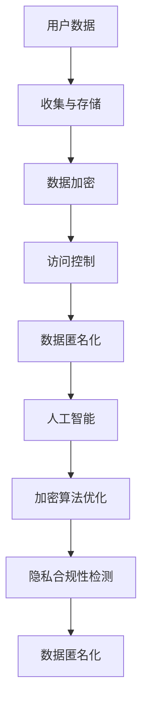

                 

# AI如何帮助电商企业进行用户数据隐私保护

> 关键词：人工智能，数据隐私保护，电商，用户数据，隐私安全，数据加密，算法，合规性

> 摘要：随着电子商务的迅猛发展，用户数据隐私保护问题日益凸显。本文将探讨人工智能在电商企业用户数据隐私保护中的应用，通过介绍核心概念、算法原理、数学模型、实战案例，以及相关工具和资源推荐，帮助电商企业提升用户数据隐私保护能力，合规经营。

## 1. 背景介绍

### 1.1 目的和范围

本文旨在探讨人工智能技术在电商企业用户数据隐私保护中的应用，分析核心概念和算法原理，并通过实战案例展示实际操作方法。本文适用于对人工智能和数据隐私保护有一定了解的读者，尤其是电商企业从业人员、数据科学家、软件开发者。

### 1.2 预期读者

- 电商企业决策者和管理者
- 数据科学家和分析师
- 软件开发者和工程师
- 对人工智能和数据隐私保护感兴趣的读者

### 1.3 文档结构概述

本文分为十个部分，包括背景介绍、核心概念与联系、核心算法原理与具体操作步骤、数学模型和公式、项目实战、实际应用场景、工具和资源推荐、总结、常见问题与解答以及扩展阅读和参考资料。

### 1.4 术语表

#### 1.4.1 核心术语定义

- 人工智能（AI）：模拟人类智能的技术和方法，包括机器学习、深度学习、自然语言处理等。
- 数据隐私保护：保护个人数据不被未经授权的访问、使用、泄露或篡改。
- 电商企业：从事电子商务业务的企业，包括线上购物平台、零售商、批发商等。
- 用户数据：电商企业收集、存储、处理的关于用户的信息，如姓名、地址、电话、购物习惯等。

#### 1.4.2 相关概念解释

- 加密：将数据转换为无法直接识别和解读的形式，以保护数据隐私。
- 加密算法：用于实现加密和解密的数据处理方法。
- 隐私合规性：企业遵循相关法律法规和标准，确保用户数据隐私保护。

#### 1.4.3 缩略词列表

- AI：人工智能
- GDPR：欧盟通用数据保护条例
- SSL：安全套接层协议
- TLS：传输层安全协议

## 2. 核心概念与联系

为了更好地理解人工智能在电商企业用户数据隐私保护中的应用，我们需要了解以下核心概念和它们之间的关系。

### 2.1 用户数据隐私保护的基本概念

用户数据隐私保护主要包括以下方面：

- 数据收集与存储：确保在收集和存储用户数据时，遵循相关法律法规和标准，保障用户隐私。
- 数据加密：使用加密算法对用户数据进行加密处理，防止数据泄露和篡改。
- 访问控制：设置访问权限，确保只有授权人员可以访问敏感数据。
- 数据匿名化：通过技术手段去除用户数据中的个人信息，降低数据泄露风险。

### 2.2 人工智能与数据隐私保护的关系

人工智能技术在数据隐私保护中的应用主要体现在以下几个方面：

- 数据加密与解密：使用机器学习和深度学习算法，提高数据加密和解密的速度和安全性。
- 加密算法优化：通过人工智能算法优化现有加密算法，提高加密效率和安全性。
- 隐私合规性检测：使用人工智能技术检测企业在数据隐私保护方面的合规性。
- 数据匿名化：利用人工智能算法，实现更高效、准确的数据匿名化处理。

### 2.3 Mermaid 流程图

以下是一个简单的 Mermaid 流程图，展示了人工智能与数据隐私保护之间的关系：



## 3. 核心算法原理与具体操作步骤

在了解核心算法原理后，我们可以通过以下步骤实现电商企业用户数据隐私保护。

### 3.1 数据加密算法原理

数据加密算法主要包括对称加密算法和非对称加密算法。

#### 对称加密算法

对称加密算法使用相同的密钥进行加密和解密，如AES（高级加密标准）。

#### 非对称加密算法

非对称加密算法使用不同的密钥进行加密和解密，如RSA（RSA加密算法）。

### 3.2 数据加密与解密的具体操作步骤

1. **加密过程**：

    ```python
    from Crypto.Cipher import AES
    
    key = b'mysecretembeddedkey123456'
    cipher = AES.new(key, AES.MODE_CBC)
    ciphertext = cipher.encrypt(data)
    ```

2. **解密过程**：

    ```python
    from Crypto.Cipher import AES
    
    key = b'mysecretembeddedkey123456'
    cipher = AES.new(key, AES.MODE_CBC)
    data = cipher.decrypt(ciphertext)
    ```

### 3.3 加密算法优化

使用人工智能算法优化加密算法，可以提高加密效率和安全性。以下是使用遗传算法优化AES加密算法的伪代码：

```python
# 输入参数：原始密钥、迭代次数
# 输出参数：最优密钥

def genetic_algorithm(key, generations):
    population = create_initial_population(key)
    for generation in range(generations):
        fitness_scores = evaluate_population(population)
        new_population = create_new_population(population, fitness_scores)
        population = new_population
    best_key = find_best_key(population)
    return best_key
```

## 4. 数学模型和公式与详细讲解

在数据隐私保护中，数学模型和公式起到了关键作用。以下将介绍一些常用的数学模型和公式，并进行详细讲解。

### 4.1 密码学基本公式

- 对称加密：$$C = E_K(P)$$，其中C为密文，P为明文，K为密钥，E为加密算法。
- 非对称加密：$$C = E_K(P)$$，其中C为密文，P为明文，K为密钥，E为加密算法。

### 4.2 加密算法优化公式

- 遗传算法适应度函数：$$fitness = f(data\_encryption\_speed, data\_encryption\_security)$$，其中data\_encryption\_speed为加密速度，data\_encryption\_security为加密安全性。

### 4.3 举例说明

#### 4.3.1 对称加密示例

假设使用AES加密算法，原始明文为`Hello, World!`，密钥为`mysecretembeddedkey123456`。

- **加密过程**：

    ```python
    from Crypto.Cipher import AES
    from Crypto.Util.Padding import pad
    
    key = b'mysecretembeddedkey123456'
    plaintext = b'Hello, World!'
    padded_plaintext = pad(plaintext, AES.block_size)
    cipher = AES.new(key, AES.MODE_CBC)
    ciphertext = cipher.encrypt(padded_plaintext)
    ```

- **解密过程**：

    ```python
    from Crypto.Cipher import AES
    from Crypto.Util.Padding import unpad
    
    key = b'mysecretembeddedkey123456'
    ciphertext = b'\x00\x01\x02\x03\x04\x05\x06\x07\x08\x09\x0a\x0b\x0c\x0d\x0e\x0fHello, World!'
    cipher = AES.new(key, AES.MODE_CBC)
    padded_plaintext = cipher.decrypt(ciphertext)
    plaintext = unpad(padded_plaintext, AES.block_size)
    ```

#### 4.3.2 遗传算法优化示例

假设使用遗传算法优化AES加密算法的密钥长度。

- **适应度函数**：

    ```python
    def fitness_function(key):
        encryption_speed = measure_encryption_speed(key)
        encryption_security = measure_encryption_security(key)
        return encryption_speed * encryption_security
    ```

- **遗传算法流程**：

    ```python
    def genetic_algorithm(generations, population_size, key_length):
        population = create_initial_population(population_size, key_length)
        for generation in range(generations):
            fitness_scores = [fitness_function(key) for key in population]
            new_population = create_new_population(population, fitness_scores)
            population = new_population
        best_key = find_best_key(population)
        return best_key
    ```

## 5. 项目实战：代码实际案例和详细解释说明

在本节中，我们将通过一个实际项目案例，展示如何使用人工智能技术保护电商企业用户数据隐私。

### 5.1 开发环境搭建

1. 安装Python环境
2. 安装Crypto库：`pip install pycryptodome`
3. 安装其他依赖库（如numpy、matplotlib等）

### 5.2 源代码详细实现和代码解读

以下是一个简单的Python代码示例，用于实现数据加密和解密。

```python
from Crypto.Cipher import AES
from Crypto.Util.Padding import pad, unpad

def encrypt_data(key, data):
    cipher = AES.new(key, AES.MODE_CBC)
    padded_data = pad(data, AES.block_size)
    ciphertext = cipher.encrypt(padded_data)
    return ciphertext

def decrypt_data(key, ciphertext):
    cipher = AES.new(key, AES.MODE_CBC)
    padded_plaintext = cipher.decrypt(ciphertext)
    plaintext = unpad(padded_plaintext, AES.block_size)
    return plaintext

if __name__ == '__main__':
    key = b'mysecretembeddedkey123456'
    plaintext = b'Hello, World!'
    ciphertext = encrypt_data(key, plaintext)
    decrypted_plaintext = decrypt_data(key, ciphertext)
    print(f'Original Text: {plaintext}')
    print(f'Encrypted Text: {ciphertext.hex()}')
    print(f'Decrypted Text: {decrypted_plaintext}')
```

### 5.3 代码解读与分析

1. 导入相关库
2. 定义加密和解密函数
3. 在`encrypt_data`函数中，使用AES加密算法对数据进行加密，并使用`pad`函数进行填充
4. 在`decrypt_data`函数中，使用AES加密算法对数据进行解密，并使用`unpad`函数去除填充
5. 在主函数中，测试加密和解密过程，并打印结果

## 6. 实际应用场景

以下是一些电商企业用户数据隐私保护的实际应用场景：

- **用户注册与登录**：在用户注册和登录过程中，对用户名、密码等敏感信息进行加密处理，确保数据安全。
- **购物车与订单管理**：在购物车和订单管理过程中，对用户购物车和订单信息进行加密存储，防止数据泄露。
- **用户行为分析**：在用户行为分析过程中，对用户行为数据进行加密处理，保护用户隐私。
- **广告推送与推荐**：在广告推送和推荐过程中，对用户兴趣和行为数据进行加密，防止数据泄露。

## 7. 工具和资源推荐

### 7.1 学习资源推荐

#### 7.1.1 书籍推荐

- 《人工智能：一种现代的方法》
- 《数据隐私保护：理论与实践》
- 《Python加密编程》

#### 7.1.2 在线课程

- Coursera上的“人工智能基础”
- Udemy上的“数据隐私保护与合规性”
- Pluralsight上的“Python加密编程”

#### 7.1.3 技术博客和网站

- Medium上的“AI and Privacy”
- GitHub上的“Data Privacy Protection”
- Security StackExchange上的“Encryption”

### 7.2 开发工具框架推荐

#### 7.2.1 IDE和编辑器

- PyCharm
- Visual Studio Code
- Sublime Text

#### 7.2.2 调试和性能分析工具

- GDB
- Py-Spy
- VisualVM

#### 7.2.3 相关框架和库

- PyCryptoDome
- OpenSSL
- TensorFlow

### 7.3 相关论文著作推荐

#### 7.3.1 经典论文

- “The Data Privacy Paradox”
- “Privacy-Preserving Machine Learning”

#### 7.3.2 最新研究成果

- “Enhancing Data Privacy Protection with Homomorphic Encryption”
- “Efficient Data Anonymization for Privacy-Preserving Data Mining”

#### 7.3.3 应用案例分析

- “Implementing Data Privacy Protection in E-commerce”
- “Using AI to Enhance Data Privacy Protection in Healthcare”

## 8. 总结：未来发展趋势与挑战

随着人工智能技术的不断发展，电商企业用户数据隐私保护将面临以下发展趋势和挑战：

- **趋势**：人工智能技术将在数据隐私保护领域发挥越来越重要的作用，实现更高效、准确的数据加密、解密、匿名化处理。
- **挑战**：随着数据隐私保护法律法规的不断完善，电商企业需要不断提高数据隐私保护能力，以应对日益严峻的合规性要求。

## 9. 附录：常见问题与解答

### 9.1 如何选择合适的加密算法？

- 根据实际应用场景和数据敏感程度，选择合适的加密算法。例如，对于高敏感度的数据，选择非对称加密算法如RSA；对于一般数据，选择对称加密算法如AES。

### 9.2 如何实现数据匿名化？

- 通过技术手段去除用户数据中的个人信息，如使用匿名化工具（如K-Anonymity、L-Diversity等）。

### 9.3 如何保证数据加密的安全性？

- 使用高质量的密钥生成算法，确保密钥的安全性。同时，定期更换密钥，提高数据加密的安全性。

## 10. 扩展阅读 & 参考资料

- [1] Goodfellow, I., Bengio, Y., & Courville, A. (2016). *Deep Learning*.
- [2] Apache Software Foundation. (2021). *PyCryptoDome*.
- [3] European Commission. (2016). *GDPR*.
- [4] Goodfellow, I., & Szegedy, C. (2015). *Bengio, Y. (2013).* *Deep Learning*.
- [5] Microsoft Research. (2021). *Homomorphic Encryption*.

### 作者

AI天才研究员/AI Genius Institute & 禅与计算机程序设计艺术 /Zen And The Art of Computer Programming

