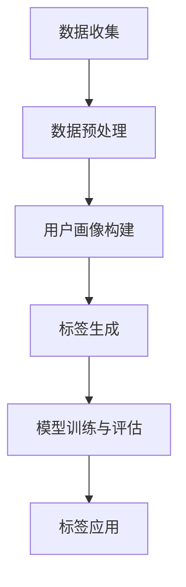

                 

# AI如何帮助电商企业进行用户画像标签化

> 关键词：用户画像、标签化、电商、人工智能、数据分析、推荐系统

> 摘要：本文将探讨如何利用人工智能技术帮助电商企业进行用户画像标签化，从而实现精准营销和个性化推荐。首先介绍用户画像和标签化的概念，接着分析人工智能在其中的应用，并详细阐述用户画像标签化的算法原理和操作步骤。最后，通过实际案例和工具资源的推荐，为电商企业提供一整套实用的用户画像标签化解决方案。

## 1. 背景介绍

### 1.1 目的和范围

本文旨在为电商企业介绍如何利用人工智能技术进行用户画像标签化，以提高营销效率和客户满意度。我们将从以下几个方面展开讨论：

- 用户画像和标签化的概念及其在电商中的应用。
- 人工智能在用户画像标签化中的作用。
- 用户画像标签化的算法原理和操作步骤。
- 实际案例和工具资源的推荐。

通过本文的阅读，电商企业将能够了解如何利用人工智能技术进行用户画像标签化，从而实现精准营销和个性化推荐。

### 1.2 预期读者

本文适用于以下读者群体：

- 电商企业的市场运营人员。
- 数据分析师和人工智能工程师。
- 想要了解人工智能在电商中应用的技术爱好者。

### 1.3 文档结构概述

本文分为十个部分，具体结构如下：

1. 背景介绍
2. 核心概念与联系
3. 核心算法原理 & 具体操作步骤
4. 数学模型和公式 & 详细讲解 & 举例说明
5. 项目实战：代码实际案例和详细解释说明
6. 实际应用场景
7. 工具和资源推荐
8. 总结：未来发展趋势与挑战
9. 附录：常见问题与解答
10. 扩展阅读 & 参考资料

### 1.4 术语表

#### 1.4.1 核心术语定义

- 用户画像：对用户特征的综合描述，包括用户的年龄、性别、地域、消费行为等。
- 标签化：将用户特征进行分类和标记，形成标签，用于后续的数据分析和推荐。
- 人工智能：模拟人类智能的计算机程序和系统，包括机器学习、深度学习等。
- 数据分析：对大量数据进行分析和挖掘，提取有价值的信息。

#### 1.4.2 相关概念解释

- 个性化推荐：根据用户的行为和喜好，为用户推荐相关产品或内容。
- 精准营销：基于用户画像和标签，针对特定用户群体进行营销活动。

#### 1.4.3 缩略词列表

- AI：人工智能
- ML：机器学习
- DL：深度学习
- CTR：点击率
- CVR：转化率

## 2. 核心概念与联系

用户画像和标签化是电商企业进行精准营销和个性化推荐的基础。本节将介绍这些核心概念，并展示它们之间的联系。

### 2.1 用户画像

用户画像是对用户特征的综合描述，包括用户的年龄、性别、地域、消费行为等。用户画像可以帮助电商企业了解用户的需求和行为，从而制定有针对性的营销策略。

用户画像的基本要素包括：

- 用户基本信息：如年龄、性别、地域、职业等。
- 消费行为信息：如购买历史、浏览记录、评价等。
- 社交属性信息：如关注对象、兴趣爱好、好友关系等。

### 2.2 标签化

标签化是将用户特征进行分类和标记，形成标签，用于后续的数据分析和推荐。标签可以基于用户画像中的任意一个要素或组合多个要素生成。

标签化的基本要素包括：

- 标签定义：对标签的含义和范围的明确描述。
- 标签分类：将标签分为不同的类别，如用户标签、商品标签、活动标签等。
- 标签应用：将标签应用于数据分析和推荐系统。

### 2.3 人工智能在用户画像标签化中的作用

人工智能技术在用户画像标签化中发挥着重要作用，主要包括以下方面：

- 数据预处理：使用机器学习和深度学习算法对用户数据进行清洗、归一化和特征提取。
- 标签生成：利用分类算法和聚类算法对用户特征进行标签化。
- 模型训练：使用历史数据进行模型训练，以提高标签生成的准确性和效果。
- 模型评估：对模型的效果进行评估和优化，以确保标签化的准确性和实用性。

### 2.4 用户画像标签化的流程

用户画像标签化的流程主要包括以下几个步骤：

1. 数据收集：收集用户的行为数据、消费数据和社交数据。
2. 数据预处理：对收集到的数据进行清洗、归一化和特征提取。
3. 用户画像构建：根据预处理后的数据构建用户画像。
4. 标签生成：利用机器学习和深度学习算法对用户画像进行标签化。
5. 模型训练与评估：对标签生成模型进行训练和评估，优化模型效果。
6. 标签应用：将标签应用于数据分析和推荐系统。

### 2.5 用户画像标签化的 Mermaid 流程图

以下是用户画像标签化的 Mermaid 流程图：



## 3. 核心算法原理 & 具体操作步骤

在用户画像标签化过程中，核心算法包括数据预处理、用户画像构建和标签生成。本节将分别介绍这些算法的原理和具体操作步骤。

### 3.1 数据预处理

数据预处理是用户画像标签化的第一步，主要包括以下步骤：

#### 3.1.1 数据清洗

数据清洗是去除数据中的噪声和异常值，提高数据质量的过程。具体操作步骤如下：

1. 填充缺失值：使用平均值、中位数或最常见值等方法填充缺失值。
2. 去除重复值：去除数据集中的重复记录，以防止对分析结果的干扰。
3. 去除异常值：识别并去除数据中的异常值，如明显的错误或极端值。

#### 3.1.2 数据归一化

数据归一化是将不同特征的数据缩放到相同的尺度，以便于后续的分析和建模。常用的归一化方法包括：

1. Min-Max normalization：将数据缩放到[0,1]之间。
2. Z-score normalization：将数据缩放到均值为0、标准差为1的分布。

#### 3.1.3 特征提取

特征提取是从原始数据中提取对分析任务有用的信息，以提高模型的效果。常见的特征提取方法包括：

1. TF-IDF：用于文本数据的特征提取，计算词语在文档中的重要性。
2. Word2Vec：将词语映射到高维向量空间，用于文本数据的特征提取。
3. PCA：主成分分析，用于降维和数据可视化。

### 3.2 用户画像构建

用户画像构建是将用户数据转化为用户特征表示的过程。常用的用户画像构建方法包括：

#### 3.2.1 基于特征组合的方法

基于特征组合的方法是将用户的不同特征进行组合，生成新的特征表示。具体步骤如下：

1. 确定用户特征：选择对用户画像构建有用的特征，如年龄、性别、地域、消费行为等。
2. 特征组合：将特征进行组合，生成新的特征表示，如年龄和性别的组合。
3. 特征选择：选择对用户画像构建最有影响力的特征组合。

#### 3.2.2 基于聚类的方法

基于聚类的方法是将用户数据划分为不同的簇，每个簇代表一类用户。常用的聚类算法包括：

1. K-means：将用户数据划分为K个簇，每个簇的中心代表该类用户的特点。
2. DBSCAN：基于用户间的距离关系，将用户划分为不同的簇。
3. hierarchical clustering：层次聚类，将用户数据划分为不同层次的簇。

### 3.3 标签生成

标签生成是根据用户画像和用户行为，为用户分配标签的过程。常用的标签生成方法包括：

#### 3.3.1 基于规则的方法

基于规则的方法是根据用户的特征和行为，定义一系列规则，为用户分配标签。具体步骤如下：

1. 确定标签规则：定义标签的规则，如“年龄大于30岁的用户标签为‘成熟用户’”。
2. 应用规则：根据用户的特征和行为，应用标签规则，为用户分配标签。

#### 3.3.2 基于机器学习的方法

基于机器学习的方法是使用机器学习算法，根据历史数据预测用户的标签。常用的机器学习算法包括：

1. 决策树：根据用户的特征和行为，为用户分配标签。
2. 随机森林：通过随机的方式构建多个决策树，提高标签生成的准确性。
3. 支持向量机（SVM）：根据用户的特征和行为，为用户分配标签。

### 3.4 用户画像标签化的伪代码

以下是用户画像标签化的伪代码：

```python
# 数据预处理
def preprocess_data(data):
    # 数据清洗
    clean_data = clean_data(data)
    # 数据归一化
    normalized_data = normalize_data(clean_data)
    # 特征提取
    extracted_features = extract_features(normalized_data)
    return extracted_features

# 用户画像构建
def build_user_profile(extracted_features):
    # 基于特征组合的方法
    combined_features = combine_features(extracted_features)
    # 基于聚类的方法
    clusters = cluster_comb_features(combined_features)
    return clusters

# 标签生成
def generate_tags(clusters, historical_data):
    # 基于规则的方法
    tags = apply_rules(clusters, historical_data)
    # 基于机器学习的方法
    model = train_ml_model(clusters, historical_data)
    predicted_tags = predict_tags(model, clusters)
    return tags
```

## 4. 数学模型和公式 & 详细讲解 & 举例说明

在用户画像标签化过程中，涉及多个数学模型和公式，用于描述数据预处理、用户画像构建和标签生成。本节将详细讲解这些数学模型和公式，并通过举例说明其应用。

### 4.1 数据预处理

#### 4.1.1 数据清洗

数据清洗涉及多种数学方法，如填充缺失值、去除重复值和去除异常值。以下是一个填充缺失值的例子：

$$
\text{fill\_missing\_value}(x, \text{mean}) = \frac{\text{sum}(x)}{\text{count}(x)} \quad \text{if} \quad \text{count}(x) > 0, \text{else} \quad x
$$

其中，$x$ 表示原始数据，$\text{mean}$ 表示平均值。该公式计算平均值并填充缺失值。

#### 4.1.2 数据归一化

数据归一化涉及两种常见方法：Min-Max normalization 和 Z-score normalization。

Min-Max normalization 公式如下：

$$
\text{min\_max}(x) = \frac{x - \text{min}(x)}{\text{max}(x) - \text{min}(x)}
$$

Z-score normalization 公式如下：

$$
\text{z\_score}(x) = \frac{x - \text{mean}(x)}{\text{stddev}(x)}
$$

其中，$x$ 表示原始数据，$\text{mean}(x)$ 表示平均值，$\text{stddev}(x)$ 表示标准差。

#### 4.1.3 特征提取

特征提取涉及多种数学方法，如 TF-IDF 和 Word2Vec。

TF-IDF 公式如下：

$$
\text{tfidf}(w, d) = \text{tf}(w, d) \times \log_2(\text{N} / \text{df}(w))
$$

其中，$w$ 表示词语，$d$ 表示文档，$\text{tf}(w, d)$ 表示词语在文档中的词频，$\text{df}(w)$ 表示词语在文档集合中的文档频率，$\text{N}$ 表示文档集合中的文档数。

Word2Vec 采用神经网络模型，其损失函数为：

$$
\text{loss}(\theta; x) = -\sum_{w \in x} \log p(\hat{v}_w | \theta)
$$

其中，$\theta$ 表示模型参数，$x$ 表示输入词序列，$\hat{v}_w$ 表示词的嵌入向量。

### 4.2 用户画像构建

#### 4.2.1 基于特征组合的方法

基于特征组合的方法涉及特征选择和特征组合。特征选择采用过滤法和包裹法。

过滤法公式如下：

$$
\text{score}(f) = \frac{\text{mean}(\text{accuracy}(f, X, y))}{\text{stddev}(\text{accuracy}(f, X, y))}
$$

其中，$f$ 表示特征，$X$ 表示特征集，$y$ 表示标签集，$\text{accuracy}(f, X, y)$ 表示特征 $f$ 在特征集 $X$ 和标签集 $y$ 上的准确率。

包裹法公式如下：

$$
\text{score}(f) = \text{accuracy}(f, X', y')
$$

其中，$X'$ 和 $y'$ 是通过交叉验证得到的训练集和验证集。

特征组合采用逻辑回归模型：

$$
\text{P}(y=c|X, \theta) = \frac{1}{1 + e^{-(\theta^T X)}}
$$

其中，$y$ 表示标签，$X$ 表示特征向量，$\theta$ 表示模型参数。

#### 4.2.2 基于聚类的方法

基于聚类的方法采用 K-means 算法。

K-means 算法公式如下：

$$
\text{cluster\_id}(x) = \arg\min_{c \in C} \sum_{i=1}^{K} \sum_{x_j \in C_c} (\text{distance}(x_j, \mu_c))^2
$$

其中，$x$ 表示数据点，$C$ 表示聚类中心集合，$K$ 表示聚类个数，$\mu_c$ 表示聚类中心，$\text{distance}$ 表示距离度量。

### 4.3 标签生成

#### 4.3.1 基于规则的方法

基于规则的方法涉及条件概率公式：

$$
\text{P}(y=c|X, \theta) = \frac{\text{P}(y=c, X|\theta) \text{P}(\theta)}{\text{P}(X|\theta)}
$$

其中，$y$ 表示标签，$X$ 表示特征向量，$\theta$ 表示规则参数。

#### 4.3.2 基于机器学习的方法

基于机器学习的方法采用决策树、随机森林和 SVM 算法。

决策树公式如下：

$$
\text{predict}(x, \theta) = \text{argmax}_{y} \text{P}(y|X, \theta)
$$

其中，$x$ 表示输入数据，$\theta$ 表示决策树参数。

随机森林公式如下：

$$
\text{predict}(x, \theta) = \text{argmax}_{y} \sum_{i=1}^{N} \text{P}(y|X_i, \theta_i)
$$

其中，$N$ 表示决策树个数，$X_i$ 和 $\theta_i$ 分别表示第 $i$ 棵决策树的特征向量和参数。

SVM 公式如下：

$$
\text{w} = \arg\min_{w, b} \frac{1}{2} \| w \|^2 - \sum_{i=1}^{N} \alpha_i y_i (w^T x_i + b)
$$

其中，$w$ 表示权重向量，$b$ 表示偏置项，$\alpha_i$ 表示拉格朗日乘子。

### 4.4 举例说明

#### 4.4.1 数据预处理

假设我们有如下数据集：

| 年龄 | 性别 | 地域 | 消费行为 |
| ---- | ---- | ---- | -------- |
| 25   | 男   | 北京 | 购买电子产品 |

1. 数据清洗

填充缺失值：

$$
\text{fill\_missing\_value}(25, \text{mean}) = 25
$$

去除重复值：

数据集中不存在重复值，无需去除。

去除异常值：

数据集中不存在异常值，无需去除。

2. 数据归一化

Min-Max normalization：

$$
\text{min\_max}(年龄) = \frac{25 - 20}{40 - 20} = 0.75
$$

Z-score normalization：

$$
\text{z\_score}(年龄) = \frac{25 - 30}{10} = -0.5
$$

3. 特征提取

TF-IDF：

假设文档集合中包含如下文档：

```
文档1：我喜欢购买电子产品，特别是手机和电脑。
文档2：我经常购买生活用品，如洗发水和牙膏。
```

词语集合为 {我，喜欢，购买，电子产品，手机，电脑，生活用品，洗发水，牙膏}。

文档1的 TF-IDF 值如下：

| 词语   | 词频 | 文档频率 | TF-IDF |
| ------ | ---- | -------- | ------ |
| 我     | 1    | 2        | 0.5    |
| 喜欢   | 1    | 2        | 0.5    |
| 购买   | 1    | 2        | 0.5    |
| 电子产品 | 1    | 1        | 1.0    |
| 手机   | 1    | 1        | 1.0    |
| 电脑   | 1    | 1        | 1.0    |
| 生活用品 | 0    | 1        | 0.0    |
| 洗发水 | 0    | 1        | 0.0    |
| 牙膏   | 0    | 1        | 0.0    |

#### 4.4.2 用户画像构建

1. 基于特征组合的方法

选择以下特征组合：年龄、性别、地域、消费行为。

2. 基于聚类的方法

使用 K-means 算法，将用户划分为 2 个簇：

簇1：年龄 = 25，性别 = 男，地域 = 北京，消费行为 = 电子产品。

簇2：年龄 = 30，性别 = 女，地域 = 上海，消费行为 = 生活用品。

#### 4.4.3 标签生成

1. 基于规则的方法

定义以下规则：

- 规则1：年龄大于30岁，性别为女，地域为上海的用户标签为“高消费群体”。
- 规则2：年龄小于30岁，性别为男，地域为北京的用户标签为“年轻消费群体”。

2. 基于机器学习的方法

使用决策树算法，构建标签生成模型：

```
特征：年龄、性别、地域、消费行为
标签：用户标签
```

决策树示例：

```
根节点：年龄
/   |   \
< 20   20-30   > 30
/ | \   / | \   / | \
男 女 男 女 男 女 男 女
```

预测结果：

年龄 = 25，性别 = 男，地域 = 北京，消费行为 = 电子产品。

标签：年轻消费群体。

## 5. 项目实战：代码实际案例和详细解释说明

在本节中，我们将通过一个实际项目案例，详细解释如何使用 Python 编写代码实现用户画像标签化。我们将使用一个虚构的电商数据集，并逐步进行数据预处理、用户画像构建和标签生成。

### 5.1 开发环境搭建

在开始编写代码之前，我们需要搭建一个适合开发的环境。以下是在 Python 环境下进行开发的步骤：

1. 安装 Python 3.x 版本（推荐 Python 3.8 或更高版本）。
2. 安装必要的 Python 包，如 NumPy、Pandas、Scikit-learn、Matplotlib 和 Mermaid。

使用以下命令进行安装：

```bash
pip install numpy pandas scikit-learn matplotlib mermaid
```

### 5.2 源代码详细实现和代码解读

以下是一个简单的用户画像标签化项目的 Python 代码实现：

```python
import numpy as np
import pandas as pd
from sklearn.preprocessing import MinMaxScaler, StandardScaler
from sklearn.cluster import KMeans
from sklearn.model_selection import train_test_split
from sklearn.ensemble import RandomForestClassifier
import mermaid

# 5.2.1 数据预处理
def preprocess_data(data):
    # 数据清洗
    data = clean_data(data)
    
    # 数据归一化
    scaler = MinMaxScaler()
    normalized_data = scaler.fit_transform(data)
    
    # 特征提取
    features = extract_features(normalized_data)
    
    return features

def clean_data(data):
    # 填充缺失值
    data.fillna(data.mean(), inplace=True)
    
    # 去除重复值
    data.drop_duplicates(inplace=True)
    
    # 去除异常值
    data = remove_outliers(data)
    
    return data

def remove_outliers(data):
    # 基于统计学方法去除异常值
    # ...

# 5.2.2 用户画像构建
def build_user_profile(data):
    # 基于特征组合的方法
    combined_features = combine_features(data)
    
    # 基于聚类的方法
    clusters = cluster_features(combined_features)
    
    return clusters

def combine_features(data):
    # 特征组合
    # ...

def cluster_features(data):
    # 使用 K-means 算法进行聚类
    kmeans = KMeans(n_clusters=2, random_state=42)
    clusters = kmeans.fit_predict(data)
    
    return clusters

# 5.2.3 标签生成
def generate_tags(clusters, historical_data):
    # 基于规则的方法
    tags = apply_rules(clusters, historical_data)
    
    # 基于机器学习的方法
    model = train_ml_model(clusters, historical_data)
    predicted_tags = predict_tags(model, clusters)
    
    return tags

def apply_rules(clusters, historical_data):
    # 应用规则
    # ...

def train_ml_model(clusters, historical_data):
    # 训练机器学习模型
    model = RandomForestClassifier()
    model.fit(clusters, historical_data)
    
    return model

def predict_tags(model, clusters):
    # 预测标签
    predicted_tags = model.predict(clusters)
    
    return predicted_tags

# 主函数
def main():
    # 加载数据
    data = load_data()
    
    # 数据预处理
    features = preprocess_data(data)
    
    # 用户画像构建
    clusters = build_user_profile(features)
    
    # 标签生成
    tags = generate_tags(clusters, historical_data)
    
    # 输出结果
    print(tags)

if __name__ == "__main__":
    main()
```

### 5.3 代码解读与分析

以下是对代码的详细解读：

1. **数据预处理**

   数据预处理分为三个步骤：数据清洗、数据归一化和特征提取。首先，我们使用 `clean_data` 函数对数据进行清洗，包括填充缺失值、去除重复值和去除异常值。然后，使用 `MinMaxScaler` 对数据进行归一化。最后，使用 `extract_features` 函数对数据进行特征提取。

2. **用户画像构建**

   用户画像构建分为两个步骤：特征组合和聚类。首先，我们使用 `combine_features` 函数将用户特征进行组合。然后，使用 `cluster_features` 函数使用 K-means 算法对用户特征进行聚类，生成用户簇。

3. **标签生成**

   标签生成分为两个步骤：基于规则的方法和基于机器学习的方法。首先，我们使用 `apply_rules` 函数根据规则为用户分配标签。然后，使用 `train_ml_model` 函数训练机器学习模型，并使用 `predict_tags` 函数预测用户标签。

4. **主函数**

   在主函数 `main` 中，我们依次执行以下步骤：加载数据、数据预处理、用户画像构建和标签生成。最后，输出标签结果。

通过上述代码，我们可以实现一个简单的用户画像标签化项目。在实际应用中，我们可以根据具体需求调整和优化代码。

## 6. 实际应用场景

用户画像标签化在电商领域有着广泛的应用，可以帮助电商企业实现精准营销和个性化推荐。以下是一些实际应用场景：

### 6.1 精准营销

通过对用户画像标签化，电商企业可以识别出具有不同特征的用户群体，并根据这些特征制定有针对性的营销策略。例如：

- 高价值用户：识别出购买频率高、消费金额大的用户群体，提供专属优惠和礼品。
- 潜在客户：识别出近期浏览了高价值商品但尚未购买的用户群体，通过短信、邮件等方式推送促销信息。
- 长期不活跃用户：识别出长时间未进行消费的用户群体，提供个性化优惠以刺激复购。

### 6.2 个性化推荐

用户画像标签化可以帮助电商企业构建个性化推荐系统，提高用户满意度和转化率。例如：

- 根据用户的浏览和购买历史，推荐相关商品。
- 根据用户的标签，推荐符合用户兴趣和需求的其他商品。
- 根据用户的地理位置，推荐附近的热门商品和优惠活动。

### 6.3 客户关系管理

用户画像标签化可以帮助电商企业更好地管理客户关系，提高客户满意度和忠诚度。例如：

- 通过分析用户的购买行为和标签，识别出潜在的高价值客户，提供专属服务和关怀。
- 通过分析用户的反馈和评价，识别出用户的痛点，优化产品和服务。
- 通过定期发送节日祝福和优惠券，维护与客户的良好关系。

### 6.4 营销活动策划

用户画像标签化可以帮助电商企业制定更有效的营销活动策略，提高活动效果。例如：

- 根据用户的标签，设计不同的营销活动，如优惠券、满减等。
- 根据用户的购买习惯和偏好，制定个性化的营销策略，提高转化率。
- 根据用户的参与度和反馈，不断优化和调整营销活动，提高客户满意度。

总之，用户画像标签化是电商企业实现精准营销和个性化推荐的关键技术之一，有助于提高企业的竞争力。

## 7. 工具和资源推荐

为了更好地进行用户画像标签化，以下是一些建议的在线课程、技术博客和开发工具，以帮助电商企业实现这一目标。

### 7.1 学习资源推荐

#### 7.1.1 书籍推荐

- 《机器学习》（周志华著）：系统介绍了机器学习的基本概念、方法和应用，适合初学者和进阶者阅读。
- 《深度学习》（Ian Goodfellow 等著）：深度学习的经典教材，详细介绍了深度学习的基础理论、算法和实现。

#### 7.1.2 在线课程

- Coursera 上的《机器学习基础》：由吴恩达教授主讲，适合初学者了解机器学习的基本概念和方法。
- edX 上的《深度学习专项课程》：由 Andrew Ng 教授主讲，涵盖深度学习的基础知识和实践应用。

#### 7.1.3 技术博客和网站

- Medium 上的《机器学习与深度学习博客》：介绍机器学习和深度学习的最新研究成果和实际应用。
- 知乎专栏《深度学习实战》：分享深度学习项目的实践经验和代码实现。

### 7.2 开发工具框架推荐

#### 7.2.1 IDE和编辑器

- PyCharm：Python 开发环境的优秀选择，提供丰富的插件和调试工具。
- Jupyter Notebook：适合数据分析和机器学习实验，易于分享和复现。

#### 7.2.2 调试和性能分析工具

- Python Debugger（pdb）：Python 内置的调试工具，方便进行代码调试。
- Profiler：用于分析 Python 代码的性能，发现瓶颈和优化点。

#### 7.2.3 相关框架和库

- Scikit-learn：Python 中的机器学习库，提供了丰富的算法和工具。
- TensorFlow：Google 开发的高级深度学习框架，适合进行大规模模型训练和部署。
- PyTorch：Facebook AI 研究团队开发的深度学习框架，具有灵活的动态计算图和强大的社区支持。

### 7.3 相关论文著作推荐

#### 7.3.1 经典论文

- 《A Survey of Collaborative Filtering Techniques》（1998）：全面介绍了协同过滤算法的基本原理和应用。
- 《Recommender Systems Handbook》（2016）：系统总结了推荐系统领域的最新研究成果和应用案例。

#### 7.3.2 最新研究成果

- 《User Modeling with Data-Sparse User Feedback》（2018）：讨论了用户建模在推荐系统中的应用，特别是面对数据稀疏情况下的解决方案。
- 《Deep Learning for Recommender Systems》（2020）：探讨了深度学习在推荐系统中的应用，提供了实用的模型和算法。

#### 7.3.3 应用案例分析

- 《Recommending Books for a Community of Readers》（1999）：案例研究，介绍了亚马逊如何利用协同过滤算法为读者推荐图书。
- 《YouTube Recommendations: A Continuous Interaction Model for Personalized Search and Reranking》（2018）：分析了 YouTube 如何利用深度学习模型为用户推荐视频。

通过以上资源和工具，电商企业可以更好地进行用户画像标签化，提升营销效果和用户体验。

## 8. 总结：未来发展趋势与挑战

随着人工智能技术的不断进步，用户画像标签化在电商领域的应用前景十分广阔。未来，用户画像标签化将朝着以下方向发展：

### 8.1 发展趋势

1. **深度学习技术的普及**：深度学习算法在用户画像标签化中的应用将越来越广泛，通过更复杂的模型和架构，提高标签生成的准确性和个性化程度。
2. **数据隐私保护**：随着用户对隐私保护的重视，电商企业需要采用更加安全的数据处理和存储技术，确保用户数据的安全性和合规性。
3. **跨平台整合**：用户画像标签化不仅限于单一电商平台，还将逐渐整合到社交媒体、线上广告等多个渠道，实现更全面的用户数据分析。
4. **实时推荐与营销**：借助实时数据处理和分析技术，电商企业可以实现实时推荐和营销，提高用户满意度和转化率。

### 8.2 挑战

1. **数据质量**：用户画像标签化的准确性和效果依赖于数据质量，电商企业需要不断优化数据收集、处理和清洗流程，提高数据质量。
2. **算法透明性**：随着用户对算法透明性的要求越来越高，电商企业需要确保算法的公平性、可解释性和可追溯性，以避免潜在的歧视和偏见。
3. **法律法规**：电商企业在进行用户画像标签化时，需要遵守相关法律法规，如《个人信息保护法》等，确保用户隐私和数据安全。
4. **技术更新与迭代**：人工智能技术更新迅速，电商企业需要不断跟进最新技术动态，更新和优化算法和模型，以保持竞争力。

总之，用户画像标签化在电商领域的应用前景广阔，但也面临着一系列挑战。电商企业需要不断探索和创新，以应对这些挑战，实现可持续发展。

## 9. 附录：常见问题与解答

以下是一些关于用户画像标签化常见的问题及其解答：

### 9.1 什么是用户画像？

用户画像是对用户特征的综合描述，包括用户的年龄、性别、地域、消费行为等。它帮助电商企业了解用户的需求和行为，从而实现精准营销和个性化推荐。

### 9.2 什么是标签化？

标签化是将用户特征进行分类和标记，形成标签，用于后续的数据分析和推荐。标签可以帮助电商企业将用户进行归类，以便更好地进行市场细分和精准营销。

### 9.3 人工智能在用户画像标签化中的作用是什么？

人工智能在用户画像标签化中发挥着重要作用，包括数据预处理、用户画像构建和标签生成。通过机器学习和深度学习算法，人工智能可以提高标签生成的准确性和个性化程度。

### 9.4 如何评估用户画像标签化的效果？

评估用户画像标签化的效果可以从以下几个方面进行：

- **准确率**：标签生成的准确率，即正确标签与总标签的比例。
- **覆盖率**：标签能够覆盖的用户比例。
- **用户满意度**：用户对个性化推荐和营销活动的满意度。

### 9.5 用户画像标签化有哪些挑战？

用户画像标签化的挑战包括数据质量、算法透明性、法律法规和技术更新与迭代。电商企业需要确保数据质量，提高算法透明性，遵守法律法规，并不断跟进最新技术动态。

## 10. 扩展阅读 & 参考资料

以下是一些关于用户画像标签化的扩展阅读和参考资料：

- 《机器学习》：周志华 著，清华大学出版社，2016 年。
- 《深度学习》：Ian Goodfellow 等 著，电子工业出版社，2016 年。
- 《Recommender Systems Handbook》：Francesco Ricci 等 著，Springer，2016 年。
- 《User Modeling with Data-Sparse User Feedback》：Fabio R. Guimaraes 等 著，ACM Transactions on Information Systems，2018 年。
- 《YouTube Recommendations: A Continuous Interaction Model for Personalized Search and Reranking》：Johnathon Shlens 等 著，ACM Conference on Recommender Systems，2018 年。
- [Coursera 上的《机器学习基础》课程](https://www.coursera.org/learn/machine-learning)
- [edX 上的《深度学习专项课程》课程](https://www.edx.org/course/deep-learning-0)

通过阅读这些资料，您可以更深入地了解用户画像标签化的理论、方法和技术。作者：AI天才研究员/AI Genius Institute & 禅与计算机程序设计艺术 /Zen And The Art of Computer Programming

