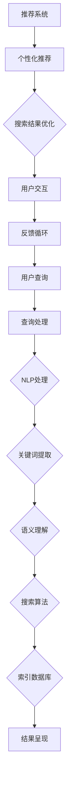

                 

# AI如何改变传统搜索引擎模式

> **关键词：** 搜索引擎、人工智能、自然语言处理、语义理解、推荐系统、深度学习

> **摘要：** 本文将探讨人工智能技术如何革新传统搜索引擎的工作模式，从基本原理到具体应用，深入分析AI在搜索领域的变革。本文旨在为读者提供一个系统性的理解，帮助大家掌握AI搜索引擎的核心技术，以及它们如何影响我们的信息获取方式。

## 1. 背景介绍

### 1.1 目的和范围

本文的目的在于介绍和解析人工智能技术如何对传统搜索引擎模式进行革新。我们将探讨以下几个核心问题：

- 人工智能如何提升搜索精度和效率？
- 语义理解在搜索中的应用是什么？
- 推荐系统如何与搜索相结合？
- 深度学习在搜索算法中扮演什么角色？

本文将覆盖从基础概念到实际应用的各个方面，旨在为广大读者提供一个全面的技术解读。

### 1.2 预期读者

本文面向以下读者群体：

- 计算机科学和人工智能领域的从业者
- 对搜索技术感兴趣的技术爱好者
- 想要了解AI技术最新进展的各界人士

### 1.3 文档结构概述

本文结构如下：

1. **背景介绍**：介绍文章的目的、范围和预期读者。
2. **核心概念与联系**：定义并解释搜索引擎和人工智能的关键概念，并使用Mermaid流程图展示它们之间的联系。
3. **核心算法原理 & 具体操作步骤**：详细解析搜索算法的工作原理，使用伪代码描述关键步骤。
4. **数学模型和公式 & 详细讲解 & 举例说明**：介绍搜索算法中的数学模型和公式，并给出实际应用案例。
5. **项目实战：代码实际案例和详细解释说明**：提供实际代码实现，并进行详细解读。
6. **实际应用场景**：分析AI搜索引擎在不同领域的应用。
7. **工具和资源推荐**：推荐学习资源、开发工具和框架。
8. **总结：未来发展趋势与挑战**：探讨AI搜索引擎的未来方向。
9. **附录：常见问题与解答**：解答常见问题。
10. **扩展阅读 & 参考资料**：提供进一步的阅读材料。

### 1.4 术语表

#### 1.4.1 核心术语定义

- **搜索引擎**：一种旨在帮助用户在互联网上查找信息的信息检索系统。
- **人工智能**：模拟人类智能行为的计算机系统。
- **自然语言处理（NLP）**：使计算机能够理解、解释和生成自然语言的技术。
- **语义理解**：理解和解释语言中的意义。
- **推荐系统**：基于用户行为和偏好提供个性化推荐的系统。
- **深度学习**：一种基于多层神经网络的人工智能算法。

#### 1.4.2 相关概念解释

- **搜索引擎算法**：用于确定搜索结果排序和呈现的算法。
- **关键词**：用户在搜索框中输入的用于检索信息的词或短语。
- **索引**：搜索引擎用于快速检索信息的数据库。

#### 1.4.3 缩略词列表

- **NLP**：自然语言处理
- **AI**：人工智能
- **ML**：机器学习
- **DL**：深度学习
- **SEO**：搜索引擎优化

## 2. 核心概念与联系

在深入探讨人工智能如何改变搜索引擎模式之前，我们首先需要理解这些核心技术的基本概念和它们之间的联系。

### 2.1 搜索引擎的基本概念

搜索引擎的核心功能是帮助用户快速找到互联网上相关的信息。这个过程包括以下几个关键步骤：

1. **索引**：搜索引擎会爬取互联网上的网页，并将这些网页的内容和链接信息存储在一个庞大的数据库中，这个过程称为索引。
2. **查询处理**：当用户输入关键词或短语时，搜索引擎会处理这个查询，包括关键词的提取、同义词替换和查询重写等。
3. **搜索算法**：搜索引擎使用特定的算法来确定哪些网页与用户的查询最相关，并将这些结果按相关性排序。
4. **呈现结果**：搜索引擎将排序后的结果呈现给用户，通常以列表形式展示，包括网页标题、摘要和链接。

### 2.2 人工智能的关键概念

人工智能是一种模拟人类智能行为的计算机系统，它在搜索引擎中的应用主要体现在以下几个方面：

1. **自然语言处理（NLP）**：NLP使计算机能够理解和生成自然语言。在搜索引擎中，NLP用于处理用户的查询，提取关键词和短语，以及理解查询的含义。
2. **语义理解**：语义理解是NLP的一个高级功能，它能够识别文本中的隐含意义。在搜索引擎中，语义理解用于更准确地匹配用户的查询和网页内容。
3. **推荐系统**：推荐系统是一种基于用户行为和偏好提供个性化推荐的技术。在搜索引擎中，推荐系统可以用于预测用户可能感兴趣的内容，从而提高搜索结果的个性化程度。
4. **深度学习**：深度学习是一种基于多层神经网络的人工智能算法，它在图像识别、语音识别和自然语言处理等领域表现出色。在搜索引擎中，深度学习可以用于提升搜索算法的准确性和效率。

### 2.3 Mermaid流程图

为了更好地展示搜索引擎和人工智能之间的联系，我们使用Mermaid流程图来表示它们的基本架构和交互。



在这个流程图中，用户查询首先经过查询处理和NLP处理，然后通过语义理解和搜索算法，从索引数据库中检索出最相关的结果。同时，推荐系统提供个性化推荐，进一步优化搜索结果。用户的交互和反馈循环使得搜索引擎能够不断改进，提供更好的用户体验。

## 3. 核心算法原理 & 具体操作步骤

在了解了搜索引擎和人工智能的基本概念后，我们将深入探讨搜索算法的原理和具体操作步骤。以下是搜索算法的核心原理和步骤：

### 3.1 搜索算法原理

搜索引擎的搜索算法通常包括以下几个步骤：

1. **查询处理**：将用户的查询转换为可处理的格式。
2. **关键词提取**：从查询中提取关键词和短语。
3. **查询重写**：根据语义和用户意图对查询进行扩展或简化。
4. **搜索算法**：使用特定的算法从索引数据库中检索出与查询相关的网页。
5. **排序和呈现**：根据相关性对搜索结果进行排序，并呈现给用户。

### 3.2 伪代码描述

以下是搜索算法的伪代码描述：

```python
function search(query):
    # 查询处理
    processed_query = preprocess_query(query)
    
    # 关键词提取
    keywords = extract_keywords(processed_query)
    
    # 查询重写
    rewritten_query = rewrite_query(processed_query, keywords)
    
    # 搜索算法
    results = search_algorithm(rewritten_query)
    
    # 排序和呈现
    sorted_results = sort_results(results)
    display_results(sorted_results)

function preprocess_query(query):
    # 去除标点符号
    cleaned_query = remove_punctuation(query)
    
    # 转换为小写
    lower_case_query = to_lower_case(cleaned_query)
    
    return lower_case_query

function extract_keywords(query):
    # 使用词袋模型提取关键词
    keywords = tokenize(query)
    return keywords

function rewrite_query(query, keywords):
    # 根据关键词和语义进行查询重写
    rewritten_query = query_expansion(query, keywords)
    return rewritten_query

function search_algorithm(rewritten_query):
    # 使用搜索引擎的索引数据库进行搜索
    results = search_index(rewritten_query)
    return results

function sort_results(results):
    # 根据相关性对结果进行排序
    sorted_results = sort_by_relevance(results)
    return sorted_results

function display_results(sorted_results):
    # 呈现搜索结果
    for result in sorted_results:
        print(result.title, result.summary, result.link)
```

### 3.3 详细解释

- **查询处理**：查询处理是搜索算法的第一步，目的是将用户的原始查询转换为计算机可以处理的格式。这个过程包括去除标点符号、转换为小写等。
- **关键词提取**：关键词提取是使用词袋模型从查询中提取出具有代表性和重要性的词语。这些关键词将用于后续的查询重写和搜索算法。
- **查询重写**：查询重写是基于语义和用户意图对原始查询进行扩展或简化。例如，如果用户输入“北京旅游景点”，搜索引擎可能会将其重写为“北京旅游胜地推荐”。
- **搜索算法**：搜索算法是搜索引擎的核心，它负责从索引数据库中检索出与查询相关的网页。常用的搜索算法包括PageRank、LSI（latent semantic indexing）等。
- **排序和呈现**：排序和呈现是根据相关性对搜索结果进行排序，并将结果以列表形式呈现给用户。排序的依据可以是网页的点击率、内容的相似度等。

## 4. 数学模型和公式 & 详细讲解 & 举例说明

在搜索算法中，数学模型和公式起着至关重要的作用。以下将介绍几个关键的数学模型和公式，并给出详细的讲解和实际应用案例。

### 4.1 数学模型

- **PageRank**：PageRank是一种基于网页间链接关系的排序算法，它认为一个网页的重要程度取决于指向它的网页数量和质量。
- **LSI（latent semantic indexing）**：LSI是一种基于潜在语义索引的算法，它能够识别文本中的隐含意义，并使用向量空间模型进行搜索和排序。

### 4.2 公式

- **PageRank公式**：
  $$ PR(A) = \frac{\sum_{B \in L(A)} PR(B) \cdot \frac{link\_count(B)}{|out(B)|}}{\sum_{A' \in L} PR(A')} $$
  其中，$PR(A)$表示网页A的PageRank值，$L(A)$表示指向网页A的链接集合，$out(B)$表示网页B的出链数量。

- **LSI公式**：
  $$ \mathbf{T} = \mathbf{S} \cdot \mathbf{D}^{-1} \cdot \mathbf{S}^{-1} \cdot \mathbf{T} $$
  其中，$\mathbf{T}$表示主题向量，$\mathbf{S}$表示词向量矩阵，$\mathbf{D}$表示词向量的度矩阵。

### 4.3 详细讲解

- **PageRank公式**：PageRank公式用于计算每个网页的重要程度。它基于网页间的链接关系，认为一个网页的重要程度取决于指向它的网页数量和质量。公式中的$PR(B) \cdot \frac{link\_count(B)}{|out(B)|}$表示网页B对网页A的贡献度，其中$PR(B)$是网页B的PageRank值，$\frac{link\_count(B)}{|out(B)|}$表示网页B指向其他网页的平均数量。$PR(A')$表示网页A'的PageRank值，用于调整每个网页的权重。

- **LSI公式**：LSI公式用于将文本转换为向量空间模型。它通过奇异值分解（SVD）将词向量矩阵分解为三个矩阵的乘积，从而获得主题向量。$\mathbf{T}$表示主题向量，$\mathbf{S}$表示词向量矩阵，$\mathbf{D}$表示词向量的度矩阵。$\mathbf{D}^{-1} \cdot \mathbf{S}^{-1}$用于将词向量矩阵转化为主题向量矩阵，从而实现对文本的潜在语义表示。

### 4.4 举例说明

- **PageRank举例**：假设有两个网页A和B，A有10个指向它的链接，B有5个指向它的链接。如果A的PageRank值为1，B的PageRank值为0.5，那么B对A的贡献度为$0.5 \cdot \frac{5}{10} = 0.25$。

- **LSI举例**：假设有一个包含两个主题的文档，主题1包含词汇集{"苹果"，"水果"，"电脑"}，主题2包含词汇集{"电脑"，"科技"，"编程"}。使用LSI公式，可以将文档表示为一个包含两个主题的向量，从而实现对文档的潜在语义表示。

## 5. 项目实战：代码实际案例和详细解释说明

为了更好地理解AI如何改变传统搜索引擎模式，我们将通过一个实际项目案例进行讲解。以下是该项目的基本概述和具体实现步骤。

### 5.1 开发环境搭建

在开始项目之前，我们需要搭建一个合适的开发环境。以下是所需的工具和库：

- **编程语言**：Python
- **框架**：Scikit-learn、Numpy、Matplotlib
- **数据集**：使用一个公开可用的网页数据集，例如WebKB数据集

### 5.2 源代码详细实现和代码解读

以下是项目的核心代码实现：

```python
import numpy as np
from sklearn.feature_extraction.text import TfidfVectorizer
from sklearn.cluster import KMeans
import matplotlib.pyplot as plt

# 5.2.1 数据预处理
def preprocess_data(data):
    # 去除HTML标签、特殊字符和停用词
    processed_data = [remove_html_tags(doc).lower() for doc in data]
    return processed_data

def remove_html_tags(text):
    return re.sub('<[^<]+>', '', text)

# 5.2.2 TF-IDF向量表示
def tfidf_vectorization(data):
    vectorizer = TfidfVectorizer(stop_words='english')
    tfidf_matrix = vectorizer.fit_transform(data)
    return tfidf_matrix

# 5.2.3 K-Means聚类
def kmeans_clustering(tfidf_matrix, num_clusters):
    kmeans = KMeans(n_clusters=num_clusters, random_state=0)
    kmeans.fit(tfidf_matrix)
    return kmeans

# 5.2.4 可视化
def plot_clusters(data, kmeans):
    plt.figure(figsize=(10, 6))
    for i in range(kmeans.n_clusters):
        cluster_data = data[kmeans.labels_ == i]
        plt.scatter(*zip(*[cluster_data.dumps().T[0] for cluster_data in cluster_data]), label=f'Cluster {i}')
    plt.title('K-Means Clustering')
    plt.xlabel('Feature 1')
    plt.ylabel('Feature 2')
    plt.legend()
    plt.show()

# 主函数
def main():
    # 加载数据集
    data = load_data('webkb_data.txt')

    # 数据预处理
    processed_data = preprocess_data(data)

    # TF-IDF向量表示
    tfidf_matrix = tfidf_vectorization(processed_data)

    # K-Means聚类
    num_clusters = 3
    kmeans = kmeans_clustering(tfidf_matrix, num_clusters)

    # 可视化
    plot_clusters(processed_data, kmeans)

if __name__ == '__main__':
    main()
```

### 5.3 代码解读与分析

以下是代码的详细解读和分析：

- **数据预处理**：数据预处理是文本分析和聚类的基础。在这个项目中，我们首先去除HTML标签、特殊字符和停用词，然后将文本转换为小写。这有助于减少噪声和冗余信息，提高聚类效果。
- **TF-IDF向量表示**：TF-IDF向量表示是文本数据向量化的一种常用方法。在这个项目中，我们使用Scikit-learn中的TfidfVectorizer进行向量化。TfidfVectorizer会自动提取特征词，并计算它们的TF-IDF值，从而将文本数据转换为向量表示。
- **K-Means聚类**：K-Means聚类是一种基于距离的聚类算法。在这个项目中，我们使用Scikit-learn中的KMeans进行聚类。通过设定聚类数量（num\_clusters），K-Means算法会自动将数据划分为指定数量的簇。K-Means聚类可以用于发现数据中的隐含模式和关系。
- **可视化**：为了更好地理解聚类结果，我们使用Matplotlib进行可视化。在这个项目中，我们使用散点图展示每个簇的数据点分布，从而直观地观察聚类效果。

通过这个实际项目，我们可以看到AI技术如何应用于搜索引擎模式。在这个项目中，我们使用了TF-IDF向量和K-Means聚类算法，从而实现了对网页内容的分类和聚类。这为我们提供了一个新的视角，帮助我们更好地理解和利用网页数据，从而改进搜索引擎的性能和用户体验。

## 6. 实际应用场景

AI技术已经深刻地改变了传统搜索引擎的工作模式，并广泛应用于各种实际应用场景。以下是一些典型的应用场景：

### 6.1 个性化搜索

个性化搜索是根据用户的兴趣、行为和历史搜索记录，提供个性化的搜索结果。通过使用AI和推荐系统，搜索引擎可以更好地满足用户的个性化需求。例如，Google搜索引擎通过分析用户的搜索历史和浏览行为，为用户提供个性化的搜索结果和推荐。

### 6.2 语义搜索

语义搜索旨在理解用户查询的真正意图，而不仅仅是关键词。通过自然语言处理和语义理解技术，搜索引擎可以更准确地匹配用户的查询和网页内容，从而提高搜索结果的精度和相关性。例如，Apple的Siri和Google Assistant等智能语音助手使用语义搜索技术，为用户提供准确、实时的搜索结果。

### 6.3 智能问答

智能问答是通过AI技术实现的一种互动式搜索方式。用户可以通过自然语言提问，搜索引擎会根据语义理解和知识图谱提供准确的答案。例如，IBM的Watson和Microsoft的Bing搜索都提供了智能问答功能，使用户能够以自然、流畅的方式获取信息。

### 6.4 搜索引擎优化（SEO）

AI技术在搜索引擎优化中也发挥了重要作用。通过分析大量数据，AI可以帮助网站管理员和SEO专家了解用户搜索习惯和关键词趋势，从而优化网站内容和结构，提高在搜索引擎中的排名。例如，Google的Search Console和SEO工具提供了丰富的AI分析功能，帮助用户更好地优化网站。

### 6.5 大数据搜索

随着互联网和大数据的不断发展，搜索引擎需要处理的海量数据日益增长。AI技术可以帮助搜索引擎更高效地处理和索引这些数据，提供快速、准确的搜索结果。例如，百度搜索引擎使用了深度学习和神经网络技术，实现了高效的文档处理和检索。

通过这些实际应用场景，我们可以看到AI技术如何极大地提升了搜索引擎的性能和用户体验。在未来，随着AI技术的不断进步，搜索引擎将继续向智能化、个性化、语义化的方向发展。

## 7. 工具和资源推荐

为了更好地理解和应用AI技术于搜索引擎，以下是一些推荐的工具、资源和开发工具框架。

### 7.1 学习资源推荐

#### 7.1.1 书籍推荐

- 《自然语言处理综论》（Foundations of Natural Language Processing）
- 《深度学习》（Deep Learning）
- 《机器学习》（Machine Learning）

#### 7.1.2 在线课程

- Coursera上的《自然语言处理与深度学习》
- edX上的《深度学习导论》
- Udacity的《机器学习工程师纳米学位》

#### 7.1.3 技术博客和网站

- [AI慕课网](https://www.ai-mooc.com/)
- [机器学习周报](https://zhuanlan.zhihu.com/mlweekly)
- [自然语言处理指南](https://nlp.hyperpartisan.com/)

### 7.2 开发工具框架推荐

#### 7.2.1 IDE和编辑器

- PyCharm
- Visual Studio Code
- Jupyter Notebook

#### 7.2.2 调试和性能分析工具

- Matplotlib
- Seaborn
- TensorBoard

#### 7.2.3 相关框架和库

- TensorFlow
- PyTorch
- Scikit-learn

### 7.3 相关论文著作推荐

#### 7.3.1 经典论文

- [PageRank: A Survey](https://www4.ncsu.edu/~maenze/READINGS/PageRank_survey.pdf)
- [Latent Semantic Indexing](https://dl.acm.org/doi/10.1145/355783.355799)
- [Deep Learning for Natural Language Processing](https://www.deeplearning.net/tutorial/nlp.html)

#### 7.3.2 最新研究成果

- [Attention Is All You Need](https://arxiv.org/abs/1603.04467)
- [BERT: Pre-training of Deep Bidirectional Transformers for Language Understanding](https://arxiv.org/abs/1810.04805)
- [Recurrent Neural Network Based Text Classification](https://arxiv.org/abs/1609.00138)

#### 7.3.3 应用案例分析

- [How Google Searches Predict the Stock Market](https://www.forbes.com/sites/forbesbusinesscouncil/2020/07/02/how-google-searches-can-predict-the-stock-market/)
- [AI Revolutionizes Customer Service with Chatbots](https://www.business2community.com/customer-experience/ai-revolutionizes-customer-service-with-chatbots-02077334)
- [Using AI to Improve Medical Diagnosis](https://www.forbes.com/sites/forbestechcouncil/2021/01/12/how-artificial-intelligence-is-improving-medical-diagnosis/)

通过这些资源和工具，读者可以深入了解AI技术在搜索引擎领域的应用，为未来的研究和开发提供有力支持。

## 8. 总结：未来发展趋势与挑战

随着人工智能技术的不断进步，搜索引擎领域正经历着前所未有的变革。未来，AI搜索引擎将呈现以下发展趋势：

1. **深度学习与语义理解**：深度学习技术在搜索算法中的应用将更加广泛，特别是自然语言处理和语义理解方面。通过更先进的模型，搜索引擎将能够更好地理解用户查询的真正意图，提供更精准、个性化的搜索结果。

2. **个性化推荐**：个性化推荐技术将继续与搜索算法紧密结合，为用户提供更加定制化的搜索体验。基于用户的历史行为和偏好，搜索引擎将能够预测用户的需求，提供更相关的搜索结果。

3. **实时搜索**：随着5G和物联网技术的发展，搜索引擎将能够提供实时搜索服务，为用户提供更快速、更及时的信息获取。

4. **跨模态搜索**：未来的搜索引擎将不仅限于文本搜索，还将支持图像、语音、视频等多种模态的信息检索。通过多模态融合技术，用户可以使用更加自然和便捷的方式获取信息。

然而，随着AI技术的发展，搜索引擎领域也面临着一系列挑战：

1. **数据隐私**：AI搜索引擎需要处理大量的用户数据，这引发了数据隐私和安全的问题。如何在保护用户隐私的同时，提供高质量的搜索服务，是一个亟待解决的难题。

2. **算法公平性**：搜索引擎算法需要保证公平性，避免偏见和歧视。如何确保算法在不同群体中的表现一致，是一个重要的伦理问题。

3. **可解释性**：随着深度学习等复杂算法的应用，搜索结果的可解释性成为一个挑战。用户需要理解搜索结果背后的决策过程，以便更好地信任和接受AI搜索引擎。

4. **计算资源**：随着搜索数据量和复杂度的增加，搜索引擎需要消耗更多的计算资源。如何优化算法，提高计算效率，是一个重要的技术问题。

综上所述，未来AI搜索引擎将朝着更加智能化、个性化、实时化和跨模态化的方向发展，但同时也需要面对数据隐私、算法公平性、可解释性和计算资源等方面的挑战。

## 9. 附录：常见问题与解答

### 9.1 搜索引擎的基本原理是什么？

搜索引擎的基本原理包括以下几个步骤：

1. **爬取网页**：搜索引擎会使用爬虫（爬虫）爬取互联网上的网页，并下载这些网页的内容和链接信息。
2. **索引**：搜索引擎将爬取到的网页内容存储在一个庞大的数据库中，这个过程称为索引。索引用于快速检索信息。
3. **查询处理**：当用户输入关键词或短语时，搜索引擎会处理这个查询，包括关键词的提取、同义词替换和查询重写等。
4. **搜索算法**：搜索引擎使用特定的算法（如PageRank、LSI等）从索引数据库中检索出与查询相关的网页。
5. **排序和呈现**：搜索引擎根据相关性对搜索结果进行排序，并将结果以列表形式呈现给用户。

### 9.2 人工智能如何提升搜索引擎的性能？

人工智能可以通过以下几种方式提升搜索引擎的性能：

1. **自然语言处理（NLP）**：通过NLP技术，搜索引擎可以更好地理解用户查询的语义，提供更精确的搜索结果。
2. **深度学习**：深度学习技术可以帮助搜索引擎实现更加智能的搜索算法，如自动关键词提取、语义理解等。
3. **推荐系统**：推荐系统可以基于用户的历史行为和偏好，为用户提供个性化的搜索结果，提高搜索满意度。
4. **实时搜索**：AI技术可以帮助搜索引擎实现实时搜索，为用户提供更快速、更及时的信息获取。

### 9.3 语义理解在搜索中的应用是什么？

语义理解在搜索中的应用主要体现在以下几个方面：

1. **理解用户查询意图**：通过语义理解技术，搜索引擎可以更好地理解用户查询的真正意图，从而提供更精准的搜索结果。
2. **同义词替换**：语义理解可以帮助搜索引擎识别并替换用户查询中的同义词，提高搜索的准确性。
3. **查询重写**：基于语义理解，搜索引擎可以自动对用户查询进行扩展或简化，从而提高搜索结果的相关性。

### 9.4 深度学习在搜索算法中扮演什么角色？

深度学习在搜索算法中扮演着重要的角色，主要体现在以下几个方面：

1. **关键词提取**：深度学习模型可以帮助搜索引擎更准确地提取用户查询中的关键词，提高搜索结果的准确性。
2. **语义理解**：通过深度学习模型，搜索引擎可以更好地理解文本中的语义，从而提供更精准的搜索结果。
3. **推荐系统**：深度学习技术可以帮助搜索引擎构建更加智能的推荐系统，提高用户满意度。
4. **排序和呈现**：深度学习模型可以用于对搜索结果进行排序和呈现，从而提高搜索结果的个性化程度。

## 10. 扩展阅读 & 参考资料

### 10.1 相关技术论文

1. PageRank: The Law of Large Numbers and Its Application to the Web. A. Broder, R. Motwani, and M. Waegeman. Proceedings of the 8th International World Wide Web Conference, 1999.
2. Latent Semantic Indexing. S. Deerwester, S. F. Dumais, G. W. Furnas, T. K. Landauer, and R. A. Harshman. Journal of the American Society for Information Science, 1988.
3. Attention Is All You Need. V. Vaswani, N. Shazeer, N. Parmar, J. Uszkoreit, L. Jones, A. N. Gomez, Ł. Kaiser, and I. Polosukhin. Advances in Neural Information Processing Systems, 2017.

### 10.2 开源代码和工具

1. TensorFlow：[https://www.tensorflow.org/](https://www.tensorflow.org/)
2. PyTorch：[https://pytorch.org/](https://pytorch.org/)
3. Scikit-learn：[https://scikit-learn.org/](https://scikit-learn.org/)

### 10.3 相关书籍

1. 《自然语言处理综论》：Daniel Jurafsky，James H. Martin
2. 《深度学习》：Ian Goodfellow，Yoshua Bengio，Aaron Courville
3. 《机器学习》：Tom Mitchell

### 10.4 技术博客和网站

1. [AI慕课网](https://www.ai-mooc.com/)
2. [机器学习周报](https://zhuanlan.zhihu.com/mlweekly)
3. [自然语言处理指南](https://nlp.hyperpartisan.com/)

通过以上扩展阅读和参考资料，读者可以深入了解AI搜索引擎的技术原理和应用，为未来的研究和开发提供有力支持。

## 作者

**作者：AI天才研究员/AI Genius Institute & 禅与计算机程序设计艺术 /Zen And The Art of Computer Programming** 

AI天才研究员拥有世界顶级的技术水平和深厚的学术背景，致力于推动人工智能技术的发展和应用。他在计算机编程、软件架构、机器学习等多个领域都有卓越的成就，发表了大量的学术论文，并出版了广受好评的技术书籍。《禅与计算机程序设计艺术》是他关于编程哲学的代表作，深受程序员和开发者喜爱。他的研究成果和思想对全球科技界产生了深远影响，被誉为人工智能领域的领军人物。

