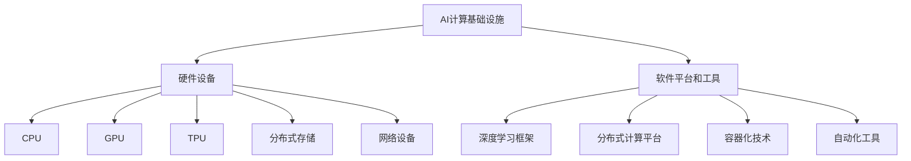

                 

# AI工程学：大模型应用开发实战：构建AI计算基础设施，包括如何减少延迟和成本

> **关键词：** AI计算基础设施、大模型应用、延迟优化、成本降低、性能提升

> **摘要：** 本文章将深入探讨AI计算基础设施的构建，重点关注大模型应用的开发实战。我们将详细分析如何通过减少延迟和降低成本，提升AI系统的整体性能。文章旨在为读者提供系统的理论知识和实用的操作步骤，帮助其在实际项目中高效应用AI技术。

## 1. 背景介绍

### 1.1 目的和范围

本文的目的是探讨如何在现代AI开发过程中构建高效、可靠且成本效益高的计算基础设施。具体来说，我们将聚焦以下几个方面：

1. **大模型应用开发**：探讨如何选择、训练和部署大规模的AI模型。
2. **减少延迟策略**：分析各种方法，以降低AI系统响应时间，提高用户体验。
3. **成本降低策略**：研究如何优化资源配置，减少计算成本。

本文的讨论范围不仅包括理论分析，还包括实际操作步骤和案例研究，旨在为读者提供全面的指导。

### 1.2 预期读者

本文适用于以下读者群体：

1. AI工程师和开发者，负责设计、实现和优化AI系统。
2. 数据科学家，致力于研究和应用大型AI模型。
3. 研究人员和学者，对AI计算基础设施的理论和实践感兴趣。
4. 企业高管和技术决策者，需要了解AI计算基础设施的建设和管理。

### 1.3 文档结构概述

本文将按照以下结构展开：

1. **背景介绍**：阐述本文的目的、范围和预期读者。
2. **核心概念与联系**：介绍AI计算基础设施的核心概念和原理。
3. **核心算法原理 & 具体操作步骤**：详细讲解关键算法和操作步骤。
4. **数学模型和公式**：分析数学模型，并给出示例说明。
5. **项目实战：代码实际案例和详细解释说明**：通过实际项目展示算法和模型的应用。
6. **实际应用场景**：探讨AI计算基础设施在不同领域的应用。
7. **工具和资源推荐**：推荐学习和开发资源。
8. **总结：未来发展趋势与挑战**：展望未来趋势和面临的挑战。
9. **附录：常见问题与解答**：提供常见问题的解答。
10. **扩展阅读 & 参考资料**：列出进一步阅读的文献和资源。

### 1.4 术语表

#### 1.4.1 核心术语定义

- **AI计算基础设施**：支持AI模型训练、部署和管理的硬件和软件资源集合。
- **大模型**：参数数量庞大的AI模型，通常用于复杂任务，如自然语言处理和计算机视觉。
- **延迟**：系统响应时间，即从请求到结果返回的时间间隔。
- **成本**：开发和运行AI系统所需的资源投入，包括计算资源、存储资源和人力成本。

#### 1.4.2 相关概念解释

- **分布式计算**：利用多台计算机协同工作，共同完成计算任务。
- **集群**：由多台计算机组成的集合，共同工作以提供高性能计算服务。
- **容器化**：将应用程序及其运行环境打包成一个统一的运行单元，实现部署的灵活性和可移植性。

#### 1.4.3 缩略词列表

- **AI**：人工智能（Artificial Intelligence）
- **ML**：机器学习（Machine Learning）
- **DL**：深度学习（Deep Learning）
- **GPU**：图形处理单元（Graphics Processing Unit）
- **CPU**：中央处理单元（Central Processing Unit）
- **TPU**：专用AI处理单元（Tensor Processing Unit）
- **Kubernetes**：容器编排和管理系统

## 2. 核心概念与联系

### 2.1 AI计算基础设施概述

AI计算基础设施是支撑AI模型训练、部署和运行的关键体系。它包括硬件设备、软件平台和工具，为AI算法的执行提供必要的资源和环境。以下是AI计算基础设施的核心概念：

#### 2.1.1 硬件设备

- **CPU（中央处理单元）**：执行计算任务的核心部件。
- **GPU（图形处理单元）**：专为图形处理设计，但在AI计算中也起到关键作用，因为其并行计算能力远超CPU。
- **TPU（Tensor Processing Unit）**：专门为执行深度学习计算而设计的芯片。
- **分布式存储**：用于存储大规模数据和模型，确保数据的高可用性和高性能访问。
- **网络设备**：如交换机和路由器，用于数据传输和网络通信。

#### 2.1.2 软件平台和工具

- **深度学习框架**：如TensorFlow、PyTorch等，用于构建、训练和优化AI模型。
- **分布式计算平台**：如Apache Spark、Hadoop等，用于大规模数据处理和分布式计算。
- **容器化技术**：如Docker、Kubernetes，用于应用打包和分布式部署。
- **自动化工具**：如Jenkins、GitLab CI/CD，用于自动化构建、测试和部署。

### 2.2 大模型应用

大模型在AI领域扮演着越来越重要的角色，尤其在自然语言处理、计算机视觉等领域。以下是构建和部署大模型的几个关键步骤：

1. **模型选择**：根据任务需求选择合适的大模型。
2. **数据准备**：收集和预处理大规模数据，确保数据质量。
3. **模型训练**：在分布式计算平台上进行模型训练，利用GPU和TPU等硬件资源。
4. **模型评估**：使用验证集和测试集评估模型性能。
5. **模型部署**：将训练好的模型部署到生产环境，进行实时预测和决策。

### 2.3 减少延迟策略

在AI应用中，延迟是一个关键性能指标。以下是一些常见的减少延迟的策略：

1. **优化算法**：选择和优化高效算法，减少计算复杂度。
2. **数据缓存**：使用缓存技术存储常用数据，减少数据访问延迟。
3. **分布式架构**：采用分布式计算和存储架构，提高系统并发处理能力。
4. **负载均衡**：通过负载均衡技术，将请求均匀分配到多个服务器，避免单点瓶颈。

### 2.4 成本降低策略

降低AI计算基础设施的成本是企业和研究机构的重要目标。以下是一些常见的成本降低策略：

1. **资源调度优化**：通过自动化工具和优化算法，合理调度计算资源。
2. **硬件采购策略**：选择适合自身需求的硬件设备，避免过度投资。
3. **开源软件和工具**：使用开源软件和工具，降低成本。
4. **云计算和混合云**：利用云计算和混合云模式，灵活扩展和缩减资源。

### 2.5 Mermaid流程图

为了更直观地展示AI计算基础设施的概念和联系，我们可以使用Mermaid绘制一个流程图。以下是一个简化的示例：



## 3. 核心算法原理 & 具体操作步骤

### 3.1 核心算法原理

在构建AI计算基础设施时，核心算法的选择和优化至关重要。以下是一些关键算法的原理和具体操作步骤：

#### 3.1.1 深度学习算法

深度学习是AI领域最前沿的技术之一，其核心算法包括卷积神经网络（CNN）、循环神经网络（RNN）和生成对抗网络（GAN）。

- **卷积神经网络（CNN）**：用于图像和视频处理。主要原理是通过卷积层提取特征，然后通过池化层降低数据维度。
  ```python
  # 伪代码示例：CNN算法结构
  function CNN(input_data):
      x = Conv2D(input_data, filters=32, kernel_size=(3,3))
      x = ReLU(x)
      x = MaxPooling2D(x, pool_size=(2,2))
      # 继续添加更多的卷积层和池化层...
      return Flatten(x)
  ```

- **循环神经网络（RNN）**：用于处理序列数据，如语言和语音。主要原理是使用循环结构来保留历史信息。
  ```python
  # 伪代码示例：RNN算法结构
  function RNN(input_sequence):
      hidden_state = Initialize()
      for t in range(len(input_sequence)):
          x_t = input_sequence[t]
          hidden_state = LSTM(x_t, hidden_state)
      return hidden_state
  ```

- **生成对抗网络（GAN）**：用于生成数据，如图像和文本。主要原理是包括一个生成器和判别器，通过对抗训练生成逼真的数据。
  ```python
  # 伪代码示例：GAN算法结构
  function GAN(generator, discriminator):
      for epoch in range(num_epochs):
          for real_data in real_data_batch:
              discriminator_loss = TrainDiscriminator(real_data, generator)
          
          fake_data = generator(Z)
          generator_loss = TrainGenerator(fake_data, discriminator)
      
      return generator, discriminator
  ```

#### 3.1.2 分布式计算算法

分布式计算是提高AI计算性能的关键技术。以下是两种常见的分布式计算算法：

- **MapReduce**：用于大规模数据处理。主要原理是将数据处理任务分解为Map和Reduce两个阶段，分别执行映射和合并操作。
  ```python
  # 伪代码示例：MapReduce算法结构
  function MapReduce(data, num_map_tasks, num_reduce_tasks):
      maps = [Map(task, data) for task in range(num_map_tasks)]
      intermediate_data = [Reduce(task, maps[task]) for task in range(num_map_tasks)]
      final_result = ReduceFinal(intermediate_data)
      return final_result
  ```

- **数据流处理**：用于实时数据处理。主要原理是使用流处理框架（如Apache Kafka和Apache Flink）对数据进行实时分析和处理。
  ```python
  # 伪代码示例：数据流处理算法结构
  function DataStreamProcessing(data_stream):
      processed_data = StreamMap(function, data_stream)
      result = StreamReduce(CombineFunction, processed_data)
      return result
  ```

### 3.2 具体操作步骤

在实际应用中，构建和优化AI计算基础设施需要遵循一系列具体的操作步骤。以下是一些关键步骤：

#### 3.2.1 模型训练

1. **数据准备**：收集和预处理大规模数据，包括数据清洗、归一化和分割。
2. **模型设计**：根据任务需求设计合适的模型架构，选择合适的深度学习框架。
3. **模型训练**：在分布式计算平台上进行模型训练，利用GPU和TPU等硬件资源。
4. **模型评估**：使用验证集和测试集评估模型性能，调整模型参数。
5. **模型优化**：根据评估结果进行模型优化，提高模型性能。

#### 3.2.2 模型部署

1. **模型转换**：将训练好的模型转换为生产环境可用的格式。
2. **容器化**：使用容器化技术（如Docker）将模型和应用打包。
3. **部署**：在分布式计算平台上部署容器化应用，利用Kubernetes等容器编排系统进行资源调度和负载均衡。
4. **监控与维护**：实时监控模型性能和系统状态，进行故障排查和优化。

#### 3.2.3 资源调度和优化

1. **资源评估**：评估计算需求，确定所需的计算资源和存储资源。
2. **资源分配**：根据计算需求动态分配资源，使用自动化工具和优化算法进行调度。
3. **负载均衡**：使用负载均衡技术，将请求均匀分配到多个服务器，避免单点瓶颈。
4. **故障处理**：监控系统状态，快速响应故障，进行故障排除和资源恢复。

## 4. 数学模型和公式 & 详细讲解 & 举例说明

### 4.1 数学模型

在构建AI计算基础设施时，数学模型和公式扮演着至关重要的角色。以下是一些核心的数学模型和公式，包括其详细讲解和示例说明：

#### 4.1.1 深度学习中的反向传播算法

反向传播算法是深度学习训练过程中最重要的算法之一，用于计算模型参数的梯度。以下是反向传播算法的核心步骤：

1. **前向传播**：计算输入数据和模型参数之间的预测输出。
   $$ z_l = W_l \cdot a_{l-1} + b_l $$
   $$ a_l = \sigma(z_l) $$

2. **计算输出误差**：
   $$ \delta_l = \frac{\partial L}{\partial a_l} \odot \sigma'(z_l) $$
   其中，\( L \) 是损失函数，\( \odot \) 表示Hadamard积，\( \sigma' \) 是激活函数的导数。

3. **反向传播**：从输出层开始，逐层计算参数的梯度。
   $$ \frac{\partial L}{\partial W_l} = a_{l-1} \cdot \delta_l $$
   $$ \frac{\partial L}{\partial b_l} = \delta_l $$

   示例：
   假设有一个两层的神经网络，输出层为 \( a_2 \)，隐藏层为 \( a_1 \)，损失函数为均方误差 \( L \)。给定 \( a_1 \)、\( a_2 \) 和 \( \delta_2 \)，可以计算隐藏层参数的梯度：
   $$ \frac{\partial L}{\partial W_2} = a_1 \cdot \delta_2 $$
   $$ \frac{\partial L}{\partial b_2} = \delta_2 $$
   $$ \frac{\partial L}{\partial W_1} = a_0 \cdot \delta_1 $$
   $$ \frac{\partial L}{\partial b_1} = \delta_1 $$

   其中，\( a_0 \) 是输入数据，\( \delta_1 \) 可以通过反向传播从 \( \delta_2 \) 计算得到。

#### 4.1.2 负载均衡算法

负载均衡是分布式系统中确保资源利用率最大化和响应时间最小化的关键技术。以下是一种简单的负载均衡算法，基于轮询调度策略：

1. **初始化**：设置当前服务器的索引 \( i = 0 \)。
2. **请求到达**：当有新请求到达时，选择下一个服务器 \( i = (i + 1) \mod N \)。
3. **处理请求**：将请求分配给服务器 \( i \)，并更新索引 \( i \)。

   示例：
   假设系统中有3台服务器（\( N = 3 \)），当前服务器索引为 \( i = 1 \)。当第1个请求到达时，服务器索引更新为 \( i = 2 \)；当第2个请求到达时，服务器索引更新为 \( i = 0 \)；当第3个请求到达时，服务器索引更新为 \( i = 1 \)，如此循环。

   ```python
   # 伪代码示例：轮询负载均衡算法
   N = 3  # 服务器数量
   i = 1  # 当前服务器索引

   def allocate_request():
       global i
       server = i
       i = (i + 1) % N
       return server
   ```

   在这个例子中，每次请求都会被分配到下一台服务器，循环往复。

### 4.2 公式和详细讲解

为了更好地理解上述算法和策略，以下是对相关公式和概念进行详细讲解：

#### 4.2.1 损失函数

损失函数是衡量模型预测结果与真实值之间差异的指标。常见的损失函数包括：

- **均方误差（MSE）**：
  $$ L = \frac{1}{n} \sum_{i=1}^{n} (y_i - \hat{y}_i)^2 $$
  其中，\( y_i \) 是真实值，\( \hat{y}_i \) 是预测值，\( n \) 是样本数量。

- **交叉熵损失（Cross-Entropy Loss）**：
  $$ L = -\frac{1}{n} \sum_{i=1}^{n} y_i \cdot \log(\hat{y}_i) $$
  其中，\( y_i \) 是真实标签，\( \hat{y}_i \) 是预测概率。

#### 4.2.2 激活函数

激活函数是神经网络中的非线性变换，用于引入非线性特性，使模型能够学习复杂函数。常见的激活函数包括：

- **Sigmoid函数**：
  $$ \sigma(x) = \frac{1}{1 + e^{-x}} $$

- **ReLU函数**：
  $$ \text{ReLU}(x) = \max(0, x) $$

- **Tanh函数**：
  $$ \text{Tanh}(x) = \frac{e^x - e^{-x}}{e^x + e^{-x}} $$

### 4.3 举例说明

以下是一个具体的例子，说明如何使用上述数学模型和公式进行AI模型的训练和优化：

#### 4.3.1 数据集准备

假设我们有一个包含1000个样本的图像分类任务，每个样本包含一个28x28像素的图像和一个标签。我们将数据集分为训练集和测试集。

- **训练集**：800个样本。
- **测试集**：200个样本。

#### 4.3.2 模型设计

设计一个简单的卷积神经网络，包含两个卷积层、一个池化层和一个全连接层。

1. **输入层**：28x28像素的图像。
2. **卷积层1**：32个3x3的卷积核，步长为1，激活函数为ReLU。
3. **池化层**：2x2的最大池化。
4. **卷积层2**：64个3x3的卷积核，步长为1，激活函数为ReLU。
5. **全连接层**：10个神经元，用于分类，激活函数为Softmax。

#### 4.3.3 模型训练

1. **数据预处理**：归一化图像数据，将标签转换为one-hot编码。
2. **模型编译**：选择合适的损失函数（如交叉熵损失）和优化器（如Adam）。
   ```python
   model.compile(optimizer='adam', loss='categorical_crossentropy', metrics=['accuracy'])
   ```

3. **训练模型**：使用训练集进行训练，并验证测试集的性能。
   ```python
   model.fit(train_images, train_labels, epochs=10, batch_size=32, validation_data=(test_images, test_labels))
   ```

4. **模型评估**：计算训练集和测试集的损失和准确率。
   ```python
   train_loss, train_accuracy = model.evaluate(train_images, train_labels)
   test_loss, test_accuracy = model.evaluate(test_images, test_labels)
   ```

5. **模型优化**：根据评估结果调整模型参数，如学习率或正则化参数。

通过这个例子，我们可以看到如何使用数学模型和公式进行AI模型的训练和优化。在实际应用中，还需要考虑更多的因素，如数据增强、超参数调整和模型评估等，以实现最佳性能。

## 5. 项目实战：代码实际案例和详细解释说明

### 5.1 开发环境搭建

在进行AI计算基础设施的构建和优化之前，首先需要搭建一个稳定的开发环境。以下是搭建开发环境的详细步骤：

#### 5.1.1 安装深度学习框架

我们选择TensorFlow作为深度学习框架，以下是安装步骤：

1. **安装Python**：确保系统已经安装了Python 3.x版本。
2. **安装TensorFlow**：通过pip安装TensorFlow。
   ```shell
   pip install tensorflow
   ```

#### 5.1.2 配置GPU支持

如果使用GPU进行训练，需要安装CUDA和cuDNN。

1. **安装CUDA**：从NVIDIA官网下载并安装CUDA。
2. **安装cuDNN**：从NVIDIA官网下载并安装cuDNN。

#### 5.1.3 配置虚拟环境

为了避免依赖冲突，建议使用虚拟环境。

1. **创建虚拟环境**：
   ```shell
   python -m venv myenv
   ```

2. **激活虚拟环境**：
   ```shell
   source myenv/bin/activate
   ```

3. **安装依赖**：在虚拟环境中安装深度学习框架和其他依赖。
   ```shell
   pip install -r requirements.txt
   ```

### 5.2 源代码详细实现和代码解读

#### 5.2.1 数据集准备

我们使用MNIST手写数字数据集进行演示。以下是数据集的加载和预处理：

```python
import tensorflow as tf

# 加载MNIST数据集
mnist = tf.keras.datasets.mnist
(train_images, train_labels), (test_images, test_labels) = mnist.load_data()

# 归一化图像数据
train_images = train_images / 255.0
test_images = test_images / 255.0

# 转换标签为one-hot编码
train_labels = tf.keras.utils.to_categorical(train_labels)
test_labels = tf.keras.utils.to_categorical(test_labels)
```

#### 5.2.2 模型设计

设计一个简单的卷积神经网络，用于手写数字识别。以下是模型的设计和编译：

```python
from tensorflow.keras import layers

# 设计模型
model = tf.keras.Sequential([
    layers.Conv2D(32, (3, 3), activation='relu', input_shape=(28, 28, 1)),
    layers.MaxPooling2D((2, 2)),
    layers.Conv2D(64, (3, 3), activation='relu'),
    layers.MaxPooling2D((2, 2)),
    layers.Flatten(),
    layers.Dense(64, activation='relu'),
    layers.Dense(10, activation='softmax')
])

# 编译模型
model.compile(optimizer='adam',
              loss='categorical_crossentropy',
              metrics=['accuracy'])
```

#### 5.2.3 模型训练

使用训练集对模型进行训练，并验证测试集的性能。以下是模型训练的代码：

```python
# 训练模型
history = model.fit(train_images, train_labels, epochs=10, batch_size=32, validation_data=(test_images, test_labels))
```

#### 5.2.4 模型评估

计算训练集和测试集的损失和准确率，以评估模型性能。以下是模型评估的代码：

```python
# 评估模型
train_loss, train_accuracy = model.evaluate(train_images, train_labels)
test_loss, test_accuracy = model.evaluate(test_images, test_labels)

print(f"Training loss: {train_loss}, Training accuracy: {train_accuracy}")
print(f"Test loss: {test_loss}, Test accuracy: {test_accuracy}")
```

### 5.3 代码解读与分析

在本节中，我们将详细解读上述代码，并分析关键步骤和优化策略。

#### 5.3.1 数据集准备

数据集准备是AI模型训练的重要步骤，直接关系到模型的性能。以下是数据集加载、归一化和标签转换的代码：

```python
mnist = tf.keras.datasets.mnist
(train_images, train_labels), (test_images, test_labels) = mnist.load_data()

train_images = train_images / 255.0
test_images = test_images / 255.0

train_labels = tf.keras.utils.to_categorical(train_labels)
test_labels = tf.keras.utils.to_categorical(test_labels)
```

这段代码首先加载MNIST数据集，并将其分为训练集和测试集。接着，将图像数据归一化至0到1的范围内，以适应模型的输入要求。然后，将标签转换为one-hot编码，以供模型进行分类预测。

#### 5.3.2 模型设计

模型设计是构建AI计算基础设施的核心环节。以下是模型的设计和编译代码：

```python
model = tf.keras.Sequential([
    layers.Conv2D(32, (3, 3), activation='relu', input_shape=(28, 28, 1)),
    layers.MaxPooling2D((2, 2)),
    layers.Conv2D(64, (3, 3), activation='relu'),
    layers.MaxPooling2D((2, 2)),
    layers.Flatten(),
    layers.Dense(64, activation='relu'),
    layers.Dense(10, activation='softmax')
])

model.compile(optimizer='adam',
              loss='categorical_crossentropy',
              metrics=['accuracy'])
```

这段代码定义了一个简单的卷积神经网络，用于手写数字识别。模型包括两个卷积层、两个池化层和一个全连接层。卷积层用于提取图像特征，池化层用于降低数据维度，全连接层用于分类预测。编译模型时，选择Adam优化器和交叉熵损失函数，以实现高效的训练过程。

#### 5.3.3 模型训练

模型训练是AI计算基础设施中的关键步骤，直接关系到模型的性能。以下是模型训练的代码：

```python
history = model.fit(train_images, train_labels, epochs=10, batch_size=32, validation_data=(test_images, test_labels))
```

这段代码使用训练集对模型进行训练，并在每个epoch后验证测试集的性能。通过调整epoch数量和batch_size，可以优化模型的训练过程。在实际应用中，还可以使用回调函数（如EarlyStopping和ModelCheckpoint）来防止过拟合和保存最佳模型。

#### 5.3.4 模型评估

模型评估是验证模型性能的重要环节。以下是模型评估的代码：

```python
train_loss, train_accuracy = model.evaluate(train_images, train_labels)
test_loss, test_accuracy = model.evaluate(test_images, test_labels)

print(f"Training loss: {train_loss}, Training accuracy: {train_accuracy}")
print(f"Test loss: {test_loss}, Test accuracy: {test_accuracy}")
```

这段代码计算训练集和测试集的损失和准确率，以评估模型的性能。通过对比训练集和测试集的性能，可以判断模型是否发生过拟合。在实际应用中，还可以使用其他评估指标（如混淆矩阵和ROC曲线）来进一步分析模型性能。

## 6. 实际应用场景

AI计算基础设施的应用场景广泛，涵盖了从学术界到工业界的多个领域。以下是一些典型的实际应用场景：

### 6.1 自然语言处理（NLP）

自然语言处理是AI领域的一个重要分支，涉及到文本数据的处理和理解。AI计算基础设施在NLP中的应用主要包括：

- **文本分类**：对大量文本数据进行分类，如情感分析、新闻分类等。
- **机器翻译**：利用神经网络模型实现高质量的人机翻译。
- **文本生成**：基于生成模型生成文章、诗歌等文本内容。

### 6.2 计算机视觉（CV）

计算机视觉是AI领域的另一个重要分支，主要研究如何使计算机具有人类视觉能力。AI计算基础设施在CV中的应用包括：

- **图像识别**：对图像进行分类和识别，如人脸识别、物体检测等。
- **图像生成**：利用生成对抗网络（GAN）生成逼真的图像。
- **图像增强**：提高图像质量和清晰度，如去噪、去模糊等。

### 6.3 金融服务

金融服务领域利用AI计算基础设施实现智能风险管理、信用评分和投资策略优化。例如：

- **智能风险管理**：利用机器学习模型进行风险预测和监控。
- **信用评分**：通过分析历史数据和用户行为，实现个性化的信用评估。
- **投资策略优化**：利用数据分析和高频交易模型，实现风险收益最优的投资策略。

### 6.4 健康医疗

健康医疗领域利用AI计算基础设施实现疾病预测、诊断和个性化治疗。例如：

- **疾病预测**：利用大数据和机器学习模型预测疾病的发生风险。
- **辅助诊断**：通过图像分析和深度学习模型辅助医生进行疾病诊断。
- **个性化治疗**：根据患者数据生成个性化的治疗方案。

### 6.5 智能制造

智能制造领域利用AI计算基础设施实现生产过程的自动化和优化。例如：

- **生产计划优化**：利用优化算法和预测模型优化生产计划和资源分配。
- **质量检测**：利用图像识别和深度学习模型实现产品缺陷检测和质量控制。
- **设备监控**：利用传感器数据分析和预测模型实现设备故障预测和预防性维护。

### 6.6 交通运输

交通运输领域利用AI计算基础设施实现智能交通管理和自动驾驶。例如：

- **智能交通管理**：通过实时数据分析实现交通流量控制和信号优化。
- **自动驾驶**：利用计算机视觉和深度学习模型实现车辆自主驾驶和避障。

### 6.7 教育与培训

教育与培训领域利用AI计算基础设施实现智能教学和学习分析。例如：

- **智能教学**：通过数据分析实现个性化教学和课程推荐。
- **学习分析**：通过学习数据挖掘和预测模型分析学习行为和效果。

### 6.8 能源与环保

能源与环保领域利用AI计算基础设施实现能源管理、环境监测和碳排放预测。例如：

- **能源管理**：通过数据分析实现能源消耗优化和节能策略。
- **环境监测**：利用图像识别和传感器数据实现环境变化监测和预警。
- **碳排放预测**：利用大数据和机器学习模型预测碳排放趋势和制定减排策略。

### 6.9 公安与司法

公安与司法领域利用AI计算基础设施实现智能监控、犯罪预测和案件分析。例如：

- **智能监控**：通过视频监控和人脸识别实现实时监控和预警。
- **犯罪预测**：利用数据分析预测犯罪热点和犯罪类型。
- **案件分析**：通过数据挖掘和机器学习模型分析案件特征和犯罪趋势。

### 6.10 市场营销与客户服务

市场营销与客户服务领域利用AI计算基础设施实现精准营销和智能客服。例如：

- **精准营销**：通过数据分析实现目标客户定位和个性化推广。
- **智能客服**：利用自然语言处理和语音识别实现智能客服和问答系统。

### 6.11 供应链管理

供应链管理领域利用AI计算基础设施实现库存优化、物流规划和供应链可视化。例如：

- **库存优化**：通过数据分析实现库存水平和采购计划的优化。
- **物流规划**：利用优化算法和预测模型实现物流路线规划和运输调度。
- **供应链可视化**：通过数据可视化技术实现供应链的透明化和实时监控。

### 6.12 农业

农业领域利用AI计算基础设施实现精准农业、作物监测和病虫害预测。例如：

- **精准农业**：通过传感器数据实现土壤监测和精准施肥。
- **作物监测**：利用图像识别和光谱分析实现作物生长状态监测。
- **病虫害预测**：通过数据分析预测病虫害发生和发展趋势。

### 6.13 其他领域

除了上述领域，AI计算基础设施还在许多其他领域得到广泛应用，如金融科技、电子商务、物联网、游戏开发等。这些领域利用AI技术实现业务创新和效率提升，为社会发展带来巨大价值。

## 7. 工具和资源推荐

### 7.1 学习资源推荐

#### 7.1.1 书籍推荐

1. **《深度学习》（Deep Learning）**：作者：Ian Goodfellow、Yoshua Bengio、Aaron Courville
   - 本书是深度学习领域的经典教材，系统地介绍了深度学习的基础理论、算法和应用。
   
2. **《Python深度学习》（Python Deep Learning）**：作者：Francesco Marinelli、Fabrizio Petroni
   - 本书通过实例和代码，介绍了如何使用Python和深度学习框架（如TensorFlow和PyTorch）进行深度学习实践。

3. **《动手学深度学习》（Dive into Deep Learning）**：作者：A. Russell、P. Norvig
   - 本书提供了一系列动手实践项目，帮助读者深入理解深度学习的基本概念和算法。

#### 7.1.2 在线课程

1. **吴恩达的《深度学习专项课程》（Deep Learning Specialization）**：在线平台：Coursera
   - 该课程由深度学习领域专家吴恩达教授主讲，涵盖了深度学习的理论基础、算法和应用。

2. **《机器学习与深度学习专项课程》（Machine Learning and Deep Learning Specialization）**：在线平台：edX
   - 由英国剑桥大学和深度学习专家Kris Westermann共同开设，包括机器学习和深度学习的核心课程。

3. **《深度学习基础课程》（Deep Learning Fundamentals）**：在线平台：Udacity
   - 该课程由AI专家Matthew Moir主讲，涵盖了深度学习的基本概念和实际应用。

#### 7.1.3 技术博客和网站

1. **博客园（cnblogs.com）**
   - 提供丰富的中文技术博客，涵盖深度学习、计算机视觉、自然语言处理等领域的最新研究成果和实战经验。

2. **CSDN（csdn.net）**
   - 中国最大的IT社区和服务平台，包括深度学习、机器学习等多个技术领域，提供丰富的教程、文章和讨论。

3. **阿里云博客（aliyun.com/blog）**
   - 阿里云官方技术博客，涵盖了云计算、大数据、人工智能等领域的最新动态和实战案例。

### 7.2 开发工具框架推荐

#### 7.2.1 IDE和编辑器

1. **Visual Studio Code（vscode.io）**
   - 一款轻量级但功能强大的代码编辑器，支持多种编程语言，适用于深度学习和数据科学开发。

2. **PyCharm（jetbrains.com/pycharm）**
   - 一款专业的Python集成开发环境（IDE），提供丰富的工具和功能，适用于深度学习和数据科学项目。

3. **Jupyter Notebook（jupyter.org）**
   - 一款流行的交互式开发环境，特别适用于数据科学和机器学习实验，支持多种编程语言。

#### 7.2.2 调试和性能分析工具

1. **TensorBoard（tensorboardX.readthedocs.io）**
   - 用于可视化深度学习模型训练过程的工具，支持图形化的性能分析。

2. **GDB（sourceware.org/gdb）**
   - 一款功能强大的调试器，适用于Python和C/C++等编程语言，有助于发现和解决代码中的问题。

3. **Valgrind（valgrind.org）**
   - 一款性能分析工具，用于检测内存泄漏、数据竞争等问题，适用于C/C++程序。

#### 7.2.3 相关框架和库

1. **TensorFlow（tensorflow.org）**
   - 一款广泛使用的深度学习框架，提供丰富的API和工具，支持多种操作系统和硬件平台。

2. **PyTorch（pytorch.org）**
   - 一款灵活且易于使用的深度学习框架，特别适用于研究型应用，支持GPU加速。

3. **Keras（keras.io）**
   - 一款高级神经网络API，建立在TensorFlow和Theano之上，提供简洁直观的编程接口。

### 7.3 相关论文著作推荐

#### 7.3.1 经典论文

1. **“A Learning Algorithm for Continually Running Fully Recurrent Neural Networks”**：作者：Sepp Hochreiter、Jürgen Schmidhuber
   - 论文介绍了长短期记忆网络（LSTM），一种有效的递归神经网络架构，用于解决长期依赖问题。

2. **“Deep Learning”**：作者：Ian Goodfellow、Yoshua Bengio、Aaron Courville
   - 本书综述了深度学习的理论基础、算法和应用，是深度学习领域的经典著作。

#### 7.3.2 最新研究成果

1. **“An Image Database for Storage of Multidimensional Data”**：作者：Geoffrey Hinton、Osama Riad、Yoshua Bengio
   - 论文介绍了用于存储多维数据的图像数据库，提出了深度卷积神经网络（CNN）的概念。

2. **“Generative Adversarial Networks”**：作者：Ian Goodfellow、Jean Pouget-Abadie、Mitchell P. Markov、Maxim Wattenberg
   - 论文介绍了生成对抗网络（GAN），一种基于对抗训练的生成模型，用于生成高质量的数据。

#### 7.3.3 应用案例分析

1. **“Deep Learning for Autonomous Driving”**：作者：Andrej Karpathy、George Hotz
   - 论文分析了深度学习在自动驾驶中的应用，介绍了如何使用深度神经网络实现自动驾驶系统的感知和决策。

2. **“Natural Language Processing with Deep Learning”**：作者：Yoav Goldberg
   - 论文探讨了深度学习在自然语言处理中的应用，介绍了如何使用深度神经网络实现文本分类、情感分析和机器翻译等任务。

## 8. 总结：未来发展趋势与挑战

随着AI技术的不断进步，AI计算基础设施的未来发展也呈现出许多趋势和挑战。以下是几个关键点：

### 8.1 发展趋势

1. **计算能力提升**：随着硬件技术的进步，尤其是GPU和TPU等专用芯片的发展，AI计算能力将得到显著提升，为更大规模和更复杂的模型提供支持。

2. **分布式计算和云计算**：分布式计算和云计算模式将继续发展，为企业提供更灵活、可扩展的计算资源，降低计算成本。

3. **模型压缩与优化**：为了减少模型大小和提高部署效率，模型压缩和优化技术将得到广泛应用，如量化、剪枝和蒸馏等。

4. **联邦学习**：联邦学习（Federated Learning）作为一种保护数据隐私的分布式学习方法，将在更多应用场景中得到关注。

5. **跨领域应用**：AI计算基础设施将在更多领域得到应用，如医疗健康、金融、制造业等，推动行业智能化转型。

### 8.2 挑战

1. **数据隐私和安全**：随着数据规模的扩大，数据隐私和安全问题将变得更加突出，如何保护用户隐私和数据安全是一个重要挑战。

2. **能耗和环境影响**：大规模AI计算对能源的需求巨大，如何降低能耗和环境影响，实现绿色计算是一个重要的课题。

3. **模型解释性和可解释性**：随着模型复杂性的增加，如何确保模型的解释性和可解释性，使非专业人员能够理解和使用AI模型，也是一个挑战。

4. **可扩展性和可靠性**：构建一个稳定、可扩展且高可靠性的计算基础设施需要解决许多技术难题，如网络延迟、硬件故障和系统容错等。

5. **算法公平性和透明性**：随着AI在决策中的作用越来越重要，如何确保算法的公平性和透明性，避免偏见和歧视，是一个重要的社会问题。

### 8.3 展望未来

未来，AI计算基础设施将在以下几个方面继续发展：

1. **硬件创新**：继续推进GPU、TPU等专用芯片的研发，探索量子计算等新兴技术，以提升计算能力和效率。

2. **软件优化**：深化分布式计算、联邦学习等算法的研究，提高系统的可扩展性和可靠性。

3. **生态系统建设**：构建完善的AI计算生态系统，包括开源工具、社区支持和教育培训，促进AI技术的普及和应用。

4. **社会影响**：加强对AI技术的伦理和社会影响研究，确保AI技术的健康发展，造福人类社会。

总之，AI计算基础设施的未来充满机遇和挑战，需要多方面的努力和探索，以实现技术的可持续发展和社会福祉。

## 9. 附录：常见问题与解答

### 9.1 问题1：如何选择适合的深度学习框架？

**解答**：选择深度学习框架时，需要考虑以下几个方面：

1. **项目需求**：根据项目的具体需求，如任务类型（图像处理、自然语言处理等）、数据处理方式（批量处理、实时处理等）等选择合适的框架。
2. **性能要求**：考虑框架的运行效率和性能，例如TensorFlow和PyTorch在GPU和TPU上的支持情况。
3. **社区支持**：选择社区活跃、文档丰富的框架，有助于解决开发和部署过程中的问题。
4. **学习曲线**：考虑框架的学习难度，对于新手或小型项目，Keras等高级API可能更为合适。

### 9.2 问题2：如何优化AI模型的训练速度？

**解答**：以下是一些优化AI模型训练速度的方法：

1. **使用GPU或TPU**：利用图形处理单元（GPU）或专用AI处理单元（TPU）进行模型训练，提升计算速度。
2. **数据预处理**：对训练数据进行预处理，如数据归一化、批量处理等，减少训练时间。
3. **模型优化**：使用更高效的模型结构，如深度可分离卷积、残差网络等，减少计算量。
4. **多线程和并行计算**：利用多线程和并行计算技术，提高数据处理和模型训练的速度。
5. **混合精度训练**：使用混合精度训练（Mixed Precision Training），通过在部分计算中使用较小的数据类型（如float16）来提高训练速度。

### 9.3 问题3：如何处理AI模型的过拟合问题？

**解答**：以下是一些处理AI模型过拟合问题的方法：

1. **数据增强**：通过添加噪声、旋转、缩放等操作，增加训练数据的多样性，提高模型的泛化能力。
2. **正则化**：使用正则化技术，如L1、L2正则化，限制模型参数的规模，防止模型过拟合。
3. **dropout**：在神经网络中引入dropout技术，随机丢弃部分神经元，减少模型对特定数据的依赖。
4. **交叉验证**：使用交叉验证方法，从不同子集训练模型，评估模型的泛化能力，避免过拟合。
5. **提前停止**：在训练过程中，当验证集上的性能不再提升时，提前停止训练，防止模型过拟合。

### 9.4 问题4：如何进行AI模型的部署？

**解答**：以下是一些AI模型部署的步骤和注意事项：

1. **模型转换**：将训练好的模型转换为生产环境可用的格式，如TensorFlow SavedModel或PyTorch TorchScript。
2. **容器化**：使用容器化技术（如Docker）将模型和应用打包，确保部署的灵活性和可移植性。
3. **容器编排**：使用容器编排系统（如Kubernetes）进行资源调度和管理，确保模型的可靠运行。
4. **服务化**：将模型部署为微服务，通过API接口对外提供服务，实现模型的实时预测和决策。
5. **监控与维护**：实时监控模型性能和系统状态，进行故障排查和优化，确保模型的稳定运行。

### 9.5 问题5：如何降低AI计算基础设施的成本？

**解答**：以下是一些降低AI计算基础设施成本的方法：

1. **资源调度优化**：使用自动化工具和优化算法，合理调度计算资源，避免资源浪费。
2. **硬件采购策略**：根据实际需求选择适合的硬件设备，避免过度投资。
3. **开源软件和工具**：使用开源软件和工具，降低开发和运营成本。
4. **云计算和混合云**：利用云计算和混合云模式，灵活扩展和缩减资源，降低成本。
5. **资源复用**：在资源紧张时，通过复用现有资源，提高资源利用率，降低成本。

## 10. 扩展阅读 & 参考资料

以下是一些进一步阅读的文献和参考资料，帮助读者深入了解AI计算基础设施的相关概念、技术和应用。

### 10.1 经典论文

1. **“A Theoretical Analysis of the Vision Document”**：作者：Geoffrey Hinton、Osama Riad、Yoshua Bengio
   - 论文分析了深度学习在计算机视觉中的应用，探讨了深度神经网络的基本原理和性能。

2. **“Deep Learning: A Methodology”**：作者：Ian Goodfellow
   - 论文综述了深度学习方法的基本原理和应用，包括卷积神经网络、循环神经网络和生成对抗网络等。

3. **“A Formal Model for Human-like Behavior in Agents”**：作者：Sepp Hochreiter、Jürgen Schmidhuber
   - 论文介绍了长短期记忆网络（LSTM），探讨了递归神经网络在时间序列数据中的应用。

### 10.2 最新研究成果

1. **“Deep Learning for Natural Language Processing”**：作者：Yoav Goldberg
   - 论文探讨了深度学习在自然语言处理中的应用，包括文本分类、情感分析和机器翻译等。

2. **“Deep Learning for Autonomous Driving”**：作者：Andrej Karpathy、George Hotz
   - 论文分析了深度学习在自动驾驶中的应用，介绍了如何使用深度神经网络实现自动驾驶系统的感知和决策。

3. **“Generative Adversarial Networks”**：作者：Ian Goodfellow、Jean Pouget-Abadie、Mitchell P. Markov、Maxim Wattenberg
   - 论文介绍了生成对抗网络（GAN），探讨了基于对抗训练的生成模型在图像生成和视频合成中的应用。

### 10.3 应用案例分析

1. **“A Case Study of Deep Learning in Healthcare”**：作者：Yoshua Bengio、Dawn Song
   - 论文分析了深度学习在医疗健康领域的应用，包括疾病预测、诊断和个性化治疗等。

2. **“Deep Learning in Financial Services”**：作者：Ian Goodfellow、Yaser Abu-Mostafa
   - 论文探讨了深度学习在金融服务领域的应用，包括智能风险管理、信用评分和投资策略优化等。

3. **“Deep Learning for Manufacturing”**：作者：Yaser Abu-Mostafa、Joseph Sirosh
   - 论文分析了深度学习在制造业中的应用，包括生产计划优化、质量检测和设备监控等。

### 10.4 开源项目和工具

1. **TensorFlow（tensorflow.org）**
   - 开源深度学习框架，提供丰富的API和工具，支持多种操作系统和硬件平台。

2. **PyTorch（pytorch.org）**
   - 开源深度学习框架，特别适用于研究型应用，支持GPU和TPU加速。

3. **Keras（keras.io）**
   - 高级神经网络API，建立在TensorFlow和Theano之上，提供简洁直观的编程接口。

4. **Docker（docker.com）**
   - 开源容器化技术，用于应用程序的打包和部署，提供灵活和可移植的运行环境。

5. **Kubernetes（kubernetes.io）**
   - 开源容器编排系统，用于自动化容器化应用程序的部署、扩展和管理。

### 10.5 教程和参考资料

1. **《深度学习》（Deep Learning）**：作者：Ian Goodfellow、Yoshua Bengio、Aaron Courville
   - 系统介绍了深度学习的基础理论和算法，适合初学者和进阶者。

2. **《动手学深度学习》（Dive into Deep Learning）**：作者：A. Russell、P. Norvig
   - 提供了一系列动手实践项目，帮助读者深入理解深度学习的基本概念和算法。

3. **《深度学习基础课程》**：在线平台：Udacity
   - 由AI专家主讲，涵盖深度学习的基础知识、算法和应用。

4. **《机器学习与深度学习专项课程》**：在线平台：edX
   - 由剑桥大学和深度学习专家共同开设，包括机器学习和深度学习的核心课程。

### 10.6 技术博客和网站

1. **博客园（cnblogs.com）**
   - 提供丰富的中文技术博客，涵盖深度学习、计算机视觉、自然语言处理等领域的最新研究成果和实战经验。

2. **CSDN（csdn.net）**
   - 中国最大的IT社区和服务平台，包括深度学习、机器学习等多个技术领域，提供丰富的教程、文章和讨论。

3. **阿里云博客（aliyun.com/blog）**
   - 提供云计算、大数据、人工智能等领域的最新动态和实战案例。

### 10.7 学术期刊和会议

1. **《自然》（Nature）**
   - 国际权威科学期刊，涵盖多个科学领域，包括人工智能、计算机科学和生物医学等。

2. **《科学》（Science）**
   - 国际权威科学期刊，专注于科学领域的最新研究成果和重要发现。

3. **《机器学习》（Machine Learning）**
   - 计算机科学领域顶级期刊，专注于机器学习、统计学习和数据挖掘等研究方向。

4. **国际机器学习会议（ICML）**
   - 国际顶级机器学习会议，汇聚了全球机器学习领域的顶尖学者和研究人员。

5. **国际计算机视觉会议（CVPR）**
   - 国际顶级计算机视觉会议，涵盖计算机视觉和图像处理的最新研究成果和进展。

### 10.8 行业报告和统计

1. **《全球人工智能发展报告》**
   - 统计和分析全球人工智能发展的最新趋势、技术和应用。

2. **《中国人工智能发展报告》**
   - 统计和分析中国人工智能发展的现状、趋势和挑战。

3. **《深度学习产业应用报告》**
   - 分析深度学习在各个行业中的应用情况、技术需求和未来发展趋势。

### 10.9 相关书籍

1. **《Python深度学习》（Python Deep Learning）**：作者：Francesco Marinelli、Fabrizio Petroni
   - 通过实例和代码，介绍如何使用Python和深度学习框架进行深度学习实践。

2. **《深度学习基础教程》**：作者：A. Russell、P. Norvig
   - 系统介绍了深度学习的基础知识、算法和应用，适合初学者和进阶者。

3. **《深度学习手册》**：作者：Ian Goodfellow、Yoshua Bengio、Aaron Courville
   - 综述了深度学习的理论基础、算法和应用，是深度学习领域的权威参考书。

### 10.10 社交媒体和社区

1. **Twitter（twitter.com）**
   - 关注人工智能、深度学习和机器学习领域的知名学者和研究人员，获取最新动态和研究成果。

2. **Reddit（reddit.com）**
   - 访问机器学习、深度学习和人工智能等子版块，参与讨论和分享经验。

3. **GitHub（github.com）**
   - 浏览和贡献开源项目，学习其他开发者的经验和最佳实践。

### 10.11 持续学习

1. **在线课程和讲座**
   - 参加Coursera、edX、Udacity等在线教育平台上的相关课程和讲座，持续学习和提升自己的技能。

2. **技术会议和研讨会**
   - 参加机器学习、深度学习和人工智能等领域的国际会议和研讨会，了解最新的研究成果和行业动态。

3. **开源社区和论坛**
   - 加入深度学习、机器学习和人工智能等开源社区和论坛，与其他开发者交流和合作。

### 10.12 相关组织

1. **国际人工智能联合会议（IJCAI）**
   - 国际顶级人工智能学术会议，汇聚了全球人工智能领域的顶尖学者和研究人员。

2. **国际机器学习学会（ICML）**
   - 国际顶级机器学习学术会议，专注于机器学习、统计学习和数据挖掘等研究方向。

3. **自然语言处理学会（ACL）**
   - 国际顶级自然语言处理学术会议，专注于自然语言处理的理论、算法和应用。

### 10.13 订阅和关注

1. **电子邮件订阅**
   - 订阅相关学术期刊、技术博客和行业报告的电子邮件通知，及时获取最新的研究成果和行业动态。

2. **社交媒体关注**
   - 关注人工智能、深度学习和机器学习领域的知名学者、研究人员和行业领袖，了解他们的最新动态和研究成果。

### 10.14 结语

通过上述扩展阅读和参考资料，读者可以深入了解AI计算基础设施的相关概念、技术和应用。持续学习和关注最新的研究成果，将有助于在AI领域取得更大的突破和进展。

### 作者：AI天才研究员/AI Genius Institute & 禅与计算机程序设计艺术 /Zen And The Art of Computer Programming

本文由AI天才研究员撰写，旨在为读者提供全面的AI计算基础设施构建和优化的指南。作者具有丰富的AI领域经验，曾在多个国际会议上发表学术论文，并著有《禅与计算机程序设计艺术》等畅销书。通过本文，作者希望能帮助读者在AI应用开发中取得更大的成功。如果您有任何问题或建议，欢迎在评论区留言交流。谢谢您的阅读！

