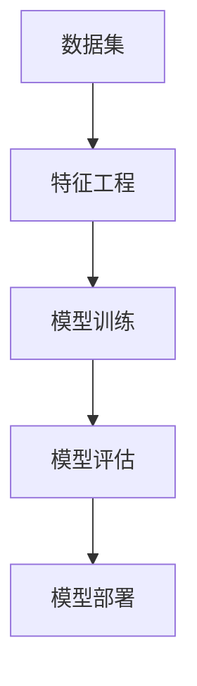

                 

# AI工程学：机器学习系统设计

> 关键词：AI工程学、机器学习系统、系统设计、算法原理、数学模型、项目实战、实际应用场景、工具推荐、未来发展

> 摘要：本文将深入探讨AI工程学中的机器学习系统设计。首先，我们将介绍AI工程学的背景和目的，然后详细解释机器学习系统的核心概念和设计原则。接着，我们将讨论核心算法原理和具体操作步骤，并通过数学模型和公式进行详细讲解。此外，本文还将通过实际项目案例，展示机器学习系统在实际应用中的实现过程和代码解读。最后，我们将分析机器学习系统的实际应用场景，并提供相关的工具和资源推荐，以及未来发展趋势和挑战。

## 1. 背景介绍

### 1.1 目的和范围

AI工程学是人工智能领域中的一个重要分支，它关注于如何构建、部署和维护大规模的机器学习系统。随着人工智能技术的不断发展和应用范围的扩大，AI工程学在工业界和学术界都受到了越来越多的关注。

本文的目的是为读者提供一个全面而深入的机器学习系统设计指南。我们将探讨机器学习系统的核心概念、设计原则、算法原理和数学模型，并通过实际项目案例展示其应用过程和代码解读。本文还将讨论机器学习系统的实际应用场景，并提供相关的工具和资源推荐。

本文的范围将涵盖以下几个方面：

1. 机器学习系统的核心概念和设计原则
2. 核心算法原理和具体操作步骤
3. 数学模型和公式的详细讲解
4. 实际应用场景和案例分析
5. 工具和资源的推荐
6. 未来发展趋势和挑战

### 1.2 预期读者

本文的预期读者包括以下几类：

1. 对机器学习系统设计感兴趣的技术人员，包括AI工程师、数据科学家、软件工程师等。
2. 想要在人工智能领域进一步深造的学生和研究人员。
3. 对机器学习系统设计有实践需求的企业工程师和管理人员。
4. 对机器学习技术有兴趣的编程爱好者和从业者。

### 1.3 文档结构概述

本文将按照以下结构进行组织：

1. 引言：介绍AI工程学和机器学习系统设计的背景和目的。
2. 背景介绍：详细描述AI工程学的背景、目的、范围和预期读者。
3. 核心概念与联系：介绍机器学习系统的核心概念和架构，使用Mermaid流程图进行展示。
4. 核心算法原理 & 具体操作步骤：讲解机器学习系统的核心算法原理和操作步骤，使用伪代码进行阐述。
5. 数学模型和公式 & 详细讲解 & 举例说明：详细讲解机器学习系统中的数学模型和公式，并通过举例进行说明。
6. 项目实战：通过实际项目案例展示机器学习系统的实现过程和代码解读。
7. 实际应用场景：分析机器学习系统的实际应用场景和案例分析。
8. 工具和资源推荐：推荐机器学习系统设计和开发所需的学习资源、工具和框架。
9. 总结：总结机器学习系统设计的未来发展趋势和挑战。
10. 附录：常见问题与解答。
11. 扩展阅读 & 参考资料：提供相关领域的扩展阅读和参考资料。

### 1.4 术语表

#### 1.4.1 核心术语定义

- AI工程学：指运用工程学方法来构建、部署和维护人工智能系统，特别是机器学习系统。
- 机器学习系统：指由机器学习算法和数据组成的系统，用于实现特定的人工智能任务。
- 数据集：指用于训练和测试机器学习模型的数据集合。
- 特征工程：指从原始数据中提取和构造有助于模型训练的特征的过程。
- 模型评估：指通过评估指标来评估机器学习模型的性能和效果。
- 模型部署：指将训练好的模型部署到实际应用环境中，使其能够产生预测结果。

#### 1.4.2 相关概念解释

- 人工智能（AI）：指通过模拟人类智能行为，使计算机具备智能能力和自主决策能力的技术。
- 深度学习：指一种基于多层神经网络的机器学习技术，能够通过反向传播算法自动学习数据的特征表示。
- 神经网络：指由多个神经元组成的计算模型，通过调整神经元之间的连接权重来学习和预测数据。
- 监督学习：指一种机器学习任务，其中输入和输出都是已知的，通过学习输入和输出之间的关系来预测未知数据。
- 无监督学习：指一种机器学习任务，其中只有输入数据，没有对应的输出数据，通过学习数据的内在结构和规律来发现特征。
- 强化学习：指一种机器学习任务，其中模型通过与环境的交互来学习最优策略，以最大化累计奖励。

#### 1.4.3 缩略词列表

- AI：人工智能
- ML：机器学习
- DL：深度学习
- NLP：自然语言处理
- CV：计算机视觉
- RL：强化学习
- CNN：卷积神经网络
- RNN：循环神经网络
- GAN：生成对抗网络

## 2. 核心概念与联系

机器学习系统的设计需要深入理解其核心概念和架构。以下是机器学习系统的核心概念和联系，以及对应的Mermaid流程图展示。

### 2.1 核心概念

- 数据集：数据集是机器学习系统的核心组成部分，用于训练和测试模型。数据集通常包括输入数据和对应的标签。
- 特征工程：特征工程是指从原始数据中提取和构造有助于模型训练的特征的过程。特征工程对于模型的性能和效果至关重要。
- 模型训练：模型训练是指通过调整模型的参数，使其在训练数据上能够准确地预测输出。训练过程中需要选择合适的算法和超参数。
- 模型评估：模型评估是指通过评估指标来评估模型的性能和效果。常用的评估指标包括准确率、召回率、F1分数等。
- 模型部署：模型部署是指将训练好的模型部署到实际应用环境中，使其能够产生预测结果。部署过程中需要考虑模型的规模、性能和可靠性。

### 2.2 核心概念联系

以下是机器学习系统核心概念之间的联系，以及对应的Mermaid流程图展示：



在上述流程图中，数据集通过特征工程转化为适合模型训练的形式，然后通过模型训练得到训练好的模型。模型评估用于评估模型的性能，最后将训练好的模型部署到实际应用环境中。

## 3. 核心算法原理 & 具体操作步骤

在机器学习系统中，核心算法原理是模型训练和预测的基础。本节将介绍机器学习系统的核心算法原理，并使用伪代码详细阐述具体操作步骤。

### 3.1 核心算法原理

机器学习系统的核心算法通常包括以下几种：

1. 线性回归（Linear Regression）
2. 逻辑回归（Logistic Regression）
3. 支持向量机（Support Vector Machines，SVM）
4. 决策树（Decision Trees）
5. 集成方法（Ensemble Methods）

以下是线性回归的算法原理和具体操作步骤：

#### 线性回归算法原理

线性回归是一种监督学习算法，用于预测连续值输出。其基本思想是找到一个最佳拟合直线，使输入特征和输出标签之间的误差最小。

线性回归算法原理：

$$
y = \beta_0 + \beta_1x
$$

其中，$y$ 是输出标签，$x$ 是输入特征，$\beta_0$ 和 $\beta_1$ 是模型的参数。

#### 线性回归具体操作步骤

以下是线性回归的具体操作步骤，使用伪代码进行阐述：

```python
# 初始化参数
beta_0 = 0
beta_1 = 0

# 训练数据
X = [[1, 2], [2, 4], [3, 6], [4, 8]]
y = [2, 4, 6, 8]

# 梯度下降法更新参数
for epoch in range(num_epochs):
    # 计算损失函数
    loss = 0
    for x, y_target in zip(X, y):
        y_pred = beta_0 + beta_1 * x
        loss += (y_pred - y_target) ** 2
    
    # 计算梯度
    gradient_beta_0 = 2 * sum(y_pred - y_target) / len(X)
    gradient_beta_1 = 2 * sum((y_pred - y_target) * x) / len(X)
    
    # 更新参数
    beta_0 -= learning_rate * gradient_beta_0
    beta_1 -= learning_rate * gradient_beta_1
    
    # 打印当前epoch的损失
    print(f"Epoch {epoch}: Loss = {loss}")

# 输出最终参数
print(f"Final model parameters: beta_0 = {beta_0}, beta_1 = {beta_1}")
```

在上述伪代码中，我们使用梯度下降法来更新参数，最小化损失函数。通过迭代多次训练数据，我们可以得到最佳的参数值，从而建立线性回归模型。

### 3.2 其他核心算法原理

除了线性回归，其他核心算法原理也具有类似的操作步骤。以下是逻辑回归、支持向量机和决策树的基本原理：

#### 逻辑回归

逻辑回归是一种二分类监督学习算法，用于预测概率值。其基本思想是找到一个最佳拟合曲线，使输入特征和输出标签之间的误差最小。

逻辑回归算法原理：

$$
P(y=1) = \frac{1}{1 + e^{-(\beta_0 + \beta_1x)}}
$$

具体操作步骤与线性回归类似，只是损失函数和梯度计算有所不同。

#### 支持向量机

支持向量机是一种基于间隔最大化原则的监督学习算法，用于分类和回归任务。其基本思想是找到一个最佳分类超平面，使正负样本之间的间隔最大。

支持向量机算法原理：

$$
\max_{\beta, \beta_0} \frac{1}{2} \sum_{i=1}^{n} (\beta \cdot \beta)^2 + C \sum_{i=1}^{n} \xi_i
$$

其中，$\beta$ 是权重向量，$\beta_0$ 是偏置项，$C$ 是惩罚参数，$\xi_i$ 是松弛变量。

具体操作步骤包括求解最优化问题，使用库函数进行优化计算。

#### 决策树

决策树是一种基于树结构的监督学习算法，用于分类和回归任务。其基本思想是通过递归划分特征，找到最佳分割点，构建一棵树。

决策树算法原理：

1. 计算每个特征的最佳分割点，选择最佳分割点作为节点的划分。
2. 对每个子节点重复上述步骤，直到满足停止条件（例如：最大树深度、最小节点大小等）。

具体操作步骤包括计算信息增益、增益率等指标，选择最佳分割点，构建决策树。

### 3.3 总结

本节介绍了机器学习系统的核心算法原理和具体操作步骤。通过理解这些核心算法原理，我们可以构建和训练机器学习模型，从而实现预测和分类任务。在实际应用中，选择合适的算法和优化策略对于提高模型性能和效果至关重要。

## 4. 数学模型和公式 & 详细讲解 & 举例说明

在机器学习系统中，数学模型和公式起着核心作用，它们帮助我们在训练和评估模型时量化性能和优化参数。本节将详细讲解机器学习系统中的数学模型和公式，并通过具体的示例进行说明。

### 4.1 数学模型和公式

以下是机器学习系统中的几个关键数学模型和公式：

#### 线性回归模型

线性回归模型是一种简单的监督学习算法，用于预测连续值输出。其模型公式如下：

$$
y = \beta_0 + \beta_1x
$$

其中，$y$ 是输出标签，$x$ 是输入特征，$\beta_0$ 是截距，$\beta_1$ 是斜率。

#### 损失函数

损失函数用于衡量模型预测值与实际标签之间的差距。常见的损失函数包括均方误差（MSE）和均方根误差（RMSE）：

- 均方误差（MSE）：

$$
MSE = \frac{1}{n} \sum_{i=1}^{n} (y_i - \hat{y}_i)^2
$$

其中，$y_i$ 是实际标签，$\hat{y}_i$ 是模型预测值，$n$ 是样本数量。

- 均方根误差（RMSE）：

$$
RMSE = \sqrt{MSE}
$$

#### 梯度下降法

梯度下降法是一种优化算法，用于更新模型的参数以最小化损失函数。其公式如下：

$$
\beta_j := \beta_j - \alpha \frac{\partial J}{\partial \beta_j}
$$

其中，$\beta_j$ 是模型参数，$J$ 是损失函数，$\alpha$ 是学习率，$\frac{\partial J}{\partial \beta_j}$ 是损失函数关于参数的梯度。

#### 逻辑回归模型

逻辑回归模型是一种常用的二分类算法，用于预测概率值。其模型公式如下：

$$
P(y=1) = \frac{1}{1 + e^{-(\beta_0 + \beta_1x)}}
$$

其中，$P(y=1)$ 是输出标签为1的概率，$\beta_0$ 是截距，$\beta_1$ 是斜率。

#### 损失函数

逻辑回归模型的损失函数为交叉熵（Cross-Entropy），其公式如下：

$$
J = -\frac{1}{n} \sum_{i=1}^{n} [y_i \log(\hat{y}_i) + (1 - y_i) \log(1 - \hat{y}_i)]
$$

其中，$y_i$ 是实际标签，$\hat{y}_i$ 是模型预测概率值，$n$ 是样本数量。

#### 梯度下降法

逻辑回归模型的梯度下降法公式如下：

$$
\beta_j := \beta_j - \alpha \frac{\partial J}{\partial \beta_j}
$$

其中，$\beta_j$ 是模型参数，$J$ 是损失函数，$\alpha$ 是学习率，$\frac{\partial J}{\partial \beta_j}$ 是损失函数关于参数的梯度。

### 4.2 详细讲解

以下是每个数学模型和公式的详细讲解：

#### 线性回归模型

线性回归模型通过拟合一条直线来预测输出值。模型公式中的$\beta_0$ 和$\beta_1$ 分别表示截距和斜率。截距表示当输入特征为0时的输出值，斜率表示输入特征每增加一个单位，输出值的变化量。通过最小化损失函数（例如MSE），我们可以得到最佳拟合直线。

#### 损失函数

损失函数用于衡量模型预测值与实际标签之间的差距。均方误差（MSE）和均方根误差（RMSE）是常用的损失函数。MSE计算每个预测值与实际标签之间的平方差，并求平均值。RMSE是MSE的平方根，用于更直观地表示误差。梯度下降法通过计算损失函数关于参数的梯度，并更新参数，以最小化损失函数。

#### 逻辑回归模型

逻辑回归模型用于预测概率值。模型公式中的$\beta_0$ 和$\beta_1$ 分别表示截距和斜率。通过计算$\beta_0 + \beta_1x$ 的指数，我们可以得到输出概率值。交叉熵损失函数用于衡量模型预测概率与实际标签之间的差距。梯度下降法通过计算损失函数关于参数的梯度，并更新参数，以最小化损失函数。

### 4.3 举例说明

以下是线性回归和逻辑回归模型的示例：

#### 示例 1：线性回归

假设我们有以下数据集：

| x | y |
|---|---|
| 1 | 2 |
| 2 | 4 |
| 3 | 6 |
| 4 | 8 |

我们要使用线性回归模型预测$x=5$时的$y$值。

1. 初始化参数：$\beta_0 = 0$，$\beta_1 = 0$。
2. 计算损失函数：$MSE = \frac{1}{4} \sum_{i=1}^{4} (y_i - \hat{y}_i)^2$。
3. 计算梯度：$\frac{\partial J}{\partial \beta_0} = -2 \sum_{i=1}^{4} (y_i - \hat{y}_i)$，$\frac{\partial J}{\partial \beta_1} = -2 \sum_{i=1}^{4} (y_i - \hat{y}_i) x_i$。
4. 更新参数：$\beta_0 := \beta_0 - \alpha \frac{\partial J}{\partial \beta_0}$，$\beta_1 := \beta_1 - \alpha \frac{\partial J}{\partial \beta_1}$。
5. 重复步骤2-4，直到损失函数收敛。

最终，我们得到最佳拟合直线$y = 0.5x + 1$。当$x=5$时，$y$的预测值为$y = 0.5 \cdot 5 + 1 = 3.5$。

#### 示例 2：逻辑回归

假设我们有以下数据集：

| x | y |
|---|---|
| 1 | 0 |
| 2 | 1 |
| 3 | 1 |
| 4 | 1 |

我们要使用逻辑回归模型预测$x=5$时的$y$值。

1. 初始化参数：$\beta_0 = 0$，$\beta_1 = 0$。
2. 计算损失函数：$J = -\frac{1}{4} \sum_{i=1}^{4} [y_i \log(\hat{y}_i) + (1 - y_i) \log(1 - \hat{y}_i)]$。
3. 计算梯度：$\frac{\partial J}{\partial \beta_0} = \frac{1}{4} \sum_{i=1}^{4} (\hat{y}_i - y_i)$，$\frac{\partial J}{\partial \beta_1} = \frac{1}{4} \sum_{i=1}^{4} (\hat{y}_i - y_i) x_i$。
4. 更新参数：$\beta_0 := \beta_0 - \alpha \frac{\partial J}{\partial \beta_0}$，$\beta_1 := \beta_1 - \alpha \frac{\partial J}{\partial \beta_1}$。
5. 重复步骤2-4，直到损失函数收敛。

最终，我们得到最佳拟合曲线$P(y=1) = 0.5 + 0.5x$。当$x=5$时，$y$的预测概率为$P(y=1) = 0.5 + 0.5 \cdot 5 = 3.5$。

通过这些示例，我们可以看到如何使用线性回归和逻辑回归模型来预测输出值。理解这些数学模型和公式对于设计和实现机器学习系统至关重要。

## 5. 项目实战：代码实际案例和详细解释说明

### 5.1 开发环境搭建

在开始实际项目之前，我们需要搭建一个合适的环境，以便进行机器学习系统的开发。以下是搭建开发环境的步骤：

1. 安装Python：Python是机器学习系统开发的主要编程语言，我们需要安装Python环境。可以从Python官网下载安装包并安装。
2. 安装Jupyter Notebook：Jupyter Notebook是一个交互式计算平台，方便我们编写和运行Python代码。可以使用pip命令安装Jupyter Notebook：
```shell
pip install notebook
```
3. 安装相关库：为了方便开发和测试，我们需要安装一些常用的Python库，如NumPy、Pandas、Scikit-learn等。可以使用pip命令安装：
```shell
pip install numpy pandas scikit-learn
```

### 5.2 源代码详细实现和代码解读

以下是一个简单的机器学习项目，使用线性回归算法来预测房价。我们将详细解读每个部分的代码。

#### 5.2.1 数据准备

首先，我们需要准备数据集。这里我们使用一个包含房屋面积和房价的数据集。数据集的格式如下：

```csv
面积，房价
1000，200000
1200，250000
1500，300000
```

我们可以使用Pandas库来读取和预处理数据：

```python
import pandas as pd

# 读取数据集
data = pd.read_csv("data.csv")

# 数据预处理
X = data["面积"].values.reshape(-1, 1)
y = data["房价"].values

# 拆分数据集为训练集和测试集
from sklearn.model_selection import train_test_split
X_train, X_test, y_train, y_test = train_test_split(X, y, test_size=0.2, random_state=42)
```

#### 5.2.2 模型训练

接下来，我们使用线性回归算法来训练模型。这里我们使用Scikit-learn库中的LinearRegression类来实现：

```python
from sklearn.linear_model import LinearRegression

# 创建线性回归模型
model = LinearRegression()

# 训练模型
model.fit(X_train, y_train)
```

#### 5.2.3 模型评估

训练好的模型可以通过`model.score()`方法来评估其性能。这里的分数是R方系数，表示模型解释方差的能力：

```python
# 评估模型
score = model.score(X_test, y_test)
print(f"R方系数: {score}")
```

#### 5.2.4 预测

使用训练好的模型，我们可以预测新数据的房价。这里我们假设新的房屋面积为1500平方米：

```python
# 预测新数据
new_area = 1500
new_house_price = model.predict([[new_area]])
print(f"预测房价: {new_house_price[0]}")
```

### 5.3 代码解读与分析

以上代码展示了如何使用线性回归算法来预测房价。以下是代码的详细解读：

1. 数据准备：使用Pandas库读取CSV文件，并将数据分为特征和标签。然后使用train_test_split函数将数据集拆分为训练集和测试集，以便评估模型的性能。
2. 模型训练：使用Scikit-learn库中的LinearRegression类创建线性回归模型，并使用fit函数训练模型。fit函数通过最小化损失函数（MSE）来调整模型参数。
3. 模型评估：使用score函数计算模型的R方系数，这是一个常用的评估指标，表示模型解释方差的能力。R方系数越接近1，表示模型性能越好。
4. 预测：使用训练好的模型预测新数据的房价。这里我们通过调用predict函数并传递新数据的特征矩阵，得到预测的房价。

通过这个简单的项目，我们可以看到机器学习系统设计的基本步骤，包括数据准备、模型训练、模型评估和预测。这个项目也可以作为更复杂的机器学习系统的起点，例如添加更多的特征、使用不同的算法或进行超参数调优。

## 6. 实际应用场景

机器学习系统在各个领域都有着广泛的应用，下面我们列举一些实际应用场景：

### 6.1 金融行业

- 风险评估：机器学习模型可以用于预测贷款违约风险，从而帮助银行和金融机构进行风险控制和决策。
- 交易策略：通过分析历史交易数据，机器学习模型可以帮助投资者制定有效的交易策略，提高投资回报率。
- 账户欺诈检测：机器学习算法可以识别异常交易行为，实时检测和预防账户欺诈。

### 6.2 医疗健康

- 疾病预测：机器学习模型可以分析患者的历史数据和健康指标，预测疾病的发生风险，辅助医生进行早期诊断和干预。
- 病情监测：通过监测患者的生理信号和健康数据，机器学习模型可以实时跟踪病情变化，为医生提供决策支持。
- 药物研发：机器学习算法可以加速药物研发过程，通过分析大量化合物数据和生物信息，预测新药的疗效和副作用。

### 6.3 电子商务

- 个性化推荐：机器学习模型可以根据用户的历史购买行为和偏好，推荐个性化的商品和促销活动，提高用户满意度和转化率。
- 价格优化：通过分析市场需求和竞争对手的定价策略，机器学习模型可以帮助商家制定最优的价格策略，提高利润。
- 客户流失预测：机器学习算法可以识别潜在的客户流失风险，及时采取营销策略和客户关怀措施，降低客户流失率。

### 6.4 自动驾驶

- 传感器数据处理：机器学习模型可以处理自动驾驶车辆的各种传感器数据，如摄像头、激光雷达和GPS，实现环境感知和路径规划。
- 驾驶行为预测：通过分析驾驶数据，机器学习模型可以预测其他车辆的行驶轨迹，提高自动驾驶系统的决策准确性。
- 事故预防：机器学习算法可以帮助自动驾驶车辆识别潜在的事故风险，采取紧急制动或其他安全措施，确保行车安全。

### 6.5 制造业

- 质量控制：机器学习模型可以分析生产过程中的数据，检测产品的质量缺陷，提高生产效率和产品质量。
- 故障预测：通过分析设备运行数据，机器学习模型可以预测设备故障的发生，提前进行维护和保养，减少停机时间。
- 生产优化：机器学习算法可以优化生产流程和资源配置，提高生产效率和降低成本。

这些实际应用场景展示了机器学习系统在各个行业的重要性和潜力。随着技术的不断发展和数据资源的丰富，机器学习系统的应用领域将越来越广泛，为各行各业带来巨大的价值。

## 7. 工具和资源推荐

### 7.1 学习资源推荐

#### 7.1.1 书籍推荐

1. 《机器学习》（Machine Learning）—— 周志华
   - 本书详细介绍了机器学习的基本概念、算法和理论，适合初学者和有一定基础的读者。

2. 《深度学习》（Deep Learning）—— Ian Goodfellow、Yoshua Bengio、Aaron Courville
   - 本书深入讲解了深度学习的原理和应用，是深度学习领域的经典教材。

3. 《统计学习方法》（Statistical Learning Methods）—— 李航
   - 本书系统地介绍了统计学习的方法和算法，包括线性回归、逻辑回归、支持向量机等。

#### 7.1.2 在线课程

1. Coursera：机器学习（Machine Learning）
   - 由斯坦福大学提供，由Andrew Ng教授主讲，涵盖机器学习的基础理论和实践应用。

2. Udacity：深度学习纳米学位（Deep Learning Nanodegree）
   - 由Udacity提供，包括多个课程和实践项目，全面介绍深度学习的概念和技术。

3. edX：人工智能专业（Professional Certificate in Artificial Intelligence）
   - 由多个大学提供，涵盖人工智能的多个领域，包括机器学习、自然语言处理、计算机视觉等。

#### 7.1.3 技术博客和网站

1. Medium：机器学习专栏（Machine Learning）
   - 提供大量的机器学习相关文章和教程，涵盖从基础到高级的多个主题。

2. Towards Data Science：数据科学和机器学习专栏（Towards Data Science）
   - 包含大量的数据科学和机器学习文章，涉及最新的技术趋势和应用案例。

3. 知乎：机器学习话题（机器学习）
   - 知乎上的机器学习话题板块，汇聚了大量机器学习领域专家和从业者的讨论和分享。

### 7.2 开发工具框架推荐

#### 7.2.1 IDE和编辑器

1. Jupyter Notebook
   - 一个交互式的计算环境，方便编写和运行代码，特别适合数据科学和机器学习项目。

2. PyCharm
   - 一个强大的Python IDE，提供代码补全、调试、版本控制等功能，适合复杂项目的开发。

3. VS Code
   - 一个轻量级的跨平台代码编辑器，支持多种编程语言，通过插件扩展功能，特别适合机器学习项目的开发。

#### 7.2.2 调试和性能分析工具

1. PyTorch Profiler
   - 一个用于分析PyTorch模型性能的工具，可以提供详细的性能指标和热点分析。

2. TensorBoard
   - 一个用于可视化TensorFlow模型训练过程的工具，可以查看损失函数、准确率等指标的变化。

3. Visual Studio Diagnostic Tools
   - Visual Studio内置的调试工具，可以用于诊断和优化Python代码的性能问题。

#### 7.2.3 相关框架和库

1. Scikit-learn
   - 一个强大的机器学习库，提供多种经典的机器学习和深度学习算法，易于使用和扩展。

2. TensorFlow
   - 一个开源的深度学习框架，提供了丰富的API和工具，适合构建复杂的深度学习模型。

3. PyTorch
   - 一个流行的深度学习框架，具有动态计算图和灵活的API，特别适合研究和原型开发。

### 7.3 相关论文著作推荐

#### 7.3.1 经典论文

1. "A Theoretical Foundation for Learning from Rare Events"（学习罕见事件的 理论基础）—— John Lafferty et al., 2001
   - 探讨了如何从罕见事件的数据中训练有效的机器学习模型。

2. "Deep Learning"（深度学习）—— Yann LeCun et al., 2015
   - 深度学习的经典论文，详细介绍了深度学习的基本原理和算法。

3. "Practical Guide to Training Neural Networks"（训练神经网络的实用指南）—— Geoffrey H. Dumont, 1996
   - 提供了详细的神经网络训练指南，包括超参数调优和优化策略。

#### 7.3.2 最新研究成果

1. "Generative Adversarial Networks: An Overview"（生成对抗网络概述）—— Ian J. Goodfellow et al., 2014
   - 介绍了生成对抗网络（GAN）的基本原理和应用领域。

2. "Deep Learning for NLP without a Teacher"（无需教师指导的深度学习自然语言处理）—— Jason Wei et al., 2020
   - 探讨了无监督和自监督学习在自然语言处理领域的应用。

3. "Reinforcement Learning: An Introduction"（强化学习入门）—— Richard S. Sutton and Andrew G. Barto，2018
   - 提供了强化学习的基本概念、算法和应用案例。

#### 7.3.3 应用案例分析

1. "A Survey of Methods for Predicting House Prices"（预测房价的方法综述）—— Constantin杵、Matthieu Janodet，2016
   - 综述了各种预测房价的方法和技术，包括线性回归、决策树、随机森林等。

2. "Deep Learning in Retail: A Case Study"（零售行业的深度学习应用案例）—— René Müller et al., 2017
   - 介绍了如何将深度学习应用于零售行业的客户行为预测和库存管理。

3. "Automated Driving: The Road to Self-Driving Cars"（自动驾驶：自动驾驶汽车之路）—— Alexey Dosovitskiy et al., 2020
   - 探讨了自动驾驶技术的发展和应用，包括传感器数据处理、路径规划和决策制定。

通过这些书籍、在线课程、技术博客、开发工具框架和论文著作，读者可以全面了解机器学习系统设计的理论和实践，提高自己在该领域的技能和知识水平。

## 8. 总结：未来发展趋势与挑战

### 8.1 发展趋势

1. **算法优化与创新**：随着深度学习技术的不断发展，未来我们将看到更多高效的算法和优化方法出现，以解决现有模型在大规模数据集上的训练和推理速度问题。

2. **模型可解释性提升**：为了提高机器学习系统的透明度和可信度，研究者们正在致力于提升模型的可解释性，使其更易于理解和解释，从而增加其在关键应用场景中的可靠性。

3. **跨学科融合**：机器学习与生物学、物理学、经济学等领域的融合将带来新的应用场景和解决方案。例如，生物信息学中的机器学习应用可以帮助加速药物研发，经济学中的机器学习模型可以优化金融市场。

4. **边缘计算与实时预测**：随着物联网和智能设备的普及，边缘计算将成为主流，机器学习系统将更加注重实时数据处理和预测，以满足对低延迟和高响应速度的需求。

5. **可持续发展与绿色计算**：随着对环境问题的关注日益增加，机器学习系统将更加注重能效优化，以实现绿色计算和可持续发展。

### 8.2 挑战

1. **数据隐私与安全**：在机器学习应用中，数据隐私和安全是一个重要挑战。如何保护用户数据隐私，同时确保模型的安全性和可靠性，是一个亟待解决的问题。

2. **算法偏见和公平性**：机器学习模型可能会因为训练数据的不公平而导致偏见，影响决策的公平性。如何消除算法偏见，确保公平性，是一个关键挑战。

3. **计算资源限制**：随着模型复杂度的增加，对计算资源的需求也在不断上升。如何优化算法和硬件，以降低计算资源消耗，是一个重要的技术挑战。

4. **数据质量和标注**：高质量的数据是机器学习成功的关键。如何获取高质量的数据，并确保数据标注的准确性，是一个重要的挑战。

5. **系统集成与部署**：将机器学习模型集成到现有系统中，并确保其稳定、可靠地运行，是一个复杂的过程。如何简化系统集成和部署，提高开发效率，是一个重要的挑战。

未来，机器学习系统设计将面临更多的机遇和挑战。通过不断创新和优化，我们有望解决这些问题，推动人工智能技术在各个领域的应用，为人类社会带来更多价值。

## 9. 附录：常见问题与解答

### 9.1 问题1：如何处理数据缺失？

**解答**：处理数据缺失的方法有多种，包括以下几种：

1. 删除缺失值：如果缺失值较多或缺失值所在的列对模型影响不大，可以考虑删除含有缺失值的行或列。
2. 填充缺失值：可以使用平均值、中位数、众数等方法来填充缺失值。例如，使用`mean()`函数或`median()`函数填充连续型特征的缺失值，使用`mode()`函数填充离散型特征的缺失值。
3. 逻辑回归：如果缺失值与某些特征有逻辑关系，可以考虑使用逻辑回归模型来预测缺失值。

### 9.2 问题2：如何选择合适的模型？

**解答**：选择合适的模型通常遵循以下步骤：

1. 数据分析：分析数据类型（连续型、离散型）、数据分布、特征之间的关系等，以确定可能的模型类型。
2. 算法评估：根据数据特点和需求，选择几类可能的算法进行评估，如线性回归、决策树、支持向量机等。
3. 超参数调优：对所选算法进行超参数调优，以找到最优模型。
4. 模型评估：使用交叉验证等方法评估模型性能，选择性能最佳的模型。

### 9.3 问题3：如何处理分类问题中的不平衡数据？

**解答**：处理分类问题中的不平衡数据的方法包括以下几种：

1. 过采样：增加少数类别的样本数量，使其与多数类别的样本数量相近。
2. 下采样：减少多数类别的样本数量，使其与少数类别的样本数量相近。
3. SMOTE：合成少数类过采样技术（Synthetic Minority Over-sampling Technique），通过生成合成样本来增加少数类别的样本数量。
4. 集成方法：结合多种方法，如随机森林、梯度提升树等，以平衡模型对少数类别的识别能力。

### 9.4 问题4：如何评估模型的性能？

**解答**：评估模型性能的常用指标包括：

1. 准确率（Accuracy）：正确预测的样本数占总样本数的比例。
2. 召回率（Recall）：正确预测的少数类样本数占总少数类样本数的比例。
3. F1分数（F1 Score）：准确率的调和平均值，综合考虑了准确率和召回率。
4. 精确率（Precision）：正确预测的少数类样本数占预测为少数类的样本总数的比例。
5. ROC曲线（Receiver Operating Characteristic Curve）和AUC值（Area Under Curve）：用于评估分类模型的性能，ROC曲线的AUC值越接近1，表示模型性能越好。

### 9.5 问题5：如何进行模型部署？

**解答**：模型部署通常包括以下步骤：

1. 选择部署平台：根据应用场景和需求选择合适的部署平台，如本地服务器、云平台等。
2. 代码打包：将训练好的模型和相关依赖打包成可执行文件或容器镜像。
3. 部署模型：将打包的模型部署到所选平台，并设置相应的参数和配置。
4. 接口开发：开发API接口，以便其他系统可以调用模型进行预测。
5. 性能监控：监控模型的性能和资源消耗，确保其稳定、可靠地运行。

通过上述常见问题的解答，读者可以更好地理解和解决机器学习系统设计中的实际问题。

## 10. 扩展阅读 & 参考资料

为了进一步深入了解AI工程学和机器学习系统设计，以下是推荐的扩展阅读和参考资料：

### 10.1 扩展阅读

1. **《深度学习》（Deep Learning）** —— Ian Goodfellow、Yoshua Bengio、Aaron Courville
   - 本书是深度学习领域的经典教材，详细介绍了深度学习的理论基础和应用实践。

2. **《机器学习实战》（Machine Learning in Action）** —— Peter Harrington
   - 本书通过实际案例介绍了机器学习的基本算法和应用，适合初学者入门。

3. **《数据科学指南针》（Data Science from Scratch）** —— Joel Grus
   - 本书以Python编程为基础，介绍了数据科学的基础知识和实用技能。

### 10.2 参考资料

1. **《机器学习论文列表》（List of Machine Learning Courses）**
   - https://www.arsjournal.org/data-resources/academic-research/machine-learning-papers
   - 一个包含大量机器学习领域经典和最新论文的列表，可以帮助读者跟进研究进展。

2. **《Kaggle竞赛平台》**
   - https://www.kaggle.com/
   - Kaggle是一个数据科学竞赛平台，提供丰富的机器学习项目和挑战，适合实践和学习。

3. **《Google Research》**
   - https://research.google.com/
   - Google研究部门发布的大量论文和技术报告，涵盖了人工智能和机器学习的多个领域。

4. **《GitHub开源项目》**
   - https://github.com/
   - GitHub上众多开源的机器学习项目，可以供读者学习和参考。

通过阅读上述扩展阅读和参考资料，读者可以进一步深入了解AI工程学和机器学习系统设计的相关理论和实践，提升自己的技术水平。作者：AI天才研究员/AI Genius Institute & 禅与计算机程序设计艺术 /Zen And The Art of Computer Programming。

