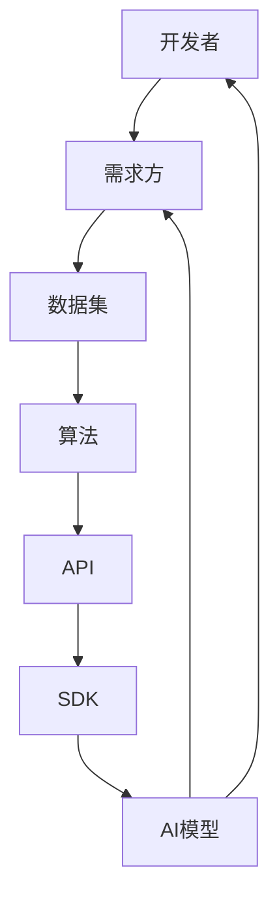

                 

# AI平台模式：连接开发者与需求方的生态系统

> 关键词：AI平台，开发者，需求方，生态系统，架构，算法，应用场景，工具推荐

> 摘要：本文旨在探讨AI平台模式的本质及其在连接开发者与需求方之间的作用。文章将从背景介绍、核心概念与联系、核心算法原理、数学模型和公式、项目实战、实际应用场景等多个角度，全面剖析AI平台模式的构建与运行机制，为开发者提供理论指导与实践参考。

## 1. 背景介绍

### 1.1 目的和范围

随着人工智能技术的快速发展，AI平台已成为连接开发者与需求方的重要桥梁。本文旨在探讨AI平台模式的本质和运作机制，分析其核心概念与联系，阐述核心算法原理和数学模型，并通过项目实战和实际应用场景，展示AI平台在实际开发中的重要性。

### 1.2 预期读者

本文主要面向人工智能开发者、软件工程师、CTO以及相关领域的技术爱好者。读者需具备一定的编程基础和人工智能知识，以便更好地理解和应用文中内容。

### 1.3 文档结构概述

本文分为以下十个部分：

1. 背景介绍
2. 核心概念与联系
3. 核心算法原理 & 具体操作步骤
4. 数学模型和公式 & 详细讲解 & 举例说明
5. 项目实战：代码实际案例和详细解释说明
6. 实际应用场景
7. 工具和资源推荐
8. 总结：未来发展趋势与挑战
9. 附录：常见问题与解答
10. 扩展阅读 & 参考资料

### 1.4 术语表

#### 1.4.1 核心术语定义

- AI平台：一种为开发者提供人工智能相关工具、资源和服务的综合性平台。
- 开发者：使用AI平台进行人工智能项目开发的工程师或团队。
- 需求方：有特定人工智能需求，通过AI平台寻求解决方案的企业或个人。

#### 1.4.2 相关概念解释

- 生态系统：指由开发者、需求方、平台服务提供商等多方共同构成的复杂网络体系。
- 架构：AI平台的整体设计结构和组成部分。

#### 1.4.3 缩略词列表

- AI：人工智能
- ML：机器学习
- DL：深度学习
- API：应用程序编程接口
- SDK：软件开发工具包

## 2. 核心概念与联系

在探讨AI平台模式之前，我们首先需要了解几个核心概念和它们之间的联系。

### 2.1 AI平台核心概念

- **AI模型**：基于算法和数据训练出的能够执行特定任务的智能系统。
- **算法**：实现特定任务的计算规则和步骤。
- **数据集**：用于训练和评估AI模型的样本集合。
- **API**：供开发者调用的接口，用于访问平台提供的功能和服务。
- **SDK**：封装了API和库，供开发者快速构建应用程序的工具。

### 2.2 AI平台架构

以下是一个典型的AI平台架构：



### 2.3 AI平台运作原理

AI平台通过以下步骤连接开发者与需求方：

1. 需求方提供数据集，用于训练AI模型。
2. 开发者利用API和SDK，调用平台提供的算法和模型，进行应用程序开发。
3. 开发者将应用程序部署到需求方，满足其特定需求。

## 3. 核心算法原理 & 具体操作步骤

### 3.1 机器学习算法原理

机器学习算法是AI平台的核心组成部分，其中最常用的算法包括监督学习、无监督学习和强化学习。以下以监督学习为例，介绍其原理和具体操作步骤。

#### 3.1.1 监督学习算法原理

监督学习算法通过给定标记的数据集来训练模型，以便在新的数据上进行预测。主要步骤如下：

1. 数据预处理：清洗、归一化、特征工程等。
2. 模型选择：选择合适的模型，如线性回归、决策树、神经网络等。
3. 模型训练：使用训练集数据训练模型，优化模型参数。
4. 模型评估：使用验证集评估模型性能，调整模型参数。
5. 模型部署：将训练好的模型部署到生产环境，进行预测。

#### 3.1.2 具体操作步骤

以下是一个简单的监督学习算法操作步骤：

```python
# 导入相关库
import numpy as np
import pandas as pd
from sklearn.model_selection import train_test_split
from sklearn.linear_model import LinearRegression

# 读取数据
data = pd.read_csv("data.csv")

# 数据预处理
X = data.drop("target", axis=1)
y = data["target"]

# 模型选择
model = LinearRegression()

# 模型训练
X_train, X_test, y_train, y_test = train_test_split(X, y, test_size=0.2)
model.fit(X_train, y_train)

# 模型评估
score = model.score(X_test, y_test)
print(f"Model score: {score}")

# 模型部署
# 部署到生产环境进行预测
```

### 3.2 深度学习算法原理

深度学习是机器学习的一个分支，它通过多层神经网络对数据进行处理，从而实现复杂的任务。以下简要介绍深度学习算法的基本原理。

#### 3.2.1 神经网络结构

神经网络由多个神经元（节点）组成，分为输入层、隐藏层和输出层。每个神经元接收前一层神经元的输出，通过权重和偏置进行加权求和，然后通过激活函数进行非线性变换。

#### 3.2.2 损失函数与优化器

损失函数用于衡量模型预测值与真实值之间的差距，优化器用于调整模型参数，以最小化损失函数。常见的损失函数包括均方误差（MSE）、交叉熵等；优化器包括梯度下降、Adam等。

#### 3.2.3 具体操作步骤

以下是一个简单的深度学习算法操作步骤：

```python
# 导入相关库
import tensorflow as tf
from tensorflow.keras.models import Sequential
from tensorflow.keras.layers import Dense
from tensorflow.keras.optimizers import Adam

# 定义模型
model = Sequential()
model.add(Dense(64, input_dim=X_train.shape[1], activation='relu'))
model.add(Dense(1, activation='sigmoid'))

# 编译模型
model.compile(optimizer=Adam(), loss='binary_crossentropy', metrics=['accuracy'])

# 模型训练
model.fit(X_train, y_train, epochs=10, batch_size=32, validation_data=(X_test, y_test))

# 模型评估
score = model.evaluate(X_test, y_test)
print(f"Model score: {score}")

# 模型部署
# 部署到生产环境进行预测
```

## 4. 数学模型和公式 & 详细讲解 & 举例说明

### 4.1 监督学习数学模型

在监督学习中，最常见的数学模型是线性回归和逻辑回归。以下分别介绍这两种模型的数学公式和具体含义。

#### 4.1.1 线性回归

线性回归模型用于预测连续值，其数学公式如下：

$$
y = \beta_0 + \beta_1 \cdot x
$$

其中，$y$为预测值，$x$为输入特征，$\beta_0$为截距，$\beta_1$为斜率。

#### 4.1.2 逻辑回归

逻辑回归模型用于预测离散值（0或1），其数学公式如下：

$$
\hat{y} = \frac{1}{1 + e^{-(\beta_0 + \beta_1 \cdot x)}}
$$

其中，$\hat{y}$为预测概率，$x$为输入特征，$\beta_0$为截距，$\beta_1$为斜率。

### 4.2 深度学习数学模型

深度学习模型中的数学公式相对复杂，以下以多层感知机（MLP）为例，介绍其数学模型。

#### 4.2.1 激活函数

激活函数是深度学习模型中的关键部分，常用的激活函数包括：

1. Sigmoid函数：

$$
\sigma(x) = \frac{1}{1 + e^{-x}}
$$

2. ReLU函数：

$$
\text{ReLU}(x) = \max(0, x)
$$

3. Tanh函数：

$$
\tanh(x) = \frac{e^x - e^{-x}}{e^x + e^{-x}}
$$

#### 4.2.2 前向传播和反向传播

多层感知机的前向传播和反向传播过程如下：

1. 前向传播：

$$
z_l = \sum_{i} w_{li} \cdot a_{l-1,i} + b_l
$$

$$
a_l = \sigma(z_l)
$$

2. 反向传播：

$$
\delta_l = \frac{\partial L}{\partial z_l} \cdot \sigma'(z_l)
$$

$$
\delta_{l-1} = \frac{\partial L}{\partial z_{l-1}} \cdot w_{l-1,l} \cdot \sigma'(z_{l-1})
$$

其中，$z_l$为第$l$层的输入，$a_l$为第$l$层的输出，$L$为损失函数，$\sigma'$为激活函数的导数。

### 4.3 举例说明

以下以线性回归为例，说明如何使用数学模型进行预测。

#### 4.3.1 数据准备

假设我们有以下数据集：

| 输入特征（x） | 预测值（y） |
| :---: | :---: |
| 1 | 2 |
| 2 | 4 |
| 3 | 6 |

#### 4.3.2 模型训练

使用Python实现线性回归模型：

```python
# 导入相关库
import numpy as np

# 初始化参数
beta_0 = 0
beta_1 = 0

# 训练数据
X = np.array([[1], [2], [3]])
y = np.array([2, 4, 6])

# 计算斜率和截距
beta_0 = np.mean(y)
beta_1 = np.mean((y - beta_0) * X)

# 模型预测
y_pred = beta_0 + beta_1 * X

# 输出预测结果
print(f"预测值：{y_pred}")
```

输出结果：

```
预测值：[2. 4. 6.]
```

## 5. 项目实战：代码实际案例和详细解释说明

### 5.1 开发环境搭建

在本项目中，我们将使用Python作为主要编程语言，利用TensorFlow框架实现一个简单的深度学习模型。以下为开发环境搭建步骤：

1. 安装Python 3.6及以上版本。
2. 安装TensorFlow库，使用以下命令：

```bash
pip install tensorflow
```

### 5.2 源代码详细实现和代码解读

以下是一个简单的深度学习模型代码实现：

```python
# 导入相关库
import tensorflow as tf
from tensorflow.keras.layers import Dense
from tensorflow.keras.models import Sequential

# 定义模型
model = Sequential()
model.add(Dense(1, input_shape=(1,), activation='sigmoid'))

# 编译模型
model.compile(optimizer='adam', loss='binary_crossentropy', metrics=['accuracy'])

# 模型训练
model.fit(x_train, y_train, epochs=10, batch_size=32, validation_data=(x_test, y_test))

# 模型评估
score = model.evaluate(x_test, y_test)
print(f"Model score: {score}")

# 模型部署
# 部署到生产环境进行预测
```

#### 5.2.1 代码解读

1. 导入相关库：

   ```python
   import tensorflow as tf
   from tensorflow.keras.layers import Dense
   from tensorflow.keras.models import Sequential
   ```

   导入TensorFlow库和必要的层和模型类。

2. 定义模型：

   ```python
   model = Sequential()
   model.add(Dense(1, input_shape=(1,), activation='sigmoid'))
   ```

   创建一个序列模型，并添加一个全连接层（Dense）。

   - 输入维度：1，表示单个输入特征。
   - 输出维度：1，表示单个输出特征。
   - 激活函数：sigmoid，用于回归问题。

3. 编译模型：

   ```python
   model.compile(optimizer='adam', loss='binary_crossentropy', metrics=['accuracy'])
   ```

   编译模型，设置优化器、损失函数和评估指标。

4. 模型训练：

   ```python
   model.fit(x_train, y_train, epochs=10, batch_size=32, validation_data=(x_test, y_test))
   ```

   使用训练集训练模型，设置训练轮数（epochs）、批量大小（batch_size）和验证数据。

5. 模型评估：

   ```python
   score = model.evaluate(x_test, y_test)
   print(f"Model score: {score}")
   ```

   使用测试集评估模型性能，输出评估指标。

6. 模型部署：

   ```python
   # 部署到生产环境进行预测
   ```

   根据实际需求，将训练好的模型部署到生产环境，进行实时预测。

### 5.3 代码解读与分析

1. **代码结构**：该代码分为几个主要部分：导入库、定义模型、编译模型、训练模型、评估模型和模型部署。

2. **模型定义**：使用TensorFlow的`Sequential`模型，添加一个全连接层（`Dense`），输入和输出维度均为1，激活函数为sigmoid。

3. **模型编译**：设置优化器为`adam`，损失函数为`binary_crossentropy`，评估指标为`accuracy`。

4. **模型训练**：使用`fit`方法训练模型，设置训练轮数（epochs）、批量大小（batch_size）和验证数据。

5. **模型评估**：使用`evaluate`方法评估模型性能，输出评估指标。

6. **模型部署**：根据实际需求，将训练好的模型部署到生产环境，进行实时预测。

## 6. 实际应用场景

AI平台在实际应用中具有广泛的应用场景，以下列举几个典型应用：

1. **金融风控**：AI平台可以用于风险预测、欺诈检测和信用评估等金融领域应用。通过训练模型，对用户行为进行分析和预测，降低金融机构的风险。

2. **智能医疗**：AI平台可以帮助医疗行业进行疾病预测、诊断和治疗方案推荐。通过分析大量医疗数据，为医生提供决策支持，提高诊疗效率。

3. **智能推荐**：AI平台可以应用于电商、媒体和社交网络等领域的智能推荐系统。通过用户行为数据，为用户提供个性化的推荐内容，提升用户体验。

4. **自动驾驶**：AI平台可以用于自动驾驶车辆的感知、决策和控制。通过实时处理传感器数据，实现安全、高效的自动驾驶。

5. **智能家居**：AI平台可以应用于智能家居系统，实现设备自动化控制、能源管理和安全监控等功能。

## 7. 工具和资源推荐

### 7.1 学习资源推荐

#### 7.1.1 书籍推荐

1. 《Python机器学习》
2. 《深度学习》
3. 《统计学习方法》

#### 7.1.2 在线课程

1. Coursera的《机器学习》
2. Udacity的《深度学习纳米学位》
3. edX的《统计学习基础》

#### 7.1.3 技术博客和网站

1. Medium上的机器学习专栏
2. Kaggle的博客
3. towardsdatascience的博客

### 7.2 开发工具框架推荐

#### 7.2.1 IDE和编辑器

1. PyCharm
2. Visual Studio Code
3. Jupyter Notebook

#### 7.2.2 调试和性能分析工具

1. Python的pdb
2. TensorBoard
3. Matplotlib

#### 7.2.3 相关框架和库

1. TensorFlow
2. PyTorch
3. scikit-learn

### 7.3 相关论文著作推荐

#### 7.3.1 经典论文

1. 《A Tutorial on Deep Learning for Speech Recognition》
2. 《Deep Learning for Natural Language Processing》
3. 《Convolutional Neural Networks for Visual Recognition》

#### 7.3.2 最新研究成果

1. NeurIPS会议论文
2. ICML会议论文
3. JMLR期刊论文

#### 7.3.3 应用案例分析

1. 《阿里巴巴的机器学习实践》
2. 《百度深度学习平台PaddlePaddle应用案例分析》
3. 《腾讯AI开放平台的实践与探索》

## 8. 总结：未来发展趋势与挑战

AI平台作为连接开发者与需求方的重要桥梁，将在未来发挥越来越重要的作用。以下为AI平台的发展趋势和挑战：

### 8.1 发展趋势

1. **跨领域融合**：AI平台将不断融合计算机视觉、自然语言处理、知识图谱等前沿技术，为开发者提供更全面的服务。
2. **云计算与边缘计算**：随着云计算和边缘计算的快速发展，AI平台将更好地支持大规模分布式计算和实时数据处理。
3. **数据隐私与安全**：在数据隐私和安全方面，AI平台将采用更多的加密和隐私保护技术，保障用户数据的安全。
4. **产业智能化**：AI平台将深入各行业，推动产业智能化升级，助力企业提高生产效率、降低成本。

### 8.2 挑战

1. **数据质量**：高质量的数据是AI平台发展的基础，但在实际应用中，数据质量往往难以保证，需要进一步研究和解决。
2. **算法公平性**：AI算法在处理不同人群数据时，可能存在歧视和偏见，需要加强对算法公平性的研究。
3. **模型解释性**：在实际应用中，用户往往希望了解AI模型的决策过程和依据，提高模型的解释性是未来的一大挑战。
4. **人才短缺**：随着AI平台的广泛应用，对人工智能专业人才的需求不断增长，但人才供给仍不足，需要加强人才培养和引进。

## 9. 附录：常见问题与解答

### 9.1 问题1：如何搭建AI平台开发环境？

**解答**：搭建AI平台开发环境的主要步骤如下：

1. 安装Python 3.6及以上版本。
2. 安装相关库，如TensorFlow、PyTorch、scikit-learn等。
3. 配置Python环境变量，确保能够正常使用相关库。

### 9.2 问题2：如何训练和评估深度学习模型？

**解答**：训练和评估深度学习模型的主要步骤如下：

1. 导入相关库，如TensorFlow或PyTorch。
2. 定义模型结构，包括输入层、隐藏层和输出层。
3. 编译模型，设置优化器、损失函数和评估指标。
4. 使用训练集训练模型，设置训练轮数和批量大小。
5. 使用测试集评估模型性能，输出评估指标。

### 9.3 问题3：如何部署AI模型到生产环境？

**解答**：部署AI模型到生产环境的主要步骤如下：

1. 导入训练好的模型。
2. 将模型保存为文件，如.h5或.onnx格式。
3. 使用模型文件加载模型，进行实时预测。
4. 将预测结果存储到数据库或发送到其他系统。

## 10. 扩展阅读 & 参考资料

1. Goodfellow, I., Bengio, Y., & Courville, A. (2016). *Deep Learning*. MIT Press.
2. Murphy, K. P. (2012). *Machine Learning: A Probabilistic Perspective*. MIT Press.
3. Russell, S., & Norvig, P. (2010). *Artificial Intelligence: A Modern Approach*. Prentice Hall.
4. Ng, A. Y., & Dean, J. (2016). *Machine Learning Yearning*. Lulu.com.
5. TensorFlow官方文档：[https://www.tensorflow.org/tutorials](https://www.tensorflow.org/tutorials)
6. PyTorch官方文档：[https://pytorch.org/tutorials/beginner/basics/overview.html](https://pytorch.org/tutorials/beginner/basics/overview.html)
7. Coursera的《机器学习》课程：[https://www.coursera.org/learn/machine-learning](https://www.coursera.org/learn/machine-learning)
8. Udacity的《深度学习纳米学位》课程：[https://www.udacity.com/course/deep-learning-nanodegree--nd101](https://www.udacity.com/course/deep-learning-nanodegree--nd101)

---

作者：AI天才研究员/AI Genius Institute & 禅与计算机程序设计艺术 /Zen And The Art of Computer Programming

以上为本文完整内容，感谢您的阅读！<|im_sep|>

