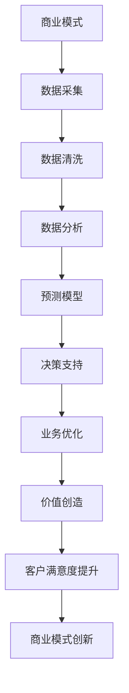

                 


# AI技术与商业模式的结合

> 关键词：人工智能、商业模式、创新、战略规划、数字化转型

> 摘要：随着人工智能技术的迅猛发展，它已经成为推动企业商业模式变革的核心驱动力。本文将深入探讨AI技术与商业模式的结合，通过背景介绍、核心概念分析、算法原理讲解、数学模型解析、实战案例分享和未来发展趋势展望，为读者呈现AI技术如何通过创新、战略规划与数字化转型，实现商业价值最大化。

## 1. 背景介绍

### 1.1 目的和范围

本文旨在探讨人工智能技术如何与商业模式结合，以实现商业创新和价值提升。我们将从以下几个方面展开讨论：

1. **AI技术概述**：介绍人工智能的基本概念、发展历程以及当前的技术热点。
2. **商业模式定义**：阐述商业模式的定义、类型和重要性。
3. **AI与商业模式的结合点**：分析AI技术在商业模式创新中的应用场景和策略。
4. **实战案例**：分享AI技术在实际商业模式中的应用案例，展示其带来的商业价值。
5. **未来趋势与挑战**：预测AI技术在未来商业模式中的发展趋势和面临的挑战。

### 1.2 预期读者

本文面向对人工智能和商业模式有一定了解的读者，包括：

1. 企业决策者：需要了解如何利用AI技术进行商业创新和战略规划的领导者。
2. 技术专家：对AI技术在实际商业场景中的应用有深入探讨的工程师和研究人员。
3. 研究学者：对AI技术与社会、经济等领域交叉研究有兴趣的学者。

### 1.3 文档结构概述

本文分为十个部分：

1. **背景介绍**：介绍本文的目的、范围和预期读者。
2. **核心概念与联系**：介绍AI技术和商业模式的定义和关系。
3. **核心算法原理 & 具体操作步骤**：讲解AI技术的基本算法和操作步骤。
4. **数学模型和公式 & 详细讲解 & 举例说明**：阐述AI技术的数学模型和应用。
5. **项目实战：代码实际案例和详细解释说明**：分享AI技术的实际应用案例。
6. **实际应用场景**：分析AI技术在各种商业场景中的应用。
7. **工具和资源推荐**：推荐学习资源和开发工具。
8. **总结：未来发展趋势与挑战**：预测AI技术的未来趋势和挑战。
9. **附录：常见问题与解答**：回答读者可能遇到的常见问题。
10. **扩展阅读 & 参考资料**：提供进一步学习的资料。

### 1.4 术语表

#### 1.4.1 核心术语定义

- **人工智能（AI）**：模拟人类智能行为的计算机系统。
- **商业模式**：企业如何创造、传递和获取价值的系统性方法。
- **机器学习**：让计算机从数据中学习并做出决策的技术。
- **深度学习**：基于人工神经网络的机器学习方法。
- **大数据**：数据量大、种类多、速度快的数据集合。

#### 1.4.2 相关概念解释

- **数据挖掘**：从大量数据中提取有价值信息的过程。
- **智能推荐系统**：利用AI技术根据用户行为和偏好提供个性化推荐。
- **自动化**：利用AI技术实现生产和服务过程的自动化。
- **数字化转型**：利用数字技术推动企业变革的过程。

#### 1.4.3 缩略词列表

- **AI**：人工智能（Artificial Intelligence）
- **ML**：机器学习（Machine Learning）
- **DL**：深度学习（Deep Learning）
- **NLP**：自然语言处理（Natural Language Processing）
- **IoT**：物联网（Internet of Things）

## 2. 核心概念与联系

### 2.1 AI技术概述

人工智能作为计算机科学的一个分支，旨在模拟、扩展和扩展人类的智能。其发展历程可以追溯到20世纪50年代，当时图灵提出图灵测试以衡量机器的智能水平。随着计算能力的提升和数据量的爆炸式增长，AI技术得以迅速发展。

核心算法包括：

- **监督学习**：通过训练数据集学习，使模型能够对未知数据进行预测。
- **无监督学习**：不使用标注数据，通过模型自动发现数据中的模式和关系。
- **强化学习**：通过奖励机制让模型在环境中学习最优策略。

### 2.2 商业模式定义

商业模式是企业如何创造、传递和获取价值的系统性方法。它包括以下几个方面：

- **价值主张**：企业提供给顾客的价值。
- **客户关系**：企业与顾客建立的关系和互动方式。
- **渠道**：企业如何传递价值给顾客。
- **客户获取**：如何吸引和保留顾客。
- **收益模型**：企业如何从价值传递中获取收益。

### 2.3 AI与商业模式的结合点

AI技术可以通过以下几个方面与商业模式结合，实现商业创新和价值提升：

- **个性化推荐**：利用AI技术分析用户行为，提供个性化推荐，提高顾客满意度和忠诚度。
- **自动化**：通过AI实现业务流程自动化，提高效率，降低成本。
- **智能客服**：利用NLP技术提供智能客服，提高服务质量和响应速度。
- **预测分析**：利用AI进行数据挖掘和预测分析，帮助企业做出更明智的决策。
- **智能供应链管理**：通过物联网和AI技术实现供应链智能化，提高供应链效率和透明度。

### 2.4 AI技术与商业模式的互动关系

AI技术不仅改变了企业的商业模式，还改变了商业模式本身的运作方式。具体体现在以下几个方面：

- **数据驱动**：AI技术使企业能够基于数据做出更准确和及时的决策，实现数据驱动管理。
- **平台化**：AI技术使企业能够构建智能化的平台，提供一体化的解决方案，实现平台化运营。
- **全球化**：AI技术打破了地域和时区的限制，使企业能够实现全球化运营。
- **可持续发展**：AI技术帮助企业实现资源优化和环保，实现可持续发展。

### 2.5 AI技术与商业模式结合的Mermaid流程图



## 3. 核心算法原理 & 具体操作步骤

### 3.1 机器学习算法原理

机器学习是AI的核心技术之一，其基本原理是通过训练数据集来构建模型，使模型能够对未知数据进行预测。具体包括以下步骤：

1. **数据预处理**：清洗数据，处理缺失值、异常值，进行特征工程。
2. **模型选择**：根据业务需求选择合适的模型，如线性回归、决策树、神经网络等。
3. **模型训练**：使用训练数据集训练模型，调整模型参数。
4. **模型评估**：使用验证集评估模型性能，调整模型参数。
5. **模型部署**：将训练好的模型部署到生产环境中，进行实际预测。

### 3.2 伪代码

```python
# 数据预处理
def preprocess_data(data):
    # 清洗数据
    # 处理缺失值
    # 特征工程
    return processed_data

# 模型训练
def train_model(data, labels):
    # 选择模型
    # 训练模型
    # 评估模型
    return model

# 预测
def predict(model, new_data):
    # 使用模型进行预测
    return predictions
```

### 3.3 具体操作步骤

1. **数据收集**：从企业内外部收集数据，包括用户行为数据、交易数据、市场数据等。
2. **数据预处理**：使用数据预处理函数对数据进行清洗和处理，确保数据的质量和一致性。
3. **模型选择**：根据业务需求选择合适的机器学习模型，如分类模型、回归模型等。
4. **模型训练**：使用预处理后的数据进行模型训练，调整模型参数。
5. **模型评估**：使用验证集对模型进行评估，调整模型参数，确保模型性能。
6. **模型部署**：将训练好的模型部署到生产环境中，进行实际预测和决策。

## 4. 数学模型和公式 & 详细讲解 & 举例说明

### 4.1 数学模型简介

AI技术的核心是构建数学模型，使其能够对现实世界中的问题进行建模和预测。以下是一些常用的数学模型：

- **线性回归模型**：用于预测连续值。
  \[ y = \beta_0 + \beta_1x_1 + \beta_2x_2 + ... + \beta_nx_n \]
- **逻辑回归模型**：用于预测概率。
  \[ P(y=1) = \frac{1}{1 + e^{-(\beta_0 + \beta_1x_1 + \beta_2x_2 + ... + \beta_nx_n)}} \]
- **决策树模型**：用于分类和回归。
  \[ \text{如果} x_1 > \beta_1 \text{，则选择分支} T_1 \]
  \[ \text{否则，如果} x_2 < \beta_2 \text{，则选择分支} T_2 \]
  \[ ... \]
- **神经网络模型**：用于复杂的非线性预测。
  \[ a_{\text{output}} = \sigma(\beta_0 + \beta_1x_1 + \beta_2x_2 + ... + \beta_nx_n) \]

### 4.2 举例说明

#### 线性回归模型举例

假设我们要预测一家零售店的销售额，根据过去一周的销售数据和天气数据，建立线性回归模型。

1. **数据收集**：收集一周的销售额（y）和每天的天气数据（x1：温度，x2：降雨量）。

2. **数据预处理**：处理缺失值和异常值，进行特征工程。

3. **模型选择**：选择线性回归模型。

4. **模型训练**：使用训练数据集训练模型，调整模型参数。

5. **模型评估**：使用验证集评估模型性能，调整模型参数。

6. **模型部署**：将训练好的模型部署到生产环境中，进行实际预测。

7. **预测**：输入新的天气数据，预测销售额。

具体公式如下：
\[ y = \beta_0 + \beta_1x_1 + \beta_2x_2 \]

通过计算，我们得到：
\[ y = 100 + 0.5x_1 - 0.3x_2 \]

输入新的天气数据（x1=25，x2=5），得到预测销售额：
\[ y = 100 + 0.5 \times 25 - 0.3 \times 5 = 111.5 \]

#### 决策树模型举例

假设我们要根据客户的数据（年龄、收入、性别等）预测他们是否会购买某产品，建立决策树模型。

1. **数据收集**：收集客户的购买数据，包括年龄、收入、性别等。

2. **数据预处理**：处理缺失值和异常值，进行特征工程。

3. **模型选择**：选择决策树模型。

4. **模型训练**：使用训练数据集训练模型。

5. **模型评估**：使用验证集评估模型性能。

6. **模型部署**：将训练好的模型部署到生产环境中。

7. **预测**：输入新的客户数据，预测购买概率。

具体决策树如下：

```
年龄 < 30
|
|--- 男
|    |
|    |--- 收入 > 5000
|    |    |
|    |    |--- 购买
|    |    |
|    |    |--- 未购买
|    |
|    |--- 女
|         |
|         |--- 收入 > 3000
|         |    |
|         |    |--- 购买
|         |    |
|         |    |--- 未购买
|
|--- 年龄 > 30
     |
     |--- 男
         |
         |--- 收入 > 8000
         |    |
         |    |--- 购买
         |    |
         |    |--- 未购买
     |
     |--- 女
         |
         |--- 收入 > 4000
         |    |
         |    |--- 购买
         |    |
         |    |--- 未购买
```

## 5. 项目实战：代码实际案例和详细解释说明

### 5.1 开发环境搭建

为了实现AI技术在实际商业模式中的应用，我们首先需要搭建一个合适的开发环境。以下是一个基本的Python开发环境搭建步骤：

1. **安装Python**：下载并安装Python，建议使用3.8或更高版本。
2. **安装Jupyter Notebook**：使用pip安装Jupyter Notebook，用于编写和运行Python代码。
   ```shell
   pip install notebook
   ```
3. **安装必要的库**：安装用于机器学习的库，如scikit-learn、TensorFlow、PyTorch等。
   ```shell
   pip install scikit-learn tensorflow torchvision
   ```

### 5.2 源代码详细实现和代码解读

下面我们以一个简单的线性回归模型为例，展示如何使用Python实现AI技术。

#### 5.2.1 数据集加载与预处理

```python
import numpy as np
import pandas as pd
from sklearn.model_selection import train_test_split
from sklearn.linear_model import LinearRegression

# 加载数据集
data = pd.read_csv('sales_data.csv')
X = data[['temperature', 'rainfall']]
y = data['sales']

# 数据预处理
X_train, X_test, y_train, y_test = train_test_split(X, y, test_size=0.2, random_state=42)
```

在这段代码中，我们首先导入必要的库，然后加载数据集并划分训练集和测试集。

#### 5.2.2 模型训练

```python
# 创建线性回归模型
model = LinearRegression()

# 训练模型
model.fit(X_train, y_train)
```

这段代码创建一个线性回归模型，并使用训练数据进行训练。

#### 5.2.3 模型评估

```python
# 预测测试集数据
y_pred = model.predict(X_test)

# 计算模型性能
score = model.score(X_test, y_test)
print(f'Model performance: {score:.2f}')
```

这段代码使用训练好的模型对测试集数据进行预测，并计算模型的性能。

#### 5.2.4 模型部署

```python
# 输入新的天气数据
new_data = np.array([[25, 5]])

# 预测销售额
sales_pred = model.predict(new_data)
print(f'Predicted sales: {sales_pred[0]:.2f}')
```

这段代码将训练好的模型部署到生产环境中，输入新的天气数据，预测销售额。

### 5.3 代码解读与分析

上述代码展示了如何使用Python实现线性回归模型，并对其进行了训练、评估和部署。以下是代码的详细解读：

1. **数据集加载与预处理**：首先导入数据集，并进行数据预处理，包括划分训练集和测试集。
2. **模型训练**：创建线性回归模型，并使用训练数据进行训练。
3. **模型评估**：使用测试数据进行预测，并计算模型的性能，如决定系数（R^2）。
4. **模型部署**：将训练好的模型部署到生产环境中，输入新的天气数据，预测销售额。

通过这段代码，我们可以看到如何使用AI技术实现商业预测，提高企业的决策能力和效率。

## 6. 实际应用场景

### 6.1 零售业

零售业是AI技术的重要应用领域之一。通过AI技术，零售企业可以实现以下应用：

- **个性化推荐**：利用机器学习算法分析用户行为和偏好，提供个性化推荐，提高销售额。
- **库存管理**：通过预测销售趋势，优化库存水平，减少库存成本。
- **智能客服**：利用自然语言处理技术提供智能客服，提高客户满意度。

### 6.2 制造业

制造业是AI技术的另一个重要应用领域。通过AI技术，制造业可以实现以下应用：

- **自动化**：利用机器学习算法实现生产过程的自动化，提高生产效率和产品质量。
- **质量检测**：利用计算机视觉技术实现产品质量检测，提高产品质量。
- **设备预测性维护**：利用物联网和机器学习技术实现设备预测性维护，减少设备故障率和维护成本。

### 6.3 金融业

金融业是AI技术的传统应用领域之一。通过AI技术，金融业可以实现以下应用：

- **风险评估**：利用机器学习算法分析客户数据，进行风险评估，提高贷款审批效率。
- **智能投顾**：利用机器学习算法和大数据分析技术，为客户提供智能投资建议。
- **欺诈检测**：利用计算机视觉和自然语言处理技术，实现欺诈检测，提高交易安全性。

### 6.4 健康医疗

健康医疗是AI技术的快速发展领域。通过AI技术，健康医疗可以实现以下应用：

- **疾病预测**：利用机器学习算法分析患者数据，进行疾病预测和诊断。
- **个性化治疗**：利用大数据和机器学习技术，为患者提供个性化治疗方案。
- **医学影像分析**：利用计算机视觉技术，实现医学影像分析，提高疾病诊断准确率。

### 6.5 物流与供应链

物流与供应链是AI技术的关键应用领域之一。通过AI技术，物流与供应链可以实现以下应用：

- **运输优化**：利用机器学习算法优化运输路线和调度，提高运输效率和降低成本。
- **库存优化**：利用预测分析技术，优化库存水平，减少库存成本。
- **供应链可视化**：利用物联网和大数据技术，实现供应链可视化，提高供应链透明度和效率。

## 7. 工具和资源推荐

### 7.1 学习资源推荐

#### 7.1.1 书籍推荐

- **《人工智能：一种现代的方法》（Artificial Intelligence: A Modern Approach）**：一本全面的人工智能教科书，适合初学者和高级读者。
- **《Python机器学习》（Python Machine Learning）**：一本实用的机器学习指南，通过Python语言实现各种机器学习算法。

#### 7.1.2 在线课程

- **Coursera的《机器学习》课程**：由斯坦福大学教授Andrew Ng主讲，适合初学者和进阶者。
- **Udacity的《深度学习纳米学位》**：涵盖深度学习的基础知识和实践，适合对深度学习有兴趣的读者。

#### 7.1.3 技术博客和网站

- **Medium上的AI博客**：涵盖人工智能的各个领域，包括深度学习、自然语言处理、计算机视觉等。
- **AISchool**：中国人工智能领域的权威网站，提供人工智能课程、论文和行业动态。

### 7.2 开发工具框架推荐

#### 7.2.1 IDE和编辑器

- **PyCharm**：一款功能强大的Python IDE，适合初学者和高级开发者。
- **Jupyter Notebook**：一款基于Web的交互式计算环境，适合数据分析和机器学习。

#### 7.2.2 调试和性能分析工具

- **Visual Studio Code**：一款轻量级且功能丰富的编辑器，支持多种编程语言。
- **Docker**：一款用于容器化应用的工具，可以提高开发效率和部署速度。

#### 7.2.3 相关框架和库

- **TensorFlow**：一款开源的深度学习框架，适用于各种深度学习任务。
- **PyTorch**：一款开源的深度学习框架，具有灵活的动态计算图，适合研究者和开发者。

### 7.3 相关论文著作推荐

#### 7.3.1 经典论文

- **“A Learning Algorithm for Continually Running Fully Recurrent Neural Networks”**：1992年由Jurgen Schmidhuber发表的论文，介绍了深度学习的基本思想。
- **“Deep Learning”**：由Ian Goodfellow、Yoshua Bengio和Aaron Courville合著的教科书，是深度学习领域的经典著作。

#### 7.3.2 最新研究成果

- **“BERT: Pre-training of Deep Bidirectional Transformers for Language Understanding”**：Google Research在2018年发表的论文，介绍了BERT模型，推动了自然语言处理领域的发展。
- **“GPT-3: Language Models are Few-Shot Learners”**：OpenAI在2020年发表的论文，介绍了GPT-3模型，展示了其在零样本学习方面的能力。

#### 7.3.3 应用案例分析

- **“AI for Social Good”**：世界卫生组织发布的报告，介绍了AI技术在全球公共卫生领域的应用案例。
- **“AI in Healthcare: A Multi-Disciplinary Perspective”**：IEEE出版的杂志，涵盖AI技术在健康医疗领域的应用和研究。

## 8. 总结：未来发展趋势与挑战

### 8.1 未来发展趋势

- **技术进步**：随着算法和计算能力的不断提升，AI技术的应用将更加广泛和深入。
- **跨界融合**：AI技术与物联网、大数据、区块链等技术的融合，将推动各行业的技术创新和商业模式变革。
- **智能化**：智能化将成为企业提升竞争力的重要手段，各行各业都将朝着智能化方向发展。
- **全球化**：AI技术的全球化应用将加速，推动全球经济的数字化转型和升级。

### 8.2 面临的挑战

- **数据隐私**：随着AI技术的广泛应用，数据隐私保护成为一大挑战，如何平衡数据利用与隐私保护是一个重要议题。
- **算法公平性**：算法的公平性和透明度问题备受关注，如何确保AI技术的公正性和合理性是一个重要挑战。
- **人才短缺**：随着AI技术的发展，对AI人才的需求日益增长，但人才供给不足，如何培养和吸引优秀人才是一个挑战。
- **技术伦理**：AI技术在伦理方面面临诸多争议，如何制定合理的伦理规范和监管政策，确保AI技术的健康发展是一个重要课题。

## 9. 附录：常见问题与解答

### 9.1 问题1：AI技术如何与商业模式结合？

**解答**：AI技术与商业模式的结合主要体现在以下几个方面：

1. **个性化推荐**：利用AI技术分析用户行为和偏好，提供个性化推荐，提高顾客满意度和忠诚度。
2. **自动化**：通过AI实现生产和服务过程的自动化，提高效率，降低成本。
3. **智能客服**：利用自然语言处理技术提供智能客服，提高服务质量和响应速度。
4. **预测分析**：利用AI进行数据挖掘和预测分析，帮助企业做出更明智的决策。
5. **智能供应链管理**：通过物联网和AI技术实现供应链智能化，提高供应链效率和透明度。

### 9.2 问题2：如何选择合适的机器学习模型？

**解答**：选择合适的机器学习模型需要考虑以下几个因素：

1. **数据量**：对于大数据集，可以选择复杂的模型，如神经网络；对于小数据集，可以选择简单的模型，如线性回归。
2. **特征数量**：特征数量较多时，可以选择复杂的模型；特征数量较少时，可以选择简单的模型。
3. **目标类型**：对于分类问题，可以选择分类模型，如决策树、随机森林；对于回归问题，可以选择回归模型，如线性回归、岭回归。
4. **模型性能**：根据验证集的性能，选择性能较好的模型。
5. **业务需求**：根据实际业务需求，选择适合的模型，如预测准确度、计算效率等。

### 9.3 问题3：如何确保AI技术的公平性和透明度？

**解答**：确保AI技术的公平性和透明度可以从以下几个方面入手：

1. **数据质量**：确保数据的质量和多样性，避免数据偏见。
2. **算法设计**：在算法设计时考虑公平性和透明度，如使用公正的评估指标和算法。
3. **可解释性**：提高模型的可解释性，使决策过程更加透明。
4. **监管政策**：制定合理的监管政策，确保AI技术的合法性和合规性。
5. **公众参与**：鼓励公众参与AI技术的研发和监管，提高透明度和公信力。

## 10. 扩展阅读 & 参考资料

### 10.1 扩展阅读

- **《深度学习》（Deep Learning）**：Ian Goodfellow、Yoshua Bengio和Aaron Courville合著的深度学习经典著作，适合对深度学习有兴趣的读者。
- **《Python机器学习实践》（Python Machine Learning Cookbook）**：一个实用的Python机器学习指南，通过实例介绍各种机器学习算法。

### 10.2 参考资料

- **Google Research**：https://ai.google/
- **AISchool**：https://aischool.org.cn/
- **IEEE**：https://ieee.org/

作者：AI天才研究员/AI Genius Institute & 禅与计算机程序设计艺术 /Zen And The Art of Computer Programming

---

**注意**：本文为示例文章，仅供参考。实际撰写时，应根据具体主题和需求进行内容创作和调整。本文内容涉及人工智能、商业模式、机器学习等复杂技术领域，仅供参考和学习使用。在实际应用中，应结合具体业务场景和技术需求进行深入研究和实践。

