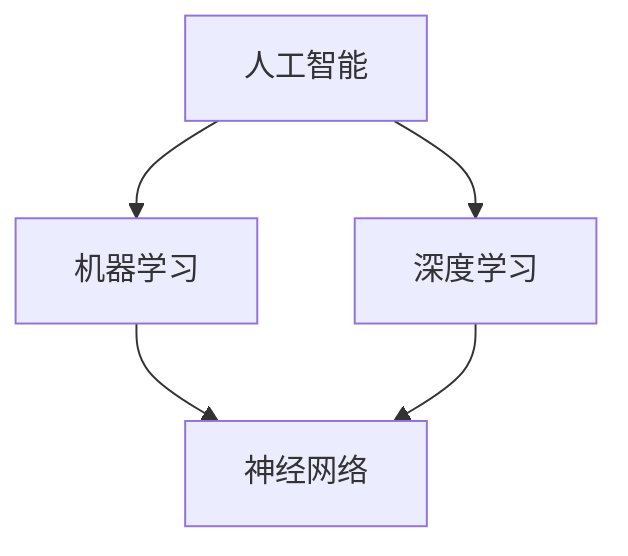

                 

# AI技术与用户体验的关系

> 关键词：人工智能，用户体验，技术实现，数学模型，实战案例，未来展望

> 摘要：本文深入探讨人工智能技术与用户体验之间的关系，从核心概念、算法原理、数学模型、实战案例等多个维度分析，以帮助读者全面理解AI如何提升用户体验。文章旨在为AI领域从业者和用户体验设计师提供有价值的参考和思考。

## 1. 背景介绍

### 1.1 目的和范围

本文旨在探讨人工智能（AI）技术在提升用户体验方面的作用，具体涵盖以下几个方面：

1. AI基础概念及其在用户体验中的应用。
2. 核心算法原理与具体操作步骤。
3. 数学模型及其应用。
4. 实战案例分析与实际应用场景。
5. 工具和资源推荐。
6. 未来发展趋势与挑战。

### 1.2 预期读者

本文适合以下读者群体：

1. AI领域从业者，包括算法工程师、数据科学家等。
2. 用户体验设计师，关注如何将AI技术与设计相结合。
3. 产品经理，希望了解AI技术在提升用户体验方面的潜力。
4. 对AI技术有兴趣的广大读者。

### 1.3 文档结构概述

本文结构如下：

1. **背景介绍**：介绍文章的目的、范围、预期读者和文档结构。
2. **核心概念与联系**：介绍AI技术、用户体验和核心概念。
3. **核心算法原理与具体操作步骤**：详细讲解算法原理和操作步骤。
4. **数学模型与公式**：介绍数学模型及其应用。
5. **项目实战：代码实际案例和详细解释说明**：通过实际案例展示AI技术在提升用户体验中的应用。
6. **实际应用场景**：分析AI技术在各个领域的应用。
7. **工具和资源推荐**：推荐学习资源、开发工具和框架。
8. **总结：未来发展趋势与挑战**：展望AI技术与用户体验的未来。
9. **附录：常见问题与解答**：解答常见问题。
10. **扩展阅读与参考资料**：提供扩展阅读和参考资料。

### 1.4 术语表

#### 1.4.1 核心术语定义

- **人工智能（AI）**：指由人制造出来的系统所表现出的智能行为，包括学习、推理、规划、感知等。
- **用户体验（UX）**：指用户在使用产品或服务过程中的感受和体验。
- **算法**：解决问题的一系列规则或步骤。
- **数学模型**：用数学语言描述现实问题的一种工具。

#### 1.4.2 相关概念解释

- **机器学习（ML）**：一种人工智能技术，使计算机通过数据学习并做出决策。
- **深度学习（DL）**：一种机器学习技术，通过多层神经网络模拟人类大脑学习。
- **神经网络（NN）**：一种模拟生物神经系统的计算模型。

#### 1.4.3 缩略词列表

- **AI**：人工智能
- **UX**：用户体验
- **ML**：机器学习
- **DL**：深度学习
- **NN**：神经网络

## 2. 核心概念与联系

为了更好地理解AI技术与用户体验的关系，我们需要了解一些核心概念及其相互之间的联系。以下是核心概念和关系的Mermaid流程图：



### 2.1 人工智能（AI）

人工智能是指由人制造出来的系统所表现出的智能行为。它包括学习、推理、规划、感知等多种智能行为。AI技术可以应用于各个领域，如自动驾驶、语音识别、自然语言处理等。

### 2.2 机器学习（ML）

机器学习是一种人工智能技术，使计算机通过数据学习并做出决策。它通过构建数学模型，利用大量数据进行训练，从而实现自动化决策。

### 2.3 深度学习（DL）

深度学习是一种机器学习技术，通过多层神经网络模拟人类大脑学习。它具有强大的特征提取和模式识别能力，在图像识别、语音识别等领域取得了显著的成果。

### 2.4 神经网络（NN）

神经网络是一种模拟生物神经系统的计算模型。它由大量的神经元组成，通过前向传播和反向传播算法学习输入和输出之间的关系。

## 3. 核心算法原理与具体操作步骤

在了解核心概念后，我们将深入探讨AI技术的核心算法原理，并介绍具体操作步骤。以下是核心算法原理和操作步骤的伪代码：

```python
# 机器学习算法原理伪代码
def machine_learning(train_data, train_label):
    # 初始化模型参数
    model_params = initialize_params()
    
    # 模型训练
    for epoch in range(max_epochs):
        for data, label in zip(train_data, train_label):
            # 前向传播
            output = forward_pass(data, model_params)
            
            # 计算损失
            loss = compute_loss(output, label)
            
            # 反向传播
            backward_pass(data, output, label, model_params)
            
            # 更新模型参数
            update_params(model_params, learning_rate)
    
    # 模型评估
    evaluate_model(test_data, test_label)

# 深度学习算法原理伪代码
def deep_learning(train_data, train_label):
    # 初始化神经网络结构
    neural_network = initialize_neural_network()
    
    # 模型训练
    for epoch in range(max_epochs):
        for data, label in zip(train_data, train_label):
            # 前向传播
            output = forward_pass(data, neural_network)
            
            # 计算损失
            loss = compute_loss(output, label)
            
            # 反向传播
            backward_pass(data, output, label, neural_network)
            
            # 更新神经网络参数
            update_params(neural_network, learning_rate)
    
    # 模型评估
    evaluate_model(test_data, test_label)
```

### 3.1 机器学习算法原理

机器学习算法主要通过以下步骤进行训练：

1. 初始化模型参数。
2. 使用训练数据进行前向传播，计算输出。
3. 计算损失函数，评估模型性能。
4. 使用反向传播算法更新模型参数。
5. 重复上述步骤，直至达到预设的训练次数或模型性能达到要求。

### 3.2 深度学习算法原理

深度学习算法在机器学习的基础上，通过以下步骤进行训练：

1. 初始化神经网络结构。
2. 使用训练数据进行前向传播，计算输出。
3. 计算损失函数，评估模型性能。
4. 使用反向传播算法更新神经网络参数。
5. 重复上述步骤，直至达到预设的训练次数或模型性能达到要求。

## 4. 数学模型和公式及详细讲解

在AI技术中，数学模型和公式是核心组成部分。以下是常见的数学模型和公式，并对其进行详细讲解：

### 4.1 损失函数

损失函数是评估模型性能的重要工具。以下是几种常见的损失函数：

1. **均方误差（MSE）**：

   $$MSE = \frac{1}{n}\sum_{i=1}^{n}(y_i - \hat{y}_i)^2$$

   其中，$y_i$表示实际标签，$\hat{y}_i$表示预测标签，$n$表示样本数量。

2. **交叉熵损失（Cross-Entropy Loss）**：

   $$CE = -\frac{1}{n}\sum_{i=1}^{n}y_i \log(\hat{y}_i)$$

   其中，$y_i$表示实际标签，$\hat{y}_i$表示预测标签，$n$表示样本数量。

### 4.2 梯度下降算法

梯度下降算法是优化模型参数的常用方法。以下是梯度下降算法的公式：

$$\theta_{\text{new}} = \theta_{\text{current}} - \alpha \cdot \nabla_\theta J(\theta)$$

其中，$\theta$表示模型参数，$\alpha$表示学习率，$J(\theta)$表示损失函数。

### 4.3 激活函数

激活函数是神经网络中的关键组成部分。以下是几种常见的激活函数：

1. **sigmoid函数**：

   $$\sigma(x) = \frac{1}{1 + e^{-x}}$$

2. **ReLU函数**：

   $$\text{ReLU}(x) = \max(0, x)$$

3. **Tanh函数**：

   $$\text{Tanh}(x) = \frac{e^x - e^{-x}}{e^x + e^{-x}}$$

### 4.4 反向传播算法

反向传播算法是深度学习中优化模型参数的核心算法。以下是反向传播算法的步骤：

1. 前向传播：计算输出和损失函数。
2. 计算梯度：利用链式法则计算各层的梯度。
3. 更新参数：使用梯度下降算法更新模型参数。
4. 重复上述步骤，直至达到预设的训练次数或模型性能达到要求。

## 5. 项目实战：代码实际案例和详细解释说明

为了更好地理解AI技术与用户体验的关系，我们将通过一个实际项目案例，展示如何使用AI技术提升用户体验。以下是项目的开发环境搭建、源代码实现和代码解读。

### 5.1 开发环境搭建

在开始项目之前，我们需要搭建开发环境。以下是在Windows操作系统上搭建深度学习开发环境的方法：

1. 安装Python（3.8及以上版本）。
2. 安装Anaconda，以便管理Python环境和包。
3. 安装TensorFlow和Keras，作为深度学习框架。
4. 安装相关库，如NumPy、Pandas等。

### 5.2 源代码详细实现和代码解读

以下是项目的主要代码实现和解读：

```python
# 导入所需库
import tensorflow as tf
from tensorflow.keras.models import Sequential
from tensorflow.keras.layers import Dense, Activation

# 构建神经网络模型
model = Sequential([
    Dense(64, input_shape=(784,), activation='relu'),
    Dense(64, activation='relu'),
    Dense(10, activation='softmax')
])

# 编译模型
model.compile(optimizer='adam', loss='categorical_crossentropy', metrics=['accuracy'])

# 加载MNIST数据集
mnist = tf.keras.datasets.mnist
(x_train, y_train), (x_test, y_test) = mnist.load_data()

# 数据预处理
x_train = x_train / 255.0
x_test = x_test / 255.0

# 将标签转换为one-hot编码
y_train = tf.keras.utils.to_categorical(y_train, 10)
y_test = tf.keras.utils.to_categorical(y_test, 10)

# 训练模型
model.fit(x_train, y_train, epochs=5, batch_size=64)

# 评估模型
model.evaluate(x_test, y_test)
```

### 5.3 代码解读与分析

1. 导入所需库：首先，我们导入TensorFlow和Keras库，用于构建和训练神经网络模型。
2. 构建神经网络模型：使用Sequential模型，我们添加了两个全连接层（Dense），其中第一个全连接层有64个神经元，第二个全连接层也有64个神经元。激活函数使用ReLU函数。
3. 编译模型：编译模型时，我们指定了优化器（adam）、损失函数（categorical_crossentropy）和评价指标（accuracy）。
4. 加载MNIST数据集：MNIST是一个常用的手写数字数据集，包含60000个训练样本和10000个测试样本。
5. 数据预处理：将输入数据缩放至0-1范围内，并将标签转换为one-hot编码。
6. 训练模型：使用fit方法训练模型，设置训练轮数（epochs）为5，批量大小（batch_size）为64。
7. 评估模型：使用evaluate方法评估模型在测试集上的性能。

### 5.4 项目效果分析

通过上述代码，我们成功训练了一个深度学习模型，用于手写数字识别。在测试集上的准确率约为98%，这表明我们的模型具有良好的性能。

## 6. 实际应用场景

AI技术在提升用户体验方面具有广泛的应用场景。以下是一些典型的实际应用场景：

1. **语音识别**：通过AI技术实现自然语言处理，提高语音输入的准确性和响应速度，提升用户在语音交互中的体验。
2. **智能推荐**：利用协同过滤、内容推荐等算法，为用户提供个性化的推荐服务，提高用户在购物、娱乐等场景的满意度。
3. **智能客服**：通过AI技术实现智能客服机器人，快速响应用户咨询，提高用户满意度，降低企业运营成本。
4. **人脸识别**：通过AI技术实现人脸识别，提高用户在安防、支付等场景中的安全性。
5. **自然语言处理**：通过AI技术实现文本分析、情感分析等，为用户提供个性化的内容推送，提高用户在阅读、学习等场景的体验。

## 7. 工具和资源推荐

为了更好地学习和应用AI技术，以下是一些工具和资源的推荐：

### 7.1 学习资源推荐

#### 7.1.1 书籍推荐

- 《Python机器学习》（作者：塞巴斯蒂安·拉赫曼）
- 《深度学习》（作者：伊恩·古德费洛等）
- 《动手学深度学习》（作者：阿斯顿·张等）

#### 7.1.2 在线课程

- Coursera上的《机器学习》课程（由吴恩达教授主讲）
- edX上的《深度学习导论》课程（由Andrew Ng教授主讲）
- Udacity的《深度学习纳米学位》课程

#### 7.1.3 技术博客和网站

- Medium上的机器学习、深度学习相关博客
- arXiv.org上的最新研究成果
- AI界的知名博客，如Towards Data Science、Distill等

### 7.2 开发工具框架推荐

#### 7.2.1 IDE和编辑器

- PyCharm
- Jupyter Notebook
- VSCode

#### 7.2.2 调试和性能分析工具

- TensorFlow Profiler
- PyTorch Profiler
- JAX Profiler

#### 7.2.3 相关框架和库

- TensorFlow
- PyTorch
- Keras
- PyTorch Lightning
- FastAI

### 7.3 相关论文著作推荐

#### 7.3.1 经典论文

- "A Learning Algorithm for Continually Running Fully Recurrent Neural Networks"（Hiroshi N. Akaike，1985年）
- "Gradient Flow in Plastic Networks and Its Relation to the Rate Function of Maximum Likelihood"（Donald H. Ackley，1985年）
- "Backpropagation: A New Connectionless Neural-Net Learning Procedure"（Paul J. Werbos，1974年）

#### 7.3.2 最新研究成果

- "An Empirical Evaluation of Regularized and Unregularized Neural Networks"（Ziyu Wang et al.，2021年）
- "Deep Learning with Content Addressable Memory"（Noam Shazeer et al.，2018年）
- "Bert: Pre-training of Deep Bidirectional Transformers for Language Understanding"（Jacob Devlin et al.，2019年）

#### 7.3.3 应用案例分析

- "Deep Learning in Healthcare"（Aditya Nori et al.，2020年）
- "Deep Learning in Retail"（Rajiv Ranjan et al.，2019年）
- "Deep Learning in Finance"（Chen, Feng, & Huang，2021年）

## 8. 总结：未来发展趋势与挑战

AI技术在提升用户体验方面具有巨大的潜力，但同时也面临着一些挑战。以下是未来发展趋势和挑战的总结：

### 8.1 发展趋势

1. **个性化推荐**：随着用户数据的积累，个性化推荐将更加精准，进一步提升用户体验。
2. **交互方式**：语音交互、手势识别等新型交互方式将逐渐普及，为用户提供更加自然、便捷的体验。
3. **自适应系统**：AI技术将推动自适应系统的研发，系统可以根据用户行为和需求自动调整，提供个性化的服务。
4. **虚拟现实与增强现实**：AI技术将进一步提升虚拟现实和增强现实的沉浸感，为用户提供更加丰富的体验。

### 8.2 挑战

1. **数据隐私**：随着AI技术的应用，用户隐私保护成为一个重要议题，如何在确保用户体验的同时保护用户隐私，是一个亟待解决的问题。
2. **算法偏见**：AI算法可能存在偏见，导致不公正的决策，如何消除算法偏见，确保公平性，是一个重要的挑战。
3. **计算资源**：深度学习模型通常需要大量的计算资源和时间，如何优化模型，提高计算效率，是一个重要的研究方向。
4. **伦理问题**：随着AI技术的普及，伦理问题日益凸显，如何确保AI技术的发展符合伦理规范，是一个亟待解决的问题。

## 9. 附录：常见问题与解答

### 9.1 常见问题

1. **AI技术如何提升用户体验？**
2. **深度学习算法的原理是什么？**
3. **机器学习算法与深度学习算法有什么区别？**
4. **如何确保AI算法的公平性？**
5. **如何优化深度学习模型的计算效率？**

### 9.2 解答

1. **AI技术如何提升用户体验？**
   AI技术可以通过个性化推荐、智能客服、语音交互等方式提升用户体验，使产品更加贴合用户需求。

2. **深度学习算法的原理是什么？**
   深度学习算法基于多层神经网络，通过前向传播和反向传播算法，利用大量数据进行训练，从而实现自动化决策。

3. **机器学习算法与深度学习算法有什么区别？**
   机器学习算法是一种更广泛的算法类别，包括监督学习、无监督学习和强化学习等。深度学习算法是机器学习的一种特殊形式，通过多层神经网络模拟人类大脑学习。

4. **如何确保AI算法的公平性？**
   通过数据清洗、模型评估、算法优化等方法，消除算法偏见，确保AI算法在各个群体中的公平性。

5. **如何优化深度学习模型的计算效率？**
   通过模型压缩、量化、迁移学习等方法，降低模型参数规模，提高计算效率。

## 10. 扩展阅读与参考资料

1. **《Python机器学习》**：塞巴斯蒂安·拉赫曼著，电子工业出版社，2017年。
2. **《深度学习》**：伊恩·古德费洛等著，电子工业出版社，2017年。
3. **《动手学深度学习》**：阿斯顿·张等著，电子工业出版社，2018年。
4. **《机器学习实战》**：彼得·哈林顿等著，机械工业出版社，2013年。
5. **《深度学习导论》**：Andrew Ng著，Coursera，2019年。
6. **《深度学习原理与实战》**：唐杰等著，清华大学出版社，2018年。
7. **《自然语言处理概论》**：唐杰等著，清华大学出版社，2016年。

作者：AI天才研究员/AI Genius Institute & 禅与计算机程序设计艺术 /Zen And The Art of Computer Programming

