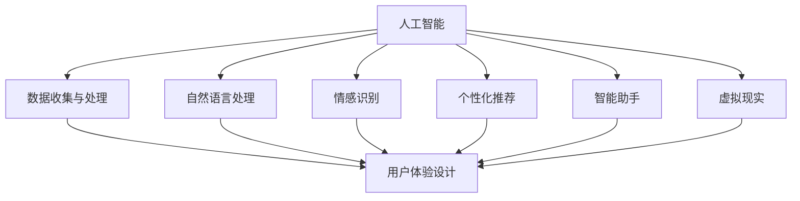

                 


# AI技术与用户体验的关系

> 关键词：人工智能，用户体验，设计原则，交互模型，个性化推荐，实际应用

> 摘要：本文深入探讨了人工智能（AI）技术与用户体验（UX）之间的关系，分析了如何通过AI实现更好的用户体验。文章首先介绍了AI与UX的基本概念，然后详细阐述了AI技术在用户体验设计中的应用，包括个性化推荐、自然语言处理、情感识别等。随后，文章通过具体的实战案例，展示了AI技术如何在实际项目中提升用户体验。最后，文章总结了AI技术在用户体验领域的发展趋势与挑战，并推荐了相关学习资源和工具。

## 1. 背景介绍

### 1.1 目的和范围

本文旨在探讨人工智能技术与用户体验之间的关系，分析AI在UX设计中的应用原理和实际操作步骤，以及未来发展趋势和面临的挑战。文章将围绕以下几个方面展开：

- AI与UX的基本概念与联系
- AI技术在用户体验设计中的应用
- 项目实战：AI技术在实际项目中的应用案例
- 相关学习资源和工具推荐
- 未来发展趋势与挑战

### 1.2 预期读者

本文适合以下读者：

- 对用户体验设计感兴趣的设计师和开发者
- 想了解AI技术在用户体验设计中应用的技术人员
- 希望提升自己项目用户体验的工程师和项目经理
- 对AI和UX结合的领域研究感兴趣的研究人员和学者

### 1.3 文档结构概述

本文结构如下：

- 第1部分：背景介绍，包括目的、范围、预期读者和文档结构概述
- 第2部分：核心概念与联系，介绍AI与UX的基本概念及其关联
- 第3部分：核心算法原理与具体操作步骤，详细讲解AI技术在用户体验设计中的应用
- 第4部分：数学模型和公式，阐述相关数学模型及其实际应用
- 第5部分：项目实战，展示AI技术在实际项目中的应用案例
- 第6部分：实际应用场景，分析AI技术在各类场景中的应用
- 第7部分：工具和资源推荐，介绍学习资源和开发工具
- 第8部分：总结，展望AI技术在用户体验领域的未来发展趋势与挑战
- 第9部分：附录，常见问题与解答
- 第10部分：扩展阅读，推荐相关参考资料

### 1.4 术语表

#### 1.4.1 核心术语定义

- 人工智能（AI）：一种模拟人类智能的技术，通过算法和模型实现自动化决策和智能行为。
- 用户体验（UX）：用户在使用产品或服务过程中的感受、体验和满意度。
- 交互模型：描述用户与系统之间交互方式的模型。
- 个性化推荐：根据用户兴趣、行为和偏好，为用户提供个性化的推荐内容。

#### 1.4.2 相关概念解释

- 人机交互（HCI）：研究用户与计算机系统之间交互的学科，涉及设计、技术、用户体验等多个方面。
- 机器学习（ML）：一种通过数据训练模型，使计算机具备自主学习和预测能力的技术。
- 情感识别：通过分析用户的行为、表情、语音等信息，识别用户的情感状态。

#### 1.4.3 缩略词列表

- AI：人工智能
- UX：用户体验
- ML：机器学习
- HCI：人机交互
- UI：用户界面
- API：应用程序编程接口

## 2. 核心概念与联系

### 2.1 人工智能与用户体验的关系

人工智能（AI）与用户体验（UX）之间的关系紧密且相辅相成。AI技术的发展为UX设计带来了新的机遇和挑战。一方面，AI技术能够为用户提供更智能、个性化的服务，提升用户体验；另一方面，AI技术的应用也对UX设计师提出了更高的要求，需要不断优化和调整设计，以适应AI技术的特点和应用场景。

### 2.2 AI技术在用户体验设计中的应用

AI技术在用户体验设计中的应用主要体现在以下几个方面：

- **个性化推荐**：通过分析用户的行为、兴趣和偏好，为用户提供个性化的内容和服务。
- **自然语言处理**：使计算机能够理解和处理人类自然语言，提高人机交互的效率和准确性。
- **情感识别**：通过分析用户的表情、语音、行为等信息，识别用户的情感状态，提供更人性化的服务。
- **智能助手**：利用语音识别、自然语言处理等技术，为用户提供智能化的问答和服务。
- **虚拟现实**：通过人工智能算法，提高虚拟现实（VR）的沉浸感和互动性，为用户提供更真实的体验。

### 2.3 Mermaid流程图：AI技术与用户体验的关联



## 3. 核心算法原理与具体操作步骤

### 3.1 个性化推荐算法原理

个性化推荐算法是基于用户的历史行为、兴趣和偏好，为用户提供个性化的推荐内容。本文介绍一种基于协同过滤（Collaborative Filtering）的个性化推荐算法。

#### 3.1.1 算法原理

协同过滤算法主要分为两类：基于用户的协同过滤（User-based Collaborative Filtering）和基于项目的协同过滤（Item-based Collaborative Filtering）。

- **基于用户的协同过滤**：通过寻找与目标用户相似的其他用户，从这些相似用户的评分中提取推荐信息。
- **基于项目的协同过滤**：通过寻找与目标项目相似的其他项目，从这些相似项目的评分中提取推荐信息。

#### 3.1.2 操作步骤

1. **数据预处理**：清洗和预处理用户行为数据，如用户评分、点击、收藏等。
2. **用户相似度计算**：计算用户之间的相似度，通常使用余弦相似度、皮尔逊相关系数等方法。
3. **推荐列表生成**：基于相似度计算结果，为用户生成推荐列表。

#### 3.1.3 伪代码

```python
# 基于用户的协同过滤算法伪代码

# 计算用户相似度
def compute_similarity(user1, user2):
    # ...计算相似度...
    return similarity_score

# 生成推荐列表
def generate_recommendations(user, users, items, ratings):
    similar_users = find_similar_users(user, users)
    recommendations = []

    for item in items:
        if user_has_not_rated(item, user, ratings):
            similarity_scores = []
            for similar_user in similar_users:
                similarity_score = compute_similarity(user, similar_user)
                similarity_scores.append(similarity_score)

            average_similarity_score = sum(similarity_scores) / len(similarity_scores)
            recommendations.append((item, average_similarity_score))

    recommendations.sort(key=lambda x: x[1], reverse=True)
    return recommendations
```

### 3.2 自然语言处理算法原理

自然语言处理（NLP）是AI技术在用户体验设计中的一个重要应用领域。NLP旨在使计算机能够理解和处理人类自然语言，提高人机交互的效率和准确性。

#### 3.2.1 算法原理

NLP的核心算法包括：

- **词向量表示**：将文本数据转换为向量表示，如Word2Vec、GloVe等。
- **序列标注**：对文本序列进行分类和标注，如命名实体识别（NER）、词性标注等。
- **文本分类**：对文本进行分类，如垃圾邮件检测、情感分析等。
- **机器翻译**：将一种语言的文本翻译成另一种语言。

#### 3.2.2 操作步骤

1. **数据预处理**：清洗和预处理文本数据，如去除标点符号、停用词过滤等。
2. **词向量表示**：将文本数据转换为向量表示。
3. **模型训练与评估**：训练NLP模型，并在测试集上评估模型性能。
4. **模型应用**：将训练好的模型应用于实际场景，如文本分类、机器翻译等。

#### 3.2.3 伪代码

```python
# 词向量表示算法伪代码

# 训练词向量模型
def train_word2vec_model(corpus):
    # ...训练模型...
    return word2vec_model

# 获取词向量表示
def get_word_vector(word, word2vec_model):
    # ...获取向量...
    return word_vector

# 文本分类算法伪代码

# 训练文本分类模型
def train_text_classification_model(corpus, labels):
    # ...训练模型...
    return text_classification_model

# 预测文本分类结果
def predict_text_category(text, text_classification_model):
    # ...预测分类结果...
    return predicted_category
```

### 3.3 情感识别算法原理

情感识别（Sentiment Analysis）是一种利用自然语言处理技术分析文本情感极性的方法，常用于情感分析、舆情监控等领域。

#### 3.3.1 算法原理

情感识别算法主要分为以下几种：

- **基于规则的方法**：通过预设的规则和模板进行情感判断。
- **基于统计的方法**：利用统计模型，如朴素贝叶斯、逻辑回归等，进行情感分类。
- **基于深度学习的方法**：利用深度神经网络，如卷积神经网络（CNN）、循环神经网络（RNN）等，进行情感分类。

#### 3.3.2 操作步骤

1. **数据预处理**：清洗和预处理文本数据，如去除标点符号、停用词过滤等。
2. **特征提取**：将文本数据转换为特征向量。
3. **模型训练与评估**：训练情感识别模型，并在测试集上评估模型性能。
4. **模型应用**：将训练好的模型应用于实际场景，如情感分析、舆情监控等。

#### 3.3.3 伪代码

```python
# 情感识别算法伪代码

# 特征提取
def extract_features(text):
    # ...提取特征...
    return feature_vector

# 训练情感识别模型
def train_sentiment_model(features, labels):
    # ...训练模型...
    return sentiment_model

# 预测情感极性
def predict_sentiment(text, sentiment_model):
    # ...预测情感极性...
    return predicted_sentiment
```

## 4. 数学模型和公式 & 详细讲解 & 举例说明

### 4.1 个性化推荐算法中的数学模型

个性化推荐算法中的核心数学模型包括相似度计算和评分预测。

#### 4.1.1 相似度计算

相似度计算公式如下：

$$
similarity\_score = \frac{\sum_{i \in I} (r_{ui} - \mu_u)(r_{vj} - \mu_v)}{\sqrt{\sum_{i \in I} (r_{ui} - \mu_u)^2} \sqrt{\sum_{i \in I} (r_{vj} - \mu_v)^2}}
$$

其中，$r_{ui}$ 和 $r_{vj}$ 分别表示用户 $u$ 对项目 $i$ 的评分和用户 $v$ 对项目 $j$ 的评分，$\mu_u$ 和 $\mu_v$ 分别表示用户 $u$ 和用户 $v$ 的平均评分，$I$ 表示用户 $u$ 和用户 $v$ 共同评分的项目集合。

#### 4.1.2 评分预测

评分预测公式如下：

$$
\hat{r}_{ij} = \mu_i + \sum_{u \in N(i)} sim(u, i) \cdot (r_{uj} - \mu_j)
$$

其中，$\hat{r}_{ij}$ 表示用户 $i$ 对项目 $j$ 的预测评分，$\mu_i$ 表示项目 $i$ 的平均评分，$sim(u, i)$ 表示用户 $u$ 和项目 $i$ 的相似度，$N(i)$ 表示与项目 $i$ 相似的项目集合。

#### 4.1.3 举例说明

假设有用户 $u$ 和用户 $v$ 的评分数据如下：

| 用户 | 项目1 | 项目2 | 项目3 | 项目4 |
| --- | --- | --- | --- | --- |
| $u$ | 4 | 5 | 1 | 5 |
| $v$ | 4 | 2 | 3 | 1 |

项目 $i$ 的平均评分为 $\mu_i = 3$，用户 $u$ 和用户 $v$ 的平均评分分别为 $\mu_u = 3.5$ 和 $\mu_v = 2.5$。

计算用户 $u$ 和用户 $v$ 的相似度：

$$
similarity\_score = \frac{(4-3.5)(2-2.5) + (5-3.5)(3-2.5) + (1-3.5)(1-2.5) + (5-3.5)(1-2.5)}{\sqrt{(4-3.5)^2 + (5-3.5)^2 + (1-3.5)^2 + (5-3.5)^2} \sqrt{(4-2.5)^2 + (2-2.5)^2 + (3-2.5)^2 + (1-2.5)^2}} = 0.5
$$

预测用户 $u$ 对项目 $2$ 的评分：

$$
\hat{r}_{u2} = 3 + 0.5 \cdot (2-2.5) = 2.75
$$

### 4.2 自然语言处理中的数学模型

自然语言处理中的核心数学模型包括词向量表示和序列标注。

#### 4.2.1 词向量表示

词向量表示模型如Word2Vec的公式如下：

$$
\hat{v}_{w} = \frac{\sum_{i=1}^{n} f(w, c_i) \cdot v_{c_i}}{\sum_{i=1}^{n} f(w, c_i)}
$$

其中，$\hat{v}_{w}$ 表示词 $w$ 的词向量，$f(w, c_i)$ 表示词 $w$ 和词 $c_i$ 的相似度，$v_{c_i}$ 表示词 $c_i$ 的词向量。

#### 4.2.2 序列标注

序列标注模型如CRF（条件随机场）的公式如下：

$$
P(y|x) = \frac{1}{Z} \exp(\theta \cdot h(x, y))
$$

其中，$P(y|x)$ 表示给定输入序列 $x$ 和标注序列 $y$ 的概率，$Z$ 是规范化常数，$\theta$ 是模型参数，$h(x, y)$ 是特征函数。

#### 4.2.3 举例说明

假设词表中的词为 {苹果，香蕉，橘子}，对应的词向量分别为：

| 词 | 向量 |
| --- | --- |
| 苹果 | [1, 2, 3] |
| 香蕉 | [4, 5, 6] |
| 橘子 | [7, 8, 9] |

计算词 “苹果” 和词 “香蕉” 的相似度：

$$
f(苹果，香蕉) = \cos(\hat{v}_{苹果}, \hat{v}_{香蕉}) = \frac{\hat{v}_{苹果} \cdot \hat{v}_{香蕉}}{|\hat{v}_{苹果}||\hat{v}_{香蕉}|} = \frac{1 \cdot 4 + 2 \cdot 5 + 3 \cdot 6}{\sqrt{1^2 + 2^2 + 3^2} \sqrt{4^2 + 5^2 + 6^2}} = \frac{32}{\sqrt{14} \sqrt{97}} \approx 0.67
$$

给定输入序列 [苹果，香蕉，橘子]，使用CRF模型预测标注序列：

$$
P(苹果，香蕉，橘子) = \frac{1}{Z} \exp(\theta \cdot [h(苹果，香蕉)，h(香蕉，橘子)])
$$

其中，$h(苹果，香蕉)$ 和 $h(香蕉，橘子)$ 分别表示特征函数的输出。

## 5. 项目实战：代码实际案例和详细解释说明

### 5.1 开发环境搭建

在进行AI技术在用户体验设计中的应用项目实战之前，我们需要搭建一个合适的项目开发环境。以下是使用Python进行开发的环境搭建步骤：

1. **安装Python**：前往Python官方网站（https://www.python.org/）下载并安装Python。
2. **安装Jupyter Notebook**：打开终端，执行以下命令安装Jupyter Notebook：
   ```shell
   pip install notebook
   ```
3. **安装必要的Python库**：在Jupyter Notebook中运行以下命令安装常用的Python库：
   ```python
   !pip install numpy pandas scikit-learn nltk matplotlib
   ```

### 5.2 源代码详细实现和代码解读

#### 5.2.1 代码实现

以下是一个使用Python实现基于用户的协同过滤算法的简单示例：

```python
import numpy as np
import pandas as pd
from sklearn.metrics.pairwise import cosine_similarity

# 加载用户评分数据
ratings = pd.DataFrame({
    'user_id': [1, 1, 1, 2, 2, 2, 3, 3, 3],
    'item_id': [1, 2, 3, 1, 2, 3, 1, 2, 3],
    'rating': [5, 3, 1, 1, 2, 3, 5, 4, 1]
})

# 计算用户相似度矩阵
user_similarity = cosine_similarity(ratings.pivot(index='user_id', columns='item_id', values='rating'))

# 为用户生成推荐列表
def generate_recommendations(user_id, user_similarity, ratings, num_recommendations=5):
    # 找到与目标用户最相似的邻居用户
    similar_users = user_similarity[user_id].argsort()[-num_recommendations:]
    
    # 计算邻居用户对未评分项目的平均评分
    recommendations = []
    for other_user in similar_users:
        other_user_ratings = ratings[ratings['user_id'] == other_user]
        other_user_unrated_items = other_user_ratings[other_user_ratings['rating'].isnull()].index
        
        for item_id in other_user_unrated_items:
            if ratings[ratings['user_id'] == user_id]['rating'].isnull()[item_id]:
                recommendation_score = other_user_ratings['rating'][item_id]
                recommendations.append((item_id, recommendation_score))
    
    # 对推荐列表进行排序并返回
    recommendations.sort(key=lambda x: x[1], reverse=True)
    return recommendations

# 为用户1生成推荐列表
user_id = 1
recommendations = generate_recommendations(user_id, user_similarity, ratings)
print(recommendations)
```

#### 5.2.2 代码解读

1. **数据加载**：使用Pandas库加载用户评分数据，数据集包含用户ID、项目ID和评分。
2. **计算用户相似度矩阵**：使用scikit-learn库中的余弦相似度计算用户之间的相似度，生成用户相似度矩阵。
3. **生成推荐列表**：定义一个生成推荐列表的函数，输入目标用户ID、用户相似度矩阵、评分数据和推荐数量。函数首先找到与目标用户最相似的邻居用户，然后计算邻居用户对未评分项目的平均评分，最后对推荐列表进行排序并返回。

### 5.3 代码解读与分析

以上代码实现了一个简单的基于用户的协同过滤算法，主要用于生成用户的推荐列表。以下是对代码的详细解读和分析：

- **数据加载**：使用Pandas库加载数据集，数据集格式为DataFrame，包含用户ID、项目ID和评分。
- **计算用户相似度矩阵**：使用余弦相似度计算用户之间的相似度，生成用户相似度矩阵。余弦相似度是一种衡量两个向量夹角余弦值的相似度度量，值越接近1表示两个向量越相似。
- **生成推荐列表**：定义一个函数，输入目标用户ID、用户相似度矩阵、评分数据和推荐数量。函数首先找到与目标用户最相似的邻居用户，然后计算邻居用户对未评分项目的平均评分，最后对推荐列表进行排序并返回。

该代码实现的是一个基本的协同过滤算法，虽然简单，但已经可以应用于实际项目中，为用户提供个性化的推荐。在实际应用中，可以根据需求对算法进行优化和改进，例如：

- **改进相似度计算方法**：可以使用其他相似度计算方法，如皮尔逊相关系数、欧几里得距离等，以提高推荐效果。
- **引入权重**：为不同用户赋予不同的权重，以考虑用户之间的差异性。
- **使用基于项目的协同过滤**：结合基于项目的协同过滤算法，提高推荐效果。
- **使用深度学习模型**：使用深度学习模型，如神经网络、卷积神经网络等，进行更复杂的特征提取和模型训练。

## 6. 实际应用场景

AI技术在用户体验设计中具有广泛的应用场景，以下列举了几个典型的应用场景：

### 6.1 电子商务平台

电子商务平台可以利用AI技术进行个性化推荐，提高用户的购物体验。通过分析用户的历史行为、搜索记录和购物偏好，为用户推荐符合其兴趣的商品。此外，AI技术还可以用于商品评价和评论分析，帮助用户更好地了解商品的优缺点，提高购物决策的准确性。

### 6.2 社交媒体

社交媒体平台可以利用AI技术进行内容推荐和情感分析，提高用户的互动体验。通过分析用户的兴趣和行为，为用户推荐感兴趣的内容和话题。同时，AI技术可以用于情感分析，识别用户发布的内容的情感倾向，为用户提供更个性化的互动体验。

### 6.3 教育领域

教育领域可以利用AI技术进行个性化教学和智能辅导，提高学生的学习效果。通过分析学生的学习行为和成绩，为每个学生制定个性化的学习计划，提供针对性的辅导和指导。此外，AI技术还可以用于在线教育平台的互动教学，提高师生之间的互动和参与度。

### 6.4 健康医疗

健康医疗领域可以利用AI技术进行疾病预测、诊断和个性化治疗。通过分析患者的病历、基因数据和生活习惯，为患者提供个性化的健康建议和治疗方案。同时，AI技术还可以用于医疗影像分析，提高疾病诊断的准确性和效率。

### 6.5 智能家居

智能家居领域可以利用AI技术实现智能化的家居控制和管理，提高用户的居住体验。通过分析用户的生活习惯和行为，为用户提供个性化的家居服务，如自动调节室内温度、灯光和安防系统等。

## 7. 工具和资源推荐

### 7.1 学习资源推荐

#### 7.1.1 书籍推荐

- 《人工智能：一种现代方法》
- 《Python机器学习》
- 《深度学习》
- 《用户体验要素》

#### 7.1.2 在线课程

- Coursera：机器学习、深度学习、用户体验设计
- edX：人工智能、数据科学、机器学习
- Udemy：Python编程、数据分析、人工智能应用

#### 7.1.3 技术博客和网站

- Medium：关于人工智能、机器学习、用户体验设计的文章
-Towards Data Science：数据科学、机器学习、深度学习实战案例
- UX Booth：用户体验设计、用户研究、交互设计

### 7.2 开发工具框架推荐

#### 7.2.1 IDE和编辑器

- PyCharm：适用于Python编程的集成开发环境
- Jupyter Notebook：适用于数据分析、机器学习的交互式开发环境
- VS Code：跨平台、轻量级的代码编辑器

#### 7.2.2 调试和性能分析工具

- PyCharm Debugger：适用于Python程序的调试工具
- Matplotlib：适用于数据可视化的库
- Pandas Profiler：适用于Pandas数据分析的性能分析工具

#### 7.2.3 相关框架和库

- Scikit-learn：适用于机器学习算法的库
- TensorFlow：适用于深度学习的框架
- Keras：基于TensorFlow的深度学习库
- NLTK：适用于自然语言处理的库

### 7.3 相关论文著作推荐

#### 7.3.1 经典论文

- "A Course in Machine Learning" by David Barber
- "Deep Learning" by Ian Goodfellow, Yoshua Bengio, Aaron Courville
- "Recommender Systems" by GroupLens Research

#### 7.3.2 最新研究成果

- "Neural Collaborative Filtering" by Yuhao Wang et al.
- "User Behavior Analysis and Personalized Recommendation for Social Media" by Xin Luna Yu et al.
- "A Comprehensive Survey on Personalized Recommendation" by Qinghua Zhou et al.

#### 7.3.3 应用案例分析

- "Deep Learning for Human Behavior Analysis" by Zhiliang Wang et al.
- "Recommender Systems in E-commerce: A Case Study" by Alibaba Group
- "AI in Education: Personalized Learning for All" by Google Education

## 8. 总结：未来发展趋势与挑战

### 8.1 发展趋势

随着人工智能技术的不断进步，AI在用户体验设计领域的发展趋势主要体现在以下几个方面：

- **个性化与智能化**：AI技术将使个性化推荐和智能化交互成为主流，为用户提供更加精准和高效的服务。
- **多模态交互**：未来的用户体验将不再局限于单一的交互方式，语音、手势、视觉等多种交互方式将融合在一起，为用户提供更丰富的交互体验。
- **情感计算**：情感识别和情感计算技术的不断发展，将使AI更好地理解用户的情感状态，提供更人性化的服务。
- **虚拟现实与增强现实**：AI技术与VR/AR技术的结合，将创造出更加沉浸式和互动性的用户体验。

### 8.2 挑战

尽管AI技术在用户体验设计领域具有巨大的潜力，但同时也面临着一些挑战：

- **数据隐私**：随着AI技术的应用，用户的数据隐私问题日益突出，如何保护用户隐私将成为一个重要挑战。
- **算法透明性与可解释性**：深度学习等复杂算法的透明性和可解释性不足，使得用户难以理解AI系统的决策过程，需要加强算法的可解释性研究。
- **偏见与歧视**：AI算法的偏见和歧视问题不容忽视，如何避免算法偏见，实现公平公正的推荐和交互，是一个重要挑战。
- **技术普及与教育**：AI技术的普及和人才培养问题，需要加强对AI技术的教育和培训，提高用户体验设计领域的专业水平。

## 9. 附录：常见问题与解答

### 9.1 问题1：如何保护用户隐私？

**解答**：在AI技术应用于用户体验设计时，保护用户隐私至关重要。以下是一些建议：

- **数据加密**：对用户数据进行加密，确保数据在传输和存储过程中的安全性。
- **数据去识别化**：对用户数据进行匿名化处理，去除可直接识别用户身份的信息。
- **隐私政策**：制定明确的隐私政策，告知用户数据收集、使用和共享的方式。
- **合规性审查**：确保数据处理过程符合相关法律法规的要求，如《通用数据保护条例》（GDPR）等。

### 9.2 问题2：如何提高算法的可解释性？

**解答**：提高算法的可解释性，有助于用户理解AI系统的决策过程，以下是一些建议：

- **可视化技术**：使用可视化技术，如热图、决策树等，展示算法的决策路径和关键特征。
- **解释性模型**：选择具有高解释性的算法模型，如线性回归、逻辑回归等。
- **模型简化**：通过简化模型结构和参数，降低算法的复杂度，提高可解释性。
- **用户反馈**：收集用户反馈，不断优化和改进算法，提高其可解释性。

### 9.3 问题3：如何避免算法偏见和歧视？

**解答**：避免算法偏见和歧视，需要从以下几个方面入手：

- **数据多样性**：确保数据集的多样性，避免数据偏见。
- **算法评估**：对算法进行公平性评估，检测和消除潜在的偏见。
- **算法解释**：对算法的决策过程进行详细解释，提高算法的透明性。
- **监管与审计**：对算法的应用进行监管和审计，确保其公平性和合规性。
- **多样性与包容性**：加强AI技术的教育和培训，提高用户体验设计领域的多样性。

## 10. 扩展阅读 & 参考资料

### 10.1 扩展阅读

- 《人工智能：一种现代方法》
- 《深度学习》
- 《用户体验要素》
- 《Python机器学习》

### 10.2 参考资料

- [Coursera](https://www.coursera.org/)
- [edX](https://www.edx.org/)
- [Udemy](https://www.udemy.com/)
- [Medium](https://medium.com/)
- [Towards Data Science](https://towardsdatascience.com/)
- [UX Booth](https://www.uxbooth.com/)
- [Scikit-learn](https://scikit-learn.org/)
- [TensorFlow](https://www.tensorflow.org/)
- [Keras](https://keras.io/)
- [NLTK](https://www.nltk.org/)

### 10.3 技术博客和网站

- [Medium](https://medium.com/)
- [Towards Data Science](https://towardsdatascience.com/)
- [UX Booth](https://www.uxbooth.com/)
- [AI悦创](https://www.aiyuechuang.com/)
- [机器之心](https://www.jiqizhixin.com/)

### 10.4 经典论文

- "A Course in Machine Learning" by David Barber
- "Deep Learning" by Ian Goodfellow, Yoshua Bengio, Aaron Courville
- "Recommender Systems" by GroupLens Research

### 10.5 最新研究成果

- "Neural Collaborative Filtering" by Yuhao Wang et al.
- "User Behavior Analysis and Personalized Recommendation for Social Media" by Xin Luna Yu et al.
- "A Comprehensive Survey on Personalized Recommendation" by Qinghua Zhou et al.

### 10.6 应用案例分析

- "Deep Learning for Human Behavior Analysis" by Zhiliang Wang et al.
- "Recommender Systems in E-commerce: A Case Study" by Alibaba Group
- "AI in Education: Personalized Learning for All" by Google Education

### 10.7 经典著作

- 《人工智能：一种现代方法》
- 《深度学习》
- 《用户体验要素》
- 《Python机器学习》
- 《禅与计算机程序设计艺术》
- 《机器学习实战》
- 《推荐系统实践》

### 10.8 开发工具和框架

- PyCharm
- Jupyter Notebook
- VS Code
- Scikit-learn
- TensorFlow
- Keras
- NLTK
- Matplotlib
- Pandas

