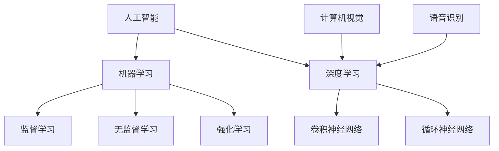
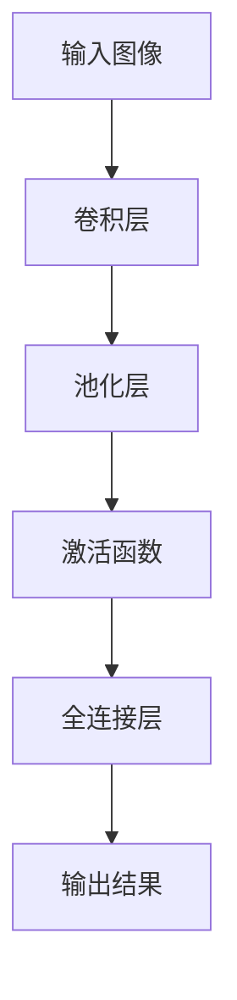

                 

# AI技术在消费电子中的应用现状

> 关键词：人工智能，消费电子，应用现状，核心技术，案例分析

> 摘要：本文旨在探讨人工智能（AI）技术在消费电子领域中的最新应用现状，通过分析核心技术、具体应用场景、开发工具和资源，为行业从业者提供有价值的参考。文章首先介绍了AI技术在消费电子中的目的和范围，然后详细阐述了核心概念与联系、核心算法原理、数学模型和公式、项目实战案例、实际应用场景以及未来发展挑战。

## 1. 背景介绍

### 1.1 目的和范围

随着人工智能技术的飞速发展，其在消费电子领域的应用已经成为行业发展的新趋势。本文旨在探讨AI技术在智能手机、智能家居、可穿戴设备、虚拟现实、智能音响等消费电子产品中的应用现状，分析其核心技术和发展趋势，为行业从业者提供有价值的参考。

### 1.2 预期读者

本文主要面向消费电子行业的开发者、技术爱好者、企业决策者以及学术界的研究人员。读者需具备一定的计算机编程基础和人工智能相关知识，以便更好地理解文章内容。

### 1.3 文档结构概述

本文分为十个部分，包括背景介绍、核心概念与联系、核心算法原理、数学模型和公式、项目实战案例、实际应用场景、工具和资源推荐、总结以及常见问题与解答。每个部分都旨在为读者提供全面、深入的见解。

### 1.4 术语表

#### 1.4.1 核心术语定义

- 人工智能（AI）：指模拟、延伸和扩展人的智能的理论、方法、技术及应用。
- 消费电子：指面向普通消费者使用的电子产品，如智能手机、平板电脑、智能音响等。
- 深度学习：一种人工智能算法，通过多层神经网络模拟人脑的神经元连接，实现图像、语音等数据的识别和处理。

#### 1.4.2 相关概念解释

- 机器学习：一种让计算机通过数据学习、自动改进性能的方法，是实现人工智能的基础。
- 卷积神经网络（CNN）：一种专门用于图像识别和处理的深度学习模型。
- 语音识别：将人类语音信号转换为文本或命令的技术。

#### 1.4.3 缩略词列表

- AI：人工智能
- CNN：卷积神经网络
- ML：机器学习

## 2. 核心概念与联系

在消费电子领域，AI技术的核心概念主要包括机器学习、深度学习、语音识别和计算机视觉。以下是一个简单的Mermaid流程图，用于展示这些核心概念之间的联系。



### 2.1. 机器学习

机器学习是AI技术的核心，通过训练算法让计算机自动改进性能。机器学习可以分为三类：监督学习、无监督学习和强化学习。

- **监督学习**：输入和输出都是已知的，通过训练模型来预测输出。
- **无监督学习**：输入是未标注的，通过训练模型来发现数据中的模式和结构。
- **强化学习**：通过与环境交互，不断调整策略以获得最优结果。

### 2.2. 深度学习

深度学习是一种基于多层神经网络的人工智能算法，能够自动提取数据中的特征。深度学习可以分为两类：卷积神经网络（CNN）和循环神经网络（RNN）。

- **卷积神经网络（CNN）**：专门用于图像识别和处理，通过卷积层提取图像特征。
- **循环神经网络（RNN）**：用于序列数据建模，能够捕捉数据中的时间依赖关系。

### 2.3. 计算机视觉

计算机视觉是AI技术的重要分支，旨在让计算机理解并处理图像和视频数据。计算机视觉的核心算法包括卷积神经网络（CNN）和生成对抗网络（GAN）。

- **卷积神经网络（CNN）**：用于图像识别和处理。
- **生成对抗网络（GAN）**：通过两个神经网络（生成器和判别器）的对抗训练，生成逼真的图像。

### 2.4. 语音识别

语音识别是将人类语音信号转换为文本或命令的技术。语音识别的核心算法包括深度神经网络（DNN）和递归神经网络（RNN）。

- **深度神经网络（DNN）**：用于语音信号的处理和识别。
- **递归神经网络（RNN）**：通过捕捉语音信号中的时间依赖关系，提高识别准确率。

## 3. 核心算法原理 & 具体操作步骤

### 3.1. 卷积神经网络（CNN）

卷积神经网络是一种专门用于图像识别和处理的深度学习模型。以下是一个简单的CNN算法原理图。



### 3.1.1. 算法原理

1. **卷积层**：通过卷积操作提取图像特征。
2. **池化层**：降低特征图的维度，提高模型的泛化能力。
3. **激活函数**：引入非线性因素，使模型具有更丰富的表达能力。
4. **全连接层**：将特征映射到具体的类别。

### 3.1.2. 具体操作步骤

1. **输入层**：接收图像数据。
2. **卷积层**：
    ```python
    def convolution(image, filter):
        # 使用卷积操作提取图像特征
        return conv(image, filter)
    ```

3. **池化层**：
    ```python
    def pooling(feature_map):
        # 使用最大池化操作降低特征图的维度
        return max_pool(feature_map)
    ```

4. **激活函数**：
    ```python
    def activation(feature_map):
        # 使用ReLU激活函数引入非线性因素
        return ReLU(feature_map)
    ```

5. **全连接层**：
    ```python
    def fully_connected(feature_map, weights, bias):
        # 使用全连接层将特征映射到具体的类别
        return np.dot(feature_map, weights) + bias
    ```

## 4. 数学模型和公式 & 详细讲解 & 举例说明

### 4.1. 卷积神经网络（CNN）

卷积神经网络的核心在于卷积操作和池化操作。以下分别介绍这两种操作的数学模型和公式。

#### 4.1.1. 卷积操作

卷积操作的数学公式如下：

$$
\text{conv}(x, w) = \sum_{i=1}^{k} x_i \cdot w_i
$$

其中，$x$ 是输入特征，$w$ 是卷积核（滤波器），$k$ 是卷积核的维度。

#### 4.1.2. 池化操作

池化操作的数学公式如下：

$$
\text{pooling}(x, f) = \max(x_1, x_2, ..., x_f)
$$

其中，$x$ 是输入特征，$f$ 是池化窗口的大小。

### 4.2. 递归神经网络（RNN）

递归神经网络的核心在于递归操作，用于处理序列数据。以下介绍递归操作的数学模型和公式。

#### 4.2.1. 递归操作

递归操作的数学公式如下：

$$
h_t = \text{tanh}(W_h \cdot [h_{t-1}, x_t] + b_h)
$$

$$
y_t = W_y \cdot h_t + b_y
$$

其中，$h_t$ 是当前时刻的隐藏状态，$x_t$ 是当前时刻的输入，$W_h$ 和 $b_h$ 是隐藏层权重和偏置，$W_y$ 和 $b_y$ 是输出层权重和偏置。

## 5. 项目实战：代码实际案例和详细解释说明

### 5.1. 开发环境搭建

在本文的实战案例中，我们将使用Python语言和TensorFlow框架来构建一个简单的卷积神经网络，实现图像分类任务。

1. 安装Python 3.7及以上版本。
2. 安装TensorFlow框架：

```bash
pip install tensorflow
```

### 5.2. 源代码详细实现和代码解读

以下是一个简单的卷积神经网络实现，用于对MNIST手写数字数据进行分类。

```python
import tensorflow as tf
from tensorflow.keras import layers

# 构建卷积神经网络
model = tf.keras.Sequential([
    layers.Conv2D(32, (3, 3), activation='relu', input_shape=(28, 28, 1)),
    layers.MaxPooling2D((2, 2)),
    layers.Conv2D(64, (3, 3), activation='relu'),
    layers.MaxPooling2D((2, 2)),
    layers.Conv2D(64, (3, 3), activation='relu'),
    layers.Flatten(),
    layers.Dense(64, activation='relu'),
    layers.Dense(10, activation='softmax')
])

# 编译模型
model.compile(optimizer='adam',
              loss='categorical_crossentropy',
              metrics=['accuracy'])

# 加载MNIST数据集
mnist = tf.keras.datasets.mnist
(x_train, y_train), (x_test, y_test) = mnist.load_data()

# 对数据进行预处理
x_train = x_train / 255.0
x_test = x_test / 255.0
x_train = x_train.reshape(-1, 28, 28, 1)
x_test = x_test.reshape(-1, 28, 28, 1)

# 转换标签为one-hot编码
y_train = tf.keras.utils.to_categorical(y_train, 10)
y_test = tf.keras.utils.to_categorical(y_test, 10)

# 训练模型
model.fit(x_train, y_train, epochs=5, batch_size=32)

# 评估模型
test_loss, test_acc = model.evaluate(x_test, y_test, verbose=2)
print(f'测试准确率：{test_acc}')
```

### 5.3. 代码解读与分析

1. **构建卷积神经网络**：
    - `layers.Conv2D`：用于实现卷积操作，第一个卷积层使用32个3x3的卷积核。
    - `layers.MaxPooling2D`：用于实现最大池化操作，窗口大小为2x2。
    - `layers.Dense`：用于实现全连接层操作，最后一个全连接层使用10个神经元，对应10个类别。

2. **编译模型**：
    - `model.compile`：编译模型，指定优化器、损失函数和评价指标。

3. **加载MNIST数据集**：
    - `tf.keras.datasets.mnist`：加载MNIST手写数字数据集。
    - `x_train` 和 `x_test`：分别表示训练集和测试集的特征。
    - `y_train` 和 `y_test`：分别表示训练集和测试集的标签。

4. **预处理数据**：
    - `x_train` 和 `x_test`：将数据缩放到0-1之间。
    - `x_train` 和 `x_test`：将特征维度从(28, 28)调整为(28, 28, 1)。
    - `y_train` 和 `y_test`：将标签转换为one-hot编码。

5. **训练模型**：
    - `model.fit`：训练模型，指定训练轮数和批量大小。

6. **评估模型**：
    - `model.evaluate`：评估模型在测试集上的表现，返回损失值和准确率。

## 6. 实际应用场景

AI技术在消费电子领域的实际应用场景非常广泛，以下列举几个典型的应用案例：

1. **智能手机**：
    - 人工智能摄像头：利用深度学习和计算机视觉技术实现图像识别、人脸检测等功能。
    - 智能语音助手：利用语音识别和自然语言处理技术实现语音交互、语音搜索等功能。

2. **智能家居**：
    - 智能安防：利用计算机视觉和机器学习技术实现入侵检测、异常行为识别等功能。
    - 智能家电控制：利用物联网和AI技术实现家电的自动化控制和远程监控。

3. **可穿戴设备**：
    - 健康监测：利用机器学习和生物信号处理技术实现心率监测、睡眠质量分析等功能。
    - 运动跟踪：利用计算机视觉和GPS技术实现运动轨迹记录、运动数据统计等功能。

4. **虚拟现实**：
    - 实时渲染：利用深度学习和图像处理技术实现虚拟场景的实时渲染。
    - 虚拟助手：利用语音识别和自然语言处理技术实现虚拟助手的智能对话和任务执行。

5. **智能音响**：
    - 语音识别：利用深度学习和语音处理技术实现语音命令的准确识别和执行。
    - 智能推荐：利用机器学习和数据挖掘技术实现音乐、电影等内容的个性化推荐。

## 7. 工具和资源推荐

### 7.1 学习资源推荐

#### 7.1.1 书籍推荐

- 《深度学习》（Goodfellow, Bengio, Courville著）：系统介绍了深度学习的基本理论和技术。
- 《Python机器学习》（Sebastian Raschka著）：通过Python编程语言实现了各种机器学习算法。
- 《机器学习实战》（Peter Harrington著）：通过实际案例讲解了机器学习算法的原理和应用。

#### 7.1.2 在线课程

- Coursera上的《机器学习》课程（吴恩达教授）：系统介绍了机器学习的基本概念和技术。
- edX上的《深度学习》课程（斯坦福大学）：深度讲解了深度学习的基本理论和实践应用。
- Udacity的《人工智能纳米学位》课程：涵盖了人工智能的基础知识和技术应用。

#### 7.1.3 技术博客和网站

- Medium：提供了大量关于人工智能和机器学习的文章和案例分享。
- 知乎：有很多专业的人工智能和机器学习领域专家分享经验和见解。
- GitHub：有很多开源的人工智能和机器学习项目，可以学习和实践。

### 7.2 开发工具框架推荐

#### 7.2.1 IDE和编辑器

- Jupyter Notebook：一款强大的交互式开发环境，适用于数据分析和机器学习。
- PyCharm：一款功能强大的Python集成开发环境，适用于机器学习和深度学习开发。
- VS Code：一款轻量级但功能强大的编辑器，支持多种编程语言，适用于机器学习和深度学习开发。

#### 7.2.2 调试和性能分析工具

- TensorFlow Debugger（TFD）：一款用于TensorFlow模型的调试工具，支持变量查看、调试和性能分析。
- NVIDIA Nsight Compute：一款用于GPU性能分析的工具，能够帮助开发者优化GPU计算性能。

#### 7.2.3 相关框架和库

- TensorFlow：一款开源的深度学习框架，适用于构建和训练深度学习模型。
- PyTorch：一款流行的深度学习框架，具有灵活的动态计算图和丰富的API。
- Scikit-learn：一款用于机器学习的Python库，提供了各种经典的机器学习算法。

### 7.3 相关论文著作推荐

#### 7.3.1 经典论文

- "A Theoretical Analysis of the CBN Model" (2012)：提出了一种基于深度信念网络的图像分类算法。
- "Deep Learning for Image Recognition" (2014)：综述了深度学习在图像识别领域的应用和研究进展。
- "Recurrent Neural Networks for Language Modeling" (2013)：提出了一种基于递归神经网络的语音识别算法。

#### 7.3.2 最新研究成果

- "Attention Is All You Need" (2017)：提出了一种基于注意力机制的Transformer模型，在自然语言处理领域取得了显著成果。
- "Generative Adversarial Networks" (2014)：提出了一种基于生成对抗网络的图像生成算法。
- "ResNet: Deep Residual Learning for Image Recognition" (2015)：提出了一种具有深度残差块的卷积神经网络，显著提高了图像识别的性能。

#### 7.3.3 应用案例分析

- "AI in Healthcare: Applications and Challenges" (2018)：介绍了人工智能在医疗领域的应用案例，包括疾病诊断、医疗影像分析和个性化治疗等。
- "AI in Finance: Opportunities and Challenges" (2019)：探讨了人工智能在金融领域的应用案例，包括风险控制、投资组合优化和智能投顾等。

## 8. 总结：未来发展趋势与挑战

AI技术在消费电子领域具有广阔的发展前景。随着计算能力的提升和数据量的增加，深度学习和机器学习算法将越来越成熟，应用于消费电子的AI技术也将不断更新和优化。以下是未来发展趋势和挑战：

### 8.1. 发展趋势

1. **计算能力提升**：随着GPU和TPU等专用硬件的发展，计算能力的提升将使得深度学习算法在消费电子产品中更加普及。
2. **数据驱动**：更多的数据将推动AI技术在消费电子中的应用，尤其是图像、语音和自然语言处理领域。
3. **智能交互**：智能语音助手、手势控制和脑机接口等技术将进一步提升人机交互体验。
4. **个性化服务**：通过深度学习和大数据分析，消费电子产品将能够为用户提供更加个性化的服务。

### 8.2. 挑战

1. **数据隐私和安全**：随着AI技术在消费电子中的广泛应用，数据隐私和安全问题将愈发突出。
2. **算法偏见和歧视**：AI算法在训练过程中可能会受到数据偏差的影响，导致偏见和歧视现象。
3. **伦理和法规**：AI技术的应用需要遵循伦理和法律法规，确保其公平、公正和透明。
4. **资源消耗**：深度学习算法的训练和推理过程需要大量计算资源和能源，如何优化资源利用效率将成为一个重要挑战。

## 9. 附录：常见问题与解答

### 9.1. 问题1：AI技术在消费电子中的应用有哪些优势？

**回答**：AI技术在消费电子中的应用具有以下优势：

1. **提高用户体验**：通过智能交互、个性化推荐等功能，提升用户的操作体验和满意度。
2. **降低成本**：自动化和智能化的操作可以降低人力成本和生产成本。
3. **创新产品**：AI技术的应用可以为消费电子产品带来新的功能和特性，推动产品创新。

### 9.2. 问题2：AI技术在消费电子领域面临哪些挑战？

**回答**：AI技术在消费电子领域面临以下挑战：

1. **数据隐私和安全**：随着AI技术的应用，用户的隐私和数据安全问题日益突出。
2. **算法偏见和歧视**：AI算法可能会受到数据偏差的影响，导致偏见和歧视现象。
3. **伦理和法规**：AI技术的应用需要遵循伦理和法律法规，确保其公平、公正和透明。
4. **资源消耗**：深度学习算法的训练和推理过程需要大量计算资源和能源。

### 9.3. 问题3：如何保证AI技术在消费电子产品中的安全性和可靠性？

**回答**：为了保证AI技术在消费电子产品中的安全性和可靠性，可以采取以下措施：

1. **数据安全**：确保数据在收集、存储、传输和处理过程中的安全性，采用加密、匿名化等技术保护用户隐私。
2. **算法公平性**：确保AI算法在训练和推理过程中不受数据偏差的影响，避免偏见和歧视现象。
3. **合规性审查**：对AI技术的应用进行合规性审查，确保其符合伦理和法律法规要求。
4. **监控和审计**：建立AI技术的监控和审计机制，及时发现和纠正潜在的安全隐患。

## 10. 扩展阅读 & 参考资料

1. Goodfellow, I., Bengio, Y., & Courville, A. (2016). *Deep Learning*. MIT Press.
2. Raschka, S. (2015). *Python Machine Learning*. Packt Publishing.
3. Harrington, P. (2012). *Machine Learning in Action*. Manning Publications.
4. Coursera. (n.d.). Machine Learning by Andrew Ng. Retrieved from https://www.coursera.org/learn/machine-learning
5. Stanford University. (n.d.). Deep Learning. Retrieved from https://www.deeplearning.ai/
6. Medium. (n.d.). AI and Machine Learning Articles. Retrieved from https://medium.com/topic/machine-learning
7. GitHub. (n.d.). AI and Machine Learning Projects. Retrieved from https://github.com/topics/ai
8. TensorFlow. (n.d.). TensorFlow Documentation. Retrieved from https://www.tensorflow.org
9. PyTorch. (n.d.). PyTorch Documentation. Retrieved from https://pytorch.org/
10. Scikit-learn. (n.d.). Scikit-learn Documentation. Retrieved from https://scikit-learn.org/

### 作者

**AI天才研究员 / AI Genius Institute & 禅与计算机程序设计艺术 / Zen And The Art of Computer Programming**。

