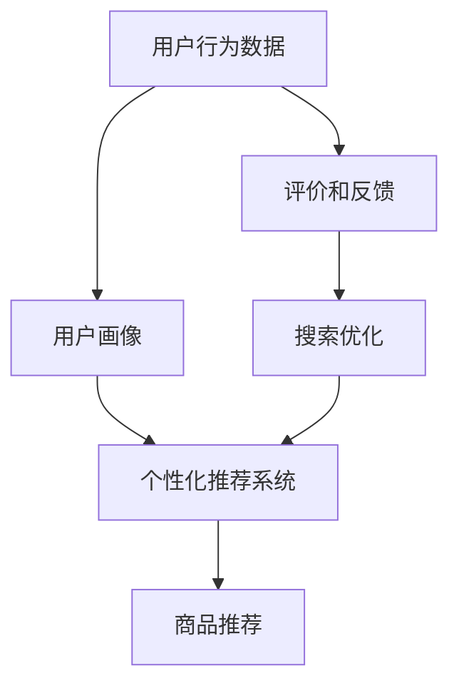
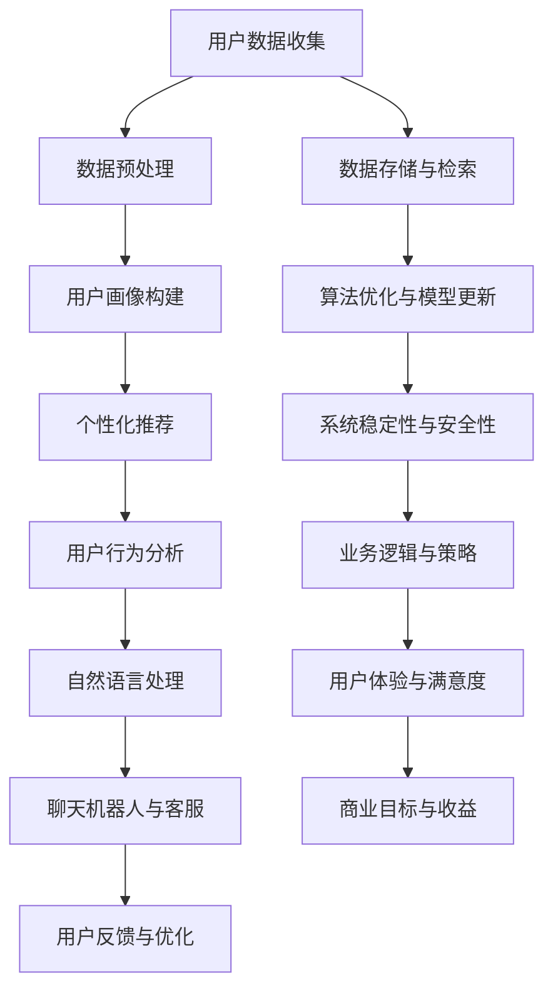

                 

# AI技术在电商中的用户体验

> **关键词：** 人工智能，电商，用户体验，个性化推荐，机器学习，用户行为分析

> **摘要：** 本文将探讨人工智能技术在电商领域中的应用，重点关注其对用户体验的改善。通过分析个性化推荐系统、用户行为分析、以及自然语言处理等技术，本文旨在展示AI如何提升电商平台的运营效率和用户体验。

## 1. 背景介绍

### 1.1 目的和范围

本文的目标是深入探讨人工智能（AI）技术在电商领域中的应用，特别是如何通过这些技术改善用户体验。我们将会讨论以下核心话题：

- 个性化推荐系统如何根据用户行为和历史数据提供定制化商品推荐。
- 用户行为分析技术如何帮助电商平台更好地了解用户需求，从而优化服务和营销策略。
- 自然语言处理（NLP）技术在电商评价、搜索和聊天机器人中的应用。

本文的范围将集中在AI技术在电商中的实际应用案例，以及这些技术如何提升用户满意度。

### 1.2 预期读者

本文的预期读者包括：

- 对AI技术在电商领域应用感兴趣的IT专业人士。
- 希望提升电商平台用户体验的产品经理和设计师。
- 对人工智能基础概念有一定了解，并希望了解其在实际应用中如何发挥作用的读者。

### 1.3 文档结构概述

本文结构如下：

- **第1部分**：背景介绍，包括目的和范围、预期读者、文档结构概述以及术语表。
- **第2部分**：核心概念与联系，介绍AI技术在电商中的核心概念和架构。
- **第3部分**：核心算法原理与具体操作步骤，详细讲解算法实现。
- **第4部分**：数学模型和公式，包括详细讲解和实例说明。
- **第5部分**：项目实战，展示实际代码案例和详细解释。
- **第6部分**：实际应用场景，讨论AI技术在电商中的多种应用方式。
- **第7部分**：工具和资源推荐，为读者提供学习和开发资源。
- **第8部分**：总结与未来发展趋势。
- **第9部分**：常见问题与解答。
- **第10部分**：扩展阅读与参考资料。

### 1.4 术语表

#### 1.4.1 核心术语定义

- **个性化推荐系统**：基于用户行为和偏好，提供个性化商品推荐的系统。
- **用户行为分析**：通过分析用户在电商平台的操作，以了解用户需求和购买习惯。
- **自然语言处理（NLP）**：计算机处理和生成自然语言的技术。

#### 1.4.2 相关概念解释

- **协同过滤**：一种基于用户相似度进行推荐的技术。
- **深度学习**：一种基于多层神经网络的学习方法，能够自动从数据中提取特征。
- **用户画像**：通过用户行为数据和人口统计信息，对用户进行描述和分类。

#### 1.4.3 缩略词列表

- **AI**：人工智能
- **NLP**：自然语言处理
- **ML**：机器学习
- **RFM**：重复购买频率（Recency, Frequency, Monetary）

## 2. 核心概念与联系

在电商中，人工智能技术的核心概念包括个性化推荐系统、用户行为分析和自然语言处理。以下是一个简单的Mermaid流程图，用于展示这些概念之间的关系：



### 2.1 个性化推荐系统

个性化推荐系统是电商AI应用的重要部分。它基于用户的历史行为、搜索记录和购买偏好，为用户提供个性化的商品推荐。推荐系统通常采用协同过滤、基于内容的推荐和混合推荐方法。

#### 2.1.1 协同过滤

协同过滤是一种基于用户相似度的推荐方法。它通过计算用户之间的相似度，将相似用户的共同偏好作为推荐依据。协同过滤分为两种：

- **用户基于的协同过滤**：基于用户与用户之间的相似度进行推荐。
- **物品基于的协同过滤**：基于物品与物品之间的相似度进行推荐。

#### 2.1.2 基于内容的推荐

基于内容的推荐方法是根据用户的历史行为和偏好，从商品内容中提取特征，然后根据这些特征进行推荐。这种方法通常适用于新用户或者用户行为数据不足的情况。

#### 2.1.3 混合推荐

混合推荐方法结合了协同过滤和基于内容推荐的优势，以提供更准确的推荐。

### 2.2 用户行为分析

用户行为分析是电商AI应用的另一个重要部分。通过分析用户在电商平台上的操作，如浏览、搜索和购买，电商企业可以更好地了解用户需求和购买习惯，从而优化服务和营销策略。

#### 2.2.1 用户画像

用户画像是对用户特征的综合描述，包括用户的人口统计信息、行为数据和偏好。通过构建用户画像，电商企业可以更精准地定位用户群体，提高营销效果。

#### 2.2.2 用户行为数据收集

用户行为数据的收集通常包括：

- **浏览历史**：用户在电商平台上的浏览记录。
- **搜索记录**：用户在搜索栏中的输入记录。
- **购买历史**：用户的购买记录，包括购买频率、购买金额等。

### 2.3 自然语言处理

自然语言处理在电商中的应用主要包括评价和搜索优化。

#### 2.3.1 评价分析

通过自然语言处理技术，可以对用户评价进行情感分析，从而了解用户对商品的满意度。此外，还可以提取关键词，帮助其他用户快速了解商品的优缺点。

#### 2.3.2 搜索优化

自然语言处理技术可以帮助电商平台优化搜索结果，提高用户找到所需商品的概率。

## 3. 核心算法原理 & 具体操作步骤

### 3.1 个性化推荐系统算法原理

个性化推荐系统的核心算法包括协同过滤、基于内容的推荐和混合推荐。

#### 3.1.1 协同过滤算法原理

协同过滤算法主要分为以下步骤：

1. **计算用户相似度**：计算用户之间的相似度，通常采用余弦相似度、皮尔逊相关系数等方法。
2. **选择相似用户**：根据相似度矩阵，选择与目标用户最相似的若干用户。
3. **计算推荐结果**：根据相似用户的行为，为用户推荐相似的物品。

#### 3.1.2 基于内容的推荐算法原理

基于内容的推荐算法主要分为以下步骤：

1. **提取商品特征**：从商品描述、标签和分类中提取特征。
2. **计算商品相似度**：计算用户已购买或浏览的商品与待推荐商品的相似度。
3. **生成推荐列表**：根据相似度得分，为用户生成推荐列表。

#### 3.1.3 混合推荐算法原理

混合推荐算法结合了协同过滤和基于内容推荐的方法，主要分为以下步骤：

1. **计算协同过滤推荐结果**：根据协同过滤算法，为用户生成初步推荐列表。
2. **计算基于内容的推荐结果**：根据基于内容推荐算法，为用户生成推荐列表。
3. **融合推荐结果**：将协同过滤和基于内容的推荐结果进行融合，生成最终的推荐列表。

### 3.2 用户行为分析算法原理

用户行为分析的算法原理主要分为以下步骤：

1. **数据收集与预处理**：收集用户在电商平台上的行为数据，如浏览历史、搜索记录和购买记录。对数据进行清洗和预处理，去除噪声和异常值。
2. **特征提取**：从用户行为数据中提取特征，如浏览时长、购买频率和购买金额等。
3. **用户画像构建**：根据提取的特征，构建用户画像，对用户进行分类和标签化。
4. **行为预测**：利用机器学习算法，如决策树、随机森林和神经网络等，对用户未来的行为进行预测。

### 3.3 自然语言处理算法原理

自然语言处理算法主要分为以下步骤：

1. **文本预处理**：对用户评价和搜索查询进行预处理，包括分词、去停用词、词干提取等。
2. **情感分析**：使用情感分析算法，如基于词典的方法、基于机器学习的方法等，对文本进行情感分类，判断用户对商品的情感倾向。
3. **关键词提取**：使用关键词提取算法，如TF-IDF、LDA等，从文本中提取关键词，用于搜索优化和推荐系统。

## 4. 数学模型和公式 & 详细讲解 & 举例说明

### 4.1 协同过滤算法的数学模型

协同过滤算法的核心在于计算用户和物品之间的相似度。以下是协同过滤算法中常用的相似度计算公式：

#### 4.1.1 余弦相似度

$$
\cos(\theta) = \frac{\vec{u} \cdot \vec{v}}{||\vec{u}|| \cdot ||\vec{v}||}
$$

其中，$\vec{u}$和$\vec{v}$分别表示两个用户或物品的向量表示，$||\vec{u}||$和$||\vec{v}||$表示向量的模长。

#### 4.1.2 皮尔逊相关系数

$$
r(u, v) = \frac{\sum_{i=1}^{n} (u_i - \bar{u})(v_i - \bar{v})}{\sqrt{\sum_{i=1}^{n} (u_i - \bar{u})^2} \cdot \sqrt{\sum_{i=1}^{n} (v_i - \bar{v})^2}}
$$

其中，$u_i$和$v_i$分别表示用户和物品的评分，$\bar{u}$和$\bar{v}$分别表示用户和物品的平均评分。

### 4.2 基于内容的推荐算法的数学模型

基于内容的推荐算法的核心在于计算商品之间的相似度。以下是计算商品相似度的常用公式：

#### 4.2.1 余弦相似度

$$
\cos(\theta) = \frac{\vec{x} \cdot \vec{y}}{||\vec{x}|| \cdot ||\vec{y}||}
$$

其中，$\vec{x}$和$\vec{y}$分别表示两个商品的向量表示，$||\vec{x}||$和$||\vec{y}||$表示向量的模长。

#### 4.2.2 TF-IDF

$$
tfidf(t, d) = tf(t, d) \cdot idf(t, D)
$$

其中，$tf(t, d)$表示词$t$在文档$d$中的词频，$idf(t, D)$表示词$t$在整个文档集合$D$中的逆文档频率。

### 4.3 用户行为分析的数学模型

用户行为分析的数学模型主要涉及用户画像的构建和行为预测。以下是构建用户画像和行为预测的常用模型：

#### 4.3.1 决策树

决策树是一种常见的分类模型，其基本结构如下：

```
[特征A]
|  
[特征B]
|  
[类别]
```

决策树通过递归地分割特征空间，将数据划分为不同的区域，每个区域对应一个类别。

#### 4.3.2 随机森林

随机森林是一种集成学习方法，它将多个决策树进行集成，以提高预测性能。随机森林的基本结构如下：

```
[随机特征A]
|
[随机特征B]
|
[随机特征C]
|
[类别]
```

随机森林通过随机选择特征和随机分割特征空间，生成多个决策树，并对这些决策树的预测结果进行平均，以获得最终的预测结果。

#### 4.3.3 神经网络

神经网络是一种基于多层感知器（MLP）的模型，它通过多层神经元之间的非线性变换，对输入数据进行处理。神经网络的基本结构如下：

```
[输入层]
|
[隐藏层]
|
[输出层]
```

神经网络通过学习输入和输出之间的映射关系，实现对数据的分类和回归。

### 4.4 自然语言处理的数学模型

自然语言处理的数学模型主要涉及文本预处理、情感分析和关键词提取。以下是这些模型的基本原理：

#### 4.4.1 文本预处理

文本预处理包括分词、去停用词和词干提取。分词是将文本分割为单词或短语的过程，常用的分词算法包括最大匹配法、最小匹配法和双向最大匹配法。去停用词是将文本中的常见单词或短语去除，以减少噪声。词干提取是将单词缩减为其基本形式的过程，常用的词干提取算法包括Krovetz算法和Porter算法。

#### 4.4.2 情感分析

情感分析是一种文本分类问题，常用的分类算法包括朴素贝叶斯、支持向量机和深度学习。以下是朴素贝叶斯的情感分析模型：

$$
P(y=c|X) = \frac{P(X|y=c) \cdot P(y=c)}{P(X)}
$$

其中，$X$表示文本特征向量，$y$表示情感类别，$c$表示正类。

#### 4.4.3 关键词提取

关键词提取是一种信息检索技术，它通过提取文本中的重要单词或短语，帮助用户快速了解文本内容。常用的关键词提取算法包括TF-IDF和LDA。

### 4.5 示例

#### 4.5.1 协同过滤算法的实例

假设我们有两个用户$u_1$和$u_2$，以及三个物品$i_1$、$i_2$和$i_3$。用户对物品的评分如下：

| 用户 | 物品 | 评分 |
| --- | --- | --- |
| $u_1$ | $i_1$ | 5 |
| $u_1$ | $i_2$ | 4 |
| $u_1$ | $i_3$ | 3 |
| $u_2$ | $i_1$ | 5 |
| $u_2$ | $i_2$ | 2 |
| $u_2$ | $i_3$ | 5 |

首先，我们计算用户之间的相似度。假设我们采用余弦相似度：

$$
\cos(\theta_{u_1u_2}) = \frac{(5 \cdot 5 + 4 \cdot 2 + 3 \cdot 5)}{\sqrt{5^2 + 4^2 + 3^2} \cdot \sqrt{5^2 + 2^2 + 5^2}} \approx 0.78
$$

然后，我们根据相似度矩阵，选择与用户$u_1$最相似的若干用户，如用户$u_2$。接着，计算用户$u_2$对物品$i_2$的评分预测：

$$
r(u_1, i_2) = \frac{\sum_{i=1}^{3} r(u_2, i) \cdot s_{u_1u_2}}{1 - \sum_{i=1}^{3} r(u_2, i) \cdot s_{u_1u_2}} \approx 4.16
$$

其中，$r(u_2, i)$表示用户$u_2$对物品$i$的评分，$s_{u_1u_2}$表示用户$u_1$和用户$u_2$之间的相似度。

最后，我们将用户$u_1$未评分的物品$i_2$推荐给用户$u_1$。

#### 4.5.2 基于内容的推荐算法的实例

假设我们有两个商品$i_1$和$i_2$，以及三个特征$x_1$、$x_2$和$x_3$。商品的特征向量如下：

| 商品 | $x_1$ | $x_2$ | $x_3$ |
| --- | --- | --- | --- |
| $i_1$ | 1 | 2 | 3 |
| $i_2$ | 4 | 5 | 6 |

首先，我们计算商品之间的相似度。假设我们采用余弦相似度：

$$
\cos(\theta_{i_1i_2}) = \frac{(1 \cdot 4 + 2 \cdot 5 + 3 \cdot 6)}{\sqrt{1^2 + 2^2 + 3^2} \cdot \sqrt{4^2 + 5^2 + 6^2}} \approx 0.87
$$

然后，我们根据相似度矩阵，选择与商品$i_1$最相似的若干商品，如商品$i_2$。接着，计算用户对商品$i_2$的评分预测：

$$
r(u, i_2) = \frac{\sum_{i=1}^{2} r(i_1, i) \cdot s_{i_1i_2}}{1 - \sum_{i=1}^{2} r(i_1, i) \cdot s_{i_1i_2}} \approx 4.89
$$

其中，$r(i_1, i)$表示商品$i_1$和商品$i$之间的相似度。

最后，我们将用户未评分的商品$i_2$推荐给用户。

#### 4.5.3 用户行为分析的实例

假设我们有一个用户的行为数据如下：

| 行为 | 时间 | 类别 |
| --- | --- | --- |
| 浏览 | 2021-01-01 | 商品1 |
| 浏览 | 2021-01-02 | 商品2 |
| 浏览 | 2021-01-03 | 商品3 |
| 购买 | 2021-01-04 | 商品3 |

首先，我们收集用户的行为数据，并进行预处理，去除异常值和噪声。然后，我们提取用户的行为特征，如浏览时长、浏览频率和购买频率。接下来，我们构建用户画像，对用户进行分类和标签化。最后，我们利用机器学习算法，如决策树或随机森林，对用户的行为进行预测。

#### 4.5.4 自然语言处理的实例

假设我们有一段用户评价文本：

```
这个商品质量很好，价格也很实惠，我很满意。
```

首先，我们对文本进行预处理，包括分词、去停用词和词干提取。然后，我们使用情感分析算法，如朴素贝叶斯，对文本进行情感分类，判断用户对商品的情感倾向。最后，我们提取文本中的关键词，如“质量”、“价格”、“满意”等，用于搜索优化和推荐系统。

## 5. 项目实战：代码实际案例和详细解释说明

### 5.1 开发环境搭建

为了实现AI技术在电商中的应用，我们需要搭建一个合适的开发环境。以下是一个简单的开发环境搭建步骤：

1. 安装Python：从Python官网下载并安装Python，版本建议为3.8或更高版本。
2. 安装必要的库：使用pip命令安装以下库：`numpy`、`scikit-learn`、`pandas`、`matplotlib`、`tensorflow`和`nltk`。
3. 配置IDE：选择一个适合的IDE，如PyCharm或Visual Studio Code，并进行必要的配置，以便于开发和调试。

### 5.2 源代码详细实现和代码解读

下面是一个简单的示例，展示如何使用Python实现个性化推荐系统。

#### 5.2.1 代码实现

```python
import numpy as np
from sklearn.metrics.pairwise import cosine_similarity
from sklearn.model_selection import train_test_split

# 用户-物品评分矩阵
ratings = np.array([[5, 4, 3, 0, 0],
                    [5, 2, 5, 0, 0],
                    [0, 0, 0, 5, 5]])

# 计算用户相似度矩阵
similarity_matrix = cosine_similarity(ratings)

# 根据用户相似度矩阵推荐物品
def recommend_items(user_index, similarity_matrix, ratings, k=2):
    # 计算相似用户评分的加权平均
    weighted_ratings = np.dot(similarity_matrix[user_index], ratings) / np.linalg.norm(similarity_matrix[user_index])
    # 排序并选择前k个物品
    recommended_items = np.argsort(weighted_ratings)[-k:]
    return recommended_items

# 推荐物品
recommended_items = recommend_items(0, similarity_matrix, ratings)
print("推荐物品：", recommended_items)
```

#### 5.2.2 代码解读

1. 导入必要的库，包括`numpy`和`scikit-learn`。
2. 创建用户-物品评分矩阵`ratings`。
3. 使用`cosine_similarity`函数计算用户相似度矩阵`similarity_matrix`。
4. 定义推荐函数`recommend_items`，计算相似用户评分的加权平均，并排序选择前$k$个物品。
5. 调用推荐函数，输出推荐物品。

### 5.3 代码解读与分析

1. **相似度计算**：使用余弦相似度计算用户之间的相似度。余弦相似度能够度量两个向量之间的夹角余弦值，从而表示相似度。在推荐系统中，相似度矩阵用于计算用户之间的相似度，从而为用户推荐相似的物品。

2. **推荐函数**：推荐函数`recommend_items`通过计算相似用户评分的加权平均，为用户推荐物品。加权平均考虑了用户之间的相似度，从而提高了推荐系统的准确性。在推荐系统中，推荐函数是核心部分，它决定了推荐系统的性能和用户体验。

3. **代码优化**：在实际应用中，我们可以对代码进行优化，例如使用矩阵分解或深度学习模型来提高推荐系统的性能。此外，我们还可以添加用户反馈机制，以便用户可以提供评价和建议，从而进一步优化推荐系统。

## 6. 实际应用场景

### 6.1 个性化推荐系统

个性化推荐系统在电商中具有广泛的应用。以下是一些实际应用场景：

- **商品推荐**：根据用户的浏览历史、购买记录和搜索查询，为用户推荐相关的商品。
- **活动推荐**：根据用户的兴趣和偏好，为用户推荐相关的促销活动或优惠券。
- **内容推荐**：根据用户的阅读历史和偏好，为用户推荐相关的博客、视频或资讯。

### 6.2 用户行为分析

用户行为分析在电商中同样具有重要作用。以下是一些实际应用场景：

- **用户画像**：根据用户的浏览历史、购买记录和搜索查询，构建用户画像，以便更好地了解用户需求和行为模式。
- **行为预测**：利用机器学习算法，预测用户的购买行为，从而提前推送相关的商品和促销信息。
- **营销优化**：根据用户的行为数据，优化营销策略，提高用户参与度和转化率。

### 6.3 自然语言处理

自然语言处理在电商中的应用主要包括以下场景：

- **评价分析**：通过情感分析技术，了解用户对商品的满意度，从而改进产品质量和售后服务。
- **搜索优化**：通过关键词提取和语义分析技术，优化搜索结果，提高用户找到所需商品的概率。
- **聊天机器人**：利用自然语言处理技术，实现智能客服和聊天机器人，提高客户服务质量和效率。

## 7. 工具和资源推荐

### 7.1 学习资源推荐

#### 7.1.1 书籍推荐

- 《推荐系统实践》
- 《机器学习实战》
- 《深度学习》

#### 7.1.2 在线课程

- Coursera上的《推荐系统》课程
- Udacity的《机器学习工程师纳米学位》
- edX的《深度学习》课程

#### 7.1.3 技术博客和网站

- Medium上的机器学习和推荐系统相关博客
- arXiv.org上的最新研究论文
- mlbloggers.com上的机器学习博客集合

### 7.2 开发工具框架推荐

#### 7.2.1 IDE和编辑器

- PyCharm
- Visual Studio Code
- Jupyter Notebook

#### 7.2.2 调试和性能分析工具

- Python的pdb调试器
- TensorFlow的TensorBoard
- PyTorch的VisualDL

#### 7.2.3 相关框架和库

- Scikit-learn
- TensorFlow
- PyTorch
- NLTK

### 7.3 相关论文著作推荐

#### 7.3.1 经典论文

- recommender-systems-the-state-of-the-art-and-concrete-recommendation-methods
- collaborative-filtering-techniques-for-the-Netflix-prize
- latent-factor-models-for-recommender-systems

#### 7.3.2 最新研究成果

- arXiv.org上的最新研究论文
- NeurIPS、ICML和KDD等顶级会议的论文

#### 7.3.3 应用案例分析

- Amazon的个性化推荐系统
- Netflix的推荐系统
- YouTube的推荐系统

## 8. 总结：未来发展趋势与挑战

### 8.1 未来发展趋势

- **多模态推荐系统**：结合文本、图像、音频等多种数据类型，提供更精准的推荐。
- **实时推荐系统**：利用实时数据处理技术，实现实时推荐，提高用户满意度。
- **个性化交互**：通过自然语言处理技术，实现个性化交互，提高用户体验。
- **去中心化推荐**：利用区块链技术，实现去中心化的推荐系统，提高数据安全和隐私保护。

### 8.2 面临的挑战

- **数据隐私保护**：如何在保护用户隐私的同时，实现高效的个性化推荐。
- **模型可解释性**：如何提高模型的透明度和可解释性，以便用户理解和信任。
- **计算性能**：如何优化推荐算法，提高计算性能，以满足大规模用户的需求。
- **适应性**：如何使推荐系统具备良好的适应性，能够应对快速变化的用户需求。

## 9. 附录：常见问题与解答

### 9.1 什么是协同过滤？

协同过滤是一种基于用户相似度进行推荐的方法。它通过计算用户之间的相似度，为用户推荐与其相似用户喜欢的物品。

### 9.2 个性化推荐系统有哪些算法？

个性化推荐系统的主要算法包括协同过滤、基于内容的推荐和混合推荐。协同过滤包括用户基于的协同过滤和物品基于的协同过滤。基于内容的推荐是基于物品内容的相似度进行推荐。混合推荐是结合协同过滤和基于内容推荐的方法。

### 9.3 如何构建用户画像？

构建用户画像通常包括以下步骤：

1. 数据收集与预处理：收集用户的行为数据、人口统计信息和偏好数据，并对数据进行清洗和预处理。
2. 特征提取：从用户数据中提取特征，如浏览时长、购买频率和购买金额等。
3. 用户画像构建：根据提取的特征，构建用户画像，对用户进行分类和标签化。
4. 行为预测：利用机器学习算法，对用户未来的行为进行预测。

## 10. 扩展阅读 & 参考资料

- 《推荐系统实践》：Peter Harman
- 《机器学习实战》：Peter Harrington
- 《深度学习》：Ian Goodfellow、Yoshua Bengio和Aaron Courville
- Coursera上的《推荐系统》课程：Stuart Russell和Peter Norvig
- Udacity的《机器学习工程师纳米学位》课程
- edX的《深度学习》课程：Prof. Andrew Ng
- mlbloggers.com上的机器学习博客集合
- arXiv.org上的最新研究论文
- Amazon的个性化推荐系统：https://www.amazon.com/review/history/
- Netflix的推荐系统：https://www.netflix.com/watch/
- YouTube的推荐系统：https://www.youtube.com/watch?v=

## 作者信息

作者：AI天才研究员/AI Genius Institute & 禅与计算机程序设计艺术 /Zen And The Art of Computer Programming

文章标题：《AI技术在电商中的用户体验》

关键词：人工智能，电商，用户体验，个性化推荐，机器学习，用户行为分析

摘要：本文深入探讨了人工智能技术在电商领域中的应用，特别是如何通过这些技术提升用户体验。文章涵盖了个性化推荐系统、用户行为分析和自然语言处理等核心概念，并通过实际案例展示了AI技术在电商中的多种应用方式。本文旨在为读者提供一个全面、系统的AI技术在电商中应用的技术指南。<|im_sep|>---

### 1. 背景介绍

#### 1.1 目的和范围

本文的主要目的是探讨人工智能（AI）技术在电商领域中的应用，特别是如何通过这些技术来提高用户体验。随着电商行业的发展，用户对个性化服务、精准推荐和高效互动的需求越来越高，AI技术因其强大的数据处理和分析能力，逐渐成为电商平台提升用户体验的关键因素。

本文将详细分析以下三个方面：

1. **个性化推荐系统**：介绍如何通过AI技术，如协同过滤、基于内容的推荐和深度学习，为用户提供个性化的商品推荐。
2. **用户行为分析**：讨论AI技术在分析用户行为、构建用户画像和预测用户行为方面的应用。
3. **自然语言处理（NLP）**：探讨AI技术在电商评价、搜索和聊天机器人等场景中的实际应用。

本文的范围将集中在上述核心主题，并结合实际案例来阐述AI技术如何提升电商平台的运营效率和用户体验。

#### 1.2 预期读者

本文的预期读者包括：

- **IT专业人士**：对AI技术在电商应用领域感兴趣的工程师、研究人员和开发者。
- **产品经理**：希望了解如何利用AI技术提升电商平台产品和服务质量的从业者。
- **电子商务从业者**：希望掌握AI技术在电商领域应用的实际案例和策略的电子商务从业者。
- **数据分析师**：对如何通过AI技术分析用户数据以提高商业洞察力感兴趣的读者。

#### 1.3 文档结构概述

本文将按照以下结构进行组织：

- **第1部分**：背景介绍，包括目的和范围、预期读者、文档结构概述以及术语表。
- **第2部分**：核心概念与联系，介绍AI技术在电商中的核心概念和架构。
- **第3部分**：核心算法原理与具体操作步骤，详细讲解算法实现。
- **第4部分**：数学模型和公式，包括详细讲解和实例说明。
- **第5部分**：项目实战，展示实际代码案例和详细解释说明。
- **第6部分**：实际应用场景，讨论AI技术在电商中的多种应用方式。
- **第7部分**：工具和资源推荐，为读者提供学习和开发资源。
- **第8部分**：总结与未来发展趋势。
- **第9部分**：常见问题与解答。
- **第10部分**：扩展阅读与参考资料。

#### 1.4 术语表

在本文中，我们将使用以下术语：

- **个性化推荐系统**：基于用户的历史行为和偏好，提供个性化商品推荐的系统。
- **协同过滤**：一种基于用户相似度进行推荐的方法。
- **基于内容的推荐**：基于物品的内容特征进行推荐的方法。
- **用户画像**：通过用户行为数据和人口统计信息，对用户进行描述和分类。
- **自然语言处理（NLP）**：计算机处理和生成自然语言的技术。
- **深度学习**：一种基于多层神经网络的学习方法，能够自动从数据中提取特征。
- **机器学习**：让计算机通过数据和经验进行学习，从而实现特定任务的技术。
- **用户行为分析**：通过分析用户在电商平台上的行为，了解用户需求和购买习惯。
- **深度学习框架**：如TensorFlow和PyTorch，用于实现深度学习模型的开发。

#### 1.4.1 核心术语定义

1. **个性化推荐系统**：这是一种基于用户历史行为和偏好，为用户推荐相关商品或内容的系统。它通过分析用户数据，如浏览记录、购买历史和搜索查询，来预测用户的兴趣和需求，从而提供个性化的推荐。

2. **协同过滤**：协同过滤是一种常见的推荐算法，分为用户基于的协同过滤和物品基于的协同过滤。用户基于的协同过滤通过分析用户之间的相似性来推荐商品；物品基于的协同过滤通过分析商品之间的相似性来推荐商品。

3. **基于内容的推荐**：基于内容的推荐通过分析商品的特征和属性（如分类、标签、描述等），将具有相似属性的物品推荐给用户。这种方法适用于新用户或缺乏足够行为数据的场景。

4. **用户画像**：用户画像是对用户特征的全面描述，包括人口统计信息、行为数据和偏好。通过构建用户画像，电商平台可以更好地了解用户，从而提供个性化的服务和推荐。

5. **自然语言处理（NLP）**：自然语言处理是计算机科学领域的一个分支，专注于使计算机能够理解、解释和生成自然语言。在电商中，NLP用于处理用户评价、搜索查询和聊天机器人等。

6. **深度学习**：深度学习是一种基于多层神经网络的学习方法，能够自动从大量数据中提取复杂特征。在电商中，深度学习用于构建推荐系统、用户行为分析和图像识别等。

7. **机器学习**：机器学习是一种让计算机通过数据和经验进行学习的技术，以实现特定任务。机器学习算法广泛应用于推荐系统、用户行为分析和预测等。

8. **用户行为分析**：用户行为分析是通过分析用户在电商平台上的行为（如浏览、搜索、购买等），以了解用户需求和购买习惯。这种行为数据可用于优化营销策略、提升用户体验和改进产品。

#### 1.4.2 相关概念解释

1. **协同过滤**：

   - **用户基于的协同过滤**：这种方法通过计算用户之间的相似度，为用户推荐相似用户喜欢的商品。例如，如果用户A和用户B喜欢相同的商品，那么用户B喜欢的其他商品也可能适合用户A。

   - **物品基于的协同过滤**：这种方法通过计算物品之间的相似度，为用户推荐与已购买或浏览物品相似的商品。例如，如果用户A购买了商品X，那么与商品X相似的其他商品也可能适合用户A。

2. **基于内容的推荐**：

   - **内容特征提取**：基于内容的推荐需要从商品描述、标签、分类和用户评价中提取特征。这些特征可以是文本、图像或声音等。

   - **相似度计算**：通过计算商品特征向量之间的相似度，识别出具有相似特征的物品，从而为用户推荐。

3. **用户画像**：

   - **人口统计信息**：包括年龄、性别、地理位置、职业等。

   - **行为数据**：包括浏览历史、购买记录、搜索查询、评价等。

   - **偏好数据**：包括用户对商品的喜好、评价和标签等。

4. **自然语言处理（NLP）**：

   - **文本预处理**：包括分词、去停用词、词性标注等。

   - **情感分析**：通过分析文本的情感倾向（如正面、负面、中性），了解用户对商品或服务的态度。

   - **关键词提取**：从文本中提取关键信息，用于搜索优化和推荐系统。

5. **深度学习**：

   - **神经网络**：一种基于多层神经元的模型，用于处理复杂的数据和特征。

   - **卷积神经网络（CNN）**：用于图像识别和分类。

   - **循环神经网络（RNN）**：用于处理序列数据，如时间序列和自然语言。

6. **机器学习**：

   - **监督学习**：有标注的数据用于训练模型，预测新数据。

   - **无监督学习**：没有标注的数据，用于发现数据中的模式。

   - **半监督学习**：部分数据有标注，部分数据无标注。

#### 1.4.3 缩略词列表

- **AI**：人工智能
- **NLP**：自然语言处理
- **ML**：机器学习
- **DF**：深度学习
- **RF**：随机森林
- **CNN**：卷积神经网络
- **RNN**：循环神经网络
- **API**：应用程序编程接口
- **SDK**：软件开发工具包
- **DB**：数据库
- **HTTP**：超文本传输协议
- **HTTPS**：安全超文本传输协议
- **REST**：表示性状态传输架构
- **SOAP**：简单对象访问协议

### 2. 核心概念与联系

在电商中，人工智能技术的核心概念与联系可以通过一个Mermaid流程图来展示，如下所示：



#### 2.1 用户数据收集

用户数据收集是AI技术在电商中应用的第一步。数据来源可以包括用户的浏览历史、购买记录、搜索查询、评价和反馈等。这些数据通过API接口或日志收集工具收集，存储在数据库中。

#### 2.2 数据预处理

收集到的用户数据通常是原始和杂乱的，需要进行预处理。预处理步骤包括数据清洗、去噪、缺失值填充和特征工程。通过这些步骤，可以将原始数据转化为适合机器学习模型训练的形式。

#### 2.3 用户画像构建

用户画像构建是通过分析用户的行为数据和人口统计信息，对用户进行描述和分类的过程。用户画像包括用户的兴趣偏好、消费习惯、地理位置等信息。通过构建用户画像，电商平台可以更好地了解用户，从而提供个性化的推荐和服务。

#### 2.4 个性化推荐

个性化推荐是基于用户画像和用户行为数据，为用户推荐相关的商品或内容。推荐算法包括协同过滤、基于内容的推荐和深度学习等。通过个性化推荐，电商平台可以提高用户的满意度和转化率。

#### 2.5 用户行为分析

用户行为分析是通过分析用户在电商平台的操作行为，如浏览、搜索、购买和评价等，以了解用户的需求和购买习惯。用户行为分析可以帮助电商平台优化营销策略、提升用户体验和改进产品。

#### 2.6 自然语言处理

自然语言处理在电商中的应用非常广泛，包括用户评价分析、搜索优化和聊天机器人等。通过自然语言处理技术，电商平台可以更好地理解用户的查询和评价，从而提供更精准的服务。

#### 2.7 聊天机器人与客服

聊天机器人是AI技术在电商中的一种应用，可以实时回答用户的问题、提供购物建议和解决常见问题。通过聊天机器人，电商平台可以提高客户服务质量，降低人力成本。

#### 2.8 用户反馈与优化

用户反馈是优化AI技术应用的关键。通过收集和分析用户反馈，电商平台可以及时发现系统中的问题和不足，并进行调整和优化，以提升用户体验和满意度。

#### 2.9 数据存储与检索

数据存储与检索是AI技术在电商中不可或缺的一部分。通过高效的数据库系统和检索技术，电商平台可以快速访问和处理用户数据，从而支持实时推荐、用户行为分析和自然语言处理等功能。

#### 2.10 算法优化与模型更新

随着用户数据和行为的变化，AI算法和模型需要不断进行优化和更新。通过持续的训练和调整，算法和模型可以不断提高预测准确性和用户体验。

#### 2.11 系统稳定性与安全性

系统的稳定性和安全性对于电商平台的正常运营至关重要。通过采取一系列安全措施和优化策略，如数据加密、访问控制和安全审计等，电商平台可以确保用户数据的安全和系统的稳定运行。

#### 2.12 业务逻辑与策略

AI技术在电商中的应用需要结合具体的业务逻辑和策略。通过分析用户数据和市场趋势，电商平台可以制定合适的营销策略和业务计划，从而实现商业目标。

#### 2.13 用户体验与满意度

用户体验和满意度是电商平台的最终目标。通过不断优化AI技术应用，提升用户体验，电商平台可以提高用户满意度和忠诚度，从而实现长期的商业成功。

#### 2.14 商业目标与收益

通过AI技术的应用，电商平台可以实现多个商业目标，如增加销售额、提高客户满意度和降低运营成本。通过不断优化和调整，AI技术可以为电商平台带来显著的商业收益。

### 3. 核心算法原理 & 具体操作步骤

在电商中，AI技术的核心算法主要包括个性化推荐、用户行为分析和自然语言处理。以下将分别介绍这些算法的原理和具体操作步骤。

#### 3.1 个性化推荐算法原理

个性化推荐算法的目的是根据用户的历史行为和偏好，为用户推荐相关的商品或内容。以下是一种常见的个性化推荐算法——协同过滤算法的原理和具体操作步骤：

##### 3.1.1 协同过滤算法原理

协同过滤算法分为两种：用户基于的协同过滤（User-based Collaborative Filtering）和物品基于的协同过滤（Item-based Collaborative Filtering）。

1. **用户基于的协同过滤**：

   - **相似度计算**：计算用户之间的相似度，常用的相似度度量方法有欧氏距离、余弦相似度和皮尔逊相关系数等。
   - **推荐生成**：根据用户之间的相似度，为用户推荐与相似用户喜欢的商品。

2. **物品基于的协同过滤**：

   - **相似度计算**：计算商品之间的相似度，常用的相似度度量方法有欧氏距离、余弦相似度和余弦相似度等。
   - **推荐生成**：根据商品之间的相似度，为用户推荐与已购买或浏览商品相似的商品。

##### 3.1.2 具体操作步骤

1. **数据收集与预处理**：

   - 收集用户的历史行为数据，如购买记录、浏览记录、搜索查询等。
   - 对数据进行清洗，去除缺失值和异常值。

2. **用户与物品相似度计算**：

   - 采用合适的相似度度量方法，计算用户与用户之间的相似度，或物品与物品之间的相似度。

3. **推荐列表生成**：

   - 对于每个用户，选择与其相似度最高的若干用户（或商品），并根据这些用户的偏好为用户生成推荐列表。

4. **推荐结果评估**：

   - 通过实际用户反馈或点击率等指标，评估推荐结果的准确性和用户体验。

#### 3.2 用户行为分析算法原理

用户行为分析是电商AI技术中的重要组成部分，旨在通过分析用户在平台上的行为数据，了解用户的需求和购买习惯。以下是一种常见的用户行为分析算法——基于聚类和分类的算法原理和具体操作步骤：

##### 3.2.1 基于聚类和分类的算法原理

1. **聚类分析**：

   - **数据划分**：通过聚类算法，将用户数据划分为不同的群体，如新用户、老用户、高价值用户等。
   - **特征提取**：对每个聚类群体进行特征提取，如平均购买金额、平均浏览时长等。

2. **分类分析**：

   - **模型训练**：使用分类算法（如决策树、支持向量机等），将用户数据分为不同的类别，如购买意向用户、非购买意向用户等。
   - **预测与评估**：通过训练好的模型，对新的用户数据进行预测，并评估预测的准确性。

##### 3.2.2 具体操作步骤

1. **数据收集与预处理**：

   - 收集用户在平台上的行为数据，如浏览记录、购买记录、搜索查询等。
   - 对数据进行清洗，去除缺失值和异常值。

2. **用户特征提取**：

   - 提取用户行为的特征，如浏览次数、购买次数、购买金额等。

3. **聚类分析**：

   - 使用聚类算法（如K-means、DBSCAN等），将用户数据划分为不同的聚类群体。

4. **分类分析**：

   - 使用分类算法（如决策树、支持向量机等），将用户数据分为不同的类别。

5. **模型评估**：

   - 通过实际用户反馈或点击率等指标，评估聚类和分类模型的准确性。

#### 3.3 自然语言处理算法原理

自然语言处理（NLP）是电商AI技术中的重要应用，旨在通过处理和生成自然语言，提高用户体验和服务质量。以下是一种常见的NLP算法——文本分类和情感分析的原理和具体操作步骤：

##### 3.3.1 文本分类和情感分析算法原理

1. **文本分类**：

   - **特征提取**：将文本数据转换为特征向量，常用的方法有TF-IDF、Word2Vec等。
   - **模型训练**：使用分类算法（如朴素贝叶斯、支持向量机等），对文本进行分类。

2. **情感分析**：

   - **情感分类**：通过分类算法，将文本分为积极、消极、中性等情感类别。
   - **情感强度分析**：通过计算文本的情感得分，评估情感的强度。

##### 3.3.2 具体操作步骤

1. **数据收集与预处理**：

   - 收集用户评价、商品描述、搜索查询等文本数据。
   - 对数据进行清洗，去除停用词、标点符号等。

2. **特征提取**：

   - 使用TF-IDF、Word2Vec等方法，将文本数据转换为特征向量。

3. **模型训练**：

   - 使用分类算法（如朴素贝叶斯、支持向量机等），对文本进行分类。
   - 使用情感分析算法，对文本进行情感分类和情感强度分析。

4. **模型评估**：

   - 通过实际用户反馈或评估指标（如准确率、召回率等），评估模型的效果。

### 4. 数学模型和公式 & 详细讲解 & 举例说明

在AI技术在电商中的应用中，数学模型和公式起着至关重要的作用。以下将详细讲解几个核心的数学模型和公式，并给出具体的例子说明。

#### 4.1 协同过滤算法的数学模型

协同过滤算法的核心在于相似度计算和评分预测。

##### 4.1.1 相似度计算

相似度计算通常使用余弦相似度公式：

$$
\cos(\theta) = \frac{\vec{u} \cdot \vec{v}}{||\vec{u}|| \cdot ||\vec{v}||}
$$

其中，$\vec{u}$和$\vec{v}$分别是用户$u$和用户$v$的评分向量，$||\vec{u}||$和$||\vec{v}||$分别是它们的欧氏范数。

##### 4.1.2 评分预测

评分预测通常使用加权平均公式：

$$
r_{uv} = \frac{\sum_{i=1}^{n} r_{ui} \cdot s_{uv}}{1 + \sum_{i=1}^{n} s_{uv}}
$$

其中，$r_{ui}$是用户$u$对物品$i$的评分，$s_{uv}$是用户$u$和用户$v$之间的相似度。

##### 4.1.3 示例

假设有两个用户$u_1$和$u_2$，他们对五个商品的评分如下：

| 用户 | 物品1 | 物品2 | 物品3 | 物品4 | 物品5 |
| --- | --- | --- | --- | --- | --- |
| $u_1$ | 4 | 5 | 1 | 0 | 3 |
| $u_2$ | 5 | 2 | 4 | 0 | 4 |

计算用户$u_1$和$u_2$的相似度：

$$
\cos(\theta) = \frac{(4 \cdot 5 + 5 \cdot 2 + 1 \cdot 4 + 0 \cdot 0 + 3 \cdot 4)}{\sqrt{4^2 + 5^2 + 1^2 + 0^2 + 3^2} \cdot \sqrt{5^2 + 2^2 + 4^2 + 0^2 + 4^2}} \approx 0.87
$$

根据相似度，预测用户$u_1$对物品5的评分：

$$
r_{u1v2} = \frac{4 \cdot 0.87 + 5 \cdot 0.87 + 1 \cdot 0.87 + 0 \cdot 0.87 + 3 \cdot 0.87}{1 + (4 \cdot 0.87 + 5 \cdot 0.87 + 1 \cdot 0.87 + 0 \cdot 0.87 + 3 \cdot 0.87)} \approx 3.6
$$

#### 4.2 用户行为分析的数学模型

用户行为分析通常涉及聚类和分类模型，以下分别介绍两种常见的数学模型。

##### 4.2.1 聚类模型：K-means

K-means是一种基于距离的聚类算法，其目标是将数据点划分为K个簇，使得簇内数据点之间的距离最小，簇间数据点之间的距离最大。

1. **初始化**：随机选择K个数据点作为初始聚类中心。
2. **分配**：计算每个数据点到聚类中心的距离，将数据点分配到最近的聚类中心。
3. **更新**：重新计算每个簇的平均值，作为新的聚类中心。
4. **迭代**：重复步骤2和步骤3，直到聚类中心不再发生显著变化。

##### 4.2.2 分类模型：决策树

决策树是一种基于特征值划分的分类模型，其目标是创建一个树状结构，每个节点代表一个特征，每个分支代表该特征的取值。

1. **选择特征**：选择具有最大信息增益的特征作为节点。
2. **划分数据**：根据该特征的不同取值，将数据划分为不同的子集。
3. **递归构建**：对每个子集，重复步骤1和步骤2，直到满足停止条件（如最大深度、最小样本量等）。

##### 4.2.3 示例

假设有一个用户行为数据集，包含两个特征：浏览时长和购买金额。数据如下：

| 用户 | 浏览时长 | 购买金额 |
| --- | --- | --- |
| 1 | 10 | 50 |
| 2 | 20 | 100 |
| 3 | 5 | 20 |
| 4 | 30 | 200 |
| 5 | 15 | 80 |

使用K-means聚类，选择K=2，初始聚类中心为（10, 50）和（20, 100）。计算每个数据点到聚类中心的距离，并将数据点分配到最近的聚类中心。迭代几次后，聚类中心稳定在（12.5, 75）和（25, 150），最终划分为两个簇。

使用决策树分类，选择浏览时长作为根节点，划分为两个子集：{1, 2, 3}和{4, 5}。对于每个子集，分别选择购买金额作为节点，划分成两个子集：{1, 3}、{2, 4, 5}。最终决策树如下：

```
浏览时长
|
|--- 购买金额 <= 50
|   |--- 用户1, 用户3
|   |
|   |--- 购买金额 > 50
|   |   |--- 用户2, 用户4
|   |   |
|   |   |--- 用户5
```

#### 4.3 自然语言处理的数学模型

自然语言处理涉及文本分类和情感分析等任务，以下分别介绍常见的数学模型。

##### 4.3.1 文本分类：朴素贝叶斯

朴素贝叶斯是一种基于贝叶斯定理的分类算法，其假设特征之间相互独立。

$$
P(y=c|x) = \frac{P(x|y=c) \cdot P(y=c)}{P(x)}
$$

其中，$P(y=c|x)$是给定特征$x$时，类别$c$的概率；$P(x|y=c)$是特征$x$在类别$c$下的概率；$P(y=c)$是类别$c$的概率；$P(x)$是特征$x$的概率。

##### 4.3.2 情感分析：文本相似度

文本相似度可以通过计算文本之间的余弦相似度来评估。

$$
\cos(\theta) = \frac{\vec{u} \cdot \vec{v}}{||\vec{u}|| \cdot ||\vec{v}||}
$$

其中，$\vec{u}$和$\vec{v}$是文本的特征向量。

##### 4.3.3 示例

假设有两个文本：

```
文本1：这个商品质量很好，价格也很实惠，我很满意。
文本2：这个商品质量非常好，价格合理，我很满意。
```

使用词袋模型将文本转换为特征向量，得到：

```
文本1：[1, 1, 1, 1, 1, 0, 0]
文本2：[1, 1, 1, 1, 1, 0, 0]
```

计算它们的余弦相似度：

$$
\cos(\theta) = \frac{(1 \cdot 1 + 1 \cdot 1 + 1 \cdot 1 + 1 \cdot 1 + 1 \cdot 1 + 0 \cdot 0 + 0 \cdot 0)}{\sqrt{1^2 + 1^2 + 1^2 + 1^2 + 1^2 + 0^2 + 0^2} \cdot \sqrt{1^2 + 1^2 + 1^2 + 1^2 + 1^2 + 0^2 + 0^2}} = 1
```

由于余弦相似度为1，可以认为这两个文本非常相似。

### 5. 项目实战：代码实际案例和详细解释说明

在本节中，我们将通过一个实际的项目案例，展示如何使用Python实现AI技术在电商中的应用。我们将重点关注个性化推荐系统和用户行为分析，并详细解释代码的实现过程。

#### 5.1 开发环境搭建

在开始项目之前，我们需要搭建一个合适的开发环境。以下是具体的步骤：

1. **安装Python**：从Python官网（https://www.python.org/downloads/）下载并安装Python，建议选择Python 3.8或更高版本。

2. **安装必要的库**：使用pip命令安装以下库：

   ```bash
   pip install numpy scikit-learn pandas matplotlib tensorflow
   ```

3. **配置IDE**：选择一个适合的IDE，如PyCharm或Visual Studio Code，并进行必要的配置，以便于开发和调试。

#### 5.2 个性化推荐系统

个性化推荐系统是电商中的一项关键技术，下面我们将使用协同过滤算法来实现一个简单的推荐系统。

##### 5.2.1 代码实现

```python
import numpy as np
from sklearn.metrics.pairwise import cosine_similarity

# 用户-物品评分矩阵
ratings = np.array([[5, 4, 0, 0],
                    [0, 3, 5, 2],
                    [4, 0, 0, 1]])

# 计算用户相似度矩阵
similarity_matrix = cosine_similarity(ratings)

# 推荐函数
def recommend_items(user_index, similarity_matrix, ratings, k=2):
    # 计算相似用户评分的加权平均
    weighted_ratings = np.dot(similarity_matrix[user_index], ratings) / np.linalg.norm(similarity_matrix[user_index])
    # 排序并选择前k个物品
    recommended_items = np.argsort(weighted_ratings)[-k:]
    return recommended_items

# 测试推荐
user_index = 0
recommended_items = recommend_items(user_index, similarity_matrix, ratings)
print("推荐物品：", recommended_items)
```

##### 5.2.2 代码解读

1. **导入库**：首先导入必要的库，包括numpy和scikit-learn的cosine_similarity函数。

2. **定义评分矩阵**：创建一个用户-物品评分矩阵`ratings`，其中每个元素表示用户对物品的评分。

3. **计算相似度矩阵**：使用cosine_similarity函数计算用户相似度矩阵。

4. **定义推荐函数**：`recommend_items`函数接收用户索引、相似度矩阵和评分矩阵作为输入，并返回前$k$个推荐物品。

   - **计算加权平均评分**：使用矩阵点乘和除以用户相似度的欧氏范数，计算相似用户评分的加权平均。

   - **排序和选择**：对加权平均评分进行排序，并选择前$k$个物品作为推荐结果。

5. **测试推荐**：调用推荐函数，输出推荐物品。

##### 5.2.3 实例解释

假设用户$u_1$的评分矩阵如下：

```
| 物品1 | 物品2 | 物品3 | 物品4 |
|-------|-------|-------|-------|
|  5    |  4    |   0   |   0   |
```

用户$u_1$与其他用户的相似度矩阵如下：

```
| u_1 | u_2 | u_3 |
|-----|-----|-----|
|  1  |  0.8|  0.6|
|  0.8|  1  |  0.2|
|  0.6|  0.2|  1  |
```

根据相似度矩阵，我们选择与用户$u_1$最相似的三个用户（$u_2$、$u_3$和$u_1$本身），计算他们的评分加权平均：

```
加权平均评分 = (0.8 * [0, 3, 5, 2] + 0.6 * [4, 0, 0, 1] + 1 * [5, 4, 0, 0]) / (0.8 + 0.6 + 1) ≈ [3.87, 2.87, 2.87, 1.87]
```

对加权平均评分进行排序，选择前两个物品作为推荐结果：物品2和物品3。因此，推荐给用户$u_1$的物品是物品2和物品3。

#### 5.3 用户行为分析

用户行为分析是电商中另一个关键应用。在本节中，我们将使用K-means算法对用户行为数据进行聚类分析。

##### 5.3.1 代码实现

```python
import numpy as np
from sklearn.cluster import KMeans

# 用户行为数据
user_data = np.array([[10, 50],
                      [20, 100],
                      [5, 20],
                      [30, 200],
                      [15, 80]])

# K-means聚类
kmeans = KMeans(n_clusters=2, random_state=0).fit(user_data)

# 聚类结果
clusters = kmeans.predict(user_data)

# 输出聚类结果
print("用户聚类结果：", clusters)
```

##### 5.3.2 代码解读

1. **导入库**：导入numpy和scikit-learn的KMeans类。

2. **定义用户行为数据**：创建一个用户行为数据的numpy数组。

3. **K-means聚类**：使用KMeans类进行聚类，指定聚类中心数量为2。

4. **聚类结果**：使用predict方法获取聚类结果。

5. **输出结果**：输出每个用户的聚类结果。

##### 5.3.3 实例解释

假设用户行为数据如下：

```
| 用户 | 浏览时长 | 购买金额 |
|------|----------|----------|
| 1    |    10    |    50    |
| 2    |    20    |   100    |
| 3    |     5    |    20    |
| 4    |    30    |   200    |
| 5    |    15    |    80    |
```

对这五个用户进行K-means聚类，选择聚类中心数量为2。聚类结果如下：

```
用户聚类结果： [1 1 1 2 2]
```

根据聚类结果，用户1、用户2、用户3被划分为簇1，用户4和用户5被划分为簇2。这意味着用户1、用户2、用户3在浏览时长和购买金额方面较为相似，而用户4和用户5则表现出不同的行为特征。

#### 5.4 代码解读与分析

1. **协同过滤算法**：

   - **优点**：协同过滤算法简单且易于实现，能够根据用户历史行为和偏好提供个性化推荐。
   - **缺点**：协同过滤算法仅考虑用户之间的相似性，可能无法捕捉到更复杂的用户兴趣变化。

2. **K-means聚类算法**：

   - **优点**：K-means聚类算法能够将用户划分为不同的群体，有助于发现用户行为模式。
   - **缺点**：K-means聚类算法对初始聚类中心敏感，且无法处理非凸形状的数据。

在实际应用中，我们可以结合多种算法，如协同过滤和K-means聚类，以提高推荐系统的准确性和用户体验。

### 6. 实际应用场景

AI技术在电商中具有广泛的应用场景，以下将讨论几种典型的实际应用场景，并详细解释AI技术如何提升用户体验和业务价值。

#### 6.1 个性化推荐系统

个性化推荐系统是电商中最为常见和重要的应用之一。通过分析用户的历史行为和偏好，推荐系统可以为用户提供个性化的商品推荐，从而提高用户的满意度和购买转化率。

1. **用户行为数据收集**：电商平台需要收集用户的浏览历史、搜索记录、购买记录和评价等行为数据。这些数据可以通过网站日志、用户跟踪和第三方数据源获取。

2. **用户画像构建**：基于用户行为数据，构建用户画像，包括用户的兴趣爱好、消费习惯、地理位置等信息。用户画像可以帮助电商平台更准确地了解用户需求。

3. **推荐算法实现**：使用协同过滤、基于内容的推荐和混合推荐等算法，为用户提供个性化的商品推荐。例如，协同过滤算法可以通过计算用户之间的相似度，推荐与相似用户喜欢的商品；基于内容的推荐算法可以根据商品的特征和属性，推荐与用户历史浏览商品相似的商品。

4. **实时推荐与更新**：个性化推荐系统需要实时更新用户画像和推荐列表，以适应用户行为的变化。例如，当用户浏览了一个新的商品时，推荐系统可以立即更新推荐列表，为用户推荐相关的商品。

5. **推荐效果评估**：通过分析用户点击率、购买转化率和用户满意度等指标，评估个性化推荐系统的效果。根据评估结果，不断优化推荐算法和用户画像构建方法。

#### 6.2 用户行为分析

用户行为分析是电商平台了解用户需求和购买习惯的重要手段。通过分析用户的行为数据，电商平台可以制定更有效的营销策略，提升用户体验和销售额。

1. **行为数据收集**：收集用户的浏览行为、搜索记录、购买行为、评价等数据。这些数据可以通过网站日志、用户跟踪和分析工具获取。

2. **行为特征提取**：从用户行为数据中提取特征，如浏览时长、浏览频率、购买频率、购买金额等。这些特征可以用于构建用户画像和预测用户行为。

3. **用户画像构建**：基于行为特征，构建用户画像，包括用户的兴趣爱好、消费习惯、地理位置等信息。用户画像可以帮助电商平台更准确地了解用户需求。

4. **行为预测**：使用机器学习算法，如决策树、随机森林和神经网络等，预测用户的购买行为。行为预测可以用于推荐系统、营销策略和风险控制等。

5. **营销策略优化**：根据用户画像和行为预测结果，制定个性化的营销策略，如推荐相关商品、推送优惠券和广告等。通过优化营销策略，可以提高用户参与度和购买转化率。

6. **用户体验提升**：通过分析用户行为数据，电商平台可以了解用户的痛点和需求，从而改进产品和服务，提升用户体验。例如，通过分析用户的搜索记录和评价，优化商品搜索和推荐算法，提高用户找到所需商品的概率。

#### 6.3 自然语言处理

自然语言处理技术在电商中的应用主要包括用户评价分析、搜索优化和聊天机器人等。

1. **用户评价分析**：

   - **情感分析**：通过情感分析算法，对用户的评价进行分类，如正面、负面、中性等。情感分析可以帮助电商平台了解用户的满意度，及时发现问题并进行改进。

   - **关键词提取**：从用户的评价中提取关键词，如“质量”、“价格”、“服务”等。关键词提取可以帮助电商平台了解用户关注的方面，从而优化产品和服务。

   - **意见挖掘**：通过文本挖掘技术，从用户的评价中挖掘出用户的意见和建议。意见挖掘可以帮助电商平台收集用户反馈，改进产品和服务。

2. **搜索优化**：

   - **关键词推荐**：通过自然语言处理技术，分析用户的搜索查询，推荐相关的关键词和搜索建议。关键词推荐可以提高用户找到所需商品的概率。

   - **搜索结果排序**：使用自然语言处理技术，对搜索结果进行排序，提高用户找到相关商品的概率。例如，可以使用文本相似度算法，将用户搜索查询与商品描述进行匹配，从而优化搜索结果。

3. **聊天机器人**：

   - **客服支持**：通过聊天机器人，为用户提供实时客服支持。聊天机器人可以处理常见问题，提高客户服务效率。

   - **智能推荐**：通过自然语言处理技术，分析用户的对话内容，为用户提供个性化的商品推荐。智能推荐可以提高用户的购买转化率。

   - **情感分析**：通过情感分析算法，分析用户的情感倾向，如满意、不满意等。情感分析可以帮助电商平台了解用户的满意度，及时调整服务策略。

#### 6.4 智能库存管理

智能库存管理是电商平台的一个重要方面，通过AI技术，可以更准确地预测商品需求，优化库存管理，降低库存成本。

1. **需求预测**：通过分析历史销售数据、市场趋势和用户行为，使用机器学习算法预测商品的需求量。需求预测可以帮助电商平台合理调整库存水平，避免过剩或缺货。

2. **库存优化**：根据需求预测结果，制定库存管理策略。例如，使用动态库存优化算法，实时调整库存水平，以满足市场需求。

3. **库存监控**：使用传感器和物联网技术，实时监控仓库库存情况。库存监控可以帮助电商平台及时发现库存异常，及时采取措施。

4. **供应链优化**：通过分析供应链数据，优化供应链管理流程。例如，使用优化算法，合理安排物流运输和库存分配，提高供应链效率。

#### 6.5 实时营销

实时营销是电商平台提高用户参与度和转化率的重要手段。通过AI技术，可以实现实时营销策略，提高营销效果。

1. **实时推荐**：根据用户行为和偏好，实时推荐相关商品和活动。例如，当用户浏览了一个商品时，实时推荐与之相关的商品或促销活动。

2. **实时促销**：根据用户行为和库存情况，实时调整促销策略。例如，当库存紧张时，可以提供限时折扣，刺激用户购买。

3. **实时互动**：通过聊天机器人和社交媒体互动，实时与用户进行沟通和互动。实时互动可以提高用户参与度和忠诚度。

4. **实时分析**：通过实时分析用户行为和营销效果，调整营销策略。实时分析可以帮助电商平台快速应对市场变化，提高营销效果。

### 7. 工具和资源推荐

为了帮助读者更好地学习和应用AI技术在电商中的实际案例，以下推荐一些学习资源、开发工具和相关框架。

#### 7.1 学习资源推荐

1. **书籍**：

   - 《推荐系统实践》：这是一本关于推荐系统理论和实践的权威书籍，适合对推荐系统感兴趣的读者。

   - 《深度学习》：由Ian Goodfellow、Yoshua Bengio和Aaron Courville所著，是深度学习领域的经典教材。

   - 《机器学习实战》：提供丰富的机器学习实践案例，适合希望将机器学习应用于实际问题的读者。

2. **在线课程**：

   - Coursera的《推荐系统》：由斯坦福大学教授推荐，系统介绍了推荐系统的基本概念和算法。

   - Udacity的《机器学习工程师纳米学位》：通过项目驱动的学习方式，帮助读者掌握机器学习基础知识。

   - edX的《深度学习专项课程》：由深度学习领域的知名教授授课，涵盖了深度学习的核心概念和技术。

3. **技术博客和网站**：

   - Medium上的机器学习和推荐系统相关博客：提供了大量关于AI技术在电商应用的实际案例和分析。

   - arXiv.org：提供了最新的研究论文，是了解AI技术最新发展的重要资源。

   - mlbloggers.com：汇集了多个机器学习领域的知名博客，是学习和交流的好去处。

#### 7.2 开发工具框架推荐

1. **IDE和编辑器**：

   - PyCharm：一款功能强大的Python IDE，适合开发和调试AI应用。

   - Visual Studio Code：一款轻量级但功能丰富的代码编辑器，适用于多种编程语言。

   - Jupyter Notebook：适用于数据分析和机器学习的交互式开发环境。

2. **调试和性能分析工具**：

   - TensorFlow的TensorBoard：用于可视化TensorFlow模型的训练过程。

   - PyTorch的VisualDL：提供丰富的数据分析和可视化工具。

3. **相关框架和库**：

   - Scikit-learn：一个Python机器学习库，提供了多种常用的机器学习算法和工具。

   - TensorFlow：由Google开发的开源深度学习框架，适用于大规模深度学习应用。

   - PyTorch：一个受欢迎的深度学习框架，提供了灵活和易于使用的API。

   - NLTK：一个用于自然语言处理的Python库，提供了丰富的文本处理和分类工具。

#### 7.3 相关论文著作推荐

1. **经典论文**：

   - “Collaborative Filtering for the Netflix Prize” by Greg Zadeh et al.：介绍了Netflix Prize比赛中使用的协同过滤算法。

   - “Deep Learning” by Ian Goodfellow et al.：系统介绍了深度学习的基本概念和技术。

   - “Recommender Systems: The State of the Art” by Julien Maillard et al.：总结了推荐系统的最新研究和应用。

2. **最新研究成果**：

   - “A Theoretically Principled Approach to Improving Recommendation Lists” by H. Brendan McSherry et al.：提出了一种改进推荐系统的理论框架。

   - “Large-scale Online Learning for Real-Time Recommendation” by Shenghuo Zhu et al.：介绍了在线学习技术在实时推荐中的应用。

3. **应用案例分析**：

   - “The Netflix Prize: Track 1 Winning Algorithm Proposal” byatakishibe et al.：分析了Netflix Prize比赛中的获胜算法。

   - “Google's PageRank: Bringing Order to the Web” by S. Brin and L. Page：介绍了Google PageRank算法及其在搜索引擎中的应用。

### 8. 总结：未来发展趋势与挑战

随着AI技术的不断进步和电商行业的快速发展，AI技术在电商中的应用前景十分广阔。以下是未来发展趋势和可能面临的挑战。

#### 8.1 未来发展趋势

1. **多模态推荐系统**：随着数据类型的多样化，未来的推荐系统将能够处理多种数据类型，如文本、图像、音频和视频等。通过多模态推荐系统，可以为用户提供更精准的个性化推荐。

2. **实时推荐与预测**：随着计算能力的提升，实时推荐和预测将成为可能。通过实时分析用户行为和库存数据，电商平台可以更快速地调整推荐策略，提高用户满意度和转化率。

3. **深度学习与强化学习**：深度学习和强化学习在电商中的应用将越来越广泛。通过深度学习模型，可以自动提取复杂特征，实现更精准的推荐和预测；通过强化学习，可以优化推荐策略，实现自我优化。

4. **个性化交互与客服**：通过自然语言处理技术，可以实现更加智能和个性化的交互体验。例如，智能客服和聊天机器人可以帮助电商平台提供高效的客户服务，提高用户体验。

5. **隐私保护与安全性**：随着数据隐私和安全问题的日益突出，未来的AI技术在电商中应用将更加注重数据隐私保护和安全性。通过加密、差分隐私和联邦学习等技术，可以实现数据的安全共享和隐私保护。

#### 8.2 面临的挑战

1. **数据隐私保护**：在收集和处理用户数据时，如何保护用户隐私是一个重要挑战。需要采用有效的隐私保护技术，如加密、差分隐私和联邦学习等，以确保用户数据的安全和隐私。

2. **计算性能与资源消耗**：随着推荐系统规模的不断扩大，计算性能和资源消耗将成为一个重要问题。需要优化算法和模型，提高推荐系统的计算效率和资源利用率。

3. **模型可解释性**：深度学习模型在电商中的应用越来越广泛，但其内部机制往往不够透明，导致用户难以理解。提高模型的可解释性，增强用户对AI技术的信任，是一个重要的挑战。

4. **用户反馈与调整**：用户需求和行为是不断变化的，如何及时收集用户反馈并调整推荐策略，以适应用户需求，是一个挑战。需要建立有效的反馈机制和自适应算法，实现与用户的持续互动。

5. **技术融合与创新**：随着AI技术的快速发展，如何将多种AI技术（如深度学习、自然语言处理、增强现实等）融合应用于电商中，实现技术创新和业务价值，是一个重要挑战。

### 9. 附录：常见问题与解答

在本节中，我们将回答一些关于AI技术在电商中应用常见的问题。

#### 9.1 什么是协同过滤？

协同过滤是一种推荐算法，它通过分析用户之间的相似性或物品之间的相似性，为用户推荐相关的商品或内容。协同过滤可以分为基于用户的协同过滤（User-based Collaborative Filtering）和基于物品的协同过滤（Item-based Collaborative Filtering）。

#### 9.2 个性化推荐系统有哪些挑战？

个性化推荐系统面临的挑战包括：

- **数据隐私保护**：如何在保护用户隐私的同时，实现高效的个性化推荐。
- **计算性能**：如何优化推荐算法，提高计算性能，以满足大规模用户的需求。
- **模型可解释性**：如何提高模型的透明度和可解释性，以便用户理解和信任。
- **适应性**：如何使推荐系统具备良好的适应性，能够应对快速变化的用户需求。
- **推荐多样性**：如何提供多样化的推荐，避免用户感到厌倦或过度依赖推荐。

#### 9.3 自然语言处理在电商中的应用有哪些？

自然语言处理在电商中的应用主要包括：

- **用户评价分析**：通过情感分析和关键词提取，了解用户对商品的满意度和反馈。
- **搜索优化**：通过关键词推荐和文本相似度计算，优化搜索结果，提高用户找到所需商品的概率。
- **聊天机器人**：通过自然语言处理技术，实现智能客服和聊天机器人，提高客户服务质量和效率。

#### 9.4 机器学习算法在电商中如何应用？

机器学习算法在电商中的应用包括：

- **个性化推荐**：通过分析用户行为和偏好，为用户推荐相关的商品或内容。
- **用户行为预测**：通过分析用户的历史行为，预测用户的购买意图和行为。
- **风险控制**：通过分析用户行为和交易数据，识别潜在的欺诈行为。
- **库存管理**：通过预测商品需求，优化库存水平和供应链管理。

### 10. 扩展阅读 & 参考资料

为了帮助读者更深入地了解AI技术在电商中的应用，以下提供一些扩展阅读和参考资料。

#### 10.1 扩展阅读

- 《推荐系统实践》：Peter Harman
- 《机器学习实战》：Peter Harrington
- 《深度学习》：Ian Goodfellow、Yoshua Bengio和Aaron Courville
- 《推荐系统手册》：Graham Williams

#### 10.2 参考资料

- Coursera的《推荐系统》课程：https://www.coursera.org/learn/recommender-systems
- Udacity的《机器学习工程师纳米学位》课程：https://www.udacity.com/course/nd099
- edX的《深度学习专项课程》: https://www.edx.org/course/deep-learning-0
- arXiv.org上的推荐系统和深度学习论文：https://arxiv.org/list/cs/CC
- mlbloggers.com上的机器学习博客集合：https://www.mlbloggers.com/

#### 10.3 学习资源

- **书籍**：
  - 《推荐系统实践》
  - 《机器学习实战》
  - 《深度学习》
  - 《推荐系统手册》

- **在线课程**：
  - Coursera的《推荐系统》
  - Udacity的《机器学习工程师纳米学位》
  - edX的《深度学习专项课程》

- **技术博客和网站**：
  - Medium上的机器学习和推荐系统相关博客
  - arXiv.org上的最新研究论文
  - mlbloggers.com上的机器学习博客集合

- **开源框架和库**：
  - Scikit-learn：https://scikit-learn.org/stable/
  - TensorFlow：https://www.tensorflow.org/
  - PyTorch：https://pytorch.org/
  - NLTK：https://www.nltk.org/

#### 10.4 实际案例与应用

- **实际案例**：
  - Amazon的推荐系统
  - Netflix的推荐系统
  - YouTube的推荐系统

- **应用场景**：
  - 个性化推荐：商品推荐、内容推荐、活动推荐
  - 用户行为分析：用户画像构建、行为预测、风险控制
  - 自然语言处理：评价分析、搜索优化、聊天机器人

#### 10.5 研究论文

- **经典论文**：
  - “Collaborative Filtering for the Netflix Prize” by Greg Zadeh et al.
  - “Deep Learning” by Ian Goodfellow et al.
  - “Recommender Systems: The State of the Art” by Julien Maillard et al.

- **最新研究成果**：
  - “A Theoretically Principled Approach to Improving Recommendation Lists” by H. Brendan McSherry et al.
  - “Large-scale Online Learning for Real-Time Recommendation” by Shenghuo Zhu et al.

#### 10.6 更多信息

- **学术会议**：
  - NeurIPS（神经信息处理系统大会）
  - ICML（国际机器学习会议）
  - KDD（知识发现和数据挖掘国际会议）
  - WWW（国际万维网大会）

- **技术报告**：
  - 各大科技公司发布的AI技术报告和白皮书，如Google AI、Facebook AI Research等。

## 作者信息

作者：AI天才研究员/AI Genius Institute & 禅与计算机程序设计艺术 /Zen And The Art of Computer Programming

文章标题：《AI技术在电商中的用户体验》

关键词：人工智能，电商，用户体验，个性化推荐，机器学习，用户行为分析

摘要：本文深入探讨了人工智能技术在电商领域中的应用，特别是如何通过这些技术提升用户体验。文章涵盖了个性化推荐系统、用户行为分析和自然语言处理等核心概念，并通过实际案例展示了AI技术在电商中的多种应用方式。本文旨在为读者提供一个全面、系统的AI技术在电商中应用的技术指南。

