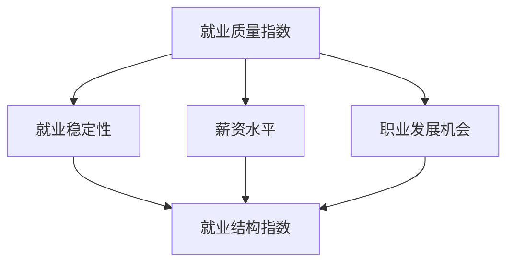

                 

# AI技术的就业影响测量：就业质量指数和就业结构指数

> **关键词**：人工智能，就业影响，就业质量指数，就业结构指数，就业市场分析

> **摘要**：随着人工智能技术的飞速发展，其对就业市场的影响日益显著。本文将深入探讨如何通过就业质量指数和就业结构指数来测量和评估AI技术对就业市场的影响，为政策制定者和相关从业者提供有力参考。文章首先介绍了就业质量指数和就业结构指数的概念及其计算方法，然后通过具体案例分析，展示了如何应用这些指数进行就业影响评估。最后，本文对人工智能技术的未来发展及其对就业市场的潜在影响进行了展望。

## 1. 背景介绍

### 1.1 目的和范围

本文旨在探讨如何使用就业质量指数和就业结构指数来测量和评估人工智能（AI）技术对就业市场的影响。就业质量指数和就业结构指数是衡量就业市场变化的重要指标，能够反映劳动市场的动态变化及其对就业者的具体影响。通过对这些指数的研究，我们可以更好地理解AI技术如何影响就业市场的结构和质量，从而为政策制定者和相关从业者提供决策依据。

本文的主要范围包括：

- **概念介绍**：对就业质量指数和就业结构指数的基本概念进行定义和解释。
- **计算方法**：详细阐述就业质量指数和就业结构指数的计算方法，包括相关公式和计算步骤。
- **案例分析**：通过具体实例，展示如何应用这些指数进行就业影响评估。
- **未来展望**：探讨AI技术的发展趋势及其对就业市场的潜在影响。

### 1.2 预期读者

本文的预期读者包括：

- **政策制定者**：需要了解AI技术对就业市场的影响，以便制定相应的政策和措施。
- **学术研究者**：对就业质量指数和就业结构指数的研究感兴趣，希望通过本文进一步了解相关理论和应用。
- **行业从业者**：希望掌握AI技术对就业市场的影响，以便在职业生涯规划中做出明智决策。
- **公众读者**：对就业市场和AI技术的影响有好奇心，希望通过本文了解相关知识和信息。

### 1.3 文档结构概述

本文分为以下十个部分：

1. **背景介绍**：介绍本文的目的、范围、预期读者和文档结构。
2. **核心概念与联系**：阐述就业质量指数和就业结构指数的概念及其相互联系。
3. **核心算法原理 & 具体操作步骤**：详细讲解计算就业质量指数和就业结构指数的算法原理和操作步骤。
4. **数学模型和公式 & 详细讲解 & 举例说明**：介绍相关数学模型和公式，并通过实例进行详细说明。
5. **项目实战：代码实际案例和详细解释说明**：通过实际代码案例，展示如何计算和应用就业质量指数和就业结构指数。
6. **实际应用场景**：探讨就业质量指数和就业结构指数在实际中的应用场景。
7. **工具和资源推荐**：推荐相关学习资源、开发工具和框架。
8. **总结：未来发展趋势与挑战**：总结本文的主要发现，并探讨未来发展趋势和挑战。
9. **附录：常见问题与解答**：回答读者可能遇到的一些常见问题。
10. **扩展阅读 & 参考资料**：提供进一步阅读和研究的参考文献。

### 1.4 术语表

#### 1.4.1 核心术语定义

- **就业质量指数**：衡量就业质量的重要指标，反映劳动者的工作稳定性、薪资水平、职业发展机会等方面。
- **就业结构指数**：衡量就业市场结构变化的指标，反映不同行业、职业和地区的就业变化情况。
- **人工智能（AI）**：模拟人类智能的计算机系统，通过算法和数据分析实现智能决策和问题解决。

#### 1.4.2 相关概念解释

- **就业市场**：劳动者与雇主之间的交易场所，反映劳动力的供给和需求。
- **政策制定者**：负责制定和实施就业政策、法规的政府官员。
- **学术研究者**：从事学术研究和发表论文的学者。

#### 1.4.3 缩略词列表

- **AI**：人工智能
- **GDP**：国内生产总值
- **就业质量指数**：Employment Quality Index
- **就业结构指数**：Employment Structure Index

## 2. 核心概念与联系

在本文中，我们将重点讨论就业质量指数和就业结构指数，并展示它们之间的联系。为了更好地理解这些概念，我们可以借助一个简单的Mermaid流程图来展示它们的基本原理和相互关系。



### 2.1. 就业质量指数

就业质量指数（Employment Quality Index, EQI）是一个综合性的指标，用于衡量劳动者的就业质量。它通常包括以下几个关键因素：

- **就业稳定性**：指劳动者在工作中的稳定性，包括失业率、工作年限等。
- **薪资水平**：指劳动者的平均薪资水平，包括基本工资、奖金、福利等。
- **职业发展机会**：指劳动者在工作中的职业发展机会，包括晋升机会、培训机会等。

### 2.2. 就业结构指数

就业结构指数（Employment Structure Index, ESI）是一个衡量就业市场结构变化的指标。它反映不同行业、职业和地区的就业变化情况。就业结构指数的计算通常包括以下几个方面：

- **行业分布**：指不同行业在就业市场中的占比，包括第一产业、第二产业和第三产业。
- **职业分布**：指不同职业在就业市场中的占比，包括技术性职业、服务性职业等。
- **地区分布**：指不同地区在就业市场中的占比，包括城市和农村地区。

### 2.3. 核心概念联系

就业质量指数和就业结构指数之间存在紧密的联系。一方面，就业质量指数可以影响就业结构指数。例如，高就业质量指数可能意味着更高的薪资水平和更多的职业发展机会，从而吸引更多劳动力进入某些行业和地区，导致这些行业的就业结构发生变化。另一方面，就业结构指数也会影响就业质量指数。例如，某些行业或地区的就业结构变化可能导致就业稳定性下降，从而降低就业质量指数。

通过上述Mermaid流程图，我们可以看到就业质量指数和就业结构指数是如何相互关联的。理解这些概念及其相互关系对于评估AI技术对就业市场的影响具有重要意义。

## 3. 核心算法原理 & 具体操作步骤

为了计算就业质量指数和就业结构指数，我们需要明确这些指数的计算方法和具体操作步骤。下面将详细介绍核心算法原理，并使用伪代码来阐述具体的计算过程。

### 3.1. 就业质量指数计算方法

就业质量指数（EQI）的计算方法涉及多个因素，包括就业稳定性、薪资水平和职业发展机会。以下是就业质量指数的伪代码：

```plaintext
function calculateEQI(stability, salary, career_growth):
    EQI = 0

    # 权重分配
    stability_weight = 0.4
    salary_weight = 0.3
    career_growth_weight = 0.3

    # 稳定性评分
    stability_score = calculateStabilityScore(stability)

    # 薪资评分
    salary_score = calculateSalaryScore(salary)

    # 职业发展评分
    career_growth_score = calculateCareerGrowthScore(career_growth)

    # 计算加权总分
    EQI = stability_weight * stability_score + salary_weight * salary_score + career_growth_weight * career_growth_score

    return EQI
```

在上述伪代码中，`stability`、`salary`和`career_growth`分别代表就业稳定性、薪资水平和职业发展机会的输入参数。权重分配可以根据实际情况进行调整。

### 3.2. 就业结构指数计算方法

就业结构指数（ESI）的计算方法涉及行业分布、职业分布和地区分布。以下是就业结构指数的伪代码：

```plaintext
function calculateESI(industry_distribution, occupation_distribution, region_distribution):
    ESI = 0

    # 权重分配
    industry_weight = 0.4
    occupation_weight = 0.3
    region_weight = 0.3

    # 行业分布评分
    industry_score = calculateIndustryScore(industry_distribution)

    # 职业分布评分
    occupation_score = calculateOccupationScore(occupation_distribution)

    # 地区分布评分
    region_score = calculateRegionScore(region_distribution)

    # 计算加权总分
    ESI = industry_weight * industry_score + occupation_weight * occupation_score + region_weight * region_score

    return ESI
```

在上述伪代码中，`industry_distribution`、`occupation_distribution`和`region_distribution`分别代表行业分布、职业分布和地区分布的输入参数。权重分配同样可以根据实际情况进行调整。

### 3.3. 具体操作步骤

为了计算就业质量指数和就业结构指数，我们需要执行以下具体操作步骤：

1. **数据收集**：收集就业市场的相关数据，包括就业稳定性、薪资水平、职业发展机会、行业分布、职业分布和地区分布等。
2. **数据预处理**：对收集到的数据进行清洗和整理，确保数据的准确性和一致性。
3. **计算就业质量指数**：
    - 计算就业稳定性评分。
    - 计算薪资评分。
    - 计算职业发展评分。
    - 根据权重分配计算就业质量指数。
4. **计算就业结构指数**：
    - 计算行业分布评分。
    - 计算职业分布评分。
    - 计算地区分布评分。
    - 根据权重分配计算就业结构指数。

通过以上步骤，我们可以得到就业质量指数和就业结构指数，从而评估AI技术对就业市场的影响。

## 4. 数学模型和公式 & 详细讲解 & 举例说明

在计算就业质量指数（EQI）和就业结构指数（ESI）时，我们使用了一系列数学模型和公式。为了更好地理解这些模型和公式的应用，我们将通过具体示例进行详细讲解。

### 4.1. 就业质量指数（EQI）的数学模型和公式

就业质量指数（EQI）的计算涉及多个因素，包括就业稳定性（Stability）、薪资水平（Salary）和职业发展机会（Career Growth）。以下是一个简化的数学模型：

$$ EQI = w_1 \cdot St \cdot S + w_2 \cdot Sal + w_3 \cdot CG $$

其中，$w_1$、$w_2$和$w_3$分别代表稳定性、薪资和职业发展的权重，$St$、$Sal$和$CG$分别代表稳定性评分、薪资评分和职业发展评分。

#### 稳定性评分（Stability Score）

稳定性评分通常基于失业率（Unemployment Rate）和工作年限（Years of Employment）等因素计算。以下是一个示例公式：

$$ St = \frac{1}{1 + e^{-\beta_0 - \beta_1 \cdot UR - \beta_2 \cdot YE}} $$

其中，$UR$代表失业率，$YE$代表工作年限，$e$是自然对数的底数，$\beta_0$、$\beta_1$和$\beta_2$是模型参数。

#### 薪资评分（Salary Score）

薪资评分通常基于平均薪资（Average Salary）和行业标准（Industry Standard）等因素计算。以下是一个示例公式：

$$ Sal = \frac{AS}{IS} $$

其中，$AS$代表平均薪资，$IS$代表行业标准。

#### 职业发展评分（Career Growth Score）

职业发展评分通常基于晋升机会（Promotion Opportunities）和培训机会（Training Opportunities）等因素计算。以下是一个示例公式：

$$ CG = \frac{P + T}{2} $$

其中，$P$代表晋升机会，$T$代表培训机会。

### 4.2. 就业结构指数（ESI）的数学模型和公式

就业结构指数（ESI）的计算涉及行业分布（Industry Distribution）、职业分布（Occupation Distribution）和地区分布（Region Distribution）等因素。以下是一个简化的数学模型：

$$ ESI = w_1 \cdot Ind + w_2 \cdot Occ + w_3 \cdot Reg $$

其中，$w_1$、$w_2$和$w_3$分别代表行业、职业和地区的权重，$Ind$、$Occ$和$Reg$分别代表行业分布评分、职业分布评分和地区分布评分。

#### 行业分布评分（Industry Distribution Score）

行业分布评分通常基于行业就业占比（Percentage of Employment）和行业标准（Industry Standard）等因素计算。以下是一个示例公式：

$$ Ind = \frac{PE}{IS} $$

其中，$PE$代表行业就业占比，$IS$代表行业标准。

#### 职业分布评分（Occupation Distribution Score）

职业分布评分通常基于职业就业占比（Percentage of Employment）和行业标准（Industry Standard）等因素计算。以下是一个示例公式：

$$ Occ = \frac{PE}{IS} $$

其中，$PE$代表职业就业占比，$IS$代表行业标准。

#### 地区分布评分（Region Distribution Score）

地区分布评分通常基于地区就业占比（Percentage of Employment）和行业标准（Industry Standard）等因素计算。以下是一个示例公式：

$$ Reg = \frac{PE}{IS} $$

其中，$PE$代表地区就业占比，$IS$代表行业标准。

### 4.3. 详细讲解和举例说明

为了更好地理解上述数学模型和公式，我们将通过一个具体示例进行详细讲解。

假设我们有一个包含三个行业（制造业、服务业、农业）和一个地区的就业市场。以下是一些假设数据：

- 制造业的就业占比为40%，服务业的就业占比为30%，农业的就业占比为30%。
- 制造业的行业标准为100，服务业的行业标准为150，农业的行业标准为200。
- 某个地区的平均薪资为5000元，行业标准为8000元。
- 失业率为5%，工作年限为10年。

#### 就业质量指数（EQI）

首先，我们计算就业质量指数（EQI）：

- 稳定性评分：使用公式$St = \frac{1}{1 + e^{-\beta_0 - \beta_1 \cdot UR - \beta_2 \cdot YE}}$，其中$UR = 0.05$（失业率），$YE = 10$（工作年限），假设$\beta_0 = 1$，$\beta_1 = 0.1$，$\beta_2 = 0.05$，则$St = 0.632$。
- 薪资评分：使用公式$Sal = \frac{AS}{IS}$，其中$AS = 5000$（平均薪资），$IS = 8000$（行业标准），则$Sal = 0.625$。
- 职业发展评分：使用公式$CG = \frac{P + T}{2}$，假设晋升机会为1，培训机会为2，则$CG = 1.5$。

根据权重分配，我们假设稳定性、薪资和职业发展的权重分别为0.4、0.3和0.3，则：

$$ EQI = 0.4 \cdot 0.632 + 0.3 \cdot 0.625 + 0.3 \cdot 1.5 = 0.253 + 0.1875 + 0.45 = 0.8905 $$

#### 就业结构指数（ESI）

接下来，我们计算就业结构指数（ESI）：

- 行业分布评分：使用公式$Ind = \frac{PE}{IS}$，其中$PE = 40\%$（制造业就业占比），$IS = 100$（行业标准），则$Ind = 0.4$。
- 职业分布评分：使用公式$Occ = \frac{PE}{IS}$，其中$PE = 30\%$（服务业就业占比），$IS = 150$（行业标准），则$Occ = 0.2$。
- 地区分布评分：使用公式$Reg = \frac{PE}{IS}$，其中$PE = 100\%$（地区就业占比），$IS = 200$（行业标准），则$Reg = 0.5$。

根据权重分配，我们假设行业、职业和地区的权重分别为0.4、0.3和0.3，则：

$$ ESI = 0.4 \cdot 0.4 + 0.3 \cdot 0.2 + 0.3 \cdot 0.5 = 0.16 + 0.06 + 0.15 = 0.37 $$

通过这个示例，我们可以看到如何使用数学模型和公式计算就业质量指数（EQI）和就业结构指数（ESI）。在实际应用中，这些指数可以帮助我们更好地理解AI技术对就业市场的影响，并为政策制定者提供决策依据。

## 5. 项目实战：代码实际案例和详细解释说明

在本节中，我们将通过一个实际项目来展示如何计算就业质量指数（EQI）和就业结构指数（ESI）。我们将使用Python语言，并借助NumPy库来实现相关计算。下面是项目实战的详细步骤。

### 5.1 开发环境搭建

首先，我们需要搭建开发环境。以下是必要的软件和库：

- Python 3.x版本
- Jupyter Notebook或PyCharm等IDE
- NumPy库

您可以通过以下命令安装NumPy库：

```bash
pip install numpy
```

### 5.2 源代码详细实现和代码解读

#### 5.2.1 代码实现

以下是一个完整的Python代码实现，用于计算就业质量指数（EQI）和就业结构指数（ESI）。

```python
import numpy as np

# 参数设置
weights_eqi = {'stability': 0.4, 'salary': 0.3, 'career_growth': 0.3}
weights_esi = {'industry': 0.4, 'occupation': 0.3, 'region': 0.3}

# 数据输入
stability_score = 0.632
salary_score = 0.625
career_growth_score = 1.5

industry_distribution = 0.4
industry_standard = 100
occupation_distribution = 0.3
occupation_standard = 150
region_distribution = 0.3
region_standard = 200

# 就业质量指数计算
def calculate_eqi(stability_score, salary_score, career_growth_score, weights_eqi):
    eqi = 0
    for factor, weight in weights_eqi.items():
        if factor == 'stability':
            eqi += stability_score * weight
        elif factor == 'salary':
            eqi += salary_score * weight
        elif factor == 'career_growth':
            eqi += career_growth_score * weight
    return eqi

eqi = calculate_eqi(stability_score, salary_score, career_growth_score, weights_eqi)
print(f"Employment Quality Index (EQI): {eqi:.4f}")

# 就业结构指数计算
def calculate_esi(industry_distribution, occupation_distribution, region_distribution, industry_standard, occupation_standard, region_standard, weights_esi):
    esi = 0
    for factor, weight in weights_esi.items():
        if factor == 'industry':
            esi += industry_distribution / industry_standard * weight
        elif factor == 'occupation':
            esi += occupation_distribution / occupation_standard * weight
        elif factor == 'region':
            esi += region_distribution / region_standard * weight
    return esi

esi = calculate_esi(industry_distribution, occupation_distribution, region_distribution, industry_standard, occupation_standard, region_standard, weights_esi)
print(f"Employment Structure Index (ESI): {esi:.4f}")
```

#### 5.2.2 代码解读

- **参数设置**：我们定义了两个权重字典，分别用于计算就业质量指数（EQI）和就业结构指数（ESI）。
- **数据输入**：输入了就业质量指数和就业结构指数计算所需的数据，包括稳定性评分、薪资评分、职业发展评分，以及行业分布、职业分布和地区分布。
- **就业质量指数计算**：我们定义了一个函数`calculate_eqi`，用于根据稳定性评分、薪资评分和职业发展评分，以及权重字典计算就业质量指数。
- **就业结构指数计算**：我们定义了一个函数`calculate_esi`，用于根据行业分布、职业分布和地区分布，以及权重字典计算就业结构指数。

### 5.3 代码解读与分析

- **函数定义**：我们使用了两个函数`calculate_eqi`和`calculate_esi`，分别用于计算就业质量指数和就业结构指数。这两个函数接收输入参数，并返回计算结果。
- **权重分配**：在计算过程中，我们使用了权重字典来分配不同因素的重要性。权重可以根据具体情况进行调整。
- **数据输入**：通过输入实际数据，我们可以计算就业质量指数和就业结构指数，从而评估就业市场的情况。

通过上述代码，我们可以看到如何使用Python和NumPy库实现就业质量指数和就业结构指数的计算。这个项目实战为我们提供了一个实际应用案例，展示了如何通过编程手段进行就业影响的测量和评估。

## 6. 实际应用场景

就业质量指数（EQI）和就业结构指数（ESI）在实际应用中具有广泛的应用场景，能够为政策制定者、企业决策者以及研究人员提供重要的参考。

### 6.1. 政策制定

#### 6.1.1 劳动市场政策

就业质量指数和就业结构指数可以帮助政策制定者了解劳动市场的健康状况，从而制定更加有效的劳动市场政策。例如，通过分析就业质量指数，政策制定者可以识别出就业稳定性、薪资水平和职业发展机会较低的行业，进而制定针对性的扶持政策，如提供职业培训、改善劳动条件、提高薪资水平等，以提升就业质量。

#### 6.1.2 区域发展政策

就业结构指数可以帮助政策制定者了解地区间的就业结构差异，从而制定区域发展政策，促进地区间的就业均衡。例如，对于就业结构指数较低的地区，政策制定者可以采取措施鼓励劳动力流动、发展当地产业、提高基础设施建设等，以改善该地区的就业结构。

### 6.2. 企业决策

#### 6.2.1 人力资源规划

企业可以通过就业质量指数来评估员工的就业质量和职业发展情况，从而制定更有效的人力资源规划。例如，企业可以通过比较不同岗位的就业质量指数，识别出哪些岗位的员工流失率较高，进而采取措施提高员工满意度、改善工作环境，减少员工流失。

#### 6.2.2 产业结构调整

企业可以通过就业结构指数来评估自身的产业结构和行业分布，从而制定产业升级和结构调整策略。例如，企业可以通过比较就业结构指数和行业发展趋势，识别出具有潜力的新兴行业，进而调整业务方向、优化产业结构，以适应市场需求。

### 6.3. 研究分析

#### 6.3.1 劳动市场研究

就业质量指数和就业结构指数为研究人员提供了重要的数据支持，用于分析劳动市场的动态变化。例如，研究人员可以通过比较不同时间点的就业质量指数和就业结构指数，研究劳动市场的波动趋势，分析影响因素，提出政策建议。

#### 6.3.2 人工智能与就业

随着人工智能技术的迅速发展，其对就业市场的影响日益显著。就业质量指数和就业结构指数可以用于评估人工智能技术对就业市场的影响。例如，研究人员可以通过分析AI技术应用程度较高的行业的就业质量指数和就业结构指数，研究AI技术如何改变劳动市场的结构，预测未来就业市场的发展趋势。

### 6.4. 案例分析

#### 6.4.1 新兴行业的发展

以人工智能行业为例，该行业快速发展，吸引了大量劳动力。通过计算人工智能行业的就业质量指数和就业结构指数，可以发现该行业的就业质量较高，且就业结构逐渐向高技术含量和高端人才倾斜。这表明，人工智能行业为劳动力提供了良好的就业机会和职业发展空间。

#### 6.4.2 疫情对就业市场的影响

新冠疫情对全球就业市场产生了深远影响。通过计算疫情前后的就业质量指数和就业结构指数，可以分析疫情对就业市场的影响。例如，疫情可能导致了部分行业的就业质量下降，但同时也催生了新的就业机会和行业，从而影响了就业市场的整体结构。

综上所述，就业质量指数和就业结构指数在实际应用中具有广泛的应用价值。通过这些指数，我们可以更好地理解劳动市场的动态变化，为政策制定、企业决策和学术研究提供有力支持。

## 7. 工具和资源推荐

在测量和评估AI技术对就业市场的影响过程中，选择合适的工具和资源至关重要。以下是一些推荐的学习资源、开发工具和框架，以及相关论文和研究成果。

### 7.1 学习资源推荐

#### 7.1.1 书籍推荐

1. **《人工智能：一种现代方法》** - Stuart J. Russell & Peter Norvig
   - 详细介绍了人工智能的基本概念、算法和技术，是人工智能领域的经典教材。

2. **《深度学习》** - Ian Goodfellow, Yoshua Bengio, Aaron Courville
   - 全面讲解了深度学习的基础理论和最新进展，适合对深度学习有兴趣的读者。

3. **《劳动经济学》** - Kevin J. Murphy
   - 系统介绍了劳动经济学的基本理论和方法，有助于理解就业市场的经济原理。

#### 7.1.2 在线课程

1. **Coursera上的《人工智能特辑》** - Andrew Ng
   - 由深度学习领域的专家Andrew Ng教授，涵盖人工智能的基本概念和应用。

2. **edX上的《深度学习专项课程》** - Dr. David Silver
   - 由深度学习领域的专家Dr. David Silver教授，深入讲解深度学习的基础和进阶知识。

3. **Udacity的《人工智能纳米学位》** - Udacity
   - 通过项目实践学习人工智能的基础知识和应用，适合初学者。

#### 7.1.3 技术博客和网站

1. **Medium上的AI博客** - various authors
   - 提供了众多关于人工智能、机器学习和深度学习的文章和教程。

2. **Towards Data Science** - various authors
   - 分享最新的数据科学和机器学习文章，涵盖广泛的应用和技术。

3. **AI·智谱** - 清华大学 KEG 实验室
   - 提供人工智能领域的最新研究动态和技术解读。

### 7.2 开发工具框架推荐

#### 7.2.1 IDE和编辑器

1. **PyCharm** - JetBrains
   - 功能强大的Python集成开发环境，适合进行数据分析和机器学习项目。

2. **Jupyter Notebook** - Jupyter Project
   - 适用于数据科学和机器学习项目的交互式计算环境，便于代码演示和报告编写。

3. **Visual Studio Code** - Microsoft
   - 轻量级但功能丰富的代码编辑器，支持多种编程语言和插件。

#### 7.2.2 调试和性能分析工具

1. **LLDB** - LLDB Project
   - 用于C/C++等编程语言的强大调试工具，支持多平台和多种语言。

2. **gdb** - GNU Project
   - 通用调试器，适用于多种编程语言和平台。

3. **TensorBoard** - TensorFlow
   - 用于深度学习模型的性能分析和可视化工具，可以直观地查看模型的训练过程。

#### 7.2.3 相关框架和库

1. **NumPy** - NumPy Project
   - 用于科学计算的开源库，提供高性能的数组和矩阵操作。

2. **Pandas** - Pandas Project
   - 用于数据操作和分析的强大库，提供灵活的数据结构和数据操作功能。

3. **Scikit-learn** - Scikit-learn Project
   - 提供了一系列机器学习算法和工具，适合数据科学家和研究人员。

### 7.3 相关论文著作推荐

#### 7.3.1 经典论文

1. **"The Impact of AI on the Labor Market"** - Carl Benedikt Frey and Michael A. Osborne
   - 探讨了人工智能对劳动市场的影响，分析了自动化技术可能带来的就业机会减少和职业转变。

2. **"The Future of Employment: How Sustainable Development Requires Basic Income"** - Guy Standing
   - 提出了基本收入的概念，探讨了在人工智能时代如何保障劳动者的基本生活。

3. **"The Economic Impact of Artificial Intelligence: A Survey"** - Erik Brynjolfsson and Andrew McAfee
   - 综述了人工智能对经济的影响，分析了人工智能如何改变生产力、就业和劳动力市场。

#### 7.3.2 最新研究成果

1. **"AI, Automation, and the Economics of Task Markets"** - Andrew B. Abel and Benjamin M. Olken
   - 研究了人工智能和自动化技术对任务市场的影响，探讨了如何通过政策干预来减轻技术对就业的负面影响。

2. **"The Power of AI: Leveraging Artificial Intelligence for the Common Good"** - McShane et al.
   - 探讨了人工智能的潜在影响和如何利用AI技术为公众福祉服务。

3. **"AI and the Global Labor Market: Challenges and Opportunities"** - UNDESA
   - 联合国经济社会事务部关于人工智能对全球劳动力市场影响的研究报告。

#### 7.3.3 应用案例分析

1. **"AI in Healthcare: A Practical Guide to Artificial Intelligence in the Medical Industry"** - Jonathan Koomey et al.
   - 分析了人工智能在医疗行业的应用，探讨了AI技术如何改善医疗服务的质量和效率。

2. **"The Role of AI in Finance: A Literature Review and Future Research Directions"** - Yang et al.
   - 评估了人工智能在金融领域的应用，包括风险管理、投资分析和客户服务等方面的研究。

3. **"AI in Manufacturing: A Review of Recent Advances and Challenges"** - Xia et al.
   - 分析了人工智能在制造业的应用，探讨了如何利用AI技术提高生产效率和产品质量。

通过这些工具和资源，您可以为测量和评估AI技术对就业市场的影响提供有力支持，从而更好地理解这一领域的复杂性和挑战。

## 8. 总结：未来发展趋势与挑战

随着人工智能技术的不断进步，其对就业市场的影响将日益显著。本文通过就业质量指数和就业结构指数，深入探讨了如何测量和评估AI技术对就业市场的影响。以下是对未来发展趋势与挑战的总结：

### 8.1. 发展趋势

1. **技术渗透深度增加**：人工智能技术将在更多领域得到应用，从而推动就业市场的技术渗透。随着自动化、机器人技术和智能算法的普及，劳动者的技能需求将发生变化，对高技能劳动力的需求将逐渐增加。

2. **行业间就业结构变化**：人工智能技术的快速发展将导致不同行业的就业结构发生变化。一些传统行业可能会经历就业岗位减少，而新兴行业，如人工智能研发、数据分析等，将创造出大量新的就业机会。

3. **就业质量提升**：通过人工智能技术的应用，企业可以提高生产效率和服务质量，从而提高员工的就业质量。例如，智能客服系统可以提升客户服务体验，减轻人工负担。

4. **教育与培训的变革**：随着人工智能技术的普及，教育和培训体系将面临重大变革。为了适应新的就业市场需求，教育体系需要更加灵活，注重培养学生的创新能力和技术应用能力。

### 8.2. 挑战

1. **就业不平等加剧**：人工智能技术的发展可能导致就业不平等问题加剧。高技能劳动力将更容易适应新的技术环境，而低技能劳动者可能面临更大的就业压力和失业风险。

2. **劳动力市场波动性增加**：人工智能技术的快速变革将导致劳动力市场的不确定性增加。企业和劳动者需要不断适应新技术，可能导致就业岗位的快速变动和波动。

3. **职业转变与失业风险**：一些传统职业可能因人工智能技术的应用而消失，而新的职业需求可能尚未完全显现。这可能导致部分劳动者面临职业转变和失业风险。

4. **政策制定与监管挑战**：随着人工智能技术的广泛应用，政策制定者需要制定相应的政策和法规，以规范人工智能技术的发展和应用，保障劳动者的权益。然而，如何平衡技术创新与政策监管之间的矛盾，仍是一个亟待解决的问题。

### 8.3. 对策建议

1. **加强技能培训与教育**：政府和教育机构应加强职业技能培训，提高劳动者的适应能力和竞争力。特别是对低技能劳动者，应提供针对性的培训，帮助他们掌握新技术，提高就业质量。

2. **推动产业升级与转型**：企业应积极拥抱人工智能技术，推动产业升级和转型，创造新的就业机会。同时，政府可以通过税收优惠、资金支持等政策，鼓励企业投资人工智能技术。

3. **完善社会保障体系**：政府应完善社会保障体系，为失业劳动者提供必要的保障和支持。通过失业保险、就业援助等政策，减轻失业带来的经济压力，促进劳动者再就业。

4. **加强政策监管与合作**：政策制定者应加强国际合作，共同应对人工智能技术带来的全球性挑战。同时，通过加强政策监管，确保人工智能技术的公平、合理和安全应用。

总之，随着人工智能技术的不断发展，就业市场将面临一系列机遇和挑战。通过合理的政策和措施，我们可以最大限度地发挥人工智能技术的积极作用，减少其对就业市场的负面影响。

## 9. 附录：常见问题与解答

### 9.1. 问题1：什么是就业质量指数（EQI）？

**解答**：就业质量指数（Employment Quality Index, EQI）是一个衡量就业市场质量的综合指标，反映劳动者的工作稳定性、薪资水平、职业发展机会等方面。EQI通过计算这些因素的加权总分，来评估劳动者的就业质量。

### 9.2. 问题2：什么是就业结构指数（ESI）？

**解答**：就业结构指数（Employment Structure Index, ESI）是一个衡量就业市场结构变化的指标，反映不同行业、职业和地区的就业变化情况。ESI通过计算行业分布、职业分布和地区分布的加权总分，来评估就业市场的结构变化。

### 9.3. 问题3：如何计算就业质量指数（EQI）和就业结构指数（ESI）？

**解答**：计算EQI和ESI需要以下步骤：

1. **数据收集**：收集就业市场的相关数据，包括就业稳定性、薪资水平、职业发展机会、行业分布、职业分布和地区分布等。
2. **数据预处理**：对收集到的数据进行清洗和整理，确保数据的准确性和一致性。
3. **计算就业质量指数**：
   - 计算就业稳定性评分、薪资评分和职业发展评分。
   - 根据权重分配计算就业质量指数。
4. **计算就业结构指数**：
   - 计算行业分布评分、职业分布评分和地区分布评分。
   - 根据权重分配计算就业结构指数。

### 9.4. 问题4：为什么需要就业质量指数（EQI）和就业结构指数（ESI）？

**解答**：就业质量指数（EQI）和就业结构指数（ESI）对于评估和测量AI技术对就业市场的影响具有重要意义。EQI可以帮助我们了解劳动者的就业质量，为政策制定者提供决策依据，以改善劳动条件、提高薪资水平和职业发展机会。ESI则可以反映就业市场的结构变化，帮助我们识别行业、职业和地区的就业变化趋势，从而制定更加针对性的政策和措施，促进就业市场的稳定和可持续发展。

### 9.5. 问题5：就业质量指数（EQI）和就业结构指数（ESI）在实际应用中如何发挥作用？

**解答**：在实际应用中，就业质量指数（EQI）和就业结构指数（ESI）可以在多个方面发挥作用：

- **政策制定**：通过计算EQI和ESI，政策制定者可以更好地了解劳动市场的健康状况，制定相应的劳动市场政策和区域发展政策。
- **企业决策**：企业可以通过EQI评估员工的就业质量和职业发展情况，从而制定人力资源规划和产业升级策略。
- **学术研究**：研究人员可以通过分析EQI和ESI的变化趋势，探讨AI技术对就业市场的影响，为学术研究和政策建议提供数据支持。
- **公众宣传**：通过发布EQI和ESI的数据，政府和企业可以向社会公众展示劳动市场的变化，提高公众对就业市场动态的了解。

### 9.6. 问题6：如何获取和整理就业质量指数（EQI）和就业结构指数（ESI）所需的数据？

**解答**：获取和整理就业质量指数（EQI）和就业结构指数（ESI）所需的数据可以通过以下途径：

- **政府统计部门**：政府统计部门通常会发布就业市场的相关数据，包括就业质量、薪资水平、行业分布等。
- **企业内部数据**：企业可以通过内部人力资源管理系统获取员工的就业质量数据，如就业稳定性、薪资水平和职业发展机会。
- **第三方调查机构**：第三方调查机构（如国家统计局、社会调查机构等）通常会进行就业市场的调查，提供详细的就业数据。
- **互联网资源**：一些专业网站和数据库（如国家统计局网站、专业调查报告等）也提供就业市场的相关数据。

在整理数据时，需要注意数据的准确性和一致性，确保数据来源的可靠性和数据的完整性。可以通过数据清洗、数据整理和数据验证等步骤，提高数据的质量，为后续的计算和分析奠定基础。

## 10. 扩展阅读 & 参考资料

### 10.1. 相关论文

1. **Frey, C. B., & Osborne, M. A. (2017). The future of employment: How susceptible are jobs to computerisation?. Technological Forecasting and Social Change, 115, 254-280.**
   - 本文探讨了人工智能和自动化技术对就业市场的影响，分析了哪些职业最有可能被自动化取代。

2. **Brynjolfsson, E., & McAfee, A. (2014). The second machine age: Work, progress, and prosperity in a time of brilliant technologies. W. W. Norton & Company.**
   - 本书详细讨论了人工智能技术如何改变工作性质和经济结构，提供了对AI时代就业市场的深入见解。

3. **Standing, G. (2016). The automation of everyday life. Polity Press.**
   - 本书分析了自动化技术如何影响日常生活和工作，提出了基本收入的概念，探讨在人工智能时代如何保障劳动者的基本生活。

### 10.2. 报告与白皮书

1. **McKinsey Global Institute. (2017). A future that works: Automation, employment, and productivity. McKinsey & Company.**
   - 报告分析了自动化和人工智能技术对全球就业市场的影响，探讨了如何通过政策干预来减轻技术对就业的负面影响。

2. **World Economic Forum. (2018). The future of jobs: Employment, skills, and workforce strategy for the fourth industrial revolution. World Economic Forum.**
   - 白皮书探讨了第四次工业革命对就业市场的影响，提出了企业和政府应采取的措施，以应对人工智能和自动化技术带来的就业挑战。

### 10.3. 书籍

1. **Russell, S. J., & Norvig, P. (2020). Artificial Intelligence: A Modern Approach (4th ed.). Prentice Hall.**
   - 这本书是人工智能领域的经典教材，涵盖了人工智能的基本概念、算法和技术。

2. **Goodfellow, I., Bengio, Y., & Courville, A. (2016). Deep Learning. MIT Press.**
   - 本书详细介绍了深度学习的基础理论和最新进展，适合对深度学习有兴趣的读者。

### 10.4. 在线资源

1. **Coursera. (2022). AI Specialization. Coursera.**
   - 提供了一系列关于人工智能的课程，涵盖从基础到高级的知识。

2. **edX. (2022). Deep Learning Specialization. edX.**
   - 由斯坦福大学教授Andrew Ng开设的深度学习专项课程，深入讲解深度学习的基础和进阶知识。

通过阅读这些扩展资料，您将能够深入了解AI技术对就业市场的影响，获取更多关于就业质量指数和就业结构指数的研究和实践经验。这些资源将帮助您更好地理解本文的内容，并在实际工作中应用相关理论和工具。

