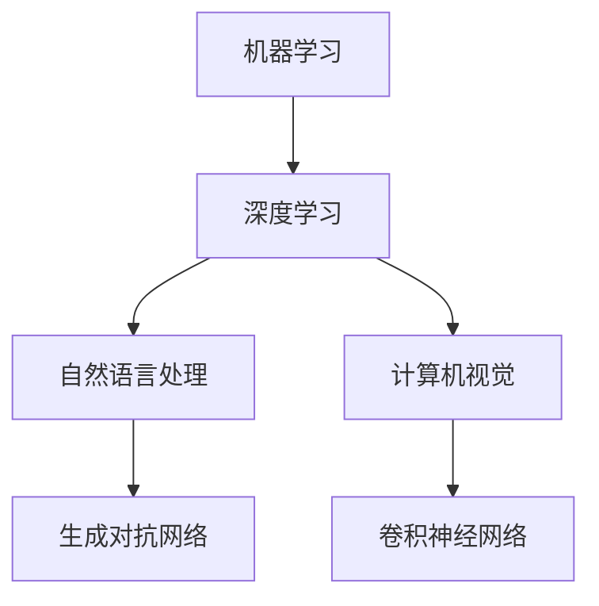

                 

# AI技术趋势与应用场景的结合

> 关键词：人工智能，技术趋势，应用场景，结合，深度学习，机器学习，自然语言处理，计算机视觉

> 摘要：本文旨在探讨人工智能技术的最新发展趋势，并深入分析这些技术在实际应用场景中的结合方式。通过详细的理论解析和实际案例，本文将帮助读者理解人工智能技术在各个领域的潜力，并展望未来的发展趋势与挑战。

## 1. 背景介绍

### 1.1 目的和范围

本文旨在探讨人工智能（AI）技术的发展趋势，并分析其在实际应用场景中的结合方式。随着深度学习、机器学习、自然语言处理和计算机视觉等技术的迅速发展，AI的应用场景越来越广泛。本文将重点关注以下几个方面：

1. AI技术在各行业的应用现状和未来趋势。
2. AI技术在不同应用场景中的结合方式。
3. AI技术的核心算法原理与数学模型。
4. 实际项目中的AI技术实现案例。
5. AI技术的未来发展挑战和机遇。

### 1.2 预期读者

本文适合对人工智能技术有一定了解的读者，包括但不限于以下人群：

1. AI领域的研究人员和技术开发人员。
2. 对人工智能技术感兴趣的学生和爱好者。
3. 各行业领域的从业者，希望了解AI技术在实际中的应用。
4. 投资者和管理者，关注AI技术发展的商业机会。

### 1.3 文档结构概述

本文结构如下：

1. 背景介绍：介绍本文的目的、范围、预期读者以及文档结构。
2. 核心概念与联系：详细讲解人工智能技术的核心概念和原理。
3. 核心算法原理 & 具体操作步骤：深入剖析人工智能技术的算法原理和操作步骤。
4. 数学模型和公式 & 详细讲解 & 举例说明：讲解人工智能技术的数学模型和公式，并给出具体实例。
5. 项目实战：代码实际案例和详细解释说明。
6. 实际应用场景：分析人工智能技术在各领域的应用场景。
7. 工具和资源推荐：推荐学习资源、开发工具框架和相关论文著作。
8. 总结：未来发展趋势与挑战。
9. 附录：常见问题与解答。
10. 扩展阅读 & 参考资料：提供更多相关阅读材料。

### 1.4 术语表

#### 1.4.1 核心术语定义

1. **人工智能（AI）**：指模拟、延伸和扩展人类智能的理论、方法、技术及应用系统。
2. **机器学习（ML）**：一种让计算机从数据中学习规律并自动改进性能的技术。
3. **深度学习（DL）**：一种特殊的机器学习技术，通过多层神经网络模拟人脑学习和处理信息。
4. **自然语言处理（NLP）**：研究计算机如何理解、生成和处理自然语言。
5. **计算机视觉（CV）**：研究计算机如何模拟人类视觉感知，理解和解释视觉信息。

#### 1.4.2 相关概念解释

1. **数据集（Dataset）**：用于训练机器学习模型的已有数据集合。
2. **特征提取（Feature Extraction）**：从原始数据中提取有助于模型学习和预测的有用信息。
3. **神经网络（Neural Network）**：一种模仿生物神经系统的计算模型。
4. **卷积神经网络（CNN）**：一种特殊的多层神经网络，广泛应用于计算机视觉任务。
5. **生成对抗网络（GAN）**：一种基于两个对抗性神经网络的模型，用于生成高质量的数据。

#### 1.4.3 缩略词列表

1. **AI**：人工智能（Artificial Intelligence）
2. **ML**：机器学习（Machine Learning）
3. **DL**：深度学习（Deep Learning）
4. **NLP**：自然语言处理（Natural Language Processing）
5. **CV**：计算机视觉（Computer Vision）
6. **GAN**：生成对抗网络（Generative Adversarial Network）
7. **CNN**：卷积神经网络（Convolutional Neural Network）

## 2. 核心概念与联系

### 2.1 人工智能技术概述

人工智能技术涉及多个领域，包括机器学习、深度学习、自然语言处理和计算机视觉等。这些技术共同构建了一个复杂的体系，使得计算机能够模拟和扩展人类智能。

#### 2.1.1 机器学习与深度学习

机器学习是一种让计算机从数据中学习规律并自动改进性能的技术。深度学习是机器学习的一种特殊形式，通过多层神经网络模拟人脑学习和处理信息。

#### 2.1.2 自然语言处理与计算机视觉

自然语言处理研究计算机如何理解、生成和处理自然语言。计算机视觉研究计算机如何模拟人类视觉感知，理解和解释视觉信息。

#### 2.1.3 生成对抗网络与卷积神经网络

生成对抗网络是一种基于两个对抗性神经网络的模型，用于生成高质量的数据。卷积神经网络是一种特殊的多层神经网络，广泛应用于计算机视觉任务。

### 2.2 Mermaid流程图

下面是一个简单的Mermaid流程图，展示人工智能技术的核心概念及其联系。



## 3. 核心算法原理 & 具体操作步骤

### 3.1 机器学习算法原理

机器学习算法的核心是构建一个模型，用于从数据中提取特征并做出预测。以下是机器学习算法的常见步骤：

1. **数据预处理**：对数据进行清洗、归一化、编码等操作，使其适合模型训练。
2. **特征提取**：从原始数据中提取有助于模型学习和预测的有用信息。
3. **模型选择**：根据问题的性质和数据的特征选择合适的模型。
4. **训练模型**：使用训练数据集训练模型，使其学会提取特征和做出预测。
5. **模型评估**：使用测试数据集评估模型的性能，调整参数以提高性能。
6. **模型应用**：将训练好的模型应用于实际问题，进行预测和决策。

### 3.2 深度学习算法原理

深度学习是一种特殊的机器学习技术，通过多层神经网络模拟人脑学习和处理信息。以下是深度学习算法的基本步骤：

1. **初始化参数**：为神经网络中的每个神经元和权重随机分配初始值。
2. **前向传播**：将输入数据通过神经网络，逐层计算输出。
3. **反向传播**：计算损失函数，并使用梯度下降算法更新网络参数。
4. **重复迭代**：重复前向传播和反向传播过程，直到网络参数收敛或达到预设的训练次数。

### 3.3 自然语言处理算法原理

自然语言处理算法的核心是让计算机理解、生成和处理自然语言。以下是自然语言处理算法的基本步骤：

1. **分词**：将文本分割成单词或短语。
2. **词性标注**：为每个单词或短语标注词性，如名词、动词、形容词等。
3. **句法分析**：分析句子的结构，如主语、谓语、宾语等。
4. **语义分析**：理解句子或段落的语义含义。
5. **语言生成**：根据给定的语义信息生成自然语言文本。

### 3.4 计算机视觉算法原理

计算机视觉算法的核心是让计算机模拟人类视觉感知，理解和解释视觉信息。以下是计算机视觉算法的基本步骤：

1. **图像预处理**：对图像进行滤波、缩放、旋转等操作，使其适合模型训练。
2. **特征提取**：从图像中提取有助于模型学习和预测的有用信息，如边缘、纹理等。
3. **目标检测**：定位图像中的目标物体，并给出其位置和边界框。
4. **图像分类**：将图像划分为不同的类别。
5. **图像分割**：将图像分割成不同的区域，每个区域对应一个目标物体。

### 3.5 伪代码示例

以下是机器学习算法的伪代码示例：

```python
# 初始化参数
parameters = initialize_parameters()

# 前向传播
output = forward_pass(input_data, parameters)

# 计算损失函数
loss = compute_loss(output, target)

# 反向传播
 gradients = backward_pass(output, target, parameters)

# 更新参数
parameters = update_parameters(parameters, gradients)

# 重复迭代
while not convergence:
    output = forward_pass(input_data, parameters)
    loss = compute_loss(output, target)
    gradients = backward_pass(output, target, parameters)
    parameters = update_parameters(parameters, gradients)
```

## 4. 数学模型和公式 & 详细讲解 & 举例说明

### 4.1 数学模型和公式

人工智能技术的核心在于数学模型和公式，以下是一些常见的数学模型和公式：

#### 4.1.1 损失函数

损失函数是评估模型预测结果与实际结果之间差异的重要工具。以下是常见的损失函数：

1. **均方误差（MSE）**：
   $$MSE = \frac{1}{n}\sum_{i=1}^{n}(y_i - \hat{y}_i)^2$$
   其中，$y_i$ 是实际值，$\hat{y}_i$ 是预测值。

2. **交叉熵（Cross-Entropy）**：
   $$CE = -\frac{1}{n}\sum_{i=1}^{n}y_i \log(\hat{y}_i)$$
   其中，$y_i$ 是实际值，$\hat{y}_i$ 是预测值。

#### 4.1.2 梯度下降算法

梯度下降算法是一种用于优化模型参数的常用算法。以下是梯度下降算法的基本公式：

$$\theta_{t+1} = \theta_{t} - \alpha \cdot \nabla_\theta J(\theta)$$
其中，$\theta$ 是模型参数，$J(\theta)$ 是损失函数，$\alpha$ 是学习率。

#### 4.1.3 神经网络中的激活函数

激活函数是神经网络中的一个关键组件，用于引入非线性特性。以下是常见的激活函数：

1. **Sigmoid 函数**：
   $$\sigma(x) = \frac{1}{1 + e^{-x}}$$

2. **ReLU 函数**：
   $$\text{ReLU}(x) = \max(0, x)$$

3. **Tanh 函数**：
   $$\tanh(x) = \frac{e^x - e^{-x}}{e^x + e^{-x}}$$

### 4.2 举例说明

#### 4.2.1 均方误差（MSE）举例

假设我们有一个回归问题，目标是预测房间的价格。已知五个房间的价格和特征，如下表所示：

| 房间ID | 面积（平方米） | 价格（万元） |
| :---: | :---: | :---: |
| 1 | 100 | 200 |
| 2 | 120 | 220 |
| 3 | 140 | 250 |
| 4 | 160 | 270 |
| 5 | 180 | 300 |

我们使用线性回归模型来预测房间的价格。假设模型预测的价格为 $\hat{y}$，实际价格为 $y$。以下是均方误差的计算过程：

$$MSE = \frac{1}{5}\sum_{i=1}^{5}(y_i - \hat{y}_i)^2$$

对于每个房间，我们计算预测价格与实际价格之间的差异，然后求平方和，最后除以房间的数量。

#### 4.2.2 梯度下降算法举例

假设我们有一个简单的线性回归模型，目标是最小化损失函数。损失函数为均方误差（MSE），如下所示：

$$J(\theta) = \frac{1}{m}\sum_{i=1}^{m}(y_i - \theta \cdot x_i)^2$$

其中，$m$ 是样本数量，$x_i$ 是特征值，$y_i$ 是实际值，$\theta$ 是模型参数。

假设我们有一个包含100个样本的数据集，学习率为0.01。以下是梯度下降算法的迭代过程：

1. **初始化参数**：
   $$\theta = 0$$

2. **前向传播**：
   $$\hat{y}_i = \theta \cdot x_i$$

3. **计算损失函数**：
   $$J(\theta) = \frac{1}{100}\sum_{i=1}^{100}(y_i - \hat{y}_i)^2$$

4. **计算梯度**：
   $$\nabla_\theta J(\theta) = \frac{1}{100}\sum_{i=1}^{100}(y_i - \hat{y}_i) \cdot x_i$$

5. **更新参数**：
   $$\theta = \theta - 0.01 \cdot \nabla_\theta J(\theta)$$

6. **重复迭代**：
   重复步骤2-5，直到损失函数收敛或达到预设的迭代次数。

## 5. 项目实战：代码实际案例和详细解释说明

### 5.1 开发环境搭建

在开始编写代码之前，我们需要搭建一个适合开发人工智能项目的环境。以下是搭建环境的步骤：

1. **安装Python**：下载并安装Python 3.x版本，推荐使用Anaconda发行版，以便管理Python环境和依赖库。
2. **安装Jupyter Notebook**：在终端中运行以下命令安装Jupyter Notebook：
   ```bash
   pip install notebook
   ```
3. **安装必要的库**：使用以下命令安装常用的库：
   ```bash
   pip install numpy pandas matplotlib scikit-learn tensorflow keras
   ```

### 5.2 源代码详细实现和代码解读

以下是一个简单的深度学习项目，使用TensorFlow和Keras框架实现一个简单的图像分类模型。代码如下：

```python
# 导入必要的库
import tensorflow as tf
from tensorflow.keras import layers, models
from tensorflow.keras.datasets import cifar10
import numpy as np

# 加载CIFAR-10数据集
(x_train, y_train), (x_test, y_test) = cifar10.load_data()

# 数据预处理
x_train = x_train / 255.0
x_test = x_test / 255.0

# 构建模型
model = models.Sequential()
model.add(layers.Conv2D(32, (3, 3), activation='relu', input_shape=(32, 32, 3)))
model.add(layers.MaxPooling2D((2, 2)))
model.add(layers.Conv2D(64, (3, 3), activation='relu'))
model.add(layers.MaxPooling2D((2, 2)))
model.add(layers.Conv2D(64, (3, 3), activation='relu'))
model.add(layers.Flatten())
model.add(layers.Dense(64, activation='relu'))
model.add(layers.Dense(10, activation='softmax'))

# 编译模型
model.compile(optimizer='adam',
              loss='sparse_categorical_crossentropy',
              metrics=['accuracy'])

# 训练模型
model.fit(x_train, y_train, epochs=10, batch_size=64)

# 评估模型
test_loss, test_acc = model.evaluate(x_test, y_test, verbose=2)
print(f'Test accuracy: {test_acc:.2f}')
```

### 5.3 代码解读与分析

下面我们对上述代码进行详细解读：

1. **导入库**：
   我们首先导入了TensorFlow、Keras和其他必要的库，如NumPy和Pandas。

2. **加载数据集**：
   使用TensorFlow内置的cifar10数据集加载图像数据。该数据集包含10个类别的60,000张32x32的彩色图像。

3. **数据预处理**：
   将图像数据归一化到0到1的范围内，以方便模型训练。

4. **构建模型**：
   我们使用Keras的Sequential模型构建一个简单的卷积神经网络（CNN）。模型包含两个卷积层，一个最大池化层，一个全连接层，以及一个softmax层。

5. **编译模型**：
   使用`compile`方法编译模型，指定优化器、损失函数和评估指标。

6. **训练模型**：
   使用`fit`方法训练模型，指定训练数据、训练轮数和批量大小。

7. **评估模型**：
   使用`evaluate`方法评估模型在测试数据集上的性能，并打印测试准确率。

## 6. 实际应用场景

### 6.1 金融行业

在金融行业中，人工智能技术被广泛应用于风险控制、投资组合优化、客户服务等方面。以下是一些应用场景：

1. **风险评估**：利用机器学习技术分析客户数据，预测潜在的风险，帮助银行和金融机构更好地控制风险。
2. **投资组合优化**：使用深度学习技术分析市场数据，帮助投资者制定最优的投资策略。
3. **客户服务**：利用自然语言处理技术构建智能客服系统，提高客户服务质量和效率。

### 6.2 医疗健康

在医疗健康领域，人工智能技术被广泛应用于疾病诊断、药物研发、医疗数据分析等方面。以下是一些应用场景：

1. **疾病诊断**：利用计算机视觉技术分析医学影像，辅助医生进行疾病诊断。
2. **药物研发**：利用生成对抗网络（GAN）生成新的药物分子，加速药物研发过程。
3. **医疗数据分析**：利用大数据技术分析患者数据，发现潜在的疾病风险因素。

### 6.3 教育行业

在教育行业，人工智能技术被广泛应用于在线教育、个性化学习、智能辅导等方面。以下是一些应用场景：

1. **在线教育**：利用视频会议技术和虚拟现实（VR）技术，提供在线课堂和远程教育服务。
2. **个性化学习**：利用自然语言处理技术分析学生的学习行为，为学生提供个性化的学习资源和辅导。
3. **智能辅导**：利用机器学习技术构建智能辅导系统，帮助学生解决学习难题。

### 6.4 物流与供应链

在物流与供应链领域，人工智能技术被广泛应用于路线优化、库存管理、供应链预测等方面。以下是一些应用场景：

1. **路线优化**：利用路径规划算法优化运输路线，降低运输成本。
2. **库存管理**：利用机器学习技术分析销售数据，预测库存需求，优化库存水平。
3. **供应链预测**：利用深度学习技术预测供应链中的各种参数，如需求量、供应量等，提高供应链的稳定性。

## 7. 工具和资源推荐

### 7.1 学习资源推荐

#### 7.1.1 书籍推荐

1. **《深度学习》（Goodfellow, Bengio, Courville）**：这是一本深度学习领域的经典教材，适合初学者和进阶者阅读。
2. **《Python机器学习》（Sebastian Raschka）**：这本书详细介绍了Python在机器学习中的应用，适合有编程基础的读者。
3. **《人工智能：一种现代方法》（Stuart Russell & Peter Norvig）**：这本书涵盖了人工智能领域的各个方面，适合深入理解AI原理。

#### 7.1.2 在线课程

1. **Coursera的《机器学习》（吴恩达）**：这是一门非常受欢迎的机器学习课程，由深度学习领域的知名专家吴恩达主讲。
2. **edX的《深度学习》（李航）**：这是一门介绍深度学习基本概念和技术的课程，适合有一定数学基础的读者。
3. **Udacity的《人工智能纳米学位》**：这是一个涵盖人工智能各个领域的在线学习项目，包括项目实战和在线指导。

#### 7.1.3 技术博客和网站

1. **Medium的《机器学习》专栏**：这是一个涵盖机器学习和深度学习领域的技术博客，有很多高质量的文章。
2. **知乎的AI话题**：这是一个关于人工智能的讨论平台，有很多专业人士分享经验和技术见解。
3. **ArXiv**：这是一个提供最新研究成果的学术预印本平台，适合关注人工智能领域最新进展的读者。

### 7.2 开发工具框架推荐

#### 7.2.1 IDE和编辑器

1. **JetBrains的PyCharm**：这是一个功能强大的Python IDE，支持代码补全、调试和版本控制。
2. **Visual Studio Code**：这是一个轻量级的开源编辑器，支持多种编程语言，具有丰富的插件生态系统。
3. **Jupyter Notebook**：这是一个基于Web的交互式开发环境，适合数据分析和模型训练。

#### 7.2.2 调试和性能分析工具

1. **pdb**：这是一个Python内置的调试器，可以帮助开发者跟踪程序执行流程。
2. **LineProfiler**：这是一个Python性能分析工具，可以帮助开发者分析程序的性能瓶颈。
3. **TensorBoard**：这是一个TensorFlow的可视化工具，可以帮助开发者分析模型的性能和训练过程。

#### 7.2.3 相关框架和库

1. **TensorFlow**：这是一个开源的机器学习和深度学习框架，广泛应用于各种领域。
2. **Keras**：这是一个基于TensorFlow的高级神经网络API，使得构建和训练深度学习模型变得更加简单。
3. **Scikit-learn**：这是一个开源的机器学习库，提供丰富的算法和工具，适合快速实现机器学习项目。

### 7.3 相关论文著作推荐

#### 7.3.1 经典论文

1. **“A Learning Algorithm for Continually Running Fully Recurrent Neural Networks”**：这篇文章提出了一种用于循环神经网络的在线学习算法。
2. **“Convolutional Neural Networks for Visual Recognition”**：这篇文章详细介绍了卷积神经网络在图像识别中的应用。
3. **“Recurrent Neural Networks for Language Modeling”**：这篇文章探讨了循环神经网络在自然语言处理中的应用。

#### 7.3.2 最新研究成果

1. **“Attention Is All You Need”**：这篇文章提出了Transformer模型，彻底改变了自然语言处理领域。
2. **“Generative Adversarial Networks”**：这篇文章详细介绍了生成对抗网络（GAN）的基本原理和应用。
3. **“Bert: Pre-training of Deep Bidirectional Transformers for Language Understanding”**：这篇文章提出了BERT模型，成为自然语言处理领域的标准模型。

#### 7.3.3 应用案例分析

1. **“Facebook的AI助手M”**：这篇文章介绍了Facebook如何使用深度学习技术构建智能助手M。
2. **“谷歌的DeepMind在围棋领域的突破”**：这篇文章探讨了DeepMind如何使用深度学习技术实现围棋人工智能。
3. **“亚马逊的Echo智能音箱”**：这篇文章介绍了亚马逊如何使用人工智能技术实现智能音箱Echo。

## 8. 总结：未来发展趋势与挑战

随着人工智能技术的不断进步，其在各行业中的应用越来越广泛。未来，人工智能技术将在以下几个方面得到进一步发展：

1. **更高效的算法和模型**：随着计算能力的提升，研究人员将继续探索更高效、更强大的算法和模型，以提高人工智能系统的性能。
2. **跨领域的融合**：人工智能技术将与其他领域（如生物学、物理学、心理学等）相结合，推动跨领域的创新和应用。
3. **更广泛的应用场景**：人工智能技术将逐步渗透到各行各业，如智能制造、智慧城市、智能家居等，带来全新的商业模式和社会变革。

然而，人工智能技术的发展也面临着一系列挑战：

1. **数据隐私和伦理问题**：随着人工智能系统的普及，如何保护用户隐私、确保算法的公平性和透明性成为一个重要问题。
2. **计算资源消耗**：训练大型深度学习模型需要大量的计算资源，如何高效利用计算资源成为一个挑战。
3. **算法透明性和可解释性**：深度学习模型通常被视为“黑盒子”，如何提高算法的透明性和可解释性，使其更容易被用户理解和信任，是一个亟待解决的问题。

总之，人工智能技术在未来将面临广阔的发展前景和诸多挑战。只有不断克服这些挑战，才能充分发挥人工智能技术的潜力，为人类社会带来更大的价值。

## 9. 附录：常见问题与解答

### 9.1 什么是人工智能（AI）？

人工智能（Artificial Intelligence，简称AI）是指通过计算机模拟、延伸和扩展人类智能的理论、方法、技术及应用系统。它包括机器学习、深度学习、自然语言处理、计算机视觉等多个子领域。

### 9.2 机器学习和深度学习有什么区别？

机器学习（Machine Learning，简称ML）是一种让计算机从数据中学习规律并自动改进性能的技术。深度学习（Deep Learning，简称DL）是机器学习的一种特殊形式，通过多层神经网络模拟人脑学习和处理信息。深度学习通常涉及更复杂的模型和更高的计算资源需求。

### 9.3 如何选择适合的机器学习算法？

选择适合的机器学习算法取决于问题的性质和数据的特征。以下是一些常见的策略：

1. **简单先试**：对于简单的数据集和问题，可以先尝试一些简单的算法，如线性回归、逻辑回归等。
2. **交叉验证**：使用交叉验证方法评估不同算法的性能，选择性能最好的算法。
3. **模型比较**：根据问题的需求和数据的特征，比较不同算法的适用性，选择最适合的算法。

### 9.4 人工智能技术在医疗健康领域有哪些应用？

人工智能技术在医疗健康领域有广泛的应用，包括：

1. **疾病诊断**：利用计算机视觉技术分析医学影像，辅助医生进行疾病诊断。
2. **药物研发**：利用生成对抗网络（GAN）生成新的药物分子，加速药物研发过程。
3. **医疗数据分析**：利用大数据技术分析患者数据，发现潜在的疾病风险因素。
4. **个性化治疗**：根据患者的基因信息和病史，制定个性化的治疗方案。

### 9.5 如何处理机器学习中的过拟合问题？

过拟合是指模型在训练数据上表现良好，但在测试数据上表现不佳的问题。以下是一些常见的解决策略：

1. **交叉验证**：使用交叉验证方法，将数据集划分为多个子集，每次训练和评估不同的子集，以避免过拟合。
2. **正则化**：在模型训练过程中引入正则化项，惩罚模型的复杂度，以减少过拟合。
3. **增加训练数据**：收集更多的训练数据，提高模型的泛化能力。

## 10. 扩展阅读 & 参考资料

为了深入了解人工智能技术的最新发展和应用，以下是一些推荐的扩展阅读和参考资料：

### 10.1 书籍推荐

1. **《深度学习》（Goodfellow, Bengio, Courville）**：这是深度学习领域的经典教材，适合进阶读者。
2. **《Python机器学习实践》（Jennimac）**：这本书提供了丰富的实战案例，适合初学者和进阶者。
3. **《人工智能简史》（Martínez）**：这本书详细介绍了人工智能的发展历程，有助于了解AI的历史背景。

### 10.2 在线课程

1. **Coursera的《深度学习》（吴恩达）**：这是一门非常受欢迎的深度学习课程，适合初学者和进阶者。
2. **Udacity的《机器学习工程师纳米学位》**：这是一个涵盖机器学习各个领域的在线学习项目，包括项目实战。
3. **edX的《自然语言处理》（丹尼尔·贝尔斯基）**：这是一门介绍自然语言处理基础和应用的课程。

### 10.3 技术博客和网站

1. **Medium的《AI专栏》**：这是一个涵盖人工智能各个领域的技术博客，有很多高质量的文章。
2. **知乎的AI话题**：这是一个关于人工智能的讨论平台，有很多专业人士分享经验和技术见解。
3. **arXiv**：这是一个提供最新研究成果的学术预印本平台，适合关注人工智能领域最新进展的读者。

### 10.4 相关论文和文献

1. **“Attention Is All You Need”**：这篇文章提出了Transformer模型，彻底改变了自然语言处理领域。
2. **“Generative Adversarial Networks”**：这篇文章详细介绍了生成对抗网络（GAN）的基本原理和应用。
3. **“Bert: Pre-training of Deep Bidirectional Transformers for Language Understanding”**：这篇文章提出了BERT模型，成为自然语言处理领域的标准模型。

### 10.5 实际应用案例

1. **“谷歌的AlphaGo与围棋人工智能”**：这篇文章探讨了谷歌如何使用深度学习技术实现围棋人工智能。
2. **“亚马逊的Echo智能音箱”**：这篇文章介绍了亚马逊如何使用人工智能技术实现智能音箱Echo。
3. **“特斯拉的自动驾驶技术”**：这篇文章探讨了特斯拉如何使用人工智能技术实现自动驾驶功能。

