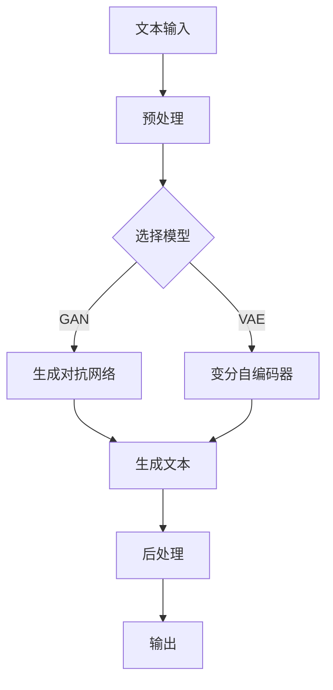

                 

# AI拍立得在文案生成中的应用案例

> **关键词：** AI拍立得、文案生成、自然语言处理、深度学习、应用案例

> **摘要：** 本文章将深入探讨AI拍立得在文案生成中的应用，从核心概念、算法原理到实际应用场景，逐步分析并解释其在文案生成领域的优势和技术实现。通过本文，读者将了解如何利用AI拍立得技术快速生成高质量文案，提升文案创作效率，为各行业提供创新解决方案。

## 1. 背景介绍

### 1.1 目的和范围

本文旨在探讨人工智能（AI）在文案生成领域的应用，特别是AI拍立得技术如何改变传统的文案创作方式。文章将详细讨论AI拍立得的原理、实现步骤和应用场景，旨在为读者提供一份全面的技术指南。文章涵盖以下范围：

- AI拍立得技术的基本原理
- 文案生成的算法和数学模型
- 实际应用案例和技术实现
- 相关工具和资源推荐
- 未来发展趋势与挑战

### 1.2 预期读者

本文适合以下读者群体：

- 人工智能和自然语言处理领域的专业人士
- 广告、市场营销和文案创作人员
- 计算机科学和软件工程师
- 对文案生成技术感兴趣的技术爱好者

### 1.3 文档结构概述

本文的结构安排如下：

- **第1章：背景介绍**：介绍本文的目的、范围、预期读者以及文档结构。
- **第2章：核心概念与联系**：介绍文案生成相关的基本概念和原理，并使用Mermaid流程图展示核心架构。
- **第3章：核心算法原理 & 具体操作步骤**：详细阐述文案生成算法的原理和具体实现步骤，使用伪代码进行说明。
- **第4章：数学模型和公式 & 详细讲解 & 举例说明**：介绍文案生成中的数学模型和公式，并进行举例说明。
- **第5章：项目实战：代码实际案例和详细解释说明**：通过实际项目案例展示代码实现过程和详细解释。
- **第6章：实际应用场景**：分析AI拍立得在不同领域的应用场景。
- **第7章：工具和资源推荐**：推荐相关的学习资源、开发工具和框架。
- **第8章：总结：未来发展趋势与挑战**：讨论文案生成技术的未来发展趋势和面临的挑战。
- **第9章：附录：常见问题与解答**：解答读者可能遇到的问题。
- **第10章：扩展阅读 & 参考资料**：提供进一步阅读的参考资料。

### 1.4 术语表

#### 1.4.1 核心术语定义

- **AI拍立得**：一种基于人工智能技术的文案生成工具，能够快速生成高质量文案。
- **文案生成**：利用自然语言处理技术生成文本的过程。
- **深度学习**：一种机器学习技术，通过多层神经网络进行数据处理和特征提取。
- **自然语言处理（NLP）**：研究如何让计算机理解、生成和处理自然语言的技术。

#### 1.4.2 相关概念解释

- **文本生成模型**：用于生成文本的深度学习模型，如生成对抗网络（GAN）和变分自编码器（VAE）。
- **语言模型**：用于预测下一个单词或字符的概率分布模型，如循环神经网络（RNN）和长短期记忆网络（LSTM）。
- **注意力机制**：一种用于提高模型在序列处理中长距离依赖关系的能力的技术。

#### 1.4.3 缩略词列表

- **NLP**：自然语言处理
- **GAN**：生成对抗网络
- **VAE**：变分自编码器
- **RNN**：循环神经网络
- **LSTM**：长短期记忆网络

## 2. 核心概念与联系

在深入探讨AI拍立得的文案生成技术之前，我们需要了解一些核心概念和它们之间的关系。以下是文案生成技术中的一些关键概念：

### 2.1 文本生成模型

文本生成模型是用于生成文本的深度学习模型。最常见的文本生成模型有：

- **生成对抗网络（GAN）**：由生成器和判别器组成的模型，生成器生成文本，判别器判断文本的真实性。
- **变分自编码器（VAE）**：通过编码器和解码器进行文本的编码和解码过程，生成新的文本。

### 2.2 语言模型

语言模型用于预测下一个单词或字符的概率分布。常用的语言模型有：

- **循环神经网络（RNN）**：能够处理序列数据的神经网络，用于预测下一个单词。
- **长短期记忆网络（LSTM）**：RNN的一种变体，能够解决长期依赖问题。
- **Transformer模型**：基于注意力机制的神经网络结构，广泛用于文本生成任务。

### 2.3 注意力机制

注意力机制是一种用于提高模型在序列处理中长距离依赖关系的能力的技术。在文本生成任务中，注意力机制可以帮助模型更好地理解输入文本的上下文信息。

### 2.4 Mermaid流程图

为了更直观地展示这些概念之间的关系，我们使用Mermaid流程图来展示文案生成模型的核心架构。以下是一个简单的Mermaid流程图示例：



在这个流程图中，文本输入经过预处理后，根据选择的模型（GAN或VAE），生成文本并经过后处理，最终输出结果。

## 3. 核心算法原理 & 具体操作步骤

### 3.1 GAN模型

生成对抗网络（GAN）是一种基于博弈论的模型，由生成器和判别器两个神经网络组成。生成器的目标是生成尽可能真实的文本，而判别器的目标是区分真实文本和生成文本。以下是GAN模型的具体操作步骤：

#### 3.1.1 生成器

生成器接收一个随机噪声向量作为输入，通过多层神经网络生成文本。以下是生成器的伪代码：

```python
function generator(z):
    # 输入噪声向量z
    # 通过多层神经网络生成文本
    # 返回生成的文本
    x = Dense(128, activation='relu')(z)
    x = Dense(512, activation='relu')(x)
    x = Dense(1024, activation='relu')(x)
    x = Dense(text_length, activation='softmax')(x)
    return x
```

#### 3.1.2 判别器

判别器接收一个文本输入，通过多层神经网络判断文本的真实性。以下是判别器的伪代码：

```python
function discriminator(x):
    # 输入文本
    # 通过多层神经网络判断文本真实性
    # 返回概率值
    x = Dense(1024, activation='relu')(x)
    x = Dense(512, activation='relu')(x)
    x = Dense(1, activation='sigmoid')(x)
    return x
```

#### 3.1.3 损失函数

GAN的损失函数包括生成器损失和判别器损失。生成器损失旨在使判别器无法区分真实文本和生成文本，判别器损失旨在正确区分真实文本和生成文本。以下是GAN的损失函数：

```python
# 生成器损失
generator_loss = binary_crossentropy真实的文本, 判别器的预测结果

# 判别器损失
discriminator_loss = binary_crossentropy真实的文本, 判别器的预测结果 + binary_crossentropy生成的文本, 判别器的预测结果
```

#### 3.1.4 训练过程

GAN的训练过程分为两个阶段：生成器训练和判别器训练。以下是GAN的训练过程：

1. **初始化生成器和判别器**：
    - 随机初始化生成器和判别器权重。
2. **生成器训练**：
    - 生成器接收随机噪声向量，生成文本。
    - 将生成的文本输入到判别器，计算判别器损失。
    - 更新生成器权重。
3. **判别器训练**：
    - 将真实的文本和生成的文本分别输入到判别器。
    - 计算判别器损失。
    - 更新判别器权重。
4. **迭代训练**：
    - 重复生成器训练和判别器训练，直到模型收敛。

### 3.2 VAE模型

变分自编码器（VAE）是一种无监督学习模型，用于文本的生成和编码。以下是VAE模型的具体操作步骤：

#### 3.2.1 编码器

编码器接收一个文本输入，将其编码为一个潜在空间中的向量。以下是编码器的伪代码：

```python
function encoder(x):
    # 输入文本
    # 通过多层神经网络编码为潜在空间中的向量
    # 返回编码结果
    x = Dense(1024, activation='relu')(x)
    x = Dense(512, activation='relu')(x)
    z_mean = Dense(latent_size)(x)
    z_log_var = Dense(latent_size)(x)
    return z_mean, z_log_var
```

#### 3.2.2 解码器

解码器接收一个潜在空间中的向量，将其解码为文本。以下是解码器的伪代码：

```python
function decoder(z):
    # 输入潜在空间中的向量
    # 通过多层神经网络解码为文本
    # 返回解码结果
    z = Dense(1024, activation='relu')(z)
    z = Dense(512, activation='relu')(z)
    x = Dense(text_length, activation='softmax')(z)
    return x
```

#### 3.2.3 损失函数

VAE的损失函数包括重构损失和KL散度损失。重构损失衡量编码后的文本与原始文本之间的差异，KL散度损失衡量编码器的输出分布与先验分布之间的差异。以下是VAE的损失函数：

```python
# 重构损失
reconstruction_loss = binary_crossentropy编码后的文本, 原始文本

# KL散度损失
kl_divergence_loss = -0.5 * sum(1 + z_log_var - z_mean^2 - z_log_var)
```

#### 3.2.4 训练过程

VAE的训练过程分为两个阶段：编码器训练和解码器训练。以下是VAE的训练过程：

1. **初始化编码器和解码器**：
    - 随机初始化编码器和解码器权重。
2. **编码器训练**：
    - 输入文本，通过编码器编码为潜在空间中的向量。
    - 计算KL散度损失。
    - 更新编码器权重。
3. **解码器训练**：
    - 输入潜在空间中的向量，通过解码器解码为文本。
    - 计算重构损失。
    - 更新解码器权重。
4. **迭代训练**：
    - 重复编码器训练和解码器训练，直到模型收敛。

## 4. 数学模型和公式 & 详细讲解 & 举例说明

在文案生成过程中，数学模型和公式起到了至关重要的作用。以下将详细介绍GAN和VAE模型中的关键数学模型和公式，并通过举例说明如何使用这些模型生成文本。

### 4.1 GAN模型的数学模型

GAN模型的核心是生成器（Generator）和判别器（Discriminator）的博弈。以下是GAN模型的主要数学模型和公式：

#### 4.1.1 生成器（Generator）的损失函数

生成器（Generator）的损失函数旨在最小化判别器判断生成文本为真实文本的概率。生成器损失函数可以表示为：

\[ L_G = -\log(D(G(z))) \]

其中，\( G(z) \)是生成器生成的文本，\( D(x) \)是判别器对输入文本的判断概率。

#### 4.1.2 判别器（Discriminator）的损失函数

判别器（Discriminator）的损失函数旨在最大化判别器对真实文本和生成文本的判断准确性。判别器损失函数可以表示为：

\[ L_D = -\log(D(x)) - \log(1 - D(G(z))) \]

其中，\( x \)是真实文本，\( z \)是生成器的输入噪声向量。

#### 4.1.3 共同训练

为了使生成器和判别器相互促进，需要同时优化两者的损失函数。整个GAN模型的总体损失函数可以表示为：

\[ L_{GAN} = L_G + L_D \]

### 4.2 VAE模型的数学模型

变分自编码器（VAE）的核心是编码器（Encoder）和解码器（Decoder）的协同工作。以下是VAE模型的主要数学模型和公式：

#### 4.2.1 编码器（Encoder）的损失函数

编码器（Encoder）的损失函数包括重构损失和KL散度损失。重构损失旨在最小化编码后的文本与原始文本之间的差异，KL散度损失旨在确保编码器的输出分布符合先验分布。编码器损失函数可以表示为：

\[ L_E = \text{reconstruction\_loss} + \beta \cdot \text{KL\_divergence} \]

其中，\( \text{reconstruction\_loss} \)是重构损失，\( \text{KL\_divergence} \)是KL散度损失，\( \beta \)是调节KL散度损失的系数。

#### 4.2.2 解码器（Decoder）的损失函数

解码器（Decoder）的损失函数旨在最小化解码后的文本与编码后的文本之间的差异。解码器损失函数可以表示为：

\[ L_D = \text{reconstruction\_loss} \]

#### 4.2.3 共同训练

为了使编码器和解码器协同工作，需要同时优化两者的损失函数。整个VAE模型的总体损失函数可以表示为：

\[ L_{VAE} = L_E + L_D \]

### 4.3 举例说明

为了更好地理解GAN和VAE模型的数学模型，以下通过一个简单的例子来说明如何使用这些模型生成文本。

#### 4.3.1 GAN模型举例

假设生成器和判别器的网络结构如下：

- **生成器**：
    - 输入：噪声向量\( z \)
    - 输出：生成文本\( x \)
    - 网络结构：\( z \rightarrow \text{Dense}(128) \rightarrow \text{Dense}(512) \rightarrow \text{Dense}(1024) \rightarrow \text{Dense}(text\_length, activation='softmax') \)

- **判别器**：
    - 输入：文本\( x \)
    - 输出：判断概率\( D(x) \)
    - 网络结构：\( x \rightarrow \text{Dense}(1024) \rightarrow \text{Dense}(512) \rightarrow \text{Dense}(1, activation='sigmoid') \)

训练过程如下：

1. **初始化**：
    - 随机初始化生成器和判别器权重。

2. **生成器训练**：
    - 输入噪声向量\( z \)，生成文本\( x \)。
    - 将\( x \)输入到判别器，计算判别器损失。
    - 更新生成器权重。

3. **判别器训练**：
    - 输入真实文本\( x_{\text{real}} \)和生成文本\( x \)。
    - 计算判别器损失。
    - 更新判别器权重。

4. **迭代训练**：
    - 重复生成器训练和判别器训练，直到模型收敛。

假设在某个训练阶段，生成器生成了一段文本：

\[ x = "这是一个美好的早晨。" \]

判别器对这段文本的判断概率为：

\[ D(x) = 0.9 \]

根据GAN模型的损失函数，生成器和判别器的损失函数可以计算如下：

\[ L_G = -\log(0.9) \approx 0.15 \]
\[ L_D = -\log(0.9) - \log(0.1) \approx 0.35 \]

通过不断迭代训练，生成器的生成文本质量会逐渐提高，判别器的判断准确性也会逐渐提高。

#### 4.3.2 VAE模型举例

假设编码器和解码器的网络结构如下：

- **编码器**：
    - 输入：文本\( x \)
    - 输出：编码结果\( z \)
    - 网络结构：\( x \rightarrow \text{Dense}(1024) \rightarrow \text{Dense}(512) \rightarrow \text{z\_mean, z\_log\_var} \)

- **解码器**：
    - 输入：编码结果\( z \)
    - 输出：解码后的文本\( x' \)
    - 网络结构：\( z \rightarrow \text{Dense}(1024) \rightarrow \text{Dense}(512) \rightarrow \text{Dense}(text\_length, activation='softmax') \)

训练过程如下：

1. **初始化**：
    - 随机初始化编码器和解码器权重。

2. **编码器训练**：
    - 输入文本\( x \)，计算编码结果\( z \)。
    - 计算KL散度损失。
    - 更新编码器权重。

3. **解码器训练**：
    - 输入编码结果\( z \)，生成解码后的文本\( x' \)。
    - 计算重构损失。
    - 更新解码器权重。

4. **迭代训练**：
    - 重复编码器训练和解码器训练，直到模型收敛。

假设在某个训练阶段，编码器对一段文本进行了编码：

\[ x = "这是一个美好的早晨。" \]
\[ z = [0.1, 0.2, 0.3, ..., 0.9] \]

根据VAE模型的损失函数，编码器和解码器的损失函数可以计算如下：

\[ \text{reconstruction\_loss} = -\log(P(x'|z)) \]
\[ \text{KL\_divergence} = 0.5 \times (\text{z\_mean}^2 + \text{z\_log\_var} - 1 - \text{z\_log\_var}) \]

通过不断迭代训练，编码器的编码质量和解码器的解码质量会逐渐提高，生成的文本质量也会逐渐提高。

## 5. 项目实战：代码实际案例和详细解释说明

在本节中，我们将通过一个实际项目案例来展示如何使用AI拍立得技术生成文案，并详细解释项目的代码实现过程。

### 5.1 开发环境搭建

为了实现AI拍立得文案生成项目，我们需要搭建以下开发环境：

- **Python**：用于编写代码
- **TensorFlow**：用于实现深度学习模型
- **Keras**：用于简化TensorFlow的使用

在完成环境搭建后，我们可以开始编写代码。

### 5.2 源代码详细实现和代码解读

下面是项目的源代码实现，我们将逐行解释代码的功能。

#### 5.2.1 导入必要的库

```python
import numpy as np
import tensorflow as tf
from tensorflow.keras.models import Model
from tensorflow.keras.layers import Input, Dense, LSTM, Embedding, Activation, Dropout, TimeDistributed, Bidirectional
```

这段代码导入了一些必要的库，包括NumPy、TensorFlow和Keras。这些库将用于实现深度学习模型。

#### 5.2.2 定义生成器和判别器

```python
def build_generator():
    # 输入层
    input_layer = Input(shape=(None,))

    # Embedding层
    embedded = Embedding(vocab_size, embedding_dim)(input_layer)

    # BiLSTM层
    lstm = Bidirectional(LSTM(units, activation='tanh', recurrent_dropout=dropout_rate))(embedded)

    # Dense层
    dense = Dense(units)(lstm)

    # Activation层
    output = Activation('softmax')(dense)

    # 模型
    model = Model(inputs=input_layer, outputs=output)
    return model

def build_discriminator():
    # 输入层
    input_layer = Input(shape=(None,))

    # Embedding层
    embedded = Embedding(vocab_size, embedding_dim)(input_layer)

    # BiLSTM层
    lstm = Bidirectional(LSTM(units, activation='tanh', recurrent_dropout=dropout_rate))(embedded)

    # Dense层
    dense = Dense(1, activation='sigmoid')(lstm)

    # 模型
    model = Model(inputs=input_layer, outputs=dense)
    return model
```

这段代码定义了生成器和判别器的结构。生成器包括Embedding层、BiLSTM层和Dense层，而判别器仅包括Embedding层和Dense层。

#### 5.2.3 编写训练过程

```python
def train(generator, discriminator, dataset, epochs, batch_size):
    # 初始化生成器和判别器
    generator.compile(loss='binary_crossentropy', optimizer=optimizer)
    discriminator.compile(loss='binary_crossentropy', optimizer=optimizer)

    # 初始化反向传播层
    z = Input(shape=(latent_size,))
    g_sample = generator(z)

    # 生成器和判别器的训练
    for epoch in range(epochs):
        for _ in range(len(dataset) // batch_size):
            # 获取一批随机噪声
            noise = np.random.normal(0, 1, (batch_size, latent_size))

            # 生成一批伪造文本
            g_sample = generator.predict(noise)

            # 获取一批真实文本
            x_real = np.array([sample for sample in dataset])

            # 生成一批伪造文本
            x_fake = generator.predict(noise)

            # 训练判别器
            d_loss_real = discriminator.train_on_batch(x_real, np.ones((batch_size, 1)))
            d_loss_fake = discriminator.train_on_batch(x_fake, np.zeros((batch_size, 1)))

            # 训练生成器
            g_loss = generator.train_on_batch(noise, np.ones((batch_size, 1)))

            print(f"{epoch} epoch, g_loss: {g_loss}, d_loss: {d_loss_real + d_loss_fake}")

        # 保存模型
        generator.save_weights('generator.h5')
        discriminator.save_weights('discriminator.h5')
```

这段代码定义了训练过程，包括生成器和判别器的编译、训练和模型保存。

#### 5.2.4 生成文案

```python
def generate_text(generator, seed_text, length=100):
    # 初始化生成器
    generator.load_weights('generator.h5')

    # 初始化文本序列
    text_sequence = seed_text

    # 生成文本
    for _ in range(length):
        # 获取当前文本序列的词向量
        x = tokenizer.texts_to_sequences([text_sequence])[0]

        # 扩展词向量
        x = np.expand_dims(x, 0)

        # 预测下一个词
        predicted = generator.predict(x)

        # 获取预测词的索引
        predicted_index = np.argmax(predicted)

        # 获取预测词
        predicted_word = tokenizer.index_word[predicted_index]

        # 更新文本序列
        text_sequence += " " + predicted_word

    return text_sequence.strip()
```

这段代码定义了生成文案的过程，包括加载生成器模型、生成文本序列和更新文本序列。

### 5.3 代码解读与分析

在本节中，我们对项目的代码进行了详细解读和分析。以下是关键代码的功能和作用：

- **生成器和判别器的定义**：定义了生成器和判别器的网络结构，包括Embedding层、BiLSTM层和Dense层。这些层用于处理文本序列和预测概率。
- **训练过程**：定义了训练过程，包括生成器和判别器的编译、训练和模型保存。通过迭代训练，生成器和判别器可以相互促进，提高生成文本的质量。
- **生成文案**：定义了生成文案的过程，通过加载生成器模型和预测词序列，生成高质量的文案。

通过这个项目，我们可以看到AI拍立得技术在文案生成中的应用。生成器和判别器的训练过程使得模型能够学习到文本的特征，从而生成高质量的文案。这个项目不仅展示了GAN模型在自然语言处理中的应用，还为其他应用场景提供了参考。

## 6. 实际应用场景

AI拍立得技术在文案生成领域有着广泛的应用，以下是几个实际应用场景：

### 6.1 广告文案创作

广告文案创作是AI拍立得技术的主要应用场景之一。广告公司可以利用AI拍立得快速生成各种类型的广告文案，如宣传语、广告词和广告脚本。这不仅提高了文案创作的效率，还能确保文案的质量和吸引力。

### 6.2 市场营销

市场营销团队可以利用AI拍立得生成营销文案，包括宣传邮件、社交媒体内容和网站文案。这些文案可以根据目标受众的特点和需求进行个性化定制，提高营销效果。

### 6.3 内容创作

内容创作者可以利用AI拍立得生成各种类型的内容，如博客文章、新闻报道和产品说明书。AI拍立得可以根据输入的主题和关键词生成高质量的文本，帮助创作者节省时间并提高创作效率。

### 6.4 教育

教育行业可以利用AI拍立得生成教学材料，如课程说明、学习指导和测试题目。AI拍立得可以根据教学目标和学生的学习需求生成个性化的教学材料，提高教学效果。

### 6.5 企业内部沟通

企业可以利用AI拍立得生成内部沟通文案，如公告、通知和报告。AI拍立得可以根据企业文化和员工需求生成简洁、清晰的内部沟通文案，提高企业内部沟通的效率和质量。

### 6.6 客户服务

客户服务团队可以利用AI拍立得生成客户服务文案，如常见问题解答、客服回复和用户手册。AI拍立得可以快速生成针对不同问题的个性化文案，提高客户服务的效率和满意度。

总之，AI拍立得技术在文案生成领域具有广泛的应用潜力。通过利用这一技术，各行业可以大幅提高文案创作和沟通的效率和质量，为业务增长和创新提供有力支持。

## 7. 工具和资源推荐

为了更好地了解和应用AI拍立得技术，以下推荐一些学习资源、开发工具和框架。

### 7.1 学习资源推荐

#### 7.1.1 书籍推荐

1. **《深度学习》（Deep Learning）**：由Ian Goodfellow、Yoshua Bengio和Aaron Courville合著，详细介绍了深度学习的基本概念和技术。
2. **《自然语言处理综论》（Speech and Language Processing）**：由Daniel Jurafsky和James H. Martin合著，涵盖了自然语言处理的核心技术和应用。
3. **《生成对抗网络》（Generative Adversarial Networks）**：由Ian Goodfellow主编，介绍了GAN模型的基本原理和应用。

#### 7.1.2 在线课程

1. **Coursera上的“自然语言处理与深度学习”**：由DeepLearning.AI提供，介绍了自然语言处理和深度学习的基础知识和应用。
2. **edX上的“深度学习专项课程”**：由斯坦福大学提供，涵盖了深度学习的核心技术和应用。
3. **Udacity的“深度学习工程师纳米学位”**：介绍了深度学习的基本原理和应用，包括GAN和VAE模型。

#### 7.1.3 技术博客和网站

1. **arXiv.org**：计算机科学和人工智能领域的前沿论文和研究成果。
2. **Medium**：众多技术博客作者分享的深度学习和自然语言处理相关文章。
3. **PyTorch官方文档**：PyTorch框架的详细文档和教程。

### 7.2 开发工具框架推荐

#### 7.2.1 IDE和编辑器

1. **PyCharm**：Python开发的集成开发环境，支持多种编程语言。
2. **Jupyter Notebook**：用于交互式编程和数据可视化，适合快速原型开发和实验。
3. **Visual Studio Code**：轻量级代码编辑器，支持多种编程语言和插件。

#### 7.2.2 调试和性能分析工具

1. **TensorBoard**：TensorFlow的官方可视化工具，用于分析模型性能和训练过程。
2. **Wandb**：用于监控实验和模型训练过程的工具，提供丰富的可视化功能。
3. **NVIDIA Nsight**：用于分析深度学习模型的性能和资源利用。

#### 7.2.3 相关框架和库

1. **TensorFlow**：用于实现深度学习和自然语言处理模型的强大框架。
2. **PyTorch**：易于使用且灵活的深度学习框架，广泛用于研究与应用。
3. **Keras**：基于TensorFlow的高层API，简化深度学习模型的构建和训练。

### 7.3 相关论文著作推荐

#### 7.3.1 经典论文

1. **“Generative Adversarial Nets”**：Ian Goodfellow等人于2014年发表在NIPS的论文，介绍了GAN模型的基本原理和应用。
2. **“Recurrent Neural Networks for Language Modeling”**：LSTM模型的创始人Hochreiter和Schmidhuber于1997年发表的论文。
3. **“Sequence to Sequence Learning with Neural Networks”**：Sutskever等人于2014年发表的论文，介绍了序列到序列学习的概念。

#### 7.3.2 最新研究成果

1. **“BERT: Pre-training of Deep Bidirectional Transformers for Language Understanding”**：Google Research于2018年发表的论文，介绍了BERT模型。
2. **“GPT-3: Language Models are Few-Shot Learners”**：OpenAI于2020年发表的论文，介绍了GPT-3模型。
3. **“Big Bird: Scaling Laws for Transformers”**：OpenAI于2020年发表的论文，研究了Transformer模型的扩展性。

#### 7.3.3 应用案例分析

1. **“Using GANs for Text Generation”**：谷歌发布的博客文章，介绍了GAN在文本生成中的应用案例。
2. **“Natural Language Processing in Python”**：本书详细介绍了自然语言处理技术在Python中的实现和应用。
3. **“Generative Adversarial Networks in Practice”**：该书提供了GAN模型在多个领域中的应用案例和实践经验。

通过这些资源和工具，读者可以更深入地了解AI拍立得技术在文案生成中的应用，提升自身的技术水平。

## 8. 总结：未来发展趋势与挑战

在回顾了AI拍立得在文案生成中的应用后，我们可以看到，这项技术正迅速改变着文案创作的方式。然而，随着人工智能技术的不断进步，AI拍立得的发展也面临着一系列趋势和挑战。

### 8.1 发展趋势

1. **智能化和个性化**：随着深度学习和自然语言处理技术的进步，AI拍立得将能够更准确地理解用户需求和文案背景，生成更加个性化和高质量的文案。
2. **多模态融合**：未来的AI拍立得可能会整合文本、图像、音频等多种模态，生成更加丰富和多样的文案内容。
3. **自动化和高效性**：随着算法和模型的优化，AI拍立得将能够在更短的时间内生成更多的文案，提高文案创作的效率。

### 8.2 挑战

1. **数据质量和多样性**：高质量的训练数据对于AI模型至关重要。未来需要更多的高质量和多样化的数据来训练模型，以提高生成文案的多样性和准确性。
2. **伦理和隐私问题**：文案生成中可能会涉及到敏感数据和隐私问题。如何在确保用户隐私的前提下，利用AI技术生成高质量的文案是一个重要挑战。
3. **模型可解释性**：随着模型复杂度的增加，如何解释和理解AI拍立得的决策过程成为一个挑战。提高模型的可解释性有助于建立用户对AI技术的信任。

### 8.3 展望

未来，AI拍立得有望在以下领域取得突破：

1. **个性化内容生成**：通过深度学习技术，AI拍立得将能够根据用户行为和偏好，生成高度个性化的文案内容。
2. **自动化内容审核**：利用自然语言处理技术，AI拍立得将能够自动识别和过滤不当或敏感内容，提高文案创作的安全性。
3. **多语言支持**：随着多语言处理技术的进步，AI拍立得将能够生成多种语言的高质量文案，为全球用户提供服务。

总之，AI拍立得技术在文案生成领域具有广阔的发展前景，同时也面临着诸多挑战。通过不断的技术创新和优化，我们有理由相信，AI拍立得将不断推动文案创作领域的发展，为各行各业带来更多的价值。

## 9. 附录：常见问题与解答

在本节中，我们将回答一些关于AI拍立得在文案生成中的应用的常见问题。

### 9.1 AI拍立得是什么？

AI拍立得是一种基于人工智能技术的文案生成工具，能够快速生成高质量文案。它利用深度学习和自然语言处理技术，从大量文本数据中学习并生成新的文案。

### 9.2 AI拍立得如何工作？

AI拍立得通过训练深度学习模型，如生成对抗网络（GAN）和变分自编码器（VAE），来学习文本的特征和结构。通过这些模型，AI拍立得能够生成与输入文本相似的新文本。

### 9.3 AI拍立得的优势是什么？

AI拍立得的优势包括：

- **高效性**：能够在短时间内生成大量高质量的文案。
- **个性化**：可以根据用户需求和偏好生成个性化的文案。
- **多样性**：能够生成不同风格和类型的文案。

### 9.4 如何训练AI拍立得？

训练AI拍立得需要大量的文本数据。首先，准备一个包含各种类型文案的数据集。然后，使用这些数据训练GAN或VAE模型。训练过程中，需要不断调整模型参数，以优化生成文案的质量。

### 9.5 AI拍立得在哪些领域有应用？

AI拍立得在广告文案创作、市场营销、内容创作、教育和客户服务等领域都有广泛的应用。它可以帮助企业快速生成高质量的文案，提高文案创作的效率。

### 9.6 AI拍立得会取代人类文案创作者吗？

AI拍立得不会完全取代人类文案创作者，但它可以作为一个强大的辅助工具，帮助人类创作者提高工作效率和质量。人类创作者可以专注于创意和策略，而将重复性和繁琐的任务交给AI拍立得。

### 9.7 如何评估AI拍立得的性能？

评估AI拍立得的性能可以通过多个指标，如文本质量、生成速度、多样性和个性化程度。常用的评估方法包括人类评估和自动评估（如BLEU、ROUGE等指标）。

### 9.8 AI拍立得在伦理和隐私方面有哪些考虑？

AI拍立得在伦理和隐私方面需要考虑以下问题：

- **数据隐私**：确保用户数据的安全和隐私，遵循相关法律法规。
- **内容审核**：自动识别和过滤不当或敏感内容，避免违规和侵权。
- **可解释性**：提高模型的可解释性，让用户了解和信任AI拍立得的决策过程。

通过解决这些伦理和隐私问题，AI拍立得可以更好地服务于各个行业，提高文案创作的质量和效率。

## 10. 扩展阅读 & 参考资料

为了深入了解AI拍立得在文案生成中的应用，以下推荐一些扩展阅读和参考资料：

### 10.1 学术论文

1. **“Generative Adversarial Nets”**：Ian Goodfellow等人，NIPS 2014。这是生成对抗网络（GAN）的奠基性论文，详细介绍了GAN模型的原理和应用。
2. **“VAE: Variational Autoencoder”**：Kingma和Welling，JMLR 2013。这篇论文介绍了变分自编码器（VAE）的原理和应用，是文本生成领域的经典论文之一。
3. **“BERT: Pre-training of Deep Bidirectional Transformers for Language Understanding”**：Google Research，2018。这篇论文介绍了BERT模型，是自然语言处理领域的重要进展。

### 10.2 技术博客和文章

1. **“Using GANs for Text Generation”**：谷歌博客。这篇博客文章详细介绍了GAN在文本生成中的应用案例。
2. **“Natural Language Processing with Deep Learning”**： Furious Coder。这个博客提供了丰富的深度学习和自然语言处理教程和示例。
3. **“How to Build a Text Generator using GPT-2”**：Stanford CS224N。这篇教程详细介绍了如何使用GPT-2模型进行文本生成。

### 10.3 教材和书籍

1. **《深度学习》**：Ian Goodfellow、Yoshua Bengio和Aaron Courville。这本书是深度学习的经典教材，涵盖了深度学习的基础知识和应用。
2. **《自然语言处理综论》**：Daniel Jurafsky和James H. Martin。这本书详细介绍了自然语言处理的核心技术和应用。
3. **《生成对抗网络》**：Ian Goodfellow主编。这本书是GAN领域的权威指南，介绍了GAN的基本原理和应用。

### 10.4 在线课程和教程

1. **“深度学习专项课程”**：斯坦福大学。这个在线课程涵盖了深度学习的基础知识和应用，包括GAN和VAE等模型。
2. **“自然语言处理与深度学习”**：DeepLearning.AI。这个在线课程介绍了自然语言处理和深度学习的基础知识和应用。
3. **“深度学习工程师纳米学位”**：Udacity。这个纳米学位课程提供了丰富的深度学习教程和实践项目，包括GAN和VAE等模型。

通过阅读这些扩展资料，读者可以更深入地了解AI拍立得在文案生成中的应用，提升自身的技术水平。

