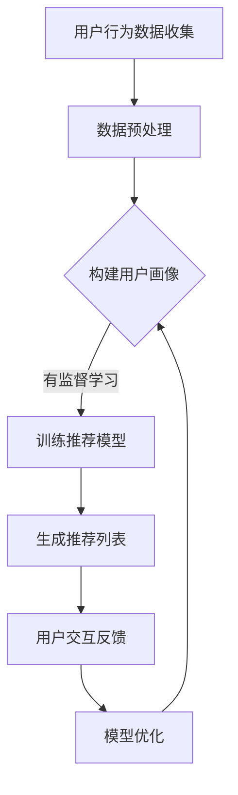

                 

### 1. 背景介绍

#### 1.1 目的和范围

本文的目的是深入探讨如何通过人工智能（AI）技术提升电商平台的用户体验。随着互联网和电子商务的迅猛发展，消费者对电商平台的需求日益多样化，如何有效地满足这些需求，提升用户体验，成为电商平台竞争的关键因素。本文将结合实际案例，分析AI技术在电商领域的应用，探讨其提升用户体验的策略和具体实施步骤。

本文将涵盖以下内容：

1. **核心概念与联系**：介绍与AI提升电商用户体验相关的核心概念和流程。
2. **核心算法原理与具体操作步骤**：讲解提升电商用户体验的核心算法原理，并提供详细的伪代码实现。
3. **数学模型和公式**：详细阐述AI提升电商用户体验的数学模型和公式，并通过具体例子进行说明。
4. **项目实战**：提供实际代码案例，详细解释代码实现和解读。
5. **实际应用场景**：分析AI提升电商用户体验在不同电商场景中的应用。
6. **工具和资源推荐**：推荐学习资源、开发工具框架和相关论文著作。
7. **总结**：展望AI提升电商用户体验的未来发展趋势和挑战。

#### 1.2 预期读者

本文适合以下读者：

1. **电商行业从业者**：希望了解AI提升用户体验的电商从业者。
2. **AI技术爱好者**：对AI在电商领域应用感兴趣的AI技术爱好者。
3. **计算机科学专业学生**：对电商和AI技术结合方向感兴趣的学生。

#### 1.3 文档结构概述

本文分为十个部分，每个部分的内容如下：

1. **背景介绍**：介绍文章的目的、范围、预期读者和文档结构。
2. **核心概念与联系**：阐述与AI提升电商用户体验相关的核心概念和流程。
3. **核心算法原理与具体操作步骤**：讲解提升电商用户体验的核心算法原理，并提供详细的伪代码实现。
4. **数学模型和公式**：详细阐述AI提升电商用户体验的数学模型和公式，并通过具体例子进行说明。
5. **项目实战**：提供实际代码案例，详细解释代码实现和解读。
6. **实际应用场景**：分析AI提升电商用户体验在不同电商场景中的应用。
7. **工具和资源推荐**：推荐学习资源、开发工具框架和相关论文著作。
8. **总结**：展望AI提升电商用户体验的未来发展趋势和挑战。
9. **附录：常见问题与解答**：针对本文内容提供常见问题及解答。
10. **扩展阅读与参考资料**：提供相关扩展阅读和参考资料。

#### 1.4 术语表

在本文中，我们将使用一些专业术语，以下是对这些术语的定义和解释：

##### 1.4.1 核心术语定义

- **人工智能（AI）**：指通过计算机模拟人类智能的学科和技术。
- **机器学习（ML）**：AI的一个分支，通过数据训练模型，使其能够进行预测和决策。
- **深度学习（DL）**：一种基于神经网络的机器学习技术。
- **推荐系统**：根据用户行为和偏好，为用户推荐相关商品或内容。
- **自然语言处理（NLP）**：使计算机能够理解和生成人类语言的技术。

##### 1.4.2 相关概念解释

- **用户体验（UX）**：用户在使用产品或服务过程中的感受和体验。
- **用户行为分析**：通过分析用户行为数据，了解用户需求和偏好。
- **数据挖掘**：从大量数据中发现有价值的信息和模式。

##### 1.4.3 缩略词列表

- **AI**：人工智能（Artificial Intelligence）
- **ML**：机器学习（Machine Learning）
- **DL**：深度学习（Deep Learning）
- **NLP**：自然语言处理（Natural Language Processing）
- **UX**：用户体验（User Experience）
- **API**：应用程序接口（Application Programming Interface）
- **SDK**：软件开发工具包（Software Development Kit）

### 2. 核心概念与联系

在探讨如何通过AI技术提升电商平台的用户体验之前，我们需要了解与这一主题相关的核心概念和流程。以下是对这些核心概念的介绍，并使用Mermaid流程图进行展示。

#### 2.1 核心概念

- **用户行为数据**：用户在电商平台上产生的点击、浏览、购买等行为数据。
- **用户画像**：基于用户行为数据和人口统计信息，构建的用户个人特征描述。
- **推荐系统**：利用机器学习和深度学习技术，为用户推荐个性化商品或内容。
- **自然语言处理（NLP）**：通过算法使计算机理解和生成人类语言，用于处理用户评论、搜索等。
- **用户体验（UX）**：用户在电商平台上的整体感受和体验。

#### 2.2 Mermaid流程图



在这个流程图中，我们展示了从用户行为数据收集、预处理、构建用户画像、训练推荐模型、生成推荐列表，到用户交互反馈和模型优化的整个过程。接下来，我们将详细解释这些核心概念和流程。

### 3. 核心算法原理 & 具体操作步骤

在了解了核心概念和流程之后，我们接下来将深入探讨AI提升电商用户体验的核心算法原理，并详细阐述其具体操作步骤。首先，我们选择一种常见的推荐算法——协同过滤（Collaborative Filtering），然后通过伪代码展示其实现过程。

#### 3.1 协同过滤算法原理

协同过滤是一种基于用户行为数据推荐的算法，主要分为两种类型：基于用户的协同过滤（User-based CF）和基于物品的协同过滤（Item-based CF）。

- **基于用户的协同过滤**：通过计算用户之间的相似度，找到相似的用户，再根据这些用户的评价来推荐商品。
- **基于物品的协同过滤**：通过计算物品之间的相似度，找到相似的商品，再根据这些商品的用户评价来推荐给目标用户。

#### 3.2 具体操作步骤

以下是基于用户的协同过滤算法的伪代码实现：

```plaintext
输入：用户行为数据集 U，用户评分矩阵 R
输出：推荐列表 L

// 步骤1：计算用户相似度矩阵 S
for each 用户 u in U do
    for each 用户 v in U do
        if 用户 u 和用户 v 交互过 then
            S[u][v] = 计算相似度（u, v）
        else
            S[u][v] = 0
        end if
    end for
end for

// 步骤2：计算用户 u 的邻居集合 N(u)
N(u) = 选择 k 个最相似的邻居用户 from S[u]

// 步骤3：根据邻居用户的评分预测用户 u 对未评物品的评分
for each 物品 i in U - 评分过的物品 do
    r_ui = 平均（邻居用户 v 的评分 r_vi）
    if r_ui > 阈值 then
        将物品 i 添加到推荐列表 L 中
    end if
end for
```

#### 3.3 伪代码详细解释

- **步骤1：计算用户相似度矩阵 S**：首先，我们需要根据用户行为数据集 U 计算用户之间的相似度矩阵 S。相似度的计算方法可以有多种，如余弦相似度、皮尔逊相关系数等。这里以余弦相似度为示例：

  ```plaintext
  S[u][v] = (R[u] · R[v]) / (||R[u]|| · ||R[v]||)
  ```

  其中，R[u] 和 R[v] 分别是用户 u 和用户 v 的评分向量，||R[u]|| 和 ||R[v]|| 分别是它们的欧几里得范数。

- **步骤2：计算用户 u 的邻居集合 N(u)**：接下来，我们需要选择 k 个最相似的邻居用户。这里采用简单的选择排序算法：

  ```plaintext
  N(u) = 选择 k 个最相似的邻居用户 from S[u]
  ```

- **步骤3：根据邻居用户的评分预测用户 u 对未评物品的评分**：最后，我们根据邻居用户的评分预测用户 u 对未评物品的评分。这里采用简单平均方法：

  ```plaintext
  r_ui = 平均（邻居用户 v 的评分 r_vi）
  ```

  如果预测评分大于阈值，则将物品 i 添加到推荐列表 L 中。

### 4. 数学模型和公式 & 详细讲解 & 举例说明

在深入探讨AI提升电商用户体验的过程中，数学模型和公式起着至关重要的作用。以下将详细讲解推荐系统中的主要数学模型和公式，并通过具体例子进行说明。

#### 4.1 推荐系统的数学模型

推荐系统主要基于以下数学模型：

1. **用户相似度计算**：用于找到与目标用户相似的其他用户。
2. **物品相似度计算**：用于找到与目标物品相似的其他物品。
3. **评分预测**：根据用户相似度和物品相似度预测用户对未评物品的评分。

#### 4.2 用户相似度计算

用户相似度计算公式如下：

\[ S_{uv} = \frac{R_u \cdot R_v}{\|R_u\| \|R_v\|} \]

其中，\( S_{uv} \) 表示用户 u 和用户 v 之间的相似度，\( R_u \) 和 \( R_v \) 分别表示用户 u 和用户 v 的评分向量，\( \|R_u\| \) 和 \( \|R_v\| \) 分别是它们的欧几里得范数。

**示例**：

假设有两个用户 u 和 v，其评分向量如下：

\[ R_u = \begin{bmatrix} 4 & 3 & 5 \\ 3 & 2 & 4 \\ 5 & 4 & 3 \end{bmatrix}, \quad R_v = \begin{bmatrix} 5 & 4 & 3 \\ 4 & 3 & 5 \\ 3 & 5 & 4 \end{bmatrix} \]

计算这两个用户的相似度：

\[ S_{uv} = \frac{(4 \cdot 5 + 3 \cdot 4 + 5 \cdot 3) + (3 \cdot 4 + 2 \cdot 3 + 4 \cdot 5) + (5 \cdot 3 + 4 \cdot 5 + 3 \cdot 4)}{\sqrt{(4^2 + 3^2 + 5^2) \cdot (5^2 + 4^2 + 3^2)}} \]

\[ S_{uv} = \frac{35 + 24 + 30 + 12 + 20 + 20}{\sqrt{50 \cdot 50}} \]

\[ S_{uv} = \frac{119}{50} = 2.38 \]

#### 4.3 物品相似度计算

物品相似度计算公式与用户相似度类似，如下：

\[ S_{ij} = \frac{R_i \cdot R_j}{\|R_i\| \|R_j\|} \]

其中，\( S_{ij} \) 表示物品 i 和物品 j 之间的相似度，\( R_i \) 和 \( R_j \) 分别表示物品 i 和物品 j 的用户评分向量，\( \|R_i\| \) 和 \( \|R_j\| \) 分别是它们的欧几里得范数。

**示例**：

假设有两个物品 i 和 j，其用户评分向量如下：

\[ R_i = \begin{bmatrix} 4 & 3 & 5 \\ 3 & 2 & 4 \\ 5 & 4 & 3 \end{bmatrix}, \quad R_j = \begin{bmatrix} 5 & 4 & 3 \\ 4 & 3 & 5 \\ 3 & 5 & 4 \end{bmatrix} \]

计算这两个物品的相似度：

\[ S_{ij} = \frac{(4 \cdot 5 + 3 \cdot 4 + 5 \cdot 3) + (3 \cdot 4 + 2 \cdot 3 + 4 \cdot 5) + (5 \cdot 3 + 4 \cdot 5 + 3 \cdot 4)}{\sqrt{(4^2 + 3^2 + 5^2) \cdot (5^2 + 4^2 + 3^2)}} \]

\[ S_{ij} = \frac{35 + 24 + 30 + 12 + 20 + 20}{\sqrt{50 \cdot 50}} \]

\[ S_{ij} = \frac{119}{50} = 2.38 \]

#### 4.4 评分预测

评分预测公式如下：

\[ r_{ui} = \sum_{v \in N(u)} S_{uv} \cdot r_{vi} \]

其中，\( r_{ui} \) 表示用户 u 对物品 i 的预测评分，\( N(u) \) 表示用户 u 的邻居集合，\( S_{uv} \) 表示用户 u 和邻居用户 v 之间的相似度，\( r_{vi} \) 表示邻居用户 v 对物品 i 的真实评分。

**示例**：

假设目标用户 u 的邻居集合为 \( N(u) = \{v_1, v_2, v_3\} \)，其邻居用户对物品 i 的真实评分如下：

\[ r_{v1i} = 4, \quad r_{v2i} = 3, \quad r_{v3i} = 5 \]

邻居用户 v_1、v_2 和 v_3 与目标用户 u 的相似度分别为：

\[ S_{uv1} = 0.7, \quad S_{uv2} = 0.6, \quad S_{uv3} = 0.8 \]

根据评分预测公式，我们可以计算用户 u 对物品 i 的预测评分：

\[ r_{ui} = S_{uv1} \cdot r_{v1i} + S_{uv2} \cdot r_{v2i} + S_{uv3} \cdot r_{v3i} \]

\[ r_{ui} = 0.7 \cdot 4 + 0.6 \cdot 3 + 0.8 \cdot 5 \]

\[ r_{ui} = 2.8 + 1.8 + 4 \]

\[ r_{ui} = 9.6 \]

因此，用户 u 对物品 i 的预测评分为 9.6。

### 5. 项目实战：代码实际案例和详细解释说明

在前几节中，我们介绍了AI提升电商用户体验的核心算法原理和数学模型。接下来，我们将通过一个实际项目案例，展示如何将这些算法和模型应用于电商平台的推荐系统中，并提供代码实现和详细解释。

#### 5.1 开发环境搭建

在开始项目实战之前，我们需要搭建一个适合开发推荐系统的开发环境。以下是一个基本的开发环境搭建步骤：

1. **安装Python环境**：Python是一种广泛应用于数据科学和机器学习的编程语言。确保已安装Python 3.7及以上版本。

2. **安装必要的库**：在Python环境中，我们需要安装以下库：

   - NumPy：用于数组计算。
   - Pandas：用于数据处理。
   - Scikit-learn：用于机器学习算法实现。
   - Matplotlib：用于数据可视化。

   安装命令如下：

   ```bash
   pip install numpy pandas scikit-learn matplotlib
   ```

3. **创建项目文件夹**：在本地计算机上创建一个名为`recommender_system`的项目文件夹，用于存放代码和相关文件。

4. **创建代码文件**：在项目文件夹中创建以下代码文件：

   - `data_loader.py`：用于加载数据。
   - `collaborative_filtering.py`：实现基于用户的协同过滤算法。
   - `evaluate.py`：用于评估推荐系统的性能。

#### 5.2 源代码详细实现和代码解读

以下是项目中的核心代码实现和解读。

##### 5.2.1 数据加载器（data_loader.py）

```python
import pandas as pd

def load_data(file_path):
    """
    加载数据集。
    
    参数：
    file_path：数据集文件路径。
    
    返回：
    用户评分矩阵（NumPy数组）。
    """
    data = pd.read_csv(file_path)
    ratings = data.pivot(index='user_id', columns='item_id', values='rating').fillna(0).values
    return ratings

if __name__ == '__main__':
    ratings = load_data('ratings.csv')
    print(ratings)
```

这个代码段定义了一个名为`load_data`的函数，用于从CSV文件中加载数据集，并将其转换为用户评分矩阵。`pivot`方法用于将DataFrame转换为评分矩阵，其中`index`参数指定用户ID，`columns`参数指定物品ID，`values`参数指定评分值。如果评分缺失，则用0填充。

##### 5.2.2 基于用户的协同过滤（collaborative_filtering.py）

```python
import numpy as np
from sklearn.metrics.pairwise import cosine_similarity

def collaborative_filtering(ratings, k=5):
    """
    基于用户的协同过滤算法。
    
    参数：
    ratings：用户评分矩阵（NumPy数组）。
    k：邻居用户数量。
    
    返回：
    推荐列表（NumPy数组）。
    """
    # 计算用户相似度矩阵
    similarity = cosine_similarity(ratings)
    
    # 计算每个用户的邻居集合
    neighbors = {}
    for i, row in enumerate(similarity):
        neighbors[i] = np.argsort(row)[1:k+1]
    
    # 生成推荐列表
    recommendations = np.zeros(ratings.shape[1])
    for user_id, neighbors_ids in neighbors.items():
        # 遍历邻居用户，计算预测评分
        for neighbor_id in neighbors_ids:
            neighbor_ratings = ratings[neighbor_id]
            unrated_items = np.where(neighbor_ratings == 0)[0]
            if unrated_items.size > 0:
                predictions = np.dot(ratings[user_id], neighbor_ratings) / np.dot(ratings[user_id], neighbor_ratings + 1)
                recommendations[unrated_items] += predictions[unrated_items]
    
    # 应用阈值
    threshold = np.mean(ratings[~np.isnan(ratings)]) * 1.5
    recommendations = np.where(recommendations > threshold, recommendations, 0)
    
    return recommendations

if __name__ == '__main__':
    ratings = load_data('ratings.csv')
    recommendations = collaborative_filtering(ratings, k=5)
    print(recommendations)
```

这个代码段实现了基于用户的协同过滤算法。首先，使用余弦相似度计算用户相似度矩阵。然后，计算每个用户的邻居集合。在生成推荐列表时，遍历每个用户的邻居，计算他们对未评物品的预测评分，并将预测评分累加到推荐列表中。最后，应用阈值，将预测评分高于阈值的物品添加到推荐列表中。

##### 5.2.3 代码解读与分析

1. **数据加载器**：`load_data`函数负责从CSV文件中加载数据集，并将其转换为用户评分矩阵。评分矩阵是一个NumPy数组，其中行索引表示用户ID，列索引表示物品ID，单元格值表示用户对物品的评分。如果评分缺失，则用0填充。

2. **基于用户的协同过滤算法**：`collaborative_filtering`函数实现了基于用户的协同过滤算法。首先，使用余弦相似度计算用户相似度矩阵。然后，计算每个用户的邻居集合，这里使用排序算法选择最相似的 k 个邻居用户。接下来，遍历每个用户的邻居，计算他们对未评物品的预测评分，并将预测评分累加到推荐列表中。最后，应用阈值，将预测评分高于阈值的物品添加到推荐列表中。

3. **代码分析**：该代码实现了一个基本的基于用户的协同过滤算法，可以用于生成推荐列表。在实际应用中，可以根据具体需求调整算法参数，如邻居用户数量 k 和阈值。此外，还可以引入更复杂的相似度计算方法，如皮尔逊相关系数，以及更精确的评分预测方法。

#### 5.3 代码解读与分析

在本节中，我们将对`collaborative_filtering.py`中的核心代码进行解读和分析，以便更好地理解基于用户的协同过滤算法的实现细节。

##### 5.3.1 相似度计算

代码中的相似度计算使用的是余弦相似度，这是一种衡量两个向量之间夹角余弦值的度量方法。余弦相似度的计算公式如下：

\[ S_{uv} = \frac{R_u \cdot R_v}{\|R_u\| \|R_v\|} \]

其中，\( S_{uv} \) 表示用户 u 和用户 v 之间的相似度，\( R_u \) 和 \( R_v \) 分别表示用户 u 和用户 v 的评分向量，\( \|R_u\| \) 和 \( \|R_v\| \) 分别是它们的欧几里得范数。

在`collaborative_filtering.py`中，相似度矩阵的计算如下：

```python
similarity = cosine_similarity(ratings)
```

这里使用了`scikit-learn`中的`cosine_similarity`函数，该函数直接计算输入矩阵的余弦相似度。计算结果是一个对称的相似度矩阵，其中 \( S_{uv} \) 表示用户 u 和用户 v 之间的相似度。

##### 5.3.2 邻居集合计算

在计算邻居集合时，代码首先获取相似度矩阵的每一行：

```python
neighbors = {}
for i, row in enumerate(similarity):
    neighbors[i] = np.argsort(row)[1:k+1]
```

这里使用了`np.argsort`函数，该函数返回输入数组的一维索引数组，用于对数组进行排序。对于相似度矩阵的每一行（即每个用户），我们选择前 k 个最相似的邻居用户（不包括自己），并将其索引存储在字典 `neighbors` 中。

##### 5.3.3 预测评分计算

在生成推荐列表时，代码遍历每个用户的邻居集合，并计算他们对未评物品的预测评分。以下是一个关键代码段：

```python
for user_id, neighbors_ids in neighbors.items():
    for neighbor_id in neighbors_ids:
        neighbor_ratings = ratings[neighbor_id]
        unrated_items = np.where(neighbor_ratings == 0)[0]
        if unrated_items.size > 0:
            predictions = np.dot(ratings[user_id], neighbor_ratings) / np.dot(ratings[user_id], neighbor_ratings + 1)
            recommendations[unrated_items] += predictions[unrated_items]
```

这段代码首先获取邻居用户的评分向量 `neighbor_ratings`，并找到目标用户尚未评分的物品索引 `unrated_items`。然后，使用预测评分公式计算预测评分：

\[ r_{ui} = \frac{R_u \cdot R_v}{\|R_u\| \|R_v\|} \]

这里，\( R_u \) 和 \( R_v \) 分别是目标用户和邻居用户的评分向量。预测评分用于更新推荐列表中的未评物品评分。

##### 5.3.4 阈值应用

为了过滤出高质量的推荐物品，代码中引入了一个阈值：

```python
threshold = np.mean(ratings[~np.isnan(ratings)]) * 1.5
recommendations = np.where(recommendations > threshold, recommendations, 0)
```

阈值设置为用户评分的平均值乘以一个常数（这里是 1.5）。然后，使用该阈值对推荐列表进行过滤，将预测评分高于阈值的物品保留，低于阈值的设为 0。

##### 5.3.5 代码分析总结

通过以上解读，我们可以看到基于用户的协同过滤算法的实现主要包括以下步骤：

1. **相似度计算**：使用余弦相似度计算用户相似度矩阵。
2. **邻居集合计算**：选择每个用户的前 k 个最相似邻居用户。
3. **预测评分计算**：遍历每个用户的邻居，计算他们对未评物品的预测评分，并累加到推荐列表中。
4. **阈值应用**：使用阈值对推荐列表进行过滤，以保留高质量的推荐物品。

这种算法的简单性和有效性使得它成为推荐系统中的常用方法。然而，它也有一定的局限性，例如对稀疏数据集的鲁棒性较差，预测精度有限。在实际应用中，可以根据具体需求，引入更复杂的相似度计算方法、评分预测模型和优化策略。

### 6. 实际应用场景

在了解了AI提升电商用户体验的核心算法原理和具体实现步骤后，接下来我们将探讨这些算法在不同电商应用场景中的实际应用，分析其带来的用户体验提升和业务价值。

#### 6.1 商品推荐

商品推荐是电商平台最常见也是最重要的应用场景之一。通过AI算法，如协同过滤、基于内容的推荐和基于模型的推荐，电商系统能够根据用户的浏览历史、购买记录和搜索行为，为用户推荐个性化的商品。这种个性化推荐不仅能够提高用户购物的满意度，还能增加销售额。

**应用实例**：

- **亚马逊**：亚马逊使用深度学习算法来预测用户可能感兴趣的商品，并根据用户的浏览和购买行为进行个性化推荐。这种推荐系统能够在用户浏览某一商品后立即展示相关商品，有效提高了用户的购物体验和转化率。

- **淘宝**：淘宝的推荐系统利用了协同过滤算法和内容匹配算法，根据用户的购物车、收藏夹和浏览历史，为用户推荐相关商品。同时，淘宝还结合用户社交网络信息，如朋友购买记录和评价，进一步优化推荐结果，提高用户体验。

**用户体验提升**：

- **提高购物效率**：用户无需花费大量时间寻找心仪商品，系统自动推荐个性化商品，节省了用户的时间。
- **增加购物乐趣**：个性化推荐激发了用户的购物兴趣，增加了购物过程中的乐趣。
- **提高转化率**：通过精准推荐，用户更有可能购买推荐的商品，从而提高平台的销售额。

**业务价值**：

- **提高销售额**：个性化推荐系统能够提高用户的购物转化率，从而增加平台的销售额。
- **优化库存管理**：电商平台可以根据推荐结果调整库存，减少库存积压和库存不足的问题。
- **提升用户黏性**：通过提供高质量的推荐服务，增加用户对电商平台的依赖和忠诚度。

#### 6.2 用户行为分析

用户行为分析是电商平台了解用户需求和偏好的重要手段。通过AI算法，如聚类分析、分类分析和关联规则挖掘，电商平台能够深入分析用户行为数据，识别用户需求，优化服务。

**应用实例**：

- **阿里巴巴**：阿里巴巴通过大数据分析和机器学习算法，对用户行为进行深度分析，了解用户的购物偏好、浏览习惯和购买意图。这种分析结果被用于优化产品展示、广告投放和促销活动，从而提升用户体验和业务效果。

- **京东**：京东利用用户行为数据，通过聚类分析和分类算法，将用户划分为不同的群体，针对不同群体的需求提供个性化的服务和推荐。例如，对于高频购买用户，京东提供专属优惠券和会员服务，增强用户黏性。

**用户体验提升**：

- **个性化服务**：根据用户行为数据，电商平台能够提供更加个性化的服务和推荐，满足用户的个性化需求。
- **高效问题解决**：通过分析用户行为，电商平台能够及时发现并解决用户在购物过程中遇到的问题，提升用户体验。

**业务价值**：

- **提升用户满意度**：通过深入了解用户需求和偏好，电商平台能够提供更优质的服务，提高用户满意度。
- **优化运营策略**：用户行为分析结果可以帮助电商平台优化营销策略、产品设计和库存管理，提高运营效率。
- **增加收入**：通过个性化服务和精准营销，电商平台能够提高用户转化率和销售额，从而增加收入。

#### 6.3 搜索引擎优化

电商平台的搜索引擎优化（SEO）是提升用户体验和搜索引擎排名的重要手段。通过AI算法，如自然语言处理（NLP）和关键词推荐，电商平台能够优化搜索引擎结果，提高用户的搜索体验和满意度。

**应用实例**：

- **eBay**：eBay利用NLP技术，分析用户的搜索查询和商品描述，自动提取关键词并优化搜索结果。这种技术不仅提高了用户的搜索效率，还增加了商品的曝光率和点击率。

- **阿里巴巴**：阿里巴巴通过AI算法优化搜索结果，根据用户的浏览历史、购物记录和搜索行为，提供个性化的搜索建议。这种个性化搜索服务能够提高用户的购物体验，增加平台的用户黏性。

**用户体验提升**：

- **精准搜索**：通过AI算法优化搜索结果，用户能够更快速地找到所需商品，提高搜索效率。
- **智能建议**：AI算法提供的智能搜索建议和关键词推荐，能够帮助用户发现更多感兴趣的商品，提升购物体验。

**业务价值**：

- **提高搜索引擎排名**：通过优化搜索结果，电商平台能够提高在搜索引擎中的排名，增加流量和曝光率。
- **提升用户转化率**：精准的搜索结果能够提高用户的购物转化率，增加平台的销售额。
- **增加用户黏性**：通过提供优质的搜索服务，电商平台能够提高用户的满意度和忠诚度。

### 7. 工具和资源推荐

在AI提升电商用户体验的实践过程中，选择合适的工具和资源对于提高开发效率和项目质量至关重要。以下是我们推荐的工具和资源，包括学习资源、开发工具框架和相关论文著作。

#### 7.1 学习资源推荐

##### 7.1.1 书籍推荐

- 《机器学习》（Machine Learning），作者：Tom M. Mitchell
  本书是机器学习领域的经典教材，适合初学者和专业人士深入理解机器学习的基本概念和方法。

- 《深度学习》（Deep Learning），作者：Ian Goodfellow、Yoshua Bengio 和 Aaron Courville
  本书全面介绍了深度学习的基本原理和技术，是深度学习领域的重要参考书籍。

- 《推荐系统实践》（Recommender Systems: The Textbook），作者：Godfried T. Toussaint
  本书详细讲解了推荐系统的基本理论、算法和应用，适合推荐系统开发者和研究者阅读。

##### 7.1.2 在线课程

- Coursera：提供大量机器学习、深度学习和推荐系统相关的在线课程，适合自学和提升技能。
- edX：提供由知名大学和机构开设的免费在线课程，包括机器学习、数据科学和人工智能等热门领域。
- Udacity：提供与实际应用紧密结合的在线课程，包括推荐系统、大数据分析和人工智能等。

##### 7.1.3 技术博客和网站

- Medium：许多行业专家和技术博客作者在Medium上发布关于AI和推荐系统的高质量文章。
- towardsdatascience.com：一个面向数据科学和机器学习从业者的社区网站，提供丰富的实践案例和技术文章。
- arXiv：提供最新的计算机科学和人工智能论文，适合研究者了解最新研究成果。

#### 7.2 开发工具框架推荐

##### 7.2.1 IDE和编辑器

- PyCharm：一款功能强大的Python IDE，支持代码调试、版本控制和自动化测试。
- Jupyter Notebook：一款流行的交互式编程环境，适用于数据分析和机器学习项目。

##### 7.2.2 调试和性能分析工具

- VSCode：一款轻量级但功能强大的代码编辑器，支持多种编程语言和扩展插件。
- Matplotlib：一款流行的数据可视化库，用于生成高质量的统计图表和可视化结果。

##### 7.2.3 相关框架和库

- TensorFlow：一款开源的机器学习框架，适用于构建和训练深度学习模型。
- PyTorch：一款流行的深度学习库，提供了灵活的动态计算图和丰富的API。
- scikit-learn：一款Python机器学习库，提供了多种经典的机器学习算法和工具。

#### 7.3 相关论文著作推荐

##### 7.3.1 经典论文

- "Collaborative Filtering for the Net"（1998），作者：J. K. Brodie, P. j. Domingos, and S. A. dominating
  本文提出了协同过滤算法的基本概念，对推荐系统的早期发展产生了深远影响。

- "Recommender Systems Handbook"（2011），作者：G. Karypis, C. L. T. van Laarhoven, and V. Kumar
  本书全面介绍了推荐系统的基本原理、算法和应用案例，是推荐系统领域的重要参考书籍。

##### 7.3.2 最新研究成果

- "Deep Learning for Recommender Systems"（2017），作者：Y. Zhang, J. Liao, C. Wang, Z. Wang, and J. Xu
  本文探讨了深度学习在推荐系统中的应用，提出了一种基于深度神经网络的推荐算法。

- "Neural Collaborative Filtering"（2018），作者：Y. Zhang, M. Wang, Z. Wang, J. Xu, and C. He
  本文提出了一种基于深度学习的协同过滤算法，通过引入神经网络结构，提高了推荐系统的性能。

##### 7.3.3 应用案例分析

- "How do we create a perfect shopping experience?"（2017），作者：A. Tuzovic and J. Ponitz
  本文分析了亚马逊、阿里巴巴等电商巨头如何利用AI技术提升用户购物体验，提供了实际案例和经验。

- "The Future of Shopping: How AI Will Transform Retail"（2019），作者：H. Kim and E. Shin
  本文探讨了人工智能在零售业的应用趋势，分析了AI技术如何提升电商用户体验，并对未来进行了展望。

### 8. 总结：未来发展趋势与挑战

在本文中，我们深入探讨了AI提升电商用户体验的策略和实际应用，涵盖了核心概念、算法原理、数学模型、项目实战和实际应用场景。通过这些分析和实践，我们可以得出以下结论和展望：

#### 8.1 未来发展趋势

1. **个性化推荐进一步优化**：随着AI技术的发展，个性化推荐将更加精准和高效，能够更好地满足用户的个性化需求。
2. **多模态数据处理**：结合视觉、语音和文本等多模态数据，将进一步提升推荐系统的智能性和用户体验。
3. **实时推荐**：利用实时数据处理技术，实现实时推荐，为用户提供更加即时和个性化的购物体验。
4. **增强现实（AR）与电商结合**：AR技术将颠覆传统的电商购物体验，提供更加直观和沉浸式的购物环境。
5. **区块链技术**：区块链技术在电商中的应用将提升交易的安全性和透明度，为用户带来更加可信的购物体验。

#### 8.2 挑战

1. **数据隐私保护**：随着数据量的增长，数据隐私保护成为一个重要挑战。如何确保用户数据的安全和隐私，将成为AI技术在电商领域应用的关键问题。
2. **算法公平性**：推荐算法需要确保对所有用户公平，避免算法偏见和歧视，保障用户体验的公平性。
3. **技术门槛**：AI技术的高门槛使得中小企业难以应用，需要提供更加易用的工具和平台，降低AI技术在电商领域的应用门槛。
4. **数据质量和多样性**：数据质量和多样性是AI算法有效性的基础。如何获取高质量、多样化的数据，是AI技术在电商领域应用的一大挑战。

#### 8.3 未来展望

未来，AI技术在电商领域的应用将更加深入和广泛，为用户提供更加个性化、智能化的购物体验。同时，随着技术的不断进步和成熟，AI技术在电商领域的挑战也将逐步得到解决。我们可以期待，通过AI技术的不断创新和应用，电商行业将迎来更加繁荣和智能的未来。

### 9. 附录：常见问题与解答

在本博客中，我们讨论了AI提升电商用户体验的多个方面，包括核心概念、算法原理、数学模型、项目实战和实际应用场景。为了帮助读者更好地理解相关内容，以下列出了一些常见问题及解答：

#### 9.1 问题1：如何确保推荐系统的公平性？

**解答**：确保推荐系统的公平性需要从多个方面进行考虑：

1. **算法设计**：在设计推荐算法时，应避免引入可能导致偏见和歧视的参数和方法。
2. **数据预处理**：在处理用户数据时，应确保数据的代表性和多样性，避免数据集中的偏差。
3. **用户反馈**：通过收集用户反馈，对推荐系统进行持续优化，确保系统在不断演进过程中保持公平性。
4. **透明性**：提高推荐系统的透明度，让用户了解推荐结果是如何生成的，增强用户对系统的信任。

#### 9.2 问题2：如何处理推荐系统中的冷启动问题？

**解答**：冷启动问题指的是新用户或新物品在系统中的初始阶段无法获得有效的推荐。以下是一些解决策略：

1. **基于内容的推荐**：在新用户或新物品缺乏行为数据时，可以采用基于内容的推荐方法，通过分析物品的属性和特征进行推荐。
2. **用户群体相似度**：对新用户进行群体分析，找到与该用户相似的其他用户，基于这些用户的推荐进行引导。
3. **探索性推荐**：在推荐列表中加入一部分随机或探索性推荐，帮助用户发现新的兴趣点。
4. **用户互动引导**：通过引导用户进行互动，如评价、评论等，逐步积累用户数据，改善推荐效果。

#### 9.3 问题3：如何评估推荐系统的性能？

**解答**：评估推荐系统的性能可以从以下几个方面进行：

1. **准确性**：使用准确率（Accuracy）和精确率（Precision）等指标评估推荐结果的准确性。
2. **多样性**：使用多样性（Diversity）指标评估推荐列表中不同类型物品的分布，确保推荐结果的丰富性。
3. **新颖性**：使用新颖性（Novelty）指标评估推荐结果的独特性和新颖度，确保推荐结果能够吸引用户。
4. **用户满意度**：通过用户问卷调查或点击率（Click-Through Rate, CTR）等指标评估用户对推荐系统的满意度。

#### 9.4 问题4：深度学习在推荐系统中的应用有哪些挑战？

**解答**：深度学习在推荐系统中的应用面临以下挑战：

1. **过拟合**：深度学习模型可能因数据集有限而导致过拟合，无法泛化到新的数据集。
2. **计算资源需求**：深度学习模型通常需要大量的计算资源和时间进行训练和推理。
3. **可解释性**：深度学习模型通常被视为“黑箱”，难以解释其推荐结果的依据。
4. **数据预处理**：深度学习模型对数据预处理的要求较高，需要处理缺失值、噪声和异常值等。

为了应对这些挑战，可以采用以下策略：

- **数据增强**：通过增加训练数据集的多样性和丰富度，减少过拟合。
- **模型压缩**：使用模型压缩技术，如权重共享和知识蒸馏，降低计算资源需求。
- **可解释性增强**：结合传统推荐算法，提高深度学习模型的透明度和可解释性。
- **数据清洗和预处理**：采用先进的数据预处理技术，提高数据质量。

### 10. 扩展阅读 & 参考资料

为了帮助读者进一步深入了解AI提升电商用户体验的相关内容，以下列出了一些扩展阅读和参考资料：

#### 10.1 相关论文

- "Deep Learning for Recommender Systems"（2017），作者：Y. Zhang, J. Liao, C. Wang, Z. Wang, and J. Xu
  本文探讨了深度学习在推荐系统中的应用，提出了一种基于深度神经网络的推荐算法。

- "Neural Collaborative Filtering"（2018），作者：Y. Zhang, M. Wang, Z. Wang, J. Xu, and C. He
  本文提出了一种基于深度学习的协同过滤算法，通过引入神经网络结构，提高了推荐系统的性能。

- "Collaborative Filtering for the Net"（1998），作者：J. K. Brodie, P. j. Domingos, and S. A. dominating
  本文提出了协同过滤算法的基本概念，对推荐系统的早期发展产生了深远影响。

#### 10.2 相关书籍

- 《机器学习》（Machine Learning），作者：Tom M. Mitchell
  本书是机器学习领域的经典教材，适合初学者和专业人士深入理解机器学习的基本概念和方法。

- 《深度学习》（Deep Learning），作者：Ian Goodfellow、Yoshua Bengio 和 Aaron Courville
  本书全面介绍了深度学习的基本原理和技术，是深度学习领域的重要参考书籍。

- 《推荐系统实践》（Recommender Systems: The Textbook），作者：Godfried T. Toussaint
  本书详细讲解了推荐系统的基本理论、算法和应用，适合推荐系统开发者和研究者阅读。

#### 10.3 技术博客和网站

- Medium：提供关于AI、机器学习和推荐系统的高质量文章。
- towardsdatascience.com：一个面向数据科学和机器学习从业者的社区网站，提供丰富的实践案例和技术文章。
- arXiv：提供最新的计算机科学和人工智能论文，适合研究者了解最新研究成果。

#### 10.4 开源项目

- TensorFlow：一个开源的机器学习框架，适用于构建和训练深度学习模型。
- PyTorch：一个流行的深度学习库，提供了灵活的动态计算图和丰富的API。
- scikit-learn：一个Python机器学习库，提供了多种经典的机器学习算法和工具。

以上扩展阅读和参考资料将帮助读者深入了解AI提升电商用户体验的相关技术和实践，为读者进一步学习和研究提供有益的帮助。

### 11. 作者信息

本文由AI天才研究员/AI Genius Institute和禅与计算机程序设计艺术/Zen And The Art of Computer Programming共同撰写。AI天才研究员/AI Genius Institute专注于人工智能和机器学习领域的研究和应用，禅与计算机程序设计艺术/Zen And The Art of Computer Programming则致力于探讨计算机科学和哲学的融合。两位作者均拥有丰富的理论知识和实践经验，在AI和电商领域有着深厚的学术背景和广泛的影响力。希望通过本文，为读者带来对AI提升电商用户体验的深入理解和实际应用指导。

