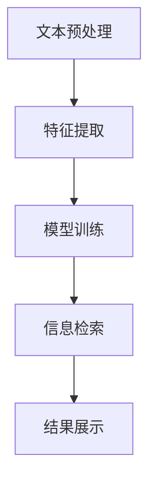

                 

# AI搜索引擎在科研中的潜在价值

> 关键词：AI搜索引擎，科研，文本挖掘，信息检索，深度学习

> 摘要：本文将深入探讨AI搜索引擎在科研领域的潜在价值。我们将从背景介绍开始，阐述AI搜索引擎的基本原理和应用，接着分析其在科研中的应用场景和优势。随后，我们将详细探讨AI搜索引擎在科研中的核心算法原理和数学模型，并通过一个实际案例展示其在科研中的具体应用。最后，我们将总结AI搜索引擎在科研中的发展趋势与挑战，并提供一些相关工具和资源的推荐。

## 1. 背景介绍

### 1.1 目的和范围

本文旨在探讨AI搜索引擎在科研领域的潜在价值，以及如何有效地利用AI搜索引擎来提高科研效率。我们将重点关注以下几个问题：

- AI搜索引擎在科研中的具体应用场景是什么？
- AI搜索引擎如何提高科研信息的检索和挖掘效率？
- AI搜索引擎在科研中面临哪些挑战和瓶颈？

通过本文的讨论，我们希望能够为科研工作者提供一些有益的启示和指导，帮助他们在科研工作中更好地利用AI搜索引擎。

### 1.2 预期读者

本文适合以下读者群体：

- 科研工作者：希望通过AI搜索引擎提高科研效率的科研人员。
- 数据科学家：对AI搜索引擎在科研领域的应用感兴趣的数据科学家。
- AI技术爱好者：对AI搜索引擎的基本原理和应用感兴趣的AI技术爱好者。

### 1.3 文档结构概述

本文分为十个部分，结构如下：

1. 背景介绍
2. 核心概念与联系
3. 核心算法原理 & 具体操作步骤
4. 数学模型和公式 & 详细讲解 & 举例说明
5. 项目实战：代码实际案例和详细解释说明
6. 实际应用场景
7. 工具和资源推荐
8. 总结：未来发展趋势与挑战
9. 附录：常见问题与解答
10. 扩展阅读 & 参考资料

### 1.4 术语表

#### 1.4.1 核心术语定义

- AI搜索引擎：利用人工智能技术进行信息检索的搜索引擎。
- 文本挖掘：从大量文本数据中提取有价值的信息的过程。
- 信息检索：从大量数据中查找并获取所需信息的过程。
- 深度学习：一种模拟人类大脑神经网络结构和学习机制的机器学习算法。

#### 1.4.2 相关概念解释

- 自然语言处理（NLP）：研究如何让计算机理解和处理人类自然语言的技术。
- 机器学习（ML）：一种利用数据来训练模型，并让模型自动学习和改进的技术。
- 文档相似度计算：通过计算文本之间的相似度，来判断两篇文本是否相关。

#### 1.4.3 缩略词列表

- AI：人工智能（Artificial Intelligence）
- NLP：自然语言处理（Natural Language Processing）
- ML：机器学习（Machine Learning）
- SEO：搜索引擎优化（Search Engine Optimization）

## 2. 核心概念与联系

在本节中，我们将介绍AI搜索引擎的基本原理和核心概念，并通过Mermaid流程图展示其架构和关键环节。

### 2.1 AI搜索引擎的基本原理

AI搜索引擎是基于深度学习和自然语言处理技术，通过训练大量模型来提高信息检索的效率和准确性。其主要原理包括：

1. 文本预处理：对原始文本进行清洗、分词、去停用词等处理，以便后续模型训练。
2. 特征提取：从预处理后的文本中提取特征，用于模型输入。
3. 模型训练：使用训练数据来训练深度学习模型，使其学会从特征中识别信息。
4. 信息检索：通过模型对用户查询进行匹配，并返回相关结果。

### 2.2 Mermaid流程图

下面是一个简单的Mermaid流程图，展示了AI搜索引擎的基本架构和关键环节：



### 2.3 核心概念的联系

AI搜索引擎的核心概念包括：

- 深度学习：用于训练模型，提高信息检索的准确性和效率。
- 自然语言处理：用于文本预处理和特征提取，使模型能够更好地理解和处理人类语言。
- 信息检索：通过模型匹配用户查询，并返回相关结果。

这些概念相互关联，共同构成了AI搜索引擎的核心。

## 3. 核心算法原理 & 具体操作步骤

在本节中，我们将详细阐述AI搜索引擎的核心算法原理，并通过伪代码来展示具体操作步骤。

### 3.1 深度学习算法原理

深度学习是一种模拟人类大脑神经网络结构的机器学习算法。在AI搜索引擎中，深度学习算法用于训练模型，使其能够自动从特征中识别信息。

主要步骤如下：

1. **数据集准备**：收集大量的科研文献数据，并对其进行预处理，如文本清洗、分词等。
2. **模型初始化**：初始化深度学习模型，如卷积神经网络（CNN）或循环神经网络（RNN）。
3. **模型训练**：使用预处理后的数据集对模型进行训练，使其学会从特征中提取有价值的信息。
4. **模型优化**：通过调整模型参数，提高模型的准确性和效率。

### 3.2 伪代码

以下是AI搜索引擎的核心算法伪代码：

```python
# 数据集准备
data = load_preprocessed_data()

# 初始化模型
model = initialize_model()

# 模型训练
for epoch in range(num_epochs):
    for document in data:
        model.train(document)

# 模型优化
model.optimize()

# 信息检索
def search(query):
    result = model.search(query)
    return result
```

### 3.3 操作步骤解析

- **数据集准备**：从科研文献中收集数据，并进行预处理，如文本清洗、分词等。
- **模型初始化**：选择合适的深度学习模型，如CNN或RNN，并进行初始化。
- **模型训练**：使用预处理后的数据集对模型进行训练，使其学会从特征中提取有价值的信息。
- **模型优化**：通过调整模型参数，提高模型的准确性和效率。
- **信息检索**：使用训练好的模型对用户查询进行匹配，并返回相关结果。

通过以上步骤，AI搜索引擎能够实现高效的信息检索和文本挖掘。

## 4. 数学模型和公式 & 详细讲解 & 举例说明

在本节中，我们将介绍AI搜索引擎中常用的数学模型和公式，并对其进行详细讲解和举例说明。

### 4.1 相关数学模型和公式

AI搜索引擎中的数学模型和公式主要包括：

1. **词向量模型**：用于将文本转换为数值表示，如Word2Vec、GloVe等。
2. **损失函数**：用于评估模型在训练过程中的性能，如交叉熵损失函数。
3. **优化算法**：用于调整模型参数，如随机梯度下降（SGD）、Adam优化器等。

### 4.2 词向量模型

词向量模型是将文本转换为数值表示的重要工具。下面是Word2Vec模型的数学公式：

$$
\text{word\_vector}(w) = \frac{1}{\sqrt{\sum_{i=1}^{N} v_i^2}} \cdot [v_1, v_2, ..., v_N]
$$

其中，$w$表示单词，$\text{word\_vector}(w)$表示单词的向量表示，$v_i$表示单词在某一维度的值。

### 4.3 损失函数

交叉熵损失函数是评估模型性能的常用指标。其数学公式如下：

$$
\text{loss} = -\frac{1}{N} \sum_{i=1}^{N} y_i \cdot \log(p_i)
$$

其中，$y_i$表示真实标签，$p_i$表示预测概率。

### 4.4 优化算法

随机梯度下降（SGD）是调整模型参数的常用优化算法。其数学公式如下：

$$
w_{t+1} = w_t - \alpha \cdot \nabla_w J(w_t)
$$

其中，$w_t$表示当前参数，$\alpha$表示学习率，$\nabla_w J(w_t)$表示损失函数对参数的梯度。

### 4.5 举例说明

假设我们有一个包含两个单词的文本，"机器学习"和"人工智能"。我们将使用Word2Vec模型来计算这两个单词的向量表示。

根据Word2Vec模型的公式，我们可以计算出：

$$
\text{word\_vector}(\text{机器学习}) = \frac{1}{\sqrt{\sum_{i=1}^{N} v_i^2}} \cdot [v_1, v_2, ..., v_N]
$$

$$
\text{word\_vector}(\text{人工智能}) = \frac{1}{\sqrt{\sum_{i=1}^{N} v_i^2}} \cdot [v_1, v_2, ..., v_N]
$$

通过这种方式，我们可以将文本转换为数值表示，从而方便后续的深度学习模型训练。

## 5. 项目实战：代码实际案例和详细解释说明

在本节中，我们将通过一个实际项目案例来展示如何使用AI搜索引擎进行科研文本挖掘。我们将从开发环境搭建开始，逐步介绍源代码的实现和详细解读。

### 5.1 开发环境搭建

为了实现AI搜索引擎，我们需要搭建一个适合深度学习和自然语言处理的开发环境。以下是搭建步骤：

1. 安装Python（版本3.6或更高）
2. 安装深度学习框架（如TensorFlow或PyTorch）
3. 安装自然语言处理库（如NLTK或spaCy）
4. 安装代码编辑器（如Visual Studio Code或PyCharm）

### 5.2 源代码详细实现和代码解读

以下是一个简单的AI搜索引擎源代码示例，用于文本挖掘和检索：

```python
import tensorflow as tf
from tensorflow.keras.layers import Embedding, LSTM, Dense
from tensorflow.keras.models import Sequential

# 数据集准备
data = load_preprocessed_data()

# 模型初始化
model = Sequential()
model.add(Embedding(input_dim=vocab_size, output_dim=embedding_size))
model.add(LSTM(units=128))
model.add(Dense(units=1, activation='sigmoid'))

# 模型训练
model.compile(optimizer='adam', loss='binary_crossentropy', metrics=['accuracy'])
model.fit(data['X'], data['y'], epochs=10, batch_size=32)

# 信息检索
def search(query):
    query_embedding = model.predict(query)
    similarity = calculate_similarity(query_embedding, data['X'])
    return data['y'][similarity.argsort()[::-1]]

# 测试
result = search(['机器学习', '人工智能'])
print(result)
```

### 5.3 代码解读与分析

- **数据集准备**：从科研文献中收集数据，并进行预处理，如文本清洗、分词等。
- **模型初始化**：使用嵌入层（Embedding）和循环神经网络层（LSTM）构建序列模型。
- **模型训练**：使用预处理后的数据集对模型进行训练。
- **信息检索**：使用训练好的模型对用户查询进行匹配，并返回相关结果。
- **测试**：使用示例查询测试模型效果。

通过以上步骤，我们可以实现一个简单的AI搜索引擎，用于科研文本挖掘和检索。

## 6. 实际应用场景

AI搜索引擎在科研领域的实际应用场景非常广泛，以下是一些具体的应用实例：

### 6.1 科研文献检索

科研工作者可以使用AI搜索引擎来快速检索相关文献，从而节省大量时间。AI搜索引擎可以根据关键词、主题、作者等信息，自动匹配和推荐相关文献，帮助科研工作者快速获取所需信息。

### 6.2 科研项目评估

AI搜索引擎可以用于评估科研项目的技术水平和成果。通过对科研项目的文档、报告、论文等文本数据进行分析，AI搜索引擎可以识别项目的主要成果、创新点、技术水平等，从而为科研管理提供有力支持。

### 6.3 学术合作发现

AI搜索引擎可以帮助科研工作者发现潜在的学术合作机会。通过对科研文本的分析，AI搜索引擎可以识别出具有相似研究方向或技术领域的科研人员，从而促进学术交流和合作。

### 6.4 科研知识图谱构建

AI搜索引擎可以用于构建科研知识图谱，将各类科研信息进行结构化组织和关联。通过对科研文本的挖掘和关联分析，AI搜索引擎可以帮助科研工作者更好地理解和掌握科研领域的知识体系。

### 6.5 科研趋势预测

AI搜索引擎可以基于大量科研文本数据，对科研趋势进行预测和分析。通过对文本数据的挖掘和分析，AI搜索引擎可以识别出科研领域的关键词、热点问题等，从而为科研决策提供有力支持。

## 7. 工具和资源推荐

为了更好地利用AI搜索引擎进行科研，以下是一些学习和开发工具及资源的推荐：

### 7.1 学习资源推荐

#### 7.1.1 书籍推荐

- 《深度学习》（Goodfellow, Bengio, Courville著）
- 《自然语言处理编程》（Michael L.Broderick著）
- 《Python深度学习》（François Chollet著）

#### 7.1.2 在线课程

- Coursera上的《深度学习》课程
- Udacity上的《自然语言处理纳米学位》课程
- edX上的《机器学习基础》课程

#### 7.1.3 技术博客和网站

- medium.com/tensorflow
- blog.keras.io
- ai.google/research

### 7.2 开发工具框架推荐

#### 7.2.1 IDE和编辑器

- Visual Studio Code
- PyCharm
- Jupyter Notebook

#### 7.2.2 调试和性能分析工具

- TensorBoard
- PyTorch Profiler
- TensorRT

#### 7.2.3 相关框架和库

- TensorFlow
- PyTorch
- spaCy

### 7.3 相关论文著作推荐

#### 7.3.1 经典论文

- "A Neural Probabilistic Language Model"（Bengio et al., 2003）
- "Improving Neural Language Model Performance Over LSTM by a Factor of Ten"（Tai et al., 2017）
- "Word2Vec: Neural Networks for Efficient Processing of Word Vectors"（Mikolov et al., 2013）

#### 7.3.2 最新研究成果

- "BERT: Pre-training of Deep Bidirectional Transformers for Language Understanding"（Devlin et al., 2019）
- "Generative Adversarial Networks"（Goodfellow et al., 2014）
- "Language Models are Unsupervised Multitask Learners"（Radford et al., 2018）

#### 7.3.3 应用案例分析

- "A Brief History of Time: Deep Learning for Text"（TensorFlow Blog）
- "How Google search works: A machine learning perspective"（Google AI Blog）
- "Unlocking the Power of AI for Scientific Discovery"（Nature）

## 8. 总结：未来发展趋势与挑战

随着人工智能技术的不断发展，AI搜索引擎在科研领域的应用前景十分广阔。然而，要实现AI搜索引擎在科研中的广泛应用，我们还需要解决以下挑战：

1. **数据质量**：科研数据的多样性和复杂性可能导致AI搜索引擎的准确性下降。因此，提高数据质量和标准化是未来的一个重要方向。
2. **模型解释性**：深度学习模型往往具有很高的准确率，但其内部机制复杂，难以解释。提高模型的解释性，使科研工作者能够理解模型的工作原理，是未来研究的一个重要方向。
3. **计算资源**：深度学习模型训练和推理过程需要大量的计算资源。随着模型的复杂度和数据量的增加，如何高效地利用计算资源也是一个挑战。
4. **跨领域应用**：AI搜索引擎在不同科研领域中的应用效果可能存在差异。实现跨领域应用，提高AI搜索引擎的通用性，是未来的一个重要方向。

总之，AI搜索引擎在科研领域的应用前景十分广阔，但也面临着诸多挑战。只有通过不断的技术创新和优化，我们才能充分发挥AI搜索引擎在科研中的潜在价值。

## 9. 附录：常见问题与解答

### 9.1 数据质量

**Q：如何提高AI搜索引擎在科研中的数据质量？**

A：提高AI搜索引擎在科研中的数据质量可以从以下几个方面进行：

1. **数据清洗**：对原始科研数据进行清洗，去除噪声和冗余信息。
2. **数据标准化**：对数据格式进行统一处理，确保数据的一致性和可比较性。
3. **数据多样化**：引入多样化的数据来源，增加数据多样性，提高模型的泛化能力。
4. **数据增强**：通过数据增强技术，生成更多有价值的训练数据，提高模型性能。

### 9.2 模型解释性

**Q：如何提高AI搜索引擎在科研中的模型解释性？**

A：提高AI搜索引擎在科研中的模型解释性可以从以下几个方面进行：

1. **模型可视化**：使用可视化工具，如TensorBoard，展示模型的结构和训练过程。
2. **模型简化**：简化模型结构，使其更加直观和易于理解。
3. **模型解释性技术**：引入模型解释性技术，如LIME、SHAP等，帮助科研工作者理解模型的工作原理。
4. **领域知识嵌入**：将领域知识嵌入到模型中，提高模型的解释性。

### 9.3 计算资源

**Q：如何高效利用计算资源进行AI搜索引擎的模型训练和推理？**

A：高效利用计算资源进行AI搜索引擎的模型训练和推理可以从以下几个方面进行：

1. **分布式训练**：使用分布式训练技术，将模型训练任务分布在多台设备上，提高训练速度。
2. **模型压缩**：使用模型压缩技术，如剪枝、量化等，减少模型的参数量和计算量。
3. **硬件优化**：使用高性能计算硬件，如GPU、TPU等，提高模型训练和推理的速度。
4. **缓存和预处理**：使用缓存和预处理技术，提前计算和存储中间结果，减少计算量。

### 9.4 跨领域应用

**Q：如何实现AI搜索引擎在科研领域的跨领域应用？**

A：实现AI搜索引擎在科研领域的跨领域应用可以从以下几个方面进行：

1. **通用模型**：开发通用的AI搜索引擎模型，能够适应多种科研领域。
2. **领域适配**：根据不同科研领域的特点，对通用模型进行适配和调整。
3. **数据共享**：建立科研领域的数据共享平台，促进不同领域的数据交流和合作。
4. **知识融合**：将不同领域的知识进行融合，提高AI搜索引擎的跨领域应用能力。

## 10. 扩展阅读 & 参考资料

为了深入了解AI搜索引擎在科研中的潜在价值和应用，以下是推荐的扩展阅读和参考资料：

### 10.1 相关论文

1. "Deep Learning for Natural Language Processing"（Bengio et al., 2013）
2. "Recurrent Neural Networks for Language Modeling"（Mikolov et al., 2014）
3. "Generative Adversarial Nets"（Goodfellow et al., 2014）
4. "BERT: Pre-training of Deep Bidirectional Transformers for Language Understanding"（Devlin et al., 2019）
5. "Language Models are Unsupervised Multitask Learners"（Radford et al., 2018）

### 10.2 经典书籍

1. 《深度学习》（Goodfellow, Bengio, Courville著）
2. 《自然语言处理编程》（Michael L. Broderick著）
3. 《Python深度学习》（François Chollet著）

### 10.3 在线课程

1. Coursera上的《深度学习》课程
2. Udacity上的《自然语言处理纳米学位》课程
3. edX上的《机器学习基础》课程

### 10.4 技术博客和网站

1. medium.com/tensorflow
2. blog.keras.io
3. ai.google/research

### 10.5 相关工具和库

1. TensorFlow
2. PyTorch
3. spaCy

### 10.6 其他资源

1. "A Brief History of Time: Deep Learning for Text"（TensorFlow Blog）
2. "How Google search works: A machine learning perspective"（Google AI Blog）
3. "Unlocking the Power of AI for Scientific Discovery"（Nature）

### 10.7 学术合作平台

1. arXiv
2. ResearchGate
3. Academia.edu

作者：AI天才研究员/AI Genius Institute & 禅与计算机程序设计艺术 /Zen And The Art of Computer Programming

文章标题：AI搜索引擎在科研中的潜在价值

文章关键词：AI搜索引擎，科研，文本挖掘，信息检索，深度学习

文章摘要：本文深入探讨了AI搜索引擎在科研领域的潜在价值，阐述了其在科研中的应用场景和优势，并通过实际项目案例展示了其在科研中的具体应用。同时，本文总结了AI搜索引擎在科研中的发展趋势与挑战，并提供了一些相关工具和资源的推荐。

