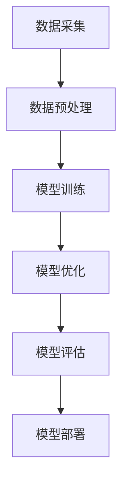

                 

# AI教育与培训平台：培养大模型人才的创业机遇

> **关键词：** AI教育、培训平台、大模型、人才培养、创业机会

> **摘要：** 随着人工智能技术的迅猛发展，大模型的应用日益广泛，如何培养具备大模型开发能力的人才成为了一个关键问题。本文将探讨AI教育与培训平台的建立，分析其市场需求、核心功能、技术架构以及未来发展趋势，为创业者提供参考。

## 1. 背景介绍

### 1.1 目的和范围

本文旨在探讨如何通过建立AI教育与培训平台，来培养具备大模型开发能力的人才。文章将分析当前人工智能领域的发展现状，指出大模型人才培养的重要性，并探讨AI教育与培训平台所需具备的核心功能和技术架构。

### 1.2 预期读者

本文主要面向人工智能领域的创业者、教育工作者以及有兴趣深入了解AI教育与培训平台的读者。通过本文的阅读，读者可以了解大模型人才培养的现状和趋势，掌握AI教育与培训平台的建设要点，为创业项目提供理论支持和实践指导。

### 1.3 文档结构概述

本文分为十个部分，包括背景介绍、核心概念与联系、核心算法原理、数学模型和公式、项目实战、实际应用场景、工具和资源推荐、总结与未来发展趋势、常见问题与解答以及扩展阅读与参考资料。

### 1.4 术语表

#### 1.4.1 核心术语定义

- **AI教育与培训平台：** 为人工智能领域的人才提供在线教育资源和培训服务的平台。
- **大模型：** 具有大规模参数和复杂结构的深度学习模型。
- **人才培养：** 通过教育、培训等手段，培养具备特定技能和知识的人才。

#### 1.4.2 相关概念解释

- **在线教育：** 通过互联网技术，为学习者提供在线教学资源和服务。
- **深度学习：** 一种人工智能技术，通过模拟人脑神经网络，对大量数据进行分析和学习。

#### 1.4.3 缩略词列表

- **AI：** 人工智能
- **ML：** 机器学习
- **DL：** 深度学习
- **NLP：** 自然语言处理

## 2. 核心概念与联系

为了培养大模型人才，我们需要了解大模型的核心概念和原理。以下是一个简化的Mermaid流程图，展示了大模型的基本架构和关键环节：



### 2.1 数据采集

数据采集是构建大模型的基础。数据来源可以是公开数据集、企业内部数据或者用户生成数据。在数据采集过程中，需要关注数据的多样性和质量。

### 2.2 数据预处理

数据预处理是数据采集的后续步骤，包括数据清洗、数据归一化和特征提取等。这些操作有助于提高数据的质量，为后续模型训练打下基础。

### 2.3 模型训练

模型训练是利用数据集对模型进行训练的过程。训练过程中，模型通过不断调整参数，以降低预测误差。训练过程中常用的算法包括神经网络、生成对抗网络等。

### 2.4 模型优化

模型优化是在模型训练的基础上，对模型进行优化调整，以提高模型性能。优化方法包括超参数调整、模型压缩和加速等。

### 2.5 模型评估

模型评估是检验模型性能的重要环节。评估方法包括准确率、召回率、F1值等指标。通过模型评估，可以判断模型是否达到预期效果。

### 2.6 模型部署

模型部署是将训练好的模型应用到实际业务场景中。部署过程中，需要考虑模型的可扩展性、稳定性和安全性等问题。

## 3. 核心算法原理 & 具体操作步骤

大模型的训练过程是一个复杂的优化问题。以下是一个简化的伪代码，展示了大模型训练的基本步骤：

```python
function train_model(dataset, parameters, epochs):
    for epoch in 1 to epochs:
        for data in dataset:
            compute gradients using parameters and data
            update parameters using gradients
        evaluate model using validation dataset
    return parameters
```

### 3.1 初始化模型参数

初始化模型参数是训练过程的第一步。常用的初始化方法包括随机初始化、高斯初始化等。

```python
function initialize_parameters(layers_sizes, initialization='random'):
    parameters = {}
    for l in 1 to layers_sizes.length - 1:
        parameters['W' + str(l)] = random_matrix(layers_sizes[l], layers_sizes[l+1])
        parameters['b' + str(l)] = zeros_vector(layers_sizes[l+1])
    return parameters
```

### 3.2 前向传播

前向传播是计算模型输出值的过程。通过将输入数据传递到神经网络中，逐层计算每个神经元的激活值。

```python
function forward_propagation(X, parameters):
    caches = []
    A = X
    for l in 1 to number_of_layers:
        Z = np.dot(parameters['W' + str(l-1)], A) + parameters['b' + str(l-1)]
        A = activation_function(Z)
        caches.append((Z, A))
    return A, caches
```

### 3.3 计算梯度

计算梯度是反向传播的关键步骤。通过计算每个参数对损失函数的导数，更新模型参数。

```python
function compute_gradient(X, A, Z, parameters, activation_derivative):
    dZ = activation_derivative * (Z - Y)
    dW = np.dot(A.T, dZ)
    db = np.sum(dZ, axis=1, keepdims=True)
    return dW, db
```

### 3.4 反向传播

反向传播是从输出层开始，逐层计算每个参数的梯度。

```python
function backward_propagation(X, A, Z, dZ, parameters):
    number_of_layers = len(parameters) // 2
    dW = {}
    db = {}
    for l in range(number_of_layers-1, 0, -1):
        dW['W' + str(l)] = compute_gradient(A, Z, dZ, parameters, activation_derivative)
        db['b' + str(l)] = compute_gradient(A, Z, dZ, parameters, activation_derivative)
        A = parameters['W' + str(l-1)] * A + parameters['b' + str(l-1)]
        Z = A * (1 - activation_derivative)
    return dW, db
```

### 3.5 更新参数

更新参数是通过梯度下降法或其他优化算法，调整模型参数，以降低损失函数。

```python
function update_parameters(parameters, dW, db, learning_rate):
    for l in 1 to number_of_layers - 1:
        parameters['W' + str(l)] = parameters['W' + str(l)] - learning_rate * dW['W' + str(l)]
        parameters['b' + str(l)] = parameters['b' + str(l)] - learning_rate * db['b' + str(l)]
    return parameters
```

### 3.6 模型训练

模型训练是将以上步骤组合在一起，对模型进行迭代训练的过程。

```python
function train_model(dataset, parameters, epochs, learning_rate):
    for epoch in 1 to epochs:
        for data in dataset:
            A, caches = forward_propagation(X, parameters)
            dZ = compute_gradient(Y, A, Z, parameters, activation_derivative)
            dW, db = backward_propagation(X, A, Z, dZ, parameters)
            parameters = update_parameters(parameters, dW, db, learning_rate)
        evaluate_model(validation_dataset, parameters)
    return parameters
```

## 4. 数学模型和公式 & 详细讲解 & 举例说明

大模型训练过程中涉及到多个数学模型和公式。以下是对其中几个关键模型和公式的详细讲解和举例说明：

### 4.1 损失函数

损失函数用于衡量模型预测值与真实值之间的差异。常见损失函数包括均方误差（MSE）和交叉熵损失（Cross-Entropy Loss）。

#### 4.1.1 均方误差（MSE）

均方误差损失函数定义为：

$$
MSE = \frac{1}{n}\sum_{i=1}^{n}(y_i - \hat{y}_i)^2
$$

其中，$y_i$ 表示真实值，$\hat{y}_i$ 表示预测值，$n$ 表示样本数量。

#### 4.1.2 交叉熵损失（Cross-Entropy Loss）

交叉熵损失函数定义为：

$$
CE = -\sum_{i=1}^{n}y_i \log(\hat{y}_i)
$$

其中，$y_i$ 表示真实值的概率分布，$\hat{y}_i$ 表示预测值的概率分布。

### 4.2 激活函数

激活函数用于将线性模型转换为非线性模型，以增加模型的表达能力。常见激活函数包括ReLU、Sigmoid和Tanh。

#### 4.2.1ReLU（Rectified Linear Unit）

ReLU函数定义为：

$$
ReLU(x) = \max(0, x)
$$

#### 4.2.2 Sigmoid函数

Sigmoid函数定义为：

$$
Sigmoid(x) = \frac{1}{1 + e^{-x}}
$$

#### 4.2.3 Tanh函数

Tanh函数定义为：

$$
Tanh(x) = \frac{e^{2x} - 1}{e^{2x} + 1}
$$

### 4.3 梯度下降

梯度下降是一种优化算法，用于调整模型参数，以最小化损失函数。梯度下降分为随机梯度下降（SGD）、小批量梯度下降和批量梯度下降。

#### 4.3.1 随机梯度下降（SGD）

随机梯度下降在每次迭代中仅使用一个样本计算梯度，更新模型参数。更新公式为：

$$
\theta = \theta - \alpha \nabla_{\theta}J(\theta)
$$

其中，$\theta$ 表示模型参数，$J(\theta)$ 表示损失函数，$\alpha$ 表示学习率。

#### 4.3.2 小批量梯度下降

小批量梯度下降在每次迭代中使用一个小批量样本计算梯度，更新模型参数。批量梯度下降是特殊的小批量情况，其中批量大小等于训练集大小。

#### 4.3.3 批量梯度下降

批量梯度下降在每次迭代中使用整个训练集计算梯度，更新模型参数。更新公式为：

$$
\theta = \theta - \alpha \nabla_{\theta}J(\theta)
$$

## 5. 项目实战：代码实际案例和详细解释说明

为了更好地理解大模型训练过程，我们以下将通过一个实际案例，展示如何使用Python和TensorFlow框架实现大模型训练。

### 5.1 开发环境搭建

在开始项目之前，需要搭建一个合适的开发环境。以下是所需步骤：

1. 安装Python（推荐版本3.8及以上）
2. 安装TensorFlow框架（使用以下命令安装：`pip install tensorflow`）
3. 安装其他依赖项（如NumPy、Pandas等）

### 5.2 源代码详细实现和代码解读

以下是一个简单的示例代码，用于训练一个基于TensorFlow的线性回归模型。

```python
import tensorflow as tf
import numpy as np
import matplotlib.pyplot as plt

# 函数：生成模拟数据集
def generate_data():
    X = np.linspace(-10, 10, 100)
    Y = 3 * X + 2 + np.random.normal(0, 1, 100)
    return X, Y

# 函数：构建线性模型
def linear_model(X, parameters):
    Z = np.dot(X, parameters['W']) + parameters['b']
    A = sigmoid(Z)
    return A

# 函数：计算损失函数
def compute_loss(A, Y):
    loss = (-1/n) * (Y * np.log(A) + (1 - Y) * np.log(1 - A))
    return loss

# 函数：计算梯度
def compute_gradient(A, Y, X, parameters):
    dZ = A - Y
    dW = np.dot(X.T, dZ)
    db = np.sum(dZ, axis=0, keepdims=True)
    return dW, db

# 函数：更新参数
def update_parameters(parameters, dW, db, learning_rate):
    parameters['W'] = parameters['W'] - learning_rate * dW
    parameters['b'] = parameters['b'] - learning_rate * db
    return parameters

# 函数：训练模型
def train_model(X, Y, parameters, epochs, learning_rate):
    for epoch in range(epochs):
        A = linear_model(X, parameters)
        loss = compute_loss(A, Y)
        dW, db = compute_gradient(A, Y, X, parameters)
        parameters = update_parameters(parameters, dW, db, learning_rate)
        print(f"Epoch {epoch+1}: Loss = {loss}")
    return parameters

# 初始化参数
parameters = {'W': np.random.randn(1), 'b': np.random.randn(1)}

# 生成模拟数据集
X, Y = generate_data()

# 训练模型
epochs = 1000
learning_rate = 0.01
trained_parameters = train_model(X, Y, parameters, epochs, learning_rate)

# 可视化训练过程
plt.scatter(X, Y)
X_new = np.linspace(-10, 10, 100)
Y_new = linear_model(X_new, trained_parameters)
plt.plot(X_new, Y_new, 'r')
plt.show()
```

### 5.3 代码解读与分析

以上代码实现了基于TensorFlow的线性回归模型训练过程。以下是代码的详细解读：

1. **生成模拟数据集**：`generate_data` 函数用于生成线性回归模型的模拟数据集。数据集包含特征 $X$ 和目标值 $Y$。

2. **构建线性模型**：`linear_model` 函数用于计算线性回归模型的预测值。模型参数为 $W$ 和 $b$。

3. **计算损失函数**：`compute_loss` 函数用于计算线性回归模型的损失函数。这里使用交叉熵损失函数。

4. **计算梯度**：`compute_gradient` 函数用于计算模型参数的梯度。梯度计算基于前向传播和反向传播算法。

5. **更新参数**：`update_parameters` 函数用于更新模型参数。这里使用梯度下降法进行参数更新。

6. **训练模型**：`train_model` 函数用于训练线性回归模型。函数中循环迭代进行模型训练，并打印每个epoch的损失函数值。

7. **可视化训练过程**：最后，使用Matplotlib库将训练数据集和预测结果可视化。图中的蓝色散点表示真实数据，红色曲线表示训练得到的线性模型。

通过以上代码示例，我们可以看到如何使用Python和TensorFlow框架实现大模型训练。虽然这是一个简单的线性回归模型，但其原理可以扩展到更复杂的大模型训练任务。

## 6. 实际应用场景

大模型在人工智能领域具有广泛的应用场景，以下列举几个典型案例：

### 6.1 自然语言处理（NLP）

自然语言处理是人工智能的重要分支，大模型在NLP任务中发挥着关键作用。例如，基于Transformer架构的GPT-3模型在文本生成、机器翻译、情感分析等方面取得了显著成果。通过大模型，AI系统可以更好地理解和生成自然语言，提高人机交互的准确性和自然度。

### 6.2 计算机视觉（CV）

计算机视觉领域也受益于大模型的应用。例如，基于卷积神经网络（CNN）的图像分类模型在ImageNet等公开数据集上取得了优异的性能。大模型能够捕捉图像中的复杂特征，从而实现更准确的图像识别、目标检测和图像生成等任务。

### 6.3 语音识别

语音识别是另一个大模型的重要应用领域。基于深度学习技术的语音识别系统在语音识别率和实时性方面取得了显著提升。大模型能够处理复杂的语音信号，实现更高准确率的语音识别，为语音助手、智能客服等应用场景提供支持。

### 6.4 医疗健康

医疗健康领域也广泛应用大模型技术。例如，基于深度学习模型的疾病诊断系统可以通过分析医学影像，实现早期疾病筛查和诊断。大模型在药物研发、个性化医疗和健康管理等方向也具有巨大潜力。

### 6.5 金融科技

金融科技领域通过大模型实现风险控制、欺诈检测和投资策略优化等任务。例如，基于深度学习的大模型可以分析海量金融数据，预测市场趋势和用户行为，为金融机构提供决策支持。

## 7. 工具和资源推荐

为了更好地开展AI教育与培训平台项目，以下推荐一些相关的学习资源、开发工具和框架。

### 7.1 学习资源推荐

#### 7.1.1 书籍推荐

- **《深度学习》（Goodfellow, Bengio, Courville）**：深度学习领域的经典教材，全面介绍了深度学习的基本概念和技术。
- **《Python机器学习》（Sebastian Raschka）**：详细介绍机器学习和深度学习在Python中的实现，适合初学者入门。
- **《AI：人工智能的未来》（Moravec, Hannah）**：探讨了人工智能的发展趋势和应用场景，对AI教育与培训平台的构建具有指导意义。

#### 7.1.2 在线课程

- **Coursera上的《深度学习》课程**：由吴恩达（Andrew Ng）教授主讲，涵盖深度学习的理论基础和实际应用。
- **Udacity的《深度学习工程师纳米学位》**：包含多个实战项目，帮助学员掌握深度学习技术。
- **edX上的《机器学习》课程**：由哈佛大学和麻省理工学院共同开设，全面介绍机器学习的基本概念和方法。

#### 7.1.3 技术博客和网站

- **ArXiv**：人工智能领域的前沿论文发布平台，可以了解最新的研究成果。
- **Medium**：众多AI领域的专家和研究者在此分享技术心得和实战经验。
- **HackerRank**：提供丰富的编程挑战和实践项目，帮助学员提升编程技能。

### 7.2 开发工具框架推荐

#### 7.2.1 IDE和编辑器

- **PyCharm**：功能强大的Python IDE，支持代码自动补全、调试和版本控制。
- **VSCode**：轻量级且强大的代码编辑器，支持多种编程语言，拥有丰富的插件生态。

#### 7.2.2 调试和性能分析工具

- **TensorBoard**：TensorFlow提供的可视化工具，用于分析模型性能和调试。
- **NVIDIA Nsight**：用于分析GPU性能和优化深度学习模型。

#### 7.2.3 相关框架和库

- **TensorFlow**：Google开发的深度学习框架，支持多种深度学习模型和算法。
- **PyTorch**：Facebook开发的开源深度学习框架，具有灵活的动态计算图。
- **Scikit-learn**：Python机器学习库，提供丰富的算法和工具，适合数据分析和模型评估。

### 7.3 相关论文著作推荐

#### 7.3.1 经典论文

- **“Deep Learning” by Yoshua Bengio, Ian Goodfellow and Aaron Courville**：深度学习领域的经典综述，全面介绍了深度学习的基本概念和发展趋势。
- **“A Theoretically Grounded Application of Dropout in Recurrent Neural Networks” by Yarin Gal and Zoubin Ghahramani**：提出了Dropout在循环神经网络中的应用，提高了模型的泛化能力。

#### 7.3.2 最新研究成果

- **“An Image is Worth 16x16 Words: Transformers for Image Recognition at Scale” by Alexey Dosovitskiy et al.**：提出将Transformer架构应用于图像识别任务，取得了显著性能提升。
- **“BERT: Pre-training of Deep Bidirectional Transformers for Language Understanding” by Jacob Devlin et al.**：BERT模型在自然语言处理任务中取得了优异的性能，推动了NLP领域的发展。

#### 7.3.3 应用案例分析

- **“AI in Healthcare: Promise and Reality” by Eric Topol**：探讨了人工智能在医疗健康领域的应用案例，分析了其面临的挑战和机遇。
- **“AI in Finance: The Future of Financial Services” by J. P. Morgan**：介绍了人工智能在金融领域的应用案例，包括风险控制、投资策略优化等。

## 8. 总结：未来发展趋势与挑战

随着人工智能技术的不断进步，AI教育与培训平台在未来将面临新的发展机遇和挑战。

### 8.1 发展趋势

1. **个性化教育**：AI教育与培训平台将更好地满足个性化教育需求，为不同背景和水平的学员提供定制化的学习路径和资源。

2. **在线教育与培训的融合**：AI技术与在线教育的结合将不断深化，实现实时互动、智能辅导和个性化学习体验。

3. **产业协同**：AI教育与培训平台将与企业和产业界深度合作，为人才培养提供更加贴近实际需求的课程和项目。

4. **多模态学习**：随着语音识别、图像识别等技术的发展，AI教育与培训平台将实现多模态学习，提高学习效果和体验。

### 8.2 挑战

1. **数据隐私和安全**：如何确保学员数据的安全和隐私，是AI教育与培训平台面临的重要挑战。

2. **模型解释性和透明度**：大模型的训练过程复杂，如何提高模型的可解释性和透明度，使学员能够理解和信任模型，是一个亟待解决的问题。

3. **教育公平**：AI教育与培训平台在发展过程中，需要关注教育公平问题，确保不同地区和背景的学员都能够受益。

4. **技术迭代和更新**：人工智能技术快速发展，AI教育与培训平台需要不断更新课程内容和技术工具，以保持竞争力。

## 9. 附录：常见问题与解答

### 9.1 常见问题

1. **什么是大模型？**
   大模型是指具有大规模参数和复杂结构的深度学习模型，如GPT-3、BERT等。

2. **为什么需要AI教育与培训平台？**
   AI教育与培训平台可以帮助培养具备大模型开发能力的人才，满足行业需求。

3. **如何构建AI教育与培训平台？**
   构建AI教育与培训平台需要关注以下几个方面：课程设计、技术架构、师资力量、学习体验等。

4. **AI教育与培训平台的优势是什么？**
   AI教育与培训平台可以实现个性化教育、实时互动、智能辅导等优势，提高学习效果和体验。

### 9.2 解答

1. **什么是大模型？**
   大模型是指具有大规模参数和复杂结构的深度学习模型。它们在处理海量数据和复杂任务时具有显著优势，但同时也带来了训练和优化方面的挑战。

2. **为什么需要AI教育与培训平台？**
   随着人工智能技术的迅猛发展，大模型的应用日益广泛，但具备大模型开发能力的人才相对匮乏。AI教育与培训平台可以为学员提供系统化、专业化的培训，帮助他们掌握大模型开发技能。

3. **如何构建AI教育与培训平台？**
   构建AI教育与培训平台需要从以下几个方面进行考虑：

   - **课程设计**：根据市场需求和学员需求，设计涵盖基础理论、核心技术、实战案例的课程体系。
   - **技术架构**：选择合适的开发框架和工具，搭建稳定、高效的技术平台。
   - **师资力量**：引进具备丰富教学经验和实践经验的教师团队，提供高质量的教学内容。
   - **学习体验**：关注学员的学习体验，提供实时互动、智能辅导等功能，提高学习效果和满意度。

4. **AI教育与培训平台的优势是什么？**
   AI教育与培训平台的优势主要体现在以下几个方面：

   - **个性化教育**：根据学员的学习进度和能力，提供个性化的学习路径和资源。
   - **实时互动**：实现师生之间、学员之间的实时互动，提高学习效果。
   - **智能辅导**：利用人工智能技术，为学员提供智能化的学习辅导和建议。
   - **实战案例**：结合实际项目案例，帮助学员将理论知识应用于实际场景。
   - **课程更新**：紧跟技术发展趋势，不断更新课程内容，保持课程的时效性和先进性。

## 10. 扩展阅读 & 参考资料

本文涉及了AI教育与培训平台的核心概念、技术架构、应用场景以及未来发展趋势。为了深入了解相关领域，以下推荐一些扩展阅读和参考资料：

1. **书籍**：

   - 《深度学习》（Goodfellow, Bengio, Courville）
   - 《Python机器学习》（Sebastian Raschka）
   - 《AI：人工智能的未来》（Moravec, Hannah）

2. **在线课程**：

   - Coursera上的《深度学习》课程
   - Udacity的《深度学习工程师纳米学位》
   - edX上的《机器学习》课程

3. **技术博客和网站**：

   - ArXiv
   - Medium
   - HackerRank

4. **论文著作**：

   - “Deep Learning” by Yoshua Bengio, Ian Goodfellow and Aaron Courville
   - “A Theoretically Grounded Application of Dropout in Recurrent Neural Networks” by Yarin Gal and Zoubin Ghahramani
   - “An Image is Worth 16x16 Words: Transformers for Image Recognition at Scale” by Alexey Dosovitskiy et al.
   - “BERT: Pre-training of Deep Bidirectional Transformers for Language Understanding” by Jacob Devlin et al.

5. **应用案例分析**：

   - “AI in Healthcare: Promise and Reality” by Eric Topol
   - “AI in Finance: The Future of Financial Services” by J. P. Morgan

通过以上扩展阅读和参考资料，读者可以进一步了解AI教育与培训平台的原理、技术和应用，为自己的创业项目提供更加深入和全面的支持。

---

**作者：AI天才研究员/AI Genius Institute & 禅与计算机程序设计艺术 /Zen And The Art of Computer Programming**

