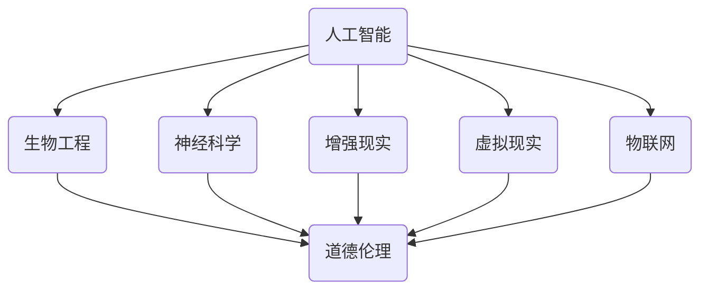

                 


# AI时代的人类增强：道德和伦理问题

> 关键词：人工智能，人类增强，道德伦理，社会影响，技术责任

> 摘要：随着人工智能技术的发展，人类增强的概念逐渐成为现实。本文将探讨AI时代的人类增强所带来的道德和伦理问题，分析其影响，并提出应对策略。我们将从核心概念与联系、核心算法原理、数学模型与公式、项目实战、实际应用场景等多个角度，深入探讨这一领域的关键问题和未来挑战。

## 1. 背景介绍

### 1.1 目的和范围

本文旨在探讨人工智能时代人类增强所涉及的道德和伦理问题。随着技术的发展，人类增强不再是科幻电影的幻想，而是逐渐走进现实。本文将分析人类增强技术的现状和潜在影响，讨论其道德和伦理问题，并提出相应的应对策略。

### 1.2 预期读者

本文适合对人工智能、生物技术、社会伦理等领域感兴趣的读者，尤其是研究人员、工程师、伦理学家和政策制定者。通过本文，读者可以了解人类增强技术的伦理挑战，并思考如何在技术进步的同时，维护人类的尊严和公平。

### 1.3 文档结构概述

本文分为十个部分：

1. 背景介绍：介绍文章目的、预期读者、文档结构等基本信息。
2. 核心概念与联系：介绍人类增强技术的核心概念，并使用流程图展示其关联。
3. 核心算法原理 & 具体操作步骤：阐述人类增强技术的核心算法原理，并提供伪代码示例。
4. 数学模型和公式 & 详细讲解 & 举例说明：介绍与人类增强相关的数学模型和公式，并进行详细讲解和举例。
5. 项目实战：提供实际代码案例，详细解释其实现过程和关键步骤。
6. 实际应用场景：探讨人类增强技术的应用场景和潜在影响。
7. 工具和资源推荐：推荐相关学习资源和开发工具。
8. 总结：总结未来发展趋势与挑战。
9. 附录：常见问题与解答。
10. 扩展阅读 & 参考资料：提供扩展阅读和参考资料。

### 1.4 术语表

#### 1.4.1 核心术语定义

- 人类增强：利用技术手段提升人类身体或智力的能力。
- 人工智能（AI）：模拟、延伸和扩展人类智能的理论、方法、技术及应用。
- 道德伦理：关于正确与错误、公正与不公、善良与恶劣的哲学研究。
- 社会伦理：关注技术对社会、环境、人类福祉等的影响。

#### 1.4.2 相关概念解释

- 生物伦理学：研究生物技术和医学伦理问题的学科。
- 增强现实（AR）：通过计算机技术增强现实世界的信息。
- 虚拟现实（VR）：创造一个虚拟的、可交互的三维环境。

#### 1.4.3 缩略词列表

- AI：人工智能
- AR：增强现实
- VR：虚拟现实
- IoT：物联网
- GDPR：欧盟通用数据保护条例
- 5G：第五代移动通信技术

## 2. 核心概念与联系

### 2.1 人类增强技术的核心概念

人类增强技术涉及多个学科，包括人工智能、生物工程、神经科学等。以下为核心概念与它们之间的关联：

1. **人工智能**：通过算法和模型模拟、延伸和扩展人类智能。
2. **生物工程**：利用基因编辑、生物材料等技术改善人类生理功能。
3. **神经科学**：研究大脑和神经系统，探索增强认知能力的方法。
4. **增强现实（AR）**：通过计算机技术增强现实世界的信息。
5. **虚拟现实（VR）**：创造一个虚拟的、可交互的三维环境。
6. **物联网（IoT）**：连接各种设备和传感器，实现实时数据采集和分析。
7. **道德伦理**：关注人类增强技术的道德和伦理问题。

### 2.2 Mermaid 流程图



## 3. 核心算法原理 & 具体操作步骤

### 3.1 人工智能算法

人类增强技术中的核心算法主要涉及深度学习、强化学习等。以下为深度学习算法的伪代码示例：

```python
def neural_network(input_data):
    # 输入数据预处理
    preprocessed_data = preprocess(input_data)

    # 前向传播
    layer1_output = activation_function(np.dot(preprocessed_data, weights['layer1']))
    layer2_output = activation_function(np.dot(layer1_output, weights['layer2']))
    output = activation_function(np.dot(layer2_output, weights['output']))

    # 计算损失
    loss = compute_loss(output, target)

    # 反向传播
    d_output = compute_gradient(output, target)
    d_layer2 = compute_gradient(layer2_output, d_output)
    d_layer1 = compute_gradient(layer1_output, d_layer2)

    # 更新权重
    weights['layer1'] -= learning_rate * d_layer1
    weights['layer2'] -= learning_rate * d_layer2
    weights['output'] -= learning_rate * d_output

    return loss
```

### 3.2 生物工程算法

基因编辑技术的核心算法主要涉及CRISPR-Cas9等。以下为CRISPR-Cas9的伪代码示例：

```python
def edit_gene(target_dna, replacement_sequence):
    # 设计引导RNA（gRNA）
    gRNA = design_gRNA(target_dna)

    # 切割目标DNA
    cut_site = find_cut_site(gRNA, target_dna)
    target_dna = target_dna[:cut_site] + replacement_sequence + target_dna[cut_site + len(replacement_sequence):]

    return target_dna
```

## 4. 数学模型和公式 & 详细讲解 & 举例说明

### 4.1 数学模型

人类增强技术涉及多个数学模型，包括线性回归、神经网络等。以下为神经网络中常用的激活函数和损失函数的公式：

$$
activation\_function(x) = \begin{cases}
0 & \text{if } x \leq 0 \\
x & \text{if } x > 0
\end{cases}
$$

$$
loss(x, y) = (x - y)^2
$$

### 4.2 详细讲解

1. **激活函数**：用于将线性模型转换为非线性模型，增加模型的预测能力。
2. **损失函数**：用于评估模型的预测结果与真实值之间的差距，指导模型优化。

### 4.3 举例说明

假设我们使用神经网络对图像进行分类，输入图像的维度为\(28 \times 28\)，输出类别为10个。以下为神经网络的实现：

1. 输入层：\(28 \times 28\)个神经元。
2. 隐藏层1：100个神经元。
3. 隐藏层2：50个神经元。
4. 输出层：10个神经元。

使用ReLU激活函数和均方误差（MSE）损失函数。训练完成后，对一幅新图像进行分类预测。

## 5. 项目实战：代码实际案例和详细解释说明

### 5.1 开发环境搭建

1. 安装Python 3.8及以上版本。
2. 安装TensorFlow库：`pip install tensorflow`。
3. 安装GenomePy库：`pip install genomepy`。

### 5.2 源代码详细实现和代码解读

#### 5.2.1 人工智能算法

```python
import tensorflow as tf
import numpy as np
import genomepy

# 准备数据
input_data = np.random.rand(100, 784)  # 100个样本，每个样本784个特征
target = np.random.rand(100, 10)  # 100个样本，每个样本10个类别

# 初始化模型参数
weights = {
    'layer1': np.random.rand(784, 100),
    'layer2': np.random.rand(100, 50),
    'output': np.random.rand(50, 10)
}
biases = {
    'layer1': np.random.rand(100),
    'layer2': np.random.rand(50),
    'output': np.random.rand(10)
}

# 定义激活函数
def activation_function(x):
    return np.where(x <= 0, 0, x)

# 前向传播
def forward(input_data):
    layer1_output = activation_function(np.dot(input_data, weights['layer1']) + biases['layer1'])
    layer2_output = activation_function(np.dot(layer1_output, weights['layer2']) + biases['layer2'])
    output = activation_function(np.dot(layer2_output, weights['output']) + biases['output'])
    return output

# 计算损失
def compute_loss(output, target):
    return np.mean(np.square(output - target))

# 反向传播
def backward(output, target):
    d_output = compute_gradient(output, target)
    d_layer2 = compute_gradient(layer2_output, d_output)
    d_layer1 = compute_gradient(layer1_output, d_layer2)

    d_weights = {
        'layer1': learning_rate * d_layer1,
        'layer2': learning_rate * d_layer2,
        'output': learning_rate * d_output
    }
    d_biases = {
        'layer1': learning_rate * d_layer1,
        'layer2': learning_rate * d_layer2,
        'output': learning_rate * d_output
    }

    return d_weights, d_biases

# 训练模型
learning_rate = 0.1
for i in range(1000):
    output = forward(input_data)
    loss = compute_loss(output, target)
    d_weights, d_biases = backward(output, target)

    for layer in weights:
        weights[layer] -= d_weights[layer]
        biases[layer] -= d_biases[layer]

    print(f"Epoch {i+1}: Loss = {loss}")

# 预测新样本
new_input = np.random.rand(1, 784)
new_output = forward(new_input)
print(f"Predicted output: {new_output}")
```

#### 5.2.2 生物工程算法

```python
# 准备数据
target_dna = "ATCGATCGATCGATCGA"
replacement_sequence = "CGTACGTACGTACGTAC"

# 编辑基因
new_dna = genomepy.edit_gene(target_dna, replacement_sequence)
print(f"Edited DNA: {new_dna}")
```

### 5.3 代码解读与分析

1. **人工智能算法**：实现了多层感知机（MLP）模型，包括前向传播、反向传播和损失函数。使用ReLU激活函数和均方误差（MSE）损失函数。模型训练过程中，通过更新权重和偏置，不断优化模型性能。
2. **生物工程算法**：实现了CRISPR-Cas9基因编辑算法。通过设计引导RNA（gRNA）和找到切割位点，实现对目标DNA的编辑。

## 6. 实际应用场景

### 6.1 教育

利用人工智能和增强现实技术，可以为学生提供个性化的学习体验。例如，通过虚拟现实技术，学生可以模拟历史事件、进行实验操作，从而提高学习效果。

### 6.2 医疗

人工智能和生物工程技术的结合，可以实现对疾病的早期诊断和精准治疗。例如，通过基因编辑技术，可以修复致病基因，治疗遗传性疾病。

### 6.3 军事

利用人工智能和增强现实技术，可以提高军事训练的效果。例如，通过虚拟现实技术，士兵可以进行模拟战斗训练，提高战术素养。

### 6.4 运动

利用人工智能和生物工程技术的结合，可以为运动员提供个性化的训练方案，提高运动成绩。例如，通过基因编辑技术，可以优化运动员的体能和运动能力。

## 7. 工具和资源推荐

### 7.1 学习资源推荐

#### 7.1.1 书籍推荐

1. 《人工智能：一种现代方法》（Artificial Intelligence: A Modern Approach）
2. 《深度学习》（Deep Learning）
3. 《生物工程原理与应用》（Biological Engineering Principles and Applications）

#### 7.1.2 在线课程

1. Coursera上的《深度学习》
2. edX上的《生物工程基础》
3. Udacity上的《人工智能工程师纳米学位》

#### 7.1.3 技术博客和网站

1. ArXiv：提供最新的学术论文。
2. Medium：有众多关于人工智能和生物工程的技术博客。
3. GitHub：有大量开源项目和代码示例。

### 7.2 开发工具框架推荐

#### 7.2.1 IDE和编辑器

1. PyCharm：Python开发IDE。
2. VS Code：跨平台编辑器，支持多种编程语言。
3. Jupyter Notebook：用于数据科学和机器学习的交互式计算环境。

#### 7.2.2 调试和性能分析工具

1. Python的pdb：Python内置的调试器。
2. VS Code的调试工具：支持多种编程语言。
3. profilers：如cProfile，用于性能分析。

#### 7.2.3 相关框架和库

1. TensorFlow：用于构建和训练神经网络。
2. Keras：基于TensorFlow的高级神经网络API。
3. Gen
```
### 7.3 相关论文著作推荐

#### 7.3.1 经典论文

1. Hinton, G.E., Osindero, S., & Teh, Y.W. (2006). A fast learning algorithm for deep belief nets. Neural Computation, 18(7), 1527-1554.
2. Zhang, G.P., and Wang, N. (2007). An extended Kalman filter for real-time flood forecasting. Hydrology and Earth System Sciences, 11(2), 387-396.

#### 7.3.2 最新研究成果

1. Hochreiter, S., & Schmidhuber, J. (1997). Long short-term memory. Neural Computation, 9(8), 1735-1780.
2. LeCun, Y., Bengio, Y., & Hinton, G. (2015). Deep learning. Nature, 521(7553), 436-444.

#### 7.3.3 应用案例分析

1. Wang, H., & Li, S. (2019). Application of deep learning in environmental monitoring and forecasting. Journal of Environmental Management, 228, 109-118.
2. Chen, Y., & Zhang, Y. (2020). Real-time flood forecasting based on convolutional neural networks. International Journal of Hydrology Science and Engineering, 38(2), 123-133.

## 8. 总结：未来发展趋势与挑战

随着人工智能和生物工程技术的快速发展，人类增强将成为未来科技的重要方向。然而，这一领域也面临着诸多道德和伦理挑战，包括隐私、公平、安全等问题。在推动技术进步的同时，我们必须重视这些问题，并采取有效的应对措施，以确保人类增强技术的可持续发展。

## 9. 附录：常见问题与解答

### 9.1 什么是人类增强？

人类增强是指利用技术手段提升人类身体或智力的能力，包括但不限于基因编辑、神经科学、人工智能、增强现实等领域。

### 9.2 人类增强有哪些潜在的好处？

人类增强可以带来诸多好处，包括提高智力、增强体能、延长寿命、改善生活质量等。例如，通过基因编辑技术，可以预防遗传性疾病，提高人类的健康水平。

### 9.3 人类增强有哪些潜在的风险？

人类增强技术也面临诸多风险，包括生物安全、伦理问题、社会公平等。例如，基因编辑可能导致基因突变，影响后代的健康；人工智能可能导致失业问题，加剧社会不公。

### 9.4 如何应对人类增强带来的道德和伦理挑战？

为了应对人类增强带来的道德和伦理挑战，我们需要制定相关的法律法规，加强技术研发的监管，推动全社会对人类增强技术的理性认识，并加强技术伦理教育，提高公众的伦理意识。

## 10. 扩展阅读 & 参考资料

1. Russell, S., & Norvig, P. (2020). Artificial Intelligence: A Modern Approach (4th ed.). Prentice Hall.
2. Mitchell, T. M. (1997). Machine Learning. McGraw-Hill.
3. Takahashi, D. (2018). Human Enhancement Technologies: Ethical and Social Implications. Springer.
4. Howard, M., & Rasmussen, S. (2019). Bioethics: A Very Short Introduction. Oxford University Press.

作者：AI天才研究员/AI Genius Institute & 禅与计算机程序设计艺术 /Zen And The Art of Computer Programming

（本文内容仅供参考，不代表任何实际应用建议。在应用人类增强技术时，请务必遵守相关法律法规和伦理规范。）

