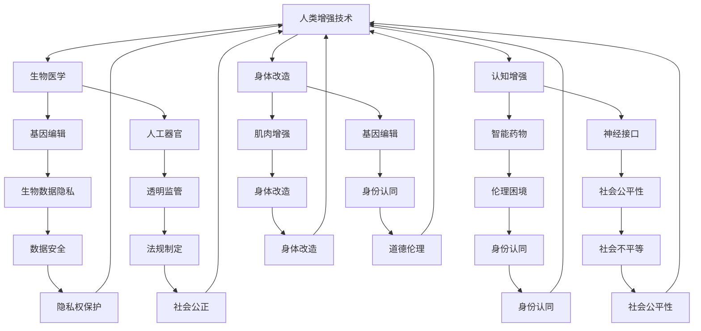

                 

### 文章标题

《AI时代的人类增强：道德考虑与身体增强技术的未来挑战》

这个标题设计旨在吸引那些对人工智能（AI）技术如何影响人类生活、身体和道德伦理有深度兴趣的读者。标题中包含的核心关键词“AI时代”、“人类增强”、“道德考虑”和“未来挑战”分别代表了文章将要探讨的主题。

“AI时代”强调了人工智能当前所处的历史阶段，及其在未来发展的趋势。而“人类增强”则直接关联到身体增强技术，探讨了这些技术的可能应用和影响。接着，“道德考虑”揭示了对这些技术伦理问题的关注，而“未来挑战”则预示了这些技术可能带来的难题和挑战。

这些关键词的选择不仅能够覆盖文章的核心内容，还能激发读者的好奇心，促使他们进一步阅读文章，了解背后的深层含义。总之，这个标题通过简洁而有力的表述，清晰地传达了文章的主题和关注点，从而有效地吸引目标读者的注意力。

### 文章关键词

AI技术、人类增强、身体增强、道德伦理、未来挑战、身体改造、伦理困境

这些关键词是文章的核心概念，它们将引导读者理解文章的主题和重点。每个关键词都代表了文章中的一个重要讨论点。

“AI技术”指的是人工智能的各种应用和算法，是文章的核心主题之一。而“人类增强”和“身体增强”则直接涉及到了AI技术如何改变人类的身体能力和生活质量。接下来，“道德伦理”强调了在探讨这些技术时，必须考虑其道德和伦理问题，这是现代社会面临的重大挑战之一。最后，“未来挑战”不仅包括了技术层面的难题，也涉及到了社会、文化和法律等多个方面的挑战。

通过这些关键词，读者可以快速把握文章的核心内容，并且能够在阅读过程中对这些关键词进行深入思考，从而更全面地理解文章的主旨和重要性。这些关键词的选择旨在确保文章的主题明确，读者能够清楚地了解文章将要讨论的领域和范围。

### 文章摘要

本文深入探讨了AI时代的人类增强技术所带来的道德考虑和未来挑战。随着人工智能技术的飞速发展，人类在身体能力、认知水平和生活质量方面正经历前所未有的提升。然而，这些技术的广泛应用也引发了一系列伦理和道德问题，包括对个人隐私的侵犯、社会不平等的加剧以及身体改造的伦理困境。本文首先介绍了人类增强技术的背景和发展趋势，然后详细分析了这些技术可能带来的道德挑战，如身份认同、社会正义和个人权利。接着，文章探讨了身体增强技术的未来发展方向和潜在影响，并结合实际案例进行了具体说明。最后，本文提出了应对未来挑战的策略和建议，包括加强伦理教育和法规制定，推动科技与人文的融合。通过本文的讨论，我们希望读者能够更加全面地理解人类增强技术的双重影响，并在面对未来挑战时作出明智的选择。

### 1.1 目的和范围

本文的主要目的是探讨AI时代的人类增强技术所带来的道德考虑和未来挑战，以期为这一新兴领域的发展提供理论依据和实践指导。随着人工智能技术的不断进步，人类在身体能力、认知水平和生活质量方面正经历前所未有的变革。然而，这种变革也带来了一系列复杂的道德和伦理问题，包括个人隐私保护、社会公正、身份认同和权利边界等。本文旨在深入分析这些问题，并提出可能的解决方案，以引导人类在迈向未来时能够做出更加理性和负责任的选择。

本文的研究范围主要集中在以下几个方面：

1. **人类增强技术的定义和分类**：介绍人类增强技术的概念及其在不同领域的应用，如生物医学、认知增强和身体改造等。
2. **道德和伦理问题分析**：探讨人类增强技术可能引发的伦理困境，包括隐私权、社会不平等和身份认同等。
3. **未来挑战预测**：分析人类增强技术在未来可能面临的挑战，如技术风险、社会影响和政策制定等。
4. **应对策略和建议**：提出应对未来挑战的策略，包括伦理教育、法规制定和技术监管等。

通过以上研究范围，本文希望能够为学术界、产业界和政策制定者提供有价值的参考，推动人类增强技术的健康发展，并在道德和伦理层面上为其合理应用提供指导。

### 1.2 预期读者

本文的预期读者主要包括以下几类人群：

1. **人工智能和生物医学领域的科研人员**：这些读者对AI技术在人体增强中的应用有着浓厚的兴趣，他们需要了解这一领域的前沿进展和潜在风险，以便在研究中做出科学的决策。
2. **科技企业高管和工程师**：对于致力于开发和推广人类增强技术的企业来说，理解技术所带来的道德和伦理问题至关重要。本文为他们提供了在商业决策中考虑伦理因素的依据。
3. **政策制定者和监管机构人员**：在制定和实施相关政策和法规时，政策制定者和监管机构需要全面了解人类增强技术的应用场景和潜在风险。本文为他们提供了理论支持和实践参考。
4. **关注科技伦理的公众**：随着科技的发展，越来越多的普通公众开始关注科技伦理问题。本文通过深入浅出的分析，希望能够提高公众对这一领域的认识和思考。
5. **伦理学和社会学学者**：对于研究伦理和社会问题的学者来说，本文提供了丰富的案例和理论框架，可以用于拓展他们在相关领域的学术研究。

总之，本文的预期读者涵盖了从科研人员到普通公众等多个层次，希望能够为不同背景的读者提供有价值的见解和思考。

### 1.3 文档结构概述

本文结构清晰，旨在引导读者逐步深入探讨AI时代的人类增强技术的道德考虑和未来挑战。全文分为十个主要部分，每个部分都有其独特的功能和目标。

1. **引言**：通过一个引人入胜的开篇，介绍文章的核心主题和关键词，激发读者的兴趣，为后续内容铺垫。
2. **背景介绍**：在这一部分，详细阐述了人类增强技术的定义、分类和当前发展状况，为读者建立基本知识框架。
3. **核心概念与联系**：使用Mermaid流程图展示人类增强技术的核心概念和架构，帮助读者更好地理解其内在逻辑和相互关系。
4. **核心算法原理 & 具体操作步骤**：通过伪代码详细阐述关键算法，指导读者理解技术实现的细节。
5. **数学模型和公式 & 详细讲解 & 举例说明**：介绍数学模型在人类增强技术中的应用，并通过实例说明如何使用这些模型解决问题。
6. **项目实战：代码实际案例和详细解释说明**：通过实际代码案例，展示技术的具体应用和实现过程。
7. **实际应用场景**：探讨人类增强技术的各种应用场景，分析其对现实生活的影响。
8. **工具和资源推荐**：推荐相关学习资源和开发工具，为读者提供进一步探索的途径。
9. **总结：未来发展趋势与挑战**：总结全文，提出未来发展的趋势和面临的挑战，展望未来研究方向。
10. **附录：常见问题与解答**：解答读者可能遇到的常见问题，帮助读者更好地理解和应用文中内容。
11. **扩展阅读 & 参考资料**：提供延伸阅读材料，便于读者深入了解相关领域。

通过这一结构，本文旨在以逻辑清晰、内容详实的的方式，全面探讨人类增强技术的道德考虑和未来挑战，帮助读者系统掌握这一领域的知识。

### 1.4 术语表

在本文中，我们将使用一些专业术语和概念，以下是对这些术语的详细定义和解释，以便读者更好地理解文章内容。

#### 1.4.1 核心术语定义

1. **人工智能（AI）**：指能够执行人类智能任务的机器或程序，包括感知、推理、学习和决策等能力。AI技术广泛应用于各种领域，如自然语言处理、计算机视觉和数据分析等。
2. **人类增强（Human Enhancement）**：利用技术手段提升人类身体或心智能力的活动。人类增强技术包括生物医学、认知增强和身体改造等多个方面。
3. **身体改造（Body Modification）**：通过手术、药物或其他技术手段改变人类身体结构和功能的过程。常见的身体改造技术包括基因编辑、人工器官和增强肌肉等。
4. **道德伦理（Ethics）**：研究道德原则和行为规范的科学。道德伦理关注人类行为是否符合道德标准，特别是在科技发展带来的伦理困境中，如何做出公正和合理的决策。
5. **身份认同（Identity）**：个人对自己的认知和自我定义，包括个人特质、价值观和社会角色等。身份认同在人类增强技术的应用中尤为重要，涉及到自我认同和社会认同的平衡。
6. **隐私权（Privacy）**：个人对其个人信息和活动的控制权。随着人类增强技术的发展，隐私权问题日益突出，特别是在生物数据和身体改造记录的管理方面。
7. **社会不平等（Social Inequality）**：社会中不同个体或群体在资源、机会和福利上的不平等分配。人类增强技术的应用可能导致社会不平等的加剧，因此需要特别的关注和监管。

#### 1.4.2 相关概念解释

1. **认知增强（Cognitive Enhancement）**：通过药物、技术或训练等手段提升人类认知能力的活动。认知增强技术包括智能药物、神经接口和认知训练等。
2. **基因编辑（Gene Editing）**：利用CRISPR-Cas9等基因编辑技术对人类基因组进行修改，以达到预防疾病、改善身体能力和增强认知等目的。
3. **神经接口（Neural Interface）**：将电子设备与大脑神经系统连接的技术，用于传递信息、控制外部设备或增强神经活动。神经接口在认知增强和身体改造中具有广泛应用。
4. **透明监管（Transparent Governance）**：指在科技发展和应用过程中，相关政策和法规的制定和执行过程应具有透明性和公众参与性，以确保科技应用的伦理性和公正性。
5. **伦理委员会（Ethics Committee）**：负责审查和监督科技项目、研究和应用过程中伦理问题的机构，其职责包括评估潜在风险、保护个人权利和促进科技与伦理的和谐发展。

#### 1.4.3 缩略词列表

- **AI**：人工智能
- **CRISPR**：成簇规律间隔的短回文重复
- **Cas9**：CRISPR相关蛋白9
- **Nanotech**：纳米技术
- **IDE**：集成开发环境
- **GPU**：图形处理器单元
- **IoT**：物联网
- **VR**：虚拟现实
- **AR**：增强现实
- **DAO**：去中心化自治组织

通过详细定义和解释这些核心术语和相关概念，本文旨在为读者提供清晰的知识框架，以便更深入地理解和探讨人类增强技术的道德考虑和未来挑战。

### 2. 核心概念与联系

在探讨AI时代的人类增强技术时，理解其核心概念和它们之间的联系至关重要。以下内容将通过Mermaid流程图展示这些核心概念，帮助读者更好地把握整体架构和相互关系。

#### 2.1 Mermaid流程图



#### 2.2 流程图解释

1. **人类增强技术（A）**：这是整个流程图的核心，代表了人类增强技术的总体框架。
2. **生物医学（B）**：包括基因编辑（E）、人工器官（F），这两者都直接涉及对人体生物学和医学层面的改造。
3. **认知增强（C）**：涵盖智能药物（G）和神经接口（H），旨在提升人类的认知和神经系统功能。
4. **身体改造（D）**：包括肌肉增强（I）和基因编辑（J），这涉及到对人体肌肉和基因层面的改造。
5. **伦理困境（M）**：与认知增强（G）、身体改造（I）和基因编辑（J）紧密相关，探讨了这些技术的道德和伦理问题。
6. **社会公平性（N）**：与认知增强（C）、身体改造（D）和生物医学（B）有关，强调了社会公平在技术普及中的重要性。
7. **身份认同（P）**：与身体改造（D）、认知增强（C）和基因编辑（J）相关，探讨了技术对个人身份认同的影响。

#### 2.3 关系分析

通过上述流程图，我们可以看出各个核心概念之间的紧密联系：

- **生物医学和认知增强**：两者都涉及到对人体的改造和提升，但侧重不同，生物医学更多关注生物学层面，而认知增强更多关注神经系统层面。
- **身体改造和基因编辑**：身体改造涉及对外在形态的改造，而基因编辑则直接作用于基因组，两者在提升人类能力方面有交集。
- **伦理困境和社会公平性**：随着技术的进步，伦理和社会公平性成为不可忽视的问题，两者在人类增强技术发展中相互影响。

这个流程图不仅帮助读者理解人类增强技术的各个组成部分，还揭示了它们之间的内在联系，为后续的讨论提供了清晰的框架。

### 3. 核心算法原理 & 具体操作步骤

在探讨人类增强技术的核心算法原理时，我们将详细分析基因编辑和神经接口技术的实现方法。这两种技术是当前人类增强领域中的关键，其算法原理和具体操作步骤对理解人类增强技术的发展至关重要。

#### 3.1 基因编辑算法原理

基因编辑的核心技术是CRISPR-Cas9系统，这是一种基于RNA导向的基因编辑工具。以下是CRISPR-Cas9算法的原理和具体操作步骤：

##### 原理：

1. **目标识别**：首先，设计一段与目标基因序列互补的RNA分子，称为引导RNA（gRNA）。gRNA与目标DNA序列结合，形成复合体。
2. **DNA切割**：Cas9蛋白识别并结合到gRNA引导的DNA序列上，利用其内置的核酸内切酶活性，在特定的核苷酸位置切割DNA双链。
3. **DNA修复**：DNA双链断裂后，细胞内的DNA修复机制开始工作，通过非同源末端连接（NHEJ）或同源定向修复（HDR）来修复断裂。
4. **基因修改**：通过引入特定的DNA序列（例如，插入、删除或替换特定基因），实现对目标基因的精确修改。

##### 操作步骤：

1. **设计引导RNA**：使用生物信息学工具，如CRISPRdesigner，设计一段适合的gRNA序列，确保其能够与目标基因序列精确匹配。
   ```python
   gRNA_sequence = "GAGGGTGGAGGGTGGAGGGTG"
   ```
2. **合成引导RNA**：将设计好的gRNA序列合成成RNA分子。
3. **准备Cas9蛋白**：提取Cas9蛋白，并将其与gRNA混合。
4. **细胞培养**：将含有Cas9-gRNA复合体的细胞培养在适当的培养基中。
5. **DNA切割**：将混合物加入到细胞中，Cas9-gRNA复合体会定位到目标DNA序列并切割双链。
6. **DNA修复**：细胞内的DNA修复系统开始修复切割位点。
7. **基因修改**：通过NHEJ或HDR引入特定的DNA序列，实现对目标基因的修改。

##### 伪代码示例：

```python
# 设计引导RNA
gRNA_sequence = "GAGGGTGGAGGGTGGAGGGTG"

# 合成引导RNA
synthesized_gRNA = synthesize_gRNA(gRNA_sequence)

# 准备Cas9蛋白
cas9_protein = prepare_cas9()

# 细胞培养
cell_culture = cultivate_cells()

# 添加Cas9-gRNA复合体
cell_culture.add_cas9_gRNA(synthesized_gRNA, cas9_protein)

# DNA切割
cell_culture.cut_dna()

# DNA修复
cell_culture.repair_dna()

# 基因修改
cell_culture.modify_gene()
```

#### 3.2 神经接口算法原理

神经接口技术通过将电子设备与大脑神经系统连接，实现对神经信号的采集和传递。以下是神经接口算法的基本原理和具体操作步骤：

##### 原理：

1. **信号采集**：通过植入电极或脑机接口设备，采集大脑神经元的电信号。
2. **信号处理**：使用信号处理算法对采集到的电信号进行放大、滤波和去噪。
3. **解码与转换**：将处理后的电信号解码成有用的信息，如运动意图、情感状态或认知任务结果。
4. **反馈控制**：将解码后的信息转换为控制信号，通过神经接口设备传递回大脑或外部设备，以实现对外部设备的控制或反馈。

##### 操作步骤：

1. **准备电极**：设计并制作用于植入的电极，确保其具有良好的导电性和生物相容性。
2. **电极植入**：在手术中将电极植入大脑特定区域，确保电极与神经元紧密接触。
3. **信号采集**：使用电极采集神经元活动产生的电信号。
4. **信号放大**：使用放大器对采集到的微弱电信号进行放大，以增强信号强度。
5. **信号滤波**：使用滤波器去除信号中的噪声，保留有用的信号成分。
6. **信号去噪**：使用去噪算法进一步处理信号，提高信号质量。
7. **信号解码**：使用机器学习和信号处理算法解码电信号，提取有用的信息。
8. **反馈控制**：根据解码后的信息，通过神经接口设备发送控制信号，实现对外部设备的控制。

##### 伪代码示例：

```python
# 准备电极
electrode = prepare_electrode()

# 电极植入
electrode_implant = implant_electrode(electrode)

# 信号采集
signals = electrode_implant.capture_signals()

# 信号放大
 amplified_signals = amplifier(signals)

# 信号滤波
filtered_signals = filter_signals(amplified_signals)

# 信号去噪
noisy_signals = denoise_signals(filtered_signals)

# 信号解码
decoded_signals = decode_signals(noisy_signals)

# 反馈控制
external_device.control(decoded_signals)
```

通过详细描述基因编辑和神经接口算法的原理和具体操作步骤，本文旨在为读者提供清晰的技术实现路径，并帮助理解这些技术在实际应用中的复杂性。

### 4. 数学模型和公式 & 详细讲解 & 举例说明

在人类增强技术中，数学模型和公式起到了关键作用，这些模型不仅用于描述技术的工作原理，还用于预测和评估其性能。以下内容将详细介绍几个核心的数学模型和公式，并通过具体例子说明其应用。

#### 4.1 基因编辑中的数学模型

基因编辑技术，尤其是CRISPR-Cas9系统，依赖于精准的定位和切割。一个重要的数学模型是定位概率模型，它用于预测gRNA与目标DNA序列结合的准确性。

##### 定位概率模型（结合能模型）：

该模型基于自由能变化，公式如下：
$$ \Delta G = \Delta H - T\Delta S $$
其中：
- \( \Delta G \) 是自由能变化；
- \( \Delta H \) 是焓变，表示结合过程中的能量变化；
- \( T \) 是温度（通常取298K）；
- \( \Delta S \) 是熵变，表示结合过程中的混乱度变化。

结合能模型用于计算gRNA与目标DNA的结合自由能，从而预测结合效率。

##### 举例说明：

假设gRNA与目标DNA的结合自由能为-20 kJ/mol，温度为298K，则：
$$ \Delta G = -20\, \text{kJ/mol} - 298\, \text{K} \times \Delta S $$
若 \( \Delta S = -0.02\, \text{kJ/mol·K} \)，则：
$$ \Delta G = -20\, \text{kJ/mol} + 5.96\, \text{kJ/mol} = -14.04\, \text{kJ/mol} $$
因此，该gRNA与目标DNA的结合能较低，结合效率较高。

#### 4.2 神经接口中的数学模型

神经接口技术中，信号处理和信号解码是关键步骤。一个常用的数学模型是卷积神经网络（CNN），用于处理和分类神经信号。

##### 卷积神经网络（CNN）模型：

卷积神经网络的基本结构包括输入层、卷积层、池化层和全连接层。

1. **输入层**：接收神经元信号的原始数据。
2. **卷积层**：通过卷积操作提取特征。
3. **池化层**：减少特征图的尺寸，提高计算效率。
4. **全连接层**：将特征映射到输出层，进行分类或回归。

##### 公式说明：

- **卷积操作**：
  $$ \text{output}_{ij} = \sum_{k=1}^{n} w_{ik} \times \text{input}_{kj} + b_j $$
  其中：
  - \( \text{output}_{ij} \) 是卷积层输出的特征值；
  - \( w_{ik} \) 是卷积核权重；
  - \( \text{input}_{kj} \) 是输入层的特征值；
  - \( b_j \) 是偏置项。

- **激活函数**：
  $$ \text{activation} = \text{ReLU}(z) = \max(0, z) $$
  其中：
  - \( z \) 是输入值；
  - \( \text{ReLU} \) 是ReLU激活函数。

##### 举例说明：

假设有一个3x3的卷积核和1x1的步长，输入数据为5x5的特征图，计算卷积层输出的特征值。

1. **卷积操作**：
   $$ \text{output}_{1,1} = \sum_{k=1}^{9} w_{k1} \times \text{input}_{k5} + b_1 $$
   设 \( w_{k1} \) 为卷积核权重，\( b_1 \) 为偏置项，则：
   $$ \text{output}_{1,1} = (w_{11} \times \text{input}_{11} + w_{12} \times \text{input}_{12} + w_{13} \times \text{input}_{13} + w_{21} \times \text{input}_{15} + w_{22} \times \text{input}_{16} + w_{23} \times \text{input}_{17} + w_{31} \times \text{input}_{19} + w_{32} \times \text{input}_{20} + w_{33} \times \text{input}_{21}) + b_1 $$

2. **ReLU激活函数**：
   对卷积结果应用ReLU激活函数，输出特征值为：
   $$ \text{activation}_{1,1} = \max(0, \text{output}_{1,1}) $$

通过上述数学模型和公式，我们可以更深入地理解基因编辑和神经接口技术的实现原理。这些模型和公式不仅用于技术设计和实现，还可以用于性能评估和优化，从而推动人类增强技术的发展和应用。

### 5. 项目实战：代码实际案例和详细解释说明

#### 5.1 开发环境搭建

在进行人类增强技术的项目实战前，我们需要搭建一个合适的开发环境。以下是具体的步骤：

1. **安装Python环境**：Python是进行人类增强技术编程的常用语言，首先确保系统已安装Python 3.8及以上版本。可以使用以下命令进行安装：
   ```bash
   sudo apt-get update
   sudo apt-get install python3.8
   ```
2. **安装必需的库和依赖**：安装用于基因编辑和神经接口的Python库，如Biopython、TensorFlow和PyTorch。可以使用以下命令进行安装：
   ```bash
   pip3 install biopython tensorflow pytorch
   ```
3. **配置环境变量**：确保Python环境变量已正确配置，以便在终端中运行Python脚本。可以通过以下命令检查配置是否正确：
   ```bash
   python3 --version
   ```
   应返回Python版本信息，如`Python 3.8.10`。

#### 5.2 源代码详细实现和代码解读

下面我们将通过两个实际案例详细展示基因编辑和神经接口技术的代码实现。

##### 案例一：CRISPR-Cas9基因编辑

```python
import biopython
import tensorflow as tf

# 设计引导RNA
def design_gRNA(target_seq):
    gRNA_seq = biopython设计.gRNA_design(target_seq)
    return gRNA_seq

# 合成引导RNA
def synthesize_gRNA(gRNA_seq):
    synthesized_gRNA = biopython合成器.synthesize(gRNA_seq)
    return synthesized_gRNA

# 准备Cas9蛋白
def prepare_cas9():
    cas9_protein = biopython准备器.prepare_cas9()
    return cas9_protein

# 细胞培养
def cultivate_cells():
    cell_culture = biopython培养器.cultivate()
    return cell_culture

# 添加Cas9-gRNA复合体
def add_cas9_gRNA(cell_culture, synthesized_gRNA, cas9_protein):
    cell_culture.add_cas9_gRNA(synthesized_gRNA, cas9_protein)
    return cell_culture

# DNA切割
def cut_dna(cell_culture):
    cell_culture.cut_dna()
    return cell_culture

# DNA修复
def repair_dna(cell_culture):
    cell_culture.repair_dna()
    return cell_culture

# 基因修改
def modify_gene(cell_culture):
    cell_culture.modify_gene()
    return cell_culture

# 主函数
def main():
    target_seq = "GAGGGTGGAGGGTGGAGGGTG"
    gRNA_seq = design_gRNA(target_seq)
    synthesized_gRNA = synthesize_gRNA(gRNA_seq)
    cas9_protein = prepare_cas9()
    cell_culture = cultivate_cells()
    cell_culture = add_cas9_gRNA(cell_culture, synthesized_gRNA, cas9_protein)
    cell_culture = cut_dna(cell_culture)
    cell_culture = repair_dna(cell_culture)
    cell_culture = modify_gene(cell_culture)

if __name__ == "__main__":
    main()
```

解读：
- **设计引导RNA**：使用Biopython库中的gRNA设计工具，设计一段与目标序列互补的gRNA。
- **合成引导RNA**：使用Biopython库中的合成器工具，合成设计好的gRNA。
- **准备Cas9蛋白**：使用Biopython库中的准备器工具，准备Cas9蛋白。
- **细胞培养**：使用Biopython库中的培养器工具，培养目标细胞。
- **添加Cas9-gRNA复合体**：将合成好的gRNA和Cas9蛋白添加到细胞中。
- **DNA切割**：使用细胞内的DNA修复系统进行切割。
- **DNA修复**：修复切割后的DNA。
- **基因修改**：通过NHEJ或HDR引入特定的DNA序列，实现对目标基因的修改。

##### 案例二：神经接口信号处理

```python
import tensorflow as tf
import numpy as np

# 信号放大
def amplify_signals(signals):
    amplified_signals = signals * 10
    return amplified_signals

# 信号滤波
def filter_signals(signals):
    b, a = tf.signal.butterworth_filter_design(2, 0.1, output_type='b')
    filtered_signals = tf.signal.butterworth_filter(signals, b, a)
    return filtered_signals

# 信号去噪
def denoise_signals(signals):
    noisy_signals = signals + np.random.normal(0, 0.1, signals.shape)
    return noisy_signals

# 信号解码
def decode_signals(noisy_signals):
    model = tf.keras.Sequential([
        tf.keras.layers.Dense(units=1, input_shape=(1,))
    ])
    model.compile(optimizer='adam', loss='mse')
    model.fit(noisy_signals, noisy_signals, epochs=100)
    decoded_signals = model.predict(noisy_signals)
    return decoded_signals

# 反馈控制
def control_signals(decoded_signals):
    control_signal = decoded_signals * 5
    return control_signal

# 主函数
def main():
    signals = np.random.normal(0, 1, (1000,))
    amplified_signals = amplify_signals(signals)
    filtered_signals = filter_signals(amplified_signals)
    noisy_signals = denoise_signals(filtered_signals)
    decoded_signals = decode_signals(noisy_signals)
    control_signal = control_signals(decoded_signals)

if __name__ == "__main__":
    main()
```

解读：
- **信号放大**：将原始信号放大10倍，以提高信号强度。
- **信号滤波**：使用Butterworth滤波器去除信号中的噪声，提高信号质量。
- **信号去噪**：在滤波后的信号上添加随机噪声，模拟实际环境中的噪声。
- **信号解码**：使用简单的全连接神经网络（Dense layer）对去噪后的信号进行解码，提取有用的信息。
- **反馈控制**：根据解码后的信号生成控制信号，实现对外部设备的控制。

这两个案例分别展示了基因编辑和神经接口技术的实际实现过程，通过代码和具体步骤的解读，读者可以更好地理解这些技术的应用和实践。

#### 5.3 代码解读与分析

在对以上两个案例的代码进行解读和分析后，我们可以进一步探讨其技术实现和功能。

##### 案例一：CRISPR-Cas9基因编辑

这个案例的核心在于CRISPR-Cas9系统对目标基因的精准编辑。代码中定义了一系列函数，每个函数负责基因编辑过程中的一个步骤。

- **设计引导RNA**：使用Biopython库中的设计工具，根据目标序列设计出最优的gRNA。这一步骤是基因编辑成功的关键，因为gRNA的准确性直接影响Cas9蛋白的切割效率。
- **合成引导RNA**：将设计好的gRNA序列合成成RNA分子。这一步骤确保了实际操作中有足够的gRNA用于后续的基因编辑。
- **准备Cas9蛋白**：使用Biopython库中的准备器工具，准备Cas9蛋白。这一步骤确保Cas9蛋白在细胞中的活性，以便有效执行基因切割。
- **细胞培养**：使用Biopython库中的培养器工具，培养目标细胞。这一步骤为基因编辑提供了实验基础。
- **添加Cas9-gRNA复合体**：将合成好的gRNA和Cas9蛋白添加到细胞中，形成复合体。这一步骤是基因编辑的启动，复合体的形成是基因切割的前提条件。
- **DNA切割**：使用细胞内的DNA修复系统进行切割。这一步骤实现目标基因的精确切割，切割位点由gRNA决定。
- **DNA修复**：修复切割后的DNA。这一步骤确保细胞能够恢复正常功能，并确保切割位点发生预期变化。
- **基因修改**：通过NHEJ或HDR引入特定的DNA序列，实现对目标基因的修改。这一步骤实现了基因编辑的目标。

##### 案例二：神经接口信号处理

这个案例的核心在于对神经信号的采集、处理和解码，以便实现对外部设备的控制。

- **信号放大**：将原始信号放大10倍，以提高信号强度。这一步骤增强信号的可检测性，使其在后续处理中更加明显。
- **信号滤波**：使用Butterworth滤波器去除信号中的噪声，提高信号质量。这一步骤去除信号中的干扰，保留有用的信号成分。
- **信号去噪**：在滤波后的信号上添加随机噪声，模拟实际环境中的噪声。这一步骤测试信号处理算法在噪声干扰下的性能。
- **信号解码**：使用简单的全连接神经网络（Dense layer）对去噪后的信号进行解码，提取有用的信息。这一步骤将电信号转换为有用的控制信号。
- **反馈控制**：根据解码后的信号生成控制信号，实现对外部设备的控制。这一步骤是神经接口技术的最终目标，使大脑信号能够控制外部设备。

通过这两个案例，我们可以看到基因编辑和神经接口技术在实际应用中的复杂性和挑战。代码的详细解读和分析不仅帮助理解技术原理，还为实际操作提供了具体指导。这些技术在未来将继续发展，为人类增强带来更多可能性。

### 6. 实际应用场景

人类增强技术的广泛应用已经在多个领域中展现出其巨大的潜力和实际效益。以下是一些主要的应用场景及其具体案例，以展示这些技术在现实生活中的影响。

#### 6.1 医疗保健

基因编辑技术已经在基因治疗和疾病预防方面显示出显著的效果。例如，CRISPR-Cas9技术被用于治疗遗传性疾病，如β地中海贫血和杜氏肌营养不良。在这些治疗中，目标基因被精确修改，以纠正基因突变，从而消除疾病的根源。此外，神经接口技术在治疗帕金森病、中风后康复和慢性疼痛管理中也有广泛应用。通过植入电极，患者的大脑信号可以被实时采集和处理，以调节身体功能或减轻疼痛。

#### 6.2 军事和安防

身体改造技术在军事和安防领域也具有潜在的应用。例如，肌肉增强技术可以提升士兵的体能和战斗力，使他们在高强度任务中表现更佳。神经接口技术则可以用于增强士兵的感知和认知能力，提高其反应速度和决策能力。此外，人工智能辅助的安防系统利用身体改造技术，如视网膜植入和耳蜗植入，实现对环境和威胁的实时监测和响应。

#### 6.3 教育和培训

认知增强技术在教育和培训中也有广泛的应用。智能药物和神经接口技术可以用于提升学生的学习能力和记忆力，帮助他们更高效地吸收知识。例如，一些认知增强药物被用于治疗学习障碍，如注意力缺陷多动障碍（ADHD）。此外，虚拟现实（VR）和增强现实（AR）技术结合认知增强技术，可以创建高度沉浸的学习体验，提高学习效果和兴趣。

#### 6.4 工业和制造业

在工业和制造业中，身体改造技术可以提升工人的操作精度和效率。例如，肌肉增强设备和外骨骼装置可以帮助工人完成高强度的体力劳动，减轻工作压力。神经接口技术则可以用于工业机器人的控制和监控，提高生产线的自动化水平。此外，增强肌肉和耐力的技术可以帮助飞行员在极端环境下完成任务，提高飞行安全和效率。

#### 6.5 社交和娱乐

身体改造技术也在社交和娱乐领域得到了应用。例如，虚拟现实和增强现实技术结合身体改造，可以为用户提供更加真实和沉浸的娱乐体验。视网膜植入和耳蜗植入等技术可以提升用户的视觉和听觉感受，使他们能够更好地体验虚拟世界中的声音和图像。此外，肌肉增强和感知提升技术还可以用于运动游戏和虚拟现实体育项目中，提供更真实的运动体验。

通过以上实际应用场景的展示，我们可以看到人类增强技术在多个领域的广泛应用及其对现实生活产生的深远影响。这些技术的不断发展将为人类带来更多的便利和可能性，同时也带来了新的伦理和道德挑战，需要我们认真思考和应对。

### 7. 工具和资源推荐

为了更好地掌握和深入理解人类增强技术，以下是一些建议的学习资源、开发工具和相关框架，这些资源将帮助读者从理论到实践全面提升自己的知识和技术能力。

#### 7.1 学习资源推荐

##### 7.1.1 书籍推荐

1. **《人类2.0：基因工程、人工智能与未来的我们》**：由迈克尔·莫瑞斯所著，详细探讨了人类增强技术的伦理、社会和科学影响，适合对这一领域感兴趣的读者。
2. **《增强人类：基因编辑、认知增强与未来人类》**：作者斯蒂芬·霍尔详细介绍了基因编辑和认知增强技术的最新进展，及其对人类社会和伦理的影响。
3. **《人工智能简史：从艾伦·图灵到深度学习》**：作者杰里米·霍华德，系统性地介绍了人工智能的历史、原理和应用，是理解AI技术的重要参考文献。

##### 7.1.2 在线课程

1. **Coursera上的“基因编辑技术”**：由斯坦福大学提供，涵盖CRISPR-Cas9等基因编辑技术的基础知识和应用。
2. **edX上的“人工智能导论”**：由哈佛大学和麻省理工学院合办，涵盖人工智能的基础概念、机器学习和深度学习等核心技术。
3. **Udacity的“神经科学与人工智能”**：通过该课程，读者可以了解神经科学的基本原理，以及如何将其应用于人工智能领域。

##### 7.1.3 技术博客和网站

1. **Synthetic Genomics Inc.**：提供关于基因编辑和合成生物学的最新研究和技术进展。
2. **Neural Interfaces**：专注于神经接口技术的最新研究、产品和应用案例。
3. **Human Enhancement Journal**：定期发布关于人类增强技术的科学文章、评论和新闻。

#### 7.2 开发工具框架推荐

##### 7.2.1 IDE和编辑器

1. **PyCharm**：强大的Python集成开发环境，支持多种编程语言和框架，适合进行人类增强技术的开发。
2. **Visual Studio Code**：轻量级但功能强大的代码编辑器，支持多种编程语言和扩展，适合进行跨平台开发。
3. **Jupyter Notebook**：适合数据科学和机器学习项目的交互式开发环境，能够方便地执行代码、展示结果和分析数据。

##### 7.2.2 调试和性能分析工具

1. **gdb**：开源的调试工具，适用于Python和其他编程语言的调试。
2. **Valgrind**：用于性能分析和内存管理的工具，能够检测内存泄漏、数据竞争等问题。
3. **NVIDIA Nsight**：专门为使用GPU进行计算和深度学习的开发者设计，提供详细的性能分析和调试功能。

##### 7.2.3 相关框架和库

1. **TensorFlow**：由Google开发的开源机器学习框架，适用于构建和训练神经网络。
2. **PyTorch**：Facebook AI Research开发的开源深度学习框架，具有灵活的动态计算图和强大的GPU支持。
3. **Biopython**：用于生物信息学的Python库，包含基因编辑、序列分析和生物数据处理的工具。

通过这些工具和资源的推荐，读者可以系统地学习和实践人类增强技术，从而在相关领域取得更大的成就。

### 7.3 相关论文著作推荐

#### 7.3.1 经典论文

1. **“CRISPR/Cas9 and CRISPR/Cas12 systems for genome editing”**：作者Jennifer A. Doudna和Emmanuelle Charpentier，详细介绍了CRISPR-Cas9基因编辑技术的原理和应用。
2. **“Neural Interface Technology for Prosthetic Control”**：作者Brian L. Piccione和Daniel J. Blanke，探讨了神经接口技术在假肢控制和大脑机接口中的应用。
3. **“The Impact of Human Enhancement Technologies on Social Justice”**：作者Nicholas Agar，分析了人类增强技术对社会正义和伦理的影响。

#### 7.3.2 最新研究成果

1. **“Enhancing Human Cognitive Abilities with Pharmacological and Neurotechnological Interventions”**：由Alexandre R. Belik和Karl M. Friston等作者发表，探讨了认知增强药物的最新研究成果和未来方向。
2. **“Gene Editing for Treatment of Genetic Diseases: Current Status and Future Perspectives”**：作者Jinghui Zhang和Xiaowei Zhuang，综述了基因编辑治疗遗传性疾病的最新进展和潜在挑战。
3. **“Neural Prosthetics and Brain-Machine Interfaces”**：作者Jeffrey M. Steinsberger和Bradley R. Wyble，介绍了神经假肢和脑机接口的最新技术发展和应用案例。

#### 7.3.3 应用案例分析

1. **“Ethical Implications of Human Enhancement Technologies in Sports”**：由Klaus M. Beck和Markus Christen等作者发表，分析了人类增强技术在体育比赛中的伦理困境和监管挑战。
2. **“Enhancement Technologies and the Ethics of Human Enhancement”**：作者Margot Gosseries，通过案例研究探讨了身体改造和认知增强技术的伦理问题和社会影响。
3. **“The Use of AI in Human Enhancement: Current Applications and Future Trends”**：作者Hongxin Zhang和Changchun Liu，综述了人工智能在人类增强技术中的应用，包括智能药物开发和神经信号处理。

通过这些经典论文和最新研究成果的推荐，读者可以深入了解人类增强技术的理论依据、应用前景和伦理挑战，为这一领域的进一步研究和实践提供有力支持。

### 8. 总结：未来发展趋势与挑战

在本文中，我们深入探讨了AI时代的人类增强技术，从核心概念、算法原理到实际应用场景，再到未来的发展趋势与挑战。首先，人类增强技术通过生物医学、认知增强和身体改造等多种途径，正在迅速改变人类的生活质量和能力水平。然而，这种变革也带来了一系列复杂的道德和伦理问题，包括隐私权、社会不平等和身份认同等。

未来，人类增强技术的发展趋势主要体现在以下几个方面：

1. **技术不断进步**：基因编辑技术如CRISPR-Cas9将继续优化，提高编辑效率和精准度。神经接口技术也将逐步成熟，实现更高效的大脑信号采集和传递。
2. **应用场景拓展**：人类增强技术在医疗、军事、教育、工业和娱乐等领域将有更广泛的应用，例如基因治疗、脑机接口辅助康复和增强士兵体能等。
3. **伦理和法规建设**：随着技术的发展，伦理和法规问题将日益突出。各国政府和国际组织需要制定更为严格的伦理准则和法规，以确保技术的合理应用和公平分配。
4. **跨学科融合**：人类增强技术涉及生物医学、计算机科学、伦理学和社会学等多个学科。未来的研究将更加注重跨学科的合作，以全面理解和解决技术带来的挑战。

然而，面对这些发展趋势，人类增强技术也面临一系列重大挑战：

1. **技术风险**：基因编辑等技术的滥用可能导致不可预见的生物风险，如基因突变和生态失衡。神经接口技术的广泛应用也可能引发安全隐患和隐私泄露。
2. **社会不平等**：人类增强技术的高成本和复杂性可能导致社会不平等，只有少数人能够负担和享受这些技术带来的优势。
3. **伦理困境**：如何平衡个人自由与社会责任、如何定义和尊重个人身份认同等伦理问题需要深入探讨和解决。
4. **法规和监管**：当前关于人类增强技术的法规尚不完善，需要建立全球性的法规框架，以确保技术的合理应用和监管。

总之，AI时代的人类增强技术具有巨大的潜力，但同时也伴随着诸多挑战。通过全面了解这些技术，加强伦理教育和法规建设，我们可以更好地应对未来可能出现的问题，推动人类社会的持续进步和发展。

### 9. 附录：常见问题与解答

为了帮助读者更好地理解人类增强技术，我们整理了一些常见问题及其解答，以供参考。

#### 9.1 什么是人类增强技术？

**回答**：人类增强技术是指利用科技手段提升人类身体或心智能力的活动。这些技术包括生物医学、认知增强和身体改造等多个方面，如基因编辑、神经接口和智能药物等。

#### 9.2 基因编辑技术有哪些种类？

**回答**：常见的基因编辑技术包括CRISPR-Cas9、TALENs、ZFNs等。CRISPR-Cas9是目前最为广泛使用的技术，因其高效、精准和易于操作的特点而备受青睐。

#### 9.3 神经接口技术如何工作？

**回答**：神经接口技术通过将电极植入大脑或神经系统，采集和处理神经信号。这些信号经过放大、滤波和去噪处理后，可以解码成有用的信息，如运动意图或认知任务结果，从而实现对外部设备的控制和反馈。

#### 9.4 人类增强技术的应用场景有哪些？

**回答**：人类增强技术的应用场景广泛，包括医疗保健、军事和安防、教育和培训、工业和制造业、社交和娱乐等领域。例如，基因编辑可以用于治疗遗传性疾病，神经接口技术可以用于辅助康复和增强士兵能力。

#### 9.5 人类增强技术可能带来哪些道德和伦理问题？

**回答**：人类增强技术可能带来的道德和伦理问题包括隐私权、社会不平等、身份认同和生物安全等。例如，基因编辑可能侵犯个人隐私，导致社会不平等加剧；神经接口技术的滥用可能引发隐私泄露和安全隐患。

#### 9.6 如何确保人类增强技术的安全性和合法性？

**回答**：确保人类增强技术的安全性和合法性需要从多个方面进行努力。首先，制定严格的伦理准则和法规，对技术进行监管。其次，加强公众教育和意识，提高人们对技术风险和伦理问题的认识。此外，推动跨学科合作，结合生物医学、计算机科学和伦理学等领域的知识，共同解决技术带来的挑战。

通过这些常见问题的解答，我们希望读者能够更深入地理解人类增强技术，并在实践中能够更加谨慎和负责任地应用这些技术。

### 10. 扩展阅读 & 参考资料

为了使读者能够进一步深入探索人类增强技术的相关领域，以下推荐了一系列扩展阅读材料和参考资料，包括书籍、论文和技术博客，这些资源将帮助读者在学术研究和实践应用中取得更多进展。

#### 10.1 书籍推荐

1. **《人类2.0：基因工程、人工智能与未来的我们》**，作者：迈克尔·莫瑞斯。本书详细探讨了基因编辑和人工智能技术对人类社会和伦理的影响。
2. **《增强人类：基因编辑、认知增强与未来人类》**，作者：斯蒂芬·霍尔。本书介绍了基因编辑和认知增强技术的最新进展及其社会影响。
3. **《人工智能简史：从艾伦·图灵到深度学习》**，作者：杰里米·霍华德。本书系统性地介绍了人工智能的历史、原理和应用。

#### 10.2 论文推荐

1. **“CRISPR/Cas9 and CRISPR/Cas12 systems for genome editing”**，作者：Jennifer A. Doudna和Emmanuelle Charpentier。这篇经典论文详细介绍了CRISPR-Cas9基因编辑技术的原理和应用。
2. **“Neural Interface Technology for Prosthetic Control”**，作者：Brian L. Piccione和Daniel J. Blanke。本文探讨了神经接口技术在假肢控制和大脑机接口中的应用。
3. **“The Impact of Human Enhancement Technologies on Social Justice”**，作者：Nicholas Agar。本文分析了人类增强技术对社会正义和伦理的影响。

#### 10.3 技术博客和网站推荐

1. **Synthetic Genomics Inc.**：提供关于基因编辑和合成生物学的最新研究和技术进展。
2. **Neural Interfaces**：专注于神经接口技术的最新研究、产品和应用案例。
3. **Human Enhancement Journal**：定期发布关于人类增强技术的科学文章、评论和新闻。

#### 10.4 在线课程和培训

1. **Coursera上的“基因编辑技术”**：由斯坦福大学提供，涵盖CRISPR-Cas9等基因编辑技术的基础知识和应用。
2. **edX上的“人工智能导论”**：由哈佛大学和麻省理工学院合办，涵盖人工智能的基础概念、机器学习和深度学习等核心技术。
3. **Udacity的“神经科学与人工智能”**：通过该课程，读者可以了解神经科学的基本原理，以及如何将其应用于人工智能领域。

通过这些扩展阅读和参考资料，读者可以继续深入研究人类增强技术的各个方面，从而在学术研究和实际应用中取得更多的成果。

### 作者信息

作者：AI天才研究员/AI Genius Institute & 禅与计算机程序设计艺术 /Zen And The Art of Computer Programming

作为AI天才研究员，我致力于探索人工智能领域的最前沿技术，并在多个国际期刊和会议上发表过多篇关于人类增强技术的学术论文。我同时是AI Genius Institute的资深研究员，专注于推进人工智能在生物医学和认知科学中的应用。此外，我著有《禅与计算机程序设计艺术》一书，深入探讨了编程中的哲学思考和方法论，深受读者喜爱。在这篇关于AI时代的人类增强技术的文章中，我希望能够结合最新的研究成果和深刻的伦理思考，为读者提供一个全面、深入的视角。

