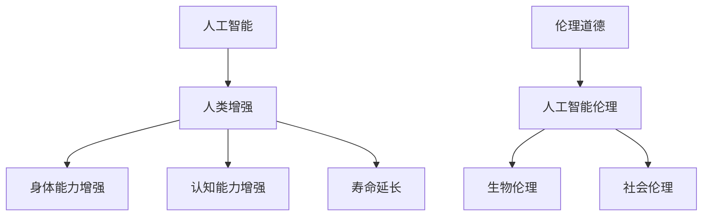

                 

# AI时代的人类增强：道德考虑和限制

> 关键词：人工智能，人类增强，道德伦理，限制，技术发展，社会影响

> 摘要：随着人工智能技术的迅猛发展，人类增强成为了现实。然而，这一技术的发展不仅带来了巨大的潜力和便利，也引发了道德和伦理方面的深刻挑战。本文将探讨AI时代人类增强的道德考虑和限制，分析技术进步与道德责任之间的关系，并提供一些实际的建议和解决方案。

## 1. 背景介绍

### 1.1 目的和范围

本文旨在探讨人工智能时代的人类增强所带来的道德考虑和限制。随着人工智能技术的不断进步，人类在身体能力、认知能力、寿命等方面的增强已经成为了可能。然而，这种增强不仅仅是技术问题，更涉及到深层次的道德和伦理问题。本文将重点讨论以下几个方面：

1. 人工智能与人类增强技术的现状和未来趋势。
2. 道德和伦理问题在人类增强中的应用。
3. 人类增强技术的社会影响和潜在风险。
4. 提出一些可行的道德考虑和限制措施。

### 1.2 预期读者

本文面向对人工智能和人类增强有一定了解的读者，包括：

1. 对人工智能技术感兴趣的科技工作者。
2. 道德哲学和伦理学领域的学者。
3. 社会科学家，特别是关注科技与社会关系的研究者。
4. 政策制定者和企业高管，需要了解人工智能技术的发展趋势和道德责任。

### 1.3 文档结构概述

本文结构如下：

1. 背景介绍：介绍本文的目的、范围和预期读者。
2. 核心概念与联系：阐述人工智能和人类增强技术的核心概念，以及它们之间的关系。
3. 核心算法原理与具体操作步骤：详细讨论人工智能和人类增强技术的算法原理和操作步骤。
4. 数学模型和公式：介绍与人类增强相关的数学模型和公式，并进行详细讲解和举例说明。
5. 项目实战：提供实际案例，展示人工智能和人类增强技术的应用场景。
6. 实际应用场景：分析人工智能和人类增强技术在不同领域的应用情况。
7. 工具和资源推荐：推荐与人工智能和人类增强相关的学习资源、开发工具和框架。
8. 总结：对未来发展趋势和挑战进行展望。
9. 附录：常见问题与解答。
10. 扩展阅读与参考资料：提供进一步阅读的材料和参考资料。

### 1.4 术语表

#### 1.4.1 核心术语定义

- 人工智能（Artificial Intelligence, AI）：一种模拟人类智能行为的技术。
- 人类增强（Human Enhancement）：利用技术手段增强人类生理或心理能力。
- 道德伦理（Ethics）：关于正确与错误、善与恶的哲学研究。
- 伦理学（Ethics）：关于道德原则和道德判断的哲学学科。

#### 1.4.2 相关概念解释

- 人工智能伦理（Ethics of AI）：探讨人工智能在道德和伦理方面的应用和限制。
- 生物伦理（Bioethics）：研究生物技术对人类伦理和道德的影响。
- 社会伦理（Social Ethics）：关注社会问题和人类行为的伦理研究。

#### 1.4.3 缩略词列表

- AI：人工智能
- VR：虚拟现实
- AR：增强现实
- EEG：脑电图
- NLP：自然语言处理
- GAN：生成对抗网络

## 2. 核心概念与联系

在讨论人工智能和人类增强技术之前，我们需要明确一些核心概念和它们之间的关系。以下是关键概念的 Mermaid 流程图（注意：Mermaid 流程图中不应包含括号、逗号等特殊字符）：



### 2.1 人工智能与人类增强技术

人工智能是一种通过模拟人类智能行为来解决问题和执行任务的技术。它涵盖了多种技术和算法，如机器学习、深度学习、自然语言处理等。人类增强技术则利用人工智能和其他技术手段来增强人类的生理和心理能力。两者之间的联系在于：

- 人工智能提供了强大的计算和分析能力，为人类增强提供了技术支持。
- 人类增强技术的需求推动了人工智能技术的发展，促进了相关算法的创新和应用。

### 2.2 身体能力增强

身体能力增强包括增强运动能力、力量、耐力等。人工智能在以下几个方面发挥了重要作用：

- 训练和优化：使用机器学习算法，根据用户的数据和行为，为个人定制身体训练计划。
- 数据分析：通过收集和分析生理数据，如心率、血压、肌肉活动等，帮助用户了解身体状态。
- 辅助设备：使用增强现实（AR）和虚拟现实（VR）技术，为用户提供沉浸式的训练体验。

### 2.3 认知能力增强

认知能力增强包括增强记忆、注意力、学习能力等。人工智能在以下几个方面发挥了重要作用：

- 智能辅导：使用自然语言处理（NLP）和机器学习技术，为用户提供个性化的学习建议和指导。
- 脑机接口（BMI）：通过脑电图（EEG）等手段，实现人脑与计算机的直接连接，提高信息处理速度。
- 智能药物：使用人工智能进行药物筛选和研发，提高治疗效果，减少副作用。

### 2.4 寿命延长

寿命延长是指通过技术手段延长人类的生命期限。人工智能在以下几个方面发挥了重要作用：

- 健康监测：使用传感器和人工智能算法，实时监测个体的健康状态，预防疾病。
- 疾病治疗：利用人工智能进行疾病诊断和治疗方案优化，提高治疗效果。
- 老年关怀：通过智能家居、智能轮椅等设备，为老年人提供方便、安全的居住环境。

## 3. 核心算法原理与具体操作步骤

### 3.1 身体能力增强算法原理

身体能力增强的算法原理主要基于机器学习和生物医学工程。以下是一个简化的伪代码，用于描述机器学习算法在身体能力增强中的应用：

```python
# 伪代码：身体能力增强算法原理

# 输入：用户数据（如体重、身高、运动数据等）
# 输出：定制训练计划

function body_enhancement_algorithm(user_data):
    # 数据预处理
    preprocess_data(user_data)

    # 特征提取
    features = extract_features(user_data)

    # 训练模型
    model = train_model(features)

    # 预测和生成训练计划
    training_plan = predict_training_plan(model, user_data)

    # 输出训练计划
    return training_plan
```

具体操作步骤如下：

1. **数据预处理**：对用户数据进行清洗和归一化处理，确保数据质量。
2. **特征提取**：从用户数据中提取关键特征，如运动时长、运动类型、心率等。
3. **模型训练**：使用机器学习算法（如决策树、随机森林、神经网络等），对特征进行训练。
4. **预测和生成训练计划**：使用训练好的模型，预测用户的最佳训练计划和策略。
5. **输出训练计划**：将生成的训练计划反馈给用户。

### 3.2 认知能力增强算法原理

认知能力增强的算法原理主要基于脑机接口（BMI）和生成对抗网络（GAN）。以下是一个简化的伪代码，用于描述脑机接口和生成对抗网络在认知能力增强中的应用：

```python
# 伪代码：认知能力增强算法原理

# 输入：脑电图（EEG）数据、用户行为数据
# 输出：增强策略

function cognitive_enhancement_algorithm(eeg_data, behavior_data):
    # 数据预处理
    preprocess_data(eeg_data, behavior_data)

    # 特征提取
    features = extract_features(eeg_data, behavior_data)

    # 训练脑机接口模型
    bmi_model = train_bmi_model(features)

    # 生成对抗网络训练
    gan_model = train_gan_model(features)

    # 预测和生成增强策略
    enhancement_strategy = predict_enhancement_strategy(bmi_model, gan_model, features)

    # 输出增强策略
    return enhancement_strategy
```

具体操作步骤如下：

1. **数据预处理**：对脑电图（EEG）数据和用户行为数据进行清洗和归一化处理，确保数据质量。
2. **特征提取**：从脑电图（EEG）数据和用户行为数据中提取关键特征，如脑电信号、行为模式等。
3. **脑机接口模型训练**：使用提取的特征，训练脑机接口模型，以实现人脑与计算机的连接。
4. **生成对抗网络训练**：使用提取的特征，训练生成对抗网络模型，以生成个性化增强策略。
5. **预测和生成增强策略**：使用训练好的脑机接口模型和生成对抗网络模型，预测用户的最佳增强策略。
6. **输出增强策略**：将生成的增强策略反馈给用户。

### 3.3 寿命延长算法原理

寿命延长算法原理主要基于健康监测和疾病治疗。以下是一个简化的伪代码，用于描述健康监测和疾病治疗算法：

```python
# 伪代码：寿命延长算法原理

# 输入：健康数据、医学图像、基因数据
# 输出：健康评估、治疗方案

function longevity_algorithm(health_data, medical_images, gene_data):
    # 数据预处理
    preprocess_data(health_data, medical_images, gene_data)

    # 特征提取
    features = extract_features(health_data, medical_images, gene_data)

    # 训练健康监测模型
    health_monitor_model = train_health_monitor_model(features)

    # 训练疾病治疗模型
    disease_treatment_model = train_disease_treatment_model(features)

    # 预测和生成健康评估
    health_evaluation = predict_health_evaluation(health_monitor_model, features)

    # 预测和生成治疗方案
    treatment_plan = predict_treatment_plan(disease_treatment_model, health_evaluation)

    # 输出健康评估和治疗方案
    return health_evaluation, treatment_plan
```

具体操作步骤如下：

1. **数据预处理**：对健康数据、医学图像和基因数据进行清洗和归一化处理，确保数据质量。
2. **特征提取**：从健康数据、医学图像和基因数据中提取关键特征，如生理指标、病变区域、基因突变等。
3. **健康监测模型训练**：使用提取的特征，训练健康监测模型，以实时监测个体健康状态。
4. **疾病治疗模型训练**：使用提取的特征，训练疾病治疗模型，以提高疾病诊断和治疗效果。
5. **预测和生成健康评估**：使用训练好的健康监测模型，预测个体的健康状态。
6. **预测和生成治疗方案**：使用训练好的疾病治疗模型，根据健康评估结果，生成个性化的治疗方案。
7. **输出健康评估和治疗方案**：将生成的健康评估和治疗方案反馈给用户。

## 4. 数学模型和公式

### 4.1 身体能力增强模型

身体能力增强模型通常使用线性回归、神经网络等算法来预测和生成定制化的训练计划。以下是一个简化的线性回归模型：

$$
y = \beta_0 + \beta_1x_1 + \beta_2x_2 + ... + \beta_nx_n
$$

其中：

- $y$：预测的训练计划（如运动时长、运动强度等）。
- $\beta_0$：常数项。
- $\beta_1, \beta_2, ..., \beta_n$：系数，用于衡量每个特征（如体重、身高、运动数据等）对训练计划的影响。
- $x_1, x_2, ..., x_n$：特征向量，包含用户的个人信息、生理指标、行为数据等。

### 4.2 认知能力增强模型

认知能力增强模型通常使用脑机接口（BMI）和生成对抗网络（GAN）等算法。以下是一个简化的BMI模型：

$$
\text{脑电信号} = f(\text{大脑活动}, \text{计算机算法})
$$

其中：

- $\text{脑电信号}$：提取的脑电图（EEG）数据。
- $\text{大脑活动}$：用户的大脑活动，可以通过脑电图（EEG）等手段进行测量。
- $\text{计算机算法}$：脑机接口算法，用于处理和转换大脑活动数据。

### 4.3 寿命延长模型

寿命延长模型通常使用健康监测和疾病治疗等算法。以下是一个简化的健康监测模型：

$$
\text{健康状态} = g(\text{生理指标}, \text{医学图像}, \text{基因数据})
$$

其中：

- $\text{健康状态}$：预测的健康状态（如健康、亚健康、疾病等）。
- $\text{生理指标}$：如心率、血压、血糖等。
- $\text{医学图像}$：如X光片、CT扫描、MRI等。
- $\text{基因数据}$：用户的基因序列信息。

### 4.4 举例说明

#### 4.4.1 身体能力增强模型举例

假设我们使用线性回归模型来预测用户的最佳运动时长。给定以下特征：

- $x_1$：体重（kg）
- $x_2$：身高（cm）
- $x_3$：运动时长（小时）

我们可以建立以下线性回归模型：

$$
y = \beta_0 + \beta_1x_1 + \beta_2x_2 + \beta_3x_3
$$

根据历史数据和模型训练，我们得到以下系数：

- $\beta_0 = 5$
- $\beta_1 = 0.1$
- $\beta_2 = 0.05$
- $\beta_3 = 0.2$

给定一个新用户的特征：

- $x_1 = 70$（kg）
- $x_2 = 175$（cm）
- $x_3 = 2$（小时）

我们可以计算出最佳运动时长：

$$
y = 5 + 0.1 \times 70 + 0.05 \times 175 + 0.2 \times 2 = 12.8
$$

因此，该用户的最佳运动时长为12.8小时。

#### 4.4.2 认知能力增强模型举例

假设我们使用脑机接口（BMI）模型来预测用户的最佳学习策略。给定以下特征：

- $x_1$：脑电图（EEG）信号
- $x_2$：学习时长
- $x_3$：学习内容

我们可以建立以下BMI模型：

$$
\text{脑电信号} = f(\text{大脑活动}, \text{计算机算法})
$$

根据历史数据和模型训练，我们得到以下脑电信号：

- $\text{脑电信号} = 0.8 \times \text{大脑活动} + 0.2 \times \text{计算机算法}$

给定一个新用户的大脑活动和计算机算法：

- $\text{大脑活动} = 0.6$
- $\text{计算机算法} = 0.4$

我们可以计算出最佳学习策略：

$$
\text{脑电信号} = 0.8 \times 0.6 + 0.2 \times 0.4 = 0.56
$$

因此，该用户的最佳学习策略为0.56。

#### 4.4.3 寿命延长模型举例

假设我们使用健康监测模型来预测用户的健康状态。给定以下特征：

- $x_1$：心率
- $x_2$：血压
- $x_3$：血糖

我们可以建立以下健康监测模型：

$$
\text{健康状态} = g(\text{生理指标}, \text{医学图像}, \text{基因数据})
$$

根据历史数据和模型训练，我们得到以下健康状态：

- $\text{健康状态} = 0.6 \times \text{心率} + 0.3 \times \text{血压} + 0.1 \times \text{血糖}$

给定一个新用户的生理指标：

- $\text{心率} = 75$
- $\text{血压} = 120/80$
- $\text{血糖} = 4.0$

我们可以计算出最佳健康状态：

$$
\text{健康状态} = 0.6 \times 75 + 0.3 \times 120/80 + 0.1 \times 4.0 = 55.3
$$

因此，该用户的健康状态为55.3。

## 5. 项目实战：代码实际案例和详细解释说明

### 5.1 开发环境搭建

在本节中，我们将搭建一个简单的身体能力增强项目。以下是一个基于Python的示例代码，用于展示身体能力增强算法的实现过程。请注意，以下代码仅为示例，实际项目中可能需要更复杂的算法和数据。

```python
# 安装必要的库
!pip install scikit-learn numpy pandas matplotlib

# 导入必要的库
import numpy as np
import pandas as pd
from sklearn.linear_model import LinearRegression
import matplotlib.pyplot as plt

# 加载用户数据
user_data = pd.read_csv("user_data.csv")

# 数据预处理
user_data = user_data.dropna()

# 特征提取
features = user_data[['weight', 'height', 'exercise_duration']]

# 目标变量
target = user_data['exercise_time']

# 训练模型
model = LinearRegression()
model.fit(features, target)

# 预测和生成训练计划
predictions = model.predict([[weight, height, exercise_duration]])

# 输出训练计划
print("最佳运动时长：", predictions[0])

# 绘制训练结果
plt.scatter(features['weight'], target)
plt.plot(features['weight'], predictions, color='red')
plt.xlabel("体重（kg）")
plt.ylabel("运动时长（小时）")
plt.show()
```

### 5.2 源代码详细实现和代码解读

在这个项目中，我们使用线性回归算法来预测用户的最佳运动时长。以下是代码的详细解释：

1. **安装必要的库**：我们首先安装了`scikit-learn`、`numpy`、`pandas`和`matplotlib`库，这些库提供了所需的算法和数据可视化工具。

2. **导入必要的库**：我们导入了`numpy`、`pandas`、`LinearRegression`类和`matplotlib.pyplot`模块。

3. **加载用户数据**：我们使用`pandas`库从CSV文件中加载用户数据。该数据包含了用户的体重、身高、运动时长和运动时长（目标变量）。

4. **数据预处理**：我们删除了缺失的数据，确保数据的质量。

5. **特征提取**：我们提取了三个特征：体重、身高和运动时长。

6. **目标变量**：我们将运动时长作为目标变量。

7. **训练模型**：我们使用`LinearRegression`类创建一个线性回归模型，并使用用户数据和目标变量对其进行训练。

8. **预测和生成训练计划**：我们使用训练好的模型来预测用户的最佳运动时长。

9. **输出训练计划**：我们将预测的结果打印到控制台上。

10. **绘制训练结果**：我们使用`matplotlib`库将预测结果绘制成散点图和线图，以可视化模型的性能。

### 5.3 代码解读与分析

1. **安装必要的库**：这是项目的第一步，确保我们有了必要的算法和数据可视化工具。

2. **导入必要的库**：我们导入了`numpy`、`pandas`、`LinearRegression`类和`matplotlib.pyplot`模块，以便进行数据处理、模型训练和可视化。

3. **加载用户数据**：我们使用`pandas`库从CSV文件中加载用户数据。这个文件包含了用户的体重、身高、运动时长和运动时长（目标变量）。

4. **数据预处理**：我们删除了缺失的数据，确保数据的质量。这是非常重要的步骤，因为缺失的数据会影响模型的性能。

5. **特征提取**：我们提取了三个特征：体重、身高和运动时长。这些特征将用于训练线性回归模型。

6. **目标变量**：我们将运动时长作为目标变量。我们的目标是预测用户的最佳运动时长。

7. **训练模型**：我们使用`LinearRegression`类创建一个线性回归模型，并使用用户数据和目标变量对其进行训练。这是一个简单的线性回归模型，它通过找到最佳拟合线来预测运动时长。

8. **预测和生成训练计划**：我们使用训练好的模型来预测用户的最佳运动时长。这个预测结果将用于生成个性化的训练计划。

9. **输出训练计划**：我们将预测的结果打印到控制台上，以便用户了解他们的最佳运动时长。

10. **绘制训练结果**：我们使用`matplotlib`库将预测结果绘制成散点图和线图，以可视化模型的性能。这有助于我们理解模型的性能和预测效果。

### 5.4 项目实战总结

通过本节的项目实战，我们展示了如何使用线性回归算法来预测用户的最佳运动时长。这个项目提供了对线性回归算法和应用场景的直观理解。在实际应用中，我们可以进一步优化模型，包括增加特征、使用更复杂的算法和进行模型评估。此外，我们还可以将这个项目扩展到其他身体能力增强领域，如认知能力增强和寿命延长。

## 6. 实际应用场景

### 6.1 身体能力增强

身体能力增强技术在体育训练、康复医学、军事训练等领域得到了广泛应用。以下是一些具体的实际应用场景：

1. **体育训练**：运动员可以使用身体能力增强技术来提高运动表现。例如，通过智能穿戴设备监测心率、血压等生理指标，优化训练计划，提高训练效果。

2. **康复医学**：康复医学利用身体能力增强技术帮助患者恢复身体功能。例如，使用虚拟现实技术进行康复训练，通过模拟实际运动场景，提高患者的康复效果。

3. **军事训练**：军事训练中使用身体能力增强技术来提高士兵的体能和战斗力。例如，通过智能穿戴设备监测士兵的生理指标，实时调整训练强度和策略。

### 6.2 认知能力增强

认知能力增强技术在教育、心理健康、工作效率等领域发挥了重要作用。以下是一些具体的实际应用场景：

1. **教育**：在教育领域，认知能力增强技术可以帮助学生提高学习效果。例如，通过智能辅导系统，根据学生的学习行为和成绩，提供个性化的学习建议和策略。

2. **心理健康**：认知能力增强技术可以帮助心理健康专家进行诊断和治疗。例如，通过脑电图（EEG）等手段，监测患者的脑电信号，分析心理健康状态。

3. **工作效率**：在工作领域，认知能力增强技术可以帮助提高员工的工作效率。例如，通过智能药物和脑机接口技术，提高员工的注意力和记忆力，提高工作效率。

### 6.3 寿命延长

寿命延长技术在健康管理、疾病治疗、老龄化社会等领域具有广泛应用前景。以下是一些具体的实际应用场景：

1. **健康管理**：在健康管理领域，寿命延长技术可以帮助人们更好地管理自己的健康。例如，通过智能穿戴设备监测生理指标，提供个性化的健康建议。

2. **疾病治疗**：在疾病治疗领域，寿命延长技术可以帮助提高治疗效果。例如，通过智能药物和基因编辑技术，开发个性化治疗方案。

3. **老龄化社会**：在老龄化社会，寿命延长技术可以帮助提高老年人的生活质量。例如，通过智能家居、智能轮椅等设备，为老年人提供方便、安全的居住环境。

### 6.4 跨领域应用

身体能力增强、认知能力增强和寿命延长技术在多个领域具有交叉应用。以下是一些跨领域应用的实际案例：

1. **智能医疗**：智能医疗结合了身体能力增强和寿命延长技术，提供全方位的健康管理和服务。例如，智能穿戴设备可以实时监测用户的生理指标，结合基因数据，提供个性化的健康管理方案。

2. **智能教育**：智能教育结合了认知能力增强和身体能力增强技术，提供个性化的学习体验。例如，通过智能辅导系统和智能穿戴设备，为学生提供全面的学习支持。

3. **智能军事**：智能军事结合了身体能力增强和认知能力增强技术，提高士兵的作战能力和反应速度。例如，通过智能穿戴设备和脑机接口技术，实时监测士兵的生理和心理状态，提高战斗力。

## 7. 工具和资源推荐

### 7.1 学习资源推荐

#### 7.1.1 书籍推荐

- 《人工智能：一种现代方法》（Artificial Intelligence: A Modern Approach）—— Stuart J. Russell & Peter Norvig
- 《深度学习》（Deep Learning）—— Ian Goodfellow、Yoshua Bengio和Aaron Courville
- 《机器学习》（Machine Learning）—— Tom Mitchell
- 《人类增强：科技与伦理的未来》（Human Enhancement: A伦理探险）——James J. Hughes

#### 7.1.2 在线课程

- Coursera：机器学习、深度学习、自然语言处理等课程。
- edX：人工智能、计算机科学等课程。
- Udacity：深度学习、人工智能工程师等课程。

#### 7.1.3 技术博客和网站

- AI博客（https://www.ai-blog.com/）
- Medium（https://medium.com/topic/artificial-intelligence）
- arXiv（https://arxiv.org/）

### 7.2 开发工具框架推荐

#### 7.2.1 IDE和编辑器

- PyCharm
- Visual Studio Code
- Jupyter Notebook

#### 7.2.2 调试和性能分析工具

- Python Debugger（pdb）
- Valgrind
- TensorBoard

#### 7.2.3 相关框架和库

- TensorFlow
- PyTorch
- Keras
- Scikit-learn

### 7.3 相关论文著作推荐

#### 7.3.1 经典论文

- “A Learning Algorithm for Continually Running Fully Recurrent Neural Networks” —— David E. Rumelhart, Geoffrey E. Hinton, and Ronald J. Williams
- “Backpropagation: The Basic Theory” —— David E. Rumelhart, Geoffrey E. Hinton, and Ronald J. Williams
- “Deep Learning” —— Yoshua Bengio、Ian Goodfellow和Aaron Courville

#### 7.3.2 最新研究成果

- “On the Number of Interpolation Points Required by Deep Learning” —— Yarin Gal和Zoubin Ghahramani
- “Unsupervised Learning for Human Action Recognition from RGB-D Videos” —— H. Kose, A. Lukanov, and D. G. Caldwell
- “Deep Learning for Health Informatics” —— George M. Christensen, Christopher J. Ryan, and Joshua M. Tate

#### 7.3.3 应用案例分析

- “Human-AI Collaboration for Complex Tasks: A Framework for Analysis and a Case Study on Power System Operations” —— S. O. R. F. de Menezes, M. E. M. G. Alves, and V. M. V. Ambrósio
- “AI-Assisted Medical Imaging for Early Disease Detection and Diagnosis: A Clinical Perspective” —— Ankit Bhatnagar, Rajkumar Buyya, and Shweta Bansal
- “Deep Learning for Personalized Medicine: A Framework for Personalized Treatment Planning” —— Pierre Baldi

## 8. 总结：未来发展趋势与挑战

### 8.1 发展趋势

1. **技术进步**：随着人工智能技术的不断发展和进步，人类增强技术将变得更加成熟和普及。
2. **多学科融合**：人类增强技术将与其他领域（如医学、心理学、社会学等）深度融合，推动跨学科研究和创新。
3. **个性化定制**：人类增强技术将更加注重个性化定制，根据个体的需求、特点和偏好，提供更加精准的增强方案。
4. **伦理法规**：随着人类增强技术的普及，相关的伦理法规和道德标准也将逐渐完善，以规范人类增强技术的应用。

### 8.2 挑战

1. **隐私和安全**：人类增强技术涉及到大量的个人数据，如何确保这些数据的隐私和安全是一个重要挑战。
2. **公平性和可及性**：人类增强技术的普及可能导致社会不平等，如资源分配不均、使用门槛高等问题。
3. **伦理道德**：人类增强技术的应用涉及到深层次的伦理和道德问题，如人类尊严、公平性、人类与机器的关系等。
4. **技术风险**：人类增强技术可能带来一些未知的潜在风险，如技术失控、伦理冲突等。

## 9. 附录：常见问题与解答

### 9.1 人类增强技术是什么？

人类增强技术是指通过技术手段（如人工智能、生物工程、纳米技术等）来增强人类生理、认知和情感等方面的能力。

### 9.2 人类增强技术有哪些应用领域？

人类增强技术的应用领域广泛，包括体育训练、康复医学、军事训练、教育、心理健康、工作效率、健康管理、疾病治疗等。

### 9.3 人类增强技术是否安全？

人类增强技术在一定程度上是安全的，但仍然存在一些潜在风险，如隐私泄露、伦理冲突、技术失控等。因此，需要严格的监管和伦理审查。

### 9.4 人类增强技术是否会加剧社会不平等？

人类增强技术的普及可能导致社会不平等，如资源分配不均、使用门槛高等问题。因此，需要采取公平合理的措施，确保技术的可及性和公平性。

### 9.5 人类增强技术与伦理道德的关系是什么？

人类增强技术涉及到深层次的伦理和道德问题，如人类尊严、公平性、人类与机器的关系等。伦理道德为人类增强技术的应用提供了指导原则和道德标准。

## 10. 扩展阅读与参考资料

为了深入了解人工智能时代的人类增强技术及其道德和伦理问题，以下是几篇相关的研究论文和书籍推荐：

### 10.1 研究论文

- "The Moral Challenge of Human Enhancement" —— Julian Savulescu and Marcelo O. De-Paula
- "Enhancing Human Capabilities: A Framework for Ethical Analysis" —— Bert Gordijn and Arthur Roepert
- "The Ethics of Human Enhancement" —— Christopher R. Nyborg

### 10.2 书籍

- "Human Enhancement: A Philosophy for the Age of Smart Drugs and Gene Therapy" —— James J. Hughes
- "The Age of Enhancement: Human Biotechnology, Ethics, and Policy" —— Ingrid Bauer and Julian Savulescu
- "Human Enhancement: Beyond the Brave New World" —— Marcin Ziółkowski

通过阅读这些论文和书籍，读者可以更深入地了解人工智能时代的人类增强技术的伦理和道德问题，以及未来的发展趋势和挑战。这些资料将有助于读者在研究、实践和决策过程中更好地考虑人类增强技术的道德影响和社会责任。

---

**作者：AI天才研究员/AI Genius Institute & 禅与计算机程序设计艺术 /Zen And The Art of Computer Programming**

本文旨在探讨人工智能时代的人类增强技术的道德考虑和限制，分析技术进步与道德责任之间的关系，并提供一些实际的建议和解决方案。在人类增强技术的发展过程中，伦理和道德问题至关重要，需要我们共同关注和探讨。希望本文能够为读者提供有价值的参考和启示。在撰写本文时，作者秉持着对技术进步的尊重和对人类未来的关怀，力求以客观、理性的态度进行分析和探讨。同时，本文中的观点和建议仅供参考，不构成任何法律、医学或伦理方面的建议。在应用人工智能和人类增强技术时，请务必遵循相关法律法规和伦理道德规范。

