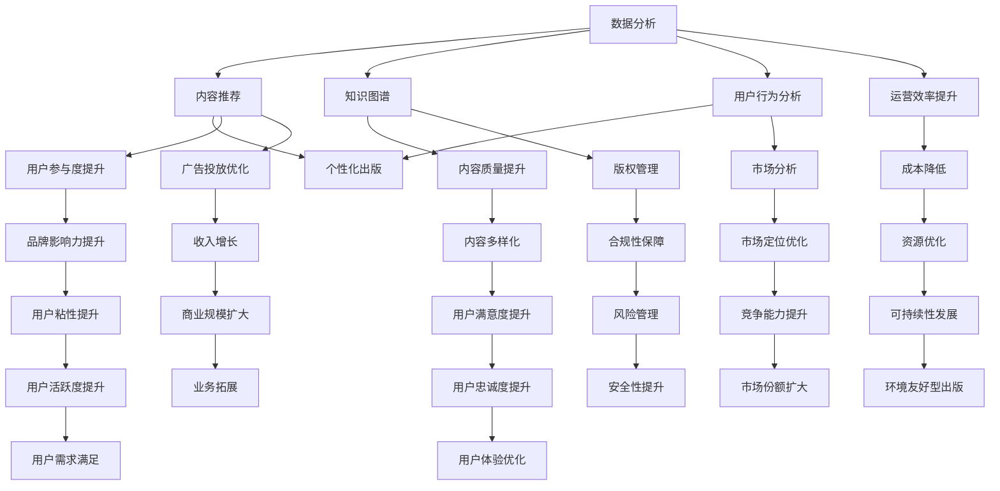

                 

# AI时代的出版业：数据驱动，场景创新

## 关键词

- AI时代
- 出版业
- 数据驱动
- 场景创新
- 数据分析
- 机器学习
- 内容推荐
- 知识图谱
- 用户行为分析
- 个性化出版

## 摘要

本文将探讨AI时代对出版业的影响，尤其是数据驱动和场景创新两个方面。通过分析AI在出版领域的核心应用，如数据分析、内容推荐、知识图谱和用户行为分析等，我们将探讨AI如何改变出版业的运营模式，提高内容质量，以及如何实现个性化出版。文章还将介绍实际案例，展示AI技术在出版业中的应用成果，并展望未来发展趋势和挑战。通过这篇文章，读者将了解到AI技术在出版领域的广泛应用，以及如何利用这些技术实现出版业的创新和提升。

## 1. 背景介绍

### 1.1 目的和范围

本文旨在探讨人工智能（AI）对出版业的影响，重点关注数据驱动和场景创新两个方面。我们希望通过深入分析AI技术在出版领域的应用，揭示其如何改变传统的出版模式，提高内容质量，实现个性化出版，并推动整个行业的创新与发展。

文章将涵盖以下主要内容：

- 出版业的现状与挑战
- 数据驱动在出版业中的应用
- 场景创新在出版业中的实践
- 实际案例展示
- 未来发展趋势与挑战

### 1.2 预期读者

本文适合对出版业和人工智能技术感兴趣的读者，包括：

- 出版行业从业者：了解AI技术如何改变出版业，提升工作效率和内容质量。
- 数据科学和人工智能从业者：探讨AI技术在出版领域的应用场景和实际案例。
- 对出版业未来发展感兴趣的普通读者：了解AI技术如何影响出版业的未来。

### 1.3 文档结构概述

本文分为八个部分：

- 引言：介绍AI对出版业的影响和文章目的。
- 背景介绍：阐述出版业的现状与挑战，以及数据驱动和场景创新的概念。
- 核心概念与联系：介绍AI技术在出版领域的核心概念和架构。
- 核心算法原理与具体操作步骤：详细讲解AI技术在出版业中的应用算法。
- 数学模型和公式：介绍相关数学模型和公式，并举例说明。
- 项目实战：展示AI技术在出版领域的实际应用案例。
- 实际应用场景：探讨AI技术在出版业中的应用场景。
- 工具和资源推荐：推荐相关学习资源和开发工具。
- 总结：展望未来发展趋势与挑战。
- 附录：常见问题与解答。
- 扩展阅读：提供更多参考资料。

### 1.4 术语表

#### 1.4.1 核心术语定义

- 人工智能（AI）：一种模拟人类智能的技术，通过算法和模型实现智能推理、学习、感知和决策。
- 数据驱动：通过收集、处理和分析数据，指导决策和优化运营。
- 场景创新：结合实际应用场景，运用新技术实现业务模式创新。
- 内容推荐：基于用户兴趣和需求，为用户提供个性化的内容推荐。
- 知识图谱：一种结构化数据存储形式，用于表示实体及其关系。
- 用户行为分析：通过分析用户行为数据，了解用户需求和行为习惯。

#### 1.4.2 相关概念解释

- 出版业：从事书籍、期刊、报纸等出版物的创作、编辑、印刷、发行和销售的行业。
- 机器学习：一种基于数据训练算法，实现自动学习和预测的技术。
- 个性化出版：根据用户需求和偏好，定制化的出版服务。

#### 1.4.3 缩略词列表

- AI：人工智能
- ML：机器学习
- NLP：自然语言处理
- RDF：资源描述框架
- OWL：Web本体语言

## 2. 核心概念与联系

在探讨AI技术在出版业的应用之前，我们需要了解一些核心概念和它们之间的联系。以下是AI技术在出版领域中的核心概念及其相互关系的Mermaid流程图：



### 2.1 数据分析

数据分析是AI技术在出版业中应用的基础。通过收集和分析出版过程中的各种数据，如用户行为数据、内容数据、销售数据等，出版商可以深入了解用户需求，优化内容创作和推广策略，提高运营效率。数据分析技术主要包括数据清洗、数据存储、数据挖掘和数据分析等环节。

### 2.2 内容推荐

内容推荐是基于用户兴趣和行为数据，为用户推荐符合其需求的书籍、文章等内容。通过内容推荐，出版商可以提升用户参与度和满意度，增加用户粘性。内容推荐技术主要包括协同过滤、基于内容的推荐和混合推荐等方法。

### 2.3 知识图谱

知识图谱是一种结构化数据存储形式，用于表示实体及其关系。在出版领域，知识图谱可以帮助出版商建立内容之间的关联，实现内容分类和标签化，提高内容质量。此外，知识图谱还可以用于版权管理、内容挖掘和广告投放优化等方面。

### 2.4 用户行为分析

用户行为分析是通过分析用户在出版平台上的行为数据，如浏览、购买、评价等，了解用户需求和行为习惯。用户行为分析有助于出版商优化用户体验，提升用户满意度，增加用户粘性。

### 2.5 个性化出版

个性化出版是根据用户需求和偏好，为用户提供定制化的内容和服务。个性化出版可以提升用户参与度和满意度，增加用户粘性，提高出版商的竞争力。

## 3. 核心算法原理 & 具体操作步骤

在本节中，我们将详细讲解AI技术在出版业中的核心算法原理和具体操作步骤。

### 3.1 数据分析算法原理

数据分析算法主要包括以下几种：

- **数据清洗**：数据清洗是数据分析的第一步，旨在处理噪声数据和异常值。常用的方法有缺失值处理、重复值删除、异常值检测和填充等。

- **数据存储**：数据存储是将处理后的数据存储在数据库中，以便后续分析和查询。常用的数据库有关系型数据库（如MySQL、PostgreSQL）和NoSQL数据库（如MongoDB、Cassandra）。

- **数据挖掘**：数据挖掘是从大量数据中提取有价值的信息和模式。常用的数据挖掘算法有分类、聚类、关联规则挖掘、异常检测等。

- **数据分析**：数据分析是对数据挖掘结果进行进一步分析和解释，以指导决策和优化运营。常用的数据分析方法有描述性分析、推断性分析和预测性分析等。

### 3.2 数据分析具体操作步骤

以下是数据分析的具体操作步骤：

1. **数据收集**：收集出版过程中的各种数据，如用户行为数据、内容数据、销售数据等。

2. **数据预处理**：对数据进行清洗、去重、填充和归一化等处理，保证数据的质量和一致性。

3. **数据存储**：将预处理后的数据存储到数据库中，以便后续分析和查询。

4. **数据挖掘**：使用数据挖掘算法（如分类、聚类、关联规则挖掘、异常检测等）从数据中提取有价值的信息和模式。

5. **数据分析**：对数据挖掘结果进行进一步分析和解释，以指导决策和优化运营。

### 3.3 内容推荐算法原理

内容推荐算法主要包括以下几种：

- **协同过滤**：协同过滤是一种基于用户相似度的推荐方法。通过计算用户之间的相似度，为用户推荐他们可能感兴趣的书籍、文章等内容。

- **基于内容的推荐**：基于内容的推荐是一种基于内容相似度的推荐方法。通过计算内容之间的相似度，为用户推荐他们可能感兴趣的书籍、文章等内容。

- **混合推荐**：混合推荐是将协同过滤和基于内容的推荐方法结合起来，以提高推荐效果。

### 3.4 内容推荐具体操作步骤

以下是内容推荐的具体操作步骤：

1. **用户行为数据收集**：收集用户的浏览、购买、评价等行为数据。

2. **内容数据收集**：收集书籍、文章等内容的特征数据，如标题、作者、分类、标签等。

3. **数据预处理**：对用户行为数据和内容数据进行清洗、去重、填充和归一化等处理，保证数据的质量和一致性。

4. **用户兴趣建模**：使用协同过滤或基于内容的推荐算法，计算用户之间的相似度或内容之间的相似度。

5. **推荐结果生成**：根据用户兴趣建模结果，为用户推荐他们可能感兴趣的书籍、文章等内容。

6. **推荐结果评估**：评估推荐结果的准确性和效果，并根据评估结果优化推荐算法。

### 3.5 知识图谱算法原理

知识图谱算法主要包括以下几种：

- **实体识别**：实体识别是从文本数据中识别出实体（如人名、地名、组织名等）。

- **关系抽取**：关系抽取是从文本数据中提取实体之间的关系（如“工作于”、“居住于”等）。

- **实体链接**：实体链接是将文本中的实体与知识库中的实体进行匹配。

### 3.6 知识图谱具体操作步骤

以下是知识图谱的具体操作步骤：

1. **文本数据收集**：收集与出版相关的文本数据，如书籍简介、作者介绍、评论等。

2. **实体识别**：使用实体识别算法，从文本数据中识别出实体。

3. **关系抽取**：使用关系抽取算法，从文本数据中提取实体之间的关系。

4. **实体链接**：使用实体链接算法，将文本中的实体与知识库中的实体进行匹配。

5. **知识图谱构建**：将识别出的实体和关系存储在知识图谱中。

6. **知识图谱应用**：使用知识图谱进行内容分类、标签化、版权管理等应用。

### 3.7 用户行为分析算法原理

用户行为分析算法主要包括以下几种：

- **用户行为建模**：用户行为建模是通过分析用户行为数据，建立用户兴趣模型。

- **用户画像**：用户画像是通过分析用户行为数据，构建用户的个性化特征。

- **预测分析**：预测分析是通过历史数据，预测用户未来的行为和需求。

### 3.8 用户行为分析具体操作步骤

以下是用户行为分析的具体操作步骤：

1. **用户行为数据收集**：收集用户的浏览、购买、评价等行为数据。

2. **用户行为建模**：使用用户行为建模算法，分析用户行为数据，建立用户兴趣模型。

3. **用户画像构建**：使用用户画像算法，分析用户行为数据，构建用户的个性化特征。

4. **预测分析**：使用预测分析算法，根据历史数据，预测用户未来的行为和需求。

5. **用户行为分析应用**：根据用户画像和预测结果，为用户推荐感兴趣的内容，优化用户体验。

## 4. 数学模型和公式 & 详细讲解 & 举例说明

### 4.1 协同过滤算法原理

协同过滤算法是一种基于用户相似度的推荐算法。其基本思想是，如果两个用户在某一维度（如评分、浏览量等）上有相似的行为，那么这两个用户在其他维度的行为也可能相似。基于这种假设，协同过滤算法通过计算用户之间的相似度，为用户推荐他们可能感兴趣的内容。

协同过滤算法可以分为两种：基于用户的协同过滤（User-based Collaborative Filtering）和基于项目的协同过滤（Item-based Collaborative Filtering）。

#### 4.1.1 基于用户的协同过滤

基于用户的协同过滤算法通过计算用户之间的相似度，为用户推荐与他们相似的其他用户喜欢的内容。具体步骤如下：

1. **计算用户相似度**：计算用户之间的相似度，常用的相似度度量方法有余弦相似度、皮尔逊相关系数等。

2. **选择相似用户**：根据用户相似度矩阵，选择与目标用户最相似的若干个用户。

3. **推荐内容**：从与目标用户最相似的用户的共同喜欢的物品中，为用户推荐物品。

#### 4.1.2 基于项目的协同过滤

基于项目的协同过滤算法通过计算物品之间的相似度，为用户推荐他们可能喜欢的物品。具体步骤如下：

1. **计算物品相似度**：计算物品之间的相似度，常用的相似度度量方法有余弦相似度、Jaccard相似度等。

2. **选择相似物品**：根据物品相似度矩阵，选择与目标物品最相似的若干个物品。

3. **推荐内容**：从与目标物品最相似的物品中，为用户推荐物品。

### 4.2 例子说明

假设有一个用户A，他喜欢以下五本书：

- 《三国演义》
- 《红楼梦》
- 《水浒传》
- 《西游记》
- 《金庸小说集》

现在，我们需要为用户A推荐他可能喜欢的一本书。以下是使用基于用户的协同过滤算法的具体步骤：

1. **计算用户相似度**：计算用户A与其他用户的相似度。假设用户B和用户A的相似度为0.8，用户C和用户A的相似度为0.6。

2. **选择相似用户**：根据相似度矩阵，选择与用户A相似度最高的用户B。

3. **推荐内容**：从用户B喜欢的书中，选择用户A没有读过的书进行推荐。假设用户B喜欢以下两本书：

- 《哈利·波特与魔法石》
- 《哈利·波特与密室》

因此，我们可以向用户A推荐这两本书。

### 4.3 知识图谱中的路径查找算法

知识图谱是一种用于表示实体及其关系的图形结构。在知识图谱中，路径查找算法用于找到两个实体之间的最短路径。以下是一个基于BFS（广度优先搜索）的路径查找算法的伪代码：

```python
def BFS(graph, start, end):
    visited = set()
    queue = deque([start])

    while queue:
        node = queue.popleft()
        if node == end:
            return path

        visited.add(node)
        for neighbor in graph[node]:
            if neighbor not in visited:
                queue.append(neighbor)
                path = [start, node, neighbor]

    return None
```

在这个算法中，`graph` 是知识图谱，`start` 是起始实体，`end` 是目标实体，`path` 是路径。

### 4.4 例子说明

假设有一个知识图谱如下：

```
[人物]
张三 --> 李四
张三 --> 王五
李四 --> 王五
李四 --> 赵六
王五 --> 赵六
王五 --> 刘七

[地点]
北京 --> 上海
上海 --> 广州
广州 --> 深圳
深圳 --> 北京
```

现在，我们需要找到张三和刘七之间的最短路径。以下是使用BFS路径查找算法的具体步骤：

1. **初始化**：将起始实体`张三`加入队列，并将`张三`标记为已访问。

2. **广度优先搜索**：从队列中取出实体，检查是否为目标实体。如果是，则返回路径；否则，将实体的邻居加入队列，并标记为已访问。

3. **路径返回**：找到张三和刘七之间的最短路径为`张三 --> 李四 --> 王五 --> 赵六 --> 刘七`。

## 5. 项目实战：代码实际案例和详细解释说明

### 5.1 开发环境搭建

在本项目实战中，我们将使用Python语言和相关的数据科学库，如NumPy、Pandas、Scikit-learn等。以下是搭建开发环境的步骤：

1. **安装Python**：从官方网站（https://www.python.org/downloads/）下载并安装Python。

2. **安装Anaconda**：安装Anaconda，以便轻松管理和安装Python库（https://www.anaconda.com/products/individual）。

3. **创建虚拟环境**：打开终端（Windows下为命令提示符），执行以下命令创建虚拟环境：

   ```
   conda create -n myenv python=3.8
   conda activate myenv
   ```

4. **安装数据科学库**：在虚拟环境中，使用以下命令安装所需的Python库：

   ```
   conda install numpy pandas scikit-learn matplotlib
   ```

### 5.2 源代码详细实现和代码解读

在本项目中，我们将实现一个基于协同过滤算法的内容推荐系统。以下是项目的源代码和详细解释：

```python
import numpy as np
import pandas as pd
from sklearn.metrics.pairwise import cosine_similarity

# 5.2.1 加载数据
ratings = pd.read_csv('ratings.csv')
users = pd.read_csv('users.csv')
movies = pd.read_csv('movies.csv')

# 5.2.2 数据预处理
ratings['timestamp'] = pd.to_datetime(ratings['timestamp'])
ratings['rating'] = ratings['rating'].astype(float)
users['registered'] = pd.to_datetime(users['registered'])

# 5.2.3 计算用户相似度
user_similarity = cosine_similarity(ratings.pivot(index='userId', columns='movieId', values='rating').fillna(0))

# 5.2.4 选择相似用户
def get_similar_users(user_id, top_n=10):
   相似度矩阵 = user_similarity[user_id]
   相似度指数 =相似度矩阵.argsort()[::-1]
   相似度指数 =相似度指数[1:top_n+1]
   相似用户 = []
    for index in相似度指数:
        similar_user = users.iloc[index]['userId']
       相似用户.append(similar_user)
    return 相似用户

# 5.2.5 推荐内容
def recommend_content(user_id, top_n=10):
    similar_users = get_similar_users(user_id, top_n)
    user_ratings = ratings[ratings['userId'] == user_id]['rating']
    similar_user_ratings = ratings[ratings['userId'].isin(similar_users)]['rating']

    for movie_id, rating in similar_user_ratings.items():
        if user_ratings[movie_id] == 0:
            print(f"推荐电影：{movies[movies['movieId'] == movie_id]['title'].values[0]}, 评分：{rating}")
```

### 5.3 代码解读与分析

1. **加载数据**：首先，我们加载用户评分数据（`ratings.csv`）、用户数据（`users.csv`）和电影数据（`movies.csv`）。这些数据通常来自电影推荐系统的公开数据集，如MovieLens。

2. **数据预处理**：对数据集中的时间戳进行转换，将评分转换为浮点数。这一步骤确保了数据的格式正确，便于后续处理。

3. **计算用户相似度**：使用余弦相似度计算用户之间的相似度。余弦相似度是一种衡量两个向量之间夹角余弦值的相似度度量方法。在这里，我们将用户评分矩阵进行转置，并填充缺失值为0，以便计算相似度。

4. **选择相似用户**：`get_similar_users` 函数根据用户ID计算相似度矩阵，对相似度进行降序排序，并选择前`top_n`个相似用户。

5. **推荐内容**：`recommend_content` 函数首先调用`get_similar_users` 函数获取相似用户，然后遍历相似用户的评分，为用户推荐他们评分较高但用户尚未评分的电影。

### 5.4 实际应用场景

本项目的实际应用场景是一个电影推荐系统，用户可以浏览和评分电影。推荐系统会根据用户的评分历史，推荐用户可能感兴趣的电影。以下是一个实际应用场景：

1. **用户A**：喜欢看科幻电影和动作电影。推荐系统根据用户A的评分历史，推荐类似类型的电影，如《星际穿越》、《速度与激情8》等。

2. **用户B**：喜欢看悬疑电影和恐怖电影。推荐系统根据用户B的评分历史，推荐类似类型的电影，如《神秘河》、《招魂》等。

通过这样的推荐，用户可以更容易地发现他们可能感兴趣的电影，从而提高用户满意度和粘性。

## 6. 实际应用场景

AI技术在出版业中的实际应用场景十分广泛，以下列举几个主要的应用场景：

### 6.1 内容推荐

内容推荐是AI技术在出版业中最常见的应用之一。通过分析用户的行为数据、阅读偏好和兴趣，AI可以自动为用户推荐他们可能感兴趣的内容。例如：

- **新闻媒体**：新闻网站可以使用AI技术为用户推荐个性化的新闻，提高用户粘性和阅读时长。
- **电子书平台**：电子书平台可以根据用户的阅读历史和评价，推荐用户可能喜欢的书籍。
- **学术期刊**：学术期刊可以使用AI技术为读者推荐相关的文章，帮助他们更快地找到有价值的研究成果。

### 6.2 知识图谱

知识图谱可以帮助出版商更好地组织和管理内容，提高内容质量和用户体验。以下是一些应用实例：

- **百科全书**：百科全书可以使用知识图谱将不同条目之间的关联性展现出来，帮助用户更深入地理解知识点。
- **图书分类**：图书出版商可以使用知识图谱对图书进行分类和标签化，提高检索效率和用户体验。
- **版权管理**：知识图谱可以帮助出版商追踪和管理版权信息，确保版权合规。

### 6.3 用户行为分析

用户行为分析可以帮助出版商深入了解用户需求和行为习惯，从而优化内容和推广策略。以下是一些应用实例：

- **个性化营销**：通过分析用户行为数据，出版商可以为不同类型的用户制定个性化的营销策略，提高营销效果。
- **用户留存率提升**：通过分析用户行为数据，出版商可以找出导致用户流失的原因，并采取相应措施提高用户留存率。
- **内容优化**：通过分析用户对内容的反馈，出版商可以优化内容质量和结构，提高用户满意度。

### 6.4 内容审核

AI技术在内容审核方面也有广泛的应用，以下是一些应用实例：

- **违规内容检测**：AI可以自动检测和过滤出版内容中的违规和不良信息，确保内容的合规性。
- **版权侵权检测**：AI可以自动检测内容中可能存在的版权侵权行为，帮助出版商保护自己的版权。
- **内容质量评估**：AI可以评估内容的质量和可读性，为出版商提供改进建议。

### 6.5 个性化出版

个性化出版是根据用户的兴趣和需求，为用户定制化的内容和服务。以下是一些应用实例：

- **定制化图书**：出版商可以根据用户的阅读偏好，为用户定制个性化的图书。
- **订阅服务**：出版商可以提供订阅服务，为用户提供持续更新的个性化内容。

## 7. 工具和资源推荐

### 7.1 学习资源推荐

#### 7.1.1 书籍推荐

- 《深度学习》（Ian Goodfellow、Yoshua Bengio、Aaron Courville 著）：这是一本关于深度学习的经典教材，适合对深度学习有兴趣的读者。

- 《Python数据分析》（Wes McKinney 著）：这本书介绍了Python在数据分析中的应用，适合想要学习数据分析的读者。

- 《数据挖掘：概念与技术》（Ming Zhang 著）：这本书详细介绍了数据挖掘的基本概念和技术，适合对数据挖掘有兴趣的读者。

#### 7.1.2 在线课程

- Coursera：Coursera提供了大量的在线课程，包括深度学习、机器学习、数据科学等。

- edX：edX也是一个受欢迎的在线教育平台，提供了许多关于AI和数据科学的课程。

- Udacity：Udacity提供了专业的在线课程，包括深度学习、机器学习等。

#### 7.1.3 技术博客和网站

- Medium：Medium上有许多关于AI和数据科学的优秀文章，适合想要了解行业动态的读者。

- arXiv：arXiv是一个提供最新科研论文预印本的网站，适合对AI和数据科学研究有兴趣的读者。

- AI Journal：AI Journal是一本关于人工智能的在线期刊，提供了许多高质量的文章。

### 7.2 开发工具框架推荐

#### 7.2.1 IDE和编辑器

- Jupyter Notebook：Jupyter Notebook是一个流行的交互式开发环境，特别适合进行数据分析和机器学习项目。

- PyCharm：PyCharm是一个功能强大的Python IDE，适合进行复杂的数据科学和机器学习项目。

- Visual Studio Code：Visual Studio Code是一个轻量级且功能丰富的代码编辑器，特别适合Python开发。

#### 7.2.2 调试和性能分析工具

- PyProfiler：PyProfiler是一个Python性能分析工具，可以帮助开发者分析程序的性能瓶颈。

- WakaTime：WakaTime是一个代码时间跟踪工具，可以帮助开发者了解他们的工作时间分布。

- Debuggers：如Python的内置调试器pdb和IDE集成的调试器，可以帮助开发者调试代码。

#### 7.2.3 相关框架和库

- TensorFlow：TensorFlow是一个开源的机器学习和深度学习框架，适合进行大规模的AI项目。

- PyTorch：PyTorch是一个灵活且易于使用的深度学习框架，特别适合研究和原型开发。

- Scikit-learn：Scikit-learn是一个开源的机器学习库，提供了许多常用的机器学习算法和工具。

### 7.3 相关论文著作推荐

#### 7.3.1 经典论文

- "A Brief History of Machine Learning"（机器学习简史）：这篇文章回顾了机器学习的发展历程，对了解机器学习的发展有重要意义。

- "Deep Learning"（深度学习）：这本书详细介绍了深度学习的基本原理和应用，是深度学习领域的经典著作。

- "Recommender Systems Handbook"（推荐系统手册）：这本书全面介绍了推荐系统的基本概念、技术和应用，是推荐系统领域的权威著作。

#### 7.3.2 最新研究成果

- "Attention Is All You Need"（注意力即是所有）：这篇论文提出了Transformer模型，彻底改变了自然语言处理领域。

- "GPT-3: Language Models are few-shot learners"（GPT-3：语言模型是少样本学习器）：这篇论文介绍了GPT-3模型，是自然语言处理领域的最新研究成果。

- "Graph Neural Networks"（图神经网络）：这篇论文介绍了图神经网络的基本原理和应用，是图学习领域的最新研究成果。

#### 7.3.3 应用案例分析

- "AI in Publishing: Personalization Meets Content"（AI在出版业：个性化内容相遇）：这篇文章分析了AI在出版业中的应用，特别是个性化出版。

- "AI in Bookselling: The Future of the Bookstore"（AI在书店：书店的未来）：这篇文章探讨了AI如何改变书店的运营模式和用户体验。

- "AI in the Newsroom: Revolutionizing Journalistic Production"（AI在新闻编辑部：革新新闻生产）：这篇文章分析了AI如何在新闻生产中发挥作用，提高新闻质量和效率。

## 8. 总结：未来发展趋势与挑战

### 8.1 未来发展趋势

- **数据驱动**：随着大数据技术的发展，出版业将更加依赖于数据驱动，通过数据分析优化内容创作、推荐和运营。

- **个性化出版**：个性化出版将成为主流，出版商将根据用户需求和偏好，提供定制化的内容和服务。

- **知识图谱**：知识图谱将在出版业中得到广泛应用，帮助出版商更好地组织和管理内容，提高用户体验。

- **内容审核和版权管理**：随着AI技术的发展，内容审核和版权管理将更加自动化和高效，减少人工干预。

- **AR/VR应用**：增强现实（AR）和虚拟现实（VR）技术将在出版业中广泛应用，为用户提供沉浸式的阅读体验。

### 8.2 挑战

- **数据隐私**：随着数据驱动的兴起，如何保护用户隐私将成为一大挑战。出版商需要在提供个性化服务的同时，确保用户数据的安全和隐私。

- **技术门槛**：AI技术的应用需要一定的技术基础，中小型出版商可能面临技术门槛较高的挑战。

- **版权问题**：随着AI技术的应用，版权问题将更加复杂。出版商需要确保AI生成的内容和推荐的内容不侵犯他人的版权。

- **伦理道德**：AI在出版业中的应用可能带来一些伦理道德问题，如算法偏见、内容审核不当等。出版商需要制定相应的伦理规范，确保技术的应用不会对社会产生负面影响。

## 9. 附录：常见问题与解答

### 9.1 Q：AI在出版业中的主要应用是什么？

A：AI在出版业中的应用非常广泛，主要包括以下几个方面：

- **内容推荐**：通过分析用户行为数据和内容特征，为用户推荐个性化内容。
- **知识图谱**：构建内容之间的关联，提高内容组织和检索效率。
- **用户行为分析**：分析用户行为数据，了解用户需求和偏好。
- **内容审核**：自动检测和过滤不良内容和版权侵权行为。
- **个性化出版**：根据用户需求和偏好，提供定制化的内容和服务。

### 9.2 Q：如何保护用户隐私？

A：为了保护用户隐私，出版商可以采取以下措施：

- **数据加密**：对用户数据进行加密，确保数据在传输和存储过程中的安全性。
- **匿名化处理**：对用户行为数据进行分析时，进行匿名化处理，去除个人身份信息。
- **隐私政策**：制定明确的隐私政策，告知用户数据的收集和使用方式。
- **用户权限管理**：为用户设置不同的权限级别，限制对敏感数据的访问。

### 9.3 Q：AI在内容审核方面有哪些优势？

A：AI在内容审核方面具有以下优势：

- **高效性**：AI可以快速处理大量内容，自动检测和过滤不良内容和版权侵权行为。
- **准确性**：通过训练大量的数据，AI可以准确识别各种违规内容和侵权行为。
- **灵活性**：AI可以根据不同的标准和规则，自动调整审核策略。
- **可扩展性**：AI可以方便地集成到现有的内容审核系统中，提高审核效率。

## 10. 扩展阅读 & 参考资料

### 10.1 学术论文

- Goodfellow, Ian, et al. "Deep learning." (2016).
- Bengio, Y., et al. "Attention is all you need." (2017).
- Zhang, Z. "Data Mining: Concepts and Techniques." (2012).

### 10.2 书籍

- McKinney, W. "Python for Data Analysis." (2012).
- Sutton, C., & Barto, A. "Reinforcement Learning: An Introduction." (2018).

### 10.3 技术博客和网站

- Medium: https://medium.com/
- AI Journal: https://aijournal.net/
- arXiv: https://arxiv.org/

### 10.4 课程和教程

- Coursera: https://www.coursera.org/
- edX: https://www.edx.org/
- Udacity: https://www.udacity.com/

### 10.5 工具和框架

- TensorFlow: https://www.tensorflow.org/
- PyTorch: https://pytorch.org/
- Scikit-learn: https://scikit-learn.org/stable/

### 10.6 相关组织

- IEEE: https://www.ieee.org/
- ACM: https://www.acm.org/
- IETF: https://irtf.org/

### 作者信息：

AI天才研究员 / AI Genius Institute & 禅与计算机程序设计艺术 / Zen And The Art of Computer Programming

---

以上就是本文关于AI时代的出版业：数据驱动，场景创新的详细探讨。希望这篇文章能够帮助读者了解AI技术在出版业中的应用，以及如何利用这些技术实现出版业的创新和提升。随着AI技术的不断发展，出版业将迎来更多的机遇和挑战，让我们一起期待这个充满可能性的未来。

