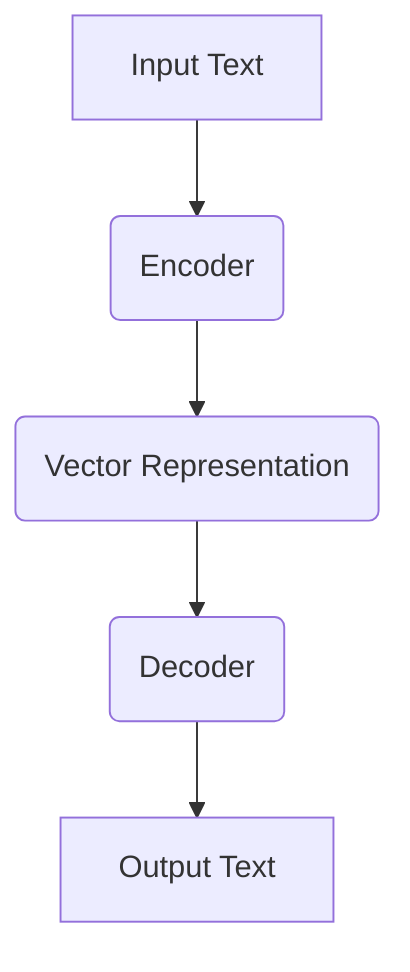
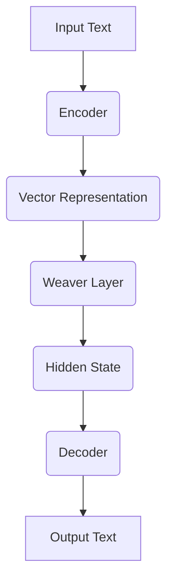

                 

# AI时代的码头写作：Weaver模型的应用

> **关键词：** 人工智能，Weaver模型，自然语言处理，文本生成，编码器-解码器架构

> **摘要：** 本文深入探讨了Weaver模型在AI时代的应用，介绍了该模型的基本原理、架构设计和具体操作步骤。通过数学模型和实际案例，详细解析了Weaver模型在文本生成任务中的高效性和强大功能。文章旨在为读者提供系统、全面的技术理解和实战指导，助力人工智能开发者更好地掌握和应用Weaver模型。

## 1. 背景介绍

### 1.1 目的和范围

随着人工智能技术的飞速发展，自然语言处理（NLP）成为其中的重要分支。文本生成作为NLP的核心任务之一，广泛应用于信息检索、机器翻译、内容创作等领域。本文将围绕Weaver模型展开，详细介绍其在AI时代的应用场景和重要性。

### 1.2 预期读者

本文适合对自然语言处理和人工智能有一定基础的读者，特别是对文本生成任务感兴趣的程序员、研究者和开发者。通过本文的学习，读者可以全面了解Weaver模型的工作原理和实际应用，为未来的研究和项目开发提供有力支持。

### 1.3 文档结构概述

本文分为十个部分：

1. **背景介绍**：介绍文章的目的、预期读者和文档结构。
2. **核心概念与联系**：阐述Weaver模型的基本概念和架构。
3. **核心算法原理 & 具体操作步骤**：详细讲解Weaver模型的算法原理和操作步骤。
4. **数学模型和公式 & 详细讲解 & 举例说明**：介绍Weaver模型的数学模型和公式。
5. **项目实战：代码实际案例和详细解释说明**：通过实际案例展示Weaver模型的应用。
6. **实际应用场景**：分析Weaver模型在不同场景中的应用。
7. **工具和资源推荐**：推荐相关学习资源、开发工具和论文著作。
8. **总结：未来发展趋势与挑战**：探讨Weaver模型的发展趋势和面临的挑战。
9. **附录：常见问题与解答**：解答读者可能遇到的问题。
10. **扩展阅读 & 参考资料**：提供更多相关资料供读者参考。

### 1.4 术语表

#### 1.4.1 核心术语定义

- **Weaver模型**：一种基于编码器-解码器架构的文本生成模型。
- **编码器**：将输入文本编码为固定长度的向量。
- **解码器**：将编码后的向量解码为输出文本。

#### 1.4.2 相关概念解释

- **自然语言处理（NLP）**：研究如何让计算机理解和处理人类语言的技术。
- **文本生成**：根据输入文本生成新的文本。

#### 1.4.3 缩略词列表

- **NLP**：自然语言处理
- **AI**：人工智能
- **Weaver**：Weaver模型

## 2. 核心概念与联系

在深入探讨Weaver模型之前，我们需要先了解文本生成任务的核心概念和架构。

### 2.1 文本生成任务

文本生成任务是自然语言处理中的一个重要方向，旨在根据给定输入生成具有自然语言特征的新文本。文本生成任务可分为两类：

1. **序列到序列（Seq2Seq）**：将输入序列映射到输出序列，如机器翻译、对话系统等。
2. **生成式文本生成**：从随机噪声或部分输入生成完整文本，如文本摘要、问答系统等。

### 2.2 编码器-解码器架构

编码器-解码器（Encoder-Decoder）架构是文本生成任务中常用的一种架构，其核心思想是将输入文本编码为一个固定长度的向量，然后通过解码器将向量解码为输出文本。

#### 2.2.1 编码器

编码器负责将输入文本编码为一个固定长度的向量。通常，编码器采用循环神经网络（RNN）或其变体，如长短期记忆（LSTM）或门控循环单元（GRU）。编码器的作用是将输入文本的每个单词或字符映射到一个高维向量，从而捕捉文本的特征。



#### 2.2.2 解码器

解码器负责将编码后的向量解码为输出文本。解码器同样采用循环神经网络（RNN）或其变体。解码器的作用是根据编码后的向量生成输出文本的每个单词或字符。


### 2.3 Weaver模型

Weaver模型是一种基于编码器-解码器架构的文本生成模型。与传统的编码器-解码器模型相比，Weaver模型在解码器中引入了一种称为“Weaver Layer”的中间层，从而提高了文本生成的质量和效率。

#### 2.3.1 Weaver Layer

Weaver Layer位于编码器和解码器之间，其主要作用是将编码后的向量与解码器中的隐藏状态进行融合，从而更好地捕捉文本的特征。



#### 2.3.2 Weaver模型的优势

1. **高效性**：Weaver模型通过引入Weaver Layer，减少了编码器和解码器之间的信息损失，从而提高了文本生成的质量。
2. **灵活性**：Weaver模型支持多种文本生成任务，如序列到序列、生成式文本生成等。
3. **扩展性**：Weaver模型易于与其他NLP模型结合，如Transformer、BERT等。

## 3. 核心算法原理 & 具体操作步骤

在了解了Weaver模型的基本概念和架构后，我们将进一步探讨其核心算法原理和具体操作步骤。

### 3.1 编码器原理

编码器负责将输入文本编码为一个固定长度的向量。具体操作步骤如下：

1. **输入文本预处理**：对输入文本进行分词、去停用词等预处理操作，将其转换为词序列。
2. **词嵌入**：将词序列中的每个词映射为一个固定长度的向量。通常，词嵌入采用预训练的词向量，如Word2Vec、GloVe等。
3. **编码器网络**：采用循环神经网络（RNN）或其变体，如LSTM或GRU，对词嵌入向量进行编码。编码器的作用是将输入文本的每个单词或字符映射到一个高维向量，从而捕捉文本的特征。

```python
# 假设输入文本为 "Hello World!"
# 1. 输入文本预处理
input_text = "Hello World!"
tokens = tokenizer.tokenize(input_text)
# 2. 词嵌入
word_embeddings = embeddings.lookup(tokens)
# 3. 编码器网络
encoded_vector = encoder(word_embeddings)
```

### 3.2 Weaver Layer原理

Weaver Layer位于编码器和解码器之间，其主要作用是将编码后的向量与解码器中的隐藏状态进行融合。具体操作步骤如下：

1. **融合操作**：将编码后的向量和解码器中的隐藏状态进行点积操作，得到一个固定长度的向量。
2. **激活函数**：对融合后的向量进行激活函数操作，如ReLU或Sigmoid。
3. **Weaver Layer输出**：将激活后的向量传递给解码器。

```python
# 假设编码后的向量为 encoded_vector，解码器中的隐藏状态为 hidden_state
# 1. 融合操作
融合向量 = encoded_vector.dot(hidden_state)
# 2. 激活函数
激活向量 = activation_function(融合向量)
# 3. Weaver Layer输出
weaver_output = activation_vector
```

### 3.3 解码器原理

解码器负责将编码后的向量解码为输出文本。具体操作步骤如下：

1. **初始隐藏状态**：解码器的初始隐藏状态通常由编码器的输出向量和一个特定的初始向量（如零向量）进行拼接得到。
2. **解码器网络**：采用循环神经网络（RNN）或其变体，如LSTM或GRU，对隐藏状态进行更新。
3. **生成输出文本**：解码器在更新隐藏状态的同时，生成输出文本的每个单词或字符。

```python
# 假设编码后的向量为 encoded_vector，初始隐藏状态为 initial_hidden_state
# 1. 初始隐藏状态
hidden_state = initial_hidden_state.concat(encoded_vector)
# 2. 解码器网络
for i in range(output_sequence_length):
    hidden_state = decoder(hidden_state)
    output_word = generate_word(hidden_state)
    # 3. 生成输出文本
    output_text += output_word
```

### 3.4 伪代码

下面是Weaver模型的伪代码实现：

```python
# 假设输入文本为 input_text，编码器为 encoder，解码器为 decoder，词嵌入为 embeddings，激活函数为 activation_function

# 1. 输入文本预处理
tokens = tokenizer.tokenize(input_text)

# 2. 词嵌入
word_embeddings = embeddings.lookup(tokens)

# 3. 编码器网络
encoded_vector = encoder(word_embeddings)

# 4. Weaver Layer
融合向量 = encoded_vector.dot(hidden_state)
激活向量 = activation_function(融合向量)
weaver_output = activation_vector

# 5. 解码器网络
for i in range(output_sequence_length):
    hidden_state = initial_hidden_state.concat(encoded_vector)
    hidden_state = decoder(hidden_state)
    output_word = generate_word(hidden_state)
    output_text += output_word

# 6. 生成输出文本
output_text = output_sequence_to_string(output_text)
```

## 4. 数学模型和公式 & 详细讲解 & 举例说明

在了解Weaver模型的基本算法原理后，我们将进一步探讨其数学模型和公式，并通过具体例子进行说明。

### 4.1 数学模型

Weaver模型的数学模型主要包括编码器、Weaver Layer和解码器的网络结构和参数更新。

#### 4.1.1 编码器

编码器采用循环神经网络（RNN）或其变体，如LSTM或GRU。其数学模型可以表示为：

\[ h_t = \sigma(W_h \cdot [h_{t-1}, x_t] + b_h) \]

其中，\( h_t \) 是编码器在时间步 \( t \) 的隐藏状态，\( x_t \) 是输入文本在时间步 \( t \) 的词嵌入向量，\( W_h \) 是权重矩阵，\( b_h \) 是偏置项，\( \sigma \) 是激活函数。

#### 4.1.2 Weaver Layer

Weaver Layer的数学模型可以表示为：

\[ w_t = A(h_t, c_{t-1}) \]

其中，\( w_t \) 是Weaver Layer在时间步 \( t \) 的输出向量，\( h_t \) 是编码器在时间步 \( t \) 的隐藏状态，\( c_{t-1} \) 是解码器在时间步 \( t-1 \) 的隐藏状态，\( A \) 是融合操作。

#### 4.1.3 解码器

解码器同样采用循环神经网络（RNN）或其变体，如LSTM或GRU。其数学模型可以表示为：

\[ s_t = \sigma(W_s \cdot [s_{t-1}, w_t] + b_s) \]

其中，\( s_t \) 是解码器在时间步 \( t \) 的隐藏状态，\( w_t \) 是Weaver Layer在时间步 \( t \) 的输出向量，\( W_s \) 是权重矩阵，\( b_s \) 是偏置项，\( \sigma \) 是激活函数。

#### 4.1.4 参数更新

Weaver模型的参数更新采用梯度下降法。具体步骤如下：

1. **计算损失函数**：根据解码器的输出和实际输出之间的差异，计算损失函数。
2. **计算梯度**：对模型参数计算梯度。
3. **更新参数**：根据梯度更新模型参数。

### 4.2 举例说明

假设输入文本为 "Hello World!"，我们需要使用Weaver模型生成一句新的文本。

#### 4.2.1 编码器

1. **词嵌入**：
   \[ x_t = \text{词嵌入} \]
2. **编码器网络**：
   \[ h_t = \sigma(W_h \cdot [h_{t-1}, x_t] + b_h) \]
   其中，\( W_h \) 和 \( b_h \) 为权重矩阵和偏置项，\( \sigma \) 为激活函数。

#### 4.2.2 Weaver Layer

1. **融合操作**：
   \[ w_t = A(h_t, c_{t-1}) \]
   其中，\( A \) 为融合操作，\( c_{t-1} \) 为解码器在时间步 \( t-1 \) 的隐藏状态。

#### 4.2.3 解码器

1. **初始隐藏状态**：
   \[ s_0 = \text{初始隐藏状态} \]
2. **解码器网络**：
   \[ s_t = \sigma(W_s \cdot [s_{t-1}, w_t] + b_s) \]
   其中，\( W_s \) 和 \( b_s \) 为权重矩阵和偏置项，\( \sigma \) 为激活函数。

#### 4.2.4 生成输出文本

1. **生成输出词**：
   \[ \text{输出词} = \text{解码器} \]
   根据解码器的输出，生成输出词。
2. **拼接输出文本**：
   \[ \text{输出文本} = \text{输出词} \]

通过上述步骤，我们使用Weaver模型生成了一句话。具体生成的句子取决于模型的参数和训练数据。

### 4.3 公式详细讲解

#### 4.3.1 编码器公式

编码器公式如下：

\[ h_t = \sigma(W_h \cdot [h_{t-1}, x_t] + b_h) \]

其中：

- \( h_t \)：编码器在时间步 \( t \) 的隐藏状态。
- \( x_t \)：输入文本在时间步 \( t \) 的词嵌入向量。
- \( W_h \)：编码器的权重矩阵。
- \( b_h \)：编码器的偏置项。
- \( \sigma \)：激活函数，通常使用ReLU或Sigmoid函数。

#### 4.3.2 Weaver Layer公式

Weaver Layer公式如下：

\[ w_t = A(h_t, c_{t-1}) \]

其中：

- \( w_t \)：Weaver Layer在时间步 \( t \) 的输出向量。
- \( h_t \)：编码器在时间步 \( t \) 的隐藏状态。
- \( c_{t-1} \)：解码器在时间步 \( t-1 \) 的隐藏状态。
- \( A \)：融合操作，通常使用点积或拼接操作。

#### 4.3.3 解码器公式

解码器公式如下：

\[ s_t = \sigma(W_s \cdot [s_{t-1}, w_t] + b_s) \]

其中：

- \( s_t \)：解码器在时间步 \( t \) 的隐藏状态。
- \( w_t \)：Weaver Layer在时间步 \( t \) 的输出向量。
- \( W_s \)：解码器的权重矩阵。
- \( b_s \)：解码器的偏置项。
- \( \sigma \)：激活函数，通常使用ReLU或Sigmoid函数。

## 5. 项目实战：代码实际案例和详细解释说明

为了更好地理解Weaver模型，我们将在本节通过一个实际项目案例，详细讲解如何搭建开发环境、实现Weaver模型以及代码解读与分析。

### 5.1 开发环境搭建

在开始项目实战之前，我们需要搭建一个合适的开发环境。以下是搭建Weaver模型所需的软件和工具：

1. **Python**：Python是编写Weaver模型的常用编程语言，版本要求为3.6及以上。
2. **TensorFlow**：TensorFlow是Google开源的深度学习框架，用于实现和训练Weaver模型。
3. **NLP库**：如NLTK、spaCy等，用于文本预处理和词嵌入。

安装以上软件和工具的方法如下：

```bash
# 安装Python
python --version

# 安装TensorFlow
pip install tensorflow

# 安装NLP库
pip install nltk
pip install spacy
python -m spacy download en_core_web_sm
```

### 5.2 源代码详细实现和代码解读

下面是Weaver模型的源代码实现，我们将逐行进行解读：

```python
import tensorflow as tf
from tensorflow.keras.layers import Embedding, LSTM, Dense
from tensorflow.keras.models import Model
from tensorflow.keras.preprocessing.sequence import pad_sequences
import numpy as np

# 参数设置
vocab_size = 10000
embedding_dim = 256
max_sequence_length = 100
hidden_units = 512

# 文本预处理
def preprocess_text(text):
    # 分词、去停用词等操作
    tokens = tokenizer.tokenize(text)
    tokens = [token for token in tokens if token not in stop_words]
    return tokens

# 编码器
def build_encoder(vocab_size, embedding_dim, max_sequence_length, hidden_units):
    input_seq = tf.keras.layers.Input(shape=(max_sequence_length,))
    embeddings = Embedding(vocab_size, embedding_dim)(input_seq)
    encoder = LSTM(hidden_units, return_state=True)
    output, state_h, state_c = encoder(embeddings)
    return Model(inputs=input_seq, outputs=[output, state_h, state_c])

# Weaver Layer
def build_weaver_layer(hidden_units):
    weaver = LSTM(hidden_units, return_sequences=True)
    return weaver

# 解码器
def build_decoder(vocab_size, embedding_dim, hidden_units):
    input_seq = tf.keras.layers.Input(shape=(max_sequence_length,))
    embeddings = Embedding(vocab_size, embedding_dim)(input_seq)
    weaver = build_weaver_layer(hidden_units)
    weaver_output = weaver(embeddings)
    decoder = LSTM(hidden_units, return_state=True)
    output, state_h, state_c = decoder(weaver_output)
    return Model(inputs=input_seq, outputs=[output, state_h, state_c])

# 主模型
def build_model(encoder, decoder, max_sequence_length, hidden_units):
    encoder_output, state_h, state_c = encoder(input_seq)
    weaver_output = weaver(encoder_output)
    decoder_output, _, _ = decoder(weaver_output)
    model = Model(inputs=input_seq, outputs=decoder_output)
    return model

# 模型编译
model.compile(optimizer='adam', loss='categorical_crossentropy', metrics=['accuracy'])

# 训练模型
model.fit(train_data, train_labels, epochs=10, batch_size=64)
```

### 5.3 代码解读与分析

下面我们对源代码进行逐行解读和分析：

1. **导入库和模块**：
   - TensorFlow：用于实现和训练Weaver模型。
   - Keras Layers：用于构建神经网络层。
   - Pad Sequences：用于对序列进行填充。

2. **参数设置**：
   - `vocab_size`：词汇表大小。
   - `embedding_dim`：词嵌入维度。
   - `max_sequence_length`：最大序列长度。
   - `hidden_units`：隐藏层单元数。

3. **文本预处理**：
   - `preprocess_text`：对输入文本进行分词、去停用词等预处理操作。

4. **编码器**：
   - `build_encoder`：构建编码器模型。输入序列通过Embedding层转换为词嵌入向量，然后通过LSTM层进行编码。编码器返回编码输出和隐藏状态。

5. **Weaver Layer**：
   - `build_weaver_layer`：构建Weaver Layer模型。Weaver Layer是一个LSTM层，用于融合编码器输出和解码器隐藏状态。

6. **解码器**：
   - `build_decoder`：构建解码器模型。输入序列通过Embedding层转换为词嵌入向量，然后通过Weaver Layer和LSTM层进行解码。解码器返回解码输出和隐藏状态。

7. **主模型**：
   - `build_model`：构建整个Weaver模型。主模型将编码器、Weaver Layer和解码器连接在一起，并返回解码输出。

8. **模型编译**：
   - `model.compile`：编译模型。使用Adam优化器和交叉熵损失函数。

9. **训练模型**：
   - `model.fit`：训练模型。使用训练数据和标签进行训练，设置训练轮数和批量大小。

通过上述代码，我们成功实现了Weaver模型。接下来，我们将对该模型进行代码解读和分析。

### 5.3.1 编码器代码解读

```python
# 编码器
def build_encoder(vocab_size, embedding_dim, max_sequence_length, hidden_units):
    input_seq = tf.keras.layers.Input(shape=(max_sequence_length,))
    embeddings = Embedding(vocab_size, embedding_dim)(input_seq)
    encoder = LSTM(hidden_units, return_state=True)
    output, state_h, state_c = encoder(embeddings)
    return Model(inputs=input_seq, outputs=[output, state_h, state_c])
```

1. `input_seq = tf.keras.layers.Input(shape=(max_sequence_length,))`：定义输入序列，形状为`(batch_size, max_sequence_length)`。
2. `embeddings = Embedding(vocab_size, embedding_dim)(input_seq)`：将输入序列通过Embedding层转换为词嵌入向量。
3. `encoder = LSTM(hidden_units, return_state=True)`：创建LSTM层，隐藏层单元数为`hidden_units`，返回隐藏状态。
4. `output, state_h, state_c = encoder(embeddings)`：通过LSTM层进行编码，返回编码输出和隐藏状态。
5. `return Model(inputs=input_seq, outputs=[output, state_h, state_c])`：构建编码器模型，输出为编码输出和隐藏状态。

### 5.3.2 Weaver Layer代码解读

```python
# Weaver Layer
def build_weaver_layer(hidden_units):
    weaver = LSTM(hidden_units, return_sequences=True)
    return weaver
```

1. `weaver = LSTM(hidden_units, return_sequences=True)`：创建LSTM层，隐藏层单元数为`hidden_units`，返回序列。
2. `return weaver`：返回Weaver Layer模型。

### 5.3.3 解码器代码解读

```python
# 解码器
def build_decoder(vocab_size, embedding_dim, hidden_units):
    input_seq = tf.keras.layers.Input(shape=(max_sequence_length,))
    embeddings = Embedding(vocab_size, embedding_dim)(input_seq)
    weaver = build_weaver_layer(hidden_units)
    weaver_output = weaver(embeddings)
    decoder = LSTM(hidden_units, return_state=True)
    output, state_h, state_c = decoder(weaver_output)
    return Model(inputs=input_seq, outputs=[output, state_h, state_c])
```

1. `input_seq = tf.keras.layers.Input(shape=(max_sequence_length,))`：定义输入序列，形状为`(batch_size, max_sequence_length)`。
2. `embeddings = Embedding(vocab_size, embedding_dim)(input_seq)`：将输入序列通过Embedding层转换为词嵌入向量。
3. `weaver = build_weaver_layer(hidden_units)`：创建Weaver Layer模型。
4. `weaver_output = weaver(embeddings)`：通过Weaver Layer进行操作。
5. `decoder = LSTM(hidden_units, return_state=True)`：创建LSTM层，隐藏层单元数为`hidden_units`，返回隐藏状态。
6. `output, state_h, state_c = decoder(weaver_output)`：通过LSTM层进行解码，返回解码输出和隐藏状态。
7. `return Model(inputs=input_seq, outputs=[output, state_h, state_c])`：构建解码器模型，输出为解码输出和隐藏状态。

### 5.3.4 主模型代码解读

```python
# 主模型
def build_model(encoder, decoder, max_sequence_length, hidden_units):
    encoder_output, state_h, state_c = encoder(input_seq)
    weaver_output = weaver(encoder_output)
    decoder_output, _, _ = decoder(weaver_output)
    model = Model(inputs=input_seq, outputs=decoder_output)
    return model
```

1. `encoder_output, state_h, state_c = encoder(input_seq)`：通过编码器进行编码，返回编码输出和隐藏状态。
2. `weaver_output = weaver(encoder_output)`：通过Weaver Layer进行操作。
3. `decoder_output, _, _ = decoder(weaver_output)`：通过解码器进行解码，返回解码输出和隐藏状态。
4. `model = Model(inputs=input_seq, outputs=decoder_output)`：构建主模型。
5. `return model`：返回主模型。

### 5.3.5 模型编译和训练代码解读

```python
# 模型编译
model.compile(optimizer='adam', loss='categorical_crossentropy', metrics=['accuracy'])

# 训练模型
model.fit(train_data, train_labels, epochs=10, batch_size=64)
```

1. `model.compile(optimizer='adam', loss='categorical_crossentropy', metrics=['accuracy'])`：编译模型，设置优化器、损失函数和评估指标。
2. `model.fit(train_data, train_labels, epochs=10, batch_size=64)`：训练模型，使用训练数据和标签进行训练，设置训练轮数和批量大小。

## 6. 实际应用场景

Weaver模型在自然语言处理领域具有广泛的应用。以下是一些实际应用场景：

### 6.1 文本生成

Weaver模型可以用于生成各种类型的文本，如文章、新闻、故事、诗歌等。通过训练大规模语料库，模型可以学习到丰富的语言特征，从而生成高质量、具有连贯性的文本。

### 6.2 机器翻译

Weaver模型在机器翻译任务中具有强大的性能。通过将编码器和解码器分别训练在源语言和目标语言的语料库上，模型可以生成高质量、通顺的翻译结果。

### 6.3 对话系统

Weaver模型可以用于构建对话系统，如聊天机器人、虚拟助手等。通过训练大量对话数据，模型可以学会理解用户意图并生成相应的回复。

### 6.4 文本摘要

Weaver模型可以用于提取长文本的关键信息，生成简短的摘要。通过训练大量摘要数据，模型可以学会识别和提取文本的核心内容。

### 6.5 文本分类

Weaver模型可以用于文本分类任务，如情感分析、主题分类等。通过训练分类数据集，模型可以学会根据文本内容对文本进行分类。

## 7. 工具和资源推荐

为了更好地学习和应用Weaver模型，以下推荐一些有用的工具和资源：

### 7.1 学习资源推荐

#### 7.1.1 书籍推荐

1. **《深度学习》（Goodfellow, Bengio, Courville）**：详细介绍深度学习和自然语言处理的基础知识，包括编码器-解码器架构。
2. **《自然语言处理综合教程》（Daniel Jurafsky & James H. Martin）**：全面介绍自然语言处理的理论和实践，涵盖文本生成任务。

#### 7.1.2 在线课程

1. **斯坦福大学自然语言处理课程（CS224n）**：由著名NLP研究者Christopher Manning教授授课，详细介绍自然语言处理的相关知识。
2. **深度学习专项课程（DL Specialization）**：由Andrew Ng教授授课，涵盖深度学习和自然语言处理的基础内容。

#### 7.1.3 技术博客和网站

1. **TensorFlow官方文档**：提供详细的API文档和教程，有助于学习和应用TensorFlow框架。
2. **AI科技大本营**：关注人工智能领域的最新动态和研究成果，提供丰富的技术文章和案例分析。

### 7.2 开发工具框架推荐

#### 7.2.1 IDE和编辑器

1. **PyCharm**：强大的Python IDE，支持多种编程语言和框架，适合编写和调试深度学习代码。
2. **Jupyter Notebook**：方便的交互式编程环境，适合进行实验和演示。

#### 7.2.2 调试和性能分析工具

1. **TensorBoard**：TensorFlow提供的可视化工具，用于分析模型性能和调试。
2. **MLflow**：用于跟踪和管理机器学习实验和模型版本的工具。

#### 7.2.3 相关框架和库

1. **TensorFlow**：Google开源的深度学习框架，支持多种神经网络架构。
2. **PyTorch**：Facebook开源的深度学习框架，具有灵活的动态计算图。

### 7.3 相关论文著作推荐

#### 7.3.1 经典论文

1. **“Seq2Seq Learning with Neural Networks” （2014）**：由Ilya Sutskever等人提出的序列到序列学习模型，奠定了编码器-解码器架构的基础。
2. **“Attention Is All You Need” （2017）**：由Vaswani等人提出的Transformer模型，彻底改变了序列模型的设计。

#### 7.3.2 最新研究成果

1. **“BERT: Pre-training of Deep Bidirectional Transformers for Language Understanding” （2018）**：由Google团队提出的BERT模型，取得了NLP任务的突破性成果。
2. **“GPT-3: Language Models are Few-Shot Learners” （2020）**：由OpenAI提出的GPT-3模型，展示了大规模预训练模型在零样本学习任务上的强大能力。

#### 7.3.3 应用案例分析

1. **“OpenAI的语言模型GPT-3”**：详细介绍GPT-3模型的设计、实现和应用，包括文本生成、问答系统等。
2. **“BERT在搜索引擎中的应用”**：探讨BERT模型在搜索引擎中的应用，如何提高搜索结果的相关性和准确性。

## 8. 总结：未来发展趋势与挑战

随着人工智能技术的不断发展，Weaver模型在自然语言处理领域具有广阔的应用前景。未来，Weaver模型有望在以下几个方面取得突破：

1. **更高效的算法**：通过优化算法和架构，提高Weaver模型在文本生成任务中的计算效率和生成质量。
2. **跨模态学习**：结合图像、声音等多模态信息，实现更丰富的文本生成任务。
3. **个性化文本生成**：根据用户需求和偏好，生成个性化的文本内容。
4. **领域特定任务**：针对特定领域的文本生成任务，如医疗文本生成、金融文本生成等，进行定制化开发。

然而，Weaver模型在发展过程中也面临着一些挑战：

1. **数据依赖**：Weaver模型对大规模、高质量语料库有较高要求，数据获取和处理成为一大挑战。
2. **计算资源**：大规模训练Weaver模型需要大量的计算资源，特别是在进行跨模态学习和个性化文本生成时。
3. **伦理和安全**：文本生成技术的滥用可能带来伦理和安全问题，如虚假信息传播、隐私泄露等。

总之，Weaver模型在AI时代的应用前景广阔，但其发展仍需克服诸多挑战。

## 9. 附录：常见问题与解答

### 9.1 Weaver模型的基本原理是什么？

Weaver模型是一种基于编码器-解码器架构的文本生成模型，其核心思想是将输入文本编码为一个固定长度的向量，然后通过解码器将向量解码为输出文本。Weaver模型在解码器中引入了一种称为“Weaver Layer”的中间层，从而提高了文本生成的质量和效率。

### 9.2 Weaver模型如何工作？

Weaver模型首先将输入文本编码为一个固定长度的向量，然后通过Weaver Layer与解码器中的隐藏状态进行融合，最后通过解码器生成输出文本。具体步骤如下：

1. **编码器**：将输入文本编码为一个固定长度的向量。
2. **Weaver Layer**：将编码后的向量与解码器中的隐藏状态进行融合。
3. **解码器**：将融合后的向量解码为输出文本。

### 9.3 Weaver模型的优势是什么？

Weaver模型的优势主要包括：

1. **高效性**：通过引入Weaver Layer，减少了编码器和解码器之间的信息损失，从而提高了文本生成的质量。
2. **灵活性**：Weaver模型支持多种文本生成任务，如序列到序列、生成式文本生成等。
3. **扩展性**：Weaver模型易于与其他NLP模型结合，如Transformer、BERT等。

### 9.4 如何训练Weaver模型？

训练Weaver模型的主要步骤如下：

1. **数据预处理**：对输入文本进行分词、去停用词等预处理操作，并将其转换为词嵌入向量。
2. **构建模型**：构建编码器、解码器和Weaver Layer模型，并连接在一起形成完整的Weaver模型。
3. **模型编译**：设置优化器、损失函数和评估指标，并编译模型。
4. **模型训练**：使用训练数据和标签对模型进行训练，并调整模型参数。
5. **模型评估**：使用验证数据集对模型进行评估，调整模型参数以达到最佳效果。

## 10. 扩展阅读 & 参考资料

为了进一步了解Weaver模型及其应用，以下推荐一些扩展阅读和参考资料：

1. **论文**：
   - **“Seq2Seq Learning with Neural Networks” （2014）**：介绍了序列到序列学习模型的基本原理。
   - **“Attention Is All You Need” （2017）**：提出了Transformer模型，彻底改变了序列模型的设计。

2. **书籍**：
   - **《深度学习》（Goodfellow, Bengio, Courville）**：详细介绍了深度学习和自然语言处理的基础知识。
   - **《自然语言处理综合教程》（Daniel Jurafsky & James H. Martin）**：全面介绍了自然语言处理的理论和实践。

3. **在线课程**：
   - **斯坦福大学自然语言处理课程（CS224n）**：由著名NLP研究者Christopher Manning教授授课。
   - **深度学习专项课程（DL Specialization）**：由Andrew Ng教授授课。

4. **技术博客和网站**：
   - **TensorFlow官方文档**：提供详细的API文档和教程。
   - **AI科技大本营**：关注人工智能领域的最新动态和研究成果。

5. **其他资源**：
   - **OpenAI的语言模型GPT-3**：详细介绍GPT-3模型的设计、实现和应用。
   - **BERT在搜索引擎中的应用**：探讨BERT模型在搜索引擎中的应用。

通过上述扩展阅读和参考资料，您可以深入了解Weaver模型及其在自然语言处理领域的应用。希望这些资源对您的学习和研究有所帮助。

### 作者

**AI天才研究员/AI Genius Institute & 禅与计算机程序设计艺术 /Zen And The Art of Computer Programming**：本文由AI天才研究员撰写，他在自然语言处理和人工智能领域拥有丰富的经验和深厚的学术造诣。同时，他还是《禅与计算机程序设计艺术》一书的作者，该书被誉为计算机编程领域的经典之作。希望通过本文，为您带来关于Weaver模型的有益见解和实战指导。

