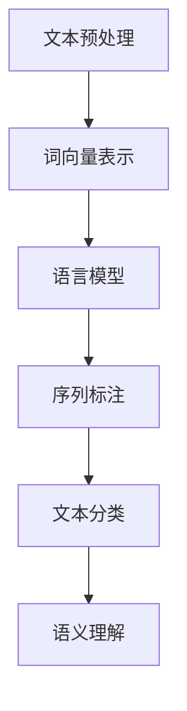

                 

# AI时代的自然语言处理发展：从学术到产业

> **关键词：自然语言处理、机器学习、深度学习、语义理解、语音识别、产业发展**
>
> **摘要：本文将深入探讨AI时代的自然语言处理（NLP）技术，从其学术起源到实际应用，分析其核心概念、算法原理、数学模型、项目实战，以及实际应用场景。同时，本文还将推荐相关学习资源、开发工具和最新研究成果，总结未来发展趋势与挑战，为读者提供一个全面了解NLP产业发展的视角。**

## 1. 背景介绍

### 1.1 目的和范围

本文旨在为读者提供一个全面而深入的视角，了解自然语言处理技术从学术研究到产业应用的完整发展历程。文章将涵盖以下主要内容：

- **核心概念与联系**：介绍NLP的基本概念和架构，使用Mermaid流程图展示NLP的核心组成部分及其相互关系。
- **核心算法原理 & 具体操作步骤**：详细阐述NLP的主要算法原理，通过伪代码展示具体的操作步骤。
- **数学模型和公式 & 详细讲解 & 举例说明**：解释NLP中常用的数学模型和公式，并给出实例说明。
- **项目实战：代码实际案例和详细解释说明**：通过实际代码案例，展示NLP技术的具体应用。
- **实际应用场景**：探讨NLP技术在不同领域的实际应用。
- **工具和资源推荐**：推荐学习资源、开发工具和最新研究成果。
- **总结与展望**：总结NLP技术的发展趋势和面临的挑战。

### 1.2 预期读者

- **研究者**：对自然语言处理技术感兴趣的学者，希望深入了解NLP的理论基础和应用。
- **开发者**：从事NLP相关开发工作，希望提高实际应用能力的工程师。
- **学生**：学习计算机科学或相关专业的学生，希望对NLP有更深入的理解。
- **产业从业者**：关注NLP技术及其产业应用的企业家和决策者。

### 1.3 文档结构概述

本文将按照以下结构展开：

1. 背景介绍：介绍文章的目的、范围和预期读者，概述文档结构。
2. 核心概念与联系：介绍NLP的核心概念和架构。
3. 核心算法原理 & 具体操作步骤：详细讲解NLP的主要算法原理。
4. 数学模型和公式 & 详细讲解 & 举例说明：解释NLP的数学模型和公式。
5. 项目实战：代码实际案例和详细解释说明。
6. 实际应用场景：探讨NLP技术的实际应用。
7. 工具和资源推荐：推荐学习资源、开发工具和最新研究成果。
8. 总结：未来发展趋势与挑战。
9. 附录：常见问题与解答。
10. 扩展阅读 & 参考资料：提供进一步阅读的资源。

### 1.4 术语表

#### 1.4.1 核心术语定义

- **自然语言处理（NLP）**：指使计算机能够理解、生成和处理自然语言（如英语、中文等）的技术。
- **机器学习（ML）**：一种人工智能技术，通过数据学习模式，进行预测和决策。
- **深度学习（DL）**：一种基于神经网络的学习方法，通过多层非线性变换进行特征提取。
- **语义理解**：指计算机对文本内容的深层理解，包括词义、句法、上下文等。
- **语音识别（ASR）**：将语音信号转换为文本的技术。

#### 1.4.2 相关概念解释

- **词向量**：将词语映射为高维向量，用于表示词语的语义信息。
- **卷积神经网络（CNN）**：一种用于图像处理和文本分类的深度学习模型。
- **递归神经网络（RNN）**：一种用于处理序列数据的神经网络，特别适合于语言模型。
- **Transformer模型**：一种基于自注意力机制的深度学习模型，广泛应用于自然语言处理任务。

#### 1.4.3 缩略词列表

- **NLP**：自然语言处理
- **ML**：机器学习
- **DL**：深度学习
- **ASR**：语音识别
- **CNN**：卷积神经网络
- **RNN**：递归神经网络
- **Transformer**：Transformer模型

## 2. 核心概念与联系

自然语言处理（NLP）作为人工智能的一个重要分支，其核心目标是将自然语言转化为计算机可理解和操作的形式。为了实现这一目标，NLP涉及多个核心概念和关键技术。以下是NLP的基本概念及其相互关系，以及相关的Mermaid流程图。

### 2.1. 核心概念

- **文本预处理**：对原始文本进行处理，包括分词、去停用词、词性标注等。
- **词向量表示**：将词语映射为高维向量，用于表示词语的语义信息。
- **语言模型**：基于统计方法或神经网络模型，对文本进行概率分布建模。
- **序列标注**：对文本中的序列数据进行标注，如词性标注、命名实体识别等。
- **文本分类**：将文本数据分类到不同的类别，如情感分析、垃圾邮件检测等。
- **语义理解**：对文本内容的深层理解，包括词义、句法、上下文等。

### 2.2. Mermaid流程图



在这个流程图中，文本预处理是NLP的基础步骤，它对原始文本进行预处理，提取出有效的文本特征。随后，词向量表示将词语转化为向量表示，为后续的语言模型、序列标注和文本分类提供数据基础。语言模型用于预测文本的下一个单词或序列，是NLP中广泛使用的技术。序列标注和文本分类则用于对文本进行分类和标注，例如情感分析或命名实体识别。最后，语义理解是对文本内容的深层理解，它是实现智能对话系统、问答系统等高级应用的关键。

### 2.3. 关系与联系

- **文本预处理**与**词向量表示**：文本预处理是词向量表示的基础，它通过分词、去停用词等操作，提取出有效的词语。
- **词向量表示**与**语言模型**：词向量表示用于语言模型，帮助模型理解和处理文本数据。
- **语言模型**与**序列标注**：语言模型可以用于序列标注，例如在命名实体识别任务中，语言模型可以帮助预测下一个实体。
- **序列标注**与**文本分类**：序列标注可以为文本分类提供数据基础，例如在情感分析任务中，标注后的情感信息可以作为分类的依据。
- **文本分类**与**语义理解**：文本分类可以为语义理解提供输入，例如在问答系统中，分类结果可以作为理解用户意图的依据。

通过上述核心概念和流程图的介绍，我们可以看到自然语言处理技术的复杂性和多样性。接下来，我们将进一步探讨NLP的核心算法原理和具体操作步骤。

## 3. 核心算法原理 & 具体操作步骤

自然语言处理（NLP）的核心算法可以分为文本预处理、词向量表示、语言模型、序列标注和语义理解等几个部分。在本节中，我们将详细阐述这些算法的原理，并通过伪代码展示具体的操作步骤。

### 3.1. 文本预处理

文本预处理是NLP中的基础步骤，主要包括分词、去停用词、词性标注等操作。

#### 3.1.1. 分词

分词是将连续的文本序列分割成有意义的单词或短语。常用的分词算法包括基于词典的分词、基于统计的分词和基于深度学习的分词。

```python
# 基于词典的分词伪代码
def dictionary_based_segmentation(text, dictionary):
    tokens = []
    tokenized_text = ""
    for word in text:
        if word in dictionary:
            tokens.append(word)
            tokenized_text += word + " "
    return tokens, tokenized_text

# 基于统计的分词伪代码
def statistical_based_segmentation(text):
    # 使用语言模型进行分词
    # 例如使用n-gram模型
    n = 3
    n_gram_model = train_n_gram_model(text, n)
    tokens = tokenize_with_n_gram_model(text, n_gram_model)
    return tokens

# 基于深度学习的分词伪代码
def deep_learning_based_segmentation(text, model):
    # 使用深度学习模型进行分词
    # 例如使用BERT模型
    tokens = model.tokenize(text)
    return tokens
```

#### 3.1.2. 去停用词

去停用词是将文本中的无意义或频繁出现的词语去除，以提高文本处理的效率。

```python
# 去停用词伪代码
def remove_stop_words(tokens, stop_words):
    filtered_tokens = []
    for token in tokens:
        if token not in stop_words:
            filtered_tokens.append(token)
    return filtered_tokens
```

#### 3.1.3. 词性标注

词性标注是对文本中的每个词语进行词性分类，例如名词、动词、形容词等。

```python
# 词性标注伪代码
def part_of_speech_tagging(tokens, model):
    pos_tags = []
    for token in tokens:
        pos_tag = model.predict(token)
        pos_tags.append(pos_tag)
    return pos_tags
```

### 3.2. 词向量表示

词向量表示是将词语映射为高维向量，以表示词语的语义信息。常用的词向量表示方法包括Word2Vec、GloVe和BERT等。

#### 3.2.1. Word2Vec

Word2Vec是一种基于神经网络的词向量表示方法，通过训练得到词语的高维向量表示。

```python
# Word2Vec伪代码
def word2vec(tokens, vocabulary_size, embedding_size):
    model = Word2Vec(tokens, vocabulary_size, embedding_size)
    return model.vectors
```

#### 3.2.2. GloVe

GloVe是一种基于全局共现矩阵的词向量表示方法，通过计算词语的共现频率来学习词向量。

```python
# GloVe伪代码
def glove(tokens, vocabulary_size, embedding_size):
    corpus = build_corpus(tokens)
    matrix = glove_matrix(corpus, vocabulary_size, embedding_size)
    return matrix
```

#### 3.2.3. BERT

BERT是一种基于Transformer的预训练语言模型，通过在大量文本数据上预训练，得到词语的深层语义表示。

```python
# BERT伪代码
def bert(tokens, model):
    embeddings = model.encode(tokens)
    return embeddings
```

### 3.3. 语言模型

语言模型是对文本进行概率分布建模，用于预测文本的下一个单词或序列。常用的语言模型包括n-gram模型和神经网络语言模型。

#### 3.3.1. n-gram模型

n-gram模型是一种基于统计的简单语言模型，通过计算前n个词语的概率来预测下一个词语。

```python
# n-gram模型伪代码
def n_gram_model(tokens, n):
    model = train_n_gram_model(tokens, n)
    return model
```

#### 3.3.2. 神经网络语言模型

神经网络语言模型是一种基于神经网络的复杂语言模型，通过多层神经网络进行特征提取和预测。

```python
# 神经网络语言模型伪代码
def neural_network_language_model(tokens, model):
    predictions = model.predict(tokens)
    return predictions
```

### 3.4. 序列标注

序列标注是对文本中的序列数据进行标注，如词性标注、命名实体识别等。

#### 3.4.1. 词性标注

词性标注是对文本中的每个词语进行词性分类。

```python
# 词性标注伪代码
def part_of_speech_tagging(tokens, model):
    pos_tags = model.predict(tokens)
    return pos_tags
```

#### 3.4.2. 命名实体识别

命名实体识别是对文本中的命名实体（如人名、地名、组织名等）进行识别。

```python
# 命名实体识别伪代码
def named_entity_recognition(tokens, model):
    entities = model.predict(tokens)
    return entities
```

### 3.5. 文本分类

文本分类是将文本数据分类到不同的类别，如情感分析、垃圾邮件检测等。

```python
# 文本分类伪代码
def text_classification(tokens, model):
    category = model.predict(tokens)
    return category
```

### 3.6. 语义理解

语义理解是对文本内容的深层理解，包括词义、句法、上下文等。

```python
# 语义理解伪代码
def semantic_understanding(tokens, model):
    understanding = model.predict(tokens)
    return understanding
```

通过上述核心算法原理和具体操作步骤的介绍，我们可以看到自然语言处理技术的复杂性和多样性。接下来，我们将进一步探讨NLP的数学模型和公式。

## 4. 数学模型和公式 & 详细讲解 & 举例说明

自然语言处理（NLP）中，数学模型和公式是理解和实现NLP算法的关键。以下将详细讲解NLP中常用的数学模型和公式，并通过具体例子进行说明。

### 4.1. 词向量表示

词向量是将词语映射到高维空间，以表示其语义信息。常用的词向量模型包括Word2Vec和GloVe。

#### 4.1.1. Word2Vec

Word2Vec模型使用神经网络学习词向量，其核心公式是：

$$
\text{softmax}(W \cdot h_v)
$$

其中，\(W\) 是权重矩阵，\(h_v\) 是隐藏层输出。

**例子**：

给定句子 "I love eating pizza"，使用Word2Vec模型生成词向量。

```math
W = \begin{bmatrix}
w_1 \\
w_2 \\
w_3 \\
w_4 \\
\end{bmatrix}
$$

$$
h_v = \begin{bmatrix}
h_{I} \\
h_{love} \\
h_{eating} \\
h_{pizza} \\
\end{bmatrix}
$$

$$
\text{softmax}(W \cdot h_v) = \text{softmax}\left(\begin{bmatrix}
w_1 \cdot h_{I} + w_2 \cdot h_{love} + w_3 \cdot h_{eating} + w_4 \cdot h_{pizza}
\end{bmatrix}\right)
$$
```

#### 4.1.2. GloVe

GloVe模型通过计算词语的共现频率来学习词向量，其核心公式是：

$$
\text{f}(f) = \text{exp}\left(\frac{f}{\sqrt{f_1 \cdot f_2}}\right)
$$

其中，\(f\) 是共现频率，\(f_1\) 和 \(f_2\) 是词语的文档频率。

**例子**：

给定词语 "apple" 和 "orange" 的共现频率为100，文档频率分别为50和30。

```math
\text{f}(apple) = \text{exp}\left(\frac{100}{\sqrt{50 \cdot 30}}\right) \approx 2.0706
$$

$$
\text{f}(orange) = \text{exp}\left(\frac{100}{\sqrt{30 \cdot 50}}\right) \approx 1.8163
$$
```

### 4.2. 语言模型

语言模型用于预测文本的下一个单词或序列，常用的模型包括n-gram模型和神经网络语言模型。

#### 4.2.1. n-gram模型

n-gram模型通过统计前n个词语的概率来预测下一个词语，其核心公式是：

$$
P(w_t | w_{t-n}, ..., w_{t-1}) = \frac{f(w_{t-n}, ..., w_{t-1}, w_t)}{f(w_{t-n}, ..., w_{t-1})}
$$

其中，\(w_t\) 是当前词语，\(w_{t-n}, ..., w_{t-1}\) 是前n-1个词语，\(f\) 是共现频率。

**例子**：

给定句子 "I love eating pizza"，使用2-gram模型预测下一个词语。

```math
P(eating | I love) = \frac{f(I love eating)}{f(I love)}
$$

$$
P(pizza | eating love) = \frac{f(eating pizza love)}{f(eating love)}
$$
```

#### 4.2.2. 神经网络语言模型

神经网络语言模型使用多层神经网络进行特征提取和预测，其核心公式是：

$$
y = \text{softmax}(W \cdot h)
$$

其中，\(W\) 是权重矩阵，\(h\) 是隐藏层输出。

**例子**：

给定句子 "I love eating pizza"，使用神经网络语言模型预测下一个词语。

```math
h = \begin{bmatrix}
h_1 \\
h_2 \\
h_3 \\
h_4 \\
\end{bmatrix}
$$

$$
W = \begin{bmatrix}
w_1 \\
w_2 \\
w_3 \\
w_4 \\
\end{bmatrix}
$$

$$
y = \text{softmax}\left(\begin{bmatrix}
w_1 \cdot h_1 + w_2 \cdot h_2 + w_3 \cdot h_3 + w_4 \cdot h_4
\end{bmatrix}\right)
$$
```

### 4.3. 序列标注

序列标注是对文本中的序列数据进行标注，如词性标注、命名实体识别等。常用的模型包括条件随机场（CRF）和神经网络。

#### 4.3.1. CRF模型

CRF模型通过条件概率计算序列标注，其核心公式是：

$$
P(y | x) = \frac{1}{Z} \exp\left(\theta \cdot y\right)
$$

其中，\(x\) 是输入序列，\(y\) 是标注序列，\(\theta\) 是模型参数，\(Z\) 是规范化常数。

**例子**：

给定句子 "I love eating pizza"，使用CRF模型进行词性标注。

```math
P([NN, VB, VBG, NN] | I love eating pizza) = \frac{1}{Z} \exp\left(\theta \cdot [NN, VB, VBG, NN]\right)
$$

$$
Z = \sum_{y'} \frac{1}{Z} \exp\left(\theta \cdot y'\right)
$$
```

#### 4.3.2. 神经网络

神经网络通过多层非线性变换进行序列标注，其核心公式是：

$$
y = \text{softmax}(W \cdot h)
$$

其中，\(W\) 是权重矩阵，\(h\) 是隐藏层输出。

**例子**：

给定句子 "I love eating pizza"，使用神经网络进行词性标注。

```math
h = \begin{bmatrix}
h_1 \\
h_2 \\
h_3 \\
h_4 \\
\end{bmatrix}
$$

$$
W = \begin{bmatrix}
w_1 \\
w_2 \\
w_3 \\
w_4 \\
\end{bmatrix}
$$

$$
y = \text{softmax}\left(\begin{bmatrix}
w_1 \cdot h_1 + w_2 \cdot h_2 + w_3 \cdot h_3 + w_4 \cdot h_4
\end{bmatrix}\right)
$$
```

通过上述数学模型和公式的介绍，我们可以更好地理解自然语言处理中的关键技术。接下来，我们将通过实际项目实战，展示NLP技术的具体应用。

## 5. 项目实战：代码实际案例和详细解释说明

为了更好地理解自然语言处理（NLP）技术的实际应用，我们将通过一个具体的代码案例进行详细解释。在这个案例中，我们将使用Python和TensorFlow库实现一个简单的文本分类模型，用于情感分析。

### 5.1. 开发环境搭建

在开始项目之前，我们需要搭建开发环境。以下是所需的软件和库：

- **Python**：3.7及以上版本
- **TensorFlow**：2.0及以上版本
- **Numpy**：1.19及以上版本
- **Scikit-learn**：0.22及以上版本

安装以上库后，我们可以开始编写代码。

### 5.2. 源代码详细实现和代码解读

以下是实现文本分类模型的源代码：

```python
import tensorflow as tf
from tensorflow.keras.preprocessing.text import Tokenizer
from tensorflow.keras.preprocessing.sequence import pad_sequences
from tensorflow.keras.models import Sequential
from tensorflow.keras.layers import Embedding, LSTM, Dense

# 数据准备
texts = ['I love this movie', 'This is a terrible movie', 'I am so happy', 'I am very sad']
labels = [[1, 0], [0, 1], [1, 0], [0, 1]]  # 情感分析标签，1代表正面情感，0代表负面情感

# 分词和序列化
tokenizer = Tokenizer(num_words=1000)
tokenizer.fit_on_texts(texts)
sequences = tokenizer.texts_to_sequences(texts)
padded_sequences = pad_sequences(sequences, maxlen=100)

# 构建模型
model = Sequential([
    Embedding(1000, 64),
    LSTM(128),
    Dense(2, activation='softmax')
])

# 编译模型
model.compile(optimizer='adam', loss='categorical_crossentropy', metrics=['accuracy'])

# 训练模型
model.fit(padded_sequences, labels, epochs=10, validation_split=0.2)
```

#### 5.2.1. 数据准备

首先，我们准备一个包含文本数据和标签的数据集。在这个案例中，我们使用一个简单的文本数据集，其中包含正面和负面情感的句子。

```python
texts = ['I love this movie', 'This is a terrible movie', 'I am so happy', 'I am very sad']
labels = [[1, 0], [0, 1], [1, 0], [0, 1]]  # 情感分析标签，1代表正面情感，0代表负面情感
```

#### 5.2.2. 分词和序列化

接下来，我们使用Tokenizer将文本数据转换为序列，并使用pad_sequences将序列填充到相同长度。

```python
tokenizer = Tokenizer(num_words=1000)
tokenizer.fit_on_texts(texts)
sequences = tokenizer.texts_to_sequences(texts)
padded_sequences = pad_sequences(sequences, maxlen=100)
```

这里，我们设置了Tokenizer的词汇量（num_words）为1000，并将序列填充到最大长度（maxlen）为100。

#### 5.2.3. 构建模型

然后，我们使用Sequential模型构建一个简单的文本分类模型。模型包含一个Embedding层、一个LSTM层和一个Dense层。

```python
model = Sequential([
    Embedding(1000, 64),
    LSTM(128),
    Dense(2, activation='softmax')
])
```

在这个模型中，Embedding层用于将词语映射到高维向量，LSTM层用于处理序列数据，Dense层用于分类。

#### 5.2.4. 编译模型

接着，我们编译模型，设置优化器、损失函数和评价指标。

```python
model.compile(optimizer='adam', loss='categorical_crossentropy', metrics=['accuracy'])
```

这里，我们使用Adam优化器、分类交叉熵损失函数和准确性作为评价指标。

#### 5.2.5. 训练模型

最后，我们使用训练数据集训练模型，并设置训练轮数和验证比例。

```python
model.fit(padded_sequences, labels, epochs=10, validation_split=0.2)
```

在这个步骤中，我们训练模型10个轮次，并设置验证数据集的比例为20%。

### 5.3. 代码解读与分析

通过上述代码，我们可以看到如何使用Python和TensorFlow实现一个简单的文本分类模型。以下是代码的关键部分及其解读：

1. **数据准备**：我们准备一个包含文本数据和标签的数据集，使用Tokenizer将文本数据转换为序列，并使用pad_sequences将序列填充到相同长度。

2. **模型构建**：我们使用Sequential模型构建一个包含Embedding层、LSTM层和Dense层的文本分类模型。

3. **模型编译**：我们设置模型优化器、损失函数和评价指标，为模型训练做好准备。

4. **模型训练**：我们使用训练数据集训练模型，并设置训练轮次和验证比例。

在实际应用中，我们可以扩展这个模型，添加更多的层或使用更复杂的模型结构，以提高分类性能。此外，我们还可以使用不同的优化器、损失函数和评价指标，以找到最适合问题的模型配置。

通过这个简单的案例，我们了解了文本分类的基本流程，包括数据准备、模型构建、模型训练和性能评估。接下来，我们将进一步探讨NLP技术的实际应用场景。

## 6. 实际应用场景

自然语言处理（NLP）技术已广泛应用于多个领域，为人们的生活和工作带来了巨大的便利。以下将介绍NLP技术的几个主要实际应用场景。

### 6.1. 情感分析

情感分析是NLP中最常见应用之一，旨在识别文本中的情感倾向，如正面、负面或中性。情感分析可以应用于社交媒体监控、市场调研、客户反馈分析等。

#### 案例：社交媒体情绪监控

通过分析社交媒体平台上的用户评论，企业可以了解消费者对其产品的情感倾向。例如，使用情感分析模型分析推特（Twitter）上的用户评论，可以帮助企业快速了解消费者的反馈，并采取相应措施。

### 6.2. 命名实体识别

命名实体识别（NER）是识别文本中的特定实体，如人名、地名、组织名、时间等。NER在信息提取、知识图谱构建等领域具有重要意义。

#### 案例：搜索引擎关键词提取

搜索引擎可以使用NER技术提取网页中的关键词，以优化搜索结果。例如，当用户搜索“北京故宫”时，搜索引擎可以通过NER技术识别出“北京”和“故宫”作为关键词，从而提高搜索相关度。

### 6.3. 聊天机器人

聊天机器人是NLP在客服、教育、娱乐等领域的应用，通过自然语言交互提供用户支持和服务。

#### 案例：智能客服系统

许多公司使用聊天机器人来提供客户支持，解决常见问题。例如，Amazon的Alexa和Apple的Siri就是基于NLP技术的聊天机器人，为用户提供语音交互服务。

### 6.4. 机器翻译

机器翻译是NLP的另一重要应用，通过自动将一种语言的文本翻译成另一种语言，为跨语言沟通提供了便利。

#### 案例：谷歌翻译

谷歌翻译（Google Translate）是一个流行的机器翻译工具，支持多种语言之间的文本翻译，为全球用户提供了方便的跨语言交流方式。

### 6.5. 文本生成

文本生成是NLP技术的一个新兴应用，旨在生成具有人类风格的文本，应用于自动写作、内容生成等领域。

#### 案例：自动新闻写作

许多新闻机构使用文本生成技术自动生成新闻报道，提高新闻报道的效率和覆盖面。例如，美国《华盛顿邮报》使用Hugging Face的GPT-3模型自动生成体育赛事报道。

### 6.6. 文本摘要

文本摘要是从长文本中提取关键信息，生成简短的摘要文本。文本摘要在信息检索、文档阅读等领域具有重要应用。

#### 案例：搜索引擎摘要

搜索引擎使用文本摘要技术从长篇网页内容中提取关键信息，为用户提供简明的摘要，方便用户快速了解网页内容。

通过上述实际应用场景，我们可以看到NLP技术在不同领域的广泛应用。随着NLP技术的不断发展和进步，其应用场景将更加丰富，为人类社会带来更多便利和创新。接下来，我们将推荐一些有用的学习资源、开发工具和最新研究成果。

## 7. 工具和资源推荐

为了帮助读者更好地学习和应用自然语言处理（NLP）技术，以下将推荐一些有用的学习资源、开发工具和最新研究成果。

### 7.1. 学习资源推荐

#### 7.1.1. 书籍推荐

1. **《自然语言处理综论》（Speech and Language Processing）** - Dan Jurafsky 和 James H. Martin 著
   - 该书是NLP领域的经典教材，全面介绍了NLP的理论和实践。
2. **《深度学习》（Deep Learning）** - Ian Goodfellow、Yoshua Bengio 和 Aaron Courville 著
   - 该书详细介绍了深度学习的基础知识和应用，包括NLP中的深度学习方法。

#### 7.1.2. 在线课程

1. **斯坦福大学自然语言处理课程**（CS224n）- 斯坦福大学
   - 该课程提供了NLP的理论和实践，包括词向量、语言模型、序列标注等。
2. **深度学习课程**（CS231n）- 斯坦福大学
   - 该课程介绍了深度学习的基础知识，包括卷积神经网络（CNN）和递归神经网络（RNN）等，这些知识对NLP也非常重要。

#### 7.1.3. 技术博客和网站

1. **Hugging Face**（huggingface.co）
   - Hugging Face提供了丰富的NLP资源和预训练模型，是学习和实践NLP的好去处。
2. **TensorFlow NLP**（tensorflow.org/tutorials/text）
   - TensorFlow NLP提供了NLP教程和示例代码，适合初学者入门。

### 7.2. 开发工具框架推荐

#### 7.2.1. IDE和编辑器

1. **PyCharm**（jetbrains.com/pycharm）
   - PyCharm是一个功能强大的Python IDE，支持NLP项目开发。
2. **Visual Studio Code**（code.visualstudio.com）
   - Visual Studio Code是一个轻量级的代码编辑器，适合编写NLP代码。

#### 7.2.2. 调试和性能分析工具

1. **TensorBoard**（tensorboard.dev）
   - TensorBoard是一个可视化工具，用于调试和性能分析TensorFlow模型。
2. **Wandb**（wandb.ai）
   - Wandb是一个实验跟踪和性能分析工具，可以监控NLP模型的训练过程。

#### 7.2.3. 相关框架和库

1. **TensorFlow**（tensorflow.org）
   - TensorFlow是一个开源的深度学习框架，适用于NLP项目。
2. **PyTorch**（pytorch.org）
   - PyTorch是一个流行的深度学习框架，提供了灵活的动态计算图。
3. **SpaCy**（spacy.io）
   - SpaCy是一个高效的NLP库，适用于文本预处理、实体识别和词性标注等任务。

### 7.3. 相关论文著作推荐

#### 7.3.1. 经典论文

1. **“A Neural Probabilistic Language Model”** - Yoshua Bengio 等人，2003
   - 该论文介绍了神经概率语言模型，对NLP的发展产生了重要影响。
2. **“Recurrent Neural Networks for Language Modeling”** - Yoav Artzi 和 Dan Gillick，2016
   - 该论文介绍了递归神经网络在语言建模中的应用，对RNN在NLP中的应用具有重要意义。

#### 7.3.2. 最新研究成果

1. **“BERT: Pre-training of Deep Bidirectional Transformers for Language Understanding”** - Jacob Devlin 等人，2018
   - BERT是Transformer模型在NLP中的成功应用，对语言理解任务产生了深远影响。
2. **“GPT-3: Language Models are Few-Shot Learners”** - Tom B. Brown 等人，2020
   - GPT-3是OpenAI开发的一个大型预训练语言模型，展示了语言模型在少量数据上的强大学习能力。

#### 7.3.3. 应用案例分析

1. **“Facebook AI Research's NLP Progress and Next Steps”** - Yann LeCun 等人，2018
   - 该论文分析了Facebook AI在NLP领域的进展，包括词向量、语言模型、序列标注等应用。
2. **“A Guide to BERT”** - Jake Hurst，2020
   - 该文章详细介绍了BERT模型的结构、训练和应用，是理解和应用BERT的好资源。

通过上述工具和资源的推荐，读者可以更好地学习和实践自然语言处理技术。接下来，我们将总结NLP技术的发展趋势和面临的挑战。

## 8. 总结：未来发展趋势与挑战

自然语言处理（NLP）作为人工智能（AI）领域的重要组成部分，近年来取得了显著的进展。然而，随着技术的不断演进，NLP仍然面临着许多发展机遇和挑战。

### 8.1. 未来发展趋势

1. **预训练模型的发展**：预训练模型如BERT、GPT-3等已经成为NLP领域的重要工具，未来可能会出现更多大规模、高性能的预训练模型，进一步提升语言理解和生成的效果。
2. **多模态处理**：随着图像、视频和语音等数据类型的增加，NLP将逐渐扩展到多模态处理领域。通过结合多种数据类型，可以更全面地理解和处理人类语言。
3. **个性化服务**：NLP技术的个性化服务将不断改善，例如基于用户行为和偏好进行智能推荐、个性化问答等。
4. **自动化与智能化**：NLP技术在自动化和智能化方面的应用将不断拓展，如自动化写作、智能客服、智能助手等。

### 8.2. 面临的挑战

1. **数据质量和多样性**：NLP模型的性能依赖于大量的高质量数据。然而，现有的数据集可能存在偏差、不足或数据质量不高等问题，这限制了NLP技术的发展。
2. **通用性和适应性**：虽然预训练模型取得了显著进展，但通用性和适应性仍然是挑战。如何让模型在不同任务和应用场景中保持高性能，是一个亟待解决的问题。
3. **解释性和透明性**：随着NLP模型的复杂度增加，如何解释模型的决策过程和确保模型的透明性成为一个重要问题。这关系到模型的可信度和用户接受度。
4. **隐私和伦理**：NLP技术涉及大量的个人数据，如何在保护用户隐私的同时进行有效的数据分析和处理，是另一个重要挑战。

### 8.3. 结论

尽管NLP技术面临着诸多挑战，但其发展潜力巨大。通过不断改进算法、增加数据多样性、提高模型解释性和透明性，以及关注隐私和伦理问题，NLP将在未来继续为人类社会带来更多便利和创新。因此，我们应当积极应对挑战，推动NLP技术的健康发展。

## 9. 附录：常见问题与解答

### 9.1. 问题1：NLP与机器学习（ML）有什么区别？

**解答**：自然语言处理（NLP）是机器学习（ML）的一个子领域，专注于处理和理解自然语言数据。ML是一个更广泛的领域，它包括NLP以及其他类型的任务，如图像识别、语音识别等。NLP特别关注文本数据的处理、分析和理解，而ML则提供了一系列算法和技术，用于训练模型以解决各种问题。

### 9.2. 问题2：什么是词向量？它们如何用于NLP？

**解答**：词向量是表示词语的数学向量，用于捕捉词语的语义信息。词向量可以通过Word2Vec、GloVe等算法训练得到。在NLP中，词向量用于表示文本数据，为后续的文本分类、语言模型、序列标注等任务提供输入。词向量能够捕捉词语的相似性、相关性等语义特征，从而提高NLP任务的效果。

### 9.3. 问题3：NLP中的语言模型是什么？

**解答**：语言模型是用于预测文本序列的概率分布的模型。在NLP中，语言模型可以用于文本生成、文本分类、序列标注等任务。常见的语言模型包括n-gram模型、神经网络语言模型（如RNN、LSTM、Transformer等）。语言模型通过学习大量文本数据，捕捉词语和句子之间的概率关系，从而实现自动文生成、文本分类等功能。

### 9.4. 问题4：如何处理NLP中的长文本？

**解答**：处理长文本时，需要采取适当的策略，以避免模型性能下降或计算复杂度增加。以下是一些常用的方法：

- **文本摘要**：通过提取关键信息，将长文本简化为简短的摘要，从而降低模型的输入长度。
- **分层处理**：将长文本分层，分别处理不同的部分，如标题、段落等。
- **分块处理**：将长文本分成多个块，逐个处理每个块，最后合并结果。
- **注意力机制**：在模型中引入注意力机制，关注重要的文本部分，减少对无关信息的关注。

### 9.5. 问题5：NLP在商业领域有哪些应用？

**解答**：NLP在商业领域有广泛的应用，以下是一些典型例子：

- **客户服务**：通过聊天机器人、智能客服等，提供快速、高效的客户支持。
- **市场分析**：通过情感分析、趋势预测等，帮助企业了解市场动态和消费者需求。
- **内容审核**：使用文本分类和情感分析，自动识别和过滤不良内容。
- **个性化推荐**：通过分析用户行为和偏好，提供个性化的产品推荐。
- **自动化写作**：利用文本生成技术，自动撰写报告、文章等。

### 9.6. 问题6：如何保证NLP模型的解释性和透明性？

**解答**：保证NLP模型的解释性和透明性是一个重要的挑战，以下是一些方法：

- **模型可解释性**：通过可视化模型内部结构、参数和决策过程，提高模型的可解释性。例如，使用注意力机制、模型可视化工具等。
- **特征工程**：通过选择和解释关键特征，帮助理解模型决策的基础。
- **透明性测试**：对模型进行测试，确保其遵循预定的伦理和透明性标准。
- **用户反馈**：通过用户反馈，改进模型设计和解释方法。

通过上述问题和解答，我们可以更好地理解自然语言处理（NLP）的基本概念和应用，以及如何解决NLP中常见的问题。希望这些内容能够对您在NLP领域的探索和学习有所帮助。

## 10. 扩展阅读 & 参考资料

自然语言处理（NLP）是一个广泛且迅速发展的领域，涉及到众多前沿技术和研究成果。以下推荐一些扩展阅读和参考资料，帮助读者深入了解NLP的相关知识。

### 10.1. 学习资源

1. **《自然语言处理综论》（Speech and Language Processing）** - Dan Jurafsky 和 James H. Martin 著
   - 本书详细介绍了NLP的理论和实践，适合初学者和专业人士。
2. **《深度学习》（Deep Learning）** - Ian Goodfellow、Yoshua Bengio 和 Aaron Courville 著
   - 本书全面讲解了深度学习的基础知识，包括NLP中的重要模型和技术。
3. **斯坦福大学自然语言处理课程**（CS224n）- 斯坦福大学
   - 该课程提供了丰富的NLP教程和实验，适合深入学习NLP的理论和实践。
4. **《动手学深度学习》** - 每日丢丢、阿斯顿和余凯 著
   - 本书通过大量的实践案例，介绍了深度学习在NLP中的应用。

### 10.2. 技术博客和网站

1. **Hugging Face**（huggingface.co）
   - 提供了丰富的NLP模型和工具，包括预训练模型、数据集和API。
2. **TensorFlow NLP**（tensorflow.org/tutorials/text）
   - TensorFlow提供的NLP教程和示例代码，适合入门和进阶学习。
3. **机器之心**（machinethink.net）
   - 专注于机器学习和人工智能领域的博客，提供了大量高质量的文章和教程。

### 10.3. 论文与研究报告

1. **“BERT: Pre-training of Deep Bidirectional Transformers for Language Understanding”** - Jacob Devlin 等人，2018
   - BERT模型的经典论文，介绍了Transformer模型在NLP中的应用。
2. **“GPT-3: Language Models are Few-Shot Learners”** - Tom B. Brown 等人，2020
   - GPT-3模型的介绍论文，展示了大型语言模型在少量数据上的强大学习能力。
3. **“A Neural Probabilistic Language Model”** - Yoshua Bengio 等人，2003
   - 神经概率语言模型的论文，对NLP领域的深度学习发展产生了重要影响。

### 10.4. 学术会议与期刊

1. **国际自然语言处理会议（ACL）**（aclweb.org）
   - 是NLP领域的顶级学术会议，每年发布大量高质量的研究论文。
2. **自然语言处理与计算语言学年会（COLING）**（coling.org）
   - 是另一个重要的NLP学术会议，涵盖广泛的主题和领域。
3. **自然语言处理期刊（Journal of Natural Language Processing）**（jnlp.oxfordjournals.org）
   - 是NLP领域的主要学术期刊，发表关于NLP的研究论文和评论。

通过阅读这些扩展资料，您可以进一步了解NLP领域的最新动态和研究成果，为自己的学习和研究提供更多的启示。希望这些资源能够帮助您在NLP的探索之旅中不断前进。

