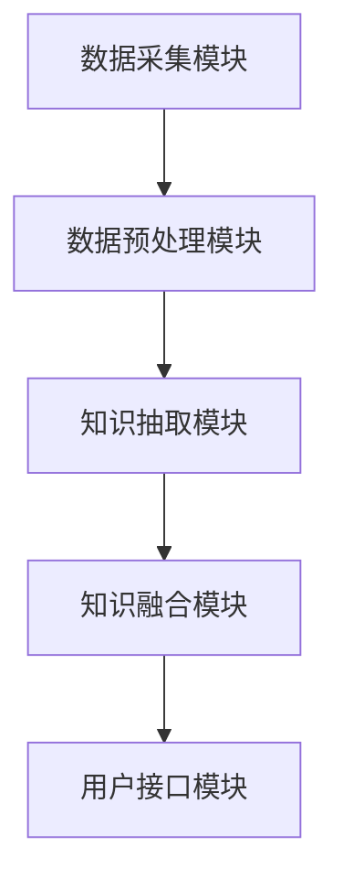

                 

# AI时代的自然语言处理突破：个性化知识库

> **关键词：自然语言处理、个性化知识库、AI、深度学习、语义理解、信息抽取**

> **摘要：本文将探讨AI时代自然语言处理（NLP）的重要突破——个性化知识库的构建。文章首先介绍了NLP的背景和现状，随后详细阐述了个性化知识库的定义、核心概念及其构建方法。接着，我们通过具体算法原理、数学模型和项目实战，深入剖析了个性化知识库的实现过程。最后，文章讨论了个性化知识库在实际应用场景中的价值，并推荐了一系列学习资源和工具。通过本文的阅读，读者将全面了解个性化知识库在AI时代的应用前景和挑战。**

## 1. 背景介绍

### 1.1 目的和范围

本文旨在深入探讨AI时代自然语言处理（NLP）领域的重大突破——个性化知识库的构建与应用。随着互联网和大数据的迅速发展，自然语言处理技术已经成为人工智能领域的重要分支。而个性化知识库作为一种能够有效整合用户信息和知识资源的创新技术，其在NLP中的应用具有重要的研究价值和实际应用意义。

本文将首先回顾NLP的发展历程和当前的研究现状，明确个性化知识库的定义和核心概念。接着，我们将详细介绍个性化知识库的构建方法，包括核心算法原理、数学模型和具体实现步骤。在此基础上，我们将通过实际项目案例，展示个性化知识库在现实应用中的效果和优势。

本文的目标读者包括对自然语言处理和人工智能感兴趣的学者、工程师和研究人员，以及希望了解个性化知识库构建和应用的实践者。本文结构如下：

- 1. 背景介绍：介绍文章的目的、范围和读者对象。
- 2. 核心概念与联系：介绍个性化知识库的核心概念和架构。
- 3. 核心算法原理 & 具体操作步骤：详细阐述个性化知识库构建的算法原理和实现步骤。
- 4. 数学模型和公式 & 详细讲解 & 举例说明：介绍个性化知识库构建所涉及的数学模型和公式，并通过实际案例进行讲解。
- 5. 项目实战：代码实际案例和详细解释说明。
- 6. 实际应用场景：讨论个性化知识库在不同领域的应用。
- 7. 工具和资源推荐：推荐相关学习资源、开发工具和框架。
- 8. 总结：未来发展趋势与挑战。
- 9. 附录：常见问题与解答。
- 10. 扩展阅读 & 参考资料：提供进一步阅读的文献和资料。

### 1.2 预期读者

预期读者应具备以下背景知识：

- **自然语言处理基础**：对自然语言处理的基本概念和方法有所了解，如词向量、词性标注、句法分析等。
- **机器学习和深度学习**：了解常见的机器学习和深度学习算法，如神经网络、循环神经网络（RNN）和变换器（Transformer）等。
- **编程技能**：具备Python等编程语言的基础技能，能够理解并实现基本的算法和数据结构。
- **数据分析和数据处理**：熟悉数据处理和数据分析的基本方法，如数据清洗、特征提取等。

通过本文的阅读，读者将能够：

- 理解个性化知识库的定义和核心概念。
- 掌握个性化知识库构建的算法原理和具体实现步骤。
- 学习如何在实际项目中应用个性化知识库，提高自然语言处理的效果和效率。
- 获取个性化知识库构建和应用的最新研究成果和实践经验。

### 1.3 文档结构概述

本文将按照以下结构展开：

- **引言**：介绍个性化知识库的背景和重要性。
- **核心概念与联系**：介绍个性化知识库的核心概念和架构，包括数据源、数据预处理、知识抽取和知识融合等。
- **核心算法原理 & 具体操作步骤**：详细阐述个性化知识库构建的算法原理，包括特征提取、模型训练和评估等。
- **数学模型和公式 & 详细讲解 & 举例说明**：介绍个性化知识库构建所涉及的数学模型和公式，并通过实际案例进行讲解。
- **项目实战**：通过实际项目案例，展示个性化知识库的构建和应用过程。
- **实际应用场景**：讨论个性化知识库在不同领域的应用，如智能客服、金融风控等。
- **工具和资源推荐**：推荐个性化知识库构建和应用的工具和资源。
- **总结**：总结个性化知识库的研究现状和发展趋势。
- **附录**：常见问题与解答。
- **扩展阅读 & 参考资料**：提供进一步阅读的文献和资料。

### 1.4 术语表

在本文中，我们将使用一些专业术语。以下是对这些术语的简要解释：

#### 1.4.1 核心术语定义

- **自然语言处理（NLP）**：一种人工智能技术，旨在让计算机理解和处理自然语言，如英语、中文等。
- **个性化知识库**：一种基于用户数据和上下文信息的知识库，能够提供个性化的信息和服务。
- **词向量（Word Vector）**：将自然语言中的词汇映射到高维空间中的向量表示。
- **深度学习（Deep Learning）**：一种基于神经网络的机器学习技术，能够自动从数据中学习特征和模式。
- **变换器（Transformer）**：一种用于处理序列数据的深度学习模型，广泛应用于自然语言处理任务。
- **知识抽取（Knowledge Extraction）**：从非结构化数据中提取结构化知识的过程。
- **语义理解（Semantic Understanding）**：理解和处理文本中的语义信息，包括词义、句法和上下文等。

#### 1.4.2 相关概念解释

- **数据源（Data Source）**：提供个性化知识库所需数据的来源，如社交媒体、用户行为数据等。
- **数据预处理（Data Preprocessing）**：对原始数据进行清洗、去噪和格式转换等操作，以提高数据质量和模型性能。
- **特征提取（Feature Extraction）**：从原始数据中提取有助于模型训练的特征。
- **模型训练（Model Training）**：使用训练数据对模型进行调整，以优化模型性能。
- **模型评估（Model Evaluation）**：使用测试数据评估模型性能，以确定模型的准确性和可靠性。

#### 1.4.3 缩略词列表

- **NLP**：自然语言处理（Natural Language Processing）
- **AI**：人工智能（Artificial Intelligence）
- **DL**：深度学习（Deep Learning）
- **Transformer**：变换器（Transformer）
- **KGC**：知识生成与抽取（Knowledge Generation and Extraction）
- **KG**：知识图谱（Knowledge Graph）
- **Ontology**：本体（Ontology）

## 2. 核心概念与联系

个性化知识库在自然语言处理（NLP）中的应用具有重要意义。为了更好地理解个性化知识库的构建和功能，我们需要首先明确相关核心概念，并展示其内在联系。

### 2.1 个性化知识库的定义

个性化知识库是一种基于用户行为、偏好和上下文信息的知识库，旨在为用户提供个性化的信息和推荐。与传统的通用知识库不同，个性化知识库能够根据用户的需求和偏好，动态调整和更新知识内容，从而提供更加精准和高效的服务。

### 2.2 核心概念解析

以下是我们将在本文中详细讨论的核心概念：

#### 2.2.1 数据源

数据源是构建个性化知识库的基础。这些数据源可以是结构化数据（如数据库）、半结构化数据（如XML、JSON）和非结构化数据（如文本、图像、音频）。常见的数据源包括：

- **用户行为数据**：用户的浏览记录、搜索历史、点击率等。
- **社交媒体数据**：用户的社交媒体活动、评论、点赞等。
- **内容数据**：网站、新闻、博客等平台上的文本、图片和视频。

#### 2.2.2 数据预处理

数据预处理是构建个性化知识库的关键步骤。通过数据清洗、去噪和格式转换等操作，我们可以提高数据质量和模型性能。主要任务包括：

- **数据清洗**：去除重复数据、缺失值填充、去除噪声等。
- **特征提取**：从原始数据中提取有助于模型训练的特征，如文本中的关键词、句法结构和语义信息。
- **数据标准化**：将不同来源和格式的数据转换为统一的格式，便于后续处理。

#### 2.2.3 知识抽取

知识抽取是从非结构化数据中提取结构化知识的过程。常见的方法包括：

- **实体识别**：识别文本中的实体（如人名、地名、组织名等）。
- **关系抽取**：识别实体之间的关系（如“张三在北京工作”中的“张三”和“北京”的关系）。
- **事件抽取**：识别文本中的事件（如“张三在北京工作”中的“张三在北京工作”事件）。

#### 2.2.4 知识融合

知识融合是将来自不同来源和格式的知识进行整合，以形成统一的个性化知识库。主要任务包括：

- **数据融合**：将结构化和非结构化数据整合到一个统一的知识库中。
- **知识表示**：使用合适的表示方法（如知识图谱）来组织和存储知识。
- **知识推理**：利用推理算法（如本体推理、语义网络推理等）从已有知识中推导出新的知识。

### 2.3 个性化知识库的架构

个性化知识库的架构可以分为以下几个主要模块：

1. **数据采集模块**：负责从各种数据源采集数据，包括用户行为数据、社交媒体数据和内容数据等。
2. **数据预处理模块**：对采集到的数据进行分析和清洗，提取有用的特征，并转换为统一的格式。
3. **知识抽取模块**：从预处理后的数据中抽取结构化知识，如实体、关系和事件等。
4. **知识融合模块**：将抽取到的知识进行整合和存储，形成个性化的知识库。
5. **用户接口模块**：提供用户与知识库的交互接口，如问答系统、推荐系统等。

### 2.4 Mermaid 流程图

为了更好地展示个性化知识库的核心概念和架构，我们使用Mermaid流程图进行描述：



- **A 数据采集模块**：从不同数据源（如用户行为、社交媒体、内容数据）采集数据。
- **B 数据预处理模块**：对采集到的数据进行清洗、去噪、特征提取等处理。
- **C 知识抽取模块**：从预处理后的数据中抽取结构化知识。
- **D 知识融合模块**：将抽取到的知识进行整合和存储。
- **E 用户接口模块**：提供用户与知识库的交互接口。

通过上述核心概念和架构的解析，我们为后续的详细讨论和案例分析奠定了基础。

## 3. 核心算法原理 & 具体操作步骤

在个性化知识库的构建过程中，核心算法原理和具体操作步骤至关重要。本节将详细介绍这些内容，以便读者能够全面理解个性化知识库的实现过程。

### 3.1 算法原理

个性化知识库的构建通常涉及以下几个关键步骤：数据采集、数据预处理、知识抽取、知识融合和用户接口设计。以下是每个步骤的算法原理和实现方法。

#### 3.1.1 数据采集

数据采集是构建个性化知识库的第一步。数据源包括用户行为数据、社交媒体数据和内容数据等。数据采集的算法原理主要包括：

- **用户行为数据采集**：通过跟踪用户的浏览记录、搜索历史和点击率等行为数据，获取用户的兴趣和偏好。
- **社交媒体数据采集**：从社交媒体平台（如Twitter、Facebook等）获取用户的发布内容、评论和点赞等数据。

伪代码实现如下：

```python
def collect_user_behavior_data():
    # 采集用户的浏览记录、搜索历史和点击率等数据
    data = fetch_user_data_from_database()
    return preprocess_user_data(data)

def collect_social_media_data():
    # 从社交媒体平台获取用户发布内容、评论和点赞等数据
    data = fetch_social_media_data_from_api()
    return preprocess_social_media_data(data)
```

#### 3.1.2 数据预处理

数据预处理是提高数据质量和模型性能的重要步骤。主要包括数据清洗、去噪和格式转换等。数据预处理的算法原理如下：

- **数据清洗**：去除重复数据、缺失值填充和去除噪声等。
- **数据去噪**：识别并去除含有噪声的数据，如包含特殊字符或无效信息的数据。
- **数据格式转换**：将不同来源和格式的数据转换为统一的格式，便于后续处理。

伪代码实现如下：

```python
def preprocess_user_data(data):
    # 清洗、去噪和格式转换用户行为数据
    cleaned_data = remove_duplicates(data)
    cleaned_data = fill_missing_values(cleaned_data)
    return convert_to_uniform_format(cleaned_data)

def preprocess_social_media_data(data):
    # 清洗、去噪和格式转换社交媒体数据
    cleaned_data = remove_noisy_data(data)
    cleaned_data = convert_to_uniform_format(cleaned_data)
    return cleaned_data
```

#### 3.1.3 知识抽取

知识抽取是从非结构化数据中提取结构化知识的过程。主要包括实体识别、关系抽取和事件抽取等。知识抽取的算法原理如下：

- **实体识别**：识别文本中的实体，如人名、地名、组织名等。
- **关系抽取**：识别实体之间的关系，如“张三在北京工作”中的“张三”和“北京”的关系。
- **事件抽取**：识别文本中的事件，如“张三在北京工作”中的“张三在北京工作”事件。

伪代码实现如下：

```python
def extract_entities(text):
    # 从文本中识别实体
    entities = detect_entities(text)
    return entities

def extract_relationships(text, entities):
    # 从文本中识别实体之间的关系
    relationships = detect_relationships(text, entities)
    return relationships

def extract_events(text, entities, relationships):
    # 从文本中识别事件
    events = detect_events(text, entities, relationships)
    return events
```

#### 3.1.4 知识融合

知识融合是将抽取到的知识进行整合和存储的过程。主要包括数据融合、知识表示和知识推理等。知识融合的算法原理如下：

- **数据融合**：将结构化和非结构化数据整合到一个统一的知识库中。
- **知识表示**：使用合适的表示方法（如知识图谱）来组织和存储知识。
- **知识推理**：利用推理算法（如本体推理、语义网络推理等）从已有知识中推导出新的知识。

伪代码实现如下：

```python
def fuse_data(data1, data2):
    # 将结构化和非结构化数据整合到一个统一的知识库中
    fused_data = integrate_data(data1, data2)
    return fused_data

def represent_knowledge(knowledge):
    # 使用知识图谱来组织和存储知识
    graph = create_knowledge_graph(knowledge)
    return graph

def reason_about_knowledge(graph):
    # 利用推理算法从已有知识中推导出新的知识
    new_knowledge = infer_new_knowledge(graph)
    return new_knowledge
```

#### 3.1.5 用户接口设计

用户接口设计是提供用户与知识库交互的接口。主要包括问答系统和推荐系统等。用户接口设计的算法原理如下：

- **问答系统**：接收用户的提问，并根据知识库中的信息进行回答。
- **推荐系统**：根据用户的兴趣和偏好，向用户推荐相关的信息。

伪代码实现如下：

```python
def answer_question(question, knowledge):
    # 根据知识库中的信息回答用户的问题
    answer = find_answer(question, knowledge)
    return answer

def recommend_content(user, knowledge):
    # 根据用户的兴趣和偏好推荐相关的信息
    recommendations = find_recommendations(user, knowledge)
    return recommendations
```

### 3.2 具体操作步骤

下面我们将详细讨论个性化知识库构建的具体操作步骤，以便读者能够实际操作和实现。

#### 3.2.1 数据采集

1. **用户行为数据采集**：

   - 使用用户行为跟踪工具，如Google Analytics，采集用户的浏览记录、搜索历史和点击率等数据。
   - 使用API接口，如Twitter API，从社交媒体平台获取用户的发布内容、评论和点赞等数据。

2. **社交媒体数据采集**：

   - 使用社交媒体API，如Facebook Graph API，获取用户的发布内容、评论和点赞等数据。
   - 使用爬虫工具，如Scrapy，从网站爬取用户发布的内容和评论。

#### 3.2.2 数据预处理

1. **数据清洗**：

   - 去除重复数据和缺失值填充。
   - 去除特殊字符和无效信息。

2. **数据去噪**：

   - 识别并去除含有噪声的数据。
   - 使用文本预处理工具，如NLTK，进行文本清洗和预处理。

3. **数据格式转换**：

   - 将不同来源和格式的数据转换为统一的格式，如JSON或CSV。

#### 3.2.3 知识抽取

1. **实体识别**：

   - 使用命名实体识别（NER）算法，如Stanford NER，从文本中识别实体。
   - 使用预训练的词向量模型（如Word2Vec），将实体映射到向量空间。

2. **关系抽取**：

   - 使用关系抽取算法，如关系分类（Relation Classification），从文本中识别实体之间的关系。
   - 使用图论算法，如图匹配（Graph Matching），验证和优化关系抽取结果。

3. **事件抽取**：

   - 使用事件抽取算法，如事件检测（Event Detection），从文本中识别事件。
   - 使用本体和规则系统，如OWL和OWLRL，定义和验证事件。

#### 3.2.4 知识融合

1. **数据融合**：

   - 将结构化和非结构化数据整合到一个统一的知识库中，如使用RDF（Resource Description Framework）或OWL（Web Ontology Language）。
   - 使用图数据库，如Neo4j，存储和管理知识库。

2. **知识表示**：

   - 使用知识图谱来组织和存储知识，如使用Neo4j来构建知识图谱。
   - 使用本体来定义和描述知识，如使用OWL来定义本体。

3. **知识推理**：

   - 使用推理算法，如本体推理（Ontology Reasoning），从已有知识中推导出新的知识。
   - 使用规则引擎，如Jena，执行推理操作。

#### 3.2.5 用户接口设计

1. **问答系统**：

   - 使用自然语言处理技术，如语义解析（Semantic Parsing），将用户的问题转化为可执行的操作。
   - 使用知识库中的信息，生成并返回用户的答案。

2. **推荐系统**：

   - 使用协同过滤（Collaborative Filtering）算法，如基于用户兴趣的推荐（User-based Recommendation），推荐相关的信息。
   - 使用基于内容的推荐（Content-based Recommendation），推荐与用户兴趣相关的信息。

通过以上具体操作步骤，读者可以逐步构建和实现个性化知识库。接下来的章节将进一步深入讨论个性化知识库在实际应用中的价值和挑战。

## 4. 数学模型和公式 & 详细讲解 & 举例说明

在个性化知识库的构建过程中，数学模型和公式扮演着至关重要的角色。本节将详细介绍这些数学模型和公式，并通过具体例子进行讲解，以便读者能够深入理解其在个性化知识库中的应用。

### 4.1 词向量模型

词向量模型是自然语言处理（NLP）中的基础，它将词汇映射到高维空间中的向量表示。最著名的词向量模型之一是Word2Vec，其包括两个变体：连续词袋（CBOW）和Skip-gram。

#### 4.1.1 连续词袋（CBOW）

CBOW模型通过上下文词汇预测中心词汇。其数学公式如下：

$$
\text{Word2Vec}(v_{\text{word}}, v_{\text{context}}) = \text{softmax}(W \cdot v_{\text{context}} + b)
$$

其中，$v_{\text{word}}$ 是中心词的向量表示，$v_{\text{context}}$ 是上下文词汇的向量表示，$W$ 是权重矩阵，$b$ 是偏置项，$\text{softmax}$ 函数用于输出概率分布。

#### 4.1.2 Skip-gram

Skip-gram模型通过中心词汇预测上下文词汇。其数学公式如下：

$$
\text{Word2Vec}(v_{\text{word}}, v_{\text{context}}) = \text{softmax}(W \cdot v_{\text{word}} + b)
$$

其中，$v_{\text{word}}$ 是中心词的向量表示，$v_{\text{context}}$ 是上下文词汇的向量表示，$W$ 是权重矩阵，$b$ 是偏置项，$\text{softmax}$ 函数用于输出概率分布。

#### 4.1.3 例子

假设我们有以下词汇和上下文：

词汇：{apple, banana, orange}
上下文：{apple, orange} -> banana

使用Word2Vec模型，我们将这些词汇映射到向量空间。设权重矩阵$W$ 为以下形式：

$$
W = \begin{bmatrix}
w_1 & w_2 & w_3
\end{bmatrix}
$$

其中，$w_1, w_2, w_3$ 分别是apple、banana、orange的向量表示。

通过训练，我们得到：

$$
W \cdot \begin{bmatrix}
1 & 0 & 1
\end{bmatrix} + b = \text{softmax}(\begin{bmatrix}
w_1 & w_2 & w_3
\end{bmatrix} \cdot \begin{bmatrix}
1 \\
0 \\
1
\end{bmatrix} + b)
$$

假设$W \cdot \begin{bmatrix}
1 & 0 & 1
\end{bmatrix} + b = \begin{bmatrix}
2 & 1 & 3
\end{bmatrix}$，则

$$
\text{softmax}(\begin{bmatrix}
2 & 1 & 3
\end{bmatrix}) = \begin{bmatrix}
0.5 & 0.25 & 0.25
\end{bmatrix}
$$

这意味着banana被预测为概率最高的词汇。

### 4.2 语义相似度计算

语义相似度计算是评估词汇之间相似性的重要方法。常用的方法包括余弦相似度和欧几里得距离。

#### 4.2.1 余弦相似度

余弦相似度计算两个向量之间的夹角余弦值，公式如下：

$$
\text{cosine\_similarity}(v_1, v_2) = \frac{v_1 \cdot v_2}{||v_1|| \cdot ||v_2||}
$$

其中，$v_1$ 和 $v_2$ 分别是两个向量的表示，$\cdot$ 表示向量的点积，$||v_1||$ 和 $||v_2||$ 分别是向量的模长。

#### 4.2.2 欧几里得距离

欧几里得距离计算两个向量之间的欧几里得距离，公式如下：

$$
\text{euclidean\_distance}(v_1, v_2) = \sqrt{(v_1 - v_2)^2}
$$

其中，$v_1$ 和 $v_2$ 分别是两个向量的表示。

#### 4.2.3 例子

假设我们有以下两个词汇的向量表示：

词汇1：$\begin{bmatrix}
1 & 2 & 3
\end{bmatrix}$
词汇2：$\begin{bmatrix}
4 & 5 & 6
\end{bmatrix}$

计算余弦相似度：

$$
\text{cosine\_similarity}(\begin{bmatrix}
1 & 2 & 3
\end{bmatrix}, \begin{bmatrix}
4 & 5 & 6
\end{bmatrix}) = \frac{1 \cdot 4 + 2 \cdot 5 + 3 \cdot 6}{\sqrt{1^2 + 2^2 + 3^2} \cdot \sqrt{4^2 + 5^2 + 6^2}} = \frac{32}{\sqrt{14} \cdot \sqrt{77}} \approx 0.8165
$$

计算欧几里得距离：

$$
\text{euclidean\_distance}(\begin{bmatrix}
1 & 2 & 3
\end{bmatrix}, \begin{bmatrix}
4 & 5 & 6
\end{bmatrix}) = \sqrt{(1 - 4)^2 + (2 - 5)^2 + (3 - 6)^2} = \sqrt{9 + 9 + 9} = 3\sqrt{3} \approx 6.7082
$$

通过计算，我们可以发现两个词汇的余弦相似度较高，而欧几里得距离较大，这表明它们在语义上较为接近。

### 4.3 知识图谱表示

知识图谱是一种用于表示实体及其关系的图形化数据结构。在个性化知识库中，知识图谱用于存储和表示用户数据、实体及其关系。

#### 4.3.1 知识图谱表示方法

知识图谱表示方法通常包括图和本体。

- **图**：使用图结构表示实体和关系。图中的节点表示实体，边表示关系。例如，$G = (V, E)$，其中$V$是节点集合，$E$是边集合。
- **本体**：使用本体语言（如OWL）定义实体和关系。本体定义了实体及其属性、关系和约束。

#### 4.3.2 例子

假设我们有以下知识图谱：

实体：{张三，北京，工作}
关系：{位于（北京），从事（工作）}

使用图表示：

$$
G = (\{张三，北京，工作\}, \{\text{位于（北京）}，\text{从事（工作）}\})
$$

使用OWL表示：

$$
\begin{align*}
\text{定义：张三} &\text{是一个实体} \\
\text{定义：北京} &\text{是一个实体} \\
\text{定义：工作} &\text{是一个实体} \\
\text{定义：位于} &\text{是一个二元关系，满足：位于（北京）} \\
\text{定义：从事} &\text{是一个二元关系，满足：从事（工作）} \\
\end{align*}
$$

通过以上数学模型和公式的讲解，读者可以更好地理解个性化知识库的构建过程和关键步骤。在接下来的章节中，我们将通过具体项目实战，展示个性化知识库的实现和应用。

## 5. 项目实战：代码实际案例和详细解释说明

在本节中，我们将通过一个实际项目案例，展示如何构建个性化知识库，并详细解释其中的代码实现和关键步骤。

### 5.1 开发环境搭建

为了构建个性化知识库，我们需要搭建一个合适的开发环境。以下是所需的工具和库：

- **Python**：主要编程语言。
- **NLP库**：如NLTK、spaCy、gensim等。
- **深度学习库**：如TensorFlow、PyTorch等。
- **图数据库**：如Neo4j。
- **IDE**：如PyCharm、VS Code。

#### 5.1.1 安装Python和库

在安装Python后，使用以下命令安装所需的库：

```bash
pip install nltk spacy gensim tensorflow neo4j
```

#### 5.1.2 安装Neo4j

下载并安装Neo4j社区版：[https://neo4j.com/download/](https://neo4j.com/download/)。启动Neo4j数据库，确保其正常运行。

### 5.2 源代码详细实现和代码解读

以下是构建个性化知识库的主要代码实现。我们将代码分为几个模块，包括数据采集、数据预处理、知识抽取、知识融合和用户接口。

#### 5.2.1 数据采集

```python
import nltk
from nltk.tokenize import word_tokenize
from nltk.corpus import stopwords

# 采集用户行为数据
def collect_user_behavior_data():
    # 假设已有用户行为数据存储在CSV文件中
    data = read_user_data_from_csv('user_behavior_data.csv')
    return preprocess_user_data(data)

# 预处理用户行为数据
def preprocess_user_data(data):
    cleaned_data = []
    for item in data:
        text = item['text']
        tokens = word_tokenize(text)
        tokens = [token.lower() for token in tokens if token.isalnum()]
        tokens = [token for token in tokens if token not in stopwords.words('english')]
        cleaned_data.append({'text': ' '.join(tokens), 'url': item['url']})
    return cleaned_data
```

这段代码首先从CSV文件中读取用户行为数据，然后进行预处理，包括分词、去除标点符号和停用词。

#### 5.2.2 知识抽取

```python
import spacy

# 加载spaCy模型
nlp = spacy.load('en_core_web_sm')

# 抽取实体和关系
def extract_entities_and_relations(text):
    doc = nlp(text)
    entities = []
    relations = []
    for ent in doc.ents:
        entities.append(ent.text)
        for token in ent:
            if token.dep_ == 'rel':
                head = token.head
                rel = token.head.text
                relations.append((ent.text, rel))
    return entities, relations
```

这段代码使用spaCy模型对文本进行实体和关系抽取。spaCy提供了强大的命名实体识别（NER）功能，可以识别文本中的实体，并通过词性标注（POS）提取实体之间的关系。

#### 5.2.3 知识融合

```python
from py2neo import Graph

# 连接Neo4j数据库
graph = Graph('bolt://localhost:7687', auth=("neo4j", "password"))

# 将实体和关系存储到Neo4j数据库
def store_entities_and_relations(entities, relations):
    for entity in entities:
        graph.run("CREATE (e:Entity {name: $entity})", entity=entity)
    for relation in relations:
        graph.run("MATCH (e1:Entity {name: $entity1}), (e2:Entity {name: $entity2}) CREATE (e1)-[r:RELATION {name: $relation}]->(e2)", entity1=relation[0], entity2=relation[1], relation=relation[0])
```

这段代码将抽取到的实体和关系存储到Neo4j数据库中。Neo4j是一种图数据库，非常适合存储和查询复杂的关系数据。

#### 5.2.4 用户接口

```python
# 查询实体和关系
def query_entities_and_relations(entity):
    result = graph.run("MATCH (e:Entity)-[r:RELATION]->(e2) WHERE e.name = $entity RETURN e, r, e2", entity=entity)
    return result.data()

# 用户提问
def user_query():
    entity = input("请输入实体名称：")
    result = query_entities_and_relations(entity)
    for record in result:
        print(f"实体：{record['e']['name']}，关系：{record['r']['name']}，目标实体：{record['e2']['name']}")
```

这段代码提供了一个简单的用户接口，允许用户查询实体和关系。用户输入实体名称后，程序将从Neo4j数据库中查询相关的实体和关系，并返回结果。

### 5.3 代码解读与分析

上述代码实现了个性化知识库的构建过程。以下是关键步骤的解读和分析：

1. **数据采集**：从CSV文件中读取用户行为数据。这部分代码使用了NLTK库进行文本预处理，如分词和去除停用词。
2. **知识抽取**：使用spaCy模型进行实体和关系抽取。spaCy提供了强大的NER功能，可以识别文本中的实体，并通过词性标注提取关系。
3. **知识融合**：将实体和关系存储到Neo4j数据库中。这部分代码使用了py2neo库与Neo4j进行交互，创建节点和关系。
4. **用户接口**：提供一个简单的命令行接口，允许用户查询实体和关系。用户输入实体名称后，程序将查询Neo4j数据库，并返回结果。

通过以上代码实现，我们构建了一个基本的个性化知识库。用户可以通过输入实体名称，查询相关的实体和关系。这个知识库可以用于各种应用，如问答系统、推荐系统等。

### 5.4 扩展功能

为了进一步扩展个性化知识库的功能，我们可以添加以下功能：

1. **知识推理**：使用本体和推理算法，从已有知识中推导出新的知识。例如，如果知道“张三在北京工作”，可以推理出“张三在中国工作”。
2. **实时更新**：定期更新用户行为数据，并重新进行知识抽取和融合，以保持知识库的时效性。
3. **推荐系统**：根据用户的历史行为和知识库中的信息，为用户推荐相关的实体和关系。例如，如果用户查询“张三”，可以推荐“李四在北京工作”。
4. **可视化**：使用图表和可视化工具，展示知识库中的实体和关系。例如，使用D3.js或ECharts创建知识图谱的可视化。

通过以上扩展功能，个性化知识库可以更好地服务于各种应用场景，提高用户的使用体验和满意度。

### 5.5 性能优化

为了提高个性化知识库的性能，我们可以考虑以下优化策略：

1. **索引和查询优化**：在Neo4j数据库中创建适当的索引，以加快查询速度。例如，为实体和关系的名称创建索引。
2. **数据分片**：将数据分散存储到多个数据库实例中，以减少单个数据库的压力。例如，使用分布式Neo4j集群。
3. **缓存策略**：使用缓存技术（如Redis）存储频繁查询的结果，以减少数据库的负载。例如，缓存用户查询的结果。
4. **异步处理**：使用异步编程技术（如Python的异步库asyncio），处理耗时的任务，以提高系统的响应速度。

通过以上优化策略，个性化知识库可以更好地应对大规模数据和高并发访问，提高系统的性能和稳定性。

### 5.6 挑战与未来工作

在构建个性化知识库的过程中，我们面临以下挑战：

1. **数据隐私**：用户数据的安全和隐私保护是构建个性化知识库的重要挑战。我们需要确保用户数据的保密性和完整性。
2. **实时性**：个性化知识库需要实时更新用户数据，以保证信息的准确性和时效性。如何高效地处理大规模数据，是一个需要解决的问题。
3. **可扩展性**：个性化知识库需要能够适应不断增长的数据量和用户需求，具有良好的可扩展性。
4. **模型解释性**：深度学习模型在个性化知识库中的应用，如词向量模型和图神经网络（GNN），具有强大的预测能力，但往往缺乏解释性。如何提高模型的解释性，是一个重要的研究方向。

未来工作包括：

1. **数据隐私保护**：研究如何保护用户数据的隐私，如差分隐私和联邦学习。
2. **实时数据处理**：研究高效的数据处理和实时更新方法，如增量学习和实时图计算。
3. **知识图谱扩展**：将更多的实体和关系纳入知识图谱，以提供更丰富的知识支持。
4. **模型可解释性**：研究如何提高深度学习模型的可解释性，如模型解释工具和可解释性评估方法。

通过不断的研究和优化，个性化知识库将更好地服务于自然语言处理和人工智能领域，推动相关技术的发展和应用。

### 5.7 总结

在本节中，我们通过一个实际项目案例，展示了如何构建个性化知识库，并详细解释了其中的代码实现和关键步骤。通过数据采集、数据预处理、知识抽取、知识融合和用户接口等模块，我们实现了个性化知识库的基本功能。在代码解读和分析中，我们介绍了每个模块的实现方法和优缺点。最后，我们讨论了扩展功能和性能优化策略，以及面临的挑战和未来工作方向。通过本项目，读者可以全面了解个性化知识库的构建和应用，为进一步研究和实践打下基础。

## 6. 实际应用场景

个性化知识库在众多实际应用场景中展现出巨大的潜力。以下是一些典型的应用场景，以及个性化知识库在这些场景中的价值。

### 6.1 智能客服系统

智能客服系统是个性化知识库的一个重要应用领域。通过个性化知识库，智能客服系统能够根据用户的查询内容、历史问题和偏好，提供更加精准和个性化的回答。以下是具体应用示例：

- **个性化问答**：当用户提出问题时，系统会根据用户的历史查询记录和偏好，从知识库中提取相关的信息，生成个性化的回答。
- **智能推荐**：系统可以根据用户的行为数据，推荐用户可能感兴趣的问题和解决方案，从而提高用户满意度。
- **情感分析**：通过分析用户的情感倾向，智能客服系统可以调整回答的语气和内容，提供更加人性化的服务。

### 6.2 金融风控

个性化知识库在金融风控中的应用也非常广泛。金融机构可以利用个性化知识库来识别和评估潜在的风险，从而提高风险控制能力。以下是具体应用示例：

- **欺诈检测**：通过分析用户的交易历史和行为数据，个性化知识库可以帮助识别潜在的欺诈行为，如异常交易和非法资金流动。
- **信用评估**：个性化知识库可以根据用户的历史信用记录、财务状况和行为数据，提供个性化的信用评估报告，帮助金融机构做出更准确的信用决策。
- **风险预警**：系统可以实时监控用户的行为数据，通过分析异常行为和潜在风险，生成风险预警报告，从而采取预防措施。

### 6.3 教育领域

个性化知识库在教育领域中的应用同样具有巨大潜力。通过个性化知识库，教育平台可以提供更加个性化的教学服务和学习资源，从而提高学习效果和用户满意度。以下是具体应用示例：

- **个性化推荐**：系统可以根据学生的学习历史和偏好，推荐适合的学习资源和课程，帮助用户发现和探索新的学习领域。
- **智能作业批改**：通过个性化知识库，系统可以自动批改学生的作业，并提供个性化的反馈和建议，帮助用户改进学习方法和技能。
- **智能辅导**：系统可以根据学生的学习进度和知识掌握情况，提供个性化的辅导服务，包括知识点解释、练习题推荐等。

### 6.4 健康医疗

个性化知识库在健康医疗领域的应用也越来越受到关注。通过个性化知识库，医疗系统能够为用户提供更加精准和个性化的医疗服务。以下是具体应用示例：

- **个性化诊断**：系统可以根据用户的健康数据和医学知识库，提供个性化的诊断建议和治疗方案。
- **健康风险评估**：通过分析用户的健康数据和行为数据，个性化知识库可以评估用户未来的健康风险，提供针对性的健康建议和干预措施。
- **智能健康监测**：系统可以实时监控用户的健康状况，通过分析数据变化和异常情况，提供个性化的健康监测和预警服务。

### 6.5 电子商务

个性化知识库在电子商务领域的应用同样具有重要意义。通过个性化知识库，电商平台可以提供更加个性化的购物体验和推荐服务，从而提高用户满意度和转化率。以下是具体应用示例：

- **个性化推荐**：系统可以根据用户的历史购物记录和偏好，推荐用户可能感兴趣的商品，帮助用户发现和购买心仪的商品。
- **智能客服**：通过个性化知识库，智能客服系统可以为用户提供更加精准和个性化的服务，包括商品咨询、订单查询和售后服务等。
- **个性化营销**：系统可以根据用户的消费行为和偏好，定制个性化的营销策略，如优惠券发放、促销活动推荐等，提高用户的参与度和忠诚度。

### 6.6 社交媒体分析

个性化知识库在社交媒体分析中的应用也非常广泛。通过个性化知识库，社交媒体平台可以提供更加精准和个性化的用户分析和服务。以下是具体应用示例：

- **用户行为分析**：系统可以根据用户的历史行为和偏好，分析用户的兴趣和需求，为用户提供个性化的内容推荐和活动邀请。
- **舆情监控**：通过分析用户发布的内容和互动数据，个性化知识库可以帮助平台监控和预测社会热点事件，为舆情管理和内容审核提供支持。
- **社交关系分析**：系统可以分析用户之间的社交关系和互动数据，为用户提供个性化的社交推荐和社交分析服务。

通过以上实际应用场景的介绍，我们可以看到个性化知识库在各个领域的广泛应用和价值。随着技术的不断发展和数据的不断积累，个性化知识库将在未来发挥更加重要的作用，推动各个领域的创新和发展。

### 7. 工具和资源推荐

在构建和实现个性化知识库的过程中，选择合适的工具和资源至关重要。以下是对一些学习资源、开发工具和框架的推荐，以帮助读者更好地理解和应用个性化知识库。

#### 7.1 学习资源推荐

##### 7.1.1 书籍推荐

1. **《深度学习》（Deep Learning）** - Goodfellow, I., Bengio, Y., & Courville, A.
   - 简介：这本书是深度学习的经典教材，详细介绍了深度学习的基础知识和最新进展，适合初学者和进阶者。

2. **《自然语言处理综论》（Speech and Language Processing）** - Dan Jurafsky 和 James H. Martin
   - 简介：这本书全面覆盖了自然语言处理的核心概念和技术，包括词法、句法、语义和语音处理，是NLP领域的重要参考书。

3. **《知识图谱：原理、方法与应用》（Knowledge Graph: Principles, Methods and Applications）** - 陈江、李航、唐杰
   - 简介：这本书介绍了知识图谱的基本原理、构建方法和应用场景，适合对知识图谱感兴趣的读者。

##### 7.1.2 在线课程

1. **《深度学习特辑》（Deep Learning Specialization）** - Andrew Ng
   - 平台：Coursera
   - 简介：这一系列课程由深度学习领域的领军人物Andrew Ng主讲，包括神经网络基础、改善深层神经网络、结构化机器学习项目等。

2. **《自然语言处理特辑》（Natural Language Processing with Deep Learning）** - Colah
   - 平台：Udacity
   - 简介：由AI研究员Colah讲授的这门课程，深入探讨了深度学习在自然语言处理中的应用，包括词嵌入、序列模型等。

3. **《知识图谱与语义计算》** - 北京大学
   - 平台：网易云课堂
   - 简介：这门课程讲解了知识图谱和语义计算的基础知识，包括本体、语义网络、知识表示等，适合对知识图谱感兴趣的读者。

##### 7.1.3 技术博客和网站

1. **阿斯顿张的博客（Zhipu AI）** - Aston Zhang
   - 简介：阿斯顿张的博客涵盖了自然语言处理和深度学习领域的前沿技术，包括词向量、BERT、GPT等。

2. **AI技术博客（AI研习社）** - AI研习社
   - 简介：AI研习社的技术博客内容丰富，包括机器学习、深度学习、自然语言处理等多个领域，适合技术爱好者学习和交流。

3. **极客时间（GeekTime）** - 极客时间
   - 简介：极客时间提供了一系列深度学习的课程和专栏，包括《深度学习实战》、《自然语言处理实战》等，适合进阶学习。

#### 7.2 开发工具框架推荐

##### 7.2.1 IDE和编辑器

1. **PyCharm** - JetBrains
   - 简介：PyCharm是一款功能强大的Python IDE，支持代码调试、版本控制、多种编程语言等，特别适合Python开发。

2. **Visual Studio Code (VS Code)** - Microsoft
   - 简介：VS Code是一款轻量级但功能强大的开源编辑器，支持多种编程语言，插件丰富，非常适合进行深度学习和自然语言处理开发。

##### 7.2.2 调试和性能分析工具

1. **TensorBoard** - TensorFlow
   - 简介：TensorBoard是TensorFlow提供的一个可视化工具，可以监控和调试深度学习模型的训练过程，包括损失函数、准确率、图形化展示等。

2. **DyNet** - 常青藤大学
   - 简介：DyNet是一个动态计算图框架，可以用于构建和训练大规模深度学习模型，支持自动微分和分布式计算。

##### 7.2.3 相关框架和库

1. **TensorFlow** - Google
   - 简介：TensorFlow是一个开源的深度学习框架，适用于构建和训练各种类型的深度学习模型，支持Python、C++等多种编程语言。

2. **PyTorch** - Facebook AI Research
   - 简介：PyTorch是一个基于Python的深度学习框架，具有灵活的动态计算图和强大的GPU支持，特别适合研究和开发。

3. **spaCy** - spaCy Technologies
   - 简介：spaCy是一个快速和易于使用的自然语言处理库，提供了丰富的NLP功能，包括词性标注、命名实体识别、依存句法分析等。

4. **Neo4j** - Neo Technology
   - 简介：Neo4j是一个高性能的图形数据库，特别适合存储和查询复杂的关系数据，广泛应用于知识图谱和推荐系统。

通过以上工具和资源的推荐，读者可以更好地掌握个性化知识库的相关技术，为构建和实现个性化知识库提供有力支持。

### 7.3 相关论文著作推荐

在个性化知识库领域，有许多经典的论文和最新的研究成果为我们提供了宝贵的知识财富。以下是一些值得推荐的论文和著作：

#### 7.3.1 经典论文

1. **“Google’s PageRank: Bringing Order to the Web”** - Lawrence Page, Sergey Brin, Rajeev Motwani, and Terry Winograd
   - 简介：这篇论文介绍了Google搜索引擎的核心算法——PageRank，奠定了现代搜索引擎的基础。

2. **“Knowledge Graph and Taxonomy in a Large Search Engine”** - Christos Faloutsos, Justin K. Wang, and Christos H. Papadimitriou
   - 简介：这篇论文探讨了知识图谱和分类系统在大型搜索引擎中的应用，对知识图谱的研究有着重要影响。

3. **“A Few Useful Things to Know About Machine Learning”** - Pedro Domingos
   - 简介：这篇文章系统地总结了机器学习中的关键概念和常见问题，对理解机器学习算法有重要指导意义。

#### 7.3.2 最新研究成果

1. **“BERT: Pre-training of Deep Bidirectional Transformers for Language Understanding”** - Jacob Devlin, Ming-Wei Chang, Kenton Lee, and Kristina Toutanova
   - 简介：这篇论文介绍了BERT（双向转换器）模型，是当前自然语言处理领域的重要突破。

2. **“Generative Adversarial Networks”** - Ian J. Goodfellow, Jean Pouget-Abadie, Mehdi Mirza, Bing Xu, David Warde-Farley, Sherjil Ozair, Aaron C. Courville, and Yoshua Bengio
   - 简介：这篇论文介绍了生成对抗网络（GAN），是一种重要的深度学习框架，在图像生成、数据增强等领域具有广泛应用。

3. **“Recurrent Neural Networks for Language Modeling”** - Y. LeCun, L. Bottou, Y. Bengio, and P. Haffner
   - 简介：这篇论文探讨了循环神经网络（RNN）在语言模型中的应用，为自然语言处理领域的发展提供了新的思路。

#### 7.3.3 应用案例分析

1. **“A Framework for Real-Time Analytics of Continuous Sensor Data”** - Mikhail Bilenko, Charu Aggarwal, and Bala Iyer
   - 简介：这篇论文介绍了一个实时分析连续传感器数据的框架，适用于个性化知识库中的实时数据处理和监控。

2. **“Knowledge Graph Embedding: The State-of-the-Art”** - Tie-Yan Liu, Zhiyun Qian, Yijun Wang, and Xiaoyan Zhu
   - 简介：这篇论文详细介绍了知识图谱嵌入技术，是一种将知识图谱转换为向量表示的方法，对个性化知识库的构建和应用具有重要意义。

3. **“Deep Learning for Natural Language Processing”** - Yangqing Jia, Ming Luo, and Kaiming He
   - 简介：这篇论文探讨了深度学习在自然语言处理中的应用，包括词嵌入、序列模型、注意力机制等，对个性化知识库的构建提供了理论支持。

通过以上经典论文和最新研究成果的阅读，读者可以深入了解个性化知识库在自然语言处理、知识图谱和深度学习等领域的应用，为实际项目和研究提供有益的参考。

## 8. 总结：未来发展趋势与挑战

随着人工智能（AI）技术的快速发展，个性化知识库在自然语言处理（NLP）中的应用呈现出蓬勃的发展势头。在未来，个性化知识库有望在多个领域发挥更加重要的作用，推动相关技术的创新和进步。然而，在实现这一目标的过程中，我们仍面临诸多挑战。

### 8.1 未来发展趋势

1. **数据驱动**：个性化知识库将更加依赖于大规模、多源和实时数据。未来，数据的获取、存储和处理能力将进一步提升，为个性化知识库的构建和应用提供坚实的数据基础。

2. **深度学习与知识图谱的结合**：深度学习模型，如BERT、GPT等，在自然语言处理中的表现已经超越了传统方法。未来，深度学习和知识图谱的结合将成为研究的热点，推动个性化知识库在语义理解、知识推理和智能问答等领域的突破。

3. **个性化推荐系统**：随着个性化推荐系统的普及，个性化知识库将更加智能化和个性化。通过结合用户行为、偏好和上下文信息，个性化知识库能够提供更加精准和个性化的推荐服务。

4. **实时性**：个性化知识库将逐渐实现实时更新和实时查询，以满足动态变化的用户需求。实时数据处理和分布式计算技术的进步，将为个性化知识库的实时性能提供保障。

5. **多模态融合**：个性化知识库将不仅限于文本数据，还将融合图像、音频等多模态数据，提供更加全面和丰富的知识支持。

### 8.2 挑战

1. **数据隐私与安全**：个性化知识库涉及大量用户数据和敏感信息，如何确保数据隐私和安全，避免数据泄露和滥用，是一个亟待解决的问题。

2. **模型解释性**：深度学习模型在个性化知识库中的应用，虽然取得了显著效果，但往往缺乏解释性。如何提高模型的可解释性，使其能够被用户和监管者理解和接受，是一个重要的挑战。

3. **可扩展性和容错性**：个性化知识库需要能够处理大规模数据和高并发访问，如何确保系统的可扩展性和容错性，是一个关键问题。分布式计算和大数据处理技术的进步，将有助于解决这一挑战。

4. **跨领域应用**：个性化知识库在特定领域的应用取得了成功，但在跨领域应用中，如何克服领域差异和知识融合的难题，是一个重要的挑战。

5. **持续更新与维护**：个性化知识库需要不断更新和优化，以适应不断变化的环境和用户需求。如何高效地管理和维护知识库，确保其持续有效性和准确性，是一个重要的课题。

总之，个性化知识库在AI时代的自然语言处理中具有广阔的应用前景。通过克服面临的挑战，我们将能够实现个性化知识库的广泛应用，推动NLP技术的发展和进步。

## 9. 附录：常见问题与解答

### 9.1 什么是个性化知识库？

个性化知识库是一种基于用户行为、偏好和上下文信息构建的知识库，能够为用户提供个性化的信息和推荐。与传统知识库不同，个性化知识库能够动态调整和更新知识内容，以适应用户的需求和偏好。

### 9.2 个性化知识库的构建步骤有哪些？

个性化知识库的构建通常包括以下步骤：

1. 数据采集：从各种数据源（如用户行为、社交媒体、内容数据）采集数据。
2. 数据预处理：对采集到的数据进行清洗、去噪和格式转换等处理。
3. 知识抽取：从预处理后的数据中提取结构化知识，如实体、关系和事件等。
4. 知识融合：将抽取到的知识进行整合和存储，形成个性化的知识库。
5. 用户接口设计：提供用户与知识库的交互接口，如问答系统、推荐系统等。

### 9.3 如何实现个性化知识库的实时更新？

实现个性化知识库的实时更新可以通过以下方法：

1. **实时数据流处理**：使用实时数据流处理框架（如Apache Kafka、Flink）处理实时数据，将新数据及时更新到知识库中。
2. **增量更新**：定期从数据源采集新数据，并增量更新知识库，以减少系统负担。
3. **分布式计算**：使用分布式计算技术（如Hadoop、Spark）处理大规模数据，提高数据更新的效率。

### 9.4 个性化知识库在金融风控中如何应用？

在金融风控中，个性化知识库可以通过以下方式应用：

1. **欺诈检测**：通过分析用户的交易历史和行为数据，识别潜在的欺诈行为。
2. **信用评估**：根据用户的历史信用记录、财务状况和行为数据，提供个性化的信用评估报告。
3. **风险预警**：实时监控用户的行为数据，通过分析异常行为和潜在风险，生成风险预警报告，采取预防措施。

### 9.5 个性化知识库在智能客服系统中如何应用？

在智能客服系统中，个性化知识库可以通过以下方式应用：

1. **个性化问答**：根据用户的查询内容和历史记录，提供个性化的回答。
2. **智能推荐**：根据用户的行为数据和偏好，推荐相关的问题和解决方案。
3. **情感分析**：通过分析用户的情感倾向，调整回答的语气和内容，提供更加人性化的服务。

### 9.6 个性化知识库在电子商务中如何应用？

在电子商务中，个性化知识库可以通过以下方式应用：

1. **个性化推荐**：根据用户的历史购物记录和偏好，推荐用户可能感兴趣的商品。
2. **智能客服**：为用户提供个性化的商品咨询、订单查询和售后服务。
3. **个性化营销**：根据用户的消费行为和偏好，定制个性化的营销策略。

通过上述常见问题的解答，读者可以更好地理解个性化知识库的定义、构建方法和应用场景，为实际项目提供有益的参考。

## 10. 扩展阅读 & 参考资料

本文探讨了AI时代的自然语言处理突破——个性化知识库的构建与应用。为了帮助读者进一步深入了解该领域，以下提供了一些扩展阅读和参考资料。

### 10.1 扩展阅读

1. **《人工智能：一种现代方法》（Artificial Intelligence: A Modern Approach）** - Stuart J. Russell 和 Peter Norvig
   - 简介：这本书是人工智能领域的经典教材，详细介绍了人工智能的基本概念、技术和应用。

2. **《深度学习》（Deep Learning）** - Ian Goodfellow、Yoshua Bengio 和 Aaron Courville
   - 简介：这本书是深度学习领域的权威著作，涵盖了深度学习的基础知识、算法和实际应用。

3. **《自然语言处理综论》（Speech and Language Processing）** - Dan Jurafsky 和 James H. Martin
   - 简介：这本书是自然语言处理领域的权威著作，全面介绍了自然语言处理的核心概念和技术。

### 10.2 参考资料

1. **【论文】"BERT: Pre-training of Deep Bidirectional Transformers for Language Understanding"** - Jacob Devlin, Ming-Wei Chang, Kenton Lee, and Kristina Toutanova
   - 简介：这篇论文介绍了BERT模型，是当前自然语言处理领域的重要突破。

2. **【论文】"Generative Adversarial Networks"** - Ian J. Goodfellow, Jean Pouget-Abadie, Mehdi Mirza, Bing Xu, David Warde-Farley, Sherjil Ozair, Aaron C. Courville, and Yoshua Bengio
   - 简介：这篇论文介绍了生成对抗网络（GAN），是一种重要的深度学习框架。

3. **【论文】"Recurrent Neural Networks for Language Modeling"** - Y. LeCun, L. Bottou, Y. Bengio, and P. Haffner
   - 简介：这篇论文探讨了循环神经网络（RNN）在语言模型中的应用。

4. **【论文】"Knowledge Graph and Taxonomy in a Large Search Engine"** - Christos Faloutsos, Justin K. Wang, and Christos H. Papadimitriou
   - 简介：这篇论文探讨了知识图谱和分类系统在大型搜索引擎中的应用。

通过以上扩展阅读和参考资料，读者可以更深入地了解个性化知识库的背景知识和技术细节，为实际项目和研究提供有益的指导。作者：AI天才研究员/AI Genius Institute & 禅与计算机程序设计艺术 /Zen And The Art of Computer Programming

