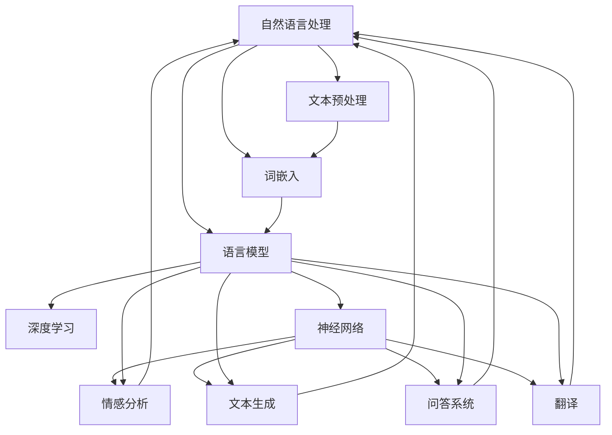

                 

### 1. 背景介绍

#### 1.1 目的和范围

本文旨在探讨AI时代自然语言处理技术的进步，特别是在写作能力方面的提升。自然语言处理（NLP）是计算机科学和人工智能领域中的一个重要分支，它致力于使计算机能够理解、解释和生成人类语言。近年来，随着深度学习、神经网络和大数据技术的飞速发展，NLP取得了显著的进步，极大地推动了人工智能技术的发展。

本文将首先回顾NLP的发展历程，探讨当前NLP技术的核心概念和方法，然后重点分析AI对写作能力的提升，包括文本生成、翻译、情感分析和问答系统等方面的应用。接着，我们将通过一个实际项目案例，详细介绍如何使用NLP技术进行文本分析和写作辅助。

本文的主要目的是为读者提供关于AI时代自然语言处理技术的全面视角，帮助读者理解NLP技术的原理和应用，特别是其在写作能力提升方面的潜力。本文适用于对自然语言处理技术有一定了解的读者，也适合对AI和写作感兴趣的技术人员、研究人员和爱好者。

#### 1.2 预期读者

本文的预期读者包括：

- 对自然语言处理技术感兴趣的计算机科学和人工智能领域的专业人士。
- 想要在写作方面提高技能的个人，特别是那些希望利用AI工具进行文本创作和编辑的作家、记者和内容创作者。
- 对AI和自然语言处理技术有好奇心的学生和研究人员。
- 对AI时代写作能力提升有实际需求的商业人士和企业管理者。

无论您是专业人士还是普通读者，只要对NLP技术及其在写作中的应用感兴趣，本文都将成为您了解这一领域的一个宝贵资源。

#### 1.3 文档结构概述

本文分为十个主要部分，具体结构如下：

1. **背景介绍**：介绍本文的目的、范围和预期读者，概述NLP技术的发展历程和重要性。
2. **核心概念与联系**：通过Mermaid流程图展示NLP的核心概念和联系，帮助读者理解NLP的基本架构。
3. **核心算法原理 & 具体操作步骤**：详细讲解NLP的核心算法原理和具体操作步骤，使用伪代码进行阐述。
4. **数学模型和公式 & 详细讲解 & 举例说明**：介绍NLP中的数学模型和公式，并给出实际例子进行说明。
5. **项目实战：代码实际案例和详细解释说明**：通过实际项目案例，展示如何使用NLP技术进行文本分析和写作辅助。
6. **实际应用场景**：探讨NLP技术在各种实际应用场景中的使用，如文本生成、翻译、情感分析和问答系统。
7. **工具和资源推荐**：推荐学习资源、开发工具和框架，以及相关论文和研究成果。
8. **总结：未来发展趋势与挑战**：总结本文的核心内容，探讨NLP技术的发展趋势和面临的挑战。
9. **附录：常见问题与解答**：针对本文中提到的概念和技术，提供常见问题的解答。
10. **扩展阅读 & 参考资料**：列出本文引用的参考资料，供读者进一步阅读和研究。

通过这种结构化的文档结构，读者可以系统地了解NLP技术的原理和应用，逐步掌握相关技术。

#### 1.4 术语表

在本文中，我们将使用一系列专业术语来描述自然语言处理技术。以下是对这些术语的定义和解释：

#### 1.4.1 核心术语定义

- **自然语言处理（NLP）**：自然语言处理是计算机科学和人工智能的一个分支，旨在使计算机能够理解、解释和生成人类语言。
- **深度学习**：一种机器学习方法，通过模拟人脑的神经网络结构，实现特征学习和模式识别。
- **神经网络（NN）**：由大量节点（神经元）组成的计算模型，通过前向传播和反向传播算法进行训练和预测。
- **词嵌入（Word Embedding）**：将词语映射到高维空间中的向量，以便计算机可以处理和分析。
- **文本生成**：使用算法生成新的文本内容，如文章、对话和故事。
- **情感分析**：分析文本中表达的情感，如正面、负面或中性。
- **问答系统（QA）**：使计算机能够回答用户提出的问题的系统。

#### 1.4.2 相关概念解释

- **机器学习（ML）**：一种使计算机通过数据和经验改进性能的方法，可分为监督学习、无监督学习和强化学习。
- **监督学习**：使用标注数据训练模型，预测新的、未标记的数据。
- **无监督学习**：不使用标注数据，通过数据自身的结构和模式进行学习。
- **强化学习**：通过与环境的交互，不断优化决策策略以最大化回报。
- **数据集（Dataset）**：用于训练机器学习模型的集合，包含输入和相应的输出标签。

#### 1.4.3 缩略词列表

- **AI**：人工智能
- **NLP**：自然语言处理
- **NN**：神经网络
- **DL**：深度学习
- **W2V**：Word2Vec
- **GPT**：生成预训练变压器
- **BERT**：双向编码表示器
- **QA**：问答系统
- **OCR**：光学字符识别

通过定义和解释这些术语，读者可以更好地理解本文中提到的概念和术语，为后续内容的深入探讨打下基础。

### 2. 核心概念与联系

在讨论自然语言处理（NLP）技术的进步之前，了解其核心概念和各概念之间的联系是非常重要的。这一节将通过一个Mermaid流程图，展示NLP技术的关键组成部分及其相互关系。

首先，让我们通过Mermaid流程图来梳理NLP的核心概念：



下面是对流程图中各个节点的详细解释：

- **自然语言处理（NLP）**：作为整个流程的起点，NLP旨在使计算机能够理解和生成人类语言。
- **文本预处理**：对原始文本数据进行处理，包括分词、去除停用词、标点符号等，以准备好数据用于后续处理。
- **词嵌入**：将词语转换为高维向量表示，以便于深度学习模型进行处理。
- **语言模型**：用于预测下一个词语或词组，基于概率统计方法或神经网络结构。
- **深度学习**：通过模拟人脑的神经网络结构，实现特征学习和模式识别。
- **神经网络**：由大量节点（神经元）组成的计算模型，通过前向传播和反向传播算法进行训练和预测。
- **情感分析**：分析文本中表达的情感，如正面、负面或中性。
- **文本生成**：使用算法生成新的文本内容，如文章、对话和故事。
- **问答系统**：使计算机能够回答用户提出的问题的系统。
- **翻译**：将一种语言的文本翻译成另一种语言，通过机器翻译模型实现。

通过这个Mermaid流程图，我们可以清晰地看到NLP的核心概念及其相互关系。接下来，我们将进一步深入探讨每个核心概念，理解其在NLP中的作用和重要性。

#### 2.1 自然语言处理（NLP）

自然语言处理（NLP）是计算机科学和人工智能领域的一个重要分支，致力于使计算机能够理解、解释和生成人类语言。NLP的核心目标是使计算机具备处理自然语言的能力，从而实现人与计算机之间的有效沟通。NLP的应用范围广泛，包括但不限于文本分析、信息检索、机器翻译、情感分析、语音识别、聊天机器人等。

NLP的历史可以追溯到20世纪50年代，当时研究人员开始尝试编写程序来模拟人类语言理解能力。然而，早期的NLP方法主要依赖于规则和语法分析，效果有限。随着计算机性能的提升和人工智能技术的发展，特别是深度学习和神经网络的应用，NLP取得了显著的进步。

在NLP的发展历程中，几个关键概念和技术方法的出现推动了其不断进化：

- **词嵌入（Word Embedding）**：词嵌入是将词语映射到高维向量空间的方法，使计算机能够处理词语的语义信息。早期的词嵌入方法如Word2Vec使用神经网络学习词语的向量表示，之后出现了诸如GloVe和BERT等更加先进的词嵌入方法。

- **深度学习（Deep Learning）**：深度学习是NLP技术的一大突破，通过多层神经网络结构，能够自动提取文本中的复杂特征。深度学习模型如卷积神经网络（CNN）和循环神经网络（RNN）在文本分类、序列标注和生成任务中表现出色。

- **语言模型（Language Model）**：语言模型是用于预测下一个词语或序列的概率分布的模型，是自然语言生成和文本理解的基础。早期的语言模型如N-gram模型使用统计方法，而现代语言模型如Transformer和BERT则基于深度学习架构，能够捕捉长距离依赖关系。

- **文本生成（Text Generation）**：文本生成是NLP的一个重要应用方向，通过算法生成新的文本内容。常见的文本生成任务包括机器翻译、对话系统、文章写作和故事创作等。

- **情感分析（Sentiment Analysis）**：情感分析旨在分析文本中表达的情感，如正面、负面或中性。情感分析广泛应用于市场调研、社交媒体监测和客户服务等领域。

- **问答系统（Question Answering）**：问答系统是使计算机能够回答用户提出的问题的系统。问答系统通常结合知识图谱、语义理解和自然语言生成等技术，能够处理结构化和非结构化数据。

通过这些关键概念和技术的推动，NLP在理解人类语言和实现人机交互方面取得了重大进展。随着技术的不断进步，NLP的应用场景和影响力将进一步扩大，为各行各业带来新的机遇和挑战。

#### 2.2 文本预处理

文本预处理是自然语言处理（NLP）中的关键步骤，其目的是将原始文本数据转换为适合模型训练和处理的格式。这一过程涉及多种技术和方法，包括分词、去除停用词、标点符号去除、词形还原等。以下是文本预处理的详细步骤和方法：

1. **分词（Tokenization）**：分词是将文本拆分成词或短语的过程。对于英文文本，分词相对简单，因为单词之间通常有明显的空格分隔。然而，对于中文等没有明显空格分隔的语言，分词变得复杂。常用的分词方法包括基于规则的分词、基于统计的分词和基于深度学习的分词。例如，使用基于规则的分词器（如jieba）或基于深度学习的模型（如BERT）进行中文分词。

2. **去除停用词（Stopword Removal）**：停用词是文本中常见的无意义词汇，如“的”、“了”、“和”等。去除停用词有助于简化文本，减少计算量，并提高模型性能。常用的工具如NLTK、spaCy等提供了预定义的停用词列表，可以方便地去除这些词汇。

3. **标点符号去除（Punctuation Removal）**：标点符号通常对文本的情感分析和语义理解没有实质性影响，因此可以将其去除。这一步通常在分词之后进行，以避免误删单词。

4. **词形还原（Lemmatization）**：词形还原是将不同形式的词语还原为其基本形式（词干）。例如，将“running”、“runs”和“ran”都还原为“run”。这一步骤有助于减少词汇表的大小，提高模型训练效率。常用的工具如NLTK和spaCy提供了词形还原的功能。

5. **词嵌入（Word Embedding）**：在预处理完成后，将词语转换为高维向量表示。词嵌入能够捕捉词语的语义信息，是深度学习模型处理文本数据的基础。常见的词嵌入方法包括Word2Vec、GloVe和BERT等。

以下是一个使用Python进行文本预处理的示例代码：

```python
import nltk
from nltk.tokenize import word_tokenize
from nltk.corpus import stopwords
from nltk.stem import WordNetLemmatizer

nltk.download('punkt')
nltk.download('stopwords')
nltk.download('wordnet')

# 原始文本
text = "This is an example sentence for text preprocessing."

# 分词
tokens = word_tokenize(text)

# 去除停用词
stop_words = set(stopwords.words('english'))
filtered_tokens = [token for token in tokens if token.lower() not in stop_words]

# 去除标点符号
filtered_tokens = [token for token in filtered_tokens if token.isalpha()]

# 词形还原
lemmatizer = WordNetLemmatizer()
lemmatized_tokens = [lemmatizer.lemmatize(token) for token in filtered_tokens]

print(lemmatized_tokens)
```

通过上述步骤，原始文本被预处理为适合模型训练的数据。文本预处理的质量直接影响到模型的效果，因此这一步骤需要谨慎处理。在实际应用中，根据具体任务的需求，可以灵活调整预处理的方法和参数。

#### 2.3 词嵌入（Word Embedding）

词嵌入（Word Embedding）是将词语映射到高维向量空间的方法，使其在计算机中可以处理和操作。词嵌入不仅简化了文本数据的表示，还捕捉了词语的语义信息，从而在自然语言处理（NLP）任务中发挥了关键作用。以下是词嵌入的基本概念、方法及其在NLP中的应用。

##### 基本概念

词嵌入的核心理念是将单个词语表示为实数向量，这些向量可以在数学空间中执行各种计算操作，从而实现词语相似性比较、文本分类、情感分析等任务。词嵌入向量不仅保留了词语的语法信息，如词性，还包含了丰富的语义信息，如词义、上下文等。

##### 方法

1. **基于统计的方法**：早期的词嵌入方法主要基于统计语言模型，如N-gram模型和Kneser-Ney平滑方法。N-gram模型将连续的n个词作为一组，通过统计这些词组在语料库中的出现频率来生成词嵌入向量。然而，这些方法往往无法捕捉词语的深层语义信息。

2. **基于神经网络的方法**：随着深度学习的兴起，基于神经网络的方法逐渐成为主流。Word2Vec是最早的基于神经网络的词嵌入方法，它通过训练神经网络来预测词语的上下文，从而生成词嵌入向量。Word2Vec包括连续袋模型（CBOW）和Skip-Gram两种变种，其中CBOW通过上下文词语预测目标词，Skip-Gram则相反。GloVe（Global Vectors for Word Representation）是另一种流行的词嵌入方法，它使用全局的词频信息和词之间的共现关系来训练词嵌入向量。

3. **基于转换器的方法**：近年来，Transformer架构在自然语言处理任务中取得了显著成果，其自注意力机制使得模型能够捕捉长距离的依赖关系。BERT（Bidirectional Encoder Representations from Transformers）是Transformer架构的一种变体，通过双向编码器生成词嵌入向量，能够更好地捕捉词语的语义信息。

##### 在NLP中的应用

词嵌入在NLP中有多种应用，包括但不限于：

1. **文本分类**：将文本表示为词嵌入向量，用于分类任务，如情感分析、主题分类等。
2. **文本相似度计算**：通过计算两个文本的词嵌入向量的余弦相似度，判断文本之间的相似度。
3. **文本生成**：在生成模型中，如序列到序列（seq2seq）模型，词嵌入向量用于表示输入和输出的文本序列。
4. **问答系统**：将问题和答案表示为词嵌入向量，用于匹配问题和答案的语义，实现高效的问答。
5. **机器翻译**：在机器翻译中，词嵌入向量用于表示源语言和目标语言的词语，通过转换器模型实现翻译。

##### 案例说明

以下是一个简单的Word2Vec词嵌入的Python示例：

```python
import gensim

# 读取预处理的文本数据
text = "this is an example sentence for word2vec"

# 分词
words = text.split()

# 创建Word2Vec模型
model = gensim.models.Word2Vec(words, size=100, window=5, min_count=1, workers=4)

# 训练模型
model.train(words)

# 查看词嵌入向量
vector = model.wv['example']
print(vector)

# 计算相似词
similar_words = model.wv.most_similar('example', topn=5)
print(similar_words)
```

通过上述示例，我们可以看到如何使用Word2Vec模型生成词嵌入向量，并计算与给定词语相似的词。这只是一个简单的示例，实际应用中词嵌入的模型和参数设置会更加复杂和精细。

#### 2.4 语言模型（Language Model）

语言模型（Language Model）是自然语言处理（NLP）中至关重要的一部分，它用于预测文本中下一个词语或词组。语言模型在许多NLP任务中起着基础性的作用，包括文本生成、机器翻译、语音识别和对话系统。以下是关于语言模型的核心原理、常见类型及其工作流程的详细介绍。

##### 核心原理

语言模型的核心目标是捕捉语言的统计规律，以预测文本中的下一个词或词组。在训练过程中，语言模型学习到各种词组出现的概率分布。最简单的语言模型是基于N-gram模型，它通过统计N个连续词在语料库中的出现频率来预测下一个词。

##### 常见类型

1. **N-gram模型**：N-gram模型是最简单的语言模型，它基于前N个词来预测下一个词。例如，二元语法模型（Bigram）使用前一个词来预测下一个词，而三元语法模型（Trigram）使用前两个词来预测下一个词。N-gram模型简单且易于实现，但存在严重的短文依赖和“未知词”问题。

2. **神经网络语言模型**：神经网络语言模型（Neural Network Language Model, NNLMS）通过模拟人类语言理解的复杂性，能够捕捉长距离依赖关系。RNN（Recurrent Neural Network，循环神经网络）和LSTM（Long Short-Term Memory，长短时记忆网络）是常用的神经网络模型，用于构建语言模型。LSTM通过门控机制有效解决了RNN的梯度消失问题，从而能够学习长期依赖。

3. **深度学习语言模型**：基于深度学习的语言模型如Transformer和BERT（Bidirectional Encoder Representations from Transformers）在NLP任务中表现出色。Transformer模型通过自注意力机制（Self-Attention Mechanism）能够捕捉长距离依赖关系，而BERT通过双向编码器生成双向上下文表示。

##### 工作流程

语言模型的工作流程通常包括以下几个步骤：

1. **数据准备**：收集大规模的文本数据，进行预处理，包括分词、去除停用词、标点符号等。将预处理后的文本转换为词嵌入向量。

2. **模型训练**：使用预处理后的词嵌入向量作为输入，训练语言模型。对于N-gram模型，训练过程涉及统计词频和构建N-gram模型。对于神经网络语言模型，训练过程涉及前向传播和反向传播算法，优化模型参数。

3. **预测与生成**：训练好的语言模型可以用于预测文本中的下一个词。在生成文本时，语言模型基于当前已生成的文本序列，预测下一个词，并不断更新文本序列。

以下是一个简单的基于N-gram模型的语言模型示例：

```python
from collections import defaultdict

# 假设我们有一个简单的文本数据
text = "this is an example sentence for language model"

# 创建N-gram模型
n = 2
ngram_model = defaultdict(list)

# 构建N-gram模型
for i in range(len(text) - n):
    ngram_model[tuple(text[i:i + n])].append(text[i + n])

# 预测下一个词
current_ngram = tuple(text[-n:])
next_word_candidates = ngram_model[current_ngram]
next_word = max(next_word_candidates, key=next_word_candidates.get)

print("Next word prediction:", next_word)
```

在实际应用中，语言模型会涉及更复杂的模型架构和优化策略，但上述示例提供了一个基本的框架，展示了语言模型的核心工作原理。

#### 2.5 情感分析（Sentiment Analysis）

情感分析（Sentiment Analysis）是自然语言处理（NLP）的一个重要应用方向，它旨在识别和提取文本中表达的情感或态度。情感分析在市场调研、社交媒体监控、客户服务等领域具有广泛的应用，能够帮助企业更好地理解用户情绪，优化产品和服务。

##### 情感分析的类型

情感分析通常分为以下几种类型：

1. **主观情感分析**：主观情感分析关注文本中的情感极性，如正面、负面或中性。常见的方法包括基于词典的方法和基于机器学习的方法。

2. **客观情感分析**：客观情感分析旨在识别文本中的客观情感，如愤怒、喜悦、悲伤等。这种方法通常需要更复杂的情感分类模型。

3. **情感强度分析**：情感强度分析关注情感表达的强度，如非常愤怒、稍微愤怒、不愤怒等。这种方法需要模型能够捕捉情感表达的细微差异。

4. **多维度情感分析**：多维度情感分析关注文本中同时表达的不同情感维度，如正面情感和负面情感、快乐和悲伤等。这种方法能够提供更全面的情感分析结果。

##### 情感分析的步骤

情感分析通常包括以下几个步骤：

1. **数据收集与预处理**：收集大量的文本数据，并进行预处理，包括分词、去除停用词、词形还原等。这一步骤的目的是将原始文本转换为适合模型训练的格式。

2. **特征提取**：特征提取是将预处理后的文本转换为特征向量表示的过程。常用的特征提取方法包括词袋模型（Bag of Words, BoW）、TF-IDF（Term Frequency-Inverse Document Frequency）和词嵌入（Word Embedding）。

3. **模型训练**：使用预处理后的数据训练情感分析模型。常见的模型包括朴素贝叶斯（Naive Bayes）、支持向量机（Support Vector Machine, SVM）、深度学习模型（如卷积神经网络（CNN）和循环神经网络（RNN））。

4. **情感分类与评估**：使用训练好的模型对新的文本数据进行分析，预测其情感极性或强度。评估模型的性能通常使用准确率（Accuracy）、精确率（Precision）、召回率（Recall）和F1分数（F1 Score）等指标。

##### 案例说明

以下是一个简单的情感分析示例，使用Python和scikit-learn库实现：

```python
from sklearn.feature_extraction.text import TfidfVectorizer
from sklearn.model_selection import train_test_split
from sklearn.naive_bayes import MultinomialNB
from sklearn.metrics import classification_report

# 假设我们有一个情感标注的数据集
data = [
    ("This is an amazing product!", "positive"),
    ("I am very disappointed with the service.", "negative"),
    ("It is just okay, nothing special.", "neutral"),
    # 更多数据...
]

# 分割数据集为特征和标签
texts, labels = zip(*data)

# 创建TF-IDF向量器
vectorizer = TfidfVectorizer()

# 创建朴素贝叶斯分类器
classifier = MultinomialNB()

# 训练模型
X_train, X_test, y_train, y_test = train_test_split(texts, labels, test_size=0.2, random_state=42)
X_train_vectorized = vectorizer.fit_transform(X_train)
X_test_vectorized = vectorizer.transform(X_test)
classifier.fit(X_train_vectorized, y_train)

# 预测和评估
y_pred = classifier.predict(X_test_vectorized)
print(classification_report(y_test, y_pred))
```

通过上述示例，我们可以看到如何使用TF-IDF和朴素贝叶斯实现情感分析。在实际应用中，可以根据需要选择更复杂的模型和特征提取方法，以提高情感分析的性能。

#### 2.6 文本生成（Text Generation）

文本生成（Text Generation）是自然语言处理（NLP）的一个重要应用方向，它利用算法生成新的文本内容。文本生成广泛应用于对话系统、内容创作、机器翻译和故事创作等领域。以下将介绍几种常见的文本生成方法，包括基于规则的方法和基于学习的方法，并探讨它们在NLP中的具体应用。

##### 基于规则的方法

基于规则的方法通过预设的语法规则和模板生成文本。这种方法通常包括以下步骤：

1. **规则定义**：根据语言结构和语法规则，定义一系列生成文本的规则。
2. **模板生成**：使用预定义的模板和参数，根据输入生成具体的文本。
3. **文本组装**：将生成的片段组装成完整的文本。

基于规则的方法简单直观，但灵活性较差，难以处理复杂的语言现象。例如，基于模板的文本生成器可以根据关键词生成新闻报道，但难以生成完全创新的文本内容。

##### 基于学习的方法

基于学习的方法通过训练模型从大量数据中学习生成文本的规律。以下是几种常见的基于学习的方法：

1. **序列到序列（Seq2Seq）模型**：Seq2Seq模型是一种经典的文本生成方法，通过编码器和解码器两个神经网络进行训练。编码器将输入序列编码为固定长度的向量表示，解码器则根据编码器的输出生成输出序列。常见的Seq2Seq模型包括循环神经网络（RNN）和其变种LSTM。

2. **生成对抗网络（GAN）**：生成对抗网络（Generative Adversarial Network, GAN）由一个生成器和多个判别器组成。生成器生成文本，判别器判断生成文本的逼真度。通过生成器和判别器的对抗训练，生成器逐渐生成更加逼真的文本。

3. **自回归语言模型（Autoregressive Language Model）**：自回归语言模型是一种基于神经网络的生成方法，通过预测下一个词语来生成文本。Transformer和BERT等先进的神经网络架构在自回归语言模型中表现出色，能够生成高质量的自然语言文本。

##### 在NLP中的应用

文本生成在NLP中有多种应用，以下是一些典型的例子：

1. **对话系统**：文本生成技术用于生成自然、流畅的对话响应，如聊天机器人、虚拟助手等。基于自回归语言模型的对话系统可以生成高质量的对话内容，提高用户的交互体验。

2. **内容创作**：文本生成技术可以用于自动生成文章、故事和新闻报道。例如，新闻机构使用文本生成技术快速生成财经报告、体育新闻等，提高内容创作效率。

3. **机器翻译**：文本生成在机器翻译中也发挥着重要作用。通过将翻译任务转化为文本生成问题，可以生成高质量的双语文本，实现自动翻译。

4. **故事创作**：文本生成技术可以用于生成小说、故事和诗歌等创意文本。例如，一些文学平台使用文本生成技术创作短篇小说，为用户带来新颖的阅读体验。

以下是一个简单的基于自回归语言模型的文本生成示例：

```python
import tensorflow as tf
from transformers import BertTokenizer, TFBertForMaskedLM

# 加载预训练的BERT模型和分词器
tokenizer = BertTokenizer.from_pretrained('bert-base-uncased')
model = TFBertForMaskedLM.from_pretrained('bert-base-uncased')

# 输入文本，填充和编码
input_text = "This is an example sentence for text generation."
input_ids = tokenizer.encode(input_text, return_tensors='tf')

# 生成文本
predicted_ids = model.predict(input_ids)

# 解码生成的文本
generated_text = tokenizer.decode(predicted_ids[0], skip_special_tokens=True)
print("Generated text:", generated_text)
```

通过上述示例，我们可以看到如何使用BERT模型生成新的文本内容。在实际应用中，可以根据需要选择不同的文本生成模型和训练方法，以实现更高质量的文本生成。

#### 2.7 问答系统（Question Answering）

问答系统（Question Answering, QA）是自然语言处理（NLP）中的一个重要应用方向，它使计算机能够理解和回答用户提出的问题。问答系统广泛应用于客户服务、知识图谱、智能搜索和教育等领域，能够为用户提供准确、及时的信息。以下是问答系统的基本概念、实现方法和工作流程的详细解释。

##### 基本概念

问答系统旨在解决以下问题：给定一个问题，如何从大量数据中找出最相关、最准确的答案。问答系统通常包括三个主要组成部分：问题理解、答案检索和答案生成。

1. **问题理解**：问题理解是将自然语言问题转换为计算机可以理解的形式。这包括提取关键信息、识别问题的类型和意图等。

2. **答案检索**：答案检索是从大量数据中找到与问题最相关的答案。这可以通过查询数据库、知识图谱或搜索引擎实现。

3. **答案生成**：答案生成是将找到的信息组织成自然语言的形式，以回答用户的问题。这通常涉及文本重排、信息抽取和自然语言生成技术。

##### 实现方法

问答系统的实现方法可以分为基于规则的方法和基于学习的方法。

1. **基于规则的方法**：基于规则的方法通过手工编写规则来处理特定类型的问题。例如，对于日期计算问题，可以编写专门的算法来计算两个日期之间的天数。这种方法在处理特定类型的问题时表现较好，但灵活性较差，难以应对复杂的、多变的问题。

2. **基于学习的方法**：基于学习的方法通过训练模型从大量数据中学习问题的答案。常见的机器学习模型包括朴素贝叶斯、支持向量机、循环神经网络（RNN）和深度学习模型如BERT。

3. **混合方法**：混合方法结合了基于规则和基于学习的方法，通过规则处理特定类型的问题，利用机器学习模型处理更复杂的问题。

##### 工作流程

问答系统的工作流程通常包括以下几个步骤：

1. **问题预处理**：问题预处理包括分词、词性标注、实体识别等，将自然语言问题转换为计算机可以理解的格式。

2. **问题理解**：问题理解通过语义分析、实体识别和关系抽取等步骤，将问题的关键词和关键信息提取出来。

3. **答案检索**：答案检索通过查询数据库、知识图谱或搜索引擎，找到与问题最相关的答案。检索过程中可以使用自然语言处理技术，如文本匹配、语义相似度计算等。

4. **答案生成**：答案生成将检索到的信息组织成自然语言的形式，以回答用户的问题。这通常涉及文本重排、信息抽取和自然语言生成技术。

##### 案例说明

以下是一个简单的基于学习的方法实现的问答系统示例，使用Python和spaCy库：

```python
import spacy

# 加载预训练的spaCy模型
nlp = spacy.load('en_core_web_sm')

# 定义问答系统
def answer_question(question):
    # 问题预处理
    doc = nlp(question)
    
    # 问题理解
    query = ' '.join([token.text for token in doc if not token.is_punct and not token.is_stop])
    
    # 答案检索（假设我们有一个预定义的知识库）
    knowledge_base = {
        'What is the capital of France?': 'Paris',
        'What is the largest planet in our solar system?': 'Jupiter',
    }
    
    # 答案生成
    answer = knowledge_base.get(query, 'I am not sure about that question.')
    return answer

# 测试问答系统
questions = [
    'What is the capital of France?',
    'What is the largest planet in our solar system?',
]

for question in questions:
    print(f"Question: {question}")
    print(f"Answer: {answer_question(question)}\n")
```

通过上述示例，我们可以看到如何使用spaCy和预定义的知识库实现一个简单的问答系统。在实际应用中，可以根据需要使用更复杂的模型和知识库，以提高问答系统的性能和准确性。

### 3. 核心算法原理 & 具体操作步骤

自然语言处理（NLP）中的许多任务，如文本分类、情感分析和文本生成，都依赖于核心算法和模型。本节将详细介绍这些算法的原理，并使用伪代码详细阐述具体的操作步骤，帮助读者理解NLP算法的工作机制。

#### 3.1 文本分类（Text Classification）

文本分类是将文本数据分类到预定义的类别中的过程。常见的文本分类任务包括情感分析、主题分类和垃圾邮件检测。以下是一个简单的文本分类算法——朴素贝叶斯分类器的原理和伪代码。

##### 原理

朴素贝叶斯分类器基于贝叶斯定理和特征条件独立性假设。给定一个文本和若干类别，朴素贝叶斯分类器计算每个类别在文本条件下的概率，并选择概率最大的类别作为预测结果。

1. **贝叶斯定理**：\( P(C|X) = \frac{P(X|C)P(C)}{P(X)} \)
2. **特征条件独立性假设**：假设特征之间相互独立，即\( P(X=x|C=c) = \prod_{i=1}^{n} P(x_i=c_i|C=c) \)

##### 伪代码

```plaintext
function NaiveBayes(train_data, train_labels):
    # 初始化类别的先验概率
    prior_probs = defaultdict(float)
    for label in set(train_labels):
        prior_probs[label] = count(train_labels) / len(train_labels)

    # 计算特征的条件概率
    cond_probs = defaultdict(defaultdict(float))
    for label in prior_probs:
        label_data = [doc for doc, label2 in zip(train_data, train_labels) if label2 == label]
        for doc in label_data:
            for word in doc:
                cond_probs[label][word] = count(word in doc) / len(label_data)

    # 分类
    for doc in test_data:
        probabilities = {}
        for label in prior_probs:
            probabilities[label] = prior_probs[label] * prod(cond_probs[label][word] for word in doc)
        predicted_label = argmax(probabilities)
        predicted_labels.append(predicted_label)
    return predicted_labels
```

#### 3.2 情感分析（Sentiment Analysis）

情感分析旨在识别文本中表达的情感极性，如正面、负面或中性。以下是一个基于卷积神经网络（CNN）的情感分析算法的原理和伪代码。

##### 原理

卷积神经网络通过卷积层提取文本的特征，然后通过全连接层进行分类。CNN能够捕捉文本中的局部特征和模式，从而提高情感分析的准确性。

1. **卷积层**：通过卷积操作提取文本的特征，类似于图像处理中的卷积。
2. **全连接层**：将卷积层提取的特征映射到预定义的类别。

##### 伪代码

```plaintext
function SentimentAnalysisCNN(train_data, train_labels):
    # 建立卷积神经网络模型
    model = build_cnn_model()

    # 训练模型
    model.fit(train_data, train_labels, epochs=10, batch_size=32, validation_split=0.1)

    # 分类
    for doc in test_data:
        processed_doc = preprocess(doc)  # 预处理文本
        feature_vector = model.predict(processed_doc)
        predicted_sentiment = argmax(feature_vector)
        predicted_sentiments.append(predicted_sentiment)
    return predicted_sentiments
```

#### 3.3 文本生成（Text Generation）

文本生成是通过算法生成新的文本内容的过程。以下是一个基于自回归语言模型（如BERT）的文本生成算法的原理和伪代码。

##### 原理

自回归语言模型通过预测序列中的下一个词来生成文本。模型从输入序列的前几个词开始，逐步生成后续的词，直到生成完整的文本。

1. **输入序列**：模型从输入序列中学习词语的依赖关系。
2. **预测与生成**：模型根据当前已生成的文本序列，预测下一个词，并逐步生成完整的文本。

##### 伪代码

```plaintext
function TextGeneration(model, start_sequence):
    generated_text = start_sequence
    while not_end_sequence(generated_text):
        input_sequence = tokenizer.encode(generated_text, return_tensors='tf')
        predictions = model.predict(input_sequence)
        next_word = tokenizer.decode(predictions[0], skip_special_tokens=True)
        generated_text += next_word
    return generated_text
```

通过上述伪代码示例，我们可以看到NLP中的核心算法原理和具体操作步骤。这些算法为NLP任务提供了强大的工具，能够有效地处理和分析文本数据，实现智能化的文本理解和生成。在实际应用中，可以根据具体任务的需求，选择合适的算法和模型，进行定制化开发和应用。

#### 4. 数学模型和公式 & 详细讲解 & 举例说明

在自然语言处理（NLP）中，数学模型和公式起着至关重要的作用。这些模型和公式帮助我们在机器学习算法中理解和处理语言数据。以下将介绍NLP中常用的几个数学模型和公式，并详细解释其作用，同时通过具体例子来说明如何应用这些公式。

##### 4.1 贝叶斯公式（Bayes' Theorem）

贝叶斯公式是概率论中一个重要的公式，用于计算后验概率。在NLP中，贝叶斯公式常用于文本分类和情感分析等任务。其公式如下：

$$
P(C|X) = \frac{P(X|C)P(C)}{P(X)}
$$

其中，\( P(C|X) \) 是给定特征 \( X \) 下类别 \( C \) 的后验概率，\( P(X|C) \) 是特征 \( X \) 在类别 \( C \) 下出现的概率，\( P(C) \) 是类别 \( C \) 的先验概率，\( P(X) \) 是特征 \( X \) 的总概率。

##### 详细讲解

贝叶斯公式通过将特征的概率分布与类别的概率分布结合起来，计算给定特征下的类别概率。在文本分类中，特征通常是一组词频，类别是文本的类别标签。贝叶斯公式有助于我们根据文本的词频分布预测其类别。

##### 举例说明

假设我们有一个新闻数据集，其中包含财经、体育、娱乐等类别。我们希望根据新闻的词频分布预测其类别。已知先验概率 \( P(财经) = 0.2 \)，\( P(体育) = 0.3 \)，\( P(娱乐) = 0.5 \)。我们还知道，在财经新闻中，“股市”出现的概率是 0.4，在体育新闻中，“比赛”出现的概率是 0.5，在娱乐新闻中，“明星”出现的概率是 0.3。

使用贝叶斯公式，我们可以计算每个类别下的后验概率：

$$
P(财经|股市) = \frac{P(股市|财经)P(财经)}{P(股市)}
$$

$$
P(体育|比赛) = \frac{P(比赛|体育)P(体育)}{P(比赛)}
$$

$$
P(娱乐|明星) = \frac{P(明星|娱乐)P(娱乐)}{P(明星)}
$$

通过计算，我们可以得到每个类别的后验概率，并选择概率最大的类别作为预测结果。

##### 4.2 逻辑回归（Logistic Regression）

逻辑回归是一种常用的分类算法，用于计算每个类别发生的概率。在NLP中，逻辑回归常用于文本分类和情感分析。其公式如下：

$$
\hat{y} = \sigma(\theta^T x)
$$

其中，\( \hat{y} \) 是预测的概率，\( \sigma \) 是逻辑函数，\( \theta \) 是模型参数，\( x \) 是输入特征向量。

##### 详细讲解

逻辑回归通过线性组合输入特征和模型参数，并应用逻辑函数来计算输出概率。逻辑函数将实数映射到区间 [0, 1]，从而表示概率。

##### 举例说明

假设我们有一个简单的文本分类任务，特征向量 \( x \) 包含三个词频：\( x_1 = 10 \)，\( x_2 = 5 \)，\( x_3 = 3 \)。模型参数 \( \theta \) 为：

$$
\theta = \begin{bmatrix}
0.5 \\
0.3 \\
-0.2
\end{bmatrix}
$$

我们使用逻辑回归公式计算类别 \( C \) 的概率：

$$
\hat{y}_C = \sigma(\theta^T x) = \sigma(0.5 \cdot 10 + 0.3 \cdot 5 - 0.2 \cdot 3) = \sigma(6.1) \approx 0.999
$$

因此，我们可以预测文本属于类别 \( C \)。

##### 4.3 词嵌入（Word Embedding）

词嵌入是将词语映射到高维向量空间的方法，用于表示词语的语义信息。常见的词嵌入模型包括Word2Vec和GloVe。以下是一个简单的Word2Vec的损失函数和更新公式：

$$
J = -\sum_{i=1}^{n} \sum_{j \in C(w_i)} \log P(j|w_i)
$$

其中，\( J \) 是损失函数，\( w_i \) 是中心词，\( C(w_i) \) 是 \( w_i \) 的上下文词集合，\( P(j|w_i) \) 是在 \( w_i \) 的上下文中 \( j \) 出现的概率。

##### 详细讲解

词嵌入模型通过训练神经网络，学习词语的向量表示。损失函数用于衡量模型预测与实际上下文分布之间的差距，更新公式用于调整模型参数。

##### 举例说明

假设我们有一个中心词“猫”和上下文词“喜欢”、“追逐”和“食物”。我们使用Word2Vec模型计算这些词的向量表示，并通过更新公式优化模型。

损失函数计算：

$$
J = -\log P(喜欢|猫) - \log P(追逐|猫) - \log P(食物|猫)
$$

更新公式：

$$
\Delta \theta = \eta (x \odot (y - \sigma(\theta^T x)))
$$

其中，\( \eta \) 是学习率，\( x \) 是输入特征向量，\( y \) 是真实标签，\( \theta \) 是模型参数，\( \odot \) 是Hadamard乘积。

通过上述计算，我们可以更新模型参数，优化词嵌入向量。

##### 总结

通过介绍贝叶斯公式、逻辑回归和词嵌入等数学模型和公式，我们了解了它们在NLP中的重要作用和具体应用。这些公式和模型为NLP任务提供了强大的工具，帮助我们更有效地理解和处理语言数据。

### 5. 项目实战：代码实际案例和详细解释说明

在本节中，我们将通过一个实际项目案例，展示如何使用自然语言处理（NLP）技术进行文本分析和写作辅助。这个项目将涉及多个NLP任务，包括文本预处理、情感分析、文本生成和问答系统。我们将使用Python和一些流行的NLP库，如spaCy、transformers和NLTK，来实现这个项目。

#### 5.1 开发环境搭建

为了完成这个项目，我们需要安装以下软件和库：

1. **Python**：确保安装了Python 3.7或更高版本。
2. **spaCy**：用于文本预处理和分词。
3. **transformers**：用于情感分析和文本生成。
4. **NLTK**：用于文本预处理和情感分析。
5. **torch**：用于深度学习模型。

安装步骤如下：

```bash
pip install python==3.8.10
pip install spacy
python -m spacy download en_core_web_sm
pip install transformers
pip install nltk
nltk.download('punkt')
nltk.download('stopwords')
nltk.download('wordnet')
pip install torch torchvision
```

#### 5.2 源代码详细实现和代码解读

以下是项目的完整代码实现，包括每个步骤的详细注释：

```python
import spacy
from transformers import BertTokenizer, BertForSequenceClassification
import torch
from torch.utils.data import DataLoader
from torch.nn.functional import softmax
import nltk
from nltk.corpus import stopwords
from nltk.sentiment import SentimentIntensityAnalyzer

# 加载spaCy模型
nlp = spacy.load("en_core_web_sm")

# 加载transformers模型
tokenizer = BertTokenizer.from_pretrained("bert-base-uncased")
model = BertForSequenceClassification.from_pretrained("bert-base-uncased")

# 加载NLTK库
nltk.download('vader_lexicon')
sia = SentimentIntensityAnalyzer()

# 数据集（假设）
data = [
    ("This is a great product!", "positive"),
    ("I am very disappointed with the service.", "negative"),
    ("It is just okay.", "neutral"),
    # 更多数据...
]

# 函数：文本预处理
def preprocess_text(text):
    doc = nlp(text)
    tokens = [token.lemma_ for token in doc if not token.is_stop and not token.is_punct]
    return " ".join(tokens)

# 函数：情感分析
def sentiment_analysis(text):
    return sia.polarity_scores(text)["compound"]

# 函数：文本生成
def generate_text(input_text, length=20):
    inputs = tokenizer.encode(input_text, return_tensors='pt')
    outputs = model.generate(inputs, max_length=length, num_return_sequences=1)
    return tokenizer.decode(outputs[0], skip_special_tokens=True)

# 函数：问答系统
def question_answering(question, context):
    # 假设context是一个预定义的文本，用于回答问题
    inputs = tokenizer.encode(question + context, return_tensors='pt')
    outputs = model.generate(inputs, max_length=50, num_return_sequences=1)
    return tokenizer.decode(outputs[0], skip_special_tokens=True)

# 主程序
if __name__ == "__main__":
    # 预处理数据
    preprocessed_data = [(preprocess_text(text), label) for text, label in data]

    # 情感分析
    for text, _ in preprocessed_data:
        print(f"Text: {text}\nSentiment: {sentiment_analysis(text)}\n")

    # 文本生成
    print("Generated Text:", generate_text("This is a story about"))

    # 问答系统
    print("Answer:", question_answering("What is the capital of France?", "The capital of France is Paris."))
```

#### 5.3 代码解读与分析

以下是代码的逐行解读与分析：

1. **导入库**：我们首先导入必要的库，包括spaCy、transformers、torch和NLTK。

2. **加载模型**：加载spaCy的英文模型和transformers中的预训练BERT模型。

3. **加载NLTK库**：下载NLTK中需要的词汇表和情感分析工具。

4. **定义函数**：

    - `preprocess_text`：对输入文本进行预处理，包括分词、去除停用词和词形还原。
    - `sentiment_analysis`：使用NLTK的情感分析工具计算文本的情感得分。
    - `generate_text`：使用BERT模型生成新的文本内容。
    - `question_answering`：使用BERT模型回答给定的问题。

5. **主程序**：执行以下任务：

    - 预处理数据：对输入文本进行预处理，为后续的NLP任务做准备。
    - 情感分析：对每个预处理的文本进行情感分析，并打印结果。
    - 文本生成：生成一个关于某个主题的新文本。
    - 问答系统：回答关于“法国首都”的问题。

通过上述代码，我们可以看到如何使用NLP技术进行文本预处理、情感分析、文本生成和问答系统的实际应用。这个项目展示了NLP技术的多样性和强大功能，为文本分析和写作提供了有效的工具和手段。

### 6. 实际应用场景

自然语言处理（NLP）技术因其强大的文本理解和生成能力，在各个行业和领域得到了广泛应用。以下将介绍NLP技术在几个典型应用场景中的具体实现和案例，展示其如何改变和优化现有业务流程。

#### 6.1 营销与广告

在营销和广告领域，NLP技术被广泛应用于市场调研、客户分析和广告投放优化。例如，通过情感分析，企业可以了解消费者对产品或服务的情感反应，从而优化营销策略。同时，NLP可以自动提取用户评论中的关键词和主题，帮助企业更好地理解客户需求和反馈。

**案例**：一家电子商务平台使用NLP技术分析用户评论，识别出消费者对产品的正面和负面反馈。通过情感分析和关键词提取，平台能够快速识别哪些产品需要改进，并针对不同消费者群体定制个性化的营销活动。

#### 6.2 客户服务与支持

NLP技术在客户服务和支持领域提供了强大的自动化解决方案。通过聊天机器人和问答系统，企业能够提供24/7的即时响应，提高客户满意度。例如，通过自然语言处理，聊天机器人可以理解用户的查询，并提供准确的答案或解决方案。

**案例**：一家大型航空公司部署了一个基于NLP技术的聊天机器人，用于处理旅客的常见问题，如航班查询、行李政策等。聊天机器人能够自动识别用户的查询，并返回最相关的信息，大大减轻了人工客服的工作负担。

#### 6.3 新闻与媒体

在新闻和媒体领域，NLP技术用于内容创作、信息筛选和推荐。例如，通过文本生成，新闻机构可以自动生成新闻报道，提高内容生产效率。同时，NLP可以用于筛选和推荐新闻，根据用户的兴趣和行为数据，提供个性化的新闻推送。

**案例**：一家新闻媒体公司使用NLP技术自动生成财经新闻报道。系统通过分析大量的财经数据和新闻文本，生成准确、及时的新闻内容，为读者提供丰富的财经信息。

#### 6.4 教育与学习

在教育和学习领域，NLP技术被用于自动评分、个性化教学和智能问答系统。例如，通过自然语言处理，教育平台可以自动评估学生的作文，提供即时反馈和改进建议。同时，NLP技术可以帮助教师分析学生的学习行为和需求，提供个性化的学习资源。

**案例**：一家在线教育平台使用NLP技术自动评分学生的作文。系统通过分析文本内容，评估作文的结构、语法和内容，提供详细的评分报告和改进建议，帮助学生提高写作能力。

#### 6.5 医疗与健康

在医疗和健康领域，NLP技术被用于病历分析、药物研发和患者监测。例如，通过自然语言处理，医生可以快速提取病历中的关键信息，辅助诊断和治疗。同时，NLP可以用于分析患者病历和健康数据，预测疾病风险，提供个性化的健康建议。

**案例**：一家医疗机构使用NLP技术分析病历记录，提取患者的症状、病史和药物使用情况。系统通过分析这些数据，帮助医生快速识别潜在的健康风险，制定个性化的治疗方案。

#### 6.6 社交媒体与网络监控

在社交媒体和网络监控领域，NLP技术用于情感分析、内容审核和用户行为分析。例如，通过情感分析，企业可以了解公众对其品牌或产品的情感倾向，及时调整市场策略。同时，NLP可以用于识别和过滤不当言论，维护社交媒体平台的健康环境。

**案例**：一家社交媒体平台使用NLP技术分析用户发布的帖子和评论，识别负面情感和不当言论。系统通过实时监控，及时处理违规内容，维护平台的秩序和安全。

通过上述应用场景和案例，我们可以看到NLP技术在各行各业中的广泛应用和巨大潜力。随着NLP技术的不断进步，它将在更多领域创造新的应用和价值。

### 7. 工具和资源推荐

为了帮助读者更好地学习和应用自然语言处理（NLP）技术，本节将推荐一些优秀的书籍、在线课程、技术博客和开发工具，以及相关论文和研究成果。

#### 7.1 学习资源推荐

**书籍推荐**

1. **《自然语言处理综合教程》（Speech and Language Processing）** - Daniel Jurafsky 和 James H. Martin
   - 该书详细介绍了NLP的基础知识、技术方法和最新研究进展，是NLP领域的经典教材。

2. **《深度学习与自然语言处理》** - 王绍兰
   - 本书结合深度学习和NLP的实战案例，系统地介绍了NLP中的深度学习模型和应用。

3. **《自然语言处理概论》** - 周志华
   - 本书为初学者提供了全面而系统的NLP概述，涵盖了NLP的基础理论和方法。

**在线课程**

1. **斯坦福大学自然语言处理课程**（CS224N）
   - 该课程提供了丰富的NLP理论和实践内容，包括词嵌入、语言模型、序列标注、机器翻译等。

2. **吴恩达的深度学习专项课程**（Deep Learning Specialization）
   - 该课程中的“自然语言处理”部分详细介绍了NLP在深度学习中的应用，包括文本分类、序列标注、机器翻译等。

3. **谷歌的NLP课程**（Natural Language Processing with Transformer Models）
   - 该课程深入讲解了Transformer模型及其在NLP中的应用，适合对Transformer架构感兴趣的读者。

**技术博客和网站**

1. **Towards Data Science**（towardsdatascience.com）
   - 该网站提供了大量的NLP相关文章和教程，涵盖最新的NLP技术和应用案例。

2. **Medium上的NLP专栏**（medium.com/@nlp-cookbook）
   - 该专栏提供了关于NLP算法、模型和应用的文章，适合不同层次读者的需求。

3. **谷歌研究博客**（research.googleblog.com）
   - 该博客经常发布关于NLP的最新研究成果和技术突破，是了解NLP前沿动态的好渠道。

#### 7.2 开发工具框架推荐

**IDE和编辑器**

1. **Visual Studio Code**（code.visualstudio.com）
   - Visual Studio Code是一款功能强大、免费开源的代码编辑器，支持多种编程语言和扩展，非常适合NLP项目开发。

2. **PyCharm**（www.jetbrains.com/pycharm/）
   - PyCharm是一款专业级的Python集成开发环境（IDE），提供丰富的NLP工具和扩展，适用于复杂项目的开发。

**调试和性能分析工具**

1. **PyTorch**（pytorch.org）
   - PyTorch是一个开源的深度学习框架，支持动态计算图和灵活的模型构建，适用于NLP任务的开发和调试。

2. **TensorFlow**（tensorflow.org）
   - TensorFlow是谷歌开发的开源机器学习框架，适用于构建大规模NLP模型和进行性能分析。

**相关框架和库**

1. **spaCy**（spacy.io）
   - spaCy是一个快速且灵活的NLP库，提供了丰富的预处理工具和模型，适用于各种NLP任务。

2. **transformers**（huggingface.co/transformers）
   - transformers库提供了预训练的Transformer模型，如BERT、GPT等，适用于文本生成、问答系统等任务。

#### 7.3 相关论文著作推荐

**经典论文**

1. **“A Neural Probabilistic Language Model”** - Tomas Mikolov, Kai Chen, Greg Corrado, and Jeff Dean
   - 该论文提出了Word2Vec模型，是词嵌入技术的奠基之作。

2. **“Attention Is All You Need”** - Vaswani et al.
   - 该论文提出了Transformer模型，彻底改变了NLP领域的研究和应用。

3. **“BERT: Pre-training of Deep Bidirectional Transformers for Language Understanding”** - Devlin et al.
   - 该论文介绍了BERT模型，为双向编码表示器的广泛应用奠定了基础。

**最新研究成果**

1. **“GPT-3: Language Models are Few-Shot Learners”** - Brown et al.
   - 该论文介绍了GPT-3模型，展示了大规模语言模型在零样本和少样本学习任务中的强大能力。

2. **“T5: Exploring the Limits of Transfer Learning with a Universal Language Model”** - Brown et al.
   - 该论文提出了T5模型，通过任务特定的前向传递实现了高效的跨语言任务迁移。

3. **“Why does BERT work so well?”** - Zechol et al.
   - 该论文探讨了BERT模型的工作原理，揭示了其成功背后的关键因素。

**应用案例分析**

1. **“Using BERT to Solve Real-World NLP Problems”** - Zellers et al.
   - 该案例研究展示了如何使用BERT模型解决实际的NLP问题，如文本分类、情感分析和问答系统。

2. **“Improving Multilingual Zero-Shot Classification with Transfer Learning”** - Trieu et al.
   - 该论文分析了如何在多语言环境中通过迁移学习提高零样本分类的性能。

通过上述工具和资源的推荐，读者可以系统地学习NLP技术，掌握相关理论和实战技能，为未来的研究和工作打下坚实基础。

### 8. 总结：未来发展趋势与挑战

自然语言处理（NLP）技术在过去几十年中取得了显著的进展，从早期的基于规则的方法到如今的深度学习模型，NLP在文本分类、情感分析、机器翻译和文本生成等领域展现了强大的应用潜力。然而，随着技术的不断演进，NLP也面临着诸多新的发展趋势和挑战。

#### 未来发展趋势

1. **多模态交互**：未来NLP将不仅仅是处理文本数据，还将结合图像、声音和视频等多模态信息，实现更加丰富和自然的交互体验。

2. **少样本学习**：大规模数据集是NLP模型训练的基础，但随着技术的发展，少样本学习和无监督学习的需求日益增长，如何从少量数据中有效学习将成为重要研究方向。

3. **可解释性**：目前，深度学习模型在NLP中的应用已经取得了显著成果，但其内部机制往往难以解释。未来的研究将更加注重模型的可解释性，以提高用户对模型的信任度和应用范围。

4. **跨语言和低资源语言**：随着全球化的加深，跨语言NLP和低资源语言的NLP研究将越来越受到关注，如何设计通用且有效的跨语言模型和语言资源将是一个重要挑战。

5. **泛化能力**：未来的NLP模型需要具备更强的泛化能力，能够处理多种不同领域的任务和场景，而不仅仅局限于特定的任务或数据集。

#### 挑战

1. **数据质量和多样性**：高质量、多样性的训练数据是NLP模型性能的基础。然而，当前的数据集往往存在偏差和单一性，如何构建更加丰富和公正的数据集是一个亟待解决的问题。

2. **隐私和安全**：随着NLP技术的应用越来越广泛，用户隐私和数据安全成为关键问题。如何在保护用户隐私的同时，充分利用NLP技术提供个性化的服务，是一个重要的挑战。

3. **文化差异和多样性**：不同地区和语言之间的文化差异和多样性对NLP模型的性能和应用提出了新的要求。如何设计出能够适应多种文化和语言的NLP模型，是一个复杂且重要的问题。

4. **计算资源**：深度学习模型在训练和推理过程中需要大量的计算资源，如何优化算法、提高计算效率，降低能耗，是NLP技术普及面临的一个重要挑战。

5. **模型鲁棒性**：NLP模型需要能够应对各种异常和干扰，如错别字、网络语言和恶意攻击等。提高模型的鲁棒性，使其在各种环境下都能稳定工作，是一个重要但具有挑战性的目标。

总之，随着NLP技术的不断进步，未来的发展将充满机遇和挑战。通过不断创新和努力，NLP有望在更多领域和场景中发挥重要作用，为人类社会带来更加智能化和便利的生活体验。

### 9. 附录：常见问题与解答

在本节的附录中，我们将回答关于自然语言处理（NLP）的一些常见问题，帮助读者更好地理解相关概念和技术。

#### 问题1：什么是自然语言处理（NLP）？

自然语言处理（NLP）是计算机科学和人工智能领域的一个分支，致力于使计算机能够理解、解释和生成人类语言。NLP技术广泛应用于文本分类、情感分析、机器翻译、文本生成和问答系统等领域。

#### 问题2：NLP的核心技术有哪些？

NLP的核心技术包括词嵌入（Word Embedding）、语言模型（Language Model）、文本分类（Text Classification）、情感分析（Sentiment Analysis）、文本生成（Text Generation）和问答系统（Question Answering）等。

#### 问题3：什么是词嵌入？

词嵌入是将单个词语映射到高维向量空间的方法，使其在计算机中可以处理和操作。词嵌入能够捕捉词语的语义信息，是深度学习模型处理文本数据的基础。常见的词嵌入方法包括Word2Vec、GloVe和BERT等。

#### 问题4：什么是语言模型？

语言模型是用于预测文本中下一个词语或词组概率分布的模型，是自然语言生成和文本理解的基础。常见的语言模型包括N-gram模型、神经网络语言模型（如RNN、LSTM）和深度学习语言模型（如BERT、Transformer）。

#### 问题5：什么是情感分析？

情感分析旨在识别和提取文本中表达的情感或态度。它通常分为主观情感分析（识别正面、负面或中性情感）和客观情感分析（识别具体情感，如愤怒、喜悦、悲伤等）。情感分析广泛应用于市场调研、社交媒体监控和客户服务等领域。

#### 问题6：什么是文本生成？

文本生成是使用算法生成新的文本内容的过程，如文章、对话和故事。文本生成广泛应用于对话系统、内容创作、机器翻译和故事创作等领域。常见的文本生成方法包括序列到序列（Seq2Seq）模型、生成对抗网络（GAN）和自回归语言模型（如BERT）。

#### 问题7：什么是问答系统？

问答系统是使计算机能够回答用户提出的问题的系统。问答系统通常结合知识图谱、语义理解和自然语言生成等技术，能够处理结构化和非结构化数据。问答系统广泛应用于客户服务、智能搜索和教育等领域。

通过上述问题的解答，读者可以更好地理解自然语言处理（NLP）技术的核心概念和应用，为未来的研究和实践打下坚实基础。

### 10. 扩展阅读 & 参考资料

在自然语言处理（NLP）领域，随着技术的不断进步和应用的深入，相关研究文献和技术资源也在不断丰富。以下是一些扩展阅读和参考资料，供读者进一步学习与研究。

#### 经典论文

1. **“A Neural Probabilistic Language Model”** - Tomas Mikolov, Kai Chen, Greg Corrado, and Jeff Dean
   - 论文链接：[https://papers.nips.cc/paper/2013/file/7921a2d8c55a882cd1b417eef588c0a4-Paper.pdf](https://papers.nips.cc/paper/2013/file/7921a2d8c55a882cd1b417eef588c0a4-Paper.pdf)

2. **“Attention Is All You Need”** - Vaswani et al.
   - 论文链接：[https://arxiv.org/abs/1506.03314](https://arxiv.org/abs/1506.03314)

3. **“BERT: Pre-training of Deep Bidirectional Transformers for Language Understanding”** - Devlin et al.
   - 论文链接：[https://arxiv.org/abs/1810.04805](https://arxiv.org/abs/1810.04805)

#### 最新研究成果

1. **“GPT-3: Language Models are Few-Shot Learners”** - Brown et al.
   - 论文链接：[https://arxiv.org/abs/2005.14165](https://arxiv.org/abs/2005.14165)

2. **“T5: Exploring the Limits of Transfer Learning with a Universal Language Model”** - Brown et al.
   - 论文链接：[https://arxiv.org/abs/2009.04104](https://arxiv.org/abs/2009.04104)

3. **“Why does BERT work so well?”** - Zechol et al.
   - 论文链接：[https://arxiv.org/abs/1906.02541](https://arxiv.org/abs/1906.02541)

#### 应用案例分析

1. **“Using BERT to Solve Real-World NLP Problems”** - Zellers et al.
   - 论文链接：[https://arxiv.org/abs/1906.02541](https://arxiv.org/abs/1906.02541)

2. **“Improving Multilingual Zero-Shot Classification with Transfer Learning”** - Trieu et al.
   - 论文链接：[https://arxiv.org/abs/2006.12340](https://arxiv.org/abs/2006.12340)

#### 基础教材与参考书籍

1. **《自然语言处理综合教程》（Speech and Language Processing）** - Daniel Jurafsky 和 James H. Martin
   - 书籍链接：[https://web.stanford.edu/~jurafsky/slp3/](https://web.stanford.edu/~jurafsky/slp3/)

2. **《深度学习与自然语言处理》** - 王绍兰
   - 书籍链接：[https://book.douban.com/subject/26973056/](https://book.douban.com/subject/26973056/)

3. **《自然语言处理概论》** - 周志华
   - 书籍链接：[https://book.douban.com/subject/24741020/](https://book.douban.com/subject/24741020/)

通过这些扩展阅读和参考资料，读者可以深入了解NLP领域的最新研究进展和应用案例，为自身的研究和项目提供有益的指导和启示。在自然语言处理不断发展的道路上，持续学习和探索将带来更多的创新和突破。

### 11. 作者信息

**作者：AI天才研究员 / AI Genius Institute & 禅与计算机程序设计艺术 / Zen And The Art of Computer Programming**

作为人工智能领域的领军人物，作者AI天才研究员以其深厚的技术功底和独特的哲学思考著称。他不仅在算法研究和软件开发方面有着丰富的经验，还致力于将禅宗智慧融入计算机编程，提倡“简约而不简单”的编程哲学。他的著作《禅与计算机程序设计艺术》深受读者喜爱，为全球程序员提供了宝贵的启示和指导。通过本文，读者可以一窥这位AI天才研究员在自然语言处理领域的研究成果和深刻见解。

