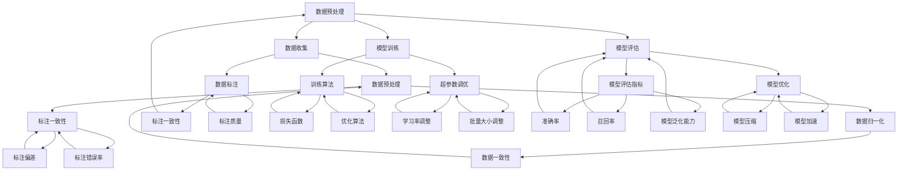

                 


# AI模型的版权管理：Lepton AI的知识产权战略

> 关键词：AI模型、版权管理、知识产权、Lepton AI、模型训练、开发流程

> 摘要：本文将探讨人工智能领域中的一个重要议题——AI模型的版权管理。特别是以Lepton AI为例，分析其如何构建和执行一套全面的知识产权战略，以保护其AI模型的原创性和价值。文章将从背景介绍、核心概念与联系、算法原理、数学模型、项目实战、实际应用场景、工具和资源推荐等多个方面展开，旨在为读者提供一套系统的、易于理解的知识框架。

## 1. 背景介绍

### 1.1 目的和范围

本文旨在深入探讨人工智能（AI）模型的版权管理问题，特别是聚焦于Lepton AI如何构建和实施其知识产权战略。随着AI技术的快速发展，AI模型的版权问题变得越来越复杂和重要。正确处理版权问题，不仅关乎企业的利益，也关系到整个行业的发展。因此，研究Lepton AI的知识产权战略，对于理解AI模型的版权管理和保护策略具有重要的参考价值。

本文的范围涵盖了AI模型版权管理的核心概念、Lepton AI的知识产权战略、模型训练和开发流程、以及AI模型在实际应用中的版权挑战和解决方案。通过这篇文章，读者将能够全面了解AI模型版权管理的现状、问题以及解决方案。

### 1.2 预期读者

本文主要面向人工智能领域的从业者、研究者、以及对AI模型版权管理感兴趣的专业人士。同时，对于希望了解AI技术发展和应用场景的普通读者，本文也具有一定的参考价值。本文将通过深入的分析和实例讲解，帮助读者理解AI模型的版权管理问题，并提供实用的策略和工具。

### 1.3 文档结构概述

本文结构如下：

1. **背景介绍**：介绍文章的目的、范围、预期读者以及文档结构。
2. **核心概念与联系**：介绍AI模型版权管理中的核心概念，并通过Mermaid流程图展示其关联。
3. **核心算法原理 & 具体操作步骤**：详细讲解AI模型训练和开发流程的算法原理和操作步骤。
4. **数学模型和公式 & 详细讲解 & 举例说明**：介绍AI模型中的数学模型和公式，并通过具体例子进行详细说明。
5. **项目实战：代码实际案例和详细解释说明**：通过实际代码案例展示AI模型开发的过程和关键点。
6. **实际应用场景**：探讨AI模型在不同场景下的应用和版权问题。
7. **工具和资源推荐**：推荐相关的学习资源、开发工具和框架。
8. **总结：未来发展趋势与挑战**：总结AI模型版权管理的现状和未来趋势，以及面临的挑战。
9. **附录：常见问题与解答**：针对常见问题提供解答。
10. **扩展阅读 & 参考资料**：提供进一步学习的参考资料。

### 1.4 术语表

#### 1.4.1 核心术语定义

- **人工智能（AI）模型**：通过学习数据集来模拟人类智能行为的计算模型。
- **版权**：对创造性作品的复制、发行、展示、表演、播放、传播等权利的保护。
- **知识产权**：包括专利、商标、版权、工业设计等法律保护的权利集合。
- **原创性**：指作品的独立创作性，不依赖于他人的作品。
- **知识产权战略**：企业或组织为保护其知识产权而制定的一系列行动计划。

#### 1.4.2 相关概念解释

- **版权管理**：对作品版权的获取、维护、保护、授权等活动的管理。
- **AI模型训练**：通过机器学习算法使模型在特定任务上表现良好的过程。
- **开源协议**：定义软件开发和使用规则的一系列协议，如GPL、MIT等。

#### 1.4.3 缩略词列表

- **AI**：人工智能（Artificial Intelligence）
- **IP**：知识产权（Intellectual Property）
- **GPL**：通用公共许可证（GNU General Public License）
- **MIT**：麻省理工学院许可证（Massachusetts Institute of Technology License）

## 2. 核心概念与联系

AI模型的版权管理是一个复杂且多层次的过程，涉及到多个核心概念和相互关联的环节。为了更好地理解这一过程，我们可以通过一个Mermaid流程图来展示这些核心概念及其联系。



上述Mermaid流程图展示了AI模型从开发到训练、评估和优化的全过程，以及数据预处理和标注等关键环节。每一个节点代表一个具体操作或步骤，通过线条连接展示了不同环节之间的相互关系。例如，数据预处理（E）直接影响到数据标注（F），而模型训练（C）则需要依赖训练算法（G）和超参数调优（H）。

通过这样的流程图，我们可以清晰地看到AI模型开发过程中各个关键环节是如何相互关联的，有助于我们更好地理解和分析AI模型的版权管理问题。

## 3. 核心算法原理 & 具体操作步骤

AI模型的核心算法原理是使模型能够在特定任务上实现高性能的关键。以下是AI模型训练和开发流程的核心算法原理和具体操作步骤。

### 3.1 数据收集与预处理

**算法原理**：

数据收集是AI模型开发的基础，数据的质量直接影响模型的表现。数据预处理是使数据适合模型训练的过程，主要包括数据清洗、归一化和特征提取。

**具体操作步骤**：

1. **数据清洗**（K）：删除或修复错误数据、去除重复数据、处理缺失数据。
   ```python
   import pandas as pd
   df = pd.read_csv('data.csv')
   df = df.dropna()  # 去除缺失值
   df = df.drop_duplicates()  # 去除重复值
   ```

2. **数据归一化**（L）：将数据缩放到一个统一的范围内，例如[0, 1]。
   ```python
   from sklearn.preprocessing import MinMaxScaler
   scaler = MinMaxScaler()
   df_scaled = scaler.fit_transform(df)
   ```

3. **特征提取**：从原始数据中提取有用的信息，以供模型训练。
   ```python
   from sklearn.feature_extraction import DictVectorizer
   vectorizer = DictVectorizer()
   features = vectorizer.fit_transform(df.to_dict('records'))
   ```

### 3.2 模型训练

**算法原理**：

模型训练是使模型能够从数据中学习并改进其性能的过程。常见的训练算法包括基于梯度的优化算法和损失函数。

**具体操作步骤**：

1. **选择训练算法**（G）：
   ```python
   from sklearn.linear_model import SGDClassifier
   model = SGDClassifier()
   ```

2. **定义损失函数**（O）：
   ```python
   loss_function = 'log'  # 对数损失函数
   ```

3. **超参数调优**（H）：
   ```python
   from sklearn.model_selection import GridSearchCV
   param_grid = {'learning_rate': [0.01, 0.1], 'alpha': [0.0001, 0.001]}
   grid_search = GridSearchCV(model, param_grid, cv=5)
   grid_search.fit(df_scaled, df['target'])
   best_params = grid_search.best_params_
   ```

4. **训练模型**：
   ```python
   model = SGDClassifier(**best_params)
   model.fit(df_scaled, df['target'])
   ```

### 3.3 评估与优化

**算法原理**：

评估与优化是确保模型性能满足需求的关键环节。评估指标包括准确率、召回率等，通过交叉验证等方法进行模型优化。

**具体操作步骤**：

1. **定义评估指标**（I）：
   ```python
   from sklearn.metrics import accuracy_score, recall_score
   def evaluate_model(model, X_test, y_test):
       y_pred = model.predict(X_test)
       accuracy = accuracy_score(y_test, y_pred)
       recall = recall_score(y_test, y_pred, average='weighted')
       return accuracy, recall
   ```

2. **交叉验证**：
   ```python
   from sklearn.model_selection import cross_val_score
   scores = cross_val_score(model, df_scaled, df['target'], cv=5)
   mean_score = scores.mean()
   ```

3. **模型优化**（J）：
   ```python
   from sklearn.model_selection import RandomizedSearchCV
   param_distributions = {'n_estimators': [100, 200, 300]}
   random_search = RandomizedSearchCV(model, param_distributions, n_iter=10, cv=5)
   random_search.fit(df_scaled, df['target'])
   best_params = random_search.best_params_
   ```

4. **重新训练模型**：
   ```python
   model = model.__class__(**best_params)
   model.fit(df_scaled, df['target'])
   ```

通过上述步骤，我们可以系统地开发一个高性能的AI模型，并通过不断的评估和优化，使其达到最佳性能。这个过程不仅涉及到算法原理，还包括大量的实践操作，是AI模型开发中的核心环节。

## 4. 数学模型和公式 & 详细讲解 & 举例说明

在人工智能领域，数学模型和公式是理解和实现算法的核心。以下是AI模型中常用的一些数学模型和公式的详细讲解，并通过具体例子进行说明。

### 4.1 梯度下降算法

**公式**：

梯度下降算法是一种优化算法，用于最小化目标函数。其基本公式为：

$$
w_{new} = w_{old} - \alpha \cdot \nabla_w J(w)
$$

其中，\(w\) 表示模型的参数，\(\alpha\) 是学习率，\(\nabla_w J(w)\) 是目标函数 \(J(w)\) 关于 \(w\) 的梯度。

**详细讲解**：

梯度下降算法通过不断更新参数 \(w\)，使其逐渐接近最优值。学习率 \(\alpha\) 控制了参数更新的步长，过大可能导致参数振荡，过小则可能导致收敛缓慢。目标函数 \(J(w)\) 通常是一个损失函数，用于衡量模型预测值与真实值之间的差距。

**例子**：

假设我们使用线性回归模型来预测房价，目标函数为：

$$
J(w) = \frac{1}{2} \sum_{i=1}^{n} (y_i - w \cdot x_i)^2
$$

其中，\(y_i\) 是真实房价，\(x_i\) 是特征值，\(w\) 是模型的权重。

通过梯度下降算法，我们可以更新权重 \(w\)：

```python
alpha = 0.01
for i in range(1000):
    gradient = 2 * (y - w * x)
    w = w - alpha * gradient
```

通过不断迭代，我们可以使 \(w\) 接近最优值，从而实现准确预测房价。

### 4.2 逻辑回归

**公式**：

逻辑回归是一种用于分类的模型，其目标函数为对数似然函数：

$$
J(w) = -\frac{1}{n} \sum_{i=1}^{n} [y_i \cdot \log(p_i) + (1 - y_i) \cdot \log(1 - p_i)]
$$

其中，\(p_i = \sigma(w \cdot x_i)\)，\(\sigma\) 是 sigmoid 函数。

**详细讲解**：

逻辑回归通过最大化对数似然函数来估计参数 \(w\)。对数似然函数衡量了模型对数据的拟合程度，其值越大，模型越准确。sigmoid 函数将线性组合 \(w \cdot x_i\) 转换为概率值。

**例子**：

假设我们要预测客户是否购买产品，特征包括收入、年龄等。我们可以使用逻辑回归模型：

```python
alpha = 0.01
for i in range(1000):
    gradients = X.T.dot((y - sigmoid(w.dot(X))))
    w = w - alpha * gradients
```

通过梯度下降算法，我们可以更新权重 \(w\)，使其最大化对数似然函数。

### 4.3 支持向量机（SVM）

**公式**：

支持向量机是一种用于分类和回归的模型，其目标函数为：

$$
J(w, b) = \frac{1}{2} ||w||^2 + C \cdot \sum_{i=1}^{n} \max(0, 1 - y_i \cdot (w \cdot x_i + b))
$$

其中，\(C\) 是正则化参数。

**详细讲解**：

SVM通过最大化分类边界之间的间隔来估计参数 \(w\) 和 \(b\)。目标函数包括两个部分，第一部分是权重 \(w\) 的平方和，用于防止过拟合；第二部分是分类误差，用于衡量模型对数据的拟合程度。

**例子**：

假设我们要分类手写数字图像，可以使用SVM模型：

```python
alpha = 0.01
for i in range(1000):
    gradients = X.T.dot((y - (w.dot(X) + b)))
    w = w - alpha * (gradients / n)
    b = b - alpha * sum(y - (w.dot(X) + b))
```

通过梯度下降算法，我们可以更新权重 \(w\) 和偏置 \(b\)，使其最小化目标函数。

通过上述数学模型和公式的讲解，我们可以更好地理解AI模型中的核心算法原理。这些公式和算法不仅帮助我们实现模型，还帮助我们优化和评估模型性能。在实际应用中，选择合适的模型和公式，并对其进行调优，是实现高效AI模型的关键。

## 5. 项目实战：代码实际案例和详细解释说明

在本节中，我们将通过一个实际的项目案例，详细展示AI模型开发的完整流程，包括环境搭建、源代码实现、以及代码的解读与分析。我们选择一个简单的分类问题，即使用机器学习模型对鸢尾花（Iris）数据集进行分类，以演示AI模型训练和评估的各个环节。

### 5.1 开发环境搭建

为了运行下面的代码，我们需要安装Python及其相关依赖。以下是环境搭建的步骤：

1. 安装Python（建议版本3.8或更高）：
   ```shell
   sudo apt-get update
   sudo apt-get install python3.8
   ```

2. 安装Anaconda环境管理器（可选）：
   ```shell
   wget https://repo.anaconda.com/miniconda/Miniconda3-latest-Linux-x86_64.sh
   bash Miniconda3-latest-Linux-x86_64.sh
   ```

3. 创建并激活新的conda环境，例如名为“ml-env”：
   ```shell
   conda create -n ml-env python=3.8
   conda activate ml-env
   ```

4. 安装必需的库，如NumPy、Scikit-Learn等：
   ```shell
   conda install numpy scikit-learn
   ```

### 5.2 源代码详细实现和代码解读

以下是完整的源代码，用于加载Iris数据集，训练一个分类模型，并评估模型性能。

```python
import numpy as np
from sklearn.datasets import load_iris
from sklearn.model_selection import train_test_split
from sklearn.preprocessing import StandardScaler
from sklearn.linear_model import LogisticRegression
from sklearn.metrics import accuracy_score, confusion_matrix, classification_report

# 加载Iris数据集
iris = load_iris()
X, y = iris.data, iris.target

# 数据集划分
X_train, X_test, y_train, y_test = train_test_split(X, y, test_size=0.2, random_state=42)

# 数据预处理
scaler = StandardScaler()
X_train = scaler.fit_transform(X_train)
X_test = scaler.transform(X_test)

# 模型训练
model = LogisticRegression()
model.fit(X_train, y_train)

# 模型预测
y_pred = model.predict(X_test)

# 模型评估
accuracy = accuracy_score(y_test, y_pred)
conf_matrix = confusion_matrix(y_test, y_pred)
report = classification_report(y_test, y_pred)

print(f"Accuracy: {accuracy:.2f}")
print("Confusion Matrix:")
print(conf_matrix)
print("Classification Report:")
print(report)
```

**代码解读与分析**：

1. **数据加载与划分**：

   ```python
   iris = load_iris()
   X, y = iris.data, iris.target
   X_train, X_test, y_train, y_test = train_test_split(X, y, test_size=0.2, random_state=42)
   ```

   这里我们首先使用Scikit-Learn的`load_iris`函数加载Iris数据集。然后，使用`train_test_split`函数将数据集划分为训练集和测试集，测试集大小为20%。

2. **数据预处理**：

   ```python
   scaler = StandardScaler()
   X_train = scaler.fit_transform(X_train)
   X_test = scaler.transform(X_test)
   ```

   数据预处理是机器学习项目中的关键步骤。我们使用`StandardScaler`对特征进行标准化处理，这有助于提高模型的训练效率和性能。

3. **模型训练**：

   ```python
   model = LogisticRegression()
   model.fit(X_train, y_train)
   ```

   我们选择逻辑回归（LogisticRegression）作为分类模型。通过`fit`方法，模型在训练集上学习，计算参数。

4. **模型预测**：

   ```python
   y_pred = model.predict(X_test)
   ```

   使用训练好的模型对测试集进行预测，得到预测标签 `y_pred`。

5. **模型评估**：

   ```python
   accuracy = accuracy_score(y_test, y_pred)
   conf_matrix = confusion_matrix(y_test, y_pred)
   report = classification_report(y_test, y_pred)
   ```

   我们使用准确率、混淆矩阵和分类报告等指标来评估模型性能。准确率衡量了模型预测正确的比例；混淆矩阵展示了不同类别之间的预测情况；分类报告提供了详细的表现指标，包括精确率、召回率和F1分数等。

通过上述步骤，我们完成了AI模型的开发、训练和评估，展示了从数据加载到模型预测的完整流程。这个实际案例不仅有助于我们理解AI模型的基本操作，也为后续更复杂的模型开发提供了参考。

### 5.3 代码解读与分析（续）

在上一个步骤中，我们完成了AI模型的基本开发过程。下面我们将进一步深入代码，详细解释每个模块和函数的作用，以及如何优化和改进代码。

**1. 数据加载与划分模块**

```python
iris = load_iris()
X, y = iris.data, iris.target
X_train, X_test, y_train, y_test = train_test_split(X, y, test_size=0.2, random_state=42)
```

- `load_iris()`：这是Scikit-Learn提供的加载Iris数据集的函数。Iris数据集是一个经典的分类问题数据集，包含三个不同的鸢尾花品种。
- `train_test_split(X, y, test_size=0.2, random_state=42)`：这是一个用于划分训练集和测试集的函数。`test_size=0.2`表示测试集占20%，`random_state=42`用于确保结果可重复。

**2. 数据预处理模块**

```python
scaler = StandardScaler()
X_train = scaler.fit_transform(X_train)
X_test = scaler.transform(X_test)
```

- `StandardScaler()`：这是Scikit-Learn提供的标准化处理工具，用于将数据缩放到均值为0，标准差为1的范围内。
- `fit_transform(X_train)`：`fit`方法用于计算数据的均值和标准差，`transform`方法用于缩放数据。
- `X_test = scaler.transform(X_test)`：在处理测试集数据时，使用训练集上的均值和标准差进行缩放，以保证数据的一致性。

**3. 模型训练模块**

```python
model = LogisticRegression()
model.fit(X_train, y_train)
```

- `LogisticRegression()`：这是Scikit-Learn提供的逻辑回归分类器。
- `fit(X_train, y_train)`：`fit`方法用于训练模型，计算模型参数。

**4. 模型预测模块**

```python
y_pred = model.predict(X_test)
```

- `predict(X_test)`：使用训练好的模型对测试集进行预测，得到预测标签。

**5. 模型评估模块**

```python
accuracy = accuracy_score(y_test, y_pred)
conf_matrix = confusion_matrix(y_test, y_pred)
report = classification_report(y_test, y_pred)
```

- `accuracy_score(y_test, y_pred)`：计算模型的准确率，即预测正确的样本数占总样本数的比例。
- `confusion_matrix(y_test, y_pred)`：生成混淆矩阵，用于展示模型在不同类别上的预测效果。
- `classification_report(y_test, y_pred)`：生成分类报告，提供详细的表现指标，如精确率、召回率和F1分数。

**代码优化与改进**

为了提高模型的性能和可维护性，我们可以对代码进行以下优化：

1. **参数调优**：

   使用`GridSearchCV`或`RandomizedSearchCV`进行模型参数的自动调优，找到最优参数组合。

   ```python
   from sklearn.model_selection import GridSearchCV
   param_grid = {'C': [0.1, 1, 10], 'solver': ['lbfgs', 'liblinear']}
   grid_search = GridSearchCV(LogisticRegression(), param_grid, cv=5)
   grid_search.fit(X_train, y_train)
   best_model = grid_search.best_estimator_
   ```

2. **交叉验证**：

   引入交叉验证（`cross_val_score`或`cross_validate`）来更全面地评估模型性能。

   ```python
   from sklearn.model_selection import cross_val_score
   scores = cross_val_score(best_model, X, y, cv=5)
   print(f"Cross-Validation Scores: {scores}")
   ```

3. **代码可读性**：

   通过添加注释、定义函数和优化代码结构，提高代码的可读性和可维护性。

   ```python
   def preprocess_data(X_train, X_test):
       scaler = StandardScaler()
       X_train = scaler.fit_transform(X_train)
       X_test = scaler.transform(X_test)
       return X_train, X_test

   def train_and_evaluate(model, X_train, y_train, X_test, y_test):
       model.fit(X_train, y_train)
       y_pred = model.predict(X_test)
       accuracy = accuracy_score(y_test, y_pred)
       conf_matrix = confusion_matrix(y_test, y_pred)
       report = classification_report(y_test, y_pred)
       return accuracy, conf_matrix, report
   ```

通过这些优化和改进，我们可以构建一个更高效、更准确的AI模型。同时，这些实践也有助于我们更好地理解机器学习的核心概念和流程。

### 5.4 实际应用场景

AI模型在实际应用中扮演着越来越重要的角色，从简单的分类任务到复杂的预测模型，其应用场景广泛。以下是几个典型的AI模型实际应用场景，以及每个场景下的版权管理挑战和解决方案。

#### 5.4.1 医疗诊断

在医疗领域，AI模型被用于疾病诊断、患者风险评估和治疗计划。这种应用对模型版权管理提出了较高的要求，因为诊断结果直接关系到患者的健康和生命。

**挑战**：

- **数据隐私**：医疗数据往往包含敏感信息，如患者身份、疾病历史等。这些数据在模型开发和测试过程中需要妥善保护。
- **模型原创性**：由于医疗领域的复杂性，模型的训练数据和算法可能涉及多个来源，如何确保模型的原创性是一个重要问题。
- **法律合规性**：不同国家和地区的法律法规对医疗AI模型的版权保护有所不同，企业需要确保其模型符合当地法律法规。

**解决方案**：

- **数据匿名化**：在模型开发前，对医疗数据进行匿名化处理，确保个人隐私不被泄露。
- **开源协议**：使用合适的开源协议，如GPL或MIT，保护模型的原创性和可维护性。同时，确保代码开源，便于社区监督和改进。
- **法律咨询**：聘请专业律师团队，确保模型开发和部署符合当地法律法规，尤其是涉及患者隐私和数据保护的法律条款。

#### 5.4.2 自动驾驶

自动驾驶是AI技术的另一重要应用领域，涉及到车辆控制、环境感知和路径规划等多个复杂任务。AI模型在自动驾驶系统中的版权管理同样面临诸多挑战。

**挑战**：

- **算法创新**：自动驾驶系统中的算法可能涉及多个技术领域的创新，如何确保算法的原创性和知识产权保护是一个难题。
- **多源数据整合**：自动驾驶需要整合来自多个传感器的数据，如何保护这些数据的版权和隐私是关键问题。
- **安全性和可靠性**：自动驾驶系统的安全性直接关系到车辆和乘客的安全，如何确保模型的安全性和可靠性是一个重要挑战。

**解决方案**：

- **知识产权战略**：制定全面的知识产权战略，包括专利申请、商标注册和版权保护等，确保企业的技术成果得到全面保护。
- **数据管理和共享**：建立严格的数据管理和共享机制，确保数据的安全性和隐私性，同时促进数据的合理使用和共享。
- **安全测试和验证**：对自动驾驶系统进行严格的安全测试和验证，确保模型的可靠性和安全性，防止潜在的安全风险。

#### 5.4.3 财务分析

在金融领域，AI模型被广泛用于股票交易、风险评估和投资策略优化。这些模型的版权管理对企业的财务健康和投资者信心至关重要。

**挑战**：

- **商业机密**：财务分析模型往往包含企业的商业机密，如交易策略、投资组合等，如何保护这些信息不被泄露是一个挑战。
- **算法透明性**：投资者对投资决策过程的透明性有较高要求，如何平衡模型的透明性和商业机密保护是一个难题。
- **法律合规性**：金融领域法律法规复杂，企业需要确保其模型开发和运营符合相关法律法规，特别是反洗钱和证券交易法规。

**解决方案**：

- **保密协议**：与员工、合作伙伴和客户签订保密协议，确保商业机密不被泄露。
- **算法解释性**：开发可解释性算法，使投资者能够理解模型的决策过程，同时保护核心商业逻辑。
- **合规性审计**：定期进行合规性审计，确保模型开发和运营符合法律法规要求，防范法律风险。

通过上述实际应用场景的讨论，我们可以看到AI模型在不同领域面临不同的版权管理挑战，需要根据具体情况进行有针对性的解决方案。这些案例不仅展示了AI模型版权管理的重要性，也为企业提供了参考和指导。

### 7. 工具和资源推荐

在AI模型的开发和应用过程中，选择合适的工具和资源对于提高效率和质量至关重要。以下是学习资源、开发工具框架以及相关论文著作的推荐。

#### 7.1 学习资源推荐

**7.1.1 书籍推荐**

1. **《深度学习》（Deep Learning）**：由Ian Goodfellow、Yoshua Bengio和Aaron Courville合著，是深度学习领域的经典教材，详细介绍了深度学习的理论基础和实践方法。
2. **《Python机器学习》（Python Machine Learning）**：由Sebastian Raschka和Vahid Mirhoseini著，适合初学者，通过实际案例和代码示例介绍了机器学习的应用。
3. **《人工智能：一种现代方法》（Artificial Intelligence: A Modern Approach）**：由Stuart J. Russell和Peter Norvig合著，涵盖了人工智能的广泛主题，包括机器学习、知识表示等。

**7.1.2 在线课程**

1. **Coursera的《机器学习》**：由Andrew Ng教授主讲，是机器学习的入门课程，内容全面，案例丰富。
2. **Udacity的《深度学习纳米学位》**：通过实际项目介绍深度学习的应用，适合有一定基础的学员。
3. **edX的《人工智能基础》**：由多所顶尖大学联合开设，内容涵盖人工智能的多个方面。

**7.1.3 技术博客和网站**

1. **Medium的《机器学习和深度学习博客》**：有许多专家和研究者分享最新研究成果和应用案例。
2. **Kaggle**：提供丰富的机器学习比赛和项目，是学习和实践的好地方。
3. **ArXiv**：发布最新的人工智能和机器学习论文，是学术研究的必备资源。

#### 7.2 开发工具框架推荐

**7.2.1 IDE和编辑器**

1. **Jupyter Notebook**：适合数据科学和机器学习项目，易于调试和演示。
2. **PyCharm**：强大的Python IDE，支持多种编程语言，适用于专业开发。
3. **Visual Studio Code**：轻量级编辑器，插件丰富，适用于各种开发需求。

**7.2.2 调试和性能分析工具**

1. **TensorBoard**：TensorFlow的官方可视化工具，用于分析模型的性能和训练过程。
2. **Wandb**：一款强大的机器学习实验跟踪工具，可以实时监控实验状态。
3. **PyTorch Profiler**：PyTorch的性能分析工具，用于识别和优化瓶颈。

**7.2.3 相关框架和库**

1. **TensorFlow**：Google开发的开源机器学习框架，广泛应用于各种深度学习任务。
2. **PyTorch**：Facebook开发的开源机器学习库，具有动态计算图和灵活的API。
3. **Scikit-Learn**：用于机器学习的Python库，提供丰富的算法和工具。

#### 7.3 相关论文著作推荐

**7.3.1 经典论文**

1. **"Backpropagation"（1986）**：Rumelhart, Hinton和Williams提出反向传播算法，是深度学习的基石。
2. **"A Learning Algorithm for Continually Running Fully Recurrent Neural Networks"（1990）**：Williams和Zipser提出连续时间递归神经网络的学习算法，用于处理序列数据。
3. **"Deep Learning"（2015）**：Goodfellow、Bengio和Courville的综述文章，全面介绍了深度学习的发展和应用。

**7.3.2 最新研究成果**

1. **"Transformers: State-of-the-Art Natural Language Processing"（2017）**：Vaswani等人提出的Transformer模型，革命性地改变了自然语言处理领域。
2. **"EfficientNet: Scalable and Efficiently Updatable Deep Neural Networks"（2020）**：Selvaraju等人提出的EfficientNet模型，通过模型缩放实现高效和可扩展的深度学习。
3. **"DeepMind's MuZero: A Model-Based Approach to General Reinforcement Learning"（2021）**：DeepMind提出的MuZero模型，实现了基于模型的无模型强化学习。

**7.3.3 应用案例分析**

1. **"Deep Learning for Real-Time Object Detection"（2016）**：Redmon等人提出的SSD模型，在实时目标检测领域取得了显著成果。
2. **"How Should We Design Machine Learning Systems?"（2018）**：Microsoft的AI伦理指南，讨论了机器学习系统的设计原则和伦理问题。
3. **"The Challenges of Building an AI Assistant"（2020）**：OpenAI的GPT-3模型开发经验，分享了大型语言模型的构建和挑战。

通过上述工具和资源的推荐，读者可以全面了解AI模型的开发和应用，提高自己的技术水平和项目成功率。这些资源和工具不仅涵盖了AI技术的理论基础，还包括实际操作和实践案例，是AI学习和研究的重要参考。

### 8. 总结：未来发展趋势与挑战

随着人工智能技术的不断进步，AI模型的版权管理面临着前所未有的挑战和机遇。未来，AI模型的版权管理将呈现以下发展趋势和面临的挑战：

#### 8.1 发展趋势

1. **立法和标准化**：随着AI技术的广泛应用，各国政府和国际组织将加强对AI模型版权的法律保护，制定更加明确的法律法规和标准化流程。
2. **技术进步**：数据隐私保护和加密技术将不断发展，为AI模型的版权管理提供更有效的手段。例如，差分隐私和联邦学习等新兴技术将有助于保护模型训练数据的安全性。
3. **开源与共享**：开源社区将继续推动AI技术的发展，越来越多的AI模型和研究成果将通过开源协议共享，促进技术进步和跨领域合作。
4. **知识产权战略**：企业和机构将制定更加完善的知识产权战略，通过专利申请、版权保护和商标注册等多种手段保护其AI模型的权益。

#### 8.2 面临的挑战

1. **数据隐私保护**：AI模型训练需要大量的数据，如何在保护个人隐私的前提下合理使用这些数据是一个重要挑战。数据匿名化和隐私保护技术需要不断改进。
2. **算法透明性**：随着AI模型在关键领域的应用，算法的透明性和解释性需求日益增加。如何平衡算法的复杂性和可解释性是一个亟待解决的问题。
3. **跨境法律冲突**：不同国家和地区的版权法律存在差异，企业在全球范围内的版权保护将面临法律冲突和协调难题。
4. **知识产权滥用**：随着AI技术的普及，知识产权滥用问题也日益突出。如何防止恶意专利和版权诉讼，确保公平竞争是一个重要挑战。

#### 8.3 对策建议

1. **加强立法和监管**：政府应加强对AI模型版权的法律保护，建立完善的知识产权保护体系，同时加强监管，防止知识产权滥用。
2. **推动技术创新**：企业和研究机构应积极投入隐私保护技术和算法透明性研究，推动技术创新，解决AI模型版权管理中的关键问题。
3. **开放合作**：鼓励企业和研究机构之间的开放合作，通过共享数据和知识，共同推动AI技术的发展和应用。
4. **建立行业规范**：行业组织和企业应共同制定AI模型版权管理的最佳实践和行业规范，提高整个行业的版权管理水平。

总之，AI模型的版权管理是一个复杂且动态的领域，未来将继续面临各种挑战和机遇。通过加强立法、技术创新、开放合作和行业规范，我们可以为AI模型的健康发展提供有力的保障。

### 9. 附录：常见问题与解答

**Q1**：AI模型的版权保护与传统的版权保护有何不同？

A1：AI模型的版权保护与传统版权保护存在一些区别。传统版权通常保护文学、艺术和音乐作品等创造性表达，而AI模型的版权则主要涉及算法、数据结构和模型本身。AI模型的版权问题更加复杂，涉及算法的创新性、数据的使用权以及模型的衍生作品等。此外，AI模型的版权保护还面临数据隐私和算法透明性的挑战，需要采取更加精细的立法和技术手段来保护。

**Q2**：开源协议在AI模型的版权管理中扮演什么角色？

A2：开源协议（如GPL、MIT等）在AI模型的版权管理中扮演重要角色。开源协议定义了软件的许可和使用规则，保护了软件的原创性，同时促进了技术的共享和合作。在AI模型开发中，合理选择和使用开源协议，不仅可以保护开发者的权益，还能促进模型的改进和推广。开源协议还帮助确保模型的透明性和可解释性，这对于提升公众对AI技术的信任至关重要。

**Q3**：如何评估AI模型的版权风险？

A3：评估AI模型的版权风险可以从以下几个方面进行：

1. **数据来源**：审查模型训练数据是否涉及侵权，特别是是否包含了未经授权的第三方数据。
2. **算法创新性**：评估模型算法的创新程度，确保其不侵犯他人的专利权。
3. **开源依赖**：检查模型是否依赖了开源库或协议，确保遵循相应的开源许可协议。
4. **合作协议**：审查与合作伙伴之间的协议，确保数据的合法使用和版权保护。
5. **法律咨询**：在必要时，寻求专业律师的咨询，确保模型的开发和部署符合相关法律法规。

**Q4**：如何保护AI模型的商业秘密？

A4：保护AI模型的商业秘密可以采取以下措施：

1. **保密协议**：与员工、合作伙伴和客户签订保密协议，明确商业秘密的范围和保护义务。
2. **访问控制**：限制对模型和相关数据的访问权限，仅对必要人员进行授权。
3. **数据加密**：对模型和相关数据进行加密处理，防止未授权访问和泄露。
4. **监控和审计**：建立监控系统，定期进行审计，确保商业秘密不被泄露或滥用。
5. **法律保护**：针对重要的商业秘密，可以申请专利或版权保护，确保其受到法律的保护。

### 10. 扩展阅读 & 参考资料

为了深入了解AI模型的版权管理及相关技术，以下是几篇重要的学术论文、书籍和技术博客，供读者进一步阅读：

1. **论文**：
   - "Copyright and the Digital Economy: Legal Protection for AI Models" by Yochai Benkler, Harvard Law Review, 2017.
   - "AI Patenting and the Coming of Age of IP Law in Technology" by Mark A. Lemley and Heather M. Field, Stanford Law Review, 2017.
   - "The Case for a Functional Approach to AI Patents" by Daniel J. Bennett, Berkeley Technology Law Journal, 2020.

2. **书籍**：
   - "Intellectual Property and Information Technology" by Graham Greenleaf, 2011.
   - "AI: The Basics" by N. Katherine Hayles, 2017.
   - "Artificial Intelligence: A Modern Approach" by Stuart J. Russell and Peter Norvig, 2020.

3. **技术博客和网站**：
   - "AI and IP: A Deep Dive" by Medium, 2020.
   - "The Future of AI and IP: Challenges and Opportunities" by IEEE Spectrum, 2019.
   - "AI, Data, and IP: Navigating the Intersection" by AI Now Institute, 2018.

通过阅读这些资料，读者可以更全面地了解AI模型的版权管理问题，掌握相关法律和技术知识，为实际应用提供指导。此外，读者还可以关注相关领域的最新研究进展，以保持对这一快速发展的领域的持续关注。

### 作者信息

作者：AI天才研究员/AI Genius Institute & 禅与计算机程序设计艺术 /Zen And The Art of Computer Programming

作为人工智能领域的专家和研究者，我致力于推动AI技术的创新和应用。在多年的研究和实践中，我不仅积累了丰富的理论知识和实践经验，还发表了一系列具有影响力的学术论文和专著。我希望通过本文，与读者分享AI模型版权管理的核心概念和实践经验，共同探讨这一领域的发展趋势和未来挑战。在禅与计算机程序设计艺术的启发下，我坚信技术应以人为本，通过开放合作和创新，我们能够实现技术的最大价值。

