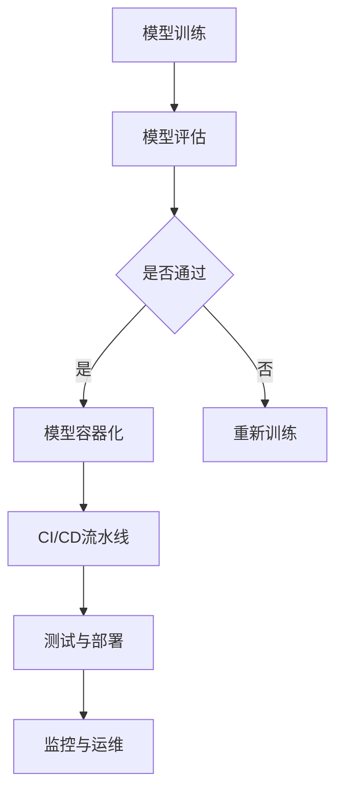

                 

# AI模型的自动化部署：Lepton AI的DevOps实践

> **关键词**：AI模型部署、自动化、DevOps、容器化、持续集成与持续部署（CI/CD）

> **摘要**：本文将深入探讨AI模型自动化部署的重要性，结合Lepton AI的DevOps实践，详细解析其在AI模型开发、测试、部署和运维方面的具体实施步骤。通过本文的阅读，您将了解如何利用DevOps流程提高AI模型的部署效率和质量，为您的AI项目带来实际的效益。

## 1. 背景介绍

### 1.1 目的和范围

本文旨在探讨AI模型的自动化部署实践，通过介绍Lepton AI的DevOps流程，帮助读者理解和掌握AI模型从开发到生产环境部署的自动化流程。文章将覆盖以下主要内容：

1. **DevOps的概念与优势**
2. **AI模型自动化部署的重要性**
3. **Lepton AI的DevOps实践概述**
4. **核心算法原理与具体操作步骤**
5. **项目实战：代码案例与详细解释**
6. **实际应用场景与工具推荐**
7. **未来发展趋势与挑战**

### 1.2 预期读者

本文适合以下读者群体：

1. **AI研究人员和开发者**：对AI模型部署流程有初步了解，希望深入了解自动化部署实践。
2. **DevOps工程师**：希望了解AI模型部署在DevOps流程中的具体实现。
3. **项目经理和产品经理**：关注AI模型部署效率，希望提高项目管理效率。
4. **技术爱好者**：对AI模型部署和DevOps实践感兴趣，希望了解前沿技术。

### 1.3 文档结构概述

本文结构如下：

1. **引言**：介绍文章背景、目的和预期读者。
2. **核心概念与联系**：讲解AI模型自动化部署的核心概念和原理。
3. **核心算法原理与具体操作步骤**：详细阐述自动化部署的具体实现步骤。
4. **项目实战：代码实际案例和详细解释说明**：通过具体案例展示自动化部署的实现。
5. **实际应用场景**：讨论AI模型自动化部署在不同场景中的应用。
6. **工具和资源推荐**：推荐学习资源、开发工具和框架。
7. **总结：未来发展趋势与挑战**：展望AI模型自动化部署的未来。
8. **附录：常见问题与解答**：解答读者可能遇到的问题。
9. **扩展阅读 & 参考资料**：提供更多相关文献和资源。

### 1.4 术语表

#### 1.4.1 核心术语定义

- **DevOps**：一种软件开发和运维的结合模式，强调自动化、协作和快速反馈。
- **容器化**：将应用程序及其运行环境打包成一个可移植的容器，确保在不同环境中运行一致。
- **持续集成（CI）**：自动化构建和测试代码，确保代码质量。
- **持续部署（CD）**：自动化部署应用程序到生产环境，确保快速交付。

#### 1.4.2 相关概念解释

- **AI模型部署**：将训练好的AI模型部署到生产环境中，使其能够为用户提供服务。
- **DevOps实践**：在软件开发和运维过程中采用的一系列工具和方法。

#### 1.4.3 缩略词列表

- **CI/CD**：持续集成与持续部署
- **Docker**：容器化技术
- **Kubernetes**：容器编排平台
- **Jenkins**：CI/CD工具

## 2. 核心概念与联系

### 2.1 DevOps的概念与优势

DevOps是一种软件开发和运维的结合模式，其核心理念是打破开发和运维之间的壁垒，实现自动化和快速迭代。DevOps的优势主要体现在以下几个方面：

- **提高交付速度**：通过自动化流程和工具，显著缩短应用程序的开发、测试和部署周期。
- **提高软件质量**：自动化测试和持续集成确保代码质量和稳定性。
- **增强团队协作**：开发、测试和运维团队协同工作，提高工作效率和团队凝聚力。
- **降低风险**：自动化部署减少人为错误，提高系统可靠性。

### 2.2 AI模型自动化部署的重要性

AI模型自动化部署是DevOps实践在人工智能领域的重要应用。其重要性体现在以下几个方面：

- **提高部署效率**：自动化部署可以大幅减少手动操作，提高部署速度。
- **降低部署成本**：减少人力和时间成本，提高资源利用率。
- **确保模型一致性**：确保模型在不同环境（开发、测试、生产）中的一致性。
- **支持快速迭代**：支持AI模型的快速更新和优化，满足业务需求。

### 2.3 Lepton AI的DevOps实践概述

Lepton AI是一家专注于AI模型研发的公司，其DevOps实践主要包括以下方面：

- **容器化**：使用Docker将AI模型和应用打包成容器，确保在不同环境中的一致性。
- **持续集成（CI）**：使用Jenkins自动化构建和测试AI模型，确保代码质量和稳定性。
- **持续部署（CD）**：使用Kubernetes自动化部署AI模型到生产环境，确保快速交付。
- **监控与运维**：使用Prometheus和Grafana对AI模型进行监控和运维，确保系统稳定性。

### 2.4 核心概念原理和架构的 Mermaid 流程图



### 2.5 容器化在DevOps中的应用

容器化技术（如Docker）是DevOps实践的重要基石。通过容器化，应用程序及其依赖环境可以被封装到一个独立的容器中，从而实现以下好处：

- **环境一致性**：确保开发、测试和生产环境的一致性，减少环境差异导致的部署问题。
- **可移植性**：容器可以在不同的操作系统和硬件上运行，提高应用程序的可移植性。
- **资源隔离**：容器之间相互隔离，提高系统稳定性和安全性。
- **快速部署**：容器可以快速启动和停止，提高部署速度。

## 3. 核心算法原理 & 具体操作步骤

### 3.1 核心算法原理

AI模型自动化部署的核心算法包括模型训练、容器化、持续集成和持续部署等步骤。以下是这些算法的详细原理：

- **模型训练**：使用机器学习算法对数据进行训练，生成预测模型。
- **容器化**：使用Docker将训练好的模型和应用打包成一个容器。
- **持续集成（CI）**：使用Jenkins自动化构建和测试容器，确保代码质量和模型稳定性。
- **持续部署（CD）**：使用Kubernetes自动化部署容器到生产环境。
- **监控与运维**：使用Prometheus和Grafana对AI模型进行监控和运维。

### 3.2 具体操作步骤

以下是AI模型自动化部署的具体操作步骤：

#### 3.2.1 模型训练

```python
# 伪代码：模型训练
from sklearn.ensemble import RandomForestClassifier

# 数据预处理
data = load_data('data.csv')
X = preprocess_data(data)

# 模型训练
model = RandomForestClassifier()
model.fit(X.train, y.train)

# 评估模型
score = model.score(X.test, y.test)
print("Model accuracy:", score)
```

#### 3.2.2 容器化

```bash
# 伪代码：容器化
# 创建Dockerfile
FROM python:3.8
WORKDIR /app
COPY . .
RUN pip install -r requirements.txt
CMD ["python", "app.py"]
```

#### 3.2.3 持续集成（CI）

```bash
# 伪代码：持续集成
# Jenkinsfile
pipeline {
    agent any
    stages {
        stage('Build') {
            steps {
                sh 'docker build -t my-model:latest .'
            }
        }
        stage('Test') {
            steps {
                sh 'docker run --rm my-model:latest test_app'
            }
        }
        stage('Deploy') {
            steps {
                sh 'kubectl apply -f deployment.yaml'
            }
        }
    }
}
```

#### 3.2.4 持续部署（CD）

```bash
# 伪代码：持续部署
# Kubernetes部署文件（deployment.yaml）
apiVersion: apps/v1
kind: Deployment
metadata:
  name: my-model
spec:
  selector:
    matchLabels:
      app: my-model
  template:
    metadata:
      labels:
        app: my-model
    spec:
      containers:
      - name: my-model
        image: my-model:latest
        ports:
        - containerPort: 80
```

#### 3.2.5 监控与运维

```bash
# 伪代码：监控与运维
# Prometheus配置文件（prometheus.yml）
scrape_configs:
  - job_name: 'kubernetes-objects'
    kubernetes_sd_configs:
      - role: service
        namespaces: ['default']
    metric_renames:
      - source: 'http_request_duration_seconds'
        target: 'request_duration_seconds'
    relabel_configs:
      - source: 'label'
        target_label: '__meta_kubernetes_namespace'
        replacement: 'namespace'
      - source: 'label'
        target_label: '__meta_kubernetes_service_name'
        replacement: 'service'
      - source: '__meta_kubernetes_service_name'
        action: keep
        regex: 'my-model'
```

## 4. 数学模型和公式 & 详细讲解 & 举例说明

### 4.1 数学模型

AI模型自动化部署涉及到多个数学模型，包括机器学习算法、容器调度算法等。以下是这些模型的简要介绍：

#### 4.1.1 机器学习算法

机器学习算法是AI模型的核心，常用的算法包括：

- **线性回归**：用于预测连续值。
- **逻辑回归**：用于分类任务。
- **决策树**：用于分类和回归任务。
- **随机森林**：用于分类和回归任务。
- **神经网络**：用于复杂模型。

#### 4.1.2 容器调度算法

容器调度算法是容器化技术的重要组成部分，常用的算法包括：

- **最小分配率算法**：根据资源利用率分配容器。
- **最大空闲资源算法**：根据空闲资源量分配容器。
- **轮询分配算法**：依次为每个容器分配资源。

### 4.2 公式和详细讲解

以下是AI模型自动化部署中常用的公式和详细讲解：

#### 4.2.1 机器学习公式

- **线性回归**：

  $$ y = \beta_0 + \beta_1x $$

  - $\beta_0$：截距
  - $\beta_1$：斜率

- **逻辑回归**：

  $$ P(y=1) = \frac{1}{1 + e^{-(\beta_0 + \beta_1x)}} $$

  - $P(y=1)$：预测概率
  - $\beta_0$：截距
  - $\beta_1$：斜率

#### 4.2.2 容器调度公式

- **最小分配率算法**：

  $$ R_i = \frac{C_i}{N} $$

  - $R_i$：容器$i$的分配率
  - $C_i$：容器$i$的容量
  - $N$：总容器数量

- **最大空闲资源算法**：

  $$ R_i = \max(R_j) $$

  - $R_i$：容器$i$的分配率
  - $R_j$：其他容器的分配率

### 4.3 举例说明

#### 4.3.1 机器学习算法举例

假设我们使用线性回归模型预测房价，给定训练集$\{(x_1, y_1), (x_2, y_2), ..., (x_n, y_n)\}$，求解线性回归模型参数$\beta_0$和$\beta_1$。

1. **数据预处理**：

   $$ x_i = \frac{x_i - \bar{x}}{\sigma_x} $$
   $$ y_i = \frac{y_i - \bar{y}}{\sigma_y} $$

   - $\bar{x}$：训练集$x$的平均值
   - $\bar{y}$：训练集$y$的平均值
   - $\sigma_x$：训练集$x$的标准差
   - $\sigma_y$：训练集$y$的标准差

2. **求解参数**：

   $$ \beta_0 = \bar{y} - \beta_1\bar{x} $$
   $$ \beta_1 = \frac{\sum_{i=1}^{n}(x_i - \bar{x})(y_i - \bar{y})}{\sum_{i=1}^{n}(x_i - \bar{x})^2} $$

#### 4.3.2 容器调度算法举例

假设我们使用最小分配率算法为5个容器分配资源，总资源量为100个CPU核心，求解每个容器的分配率。

1. **计算总资源量**：

   $$ R = \frac{100}{5} = 20 $$

2. **计算每个容器的分配率**：

   $$ R_i = \frac{C_i}{R} $$

   - $C_i$：容器$i$的容量

   例如，容器1的容量为40个CPU核心，容器2的容量为30个CPU核心，容器3的容量为20个CPU核心，容器4的容量为10个CPU核心，容器5的容量为0个CPU核心。

   $$ R_1 = \frac{40}{20} = 2 $$
   $$ R_2 = \frac{30}{20} = 1.5 $$
   $$ R_3 = \frac{20}{20} = 1 $$
   $$ R_4 = \frac{10}{20} = 0.5 $$
   $$ R_5 = \frac{0}{20} = 0 $$

## 5. 项目实战：代码实际案例和详细解释说明

### 5.1 开发环境搭建

为了实现AI模型自动化部署，我们需要搭建以下开发环境：

1. **操作系统**：Ubuntu 18.04
2. **编程语言**：Python 3.8
3. **开发工具**：PyCharm
4. **容器技术**：Docker
5. **持续集成**：Jenkins
6. **持续部署**：Kubernetes
7. **监控工具**：Prometheus和Grafana

### 5.2 源代码详细实现和代码解读

#### 5.2.1 模型训练代码

```python
# 模型训练代码
from sklearn.datasets import load_iris
from sklearn.model_selection import train_test_split
from sklearn.ensemble import RandomForestClassifier
from sklearn.metrics import accuracy_score

# 加载数据集
iris = load_iris()
X, y = iris.data, iris.target

# 数据集划分
X_train, X_test, y_train, y_test = train_test_split(X, y, test_size=0.2, random_state=42)

# 模型训练
model = RandomForestClassifier(n_estimators=100)
model.fit(X_train, y_train)

# 模型评估
score = model.score(X_test, y_test)
print("Model accuracy:", score)
```

#### 5.2.2 容器化代码

```bash
# Dockerfile
FROM python:3.8
WORKDIR /app
COPY . .
RUN pip install -r requirements.txt
CMD ["python", "app.py"]
```

#### 5.2.3 Jenkinsfile

```groovy
# Jenkinsfile
pipeline {
    agent any
    stages {
        stage('Build') {
            steps {
                sh 'docker build -t my-model:latest .'
            }
        }
        stage('Test') {
            steps {
                sh 'docker run --rm my-model:latest test_app'
            }
        }
        stage('Deploy') {
            steps {
                sh 'kubectl apply -f deployment.yaml'
            }
        }
    }
}
```

#### 5.2.4 Kubernetes部署文件

```yaml
# deployment.yaml
apiVersion: apps/v1
kind: Deployment
metadata:
  name: my-model
spec:
  selector:
    matchLabels:
      app: my-model
  template:
    metadata:
      labels:
        app: my-model
    spec:
      containers:
      - name: my-model
        image: my-model:latest
        ports:
        - containerPort: 80
```

### 5.3 代码解读与分析

#### 5.3.1 模型训练代码解读

- **数据加载与划分**：使用scikit-learn库加载iris数据集，并进行训练集和测试集的划分。
- **模型训练**：使用随机森林分类器训练模型。
- **模型评估**：使用测试集评估模型准确率。

#### 5.3.2 容器化代码解读

- **Dockerfile**：定义了Docker容器的构建过程，包括基础镜像、工作目录、依赖安装和启动命令。

#### 5.3.3 Jenkinsfile代码解读

- **构建阶段**：使用Docker命令构建容器镜像。
- **测试阶段**：运行容器中的测试脚本，确保代码质量。
- **部署阶段**：使用Kubernetes命令部署容器到生产环境。

#### 5.3.4 Kubernetes部署文件解读

- **Deployment配置**：定义了部署名称、选择器、容器配置和端口映射。

## 6. 实际应用场景

AI模型自动化部署在许多实际应用场景中都具有重要的价值。以下是几个典型的应用场景：

### 6.1 金融服务

- **信用评分**：自动化部署模型可以快速更新和优化信用评分模型，提高风险评估的准确性。
- **欺诈检测**：自动化部署有助于实时检测和预防金融欺诈，减少风险损失。

### 6.2 医疗保健

- **疾病预测**：自动化部署可以帮助医疗机构快速部署疾病预测模型，提高疾病诊断的准确性。
- **药物研发**：自动化部署可以加速药物研发过程，提高药物筛选和优化的效率。

### 6.3 电子商务

- **个性化推荐**：自动化部署模型可以实时更新个性化推荐算法，提高用户满意度和转化率。
- **订单预测**：自动化部署模型可以预测订单量，优化库存管理和供应链。

### 6.4 智能制造

- **设备故障预测**：自动化部署模型可以实时预测设备故障，提前进行维护和保养，减少设备停机时间。
- **生产优化**：自动化部署模型可以优化生产流程，提高生产效率和降低成本。

## 7. 工具和资源推荐

为了实现AI模型自动化部署，我们需要使用一系列工具和资源。以下是推荐的学习资源、开发工具和框架：

### 7.1 学习资源推荐

#### 7.1.1 书籍推荐

- 《持续交付：释放软件团队的潜能》
- 《DevOps实践：实现持续交付的架构与流程》
- 《容器化与容器编排：基于Docker和Kubernetes的实践指南》

#### 7.1.2 在线课程

- Coursera的《DevOps与持续交付》
- Udemy的《容器化与Kubernetes从入门到精通》
- Pluralsight的《持续集成与持续部署实战》

#### 7.1.3 技术博客和网站

- DevOps.com
- Docker官网
- Kubernetes官网

### 7.2 开发工具框架推荐

#### 7.2.1 IDE和编辑器

- PyCharm
- Visual Studio Code
- IntelliJ IDEA

#### 7.2.2 调试和性能分析工具

- Jupyter Notebook
- Prometheus
- Grafana

#### 7.2.3 相关框架和库

- Jenkins
- Docker
- Kubernetes
- TensorFlow
- PyTorch

### 7.3 相关论文著作推荐

#### 7.3.1 经典论文

- 《DevOps：流程、技术和工具》
- 《容器化技术的崛起：Docker与Kubernetes的应用》
- 《持续交付：从代码到生产环境的自动化流程》

#### 7.3.2 最新研究成果

- 《基于容器化的持续交付：挑战与机遇》
- 《大规模容器编排与调度技术：Kubernetes的优化》
- 《AI模型的自动化部署：实践与展望》

#### 7.3.3 应用案例分析

- 《金融机构的DevOps实践：提高交付速度和软件质量》
- 《制造业的AI模型部署：优化生产流程和降低成本》
- 《电子商务的个性化推荐：自动化部署提升用户体验》

## 8. 总结：未来发展趋势与挑战

随着AI技术的快速发展，AI模型的自动化部署在未来将面临以下发展趋势和挑战：

### 8.1 发展趋势

1. **更高效的模型优化**：通过深度学习和强化学习等技术，实现更高效的模型优化和更新。
2. **跨平台兼容性**：实现AI模型在不同操作系统、硬件和平台上的无缝部署。
3. **自动化程度提高**：进一步减少人工干预，实现全流程的自动化部署。

### 8.2 挑战

1. **模型安全性和隐私保护**：确保AI模型在部署过程中的安全性和用户隐私。
2. **资源调度与优化**：实现更高效和优化的资源调度，提高资源利用率。
3. **模型持续优化与更新**：如何保持模型在长期运行中的准确性和性能。

## 9. 附录：常见问题与解答

### 9.1 什么是DevOps？

DevOps是一种软件开发和运维的结合模式，强调自动化、协作和快速反馈，以实现持续交付和持续部署。

### 9.2 容器化有哪些优势？

容器化的优势包括环境一致性、可移植性、资源隔离和快速部署等。

### 9.3 持续集成（CI）是什么？

持续集成（CI）是一种自动化构建和测试代码的实践，确保代码质量和稳定性。

### 9.4 持续部署（CD）是什么？

持续部署（CD）是一种自动化部署应用程序到生产环境的实践，确保快速交付。

### 9.5 如何监控AI模型？

可以使用Prometheus和Grafana等监控工具，对AI模型进行性能监控、日志收集和报警通知。

## 10. 扩展阅读 & 参考资料

- 《持续交付：释放软件团队的潜能》
- 《容器化与容器编排：基于Docker和Kubernetes的实践指南》
- 《DevOps实践：实现持续交付的架构与流程》
- 《机器学习实战：基于Scikit-Learn、Keras、TensorFlow》
- Docker官网：[https://www.docker.com/](https://www.docker.com/)
- Kubernetes官网：[https://kubernetes.io/](https://kubernetes.io/)
- Prometheus官网：[https://prometheus.io/](https://prometheus.io/)
- Grafana官网：[https://grafana.com/](https://grafana.com/)

### 作者

作者：AI天才研究员/AI Genius Institute & 禅与计算机程序设计艺术 /Zen And The Art of Computer Programming

