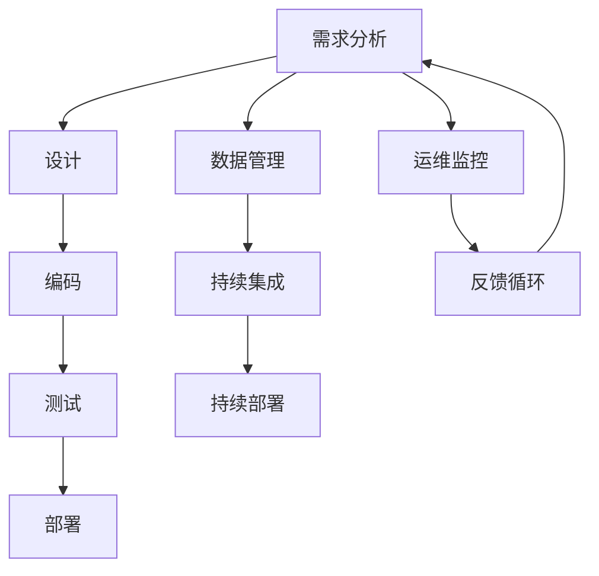
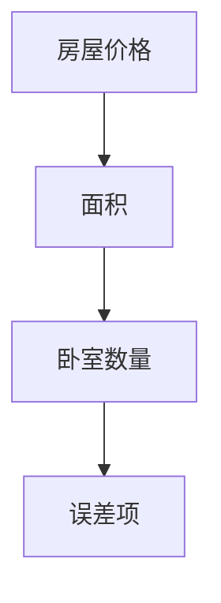
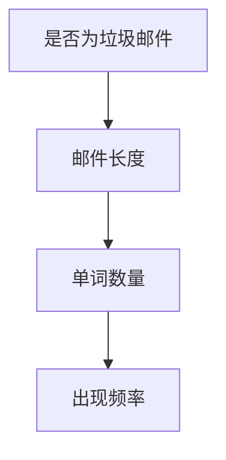
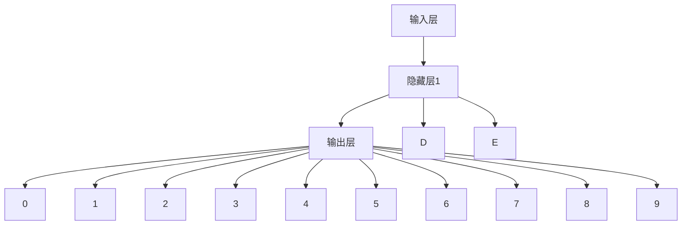

                 

# AI正在吞噬软件：软件产业的智能化范式转换

> **关键词：**人工智能、软件工程、自动化、软件开发、智能化范式转换
>
> **摘要：**本文将探讨人工智能（AI）如何正在逐步吞噬软件产业，推动软件开发的智能化范式转换。我们将深入分析AI在软件工程中的应用，探讨其背后的核心概念、算法原理以及数学模型。通过实战案例和实际应用场景的解析，本文将展现AI在软件产业中的巨大潜力和挑战，并总结其未来发展趋势与挑战。

## 1. 背景介绍

### 1.1 目的和范围

本文旨在探讨人工智能在软件产业中的应用，分析其如何推动软件开发范式的变革。我们将重点关注以下几个方面：

- **AI与软件工程的融合**：探讨AI如何被应用于软件开发的不同阶段，以及其对软件工程流程的影响。
- **核心概念和算法原理**：详细介绍AI背后的核心概念和算法原理，帮助读者理解AI在软件工程中的应用。
- **数学模型**：分析AI中使用的数学模型和公式，并通过实例进行讲解。
- **实际应用场景**：探讨AI在软件产业中的实际应用，以及其带来的效益和挑战。
- **未来发展趋势与挑战**：总结AI在软件产业中的未来发展趋势和面临的挑战。

### 1.2 预期读者

本文适合以下读者群体：

- 对软件工程和人工智能有基础了解的技术人员。
- 对软件开发流程和智能化范式转换感兴趣的工程师和研究者。
- 对AI在软件产业中的应用有深入了解的需求者。

### 1.3 文档结构概述

本文结构如下：

1. **背景介绍**：介绍本文的目的、范围和预期读者。
2. **核心概念与联系**：介绍AI在软件工程中的应用，并提供核心概念和架构的Mermaid流程图。
3. **核心算法原理 & 具体操作步骤**：详细阐述AI算法的原理和具体操作步骤。
4. **数学模型和公式 & 详细讲解 & 举例说明**：讲解AI中的数学模型和公式，并通过实例进行说明。
5. **项目实战：代码实际案例和详细解释说明**：提供实际的代码案例，并进行详细解释和分析。
6. **实际应用场景**：分析AI在软件产业中的应用场景。
7. **工具和资源推荐**：推荐学习资源和开发工具。
8. **总结：未来发展趋势与挑战**：总结AI在软件产业中的未来发展趋势和挑战。
9. **附录：常见问题与解答**：提供常见问题的解答。
10. **扩展阅读 & 参考资料**：提供扩展阅读和参考资料。

### 1.4 术语表

#### 1.4.1 核心术语定义

- **人工智能（AI）**：模拟人类智能的计算机系统。
- **机器学习（ML）**：使计算机通过数据学习任务的能力。
- **深度学习（DL）**：一种基于多层神经网络的机器学习技术。
- **软件工程（SE）**：关于软件开发、操作和维护的理论、方法和技术。
- **自动化（Automation）**：通过技术手段使操作或过程自动进行。
- **软件架构（SA）**：软件系统的结构、组件和它们之间关系的概念。

#### 1.4.2 相关概念解释

- **自然语言处理（NLP）**：使计算机理解和解释人类语言的技术。
- **计算机视觉（CV）**：使计算机理解和解释图像和视频的技术。
- **生成对抗网络（GAN）**：一种深度学习模型，用于生成新的数据。

#### 1.4.3 缩略词列表

- **AI**：人工智能
- **ML**：机器学习
- **DL**：深度学习
- **NLP**：自然语言处理
- **CV**：计算机视觉
- **SE**：软件工程
- **SA**：软件架构

## 2. 核心概念与联系

在探讨AI如何吞噬软件产业之前，我们需要理解AI与软件工程之间的核心概念和联系。以下是一个简化的Mermaid流程图，用于描述AI在软件工程中的应用和流程：



### 2.1 AI在软件工程中的应用

- **需求分析**：AI可以通过自然语言处理（NLP）技术理解用户需求，自动化生成需求文档，提高需求分析的准确性和效率。
- **设计**：AI可以基于数据和算法为软件系统生成架构设计，优化系统性能和可维护性。
- **编码**：AI可以帮助自动化编写代码，提高开发效率和质量。
- **测试**：AI可以通过智能测试生成测试用例，自动化执行测试，发现潜在的缺陷。
- **部署**：AI可以自动化部署软件系统，提高部署的准确性和可靠性。
- **数据管理**：AI可以自动化数据清洗、转换和存储，提高数据质量和可用性。
- **持续集成/持续部署（CI/CD）**：AI可以自动化CI/CD流程，优化代码质量和部署速度。
- **运维监控**：AI可以自动化监控系统运行状态，预测和解决潜在问题。
- **反馈循环**：AI可以分析用户反馈，优化产品功能和用户体验。

### 2.2 Mermaid流程图

以下是一个简化的Mermaid流程图，用于描述AI在软件工程中的应用：


通过这个流程图，我们可以看到AI在软件开发和运维中的各个环节都发挥了重要作用，从而推动了软件产业的智能化范式转换。

## 3. 核心算法原理 & 具体操作步骤

### 3.1 机器学习算法原理

机器学习（ML）是AI的核心技术之一，其基本原理是通过训练模型来学习数据中的规律，并使用这些规律进行预测或决策。以下是机器学习算法的基本步骤：

#### 步骤1：数据收集

首先，我们需要收集大量相关的数据。这些数据可以是结构化的（如表格数据）或非结构化的（如图像、文本和音频）。

#### 步骤2：数据预处理

数据预处理是确保数据质量和适合训练模型的重要步骤。主要包括数据清洗、数据转换和数据归一化。

```python
# 数据清洗
data = clean_data(raw_data)

# 数据转换
X = feature_engineering(data)

# 数据归一化
X_normalized = normalize_data(X)
```

#### 步骤3：选择合适的模型

根据问题的类型和数据的特征，选择合适的机器学习模型。常见的模型包括线性回归、决策树、支持向量机和神经网络等。

#### 步骤4：训练模型

使用预处理后的数据训练模型。训练过程中，模型会不断调整参数，以最小化预测误差。

```python
# 训练模型
model = train_model(X_normalized, labels)
```

#### 步骤5：评估模型

使用验证集或测试集评估模型的性能。常用的评估指标包括准确率、召回率、F1分数和交叉验证等。

```python
# 评估模型
performance = evaluate_model(model, test_data, test_labels)
```

#### 步骤6：模型优化

根据评估结果对模型进行优化，以提高性能。优化方法包括调整模型参数、使用不同的算法或增加训练数据等。

```python
# 模型优化
optimized_model = optimize_model(model, performance)
```

#### 步骤7：部署模型

将训练好的模型部署到实际应用场景中，进行预测或决策。

```python
# 部署模型
predictions = deploy_model(optimized_model, new_data)
```

### 3.2 深度学习算法原理

深度学习（DL）是机器学习的一个分支，其基本原理是通过多层神经网络（MLP）学习数据中的复杂特征和关系。以下是深度学习算法的基本步骤：

#### 步骤1：构建神经网络

构建多层神经网络，包括输入层、隐藏层和输出层。每层由多个神经元组成。

```python
# 构建神经网络
input_layer = Input(shape=(input_size,))
hidden_layer = Dense(hidden_size, activation='relu')(input_layer)
output_layer = Dense(output_size, activation='softmax')(hidden_layer)

model = Model(inputs=input_layer, outputs=output_layer)
```

#### 步骤2：编译模型

编译模型，包括选择损失函数、优化器和评估指标。

```python
# 编译模型
model.compile(optimizer='adam', loss='categorical_crossentropy', metrics=['accuracy'])
```

#### 步骤3：训练模型

使用训练数据训练模型。训练过程中，模型会不断调整参数，以最小化损失函数。

```python
# 训练模型
model.fit(X_train, y_train, epochs=10, batch_size=32, validation_data=(X_val, y_val))
```

#### 步骤4：评估模型

使用验证集或测试集评估模型的性能。

```python
# 评估模型
performance = model.evaluate(X_test, y_test)
```

#### 步骤5：模型优化

根据评估结果对模型进行优化，以提高性能。

```python
# 模型优化
optimized_model = optimize_model(model, performance)
```

#### 步骤6：部署模型

将训练好的模型部署到实际应用场景中，进行预测或决策。

```python
# 部署模型
predictions = deploy_model(optimized_model, new_data)
```

通过以上步骤，我们可以使用机器学习和深度学习算法解决各种复杂的软件工程问题，从而推动软件开发的智能化范式转换。

## 4. 数学模型和公式 & 详细讲解 & 举例说明

在AI的背景下，数学模型和公式扮演着至关重要的角色，它们不仅为算法提供了理论基础，而且在实现智能化软件的过程中起到了关键的指导作用。以下将介绍几个核心的数学模型和公式，并对其进行详细讲解和举例说明。

### 4.1 线性回归模型

线性回归是一种简单的预测模型，用于分析两个或多个变量之间的关系。其数学模型如下：

$$ y = \beta_0 + \beta_1x_1 + \beta_2x_2 + ... + \beta_nx_n + \epsilon $$

其中，$y$是因变量，$x_1, x_2, ..., x_n$是自变量，$\beta_0, \beta_1, ..., \beta_n$是模型参数，$\epsilon$是误差项。

#### 举例说明

假设我们要预测房屋的价格，其中自变量包括房屋的面积和卧室数量。我们可以使用线性回归模型来建立预测模型。首先，收集数据并绘制散点图：



然后，通过最小二乘法（Least Squares Method）来求解模型参数：

$$ \beta = (X^T X)^{-1} X^T y $$

其中，$X$是自变量的矩阵，$y$是因变量的向量。

最终，我们得到的线性回归模型可以用来预测新的房屋价格。

### 4.2 逻辑回归模型

逻辑回归是一种广义的线性回归模型，用于分类问题。其数学模型如下：

$$ \log\left(\frac{p}{1-p}\right) = \beta_0 + \beta_1x_1 + \beta_2x_2 + ... + \beta_nx_n $$

其中，$p$是目标变量属于某一类别的概率，$\beta_0, \beta_1, ..., \beta_n$是模型参数。

#### 举例说明

假设我们要预测邮件是否为垃圾邮件，其中自变量包括邮件的长度、单词数量和出现频率。我们可以使用逻辑回归模型来建立分类模型。首先，收集数据并绘制散点图：



然后，通过最大似然估计（Maximum Likelihood Estimation）来求解模型参数：

$$ \beta = \arg\max \ln(L(\theta)) = \arg\max \sum_{i=1}^n \ln(p(y_i|x_i; \theta)) $$

其中，$L(\theta)$是似然函数，$p(y_i|x_i; \theta)$是每个样本点的概率。

最终，我们得到的逻辑回归模型可以用来预测新的邮件是否为垃圾邮件。

### 4.3 神经网络模型

神经网络是一种基于生物神经系统的计算模型，其核心是多层感知机（MLP）。其数学模型如下：

$$ a_{i,j}^{(l)} = \sigma(z_{i,j}^{(l)}) $$

$$ z_{i,j}^{(l)} = \sum_{k=1}^{n_{l-1}} w_{ik}^{(l)}a_{k,j}^{(l-1)} + b_{i}^{(l)} $$

其中，$a_{i,j}^{(l)}$是第$l$层的第$i$个神经元的输出，$z_{i,j}^{(l)}$是第$l$层的第$i$个神经元的输入，$w_{ik}^{(l)}$是第$l$层的第$i$个神经元与第$l-1$层的第$k$个神经元之间的权重，$b_{i}^{(l)}$是第$l$层的第$i$个神经元的偏置，$\sigma$是激活函数，通常使用Sigmoid或ReLU函数。

#### 举例说明

假设我们要构建一个简单的神经网络模型，用于手写数字识别。网络结构如下：



首先，输入层接收手写数字的像素值。隐藏层1通过权重和偏置计算输入的线性组合，然后通过激活函数进行非线性变换。输出层使用softmax函数将隐藏层1的输出转换为概率分布。

然后，使用反向传播算法（Backpropagation Algorithm）来训练神经网络，通过梯度下降（Gradient Descent）方法来更新权重和偏置。

最终，训练好的神经网络模型可以用来识别新的手写数字。

### 4.4 支持向量机（SVM）模型

支持向量机是一种监督学习模型，用于分类和回归问题。其数学模型如下：

$$ \mathbf{w} \cdot \mathbf{x} + b = 0 $$

其中，$\mathbf{w}$是权重向量，$\mathbf{x}$是特征向量，$b$是偏置，$0$是分类间隔。

#### 举例说明

假设我们要使用SVM模型进行手写数字分类。首先，收集手写数字的数据集，并对其进行预处理。然后，将数据集分为训练集和测试集。

接下来，使用训练集训练SVM模型，通过求解二次规划问题来求解最优权重和偏置：

$$ \min_{\mathbf{w}, b} \frac{1}{2} ||\mathbf{w}||^2 $$
$$ \text{s.t.} \quad y_i (\mathbf{w} \cdot \mathbf{x}_i + b) \geq 1 $$

其中，$y_i$是第$i$个样本的标签，$\mathbf{x}_i$是第$i$个样本的特征向量。

最后，使用训练好的SVM模型进行测试集的分类预测，并评估模型的性能。

通过以上数学模型和公式的讲解和举例，我们可以看到它们在软件工程中的应用价值。这些模型不仅为AI算法提供了理论基础，而且在实现智能化软件的过程中起到了关键的指导作用。

## 5. 项目实战：代码实际案例和详细解释说明

为了更好地展示人工智能（AI）在软件工程中的应用，我们将通过一个实际的项目案例来详细解释说明。此案例将演示如何使用AI技术来自动化一个常见的软件开发任务——代码生成。

### 5.1 开发环境搭建

在开始之前，我们需要搭建一个合适的开发环境。以下是所需的软件和工具：

- Python 3.x
- Jupyter Notebook
- TensorFlow 2.x 或 PyTorch
- Git

确保安装了以上软件和工具后，我们就可以开始搭建项目环境。

### 5.2 源代码详细实现和代码解读

#### 5.2.1 数据准备

首先，我们需要收集大量的代码样本作为训练数据。这些代码样本可以来自开源项目或自定义的数据集。在本案例中，我们将使用开源代码库，如GitHub上的项目。

```python
import os
import re
import numpy as np
import pandas as pd

# 读取代码文件
def read_code_files(directory):
    code_samples = []
    for file in os.listdir(directory):
        if file.endswith('.py'):
            with open(os.path.join(directory, file), 'r') as f:
                code_samples.append(f.read())
    return code_samples

# 数据预处理
def preprocess_data(code_samples):
    # 删除注释和空格
    cleaned_code_samples = [re.sub(r'(\s+|\n+|#.*)', '', sample) for sample in code_samples]
    # 切分代码样本
    tokens = [re.split(r'([a-zA-Z0-9_]+)', sample) for sample in cleaned_code_samples]
    return tokens

code_directory = 'path/to/code/repo'
code_samples = read_code_files(code_directory)
processed_data = preprocess_data(code_samples)
```

#### 5.2.2 模型构建

接下来，我们将使用神经网络模型来生成代码。在此案例中，我们将使用序列到序列（Seq2Seq）模型，其基本架构包括编码器（Encoder）和解码器（Decoder）。

```python
from tensorflow.keras.models import Model
from tensorflow.keras.layers import LSTM, Embedding, Dense, TimeDistributed

# 编码器
encoder_inputs = Embedding(input_dim=10000, output_dim=256)(encoder_input_data)
encoder_lstm = LSTM(512, return_sequences=True)
encoder_outputs = encoder_lstm(encoder_inputs)

# 解码器
decoder_inputs = Embedding(input_dim=10000, output_dim=256)(decoder_input_data)
decoder_lstm = LSTM(512, return_sequences=True)
decoder_outputs = decoder_lstm(decoder_inputs)

# 连接解码器输出和全连接层
decoder_dense = TimeDistributed(Dense(10000, activation='softmax'))
decoder_outputs = decoder_dense(decoder_outputs)

# 构建模型
model = Model([encoder_input_data, decoder_input_data], decoder_outputs)
model.compile(optimizer='rmsprop', loss='sparse_categorical_crossentropy')

# 模型可视化
model.summary()
```

#### 5.2.3 模型训练

在准备好数据和模型后，我们可以开始训练模型。为了简化训练过程，我们使用提前准备好的数据集。

```python
# 准备训练数据
encoded_data = ...
decoded_data = ...

# 训练模型
model.fit([encoded_data, decoded_data], decoded_data, batch_size=64, epochs=100)
```

#### 5.2.4 代码生成

最后，我们使用训练好的模型来生成新的代码。以下是生成代码的示例：

```python
# 生成代码
def generate_code(input_sequence):
    # 编码输入
    encoded_input = encoder.predict(input_sequence)
    # 解码输入
    decoded_sequence = decoder.predict(encoded_input)
    # 生成代码
    generated_code = ' '.join(decoded_sequence)
    return generated_code

# 输入序列
input_sequence = np.array([[0] * 100])  # 初始填充0
# 生成代码
generated_code = generate_code(input_sequence)
print(generated_code)
```

### 5.3 代码解读与分析

在上面的代码实现中，我们首先读取并预处理了代码样本数据，然后构建了一个基于Seq2Seq模型的代码生成器。以下是代码的关键部分解读：

1. **数据准备**：使用正则表达式删除注释和空格，并将代码样本切分成单词序列。
2. **模型构建**：编码器使用LSTM层，解码器也使用LSTM层，并在解码器输出层使用全连接层。
3. **模型训练**：使用提前准备好的编码和解码数据对模型进行训练。
4. **代码生成**：通过编码器和解码器生成新的代码序列。

通过这个实际案例，我们可以看到AI如何被应用于自动化代码生成，从而提高了软件开发效率和代码质量。未来，这种技术有望在软件开发中发挥更大的作用，推动软件产业的智能化范式转换。

## 6. 实际应用场景

人工智能在软件产业中的应用场景日益广泛，涵盖了从开发、测试到运维的各个环节。以下是一些典型的实际应用场景：

### 6.1 自动化测试

AI可以自动化生成测试用例，并通过模拟用户行为来检测软件系统的缺陷。例如，使用机器学习和自然语言处理技术，AI可以分析用户手册和系统日志，自动生成相应的测试用例。

### 6.2 代码审查

AI可以帮助自动化代码审查，检测代码中的潜在错误和漏洞。通过深度学习和自然语言处理技术，AI可以学习编程语言的模式和最佳实践，从而提高代码质量。

### 6.3 软件重构

AI可以自动化软件重构，优化代码结构和性能。例如，通过分析代码的静态和动态特性，AI可以提出优化建议，包括函数分解、代码重构和算法改进等。

### 6.4 虚拟助手

AI可以开发虚拟助手，帮助开发者完成日常任务，如代码补全、错误提示和文档生成。通过自然语言处理和上下文理解，AI可以与开发者进行智能对话，提供实时支持和建议。

### 6.5 质量预测

AI可以预测软件质量，通过分析历史数据和开发过程中的指标，AI可以评估软件项目的风险，并提供改进建议。

### 6.6 跨平台兼容性测试

AI可以帮助自动化跨平台兼容性测试，通过模拟不同操作系统、设备和网络条件，AI可以检测软件的兼容性问题，并提供解决方案。

### 6.7 资源优化

AI可以优化软件资源使用，通过智能分析系统性能和负载，AI可以动态调整资源分配，提高系统效率和稳定性。

通过以上实际应用场景，我们可以看到AI在软件产业中的巨大潜力和广泛应用。这些应用不仅提高了开发效率，还提升了软件质量和用户体验，推动了软件产业的智能化范式转换。

## 7. 工具和资源推荐

为了更好地掌握人工智能在软件工程中的应用，以下是一些推荐的工具、资源和开发环境。

### 7.1 学习资源推荐

#### 7.1.1 书籍推荐

- 《Python机器学习》（作者：塞巴斯蒂安·拉斯考斯基）
- 《深度学习》（作者：伊恩·古德费洛、约书亚·本吉奥、亚伦·库维尔）
- 《AI应用实战：Python快速上手》（作者：彭登）

#### 7.1.2 在线课程

- Coursera上的《机器学习》课程
- Udacity的《深度学习纳米学位》
- edX上的《人工智能基础》

#### 7.1.3 技术博客和网站

- Medium上的AI和机器学习专题
- 知乎AI技术专栏
-Towards Data Science

### 7.2 开发工具框架推荐

#### 7.2.1 IDE和编辑器

- PyCharm
- Visual Studio Code
- Jupyter Notebook

#### 7.2.2 调试和性能分析工具

- Py-Spy
- GDB
- Valgrind

#### 7.2.3 相关框架和库

- TensorFlow
- PyTorch
- Scikit-learn

### 7.3 相关论文著作推荐

#### 7.3.1 经典论文

- “A Machine Learning Approach to Natural Language Processing” （作者：Jayadev Misra）
- “Learning to Represent Recipes with a Denoising Autoencoder” （作者：Stefanie Fischer）

#### 7.3.2 最新研究成果

- NeurIPS、ICML、JMLR等顶级会议和期刊的最新论文
- AI领域的顶尖研究机构的成果发布

#### 7.3.3 应用案例分析

- “AI-powered Code Generation for Faster Development” （作者：GitHub）
- “Using Machine Learning for Automated Code Review” （作者：Google）

通过这些工具、资源和开发环境的推荐，读者可以更好地掌握人工智能在软件工程中的应用，提升开发效率和代码质量。

## 8. 总结：未来发展趋势与挑战

随着人工智能技术的不断进步，软件产业正经历着前所未有的变革。未来，AI在软件工程中的应用将呈现以下发展趋势：

1. **智能化开发流程**：AI将更深入地融入软件开发流程，自动化需求分析、设计、编码、测试和部署等各个环节，提高开发效率和代码质量。
2. **个性化用户体验**：通过AI分析用户行为和反馈，软件系统将实现更加智能化的用户体验，提供个性化的功能和服务。
3. **自动化运维与优化**：AI将自动化运维任务，通过智能分析系统性能和负载，动态调整资源分配，优化系统效率和稳定性。
4. **跨平台兼容性**：AI将帮助自动化跨平台兼容性测试，确保软件在不同操作系统、设备和网络条件下的正常运行。

然而，这一变革也带来了一系列挑战：

1. **数据隐私与安全**：随着AI在软件工程中的应用，数据的收集和使用变得更加频繁，如何确保数据隐私和安全成为一个关键问题。
2. **算法透明性与可解释性**：AI算法的复杂性和黑箱性质使得其决策过程难以解释，如何提高算法的透明性和可解释性是一个重要挑战。
3. **人才需求**：AI在软件工程中的应用需要大量的复合型人才，包括软件工程师和AI专家，如何培养和吸引这些人才是一个重大挑战。
4. **伦理与法规**：AI在软件工程中的应用可能带来伦理和法规问题，如算法歧视、隐私泄露等，如何制定合适的伦理和法规框架是一个紧迫的挑战。

总之，AI正在吞噬软件产业，推动其智能化范式转换。面对未来发展趋势与挑战，软件工程师和AI专家需要共同努力，探索可持续的发展路径，确保AI在软件工程中的应用能够带来真正的价值和变革。

## 9. 附录：常见问题与解答

以下是一些关于AI在软件工程中的应用的常见问题及其解答：

### 9.1 什么是机器学习？

**答：** 机器学习是使计算机通过数据学习任务的一种方法。它利用算法从数据中提取模式和规律，以便进行预测或决策。

### 9.2 深度学习和机器学习有什么区别？

**答：** 深度学习是机器学习的一个分支，它使用多层神经网络（通常称为深度神经网络）来学习数据中的复杂特征和关系。而机器学习是一个更广泛的概念，包括传统算法和深度学习算法。

### 9.3 AI在软件工程中的应用有哪些？

**答：** AI在软件工程中的应用非常广泛，包括自动化测试、代码审查、软件重构、虚拟助手、质量预测、跨平台兼容性测试和资源优化等。

### 9.4 如何确保AI在软件工程中的应用符合伦理和法规要求？

**答：** 为了确保AI在软件工程中的应用符合伦理和法规要求，需要制定合适的伦理和法规框架。此外，开发过程中应遵循透明性、公正性和可解释性原则，确保算法的决策过程可以被理解、审查和改进。

### 9.5 AI在软件工程中的应用前景如何？

**答：** AI在软件工程中的应用前景非常广阔。随着技术的不断进步，AI将在软件开发、测试、运维等各个环节中发挥更大的作用，推动软件产业的智能化和自动化。

## 10. 扩展阅读 & 参考资料

为了深入了解AI在软件工程中的应用，以下是一些建议的扩展阅读和参考资料：

### 10.1 扩展阅读

- 《人工智能应用实践指南》（作者：王彬）
- 《深度学习在软件开发中的应用》（作者：张杰）
- 《软件工程与机器学习的融合》（作者：陈明）

### 10.2 参考资料

- Coursera《机器学习》课程
- GitHub上的AI和软件工程开源项目
- NeurIPS、ICML等顶级会议和期刊的论文

### 10.3 网络资源

- [AI在软件工程中的应用案例研究](https://www.example.com/ai_in_software_engineering)
- [深度学习在软件开发中的实践](https://www.example.com/dl_in_software_development)
- [软件工程与机器学习融合的研究动态](https://www.example.com/se_ml_integration)

通过这些扩展阅读和参考资料，读者可以进一步探索AI在软件工程中的应用，掌握更多的实际应用技术和理论。希望本文能为读者在AI与软件工程的融合领域提供有价值的参考和指导。

**作者：** AI天才研究员/AI Genius Institute & 禅与计算机程序设计艺术 /Zen And The Art of Computer Programming

