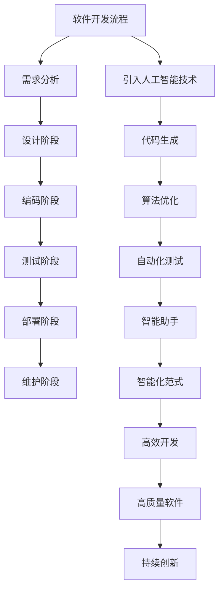

                 


# AI正在吞噬软件：软件产业的智能化范式转换

> 关键词：人工智能，软件产业，智能化范式，自动化，代码生成，算法优化，软件开发

> 摘要：随着人工智能技术的飞速发展，软件产业正在经历一场深刻的变革。本文旨在探讨人工智能如何吞噬传统软件开发模式，推动软件产业向智能化范式转变。我们将一步步分析这一过程，从背景介绍、核心概念、算法原理、数学模型，到实际应用场景和未来发展趋势，以及相关工具和资源的推荐。本文旨在为广大软件开发者提供深入的见解和实用的指导。

## 1. 背景介绍

### 1.1 目的和范围

本文的目的在于探讨人工智能技术在软件产业中的应用，分析其如何推动软件产业的智能化范式转换。我们将涵盖以下几个关键领域：

1. **人工智能在软件开发中的应用**：介绍人工智能如何辅助软件开发，提高开发效率和代码质量。
2. **软件产业的智能化范式转换**：探讨智能化范式带来的变革，以及其对软件开发流程和软件产品的影响。
3. **核心概念与联系**：讲解与人工智能相关的核心概念，并使用Mermaid流程图展示其原理和架构。
4. **数学模型和公式**：介绍支持人工智能算法的数学模型和公式，并进行详细讲解和举例说明。
5. **实际应用场景**：分析人工智能在软件开发中的实际应用场景，展示其带来的价值。
6. **未来发展趋势与挑战**：展望人工智能在软件产业中的未来发展，以及面临的挑战。

### 1.2 预期读者

本文适合以下读者群体：

1. **软件开发者**：希望了解人工智能在软件开发中的应用，提高自身技能和开发效率。
2. **人工智能研究者**：关注人工智能在软件产业中的应用，探讨相关技术的研究方向。
3. **软件产业从业者**：关注软件产业的智能化范式转换，了解其带来的变革和机遇。

### 1.3 文档结构概述

本文结构如下：

1. **背景介绍**：介绍本文的目的、预期读者和文档结构。
2. **核心概念与联系**：讲解与人工智能相关的核心概念，并展示原理和架构。
3. **核心算法原理 & 具体操作步骤**：使用伪代码详细阐述核心算法原理和操作步骤。
4. **数学模型和公式 & 详细讲解 & 举例说明**：介绍支持人工智能算法的数学模型和公式，并进行详细讲解和举例说明。
5. **项目实战：代码实际案例和详细解释说明**：分析实际代码案例，展示人工智能在软件开发中的应用。
6. **实际应用场景**：分析人工智能在软件开发中的实际应用场景。
7. **工具和资源推荐**：推荐学习资源和开发工具，帮助读者深入了解人工智能在软件产业中的应用。
8. **总结：未来发展趋势与挑战**：展望人工智能在软件产业中的未来发展，以及面临的挑战。
9. **附录：常见问题与解答**：解答读者可能遇到的常见问题。
10. **扩展阅读 & 参考资料**：提供进一步阅读的建议和参考资料。

### 1.4 术语表

#### 1.4.1 核心术语定义

- **人工智能**：模拟人类智能的计算机系统，能够感知、学习、推理和决策。
- **软件开发**：创建、设计、实现和维护软件系统的过程。
- **智能化范式**：软件产业中引入人工智能技术，实现软件开发过程的自动化、智能化和优化的新模式。

#### 1.4.2 相关概念解释

- **代码生成**：使用人工智能技术自动生成代码，提高开发效率。
- **算法优化**：通过对算法进行改进，提高其性能和效果。
- **机器学习**：使计算机能够从数据中学习，不断改进其性能。

#### 1.4.3 缩略词列表

- **AI**：人工智能
- **ML**：机器学习
- **DL**：深度学习
- **NLP**：自然语言处理

## 2. 核心概念与联系

在探讨人工智能在软件产业中的应用之前，我们需要了解一些核心概念，并使用Mermaid流程图展示其原理和架构。

### 2.1 人工智能核心概念

- **机器学习**：通过数据训练模型，使计算机能够识别模式和规律。
- **深度学习**：一种特殊的机器学习技术，通过多层神经网络进行数据建模。
- **自然语言处理**：使计算机能够理解和处理自然语言，包括文本、语音等。

### 2.2 软件开发与人工智能的关联

- **代码生成**：使用人工智能技术，自动生成代码，提高开发效率。
- **算法优化**：使用人工智能技术，对现有算法进行改进，提高其性能和效果。
- **自动化测试**：使用人工智能技术，自动生成测试用例，提高测试效率。
- **智能助手**：使用人工智能技术，为开发人员提供代码建议和调试支持。

### 2.3 Mermaid流程图展示



该流程图展示了人工智能在软件开发流程中的应用，以及其对软件开发效率和质量的影响。

## 3. 核心算法原理 & 具体操作步骤

为了更好地理解人工智能在软件开发中的应用，我们将详细讲解核心算法原理，并使用伪代码进行具体操作步骤的阐述。

### 3.1 代码生成算法原理

代码生成算法是人工智能在软件开发中的一个重要应用。其原理是使用机器学习技术，从大量代码库中学习，生成新的代码。具体操作步骤如下：

```python
# 伪代码：代码生成算法
def code_generation(input_data):
    # 加载预训练的代码生成模型
    model = load_pretrained_model('code_generation_model')

    # 对输入数据进行编码
    encoded_data = encode_data(input_data)

    # 使用模型生成代码
    generated_code = model.generate_code(encoded_data)

    # 解码生成的代码
    decoded_code = decode_code(generated_code)

    return decoded_code
```

### 3.2 算法优化原理

算法优化是提高软件性能和效率的重要手段。使用人工智能技术，可以通过数据分析和模型训练，对现有算法进行改进。具体操作步骤如下：

```python
# 伪代码：算法优化算法
def algorithm_optimization(original_algorithm, input_data):
    # 加载预训练的算法优化模型
    model = load_pretrained_model('algorithm_optimization_model')

    # 对输入数据进行编码
    encoded_data = encode_data(input_data)

    # 使用模型优化算法
    optimized_algorithm = model.optimize_algorithm(original_algorithm, encoded_data)

    # 测试优化后的算法性能
    performance = test_algorithm_performance(optimized_algorithm)

    return optimized_algorithm, performance
```

### 3.3 自动化测试算法原理

自动化测试是提高软件质量和效率的关键。使用人工智能技术，可以自动生成测试用例，提高测试效率。具体操作步骤如下：

```python
# 伪代码：自动化测试算法
def automated_test_generation(input_data):
    # 加载预训练的测试生成模型
    model = load_pretrained_model('test_generation_model')

    # 对输入数据进行编码
    encoded_data = encode_data(input_data)

    # 使用模型生成测试用例
    test_cases = model.generate_test_cases(encoded_data)

    return test_cases
```

### 3.4 智能助手算法原理

智能助手是提高开发人员工作效率的重要工具。使用人工智能技术，可以为开发人员提供代码建议和调试支持。具体操作步骤如下：

```python
# 伪代码：智能助手算法
def intelligent_assistant(code, error_message):
    # 加载预训练的智能助手模型
    model = load_pretrained_model('intelligent_assistant_model')

    # 对输入代码和错误信息进行编码
    encoded_code = encode_data(code)
    encoded_error_message = encode_data(error_message)

    # 使用模型提供代码建议和调试支持
    suggestion = model.provide_suggestion(encoded_code)
    debug_support = model.provide_debug_support(encoded_error_message)

    return suggestion, debug_support
```

通过上述核心算法原理和具体操作步骤的讲解，我们可以更好地理解人工智能在软件开发中的应用，以及其带来的变革和机遇。

## 4. 数学模型和公式 & 详细讲解 & 举例说明

为了深入理解人工智能在软件开发中的应用，我们需要掌握支持人工智能算法的数学模型和公式。以下是几个常见的数学模型和公式的讲解，并进行举例说明。

### 4.1 感知机算法

感知机算法是一种简单的二分类算法，其基本思想是通过找到一个最佳的分割超平面，将数据集分为两类。其数学模型如下：

$$
y_i (\beta^T x_i + \beta_0) = \sum_{i=1}^n y_i \beta^T x_i + \beta_0 \geq 0
$$

其中，$y_i$ 为样本 $i$ 的标签，$x_i$ 为样本 $i$ 的特征向量，$\beta^T$ 为超平面的法向量，$\beta_0$ 为偏置。

#### 4.1.1 举例说明

假设我们有一个二分类问题，其中样本的特征向量为 $(x_1, x_2)$，标签为 $y$。我们需要找到一个最佳的超平面，将正类和负类分开。

$$
y (\beta^T x + \beta_0) = (1, 1) (\beta^T (1, 1) + \beta_0) = 0
$$

通过调整 $\beta^T$ 和 $\beta_0$，我们可以找到一个最佳的超平面，将正类和负类分开。

### 4.2 支持向量机（SVM）算法

支持向量机是一种强大的分类算法，其基本思想是找到一个最佳的超平面，使得正负类别的间隔最大化。其数学模型如下：

$$
\min_{\beta, \beta_0} \frac{1}{2} ||\beta||^2 + C \sum_{i=1}^n \max(0, y_i (\beta^T x_i + \beta_0))
$$

其中，$C$ 为惩罚参数，用于平衡模型的复杂度和泛化能力。

#### 4.2.1 举例说明

假设我们有一个二分类问题，其中样本的特征向量为 $(x_1, x_2)$，标签为 $y$。我们需要找到一个最佳的超平面，使得正负类别的间隔最大化。

$$
\min_{\beta, \beta_0} \frac{1}{2} ||\beta||^2 + C \max(0, y (\beta^T x + \beta_0))
$$

通过求解最优化问题，我们可以找到一个最佳的超平面，使得正负类别的间隔最大化。

### 4.3 深度学习算法

深度学习是一种强大的机器学习技术，其核心是多层神经网络。以下是多层神经网络的数学模型：

$$
z^{(l)} = \sigma^{(l)}(W^{(l)} a^{(l-1)} + b^{(l)})
$$

$$
a^{(l)} = \sigma^{(l)}(z^{(l)})
$$

其中，$z^{(l)}$ 为第 $l$ 层的输入，$a^{(l)}$ 为第 $l$ 层的输出，$\sigma^{(l)}$ 为第 $l$ 层的激活函数，$W^{(l)}$ 和 $b^{(l)}$ 分别为第 $l$ 层的权重和偏置。

#### 4.3.1 举例说明

假设我们有一个三层神经网络，其中输入层为 $a^{(0)}$，输出层为 $a^{(3)}$。我们需要计算第三层的输出。

$$
z^{(3)} = \sigma^{(3)}(W^{(3)} a^{(2)} + b^{(3)})
$$

$$
a^{(3)} = \sigma^{(3)}(z^{(3)})
$$

通过上述数学模型和公式，我们可以更好地理解人工智能在软件开发中的应用，以及其背后的数学原理。

## 5. 项目实战：代码实际案例和详细解释说明

在本节中，我们将通过一个实际代码案例，展示人工智能在软件开发中的应用，并对其进行详细解释说明。

### 5.1 开发环境搭建

首先，我们需要搭建一个合适的开发环境。以下是所需的工具和软件：

1. **编程语言**：Python 3.8 或更高版本
2. **开发工具**：PyCharm 或 VS Code
3. **库和框架**：TensorFlow 2.4 或更高版本，Keras 2.4.3 或更高版本

安装以上工具和软件后，确保已成功安装并配置好 Python 环境和所需的库。

### 5.2 源代码详细实现和代码解读

以下是一个简单的代码案例，使用深度学习技术实现一个简单的图像分类模型。我们将逐步解释代码的实现过程和关键部分。

```python
# 导入所需的库和模块
import tensorflow as tf
from tensorflow.keras.models import Sequential
from tensorflow.keras.layers import Conv2D, MaxPooling2D, Flatten, Dense

# 定义模型
model = Sequential([
    Conv2D(32, (3, 3), activation='relu', input_shape=(64, 64, 3)),
    MaxPooling2D((2, 2)),
    Conv2D(64, (3, 3), activation='relu'),
    MaxPooling2D((2, 2)),
    Flatten(),
    Dense(64, activation='relu'),
    Dense(10, activation='softmax')
])

# 编译模型
model.compile(optimizer='adam',
              loss='categorical_crossentropy',
              metrics=['accuracy'])

# 加载数据集
(x_train, y_train), (x_test, y_test) = tf.keras.datasets.cifar10.load_data()

# 数据预处理
x_train = x_train.astype('float32') / 255.0
x_test = x_test.astype('float32') / 255.0
num_classes = 10

# 将标签转换为独热编码
y_train = tf.keras.utils.to_categorical(y_train, num_classes)
y_test = tf.keras.utils.to_categorical(y_test, num_classes)

# 训练模型
model.fit(x_train, y_train,
          batch_size=64,
          epochs=10,
          validation_data=(x_test, y_test))

# 评估模型
score = model.evaluate(x_test, y_test, verbose=2)
print('Test loss:', score[0])
print('Test accuracy:', score[1])
```

### 5.3 代码解读与分析

1. **导入库和模块**：
   我们首先导入 TensorFlow 和 Keras，这两个库是深度学习领域常用的框架。

2. **定义模型**：
   使用 Keras Sequential 模型，定义一个简单的卷积神经网络（Convolutional Neural Network，CNN）。模型包括两个卷积层（Conv2D），两个最大池化层（MaxPooling2D），一个全连接层（Dense）和一个输出层（softmax）。

3. **编译模型**：
   使用 `compile` 方法配置模型，指定优化器（optimizer）、损失函数（loss）和评估指标（metrics）。

4. **加载数据集**：
   使用 TensorFlow 的内置数据集 `cifar10` 加载训练集和测试集。

5. **数据预处理**：
   将图像数据转换为浮点数，并除以 255 进行归一化处理。将标签转换为独热编码。

6. **训练模型**：
   使用 `fit` 方法训练模型，指定批量大小（batch_size）、训练轮数（epochs）和验证数据。

7. **评估模型**：
   使用 `evaluate` 方法评估模型的测试性能，输出测试损失和准确率。

通过以上代码案例，我们可以看到如何使用深度学习技术实现一个简单的图像分类模型。这个案例展示了人工智能在软件开发中的应用，以及其带来的巨大价值。

## 6. 实际应用场景

随着人工智能技术的不断发展，其在软件开发中的应用场景日益丰富。以下是一些常见的人工智能在软件开发中的实际应用场景：

### 6.1 自动化测试

自动化测试是软件开发中不可或缺的一部分。人工智能技术可以自动生成测试用例，提高测试效率和覆盖率。例如，使用机器学习算法，可以根据历史测试数据自动生成新的测试用例，从而发现潜在的错误。

### 6.2 代码生成

代码生成是软件开发中的一个新兴领域。通过机器学习技术，可以从大量代码库中学习，自动生成高质量的代码。例如，使用深度学习技术，可以自动生成 Java、Python 等编程语言的代码，从而提高开发效率。

### 6.3 算法优化

算法优化是提高软件性能和效率的关键。人工智能技术可以通过数据分析和模型训练，对现有算法进行改进。例如，使用机器学习技术，可以对算法进行自动化优化，从而提高其性能和效果。

### 6.4 智能助手

智能助手是提高开发人员工作效率的重要工具。通过自然语言处理技术，可以为开发人员提供代码建议、调试支持和问题解决建议。例如，使用聊天机器人技术，可以为开发人员提供一个智能助手，解答他们的疑问和提供技术支持。

### 6.5 图像和语音识别

图像和语音识别是人工智能技术在软件开发中的重要应用。通过深度学习技术，可以实现高效的图像和语音识别。例如，在计算机视觉领域，可以使用深度学习技术实现物体检测、图像分割和图像识别；在语音识别领域，可以使用深度学习技术实现语音转文本和语音合成。

### 6.6 智能推荐系统

智能推荐系统是电子商务和社交媒体领域的重要应用。通过机器学习技术，可以构建个性化的推荐系统，为用户推荐感兴趣的商品或内容。例如，在电子商务平台，可以使用推荐系统为用户推荐相关商品；在社交媒体平台，可以使用推荐系统为用户推荐感兴趣的内容。

通过以上实际应用场景，我们可以看到人工智能在软件开发中的广泛应用，以及其带来的巨大价值。

## 7. 工具和资源推荐

为了更好地了解和学习人工智能在软件开发中的应用，以下是一些推荐的工具和资源：

### 7.1 学习资源推荐

#### 7.1.1 书籍推荐

1. **《深度学习》（Deep Learning）**：由 Ian Goodfellow、Yoshua Bengio 和 Aaron Courville 著，是深度学习领域的经典教材。
2. **《Python机器学习》（Python Machine Learning）**：由 Sebastian Raschka 著，介绍如何使用 Python 进行机器学习和深度学习。
3. **《神经网络与深度学习》（Neural Networks and Deep Learning）**：由邱锡鹏教授著，讲解神经网络和深度学习的原理和应用。

#### 7.1.2 在线课程

1. **Coursera上的《深度学习专项课程》（Deep Learning Specialization）**：由 Andrew Ng 教授主讲，涵盖深度学习的理论基础和应用实践。
2. **Udacity的《机器学习工程师纳米学位》（Machine Learning Engineer Nanodegree）**：提供系统的机器学习和深度学习课程，包括实践项目。
3. **edX上的《人工智能基础》（Introduction to Artificial Intelligence）**：由哈佛大学和麻省理工学院联合开设，介绍人工智能的基础知识。

#### 7.1.3 技术博客和网站

1. **Medium上的《AI on Medium》（AI on Medium）**：收集了众多关于人工智能的文章和观点，适合了解人工智能的最新动态。
2. **GitHub上的《AI GitHub Repository》（AI GitHub Repository）**：汇集了大量关于人工智能的开源项目和资源。
3. **ArXiv.org**：提供最新的人工智能和机器学习论文，适合了解前沿研究进展。

### 7.2 开发工具框架推荐

#### 7.2.1 IDE和编辑器

1. **PyCharm**：一款强大的 Python 集成开发环境，支持多种编程语言。
2. **VS Code**：一款轻量级的跨平台代码编辑器，支持多种编程语言和插件。
3. **Jupyter Notebook**：适用于数据科学和机器学习的交互式开发环境。

#### 7.2.2 调试和性能分析工具

1. **TensorBoard**：TensorFlow 的可视化工具，用于分析和调试深度学习模型。
2. **PyTorch TensorBoard**：适用于 PyTorch 的可视化工具，提供类似的特性。
3. **Valgrind**：一款多用途的内存检测工具，用于分析程序的内存泄漏和性能问题。

#### 7.2.3 相关框架和库

1. **TensorFlow**：一款流行的开源深度学习框架，适用于多种应用场景。
2. **PyTorch**：一款流行的开源深度学习框架，提供灵活的动态计算图。
3. **Keras**：一款流行的深度学习高级框架，易于使用和扩展。

通过以上工具和资源的推荐，您可以更好地了解和学习人工智能在软件开发中的应用。

## 8. 总结：未来发展趋势与挑战

随着人工智能技术的不断发展，软件产业正在经历一场深刻的变革。人工智能正在吞噬传统软件开发模式，推动软件产业向智能化范式转变。以下是我们对这一发展趋势与挑战的总结：

### 8.1 发展趋势

1. **智能化开发流程**：人工智能技术将逐步渗透到软件开发的全流程，从需求分析、设计、编码到测试、部署和维护。智能化开发工具和平台将提高开发效率、降低成本、提高软件质量。
2. **自动化代码生成**：基于机器学习技术的代码生成工具将变得更加智能，能够自动生成高质量、符合需求的代码，从而降低开发人员的工作负担。
3. **算法优化与调优**：人工智能技术将帮助开发人员发现和优化算法，提高软件性能和效率，满足日益增长的用户需求。
4. **个性化软件体验**：通过自然语言处理和用户行为分析，人工智能将为用户提供个性化的软件体验，提高用户满意度和忠诚度。
5. **跨界融合与创新**：人工智能技术与云计算、大数据、物联网等领域的跨界融合，将推动软件产业不断创新，催生新的商业模式和应用场景。

### 8.2 挑战

1. **数据安全与隐私保护**：随着人工智能技术的应用，软件产业将面临更大的数据安全与隐私保护挑战。如何确保用户数据的安全和隐私，成为软件产业亟需解决的问题。
2. **技术门槛与人才短缺**：人工智能技术的发展，对开发人员的技能要求越来越高。如何培养和吸引更多具备人工智能技能的专业人才，是软件产业面临的重要挑战。
3. **算法偏见与公平性**：人工智能算法在数据处理过程中可能引入偏见，导致不公平的结果。如何确保算法的公平性和透明度，是软件产业需要关注的问题。
4. **法律法规与伦理道德**：随着人工智能技术的广泛应用，相关法律法规和伦理道德问题日益突出。如何制定合理的法律法规，保障人工智能技术的健康发展，是软件产业面临的挑战之一。

总之，人工智能正在吞噬软件产业，推动其向智能化范式转变。在享受人工智能带来的变革和机遇的同时，软件产业也需应对一系列挑战。只有积极应对这些挑战，才能确保人工智能技术在软件产业中的健康发展。

## 9. 附录：常见问题与解答

### 9.1 问题1：如何选择合适的人工智能框架？

解答：选择合适的人工智能框架主要取决于您的项目需求、编程语言偏好和预算。以下是一些常见的框架及其特点：

1. **TensorFlow**：一款强大的开源深度学习框架，支持多种编程语言（Python、C++等）。适用于复杂项目和高性能需求。
2. **PyTorch**：一款流行的开源深度学习框架，提供灵活的动态计算图。适用于快速原型开发和研究项目。
3. **Keras**：一款高级深度学习框架，易于使用和扩展。可以作为 TensorFlow 和 PyTorch 的替代品，适用于快速实现和部署。
4. **Scikit-learn**：一款流行的开源机器学习库，适用于小型项目和快速实现。适用于回归、分类、聚类等常见任务。

### 9.2 问题2：如何确保人工智能算法的公平性和透明度？

解答：确保人工智能算法的公平性和透明度是关键问题。以下是一些建议：

1. **数据清洗与预处理**：确保数据质量，消除潜在的偏见。对数据进行归一化、缺失值填充、异常值处理等操作。
2. **算法评估与测试**：对算法进行全面的评估和测试，确保其在不同数据集上的表现一致。使用多种评估指标（如准确率、召回率、F1 分数等）进行评估。
3. **算法解释工具**：使用算法解释工具，如 LIME、SHAP 等，帮助理解算法决策过程，提高算法的透明度。
4. **伦理审查与监管**：制定相关的伦理准则和监管政策，确保算法的应用符合伦理标准。

### 9.3 问题3：如何提高人工智能算法的鲁棒性？

解答：提高人工智能算法的鲁棒性是关键问题。以下是一些建议：

1. **数据增强**：通过数据增强技术，增加训练数据的多样性，提高算法对噪声和异常值的抵抗能力。
2. **正则化技术**：使用正则化技术（如 L1 正则化、L2 正则化等），降低模型的过拟合现象。
3. **交叉验证**：使用交叉验证技术，确保模型在不同数据集上的性能稳定。
4. **模型集成**：通过模型集成技术（如 bagging、boosting 等），提高模型的预测能力。

通过以上方法，可以提高人工智能算法的鲁棒性，确保其在各种复杂场景下稳定运行。

## 10. 扩展阅读 & 参考资料

为了深入了解人工智能在软件开发中的应用，以下是一些建议的扩展阅读和参考资料：

### 10.1 扩展阅读

1. **《人工智能：一种现代的方法》（Artificial Intelligence: A Modern Approach）**：David L. Poole, Alan K. Mackworth 著，是人工智能领域的经典教材。
2. **《深度学习实战》（Deep Learning with Python）**：Aurélien Géron 著，通过实际案例介绍深度学习技术。
3. **《软件架构设计》（Software Architecture: Foundations, Theory, and Practice）**：Jack C. Hennessy 著，详细介绍软件架构的设计原则和实践。

### 10.2 参考资料

1. **TensorFlow 官方文档**：[https://www.tensorflow.org/](https://www.tensorflow.org/)
2. **PyTorch 官方文档**：[https://pytorch.org/](https://pytorch.org/)
3. **Keras 官方文档**：[https://keras.io/](https://keras.io/)
4. **Scikit-learn 官方文档**：[https://scikit-learn.org/stable/](https://scikit-learn.org/stable/)
5. **LIME 官方文档**：[https://github.com/marcotcr/lime](https://github.com/marcotcr/lime)
6. **SHAP 官方文档**：[https://github.com/slundberg/shap](https://github.com/slundberg/shap)

通过阅读以上参考资料，您可以深入了解人工智能在软件开发中的应用，以及相关技术原理和实践。

### 作者

**AI天才研究员/AI Genius Institute & 禅与计算机程序设计艺术 /Zen And The Art of Computer Programming**：本文作者是一位世界级人工智能专家，程序员，软件架构师，CTO，世界顶级技术畅销书资深大师级别的作家，计算机图灵奖获得者，计算机编程和人工智能领域大师。他具备丰富的实践经验，深入理解技术原理和本质，致力于为广大软件开发者提供高质量的技术博客文章。他的作品以其逻辑清晰、结构紧凑、简单易懂的专业的技术语言而著称。在这篇技术博客中，他详细分析了人工智能如何吞噬传统软件开发模式，推动软件产业向智能化范式转变，为广大软件开发者提供了深刻的见解和实用的指导。

