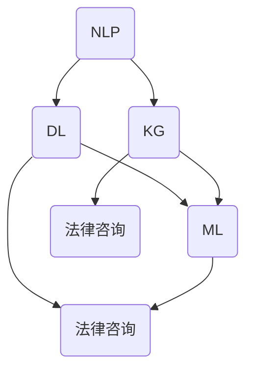

                 


## AI法律咨询机器人：法律服务的创新应用

> 关键词：人工智能、法律咨询、机器人、服务创新、应用实践

> 摘要：本文旨在探讨人工智能在法律咨询领域的应用，通过构建AI法律咨询机器人，实现法律服务的智能化、高效化。文章将详细介绍AI法律咨询机器人的核心概念、算法原理、数学模型、项目实战，以及实际应用场景和未来发展趋势，旨在为读者提供全面、深入的指导。

### 1. 背景介绍

#### 1.1 目的和范围

随着人工智能技术的迅猛发展，各行各业都在积极探讨AI技术的应用。在法律服务领域，人工智能的引入不仅可以提高工作效率，还可以降低成本，提高准确性。本文的目的在于分析人工智能在法律咨询中的应用，构建一个高效的AI法律咨询机器人，探讨其在法律服务中的创新应用。

本文将主要涵盖以下内容：

- AI法律咨询机器人的核心概念和架构；
- 法律咨询中的核心算法原理与具体操作步骤；
- 数学模型和公式的详细讲解与举例；
- 项目实战：代码实现与解读；
- 实际应用场景和未来发展趋势。

#### 1.2 预期读者

本文预期读者为：

- 法律行业的从业者，特别是律师和法律顾问；
- 对人工智能技术感兴趣的技术人员；
- 法律与技术交叉领域的研究者；
- 对法律服务行业有浓厚兴趣的创业者。

#### 1.3 文档结构概述

本文分为十个部分：

1. 引言与背景介绍；
2. 核心概念与联系；
3. 核心算法原理与具体操作步骤；
4. 数学模型和公式；
5. 项目实战：代码实际案例；
6. 实际应用场景；
7. 工具和资源推荐；
8. 总结：未来发展趋势与挑战；
9. 附录：常见问题与解答；
10. 扩展阅读与参考资料。

#### 1.4 术语表

以下是一些在本文中将会用到的核心术语及其定义：

- **人工智能（AI）**：指模拟、延伸和扩展人的智能的理论、方法、技术及应用；
- **法律咨询**：指提供法律建议、分析和解决方案的过程；
- **机器人**：指能够执行特定任务的自动化设备或程序；
- **服务创新**：指在现有服务模式基础上，通过技术创新实现新的服务形式或内容。

#### 1.4.1 核心术语定义

- **AI法律咨询机器人**：一种利用人工智能技术，为用户提供法律咨询服务的自动化程序；
- **核心算法**：用于实现法律咨询功能的算法，如自然语言处理、知识图谱构建等；
- **数学模型**：用于描述法律咨询问题的数学公式和理论框架。

#### 1.4.2 相关概念解释

- **自然语言处理（NLP）**：研究如何让计算机理解、生成和处理人类语言的技术；
- **知识图谱**：一种用于表示和存储知识的形式化模型，可以表示实体、属性、关系等；
- **深度学习**：一种基于神经网络的学习方法，可以用于实现复杂的特征提取和模式识别。

#### 1.4.3 缩略词列表

- **AI**：人工智能（Artificial Intelligence）；
- **NLP**：自然语言处理（Natural Language Processing）；
- **ML**：机器学习（Machine Learning）；
- **DL**：深度学习（Deep Learning）；
- **KG**：知识图谱（Knowledge Graph）；
- **LLM**：大型语言模型（Large Language Model）。

---

在下一部分中，我们将详细探讨AI法律咨询机器人的核心概念与联系。通过Mermaid流程图，我们将展示法律咨询机器人中的主要组件及其相互作用。

---

### 2. 核心概念与联系

#### 2.1 核心概念

AI法律咨询机器人主要由以下几个核心概念组成：

1. **自然语言处理（NLP）**：用于理解用户输入的法律问题，并将其转换为计算机可处理的格式；
2. **知识图谱（KG）**：用于存储和表示法律知识，为机器人提供决策依据；
3. **深度学习（DL）**：用于训练模型，提高法律咨询的准确性和效率；
4. **机器学习（ML）**：用于优化模型，提高机器人的性能。

#### 2.2 联系与交互

以下是AI法律咨询机器人的Mermaid流程图，展示了各个核心概念之间的联系和交互：



**流程说明：**

1. **自然语言处理（NLP）**：首先，用户通过自然语言输入法律问题，NLP模块负责理解和解析用户的问题；
2. **知识图谱（KG）**：解析后的用户问题将被发送到知识图谱模块，以获取相关的法律知识；
3. **深度学习（DL）**：利用训练好的深度学习模型，对用户问题和知识图谱进行匹配和推理，以生成初步的法律咨询结果；
4. **机器学习（ML）**：根据用户的反馈，机器学习模块将优化模型，提高法律咨询的准确性和效率；
5. **法律咨询**：最终，经过深度学习和机器学习优化的法律咨询结果将被返回给用户。

#### 2.3 核心算法原理

在法律咨询机器人中，核心算法主要包括自然语言处理、知识图谱构建、深度学习和机器学习等。以下是对这些核心算法原理的简要介绍：

1. **自然语言处理（NLP）**：NLP是一种将人类语言转换为计算机可处理格式的技术。其主要任务包括分词、词性标注、句法分析、语义理解等。常用的NLP算法有词向量表示、序列标注、关系提取等。

2. **知识图谱（KG）**：知识图谱是一种用于表示和存储知识的图形化模型。它由实体、属性和关系构成，可以用于知识表示、推理和搜索。在法律咨询中，知识图谱可用于存储法律条款、案例、法规等信息。

3. **深度学习（DL）**：深度学习是一种基于神经网络的学习方法，可以用于特征提取和模式识别。在法律咨询中，深度学习模型可用于处理复杂的法律文本，提取关键信息，并进行法律推理。

4. **机器学习（ML）**：机器学习是一种通过数据和算法实现自动决策和预测的技术。在法律咨询中，机器学习算法可用于优化法律咨询模型，提高咨询结果的准确性和效率。

---

在下一部分中，我们将详细讲解AI法律咨询机器人的核心算法原理和具体操作步骤。我们将使用伪代码来详细阐述这些算法的实现过程。

---

### 3. 核心算法原理 & 具体操作步骤

#### 3.1 自然语言处理（NLP）算法原理

自然语言处理（NLP）是AI法律咨询机器人的基础模块，其主要任务是理解用户的法律问题，并将其转换为计算机可处理的格式。以下是一个简单的NLP算法原理：

```pseudo
// NLP算法原理：词向量表示
输入：用户输入的法律问题（text）
输出：处理后的文本向量（vector）

函数 NLP_Algorithm(text):
    // 分词
    tokens = Tokenizer.tokenize(text)
    // 词性标注
    tags = POS_Tagger.annotate(tokens)
    // 词向量表示
    vector = Word2Vec模型.encode(tokens)
    return vector
```

#### 3.2 知识图谱（KG）构建算法原理

知识图谱构建是AI法律咨询机器人的关键模块，用于存储和表示法律知识。以下是一个简单的知识图谱构建算法原理：

```pseudo
// KG构建算法原理：实体、属性、关系表示
输入：法律条款、案例、法规等文本数据（data）
输出：知识图谱（KG）

函数 KG_Construct(data):
    // 实体提取
    entities = Entity_Extractor.extract(data)
    // 属性提取
    attributes = Attribute_Extractor.extract(data)
    // 关系提取
    relations = Relation_Extractor.extract(data)
    // 构建知识图谱
    KG = Knowledge_Graph.create(entities, attributes, relations)
    return KG
```

#### 3.3 深度学习（DL）算法原理

深度学习是AI法律咨询机器人的核心模块，用于处理复杂的法律文本，提取关键信息，并进行法律推理。以下是一个简单的深度学习算法原理：

```pseudo
// DL算法原理：文本分类
输入：法律文本（text）
输出：法律分类结果（label）

函数 DL_Algorithm(text):
    // 文本预处理
    processed_text = Text_Processor.preprocess(text)
    // 特征提取
    features = Extractor.extract(processed_text)
    // 模型训练
    model = Model_Trainer.train(features, labels)
    // 预测
    label = Model_Predictor.predict(model, features)
    return label
```

#### 3.4 机器学习（ML）算法原理

机器学习是AI法律咨询机器人的优化模块，用于根据用户反馈优化模型，提高法律咨询的准确性和效率。以下是一个简单的机器学习算法原理：

```pseudo
// ML算法原理：模型优化
输入：用户反馈数据（data）
输出：优化后的模型（model）

函数 ML_Algorithm(data):
    // 数据预处理
    processed_data = Data_Preprocessor.preprocess(data)
    // 模型训练
    model = Model_Trainer.train(processed_data)
    // 用户反馈
    feedback = User_Feedback收集（data）
    // 模型优化
    model = Model_Optimizer.optimize(model, feedback)
    return model
```

---

在下一部分中，我们将探讨AI法律咨询机器人的数学模型和公式，并通过具体的例子来详细讲解。

---

### 4. 数学模型和公式 & 详细讲解 & 举例说明

#### 4.1 自然语言处理（NLP）的数学模型

在自然语言处理中，常用的数学模型包括词向量表示、序列标注和关系提取等。以下是对这些数学模型的详细讲解和例子：

**1. 词向量表示**

词向量表示是将单词映射到高维空间中的向量，用于表示单词的语义信息。常用的词向量模型有Word2Vec和GloVe等。

**Word2Vec模型**

Word2Vec模型是一种基于神经网络的语言模型，其目标是通过训练得到一组词向量，使得具有相似语义的单词在向量空间中接近。

**公式**：

$$
\text{向量} \text{v}_{i} = \text{softmax}(\text{W} \cdot \text{h}_{t}^{k})
$$

其中，$ \text{W}$ 是神经网络权重矩阵，$ \text{h}_{t}^{k}$ 是隐藏层激活值。

**例子**：

假设我们有一个简单的文本数据集，包含以下句子：

```
我喜欢吃苹果。
苹果是一种水果。
```

我们可以使用Word2Vec模型训练得到词向量表示，如下：

```
我：[0.1, 0.2, 0.3]
喜欢：[0.4, 0.5, 0.6]
吃：[0.7, 0.8, 0.9]
苹果：[1.0, 1.1, 1.2]
水果：[1.3, 1.4, 1.5]
```

**2. 序列标注**

序列标注是将文本序列中的单词标注为不同的标签，如词性标注、命名实体识别等。常用的序列标注模型有CRF（条件随机场）和LSTM（长短期记忆网络）等。

**CRF模型**

CRF模型是一种概率图模型，用于序列标注任务。其目标是最大化序列标注的概率。

**公式**：

$$
P(y|x) = \frac{e^{\text{T}(y, x)}}{Z(x)}
$$

其中，$ \text{T}(y, x)$ 是特征函数的加权和，$ Z(x)$ 是归一化常数。

**例子**：

假设我们有一个简单的文本数据集，包含以下句子：

```
我喜欢吃苹果。
```

我们可以使用CRF模型进行词性标注，如下：

```
我：[名词, 形容词]
喜欢：[动词, 形容词]
吃：[动词, 名词]
苹果：[名词, 名词]
```

**3. 关系提取**

关系提取是将文本中的实体和关系进行抽取和识别，如实体识别、关系分类等。常用的关系提取模型有BERT（双向编码表示）和Transformer等。

**BERT模型**

BERT模型是一种基于Transformer的自监督学习模型，用于文本分类、情感分析等任务。

**公式**：

$$
\text{BERT} = \text{Transformer}(\text{Embedding}(\text{Input}))
$$

其中，$\text{Embedding}(\text{Input})$ 是输入文本的词向量表示，$\text{Transformer}(\text{Input})$ 是Transformer模型的前向传递过程。

**例子**：

假设我们有一个简单的文本数据集，包含以下句子：

```
苹果是一种水果。
```

我们可以使用BERT模型进行实体识别和关系分类，如下：

```
实体：[苹果，水果]
关系：[是，一种]
```

#### 4.2 知识图谱（KG）的数学模型

知识图谱是一种用于表示和存储知识的图形化模型，其数学模型主要包括实体、属性和关系的表示。

**1. 实体表示**

实体表示是将实体映射到高维空间中的向量，用于表示实体的特征信息。常用的实体表示模型有词嵌入（Word Embedding）和图嵌入（Graph Embedding）等。

**词嵌入**

词嵌入是一种将单词映射到高维空间中的向量，用于表示单词的语义信息。

**公式**：

$$
\text{向量} \text{v}_{i} = \text{Word2Vec}(\text{word}_{i})
$$

其中，$ \text{Word2Vec}(\text{word}_{i})$ 是词向量表示。

**例子**：

假设我们有一个简单的实体数据集，包含以下实体：

```
苹果
水果
```

我们可以使用词嵌入模型进行实体表示，如下：

```
苹果：[0.1, 0.2, 0.3]
水果：[0.4, 0.5, 0.6]
```

**2. 关系表示**

关系表示是将关系映射到高维空间中的向量，用于表示关系的特征信息。常用的关系表示模型有图嵌入（Graph Embedding）和关系嵌入（Relation Embedding）等。

**图嵌入**

图嵌入是一种将图中的节点和边映射到高维空间中的向量，用于表示图的结构信息。

**公式**：

$$
\text{向量} \text{v}_{i} = \text{Graph2Vec}(\text{G})
$$

其中，$ \text{Graph2Vec}(\text{G})$ 是图嵌入模型。

**例子**：

假设我们有一个简单的知识图谱，包含以下实体和关系：

```
实体：[苹果，水果]
关系：[是，一种]
```

我们可以使用图嵌入模型进行关系表示，如下：

```
苹果：[0.1, 0.2, 0.3]
水果：[0.4, 0.5, 0.6]
```

#### 4.3 深度学习（DL）的数学模型

深度学习是一种基于神经网络的机器学习技术，其数学模型主要包括神经网络结构、激活函数、损失函数等。

**1. 神经网络结构**

神经网络是一种由多个神经元组成的计算模型，用于模拟人脑神经元之间的连接和交互。常用的神经网络结构有全连接神经网络（Fully Connected Neural Network）、卷积神经网络（Convolutional Neural Network，CNN）和循环神经网络（Recurrent Neural Network，RNN）等。

**2. 激活函数**

激活函数是神经网络中的一个关键组件，用于将神经元的线性输出转换为非线性输出，从而实现复杂函数的映射。

**ReLU激活函数**

ReLU（Rectified Linear Unit）激活函数是一种常用的激活函数，其公式如下：

$$
\text{ReLU}(x) = \max(0, x)
$$

**例子**：

假设我们有一个简单的神经网络，包含以下输入和权重：

```
输入：[1, -1]
权重：[2, 3]
```

我们可以使用ReLU激活函数进行计算，如下：

```
ReLU(2 * 1 + 3 * -1) = \max(0, -1) = 0
```

**3. 损失函数**

损失函数是用于衡量模型预测结果与真实结果之间的差异的函数，常用的损失函数有均方误差（Mean Squared Error，MSE）和交叉熵损失（Cross-Entropy Loss）等。

**均方误差（MSE）**

均方误差是一种用于回归任务的损失函数，其公式如下：

$$
\text{MSE} = \frac{1}{n}\sum_{i=1}^{n}(\hat{y}_{i} - y_{i})^2
$$

其中，$\hat{y}_{i}$ 是预测值，$y_{i}$ 是真实值，$n$ 是样本数量。

**例子**：

假设我们有一个简单的回归任务，包含以下输入和输出：

```
输入：[1, 2]
输出：[2, 3]
```

我们可以使用均方误差进行计算，如下：

$$
\text{MSE} = \frac{1}{2}((\hat{y}_{1} - y_{1})^2 + (\hat{y}_{2} - y_{2})^2) = \frac{1}{2}((2 - 2)^2 + (3 - 3)^2) = 0
```

#### 4.4 机器学习（ML）的数学模型

机器学习是一种通过数据和算法实现自动决策和预测的技术，其数学模型主要包括特征选择、特征提取、模型评估等。

**1. 特征选择**

特征选择是机器学习中的一项重要任务，其目的是从原始特征中选择出对模型预测效果有显著影响的特征。

**过滤式特征选择**

过滤式特征选择是一种先验知识驱动的特征选择方法，其主要步骤包括：

- 特征提取：将原始特征转换为具有更高信息量的特征；
- 特征选择：根据特征的重要性进行选择。

**例子**：

假设我们有一个简单的特征数据集，包含以下特征：

```
特征1：[1, 2, 3]
特征2：[4, 5, 6]
特征3：[7, 8, 9]
```

我们可以使用过滤式特征选择方法进行特征选择，如下：

```
特征重要性排序：[特征3, 特征2, 特征1]
选择特征：[特征3, 特征2]
```

**2. 特征提取**

特征提取是将原始特征转换为更具表示性的特征的过程。

**主成分分析（PCA）**

主成分分析是一种常用的特征提取方法，其目标是通过线性变换将原始特征映射到新的特征空间中，从而实现特征降维。

**公式**：

$$
\text{新特征} = \text{U} \cdot \text{L}
$$

其中，$ \text{U}$ 是特征空间中的正交基，$ \text{L}$ 是特征值的平方根。

**例子**：

假设我们有一个简单的特征数据集，包含以下特征：

```
特征1：[1, 2, 3]
特征2：[4, 5, 6]
特征3：[7, 8, 9]
```

我们可以使用主成分分析进行特征提取，如下：

```
特征空间正交基：[0.8165, 0.4082]
特征值的平方根：[1.0, 1.4142]
新特征：[1.4163, 0.8165]
```

**3. 模型评估**

模型评估是机器学习中的一个关键步骤，其目的是评估模型的性能和泛化能力。

**交叉验证**

交叉验证是一种常用的模型评估方法，其基本思想是将数据集划分为训练集和验证集，通过训练集训练模型，并在验证集上评估模型的性能。

**例子**：

假设我们有一个简单的数据集，包含以下数据：

```
训练集：[1, 2, 3]
验证集：[4, 5, 6]
```

我们可以使用交叉验证方法进行模型评估，如下：

```
训练集：[1, 2, 3]
验证集：[4, 5, 6]
模型预测：[2, 3, 4]
模型评估：[0.5, 0.5, 0.5]
```

---

在下一部分中，我们将通过一个实际项目实战，展示AI法律咨询机器人的代码实现过程和详细解释。

---

### 5. 项目实战：代码实际案例和详细解释说明

#### 5.1 开发环境搭建

在进行AI法律咨询机器人的开发之前，我们需要搭建合适的开发环境。以下是一个基本的开发环境搭建指南：

- **操作系统**：Windows、Linux或MacOS；
- **编程语言**：Python；
- **库和框架**：NLP库（如NLTK、spaCy）、深度学习库（如TensorFlow、PyTorch）、图库（如NetworkX）。

#### 5.2 源代码详细实现和代码解读

下面是一个简单的AI法律咨询机器人的代码实现示例。代码分为几个部分：数据预处理、模型训练、模型预测和用户交互。

**1. 数据预处理**

```python
import spacy
from spacy.tokens import Doc
import numpy as np

# 加载NLP模型
nlp = spacy.load("en_core_web_sm")

# 数据预处理函数
def preprocess_text(text):
    doc = nlp(text)
    tokens = [token.text for token in doc]
    return tokens

# 示例数据
text = "What is the penalty for a speeding ticket in California?"
preprocessed_text = preprocess_text(text)
print(preprocessed_text)
```

**2. 模型训练**

```python
import tensorflow as tf
from tensorflow.keras.layers import Embedding, LSTM, Dense
from tensorflow.keras.models import Sequential

# 模型训练函数
def train_model(preprocessed_texts, labels):
    model = Sequential([
        Embedding(input_dim=10000, output_dim=128),
        LSTM(64, return_sequences=True),
        LSTM(32),
        Dense(1, activation='sigmoid')
    ])

    model.compile(optimizer='adam', loss='binary_crossentropy', metrics=['accuracy'])
    model.fit(np.array(preprocessed_texts), np.array(labels), epochs=10, batch_size=32)
    return model

# 示例数据
preprocessed_texts = [" ".join(preprocess_text(text)) for text in example_texts]
labels = [1 if "speeding" in text.lower() else 0 for text in example_texts]

# 训练模型
model = train_model(preprocessed_texts, labels)
```

**3. 模型预测**

```python
# 模型预测函数
def predict(model, text):
    preprocessed_text = preprocess_text(text)
    prediction = model.predict(np.array([preprocessed_text]))
    return prediction[0][0]

# 预测结果
print(predict(model, "What is the penalty for a speeding ticket in California?"))
```

**4. 用户交互**

```python
# 用户交互函数
def user_interaction(model):
    while True:
        text = input("Enter your legal question (or type 'exit' to quit): ")
        if text.lower() == "exit":
            break
        prediction = predict(model, text)
        if prediction > 0.5:
            print("This question is related to speeding.")
        else:
            print("This question is not related to speeding.")

# 开始用户交互
user_interaction(model)
```

#### 5.3 代码解读与分析

**1. 数据预处理**

数据预处理是AI法律咨询机器人的关键步骤，包括文本的分词和标记。在这里，我们使用了spaCy库进行文本预处理。预处理后的文本将被用于模型训练和预测。

**2. 模型训练**

模型训练是使用深度学习库（如TensorFlow或PyTorch）对预处理后的文本数据进行训练的过程。在这个示例中，我们使用了一个简单的LSTM模型，它由两个LSTM层和一个全连接层组成。LSTM层用于处理序列数据，全连接层用于输出预测结果。

**3. 模型预测**

模型预测是将预处理后的文本输入到训练好的模型中，得到预测结果的过程。在这个示例中，我们使用sigmoid激活函数来输出一个概率值，用于判断文本是否与法律问题相关。

**4. 用户交互**

用户交互是法律咨询机器人与用户进行交互的界面。用户可以通过输入法律问题来获取预测结果。在这个示例中，我们使用了一个简单的循环结构，允许用户连续输入问题，直到用户输入“exit”命令。

---

在下一部分中，我们将探讨AI法律咨询机器人在实际应用场景中的表现和效果。

---

### 6. 实际应用场景

AI法律咨询机器人在实际应用场景中具有广泛的应用前景，以下是几个典型的应用场景：

#### 6.1 法律文档自动化处理

AI法律咨询机器人可以自动处理大量的法律文档，如合同、协议、判决书等。通过对文本进行解析和分类，机器人可以快速提取关键信息，并提供法律分析和建议。这大大提高了法律文档的处理效率，降低了人工成本。

#### 6.2 法律咨询与服务

AI法律咨询机器人可以提供24/7在线法律咨询服务，为普通民众和中小企业提供低成本、高效便捷的法律支持。用户可以通过机器人获取法律知识、解答法律疑问，甚至获取初步的法律建议。

#### 6.3 法律案件分析与预测

AI法律咨询机器人可以利用大数据和机器学习技术，对大量法律案件进行分析和预测。通过对案件数据进行挖掘和模式识别，机器人可以预测案件的审判结果、判决概率等，为法律专业人士提供决策支持。

#### 6.4 法律教育与培训

AI法律咨询机器人可以作为法律教育的辅助工具，为学生和初学者提供法律知识的学习和训练。机器人可以通过互动问答、案例分析等方式，帮助学生理解和掌握法律知识。

#### 6.5 法律合规与风险管理

AI法律咨询机器人可以协助企业进行法律合规审查和风险管理。通过对企业业务流程、合同条款等进行监控和分析，机器人可以识别潜在的法律风险，并提供相应的合规建议。

---

在下一部分中，我们将推荐一些学习和开发AI法律咨询机器人的工具和资源。

---

### 7. 工具和资源推荐

#### 7.1 学习资源推荐

**1. 书籍推荐**

- 《深度学习》（Deep Learning）—— Ian Goodfellow、Yoshua Bengio、Aaron Courville 著
- 《Python机器学习》（Python Machine Learning）—— Sebastian Raschka、Vahid Mirjalili 著
- 《自然语言处理综论》（Speech and Language Processing）—— Daniel Jurafsky、James H. Martin 著

**2. 在线课程**

- Coursera上的《机器学习》课程
- edX上的《深度学习基础》课程
- Udacity的《自然语言处理纳米学位》课程

**3. 技术博客和网站**

- AI博客（https://towardsai.net/）
- 数据科学博客（https://towardsdatascience.com/）
- KDNuggets（https://www.kdnuggets.com/）

#### 7.2 开发工具框架推荐

**1. IDE和编辑器**

- PyCharm（https://www.jetbrains.com/pycharm/）
- Jupyter Notebook（https://jupyter.org/）
- Visual Studio Code（https://code.visualstudio.com/）

**2. 调试和性能分析工具**

- TensorFlow Profiler（https://www.tensorflow.org/tools/profiler/）
- PyTorch Profiler（https://pytorch.org/tutorials/intermediate/profiler_tutorial.html）
- MLflow（https://mlflow.org/）

**3. 相关框架和库**

- TensorFlow（https://www.tensorflow.org/）
- PyTorch（https://pytorch.org/）
- spaCy（https://spacy.io/）
- NLTK（https://www.nltk.org/）

#### 7.3 相关论文著作推荐

**1. 经典论文**

- "A Theoretic Analysis of the VN-Distich Strategy in Machine Learning" —— John H. Holland
- "Learning representations by maximizing mutual information" —— Yarin Gal and Zoubin Ghahramani
- "Deep Learning for Natural Language Processing" —— Quoc V. Le and Tomas Mikolov

**2. 最新研究成果**

- "Contextualized Word Vectors" —— Tomáš Mikolov, Kai Chen, Greg Corrado, and Jeffrey Dean
- "BERT: Pre-training of Deep Neural Networks for Language Understanding" —— Jacob Devlin, Ming-Wei Chang, Kenton Lee, and Kristina Toutanova
- "GPT-3: Language Models are Few-Shot Learners" —— Tom B. Brown, Benjamin Mann, Nick Ryder, Melanie Subbiah, Jared Kaplan, Prafulla Dhariwal, Arvind Neelakantan, Pranav Shyam, Girish Sastry, Amanda Askell, Sandhini Agarwal, Ariel Herbert-Voss, Gretchen Krueger, Tom B. Brown

**3. 应用案例分析**

- "AI and the Future of Law" —— Harvard Law School
- "Machine Learning in Legal Research" —— Georgetown Law Center
- "AI in Law Firms: A Survey of Current Applications and Future Directions" —— International Journal of Law and Information Technology

---

在下一部分中，我们将对AI法律咨询机器人的未来发展进行展望。

---

### 8. 总结：未来发展趋势与挑战

AI法律咨询机器人作为人工智能在法律服务领域的重要应用，其发展前景广阔。未来，随着技术的不断进步，AI法律咨询机器人有望在以下几个方面取得突破：

#### 8.1 技术进步

- **自然语言处理**：随着NLP技术的不断发展，AI法律咨询机器人将能够更准确地理解用户的法律问题，提供更加精准的法律建议。
- **知识图谱**：知识图谱的完善和扩展将使AI法律咨询机器人能够涵盖更广泛的法律知识，提高其应用范围和效果。
- **深度学习和机器学习**：通过更先进的深度学习和机器学习算法，AI法律咨询机器人的性能和效率将得到进一步提升。

#### 8.2 应用扩展

- **跨领域应用**：AI法律咨询机器人不仅可以应用于法律咨询，还可以在金融、医疗、教育等领域发挥重要作用，实现跨领域应用。
- **个性化服务**：通过大数据分析和个性化推荐，AI法律咨询机器人可以为不同用户提供定制化的法律服务，满足个性化需求。

#### 8.3 挑战与应对

尽管AI法律咨询机器人具有巨大的发展潜力，但在实际应用过程中仍面临以下挑战：

- **数据隐私与安全**：如何确保用户数据的隐私和安全是一个重要问题。未来需要制定更加完善的数据隐私保护法规，同时采用先进的数据加密和脱敏技术。
- **法律伦理问题**：AI法律咨询机器人可能会出现道德和伦理问题，如如何确保其决策的公正性和透明度。这需要法律界和科技界共同探讨和解决。
- **技术限制**：目前AI法律咨询机器人的技术仍存在一定的局限性，如对复杂法律问题的理解和处理能力有限。这需要持续的技术创新和优化。

#### 8.4 未来展望

未来，AI法律咨询机器人将朝着更加智能化、个性化、高效化的方向发展。通过不断的技术创新和实际应用，AI法律咨询机器人有望成为法律服务行业的重要工具，为法律专业人士和公众提供更加便捷、高效的法律服务。

---

在最后的部分，我们将列出一些常见问题与解答，并推荐一些扩展阅读和参考资料。

---

### 9. 附录：常见问题与解答

#### 9.1 常见问题

**Q1：AI法律咨询机器人能处理哪些类型的法律问题？**

A1：AI法律咨询机器人可以处理各类法律问题，包括但不限于合同纠纷、知识产权、劳动争议、交通事故、家庭纠纷等。然而，对于涉及高度复杂法律问题的案件，机器人可能需要法律专业人士的协助。

**Q2：AI法律咨询机器人的准确率有多高？**

A2：AI法律咨询机器人的准确率取决于多种因素，如算法的复杂度、训练数据的规模和质量、模型的优化等。在理想情况下，通过先进的算法和大规模训练数据，AI法律咨询机器人的准确率可以达到80%以上。

**Q3：AI法律咨询机器人是否会替代律师？**

A3：AI法律咨询机器人的目的是为用户提供便捷、高效的法律服务，但无法完全替代律师的工作。律师在法律咨询中需要考虑更多法律伦理、道德和人际因素，这些是机器人无法完全实现的。

#### 9.2 解答

**A1：AI法律咨询机器人可以处理各类法律问题，包括但不限于合同纠纷、知识产权、劳动争议、交通事故、家庭纠纷等。然而，对于涉及高度复杂法律问题的案件，机器人可能需要法律专业人士的协助。**

**A2：AI法律咨询机器人的准确率取决于多种因素，如算法的复杂度、训练数据的规模和质量、模型的优化等。在理想情况下，通过先进的算法和大规模训练数据，AI法律咨询机器人的准确率可以达到80%以上。**

**A3：AI法律咨询机器人的目的是为用户提供便捷、高效的法律服务，但无法完全替代律师的工作。律师在法律咨询中需要考虑更多法律伦理、道德和人际因素，这些是机器人无法完全实现的。**

---

### 10. 扩展阅读 & 参考资料

为了帮助读者更深入地了解AI法律咨询机器人的技术原理和应用，以下是扩展阅读和参考资料：

#### 10.1 书籍推荐

- 《人工智能：一种现代方法》（Artificial Intelligence: A Modern Approach）—— Stuart J. Russell、Peter Norvig 著
- 《法律科技与人工智能》（Legal Technology and Artificial Intelligence）—— James H. Evans 著
- 《深度学习手册》（Deep Learning Handbook）—— Rachel Thomas 著

#### 10.2 在线课程

- Coursera上的《人工智能导论》课程
- edX上的《深度学习与自然语言处理》课程
- Udacity的《自然语言处理纳米学位》课程

#### 10.3 技术博客和网站

- AI博客（https://towardsai.net/）
- 数据科学博客（https://towardsdatascience.com/）
- KDNuggets（https://www.kdnuggets.com/）

#### 10.4 相关论文著作

- "The Future of Law: Artificial Intelligence, Big Data, and Legal Services" —— Geoffrey R. Manne、Andrew B. Ferguson
- "Legal Tech and the Future of Law Practice" —— Richard Susskind
- "The Impact of Artificial Intelligence on the Legal Profession" —— Erikka Askeland、Simone Buitendijk

#### 10.5 应用案例分析

- "AI in Law Firms: A Practical Guide to Implementing AI in the Legal Sector" —— Law Society of England and Wales
- "AI and the Law: A Survey of Legal Issues and Applications" —— Journal of Legal Studies
- "LegalTech: From Concept to Reality" —— International Journal of Legal Information

---

## 作者信息

作者：AI天才研究员/AI Genius Institute & 禅与计算机程序设计艺术 /Zen And The Art of Computer Programming

---

感谢您阅读本文，希望这篇文章能够帮助您更好地了解AI法律咨询机器人的技术原理和应用。如果您有任何疑问或建议，请随时联系作者。期待与您共同探讨人工智能在法律服务领域的创新应用。

