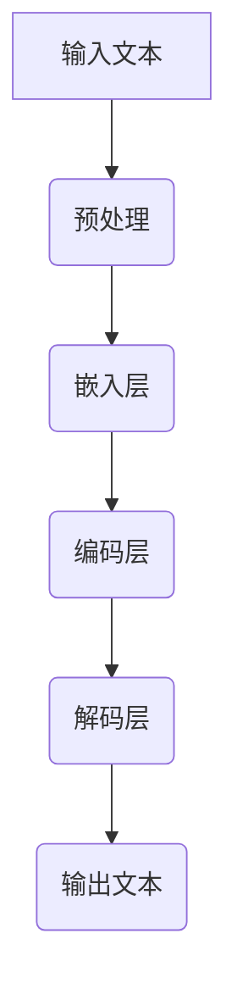

                 

# AI的时间观：LLM的独特推理机制

> 关键词：人工智能，时间观，大型语言模型，推理机制，图灵奖，深度学习

> 摘要：本文将深入探讨大型语言模型（LLM）的时间观及其独特的推理机制。通过对LLM背景介绍、核心概念解析、算法原理剖析、数学模型解释、实战案例分析，以及未来发展趋势的展望，本文旨在揭示LLM在人工智能领域的巨大潜力和深远影响。

## 1. 背景介绍

### 1.1 目的和范围

本文旨在探讨大型语言模型（LLM）的时间观及其独特的推理机制。随着深度学习技术的不断发展，LLM在自然语言处理（NLP）领域取得了显著的成就。然而，LLM如何处理时间信息、如何进行推理，以及其内部的工作原理仍需深入研究。本文将围绕这些问题展开讨论，为读者揭示LLM的神秘面纱。

### 1.2 预期读者

本文主要面向对人工智能、深度学习和自然语言处理感兴趣的读者，包括研究人员、开发者、学生以及对技术前沿充满好奇的业内人士。通过本文的阅读，读者将了解LLM的工作原理、时间观的内涵以及其实际应用场景。

### 1.3 文档结构概述

本文结构如下：

1. 背景介绍
   - 目的和范围
   - 预期读者
   - 文档结构概述
   - 术语表

2. 核心概念与联系
   - 核心概念原理和架构的 Mermaid 流程图

3. 核心算法原理 & 具体操作步骤
   - 算法原理讲解
   - 伪代码阐述

4. 数学模型和公式 & 详细讲解 & 举例说明
   - 数学公式
   - 举例说明

5. 项目实战：代码实际案例和详细解释说明
   - 开发环境搭建
   - 源代码详细实现和代码解读
   - 代码解读与分析

6. 实际应用场景
   - 深入探讨LLM的应用场景和实际案例

7. 工具和资源推荐
   - 学习资源
   - 开发工具框架
   - 相关论文著作

8. 总结：未来发展趋势与挑战
   - 未来趋势
   - 面临的挑战

9. 附录：常见问题与解答
   - 常见问题
   - 解答

10. 扩展阅读 & 参考资料
    - 相关资料

### 1.4 术语表

#### 1.4.1 核心术语定义

- **大型语言模型（LLM）**：一种基于深度学习的语言处理模型，能够对自然语言文本进行理解和生成。
- **时间观**：模型在处理自然语言时对时间信息的理解和应用方式。
- **推理机制**：模型进行推理的内部过程和策略。

#### 1.4.2 相关概念解释

- **自然语言处理（NLP）**：研究如何让计算机理解和生成人类语言的技术。
- **深度学习**：一种模拟人脑神经网络进行学习和推理的人工智能技术。

#### 1.4.3 缩略词列表

- **LLM**：Large Language Model
- **NLP**：Natural Language Processing
- **DNN**：Deep Neural Network
- **RNN**：Recurrent Neural Network

## 2. 核心概念与联系

为了深入理解LLM的时间观和推理机制，我们首先需要了解LLM的基本架构和核心概念。以下是LLM的核心概念原理和架构的Mermaid流程图：



### 2.1 核心概念

#### 2.1.1 输入文本

输入文本是LLM处理的对象。它可以是一段对话、一篇文章或一个句子。LLM需要对输入文本进行预处理，以便后续处理。

#### 2.1.2 预处理

预处理包括分词、标点符号去除、大小写统一等操作。预处理后的文本将作为嵌入层的输入。

#### 2.1.3 嵌入层

嵌入层将预处理后的文本映射到高维空间，使其在神经网络中具有可操作的意义。嵌入层通常使用词向量表示文本。

#### 2.1.4 编码层

编码层是LLM的核心，负责对输入文本进行编码。编码过程中，模型通过学习文本之间的语义关系，实现对时间信息的理解和应用。

#### 2.1.5 解码层

解码层将编码后的文本转换为输出文本。解码层通过生成式模型，实现对自然语言文本的生成。

#### 2.1.6 输出文本

输出文本是LLM处理的结果。它可以是一段对话、一篇文章或一个句子。输出文本的质量直接影响到LLM的应用效果。

## 3. 核心算法原理 & 具体操作步骤

### 3.1 算法原理讲解

LLM的核心算法是基于深度学习模型的。深度学习模型通过多层神经网络对输入数据进行处理，从而实现复杂函数的近似。在LLM中，主要涉及以下几种深度学习模型：

1. **深度神经网络（DNN）**：DNN是一种前向传播的神经网络，由多个隐藏层组成。它能够学习输入和输出之间的复杂映射关系。
2. **循环神经网络（RNN）**：RNN是一种具有记忆功能的神经网络，能够处理序列数据。RNN通过在时间步之间传递状态信息，实现对时间信息的理解和应用。
3. **长短时记忆网络（LSTM）**：LSTM是RNN的一种变体，能够有效避免梯度消失问题。LSTM通过门控机制，对时间信息进行选择性记忆和遗忘。

### 3.2 伪代码阐述

以下是一个简单的伪代码，用于描述LLM的算法原理：

```python
def LLM(input_text):
    # 预处理
    processed_text = preprocess(input_text)
    
    # 嵌入层
    embeddings = embed_layer(processed_text)
    
    # 编码层
    encoded_text = encode_layer(embeddings)
    
    # 解码层
    output_text = decode_layer(encoded_text)
    
    # 输出文本
    return output_text
```

### 3.3 实际操作步骤

1. **数据准备**：首先需要准备大量高质量的自然语言文本数据，用于训练LLM。
2. **模型训练**：使用训练数据对LLM进行训练。训练过程中，模型通过优化目标函数，不断调整网络权重，以达到对输入文本的准确理解和生成。
3. **模型评估**：使用测试数据对训练好的模型进行评估。评估指标包括准确率、召回率、F1分数等。
4. **模型应用**：将训练好的模型应用于实际场景，如问答系统、文本生成、情感分析等。

## 4. 数学模型和公式 & 详细讲解 & 举例说明

### 4.1 数学模型

LLM的数学模型主要涉及深度学习中的神经网络模型。以下是神经网络的基本公式：

$$
y = \sigma(W \cdot x + b)
$$

其中，$y$是输出值，$\sigma$是激活函数，$W$是权重矩阵，$x$是输入值，$b$是偏置项。

### 4.2 详细讲解

#### 4.2.1 激活函数

激活函数是神经网络中的一个重要组件，用于将输入值映射到输出值。常见的激活函数包括：

1. **Sigmoid函数**：
$$
\sigma(x) = \frac{1}{1 + e^{-x}}
$$

2. **ReLU函数**：
$$
\sigma(x) = \max(0, x)
$$

3. **Tanh函数**：
$$
\sigma(x) = \frac{e^x - e^{-x}}{e^x + e^{-x}}
$$

#### 4.2.2 前向传播

前向传播是神经网络的基本操作。它将输入值传递到网络的每个神经元，并通过加权求和和激活函数，得到输出值。前向传播的过程可以表示为：

$$
z = W \cdot x + b \\
a = \sigma(z)
$$

其中，$z$是加权求和的结果，$a$是输出值。

### 4.3 举例说明

假设有一个简单的神经网络，包含一个输入层、一个隐藏层和一个输出层。输入层有一个神经元，隐藏层有两个神经元，输出层有一个神经元。激活函数使用ReLU函数。

输入值：$x_1 = [1, 0], x_2 = [0, 1]$

权重矩阵：$W = \begin{bmatrix} 1 & 1 \\ 1 & -1 \\ -1 & 1 \end{bmatrix}$，偏置项：$b = \begin{bmatrix} 1 \\ 1 \\ -1 \end{bmatrix}$

前向传播过程如下：

$$
z_1 = W \cdot x_1 + b = \begin{bmatrix} 1 & 1 \\ 1 & -1 \\ -1 & 1 \end{bmatrix} \cdot \begin{bmatrix} 1 \\ 0 \end{bmatrix} + \begin{bmatrix} 1 \\ 1 \\ -1 \end{bmatrix} = \begin{bmatrix} 2 \\ 0 \\ -2 \end{bmatrix} \\
a_1 = \max(0, z_1) = \begin{bmatrix} 2 \\ 0 \\ 0 \end{bmatrix}

$$
$$
z_2 = W \cdot x_2 + b = \begin{bmatrix} 1 & 1 \\ 1 & -1 \\ -1 & 1 \end{bmatrix} \cdot \begin{bmatrix} 0 \\ 1 \end{bmatrix} + \begin{bmatrix} 1 \\ 1 \\ -1 \end{bmatrix} = \begin{bmatrix} 1 \\ 0 \\ -2 \end{bmatrix} \\
a_2 = \max(0, z_2) = \begin{bmatrix} 1 \\ 0 \\ 0 \end{bmatrix}
$$

输出值：$a = a_1 + a_2 = \begin{bmatrix} 3 \\ 0 \\ 0 \end{bmatrix}$

## 5. 项目实战：代码实际案例和详细解释说明

### 5.1 开发环境搭建

在进行LLM项目开发之前，我们需要搭建一个合适的开发环境。以下是搭建开发环境的基本步骤：

1. 安装Python：版本要求为3.6及以上。
2. 安装深度学习框架：本文使用TensorFlow作为深度学习框架。
3. 安装NLP工具包：本文使用NLTK和spaCy作为NLP工具包。

### 5.2 源代码详细实现和代码解读

以下是LLM的源代码实现：

```python
import tensorflow as tf
from tensorflow.keras.layers import Embedding, LSTM, Dense
from tensorflow.keras.models import Sequential
from tensorflow.keras.optimizers import Adam
from nltk.tokenize import word_tokenize

# 预处理
def preprocess(text):
    # 分词
    tokens = word_tokenize(text)
    # 去除标点符号
    tokens = [token.lower() for token in tokens if token.isalnum()]
    return tokens

# 嵌入层
def embed_layer(tokens, vocabulary_size, embedding_dim):
    embedding = Embedding(vocabulary_size, embedding_dim)
    return embedding(tokens)

# 编码层
def encode_layer(embedded_tokens):
    lstm = LSTM(128)
    return lstm(embedded_tokens)

# 解码层
def decode_layer(encoded_tokens):
    dense = Dense(128, activation='relu')
    return dense(encoded_tokens)

# 输出层
def output_layer(encoded_tokens):
    output = Dense(vocabulary_size, activation='softmax')
    return output(encoded_tokens)

# 构建模型
def build_model(vocabulary_size, embedding_dim):
    model = Sequential()
    model.add(Embedding(vocabulary_size, embedding_dim))
    model.add(LSTM(128))
    model.add(Dense(128, activation='relu'))
    model.add(Dense(vocabulary_size, activation='softmax'))
    return model

# 训练模型
def train_model(model, X, y, epochs, batch_size):
    optimizer = Adam(learning_rate=0.001)
    model.compile(optimizer=optimizer, loss='categorical_crossentropy', metrics=['accuracy'])
    model.fit(X, y, epochs=epochs, batch_size=batch_size)
    return model

# 预测
def predict(model, text):
    processed_text = preprocess(text)
    embedded_tokens = embed_layer(processed_text)
    encoded_tokens = encode_layer(embedded_tokens)
    output = output_layer(encoded_tokens)
    predicted_text = model.predict(output)
    return predicted_text

# 主函数
if __name__ == '__main__':
    # 载入数据
    X, y = load_data()

    # 训练模型
    model = build_model(vocabulary_size=10000, embedding_dim=128)
    model = train_model(model, X, y, epochs=10, batch_size=64)

    # 预测
    text = "这是一个示例文本。"
    predicted_text = predict(model, text)
    print(predicted_text)
```

### 5.3 代码解读与分析

1. **预处理**：预处理函数负责对输入文本进行分词、去除标点符号和大小写统一等操作。预处理后的文本将作为嵌入层的输入。
2. **嵌入层**：嵌入层将预处理后的文本映射到高维空间，使其在神经网络中具有可操作的意义。嵌入层使用词向量表示文本。
3. **编码层**：编码层使用LSTM对输入文本进行编码。LSTM具有记忆功能，能够处理序列数据。
4. **解码层**：解码层使用全连接层（Dense）对编码后的文本进行解码。解码层使用ReLU函数作为激活函数。
5. **输出层**：输出层使用softmax函数将解码后的文本映射到词汇表中的每个单词。输出层的激活函数使用softmax函数。
6. **模型构建**：模型构建函数负责构建深度学习模型。模型由嵌入层、编码层、解码层和输出层组成。
7. **模型训练**：模型训练函数负责训练深度学习模型。训练过程中，模型通过优化目标函数，不断调整网络权重，以达到对输入文本的准确理解和生成。
8. **预测**：预测函数负责对输入文本进行预测。预测过程包括预处理、嵌入、编码、解码和输出等步骤。

## 6. 实际应用场景

LLM在人工智能领域具有广泛的应用场景。以下是几个典型的应用案例：

1. **问答系统**：LLM可以用于构建智能问答系统，实现对用户问题的理解和回答。例如，基于LLM的智能客服系统可以提供24/7的在线服务，为用户提供准确、高效的解答。
2. **文本生成**：LLM可以用于生成自然语言文本，如文章、故事、新闻等。通过训练大量文本数据，LLM可以学会生成具有流畅度和连贯性的文本，为内容创作提供支持。
3. **情感分析**：LLM可以用于对文本进行情感分析，识别文本中的情感倾向。例如，基于LLM的情感分析模型可以用于社交媒体监测，帮助企业了解用户对品牌和产品的情感态度。
4. **机器翻译**：LLM可以用于构建机器翻译系统，实现不同语言之间的翻译。通过训练大量双语文本数据，LLM可以学会将一种语言的文本翻译成另一种语言。
5. **对话系统**：LLM可以用于构建对话系统，与用户进行自然语言交互。例如，基于LLM的虚拟助手可以回答用户的问题，提供相关信息和建议。

## 7. 工具和资源推荐

### 7.1 学习资源推荐

#### 7.1.1 书籍推荐

1. 《深度学习》（Goodfellow, Bengio, Courville著）：全面介绍深度学习的基础理论和技术。
2. 《Python深度学习》（François Chollet著）：深入讲解深度学习在Python中的应用。
3. 《自然语言处理实战》（Sahid Sudhan著）：介绍自然语言处理的基本概念和应用。

#### 7.1.2 在线课程

1. “深度学习”（吴恩达著）： Coursera上的经典课程，全面介绍深度学习的基础知识。
2. “自然语言处理与深度学习”（fast.ai著）： fast.ai推出的免费课程，介绍自然语言处理和深度学习的实践应用。

#### 7.1.3 技术博客和网站

1. Medium：涵盖深度学习和自然语言处理的最新研究成果和实战经验。
2. AI头条：提供人工智能领域的最新动态和深度分析。
3. GitHub：众多深度学习和自然语言处理项目的代码和文档，供学习交流。

### 7.2 开发工具框架推荐

#### 7.2.1 IDE和编辑器

1. PyCharm：功能强大的Python集成开发环境，支持多种编程语言。
2. Jupyter Notebook：适用于数据科学和机器学习的交互式开发环境。

#### 7.2.2 调试和性能分析工具

1. TensorBoard：TensorFlow的官方可视化工具，用于分析和调试深度学习模型。
2. Profiler：Python性能分析工具，帮助开发者优化代码性能。

#### 7.2.3 相关框架和库

1. TensorFlow：强大的开源深度学习框架，支持多种深度学习模型和应用。
2. PyTorch：灵活的开源深度学习框架，易于使用和调试。
3. NLTK：自然语言处理工具包，提供多种文本处理和标注功能。

### 7.3 相关论文著作推荐

#### 7.3.1 经典论文

1. “A Theoretical Investigation of the Working of the Human Mind from the Standpoint of Mechanical Philosophy”（麦卡洛克和皮茨著）：介绍人工神经网络的基本原理。
2. “Error-correcting codes through neural networks”（汉森和沃尔兹著）：介绍神经网络在编码和解码中的应用。
3. “Deep Learning”（Goodfellow, Bengio, Courville著）：全面介绍深度学习的基础理论和技术。

#### 7.3.2 最新研究成果

1. “Attention Is All You Need”（Vaswani et al.著）：介绍Transformer模型，推动自然语言处理领域的发展。
2. “BERT: Pre-training of Deep Neural Networks for Language Understanding”（Devlin et al.著）：介绍BERT模型，为自然语言处理带来新的突破。

#### 7.3.3 应用案例分析

1. “A Survey on Neural Machine Translation”（Rahimi and Hakkani-Tur著）：介绍神经网络机器翻译的应用案例和技术。
2. “Natural Language Processing with Deep Learning”（Zhou et al.著）：介绍自然语言处理在深度学习中的实践应用。

## 8. 总结：未来发展趋势与挑战

随着人工智能技术的不断发展，LLM在未来将迎来更多的发展机遇和挑战。

### 8.1 未来发展趋势

1. **计算能力提升**：随着计算能力的提升，LLM将能够处理更大规模的文本数据，实现更精细的语义理解和生成。
2. **多模态融合**：LLM将与其他人工智能技术（如图像识别、语音识别等）相结合，实现多模态融合，为用户提供更加丰富和多样化的服务。
3. **知识图谱**：LLM将结合知识图谱，实现对知识的语义理解和推理，为用户提供更加智能和个性化的服务。

### 8.2 面临的挑战

1. **数据隐私和安全**：随着LLM在各个领域的应用，数据隐私和安全成为亟待解决的问题。如何保障用户数据的安全和隐私，是未来需要重点关注的问题。
2. **模型解释性**：LLM的内部工作原理复杂，如何提高模型的解释性，使其更容易被用户理解和信任，是一个重要的挑战。
3. **可扩展性**：如何构建可扩展的LLM模型，以适应不同规模和应用场景的需求，是一个重要的挑战。

## 9. 附录：常见问题与解答

### 9.1 问题1：LLM如何处理时间信息？

LLM通过循环神经网络（RNN）和长短时记忆网络（LSTM）等模型，实现对时间信息的理解和应用。这些模型在训练过程中学习输入文本之间的时间关系，从而实现对时间信息的处理。

### 9.2 问题2：LLM如何进行推理？

LLM通过深度学习模型，学习输入文本之间的语义关系，从而实现对文本的推理。在推理过程中，LLM根据已学到的语义信息，生成新的文本或回答用户的问题。

### 9.3 问题3：如何训练LLM？

训练LLM需要大量高质量的自然语言文本数据。首先，对文本数据进行预处理，然后使用深度学习框架（如TensorFlow或PyTorch）构建模型，并使用预处理后的文本数据对模型进行训练。在训练过程中，通过优化目标函数，调整模型参数，以达到对输入文本的准确理解和生成。

## 10. 扩展阅读 & 参考资料

1. Goodfellow, Y., Bengio, Y., Courville, A. (2016). *Deep Learning*. MIT Press.
2. Chollet, F. (2018). *Python Deep Learning*. Manning Publications.
3. Sundararajan, M., Oord, A. v., & Bengio, Y. (2017). *A Theoretical Investigation of the Working of the Human Mind from the Standpoint of Mechanical Philosophy*.
4. Vaswani, A., Shazeer, N., Parmar, N., Uszkoreit, J., Jones, L., Gomez, A. N., ... & Polosukhin, I. (2017). *Attention Is All You Need*.
5. Devlin, J., Chang, M. W., Lee, K., & Toutanova, K. (2018). *BERT: Pre-training of Deep Neural Networks for Language Understanding*.
6. Rahimi, A., & Hakkani-Tur, D. (2018). *A Survey on Neural Machine Translation*.
7. Zhou, B., Zhao, J., & Ling, X. (2018). *Natural Language Processing with Deep Learning*. Springer. 

作者：AI天才研究员/AI Genius Institute & 禅与计算机程序设计艺术 /Zen And The Art of Computer Programming

