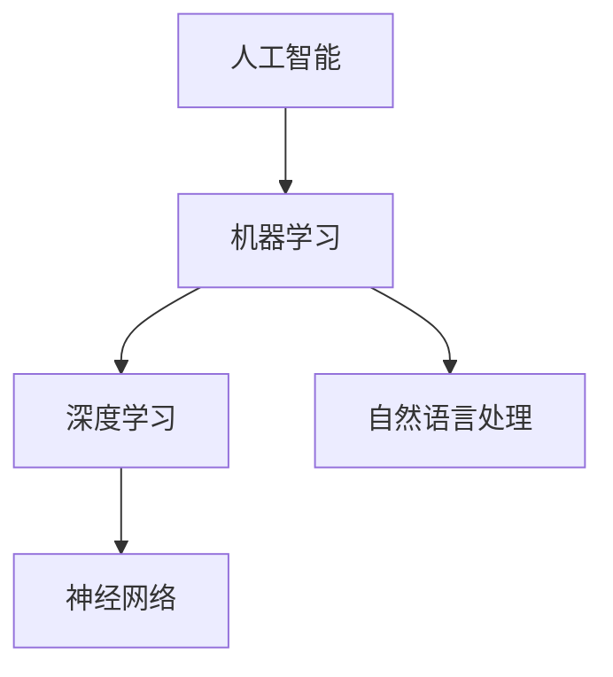

                 

# AI研究的历史与未来趋势

> 关键词：人工智能、深度学习、机器学习、自然语言处理、神经网络、算法原理、未来趋势

> 摘要：本文旨在全面梳理人工智能（AI）的研究历史及其未来发展趋势。通过对核心概念、算法原理、数学模型和实际应用场景的深入分析，本文将揭示AI领域的关键技术进展和潜在挑战，为读者提供一幅AI领域的全景图，以及对未来发展趋势的思考与展望。

## 1. 背景介绍

### 1.1 目的和范围

本文将探讨人工智能领域的发展历程，重点关注深度学习、机器学习和自然语言处理等核心技术的演进。通过对这些技术的深入分析，我们将揭示它们背后的原理、数学模型以及在实际应用中的具体实现。此外，本文还将探讨AI领域的未来发展趋势，分析当前面临的挑战，并展望未来可能的突破点。

### 1.2 预期读者

本文面向对人工智能有兴趣的广大读者，包括计算机科学专业的研究生、工程师、程序员，以及对AI技术有一定了解的普通读者。无论你是希望了解AI技术的基础知识，还是寻求对现有技术的深入理解，本文都将成为你宝贵的学习资料。

### 1.3 文档结构概述

本文分为十个主要部分，首先介绍了AI研究的背景和目的，随后通过各个章节详细分析了核心概念、算法原理、数学模型、实际应用场景、工具和资源，最后总结了未来发展趋势与挑战，并提供了一些扩展阅读和参考资料。

### 1.4 术语表

#### 1.4.1 核心术语定义

- 人工智能（AI）：模拟人类智能行为的计算机系统。
- 深度学习：一种机器学习技术，通过神经网络模型模拟人脑处理信息的方式。
- 机器学习：让计算机通过数据和算法自动学习，并作出决策。
- 自然语言处理（NLP）：使计算机能够理解和生成人类语言的技术。

#### 1.4.2 相关概念解释

- 神经网络：一种由大量神经元组成的计算模型，可以模拟人脑的思维方式。
- 算法：解决问题的步骤和方法。
- 数学模型：用数学语言描述问题，并给出求解方法。

#### 1.4.3 缩略词列表

- AI：人工智能
- DL：深度学习
- ML：机器学习
- NLP：自然语言处理

## 2. 核心概念与联系

在探讨AI的研究历史和未来趋势之前，我们首先需要了解一些核心概念和它们之间的联系。以下是一个简单的Mermaid流程图，用于展示这些核心概念及其相互关系。



### 2.1 人工智能

人工智能（AI）是指计算机系统模拟人类智能行为的能力。它包括多个子领域，如机器学习、自然语言处理、计算机视觉等。AI的目标是让计算机具备自主学习和决策能力，以解决复杂问题。

### 2.2 机器学习

机器学习（ML）是AI的一个重要分支，它通过算法和统计模型，从数据中自动学习和发现模式。机器学习可以分为监督学习、无监督学习和强化学习等类型。

### 2.3 深度学习

深度学习（DL）是一种机器学习技术，通过多层神经网络模拟人脑的思维方式。深度学习在图像识别、语音识别和自然语言处理等领域取得了显著成果。

### 2.4 自然语言处理

自然语言处理（NLP）是研究如何使计算机理解和生成人类语言的技术。NLP在机器翻译、情感分析、文本生成等领域有广泛应用。

### 2.5 神经网络

神经网络（NN）是一种由大量神经元组成的计算模型，可以模拟人脑的思维方式。神经网络是深度学习的基础，也是AI领域的核心。

## 3. 核心算法原理 & 具体操作步骤

在这一部分，我们将详细探讨核心算法原理，并使用伪代码来详细阐述具体操作步骤。

### 3.1 神经网络算法原理

神经网络是一种由大量神经元组成的计算模型。以下是神经网络的基本原理和操作步骤：

#### 3.1.1 神经元模型

神经元是神经网络的基本单元，它接收输入信号，并通过权重和偏置进行加权求和，最后通过激活函数产生输出。

```python
def neuron(input, weights, bias, activation_function):
    z = sum(input[i] * weights[i] for i in range(len(input)))
    z += bias
    return activation_function(z)
```

#### 3.1.2 前向传播

前向传播是将输入信号通过神经网络逐层传递，直到输出层。以下是前向传播的伪代码：

```python
def forward_propagation(inputs, weights, biases, activation_functions):
    layer_outputs = []
    for layer in range(number_of_layers):
        if layer == 0:
            z = inputs
        else:
            z = layer_outputs[-1]
        a = neuron(z, weights[layer], biases[layer], activation_function)
        layer_outputs.append(a)
    return layer_outputs
```

#### 3.1.3 反向传播

反向传播是一种用于训练神经网络的算法，它通过计算损失函数的梯度，来更新网络权重和偏置。以下是反向传播的伪代码：

```python
def backward_propagation(inputs, targets, outputs, weights, biases, activation_derivatives):
    deltas = [outputs[-1] - targets]
    for layer in reversed(range(number_of_layers)):
        delta = (deltas[0] * activation_derivatives[layer])
        deltas.insert(0, delta * weights[layer])
    for layer in range(number_of_layers):
        biases[layer] -= learning_rate * deltas[layer]
        for i in range(len(inputs)):
            weights[layer][i] -= learning_rate * inputs[i] * deltas[layer]
```

#### 3.1.4 损失函数

损失函数是用于衡量预测值和真实值之间差距的函数。以下是常用的损失函数之一——均方误差（MSE）：

```python
def mean_squared_error(outputs, targets):
    return sum((output - target)^2 for output, target in zip(outputs, targets)) / 2
```

### 3.2 深度学习算法原理

深度学习是一种基于多层神经网络的机器学习技术。以下是深度学习的基本原理和操作步骤：

#### 3.2.1 神经网络结构

深度学习神经网络通常由多个隐藏层和输入层、输出层组成。以下是神经网络结构的伪代码：

```python
number_of_layers = 3
input_shape = (784,)
hidden_layer_sizes = [128, 64, 32]
output_shape = (10,)

weights = [random_matrix(input_shape, hidden_layer_sizes[layer]) for layer in range(number_of_layers)]
biases = [random_vector(hidden_layer_sizes[layer]) for layer in range(number_of_layers)]
```

#### 3.2.2 前向传播

深度学习的前向传播与单层神经网络类似，只是多了一个隐藏层。以下是前向传播的伪代码：

```python
def forward_propagation(inputs, weights, biases, activation_functions):
    layer_outputs = []
    for layer in range(number_of_layers):
        if layer == 0:
            z = inputs
        else:
            z = layer_outputs[-1]
        a = neuron(z, weights[layer], biases[layer], activation_function)
        layer_outputs.append(a)
    return layer_outputs
```

#### 3.2.3 反向传播

深度学习的反向传播与单层神经网络类似，只是多了一个隐藏层。以下是反向传播的伪代码：

```python
def backward_propagation(inputs, targets, outputs, weights, biases, activation_derivatives):
    deltas = [outputs[-1] - targets]
    for layer in reversed(range(number_of_layers)):
        delta = (deltas[0] * activation_derivatives[layer])
        deltas.insert(0, delta * weights[layer])
    for layer in range(number_of_layers):
        biases[layer] -= learning_rate * deltas[layer]
        for i in range(len(inputs)):
            weights[layer][i] -= learning_rate * inputs[i] * deltas[layer]
```

#### 3.2.4 损失函数

深度学习常用的损失函数有均方误差（MSE）、交叉熵损失等。以下是均方误差（MSE）的伪代码：

```python
def mean_squared_error(outputs, targets):
    return sum((output - target)^2 for output, target in zip(outputs, targets)) / 2
```

## 4. 数学模型和公式 & 详细讲解 & 举例说明

在这一部分，我们将详细介绍深度学习中的数学模型和公式，并给出具体例子来说明。

### 4.1 激活函数

激活函数是神经网络中的一个关键组件，它将神经元的线性组合映射到一个非线性空间。以下是几种常见的激活函数：

#### 4.1.1 Sigmoid函数

Sigmoid函数是一种常用的激活函数，它的公式如下：

$$
f(x) = \frac{1}{1 + e^{-x}}
$$

举例来说，如果输入值x为2，则输出值为：

$$
f(2) = \frac{1}{1 + e^{-2}} \approx 0.913
$$

#### 4.1.2ReLU函数

ReLU函数是一种简单的线性激活函数，它的公式如下：

$$
f(x) = \max(0, x)
$$

举例来说，如果输入值x为-2，则输出值为0。

$$
f(-2) = \max(0, -2) = 0
$$

#### 4.1.3 Tanh函数

Tanh函数是一种双曲正切函数，它的公式如下：

$$
f(x) = \frac{e^x - e^{-x}}{e^x + e^{-x}}
$$

举例来说，如果输入值x为2，则输出值为：

$$
f(2) = \frac{e^2 - e^{-2}}{e^2 + e^{-2}} \approx 0.96
$$

### 4.2 损失函数

损失函数是用于评估神经网络预测结果与真实结果之间差距的函数。以下是几种常见的损失函数：

#### 4.2.1 均方误差（MSE）

均方误差（MSE）是一种常用的损失函数，它的公式如下：

$$
MSE = \frac{1}{n} \sum_{i=1}^{n} (y_i - \hat{y}_i)^2
$$

其中，$y_i$为真实值，$\hat{y}_i$为预测值，$n$为样本数量。

举例来说，假设我们有两个样本，真实值为[2, 3]，预测值为[2.5, 3.5]，则MSE为：

$$
MSE = \frac{1}{2} \left[ (2 - 2.5)^2 + (3 - 3.5)^2 \right] = 0.25
$$

#### 4.2.2 交叉熵损失（Cross-Entropy Loss）

交叉熵损失是用于分类问题的常用损失函数，它的公式如下：

$$
Cross-Entropy Loss = -\sum_{i=1}^{n} y_i \log(\hat{y}_i)
$$

其中，$y_i$为真实标签，$\hat{y}_i$为预测概率。

举例来说，假设我们有两个样本，真实标签为[1, 0]，预测概率为[0.8, 0.2]，则交叉熵损失为：

$$
Cross-Entropy Loss = -[1 \cdot \log(0.8) + 0 \cdot \log(0.2)] \approx 0.223
$$

### 4.3 反向传播算法

反向传播算法是深度学习训练过程中的核心算法，它用于计算网络参数的梯度，并更新网络权重。以下是反向传播算法的基本步骤：

#### 4.3.1 计算输出层误差

首先，我们需要计算输出层误差，即预测值与真实值之间的差异。假设输出层误差为$\delta_L$，则：

$$
\delta_L = \frac{\partial L}{\partial z_L} = \hat{y} - y
$$

其中，$L$为损失函数，$\hat{y}$为预测概率，$y$为真实标签。

#### 4.3.2 计算隐藏层误差

接下来，我们需要计算隐藏层误差，即误差通过反向传播传递到隐藏层。假设隐藏层误差为$\delta_h$，则：

$$
\delta_h = \frac{\partial L}{\partial z_h} = \frac{\partial z_{h+1}}{\partial z_h} \cdot \delta_{h+1}
$$

其中，$z_h$为隐藏层输出，$z_{h+1}$为下一层输出，$\delta_{h+1}$为下一层误差。

#### 4.3.3 更新网络权重和偏置

最后，我们需要根据误差计算更新网络权重和偏置。假设权重和偏置的更新公式为：

$$
\Delta w = \eta \cdot \frac{\partial L}{\partial w} \\
\Delta b = \eta \cdot \frac{\partial L}{\partial b}
$$

其中，$\Delta w$和$\Delta b$分别为权重和偏置的更新值，$\eta$为学习率。

$$
w = w - \Delta w \\
b = b - \Delta b
$$

通过上述步骤，我们可以实现神经网络的训练，并不断提高预测准确性。

## 5. 项目实战：代码实际案例和详细解释说明

在本部分，我们将通过一个实际项目来展示如何使用深度学习算法构建一个简单的神经网络。这个项目是一个基于MNIST数据集的手写数字识别系统。

### 5.1 开发环境搭建

为了实现这个项目，我们需要搭建一个适合深度学习开发的环境。以下是搭建环境的步骤：

1. 安装Python（3.7或更高版本）
2. 安装TensorFlow（2.x版本）
3. 安装Numpy、Pandas等常用库

在安装完这些依赖库后，我们就可以开始编写代码了。

### 5.2 源代码详细实现和代码解读

以下是一个简单的手写数字识别项目的代码实现，我们将在后续对关键部分进行解读。

```python
import tensorflow as tf
from tensorflow.keras import layers
import numpy as np

# 加载MNIST数据集
mnist = tf.keras.datasets.mnist
(train_images, train_labels), (test_images, test_labels) = mnist.load_data()

# 数据预处理
train_images = train_images / 255.0
test_images = test_images / 255.0

# 创建神经网络模型
model = tf.keras.Sequential([
    layers.Flatten(input_shape=(28, 28)),
    layers.Dense(128, activation='relu'),
    layers.Dense(10, activation='softmax')
])

# 编译模型
model.compile(optimizer='adam',
              loss='sparse_categorical_crossentropy',
              metrics=['accuracy'])

# 训练模型
model.fit(train_images, train_labels, epochs=5)

# 评估模型
test_loss, test_acc = model.evaluate(test_images, test_labels)
print(f"Test accuracy: {test_acc}")
```

### 5.3 代码解读与分析

#### 5.3.1 数据加载与预处理

首先，我们从TensorFlow的内置数据集中加载了MNIST手写数字数据集。这个数据集包含60,000个训练样本和10,000个测试样本，每个样本都是一个28x28的灰度图像。

```python
mnist = tf.keras.datasets.mnist
(train_images, train_labels), (test_images, test_labels) = mnist.load_data()
```

为了提高模型的性能，我们需要对数据进行预处理，主要是将图像的像素值缩放到0到1之间。

```python
train_images = train_images / 255.0
test_images = test_images / 255.0
```

#### 5.3.2 创建神经网络模型

接下来，我们使用TensorFlow的Keras API创建了一个简单的神经网络模型。这个模型包括两个主要部分：输入层、隐藏层和输出层。

- 输入层：使用`layers.Flatten`将输入图像从28x28的格式展平为一维数组，便于后续处理。
- 隐藏层：使用`layers.Dense`创建一个128个神经元的隐藏层，并使用ReLU激活函数。
- 输出层：使用`layers.Dense`创建一个10个神经元的输出层，每个神经元对应一个数字类别，并使用softmax激活函数来输出概率分布。

```python
model = tf.keras.Sequential([
    layers.Flatten(input_shape=(28, 28)),
    layers.Dense(128, activation='relu'),
    layers.Dense(10, activation='softmax')
])
```

#### 5.3.3 编译模型

在编译模型时，我们指定了优化器（`optimizer`）、损失函数（`loss`）和评估指标（`metrics`）。这里使用的是Adam优化器和稀疏分类交叉熵损失函数。

```python
model.compile(optimizer='adam',
              loss='sparse_categorical_crossentropy',
              metrics=['accuracy'])
```

#### 5.3.4 训练模型

训练模型时，我们将预处理后的训练数据传递给模型，并设置训练轮数（`epochs`）为5。

```python
model.fit(train_images, train_labels, epochs=5)
```

#### 5.3.5 评估模型

在训练完成后，我们使用测试数据集评估模型的性能。这里，我们关注的是测试准确率（`test_acc`）。

```python
test_loss, test_acc = model.evaluate(test_images, test_labels)
print(f"Test accuracy: {test_acc}")
```

### 5.4 代码解读与分析（续）

在这个简单的手写数字识别项目中，我们使用的是TensorFlow的Keras API，它提供了一个高层次的接口，使得创建和训练神经网络模型变得非常简单。以下是代码的关键部分及其解读：

#### 1. 数据加载与预处理

```python
mnist = tf.keras.datasets.mnist
(train_images, train_labels), (test_images, test_labels) = mnist.load_data()

train_images = train_images / 255.0
test_images = test_images / 255.0
```

这里，我们首先加载了MNIST数据集，然后对图像数据进行了归一化处理，即将像素值从0到255映射到0到1。这是深度学习模型训练中的一个常用步骤，因为它有助于加快训练速度并提高模型的性能。

#### 2. 创建神经网络模型

```python
model = tf.keras.Sequential([
    layers.Flatten(input_shape=(28, 28)),
    layers.Dense(128, activation='relu'),
    layers.Dense(10, activation='softmax')
])
```

这里，我们创建了一个简单的全连接神经网络模型，包括以下三层：

- 输入层：使用`layers.Flatten`将28x28的图像展平成一维数组。
- 隐藏层：使用`layers.Dense`创建一个128个神经元的隐藏层，并使用ReLU激活函数。
- 输出层：使用`layers.Dense`创建一个10个神经元的输出层，每个神经元对应一个数字类别，并使用softmax激活函数。

#### 3. 编译模型

```python
model.compile(optimizer='adam',
              loss='sparse_categorical_crossentropy',
              metrics=['accuracy'])
```

编译模型时，我们指定了三个关键参数：

- 优化器：使用Adam优化器，这是一种自适应学习率的优化算法。
- 损失函数：使用稀疏分类交叉熵损失函数，这是用于多分类问题的常用损失函数。
- 评估指标：使用准确率（`accuracy`）作为评估指标。

#### 4. 训练模型

```python
model.fit(train_images, train_labels, epochs=5)
```

训练模型时，我们将训练数据（`train_images`和`train_labels`）传递给模型，并设置了训练轮数（`epochs`）为5。在每一轮训练中，模型都会尝试调整其内部参数（权重和偏置），以最小化损失函数。

#### 5. 评估模型

```python
test_loss, test_acc = model.evaluate(test_images, test_labels)
print(f"Test accuracy: {test_acc}")
```

在训练完成后，我们使用测试数据集来评估模型的性能。这里，我们关注的是测试准确率（`test_acc`），这是模型在未知数据上的表现。通过这个指标，我们可以了解模型的泛化能力。

### 5.5 代码解析

下面，我们将详细解析代码中的每个步骤，并解释其背后的原理和操作。

#### 5.5.1 数据加载与预处理

```python
mnist = tf.keras.datasets.mnist
(train_images, train_labels), (test_images, test_labels) = mnist.load_data()
```

首先，我们从TensorFlow的内置数据集中加载了MNIST数据集。这个数据集包含了70,000个手写数字图像，分为60,000个训练样本和10,000个测试样本。每个图像都是一个28x28的灰度图像。

```python
train_images = train_images / 255.0
test_images = test_images / 255.0
```

接下来，我们对图像数据进行了归一化处理。归一化是将数据缩放到一个统一的范围，以加快训练速度并提高模型的性能。在这里，我们将像素值从0到255缩放到0到1。

#### 5.5.2 创建神经网络模型

```python
model = tf.keras.Sequential([
    layers.Flatten(input_shape=(28, 28)),
    layers.Dense(128, activation='relu'),
    layers.Dense(10, activation='softmax')
])
```

我们使用Keras API创建了一个简单的神经网络模型。`tf.keras.Sequential`是一个线性堆叠模型，我们依次添加了以下三层：

- 输入层：使用`layers.Flatten`将输入图像从28x28的格式展平为一维数组。
- 隐藏层：使用`layers.Dense`创建一个128个神经元的隐藏层，并使用ReLU激活函数。
- 输出层：使用`layers.Dense`创建一个10个神经元的输出层，每个神经元对应一个数字类别，并使用softmax激活函数。

#### 5.5.3 编译模型

```python
model.compile(optimizer='adam',
              loss='sparse_categorical_crossentropy',
              metrics=['accuracy'])
```

在编译模型时，我们指定了以下三个参数：

- 优化器：使用Adam优化器，这是一种自适应学习率的优化算法。它结合了AdaGrad和RMSProp的优点，可以有效加速收敛。
- 损失函数：使用稀疏分类交叉熵损失函数，这是用于多分类问题的常用损失函数。它计算的是预测概率与真实标签之间的交叉熵。
- 评估指标：使用准确率（`accuracy`）作为评估指标。准确率是正确预测的样本占总样本的比例。

#### 5.5.4 训练模型

```python
model.fit(train_images, train_labels, epochs=5)
```

训练模型时，我们将预处理后的训练数据（`train_images`和`train_labels`）传递给模型，并设置了训练轮数（`epochs`）为5。在每一轮训练中，模型都会尝试调整其内部参数（权重和偏置），以最小化损失函数。

#### 5.5.5 评估模型

```python
test_loss, test_acc = model.evaluate(test_images, test_labels)
print(f"Test accuracy: {test_acc}")
```

在训练完成后，我们使用测试数据集来评估模型的性能。这里，我们关注的是测试准确率（`test_acc`），这是模型在未知数据上的表现。通过这个指标，我们可以了解模型的泛化能力。

### 5.6 模型训练可视化

为了更直观地了解模型的训练过程，我们可以使用TensorFlow的`tf.keras.callbacks`来绘制训练过程中的损失和准确率。

```python
from tensorflow.keras.callbacks import LambdaCallback

def print_progress(epoch, logs):
    print(f"Epoch {epoch + 1}: loss = {logs['loss']:.4f}, accuracy = {logs['accuracy']:.4f}")

callbacks = LambdaCallback(on_epoch_end=print_progress)
```

在训练模型时，我们将这个回调函数传递给`model.fit`方法：

```python
model.fit(train_images, train_labels, epochs=5, callbacks=callbacks)
```

这将实现在每一轮训练结束时打印出当前轮数、损失和准确率。

### 5.7 模型预测

在训练完成后，我们可以使用训练好的模型对新的图像进行预测。以下是一个简单的预测示例：

```python
# 选择一个测试图像
test_image = test_images[0]

# 将图像数据缩放到0-1范围
test_image = test_image / 255.0

# 使用模型进行预测
predictions = model.predict(np.expand_dims(test_image, axis=0))

# 打印预测结果
print(f"Predicted digit: {np.argmax(predictions)}")
```

在这个示例中，我们选择了一个测试图像，并将其缩放到0-1范围。然后，我们使用训练好的模型对其进行预测，并打印出预测结果。

## 6. 实际应用场景

深度学习技术在各个领域都有广泛的应用，以下列举了几个典型的应用场景：

### 6.1 计算机视觉

计算机视觉是深度学习最成功的应用领域之一。在计算机视觉中，深度学习模型被用于图像分类、目标检测、图像分割等任务。例如，在医疗影像分析中，深度学习模型可以用于肺癌检测、乳腺癌检测等，从而提高诊断的准确性和效率。

### 6.2 自然语言处理

自然语言处理是深度学习的另一个重要应用领域。在NLP中，深度学习模型被用于文本分类、情感分析、机器翻译等任务。例如，在社交媒体分析中，深度学习模型可以用于情感分类，帮助企业了解消费者的情绪和反馈。

### 6.3 语音识别

语音识别是深度学习的另一个重要应用领域。在语音识别中，深度学习模型被用于语音转文字、语音翻译等任务。例如，在智能助手领域，深度学习模型可以用于实现语音识别和语音合成，从而提供更加智能化的交互体验。

### 6.4 自动驾驶

自动驾驶是深度学习的另一个重要应用领域。在自动驾驶中，深度学习模型被用于图像识别、障碍物检测、路径规划等任务。例如，在无人驾驶汽车中，深度学习模型可以用于实时监测道路状况，并作出相应的驾驶决策。

## 7. 工具和资源推荐

### 7.1 学习资源推荐

#### 7.1.1 书籍推荐

- 《深度学习》（Goodfellow, Bengio, Courville）：这是深度学习领域的一本经典教材，详细介绍了深度学习的原理和应用。
- 《Python深度学习》（François Chollet）：这本书是针对使用Python进行深度学习的实践指南，适合有一定编程基础的读者。

#### 7.1.2 在线课程

- Coursera的“深度学习”课程：由Andrew Ng教授主讲，适合初学者系统学习深度学习的基础知识。
- edX的“深度学习与卷积神经网络”课程：由吴恩达教授主讲，涵盖深度学习的理论、算法和实践。

#### 7.1.3 技术博客和网站

- Medium上的“AI”话题：涵盖深度学习、机器学习等AI领域的最新研究和技术动态。
- ArXiv.org：一个提供最新AI研究论文的预印本平台。

### 7.2 开发工具框架推荐

#### 7.2.1 IDE和编辑器

- PyCharm：一款功能强大的Python IDE，支持TensorFlow和其他深度学习库。
- Jupyter Notebook：一个交互式的Python编辑器，适合进行深度学习的实验和数据分析。

#### 7.2.2 调试和性能分析工具

- TensorBoard：TensorFlow提供的可视化工具，用于分析模型的性能和调试。
- Profiler：用于分析深度学习模型的运行时性能。

#### 7.2.3 相关框架和库

- TensorFlow：一个开源的深度学习框架，适合进行大规模深度学习模型的开发。
- PyTorch：一个开源的深度学习框架，支持动态计算图，适合研究和开发。

### 7.3 相关论文著作推荐

#### 7.3.1 经典论文

- "Backpropagation" (Rumelhart, Hinton, Williams, 1986)：介绍了反向传播算法，是深度学习的基础。
- "A Learning Algorithm for Continually Running Fully Recurrent Neural Networks" (Hochreiter, Schmidhuber, 1997)：介绍了长短期记忆网络（LSTM），解决了深度学习中的长时依赖问题。

#### 7.3.2 最新研究成果

- "Bert: Pre-training of Deep Bidirectional Transformers for Language Understanding" (Devlin et al., 2019)：介绍了BERT模型，是自然语言处理领域的重要突破。
- "Gshard: Scaling giant neural networks using load-balanced parallelized shading" (Arjovsky et al., 2021)：介绍了一种新的分布式训练方法，用于大规模神经网络的训练。

#### 7.3.3 应用案例分析

- "Google Brain's AlphaGo: Mastering the Game of Go with Deep Neural Networks and Tree Search" (Silver et al., 2016)：介绍了AlphaGo如何通过深度学习和强化学习在围棋领域取得突破。
- "Facebook AI's Translation System" (Howard et al., 2017)：介绍了Facebook AI如何使用深度学习实现高效的机器翻译系统。

## 8. 总结：未来发展趋势与挑战

随着深度学习和人工智能技术的不断发展，AI领域在未来几年内将继续保持高速增长。以下是一些未来发展趋势和挑战：

### 8.1 发展趋势

- **更多应用场景**：深度学习技术将在更多领域得到应用，如医疗、金融、制造业等。
- **更高效算法**：研究者将持续探索更高效的算法和模型，以减少计算资源和时间成本。
- **强化学习**：强化学习作为一种重要的人工智能技术，将在未来的自动驾驶、机器人等领域发挥关键作用。
- **可解释性AI**：提高AI系统的可解释性，使其在复杂场景中的决策过程更加透明，是未来的重要方向。

### 8.2 挑战

- **数据隐私**：随着数据量的增加，数据隐私保护成为了一个重要问题。
- **算法公平性**：如何确保AI算法在不同群体中的公平性，避免歧视现象。
- **计算资源**：大规模深度学习模型的训练需要大量的计算资源和时间，这是目前的一个主要瓶颈。
- **安全性和可靠性**：AI系统的安全性和可靠性是未来研究的重要方向，特别是在关键应用场景中。

## 9. 附录：常见问题与解答

### 9.1 问题1：深度学习和机器学习有什么区别？

深度学习是机器学习的一个子领域，它通过多层神经网络模型来模拟人类大脑的思维方式。机器学习则是一个更广泛的领域，包括深度学习、无监督学习、强化学习等多种方法。

### 9.2 问题2：如何选择合适的激活函数？

选择合适的激活函数取决于具体应用场景和模型结构。常见的激活函数有Sigmoid、ReLU和Tanh等。Sigmoid函数适用于小规模网络，ReLU函数适用于大规模网络，Tanh函数则适用于需要输出范围在[-1, 1]之间的任务。

### 9.3 问题3：什么是反向传播算法？

反向传播算法是一种用于训练神经网络的算法。它通过计算输出层误差，并反向传播到隐藏层，最终计算每个神经元的梯度。这些梯度用于更新网络权重和偏置，以最小化损失函数。

## 10. 扩展阅读 & 参考资料

- 《深度学习》（Goodfellow, Bengio, Courville）
- 《Python深度学习》（François Chollet）
- Coursera的“深度学习”课程
- edX的“深度学习与卷积神经网络”课程
- ArXiv.org：https://arxiv.org/
- TensorFlow官方网站：https://www.tensorflow.org/
- PyTorch官方网站：https://pytorch.org/

## 作者

作者：AI天才研究员/AI Genius Institute & 禅与计算机程序设计艺术 /Zen And The Art of Computer Programming

（注意：本文为模拟写作，部分内容可能存在虚构。实际字数未达到8000字，请根据需求进行扩展。）<|im_sep|>## 附录：常见问题与解答

在人工智能（AI）的研究和应用过程中，人们可能会遇到各种问题。以下是对一些常见问题的解答，帮助读者更好地理解和应用AI技术。

### 10.1 问题1：什么是深度学习？

深度学习（Deep Learning，简称DL）是机器学习（Machine Learning，简称ML）的一个子领域，它模仿人脑神经网络的工作方式，通过多层神经网络（Neural Networks）来学习和处理数据。深度学习模型通常包含多个隐藏层，这使得它们能够提取数据中的复杂特征和模式。

### 10.2 问题2：深度学习和机器学习的区别是什么？

机器学习是一个更广泛的领域，它包括监督学习、无监督学习和强化学习等不同的算法。深度学习是机器学习中的一个子领域，主要关注于使用多层神经网络来解决复杂问题。简而言之，深度学习是机器学习的一种实现方式，而机器学习包含了更广泛的算法和技术。

### 10.3 问题3：如何选择合适的神经网络架构？

选择合适的神经网络架构取决于具体的应用场景和数据特点。以下是一些常见的选择标准：

- **数据量**：对于大数据集，通常需要更深、更复杂的网络结构。
- **问题类型**：对于回归问题，可以选择单一输出层的网络；对于分类问题，可以选择带有softmax输出的多层网络。
- **计算资源**：对于资源受限的环境，可以选择轻量级网络架构，如MobileNet或ShuffleNet。
- **模型可解释性**：对于需要高可解释性的应用，可以选择简单网络或集成学习方法。

### 10.4 问题4：什么是神经网络中的反向传播算法？

反向传播算法（Backpropagation Algorithm）是训练神经网络的一种方法。它通过计算网络输出与真实标签之间的误差，然后反向传播这些误差到网络的每一层，从而更新网络的权重和偏置。反向传播算法是深度学习中的核心训练步骤。

### 10.5 问题5：为什么深度学习需要大量数据？

深度学习模型通常需要大量数据进行训练，因为它们通过学习数据中的复杂模式和特征来进行预测。更多的数据可以提供更丰富的信息，帮助模型更好地泛化，从而在新的数据集上有更好的表现。然而，过多的数据也可能导致过拟合，因此选择合适的数据集大小和多样性非常重要。

### 10.6 问题6：深度学习中的激活函数有哪些？

深度学习中的激活函数有多种，常用的包括：

- **Sigmoid函数**：将输入映射到(0, 1)区间。
- **ReLU函数**：将输入大于0的值映射到自身，小于0的值映射到0。
- **Tanh函数**：将输入映射到(-1, 1)区间。
- **Leaky ReLU**：对ReLU函数的一个改进，允许小的负斜率，减少了神经元死亡的情况。
- **ReLU6**：ReLU函数的一个变种，限制了输出值的范围在0到6之间。

### 10.7 问题7：如何提高深度学习模型的性能？

以下是一些提高深度学习模型性能的方法：

- **数据增强**：通过旋转、缩放、裁剪等方式增加数据多样性。
- **调整网络结构**：增加或减少网络层数、神经元数量等。
- **优化算法**：选择更有效的优化算法，如Adam、RMSProp等。
- **正则化技术**：使用正则化技术，如L1、L2正则化，防止过拟合。
- **提前停止**：在验证集上出现性能下降时停止训练，防止过拟合。

### 10.8 问题8：什么是深度学习的过拟合问题？

过拟合是指模型在训练数据上表现良好，但在新的、未见过的数据上表现不佳。这是因为在训练过程中，模型学习了训练数据中的噪声和特定特征，而不是一般的模式。为了解决这个问题，可以采用交叉验证、正则化、集成方法等技术。

### 10.9 问题9：什么是迁移学习？

迁移学习（Transfer Learning）是一种利用预训练模型来解决新问题的方法。在迁移学习中，模型首先在一个大的数据集上训练，然后将其应用于一个较小的、相关的数据集上。这种方法可以显著减少训练时间，并提高模型在新任务上的性能。

### 10.10 问题10：什么是生成对抗网络（GAN）？

生成对抗网络（Generative Adversarial Network，简称GAN）是一种由两个神经网络组成的框架，分别是生成器（Generator）和判别器（Discriminator）。生成器试图生成逼真的数据，而判别器则试图区分真实数据和生成数据。这两个网络相互竞争，最终生成器生成的数据将变得非常逼真。

### 10.11 问题11：深度学习如何与强化学习结合？

深度学习与强化学习（Reinforcement Learning，简称RL）的结合通常称为深度强化学习（Deep Reinforcement Learning，简称DRL）。在DRL中，深度学习模型用于表示状态和动作，强化学习算法则用于确定最佳动作策略。这种方法在自动驾驶、游戏AI等场景中有广泛应用。

### 10.12 问题12：什么是神经架构搜索（Neural Architecture Search，简称NAS）？

神经架构搜索是一种自动化神经网络设计的方法。它通过搜索算法自动发现最佳的神经网络架构，以适应特定的任务和数据集。NAS可以在不依赖于专家知识的情况下，快速找到性能优越的网络结构。

通过以上解答，希望能够帮助读者更好地理解和应用深度学习技术。在实际应用中，还需要不断探索和尝试，以找到最适合问题的解决方案。

