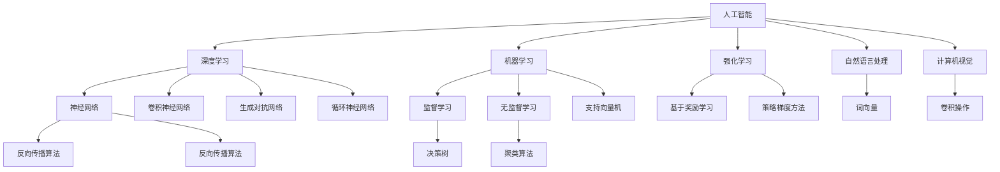

                 

# AI研究的最新进展与趋势

> **关键词：** 人工智能、深度学习、神经网络、机器学习、强化学习、自然语言处理、计算机视觉、AI 应用、技术趋势、前沿研究。

> **摘要：** 本文将深入探讨人工智能（AI）领域的最新研究进展与趋势。通过详细解析核心概念、算法原理、数学模型以及实际应用场景，我们旨在为读者提供一幅全面、清晰、深入的AI发展蓝图。文章还将推荐相关学习资源和开发工具，以帮助读者进一步探索这一激动人心的技术领域。

## 1. 背景介绍

### 1.1 目的和范围

本文的目的是介绍人工智能（AI）领域的最新研究进展与趋势，旨在为科研人员、工程师以及对此领域感兴趣的读者提供有价值的参考。我们将重点关注以下几个核心方面：

1. **核心概念与联系**：介绍AI的基础概念、原理和架构。
2. **核心算法原理**：深入讲解主要的AI算法，包括深度学习、机器学习和强化学习等。
3. **数学模型与公式**：阐述AI研究中关键的数学模型和公式，并进行举例说明。
4. **项目实战**：通过具体案例展示AI算法在实际项目中的应用。
5. **实际应用场景**：探讨AI在不同领域的应用案例。
6. **工具和资源推荐**：推荐有助于学习AI的相关工具和资源。
7. **未来发展趋势与挑战**：预测AI领域未来可能的发展方向和面临的挑战。

### 1.2 预期读者

本文预期读者包括：

1. **AI研究者和工程师**：希望了解AI领域的前沿动态和研究趋势。
2. **计算机科学学生和教师**：需要教学或学习AI相关知识。
3. **技术爱好者**：对AI技术有浓厚兴趣，希望深入了解其原理和应用。

### 1.3 文档结构概述

本文结构如下：

1. **背景介绍**：介绍本文的目的、范围和预期读者，概述文档结构。
2. **核心概念与联系**：通过Mermaid流程图展示核心概念和联系。
3. **核心算法原理 & 具体操作步骤**：详细讲解核心算法原理和操作步骤。
4. **数学模型和公式 & 详细讲解 & 举例说明**：阐述关键数学模型和公式，并举例说明。
5. **项目实战：代码实际案例和详细解释说明**：展示AI算法的实际应用。
6. **实际应用场景**：探讨AI在不同领域的应用案例。
7. **工具和资源推荐**：推荐学习AI的相关工具和资源。
8. **总结：未来发展趋势与挑战**：预测AI领域的发展方向和挑战。
9. **附录：常见问题与解答**：解答读者可能遇到的常见问题。
10. **扩展阅读 & 参考资料**：提供进一步学习的资源和参考文献。

### 1.4 术语表

#### 1.4.1 核心术语定义

- **人工智能（AI）**：模拟人类智能行为的计算机系统。
- **深度学习（Deep Learning）**：一种机器学习方法，通过多层神经网络进行特征提取和学习。
- **神经网络（Neural Network）**：模仿人脑神经元结构的计算模型。
- **机器学习（Machine Learning）**：使计算机系统能够从数据中学习并做出决策的技术。
- **强化学习（Reinforcement Learning）**：通过奖励机制让机器学习如何做出最优决策。
- **自然语言处理（NLP）**：使计算机理解和生成人类语言的技术。
- **计算机视觉（CV）**：使计算机能够理解和解释数字图像和视频的技术。

#### 1.4.2 相关概念解释

- **卷积神经网络（CNN）**：一种在图像处理领域广泛应用的深度学习模型。
- **生成对抗网络（GAN）**：一种通过竞争机制生成数据的人工神经网络。
- **监督学习（Supervised Learning）**：通过标注数据训练模型的方法。
- **无监督学习（Unsupervised Learning）**：无需标注数据，通过数据自身的结构来训练模型的方法。
- **强化学习（Reinforcement Learning）**：通过与环境的交互来学习最优策略。

#### 1.4.3 缩略词列表

- **AI**：人工智能
- **DL**：深度学习
- **NLP**：自然语言处理
- **CV**：计算机视觉
- **GAN**：生成对抗网络
- **CNN**：卷积神经网络
- **RNN**：循环神经网络
- **SVM**：支持向量机
- **PCA**：主成分分析

## 2. 核心概念与联系

为了更好地理解人工智能的核心概念及其相互联系，我们将通过Mermaid流程图展示这些概念和架构。



### 2.1 人工智能（AI）

人工智能（AI）是模拟人类智能行为的计算机系统。其目标是通过智能算法和数学模型实现机器的自我学习和自主决策。AI的应用范围广泛，包括但不限于自然语言处理、计算机视觉、游戏智能、自动化控制等。

### 2.2 深度学习（Deep Learning）

深度学习是一种机器学习方法，通过多层神经网络进行特征提取和学习。它利用大量数据进行训练，可以自动提取复杂特征，从而实现高精度的模型预测。深度学习在图像识别、语音识别、自然语言处理等领域取得了显著的成果。

### 2.3 机器学习（Machine Learning）

机器学习是使计算机系统能够从数据中学习并做出决策的技术。它包括多种方法，如监督学习、无监督学习和强化学习。机器学习在金融、医疗、零售等行业的应用日益广泛，大大提升了行业效率。

### 2.4 强化学习（Reinforcement Learning）

强化学习是一种通过与环境的交互来学习最优策略的方法。它通过奖励机制激励模型不断优化行为，以达到长期目标。强化学习在游戏智能、机器人控制、自动驾驶等领域展示了强大的潜力。

### 2.5 自然语言处理（NLP）

自然语言处理是使计算机理解和生成人类语言的技术。它包括文本分类、情感分析、机器翻译、语音识别等任务。NLP技术的发展为人工智能在智能客服、智能助手等领域的应用提供了重要支持。

### 2.6 计算机视觉（CV）

计算机视觉是使计算机能够理解和解释数字图像和视频的技术。它包括图像分类、目标检测、图像分割、动作识别等任务。CV技术在视频监控、自动驾驶、医学影像分析等领域具有重要应用。

### 2.7 其他相关概念

除了上述核心概念外，还有许多其他重要的概念，如生成对抗网络（GAN）、卷积神经网络（CNN）、循环神经网络（RNN）等。这些概念在AI研究中扮演着重要角色，不断推动人工智能技术的发展。

## 3. 核心算法原理 & 具体操作步骤

在这一部分，我们将详细讲解人工智能领域中的核心算法原理，包括深度学习、机器学习和强化学习。我们将使用伪代码来阐述这些算法的具体操作步骤。

### 3.1 深度学习算法原理

深度学习算法的核心是多层神经网络。以下是一个简单的多层神经网络算法原理：

```python
# 伪代码：多层神经网络训练过程
initialize_weights()
initialize_bias()

for epoch in range(num_epochs):
    for sample in training_data:
        # 前向传播
        output = forward_pass(sample)
        # 计算损失函数
        loss = calculate_loss(output, target)
        # 反向传播
        backward_pass(loss)
        # 更新权重和偏置
        update_weights_and_bias()

# 前向传播
def forward_pass(sample):
    hidden_layer = activation_function(W1 * input + b1)
    output_layer = activation_function(W2 * hidden_layer + b2)
    return output_layer

# 反向传播
def backward_pass(loss):
    d_output_layer = activation_derivative(output_layer)
    d_hidden_layer = activation_derivative(hidden_layer)
    d_input = d_output_layer * W2 * d_hidden_layer
    return d_input

# 损失函数
def calculate_loss(output, target):
    return (output - target) ** 2 / 2
```

### 3.2 机器学习算法原理

机器学习算法包括监督学习、无监督学习和强化学习。以下是一个简单的监督学习算法——线性回归的原理：

```python
# 伪代码：线性回归训练过程
initialize_weights()

for epoch in range(num_epochs):
    for sample in training_data:
        # 计算预测值
        prediction = weights * input + bias
        # 计算损失函数
        loss = calculate_loss(prediction, target)
        # 更新权重和偏置
        update_weights_and_bias()

# 损失函数
def calculate_loss(prediction, target):
    return (prediction - target) ** 2

# 更新权重和偏置
def update_weights_and_bias():
    global weights, bias
    d_prediction = 2 * (prediction - target)
    d_input = 2 * input
    weights -= learning_rate * d_prediction * input
    bias -= learning_rate * d_prediction
```

### 3.3 强化学习算法原理

强化学习算法的核心是策略梯度方法。以下是一个简单的策略梯度算法原理：

```python
# 伪代码：策略梯度训练过程
initialize_policy()

for episode in range(num_episodes):
    # 初始化环境
    state = initialize_environment()
    done = False
    
    while not done:
        # 选择动作
        action = select_action(state, policy)
        # 执行动作
        next_state, reward, done = execute_action(state, action)
        # 更新策略
        update_policy(state, action, reward, next_state)
        # 更新状态
        state = next_state

# 选择动作
def select_action(state, policy):
    return np.argmax(policy(state))

# 更新策略
def update_policy(state, action, reward, next_state):
    # 计算策略梯度
    policy_gradient = reward + gamma * np.max(next_state) - policy(state, action)
    # 更新策略
    policy[state, action] += learning_rate * policy_gradient
```

通过上述伪代码，我们可以看到深度学习、机器学习和强化学习的基本原理。在实际应用中，这些算法会根据具体任务和数据集进行调整和优化，以达到更好的效果。

## 4. 数学模型和公式 & 详细讲解 & 举例说明

在人工智能（AI）研究中，数学模型和公式起着至关重要的作用。以下我们将介绍一些核心的数学模型和公式，并进行详细讲解和举例说明。

### 4.1 激活函数（Activation Function）

激活函数是神经网络中的一个关键组成部分，用于引入非线性的特性，使得神经网络能够拟合复杂的数据。常见的激活函数有：

- **Sigmoid函数**：
  $$ f(x) = \frac{1}{1 + e^{-x}} $$
  - **解释**：Sigmoid函数将输入x映射到(0, 1)区间，常用于二分类问题。
  - **举例**：
    $$ f(2) = \frac{1}{1 + e^{-2}} \approx 0.869 $$
  
- **ReLU函数**（Rectified Linear Unit）：
  $$ f(x) = \max(0, x) $$
  - **解释**：ReLU函数在x为正时等于x，为负时等于0，常用于深度学习中，因为它可以加速网络训练。
  - **举例**：
    $$ f(-1) = 0, f(2) = 2 $$

- **Tanh函数**（双曲正切函数）：
  $$ f(x) = \frac{e^x - e^{-x}}{e^x + e^{-x}} $$
  - **解释**：Tanh函数将输入映射到(-1, 1)区间，常用于隐藏层激活函数。
  - **举例**：
    $$ f(2) = \frac{e^2 - e^{-2}}{e^2 + e^{-2}} \approx 0.96 $$
  
### 4.2 损失函数（Loss Function）

损失函数用于衡量模型预测值与真实值之间的差距，是优化模型参数的重要工具。以下介绍一些常见的损失函数：

- **均方误差（MSE）**：
  $$ Loss = \frac{1}{m} \sum_{i=1}^{m} (y_i - \hat{y}_i)^2 $$
  - **解释**：MSE损失函数适用于回归问题，计算预测值与真实值之间差的平方和的平均值。
  - **举例**：
    $$ Loss = \frac{1}{4} \left[ (1 - 1.2)^2 + (2 - 1.5)^2 + (3 - 2)^2 + (4 - 3)^2 \right] = 0.125 $$

- **交叉熵损失（Cross-Entropy Loss）**：
  $$ Loss = -\sum_{i=1}^{m} y_i \log(\hat{y}_i) $$
  - **解释**：交叉熵损失函数适用于分类问题，计算真实值与预测值之间的对数似然和。
  - **举例**：
    $$ Loss = - \left(0.5 \log(0.7) + 0.2 \log(0.1) + 0.3 \log(0.2) \right) $$

### 4.3 反向传播算法（Backpropagation）

反向传播算法是训练神经网络的关键步骤，用于计算模型参数的梯度，从而优化模型。以下是反向传播算法的步骤：

1. **前向传播**：计算网络的输出值。
2. **计算损失函数的梯度**：
   - 对于每个输出层节点：
     $$ \frac{\partial Loss}{\partial \hat{y}_i} = \hat{y}_i - y_i $$
   - 对于每个隐藏层节点：
     $$ \frac{\partial Loss}{\partial z_j} = \frac{\partial Loss}{\partial a_j} \cdot \frac{\partial a_j}{\partial z_j} $$
     其中，$$ \frac{\partial a_j}{\partial z_j} = \text{激活函数的导数} $$

3. **反向传播梯度**：
   - 对于每个权重和偏置：
     $$ \frac{\partial Loss}{\partial w_{ij}} = \sum_{k} \frac{\partial Loss}{\partial z_k} \cdot \frac{\partial z_k}{\partial w_{ij}} $$
     $$ \frac{\partial Loss}{\partial b_j} = \sum_{k} \frac{\partial Loss}{\partial z_k} \cdot \frac{\partial z_k}{\partial b_j} $$

4. **更新模型参数**：
   $$ w_{ij} := w_{ij} - \alpha \frac{\partial Loss}{\partial w_{ij}} $$
   $$ b_j := b_j - \alpha \frac{\partial Loss}{\partial b_j} $$
   其中，$$ \alpha $$ 为学习率。

通过上述步骤，我们可以不断优化神经网络模型，使其预测结果更接近真实值。

### 4.4 强化学习中的策略梯度（Policy Gradient）

在强化学习中，策略梯度方法用于优化策略参数。其核心思想是直接优化策略函数，使得模型在长期内获得最大的奖励。

$$ \nabla_{\theta} J(\theta) = \nabla_{\theta} \sum_{t=0}^{T} r_t $$

其中，$$ \theta $$ 为策略参数，$$ J(\theta) $$ 为策略的价值函数。

通过策略梯度的计算，我们可以更新策略参数：

$$ \theta := \theta - \alpha \nabla_{\theta} J(\theta) $$

通过上述数学模型和公式的讲解，我们可以看到它们在人工智能领域中的重要作用。掌握这些核心数学知识和公式，将有助于我们更好地理解和应用人工智能技术。

## 5. 项目实战：代码实际案例和详细解释说明

在这一部分，我们将通过一个具体的AI项目案例，展示深度学习算法的实际应用，并详细解释代码的实现过程和关键部分。

### 5.1 开发环境搭建

为了运行以下代码案例，我们需要搭建一个合适的开发环境。以下是搭建过程：

1. **安装Python**：确保Python 3.7或更高版本已安装在您的计算机上。
2. **安装必要的库**：通过pip安装以下库：
   ```bash
   pip install numpy tensorflow pandas matplotlib
   ```

### 5.2 源代码详细实现和代码解读

以下是一个简单的基于深度学习的图像分类项目，我们将使用TensorFlow框架实现：

```python
import tensorflow as tf
from tensorflow.keras import datasets, layers, models
import matplotlib.pyplot as plt

# 5.2.1 加载数据集
(train_images, train_labels), (test_images, test_labels) = datasets.cifar10.load_data()

# 5.2.2 预处理数据
train_images, test_images = train_images / 255.0, test_images / 255.0

# 5.2.3 构建模型
model = models.Sequential()
model.add(layers.Conv2D(32, (3, 3), activation='relu', input_shape=(32, 32, 3)))
model.add(layers.MaxPooling2D((2, 2)))
model.add(layers.Conv2D(64, (3, 3), activation='relu'))
model.add(layers.MaxPooling2D((2, 2)))
model.add(layers.Conv2D(64, (3, 3), activation='relu'))

# 5.2.4 添加全连接层
model.add(layers.Flatten())
model.add(layers.Dense(64, activation='relu'))
model.add(layers.Dense(10))

# 5.2.5 编译模型
model.compile(optimizer='adam',
              loss=tf.keras.losses.SparseCategoricalCrossentropy(from_logits=True),
              metrics=['accuracy'])

# 5.2.6 训练模型
history = model.fit(train_images, train_labels, epochs=10, 
                    validation_data=(test_images, test_labels))

# 5.2.7 评估模型
test_loss, test_acc = model.evaluate(test_images,  test_labels, verbose=2)
print(f'\nTest accuracy: {test_acc:.4f}')

# 5.2.8 可视化训练过程
plt.figure(figsize=(8, 6))
plt.subplot(2, 1, 1)
plt.plot(history.history['accuracy'], label='Accuracy')
plt.plot(history.history['val_accuracy'], label='Validation Accuracy')
plt.xlabel('Epochs')
plt.ylabel('Accuracy')
plt.legend()

plt.subplot(2, 1, 2)
plt.plot(history.history['loss'], label='Loss')
plt.plot(history.history['val_loss'], label='Validation Loss')
plt.xlabel('Epochs')
plt.ylabel('Loss')
plt.legend()

plt.show()
```

### 5.3 代码解读与分析

#### 5.3.1 数据预处理

```python
(train_images, train_labels), (test_images, test_labels) = datasets.cifar10.load_data()
train_images, test_images = train_images / 255.0, test_images / 255.0
```

- **数据加载**：使用TensorFlow内置的CIFAR-10数据集，它包含10个类别，每类6000张32x32彩色图像。
- **数据归一化**：将图像数据缩放到0到1之间，有助于提高训练速度和性能。

#### 5.3.2 构建模型

```python
model = models.Sequential()
model.add(layers.Conv2D(32, (3, 3), activation='relu', input_shape=(32, 32, 3)))
model.add(layers.MaxPooling2D((2, 2)))
model.add(layers.Conv2D(64, (3, 3), activation='relu'))
model.add(layers.MaxPooling2D((2, 2)))
model.add(layers.Conv2D(64, (3, 3), activation='relu'))

model.add(layers.Flatten())
model.add(layers.Dense(64, activation='relu'))
model.add(layers.Dense(10))
```

- **卷积层**：第一个卷积层包含32个3x3的卷积核，使用ReLU激活函数。第二个卷积层包含64个3x3的卷积核。
- **池化层**：使用2x2的最大池化层，用于降低模型参数和计算量。
- **全连接层**：将卷积层的特征图展开为扁平的一维数组，然后通过一个64个神经元的全连接层和输出层，输出10个类别。

#### 5.3.3 编译模型

```python
model.compile(optimizer='adam',
              loss=tf.keras.losses.SparseCategoricalCrossentropy(from_logits=True),
              metrics=['accuracy'])
```

- **编译器**：使用Adam优化器和SparseCategoricalCrossentropy损失函数（适合多分类问题），并监控模型的准确率。

#### 5.3.4 训练模型

```python
history = model.fit(train_images, train_labels, epochs=10, 
                    validation_data=(test_images, test_labels))
```

- **训练**：使用训练数据集训练模型10个epochs，并在每个epoch后验证数据集上的性能。

#### 5.3.5 评估模型

```python
test_loss, test_acc = model.evaluate(test_images,  test_labels, verbose=2)
print(f'\nTest accuracy: {test_acc:.4f}')
```

- **评估**：在测试数据集上评估模型性能，输出测试准确率。

#### 5.3.6 可视化训练过程

```python
plt.figure(figsize=(8, 6))
plt.subplot(2, 1, 1)
plt.plot(history.history['accuracy'], label='Accuracy')
plt.plot(history.history['val_accuracy'], label='Validation Accuracy')
plt.xlabel('Epochs')
plt.ylabel('Accuracy')
plt.legend()

plt.subplot(2, 1, 2)
plt.plot(history.history['loss'], label='Loss')
plt.plot(history.history['val_loss'], label='Validation Loss')
plt.xlabel('Epochs')
plt.ylabel('Loss')
plt.legend()

plt.show()
```

- **可视化**：绘制训练和验证数据集上的准确率和损失曲线，帮助我们了解模型的训练过程和性能。

通过这个项目案例，我们可以看到深度学习在图像分类任务中的应用，并理解了关键代码的实现原理和步骤。这为我们进一步探索深度学习技术奠定了基础。

## 6. 实际应用场景

人工智能（AI）技术已经在多个领域取得了显著的成果，下面我们将探讨AI在几个关键领域的实际应用场景。

### 6.1 医疗

人工智能在医疗领域具有巨大的应用潜力，包括疾病诊断、治疗建议、药物研发、健康监测等。例如，AI可以通过分析医学影像（如CT、MRI）来辅助医生进行疾病诊断，提高诊断准确率。此外，AI可以帮助研发新药，通过分析大量生物数据来预测药物的有效性和副作用。

### 6.2 金融

在金融领域，AI被广泛应用于风险管理、欺诈检测、智能投顾、自动化交易等。例如，机器学习算法可以分析大量交易数据，识别潜在的欺诈行为，帮助金融机构降低风险。AI驱动的智能投顾则可以根据用户的风险偏好和投资目标，提供个性化的投资建议。

### 6.3 制造业

人工智能在制造业的应用包括质量检测、生产调度、设备维护等。通过计算机视觉和深度学习技术，制造企业可以实现对生产线的实时监控和自动化控制，提高生产效率和产品质量。例如，AI可以检测生产线上的缺陷产品，确保产品质量。

### 6.4 交通运输

自动驾驶技术是AI在交通运输领域的典型应用。通过结合计算机视觉、深度学习和强化学习技术，自动驾驶系统能够识别道路标志、行人、车辆等，实现无人驾驶。这有望大幅降低交通事故发生率，提高交通效率。

### 6.5 教育

人工智能在教育领域的应用包括个性化学习、自动评分、教育资源推荐等。通过AI技术，学生可以根据自己的学习进度和兴趣，获得个性化的学习资源。同时，AI可以帮助教师自动批改作业，节省时间和精力。

### 6.6 零售

AI在零售领域的应用包括推荐系统、库存管理、客户关系管理等。通过分析消费者行为数据，零售商可以推荐合适的产品，提高销售额。此外，AI可以优化库存管理，减少库存成本，提高运营效率。

这些实际应用场景展示了AI技术在各个行业的广泛应用和巨大潜力。随着AI技术的不断发展和完善，我们可以期待它在更多领域发挥更大的作用。

## 7. 工具和资源推荐

### 7.1 学习资源推荐

为了帮助读者更好地了解和学习人工智能（AI）技术，以下推荐一些优质的学习资源。

#### 7.1.1 书籍推荐

- **《深度学习》（Deep Learning）**：Goodfellow、Bengio和Courville合著的经典教材，详细介绍了深度学习的基础理论和应用。
- **《Python机器学习》（Python Machine Learning）**：Sebastian Raschka撰写的书籍，介绍了机器学习的基本概念和应用，并以Python为编程语言。
- **《人工智能：一种现代的方法》（Artificial Intelligence: A Modern Approach）**：Stuart Russell和Peter Norvig合著的教材，全面介绍了人工智能的基本理论和方法。

#### 7.1.2 在线课程

- **Coursera的“机器学习”**：吴恩达教授开设的在线课程，是学习机器学习的经典入门课程。
- **edX的“深度学习专业”**：由Google和DeepLearning.AI合作的深度学习专业课程，包括多个子课程，从基础到高级都有覆盖。
- **Udacity的“人工智能纳米学位”**：提供从入门到高级的AI课程，包括项目实践。

#### 7.1.3 技术博客和网站

- **Medium上的AI博客**：包括许多优秀的AI研究人员和开发者的文章，涵盖了AI领域的最新动态和研究成果。
- **AI垂直媒体平台**：如AI Village、AI 科技大本营等，提供了丰富的AI技术文章和资源。
- **GitHub**：许多优秀的AI开源项目和实践案例，可以帮助读者学习和借鉴。

### 7.2 开发工具框架推荐

为了高效地进行人工智能开发，以下推荐一些常用的开发工具和框架。

#### 7.2.1 IDE和编辑器

- **Jupyter Notebook**：适用于数据分析和交互式编程，可以方便地运行和调试代码。
- **Visual Studio Code**：功能强大的文本编辑器，支持多种编程语言和插件，适合深度学习和机器学习开发。
- **PyCharm**：适用于Python编程，提供代码智能提示、调试和性能分析等功能。

#### 7.2.2 调试和性能分析工具

- **TensorBoard**：TensorFlow提供的可视化工具，用于分析模型的性能和优化。
- **NVIDIA Nsight**：用于NVIDIA GPU的开发和性能分析，可以帮助开发者优化深度学习模型的运行效率。
- **PyTorch Profiler**：用于PyTorch框架的性能分析，帮助开发者定位和解决性能瓶颈。

#### 7.2.3 相关框架和库

- **TensorFlow**：由Google开发的开源机器学习框架，适用于深度学习和机器学习任务。
- **PyTorch**：由Facebook开发的开源深度学习框架，具有灵活和动态的计算图，适合研究者和开发者。
- **Scikit-learn**：适用于经典机器学习算法的Python库，提供了丰富的工具和模型。

这些工具和资源将为AI学习和开发提供强有力的支持，帮助读者更快地掌握AI技术。

### 7.3 相关论文著作推荐

为了深入了解人工智能（AI）领域的最新研究成果和经典论文，以下推荐一些具有重要影响力的论文和著作。

#### 7.3.1 经典论文

- **“Backpropagation”**：Rumelhart, Hinton和Williams于1986年发表，首次提出了反向传播算法，奠定了深度学习的基础。
- **“A Learning Algorithm for Continually Running Fully Recurrent Neural Networks”**：Williams和Zipser于1989年发表，介绍了用于循环神经网络的实时学习算法。
- **“AlexNet: Image Classification with Deep Convolutional Neural Networks”**：Krizhevsky、Sutskever和Hinton于2012年发表，首次将深度卷积神经网络应用于图像分类，并取得了显著效果。

#### 7.3.2 最新研究成果

- **“BERT: Pre-training of Deep Bidirectional Transformers for Language Understanding”**：Devlin等人于2019年发表，提出了BERT（双向编码器表示模型），标志着自然语言处理领域的重大突破。
- **“GPT-3: Language Models are Few-Shot Learners”**：Brown等人于2020年发表，展示了GPT-3模型在零样本和少样本学习任务中的卓越性能。
- **“Generative Adversarial Nets”**：Goodfellow等人于2014年发表，提出了生成对抗网络（GAN），为数据生成和增强提供了新的方法。

#### 7.3.3 应用案例分析

- **“Real-time Object Detection with R-CNN”**：Girshick等人于2015年发表，介绍了R-CNN算法，实现了实时目标检测，推动了计算机视觉领域的发展。
- **“Deep Learning for Healthcare”**：Yosinski等人于2016年发表，探讨了深度学习在医疗领域的应用，展示了其在疾病诊断和预测方面的潜力。
- **“AI in Autonomous Driving”**：Bojarski等人于2016年发表，介绍了深度学习在自动驾驶中的应用，展示了其实现无人驾驶的关键技术。

通过阅读这些论文和著作，读者可以深入了解AI领域的最新研究成果、核心技术和未来发展方向。

## 8. 总结：未来发展趋势与挑战

随着人工智能（AI）技术的不断进步，我们正处于一个充满机遇和挑战的时代。以下是AI领域未来可能的发展趋势和面临的挑战。

### 8.1 未来发展趋势

1. **算法创新**：深度学习、生成对抗网络（GAN）和强化学习等算法将继续优化和进化，以适应更复杂的任务和应用场景。例如，多模态学习和跨领域迁移学习将进一步提升AI的性能。

2. **量子计算**：量子计算的发展将为AI带来新的计算能力。量子机器学习算法有望在处理大规模数据和高维问题上取得突破，为AI应用提供更高效的解决方案。

3. **人工智能伦理**：随着AI技术的广泛应用，伦理问题日益受到关注。未来，AI的发展将更加注重伦理和道德规范，确保技术的公正、透明和可解释性。

4. **边缘计算**：随着物联网（IoT）和5G网络的普及，边缘计算将成为AI应用的重要支撑。通过在边缘设备上部署AI模型，可以实现实时数据处理和智能响应，降低延迟和带宽需求。

5. **人机协作**：未来，AI将更好地融入人类工作流程，实现人机协作。通过自然语言处理和计算机视觉技术，AI可以帮助人类更高效地完成复杂任务，提高生产力和创造力。

### 8.2 面临的挑战

1. **数据隐私和安全**：随着AI技术的发展，数据隐私和安全问题日益突出。如何保护用户数据隐私、确保数据安全，是AI领域面临的重要挑战。

2. **算法偏见和公平性**：AI算法可能在训练数据中引入偏见，导致不公正的结果。如何消除算法偏见、确保公平性，是AI研究和应用的关键挑战。

3. **计算资源需求**：AI模型的训练和推理需要大量的计算资源，尤其是在深度学习和生成对抗网络（GAN）领域。如何优化计算资源、提高能效，是AI领域面临的重大挑战。

4. **模型解释性**：AI模型的复杂性和非解释性使得其决策过程难以理解。如何提高模型的解释性、增强用户信任，是AI研究和应用的重要挑战。

5. **法律法规和监管**：随着AI技术的广泛应用，法律法规和监管框架亟待完善。如何制定合理的法律法规、确保AI技术的合法合规，是政府和社会面临的挑战。

总之，未来AI技术的发展将充满机遇和挑战。通过不断探索和创新，我们可以充分发挥AI技术的潜力，为人类社会带来更多福祉。

## 9. 附录：常见问题与解答

### 9.1 常见问题

**Q1：为什么深度学习需要大量数据？**

A1：深度学习模型通过从大量数据中学习特征，提高模型的泛化能力。大量数据有助于模型捕捉到更多的模式，从而提高模型在未知数据上的表现。

**Q2：如何优化深度学习模型的训练速度？**

A2：可以通过以下方法优化深度学习模型的训练速度：
1. 使用更高效的优化算法，如Adam。
2. 缩小模型的复杂度，减少参数数量。
3. 使用预训练模型，进行迁移学习。
4. 使用更高效的数据加载和预处理方法。

**Q3：什么是生成对抗网络（GAN）？**

A3：生成对抗网络（GAN）是一种通过两个神经网络（生成器和判别器）之间的对抗训练生成数据的模型。生成器试图生成逼真的数据，判别器则试图区分生成数据和真实数据。

**Q4：什么是边缘计算？**

A4：边缘计算是一种在靠近数据源（如传感器、设备）的位置进行数据处理和计算的方法。通过在边缘设备上部署AI模型，可以实现实时数据处理和智能响应，降低延迟和带宽需求。

### 9.2 解答

**Q1 解答：** 深度学习模型需要大量数据是因为它们通过学习数据中的模式和特征来进行预测。大量数据有助于模型捕捉到更丰富的信息，从而提高模型的泛化能力。在缺乏数据的情况下，模型可能过于拟合训练数据，导致在未知数据上的表现不佳。

**Q2 解答：** 优化深度学习模型训练速度的方法包括：
1. 使用更高效的优化算法，如Adam，可以加速模型收敛。
2. 缩小模型的复杂度，减少参数数量，可以降低训练时间和计算成本。
3. 使用预训练模型，进行迁移学习，可以节省训练时间并提高模型性能。
4. 使用更高效的数据加载和预处理方法，如批量加载和预处理，可以加快数据处理速度。

**Q3 解答：** 生成对抗网络（GAN）是由生成器和判别器组成的框架，生成器试图生成逼真的数据，判别器则试图区分生成数据和真实数据。通过训练，生成器和判别器相互竞争，生成器的数据生成能力不断提高，判别器的鉴别能力也不断增强，最终实现生成高质量数据。

**Q4 解答：** 边缘计算是一种在靠近数据源的位置进行数据处理和计算的方法。与传统的云计算不同，边缘计算将计算和存储能力部署在靠近用户和传感器的设备上，如物联网设备、智能终端等。通过在边缘设备上部署AI模型，可以实现实时数据处理和智能响应，降低延迟和带宽需求，提高系统的响应速度和效率。

## 10. 扩展阅读 & 参考资料

为了帮助读者进一步深入了解人工智能（AI）领域的相关知识，我们推荐以下扩展阅读和参考资料：

### 10.1 扩展阅读

- **《深度学习》（Deep Learning）**：Ian Goodfellow、Yoshua Bengio和Aaron Courville著，这是一本深度学习领域的经典教材，适合有一定数学和编程基础的读者。
- **《Python机器学习》（Python Machine Learning）**：Sebastian Raschka著，该书详细介绍了机器学习的基本概念和应用，并以Python为编程语言。
- **《人工智能：一种现代的方法》（Artificial Intelligence: A Modern Approach）**：Stuart Russell和Peter Norvig著，这是一本全面介绍人工智能基础理论和方法的教材。

### 10.2 参考资料

- **TensorFlow官方文档**：[TensorFlow Documentation](https://www.tensorflow.org/)
- **PyTorch官方文档**：[PyTorch Documentation](https://pytorch.org/docs/stable/)
- **《机器学习年度回顾》**：[Annual Review of Machine Learning](https://www.annualreviewofmachinelearning.com/)
- **《自然》杂志AI专题**：[Nature AI section](https://www.nature.com/ai/)
- **《科学》杂志AI专题**：[Science AI section](https://www.science.org/department/sci-tech-policy/ai)

通过阅读这些书籍和资料，读者可以进一步巩固人工智能的基础知识，了解最新的研究动态和技术趋势。

