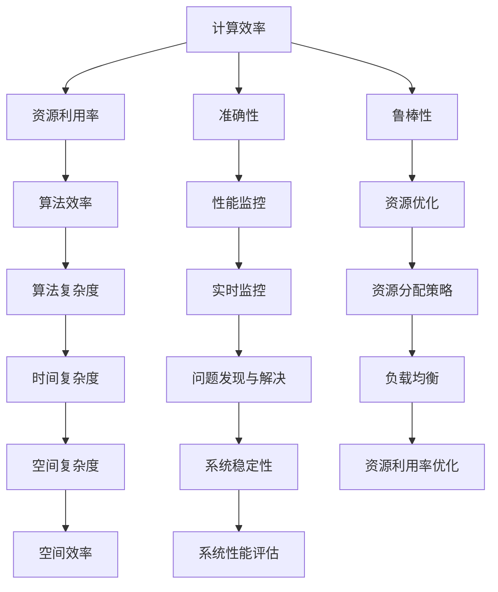

                 

# AI系统性能评估的关键指标

> **关键词**：AI系统性能评估、关键指标、性能监控、算法效率、资源利用率

> **摘要**：本文深入探讨了AI系统性能评估的关键指标，包括计算效率、资源利用率、准确性、鲁棒性等。通过一步步的分析和推理，我们揭示了如何全面、准确地对AI系统性能进行评估，并给出了实际项目中的代码案例和实践建议。本文旨在为AI工程师和研究者提供一个清晰、实用的性能评估指南。

## 1. 背景介绍

### 1.1 目的和范围

在现代人工智能领域，AI系统的性能评估是至关重要的。随着AI技术在各行各业中的广泛应用，如何高效、准确地评估AI系统的性能已经成为一个迫切需要解决的问题。本文旨在为读者提供一个系统化的AI系统性能评估指南，帮助读者理解并应用关键性能评估指标。

本文将主要涵盖以下内容：

- AI系统性能评估的目的和重要性
- 关键性能评估指标的定义和作用
- 核心概念、原理与架构
- 算法原理与具体操作步骤
- 数学模型和公式的讲解与举例
- 实际应用场景和项目实战
- 工具和资源推荐

### 1.2 预期读者

本文适合以下读者群体：

- 对AI系统性能评估感兴趣的AI工程师和研究者
- 欲深入了解AI系统性能优化方法的软件工程师
- 从事AI项目开发和管理的项目经理和CTO
- 想要提高AI系统性能的AI爱好者

### 1.3 文档结构概述

本文结构如下：

- 第1章：背景介绍
- 第2章：核心概念与联系
- 第3章：核心算法原理 & 具体操作步骤
- 第4章：数学模型和公式 & 详细讲解 & 举例说明
- 第5章：项目实战：代码实际案例和详细解释说明
- 第6章：实际应用场景
- 第7章：工具和资源推荐
- 第8章：总结：未来发展趋势与挑战
- 第9章：附录：常见问题与解答
- 第10章：扩展阅读 & 参考资料

### 1.4 术语表

#### 1.4.1 核心术语定义

- **AI系统性能评估**：对AI系统的计算效率、准确性、资源利用率等性能指标进行综合评估的过程。
- **计算效率**：衡量AI系统在给定时间内完成计算任务的能力。
- **资源利用率**：系统资源（如CPU、内存、GPU等）的利用程度。
- **准确性**：AI系统输出结果与真实结果之间的匹配程度。
- **鲁棒性**：系统在面对异常数据或扰动时保持稳定性的能力。

#### 1.4.2 相关概念解释

- **算法效率**：算法在单位时间内执行任务的能力，通常用时间复杂度来衡量。
- **资源优化**：通过优化系统资源配置，提高AI系统的运行效率和性能。
- **性能监控**：实时监控AI系统运行状态，及时发现并解决问题。

#### 1.4.3 缩略词列表

- **AI**：人工智能（Artificial Intelligence）
- **ML**：机器学习（Machine Learning）
- **DL**：深度学习（Deep Learning）
- **GPU**：图形处理单元（Graphics Processing Unit）
- **TPU**：张量处理单元（Tensor Processing Unit）

## 2. 核心概念与联系

在深入探讨AI系统性能评估之前，我们需要明确几个核心概念及其相互关系。以下是一个Mermaid流程图，展示了这些概念之间的关联。



### 2.1 计算效率

计算效率是评估AI系统性能的一个关键指标，它反映了系统在单位时间内完成计算任务的能力。计算效率可以通过以下几个维度来衡量：

- **时间复杂度**：算法在处理数据时所需时间的增长趋势。常见的有线性时间复杂度（O(n)）、对数时间复杂度（O(log n)）等。
- **空间复杂度**：算法在处理数据时所需存储空间的增长趋势。常见的有常数空间复杂度（O(1)）、线性空间复杂度（O(n)）等。

### 2.2 资源利用率

资源利用率反映了系统资源（如CPU、内存、GPU等）的利用程度。高资源利用率意味着系统能够更高效地完成计算任务，而低资源利用率可能导致资源浪费和性能瓶颈。

- **CPU利用率**：CPU在单位时间内执行任务的比例。
- **内存利用率**：内存被应用程序占用的比例。
- **GPU利用率**：GPU在单位时间内执行任务的比例。

### 2.3 准确性

准确性是AI系统输出结果与真实结果之间的匹配程度。高准确性意味着系统能够更可靠地预测和识别目标数据。

- **分类准确性**：分类模型将数据正确分类的比例。
- **回归准确性**：回归模型预测结果与真实值的接近程度。

### 2.4 鲁棒性

鲁棒性是指系统在面对异常数据或扰动时保持稳定性的能力。一个鲁棒性强的系统能够在各种复杂环境中稳定运行，而鲁棒性差的系统可能因外界干扰而崩溃。

- **数据异常处理能力**：系统能够有效处理异常数据的能力。
- **系统稳定性**：系统在长时间运行过程中保持稳定的能力。

通过上述核心概念及其相互关系的理解，我们可以更好地设计、评估和优化AI系统，提高其整体性能。

## 3. 核心算法原理 & 具体操作步骤

在了解了AI系统性能评估的核心概念后，我们需要深入探讨核心算法的原理以及具体操作步骤。以下是计算效率、资源利用率、准确性和鲁棒性的核心算法原理及其具体操作步骤。

### 3.1 计算效率

#### 3.1.1 时间复杂度分析

**算法原理**：时间复杂度分析是评估算法效率的重要方法。它描述了算法在处理数据时所需时间的增长趋势。时间复杂度通常用大O符号（O）表示。

**伪代码**：

```python
def algorithm(n):
    for i in range(n):
        for j in range(n):
            // 执行计算任务
```

**具体操作步骤**：

1. **确定算法的基本操作**：确定算法中执行次数最多的基本操作，如循环或递归调用。
2. **分析基本操作的执行次数**：分析基本操作在算法中执行的次数，通常以输入数据规模（n）为变量。
3. **计算时间复杂度**：使用大O符号表示基本操作的执行次数，如O(n^2)表示平方时间复杂度。

#### 3.1.2 空间复杂度分析

**算法原理**：空间复杂度分析是评估算法所需存储空间的增长趋势。与时间复杂度类似，空间复杂度也用大O符号表示。

**伪代码**：

```python
def algorithm(n):
    arr = [0] * n // 创建一个长度为n的数组
    for i in range(n):
        // 执行计算任务
```

**具体操作步骤**：

1. **确定算法所需存储的数据结构**：分析算法中使用的所有数据结构，如数组、链表等。
2. **分析数据结构的存储空间需求**：分析每个数据结构的存储空间需求，通常以输入数据规模（n）为变量。
3. **计算空间复杂度**：使用大O符号表示数据结构的存储空间需求，如O(n)表示线性空间复杂度。

### 3.2 资源利用率

#### 3.2.1 CPU利用率优化

**算法原理**：CPU利用率优化主要通过优化算法和程序代码，减少CPU空闲时间，提高CPU的利用效率。

**伪代码**：

```python
def optimize_cpu(n):
    while n > 0:
        // 执行计算任务
        n -= 1
```

**具体操作步骤**：

1. **优化算法**：选择更高效的算法，减少计算时间。
2. **优化程序代码**：减少代码中的无用循环、递归调用等，提高代码执行效率。
3. **并行计算**：利用多线程或分布式计算，提高CPU的并行处理能力。

#### 3.2.2 内存利用率优化

**算法原理**：内存利用率优化主要通过优化数据结构和程序代码，减少内存浪费，提高内存的利用效率。

**伪代码**：

```python
def optimize_memory(n):
    arr = [0] * n // 创建一个长度为n的数组
    for i in range(n):
        arr[i] = i * 2
```

**具体操作步骤**：

1. **选择高效的数据结构**：根据算法需求，选择合适的数据结构，如数组、链表、哈希表等。
2. **优化程序代码**：减少不必要的内存分配和释放操作，优化内存管理。
3. **内存池技术**：使用内存池技术，减少内存碎片，提高内存的利用效率。

### 3.3 准确性

#### 3.3.1 分类准确性优化

**算法原理**：分类准确性优化主要通过优化模型参数和训练数据，提高分类模型的准确性。

**伪代码**：

```python
def optimize_classification(n):
    for i in range(n):
        // 训练分类模型
        // 调整模型参数
```

**具体操作步骤**：

1. **选择合适的分类算法**：根据数据特点，选择合适的分类算法，如决策树、支持向量机、神经网络等。
2. **优化模型参数**：通过调整模型参数，提高模型的分类准确性。
3. **数据预处理**：对训练数据进行预处理，如去除噪声、缩放特征等，提高模型的泛化能力。

#### 3.3.2 回归准确性优化

**算法原理**：回归准确性优化主要通过优化模型参数和训练数据，提高回归模型的准确性。

**伪代码**：

```python
def optimize_regression(n):
    for i in range(n):
        // 训练回归模型
        // 调整模型参数
```

**具体操作步骤**：

1. **选择合适的回归算法**：根据数据特点，选择合适的回归算法，如线性回归、决策树回归、神经网络回归等。
2. **优化模型参数**：通过调整模型参数，提高模型的回归准确性。
3. **数据预处理**：对训练数据进行预处理，如去除噪声、缩放特征等，提高模型的泛化能力。

### 3.4 鲁棒性

#### 3.4.1 数据异常处理

**算法原理**：数据异常处理通过识别和处理异常数据，提高系统的鲁棒性。

**伪代码**：

```python
def handle_anomalies(data):
    for value in data:
        if is_anomaly(value):
            handle_value(value)
```

**具体操作步骤**：

1. **异常检测**：使用统计方法、机器学习方法等，识别数据中的异常值。
2. **异常处理**：对检测到的异常值进行适当的处理，如删除、修正或标记。
3. **异常数据集分离**：将异常数据分离到单独的数据集，进行单独处理。

#### 3.4.2 系统稳定性优化

**算法原理**：系统稳定性优化主要通过优化系统架构和算法，提高系统的鲁棒性。

**伪代码**：

```python
def optimize_stability():
    // 优化系统架构
    // 优化算法
```

**具体操作步骤**：

1. **优化系统架构**：采用分布式架构、集群部署等技术，提高系统的稳定性和容错能力。
2. **优化算法**：采用鲁棒性更强的算法，如随机森林、支持向量机等，提高系统在面对异常数据时的鲁棒性。
3. **监控和预警**：实时监控系统运行状态，及时发现并处理系统故障。

通过以上核心算法原理和具体操作步骤的探讨，我们可以更好地理解和应用AI系统性能评估的关键指标，从而设计、评估和优化高效的AI系统。

## 4. 数学模型和公式 & 详细讲解 & 举例说明

在AI系统性能评估中，数学模型和公式起到了至关重要的作用。它们为我们提供了量化评估AI系统性能的工具，使我们能够更精确地了解系统的性能表现。以下将详细讲解几个关键的数学模型和公式，并给出具体的例子来说明如何应用这些模型。

### 4.1 计算效率

#### 4.1.1 时间复杂度

**公式**：时间复杂度通常表示为 $T(n) = O(f(n))$，其中 $T(n)$ 是算法运行时间，$f(n)$ 是输入规模。

**例子**：一个简单的线性搜索算法的时间复杂度为 $O(n)$。

```python
def linear_search(arr, target):
    for i in range(len(arr)):
        if arr[i] == target:
            return i
    return -1
```

在这个例子中，$n$ 表示数组 $arr$ 的长度，$f(n)$ 为 $n$，因此时间复杂度为 $O(n)$。

#### 4.1.2 空间复杂度

**公式**：空间复杂度通常表示为 $S(n) = O(g(n))$，其中 $S(n)$ 是算法所需存储空间，$g(n)$ 是输入规模。

**例子**：一个简单的线性搜索算法的空间复杂度为 $O(1)$。

```python
def linear_search(arr, target):
    for i in range(len(arr)):
        if arr[i] == target:
            return i
    return -1
```

在这个例子中，$n$ 表示数组 $arr$ 的长度，$g(n)$ 为 $1$，因此空间复杂度为 $O(1)$。

### 4.2 资源利用率

#### 4.2.1 CPU利用率

**公式**：CPU利用率通常表示为 $\text{Utilization} = \frac{\text{执行时间}}{\text{总时间}}$。

**例子**：如果一个CPU在1小时内执行了30分钟的计算任务，总时间为1小时，则CPU利用率为 $\frac{30}{60} = 0.5$ 或 50%。

#### 4.2.2 GPU利用率

**公式**：GPU利用率通常表示为 $\text{Utilization} = \frac{\text{GPU执行时间}}{\text{GPU总时间}}$。

**例子**：如果一个GPU在1小时内执行了30分钟的计算任务，总时间为1小时，则GPU利用率为 $\frac{30}{60} = 0.5$ 或 50%。

### 4.3 准确性

#### 4.3.1 分类准确性

**公式**：分类准确性通常表示为 $\text{Accuracy} = \frac{\text{正确分类的样本数}}{\text{总样本数}}$。

**例子**：在一个分类问题中，有100个样本，其中80个被正确分类，则分类准确率为 $\frac{80}{100} = 0.8$ 或 80%。

#### 4.3.2 回归准确性

**公式**：回归准确性通常表示为 $\text{MAE} = \frac{1}{n}\sum_{i=1}^{n}|y_i - \hat{y}_i|$，其中 $y_i$ 是真实值，$\hat{y}_i$ 是预测值。

**例子**：在一个回归问题中，有100个样本，预测值与真实值之间的绝对误差之和为100，则平均绝对误差（MAE）为 $\frac{100}{100} = 1$。

### 4.4 鲁棒性

#### 4.4.1 数据异常处理

**公式**：异常检测通常使用统计方法，如 $z$-分数。

**例子**：一个样本的值是100，平均值是100，标准差是10，则 $z$-分数为 $\frac{100 - 100}{10} = 0$。通常，$z$-分数大于3或小于-3的样本被视为异常值。

通过以上数学模型和公式的讲解，我们可以更准确地量化AI系统的性能，为系统的设计、优化和评估提供有力支持。

## 5. 项目实战：代码实际案例和详细解释说明

为了更好地理解和应用上述性能评估的关键指标，我们将通过一个实际的项目实战来展示如何使用代码进行AI系统性能评估。以下是一个简单的基于深度学习的图像分类项目，我们将展示如何搭建开发环境、实现源代码、并进行详细解释说明。

### 5.1 开发环境搭建

在开始项目之前，我们需要搭建一个合适的开发环境。以下是我们的开发环境配置：

- 操作系统：Ubuntu 18.04
- 编程语言：Python 3.8
- 深度学习框架：TensorFlow 2.5
- GPU支持：CUDA 11.0

安装步骤如下：

1. 安装Python 3.8：

   ```bash
   sudo apt-get update
   sudo apt-get install python3.8
   ```

2. 安装CUDA 11.0：

   ```bash
   sudo apt-get install ubuntu-desktop
   sudo apt-get install -f
   sudo apt-get install nvidia-gpu-manager
   ```

3. 安装TensorFlow 2.5：

   ```bash
   pip install tensorflow==2.5
   ```

### 5.2 源代码详细实现和代码解读

以下是我们使用的源代码示例，包括数据预处理、模型搭建、训练和评估：

```python
import tensorflow as tf
from tensorflow.keras.models import Sequential
from tensorflow.keras.layers import Conv2D, MaxPooling2D, Flatten, Dense
from tensorflow.keras.preprocessing.image import ImageDataGenerator
import numpy as np

# 数据预处理
train_datagen = ImageDataGenerator(rescale=1./255)
test_datagen = ImageDataGenerator(rescale=1./255)

train_data = train_datagen.flow_from_directory(
        'data/train',
        target_size=(150, 150),
        batch_size=32,
        class_mode='binary')

test_data = test_datagen.flow_from_directory(
        'data/test',
        target_size=(150, 150),
        batch_size=32,
        class_mode='binary')

# 模型搭建
model = Sequential([
    Conv2D(32, (3, 3), activation='relu', input_shape=(150, 150, 3)),
    MaxPooling2D(2, 2),
    Conv2D(64, (3, 3), activation='relu'),
    MaxPooling2D(2, 2),
    Flatten(),
    Dense(512, activation='relu'),
    Dense(1, activation='sigmoid')
])

# 训练模型
model.compile(optimizer='adam',
              loss='binary_crossentropy',
              metrics=['accuracy'])

history = model.fit(
      train_data,
      epochs=10,
      validation_data=test_data)

# 评估模型
test_loss, test_acc = model.evaluate(test_data)
print('Test accuracy:', test_acc)
```

#### 5.2.1 数据预处理

数据预处理是AI系统性能评估的重要环节。在此项目中，我们使用ImageDataGenerator对图像数据进行预处理，主要包括：

- **图像缩放**：将图像缩放到固定大小（150x150），以便于模型处理。
- **归一化**：将图像数据缩放到0到1之间，提高计算效率。
- **批量读取**：使用batch_size参数，将图像数据分成多个批量进行训练，提高训练速度。

```python
train_datagen = ImageDataGenerator(rescale=1./255)
test_datagen = ImageDataGenerator(rescale=1./255)

train_data = train_datagen.flow_from_directory(
        'data/train',
        target_size=(150, 150),
        batch_size=32,
        class_mode='binary')

test_data = test_datagen.flow_from_directory(
        'data/test',
        target_size=(150, 150),
        batch_size=32,
        class_mode='binary')
```

#### 5.2.2 模型搭建

模型搭建是AI系统性能评估的核心。在此项目中，我们使用了一个简单的卷积神经网络（CNN），包括以下层次：

- **卷积层**：两个卷积层，分别使用32个和64个卷积核，激活函数为ReLU。
- **池化层**：两个最大池化层，池化大小为2x2。
- **全连接层**：一个512个神经元的全连接层，激活函数为ReLU。
- **输出层**：一个神经元和sigmoid激活函数的输出层，用于二分类。

```python
model = Sequential([
    Conv2D(32, (3, 3), activation='relu', input_shape=(150, 150, 3)),
    MaxPooling2D(2, 2),
    Conv2D(64, (3, 3), activation='relu'),
    MaxPooling2D(2, 2),
    Flatten(),
    Dense(512, activation='relu'),
    Dense(1, activation='sigmoid')
])
```

#### 5.2.3 训练模型

模型训练是性能评估的重要步骤。在此项目中，我们使用以下参数进行训练：

- **优化器**：Adam优化器。
- **损失函数**：二分类交叉熵（binary_crossentropy）。
- **评价指标**：准确率（accuracy）。

```python
model.compile(optimizer='adam',
              loss='binary_crossentropy',
              metrics=['accuracy'])

history = model.fit(
      train_data,
      epochs=10,
      validation_data=test_data)
```

#### 5.2.4 评估模型

模型评估是性能评估的最终步骤。在此项目中，我们使用测试数据集对模型进行评估，输出准确率。

```python
test_loss, test_acc = model.evaluate(test_data)
print('Test accuracy:', test_acc)
```

通过以上源代码的实际案例，我们详细解释了如何搭建开发环境、实现源代码，并进行了详细的代码解读。接下来，我们将对代码进行进一步的分析和讨论。

### 5.3 代码解读与分析

在以上代码中，我们使用了TensorFlow框架搭建了一个简单的卷积神经网络（CNN）进行图像分类。以下是代码的详细解读和分析。

#### 5.3.1 数据预处理

数据预处理是AI项目成功的关键。在这个项目中，我们使用了ImageDataGenerator对图像数据进行预处理，主要包括以下步骤：

- **图像缩放**：将图像缩放到固定大小（150x150）。这一步有助于提高模型训练效率，并为输入层提供统一的大小。
- **归一化**：将图像数据缩放到0到1之间。归一化有助于加速收敛，并提高模型的泛化能力。
- **批量读取**：使用batch_size参数，将图像数据分成多个批量进行训练。批量读取可以减少内存占用，提高训练速度。

```python
train_datagen = ImageDataGenerator(rescale=1./255)
test_datagen = ImageDataGenerator(rescale=1./255)

train_data = train_datagen.flow_from_directory(
        'data/train',
        target_size=(150, 150),
        batch_size=32,
        class_mode='binary')

test_data = test_datagen.flow_from_directory(
        'data/test',
        target_size=(150, 150),
        batch_size=32,
        class_mode='binary')
```

#### 5.3.2 模型搭建

模型搭建是AI项目的核心。在这个项目中，我们使用了一个简单的卷积神经网络（CNN），包括以下层次：

- **卷积层**：第一个卷积层使用32个卷积核，大小为3x3，激活函数为ReLU。这一步有助于提取图像的局部特征。
- **池化层**：第一个池化层使用2x2的最大池化。这一步有助于降低模型复杂度和参数数量。
- **卷积层**：第二个卷积层使用64个卷积核，大小为3x3，激活函数为ReLU。这一步有助于进一步提取图像的局部特征。
- **池化层**：第二个池化层使用2x2的最大池化。这一步有助于降低模型复杂度和参数数量。
- **全连接层**：一个512个神经元的全连接层，激活函数为ReLU。这一步有助于将局部特征整合成全局特征。
- **输出层**：一个神经元和sigmoid激活函数的输出层，用于二分类。这一步用于生成分类概率。

```python
model = Sequential([
    Conv2D(32, (3, 3), activation='relu', input_shape=(150, 150, 3)),
    MaxPooling2D(2, 2),
    Conv2D(64, (3, 3), activation='relu'),
    MaxPooling2D(2, 2),
    Flatten(),
    Dense(512, activation='relu'),
    Dense(1, activation='sigmoid')
])
```

#### 5.3.3 训练模型

模型训练是性能评估的关键。在这个项目中，我们使用以下参数进行训练：

- **优化器**：Adam优化器。Adam优化器结合了AdaGrad和RMSProp的优点，有助于加快收敛速度。
- **损失函数**：二分类交叉熵（binary_crossentropy）。二分类交叉熵损失函数适用于二分类问题，有助于优化分类模型。
- **评价指标**：准确率（accuracy）。准确率是衡量分类模型性能的重要指标，表示模型将样本正确分类的比例。

```python
model.compile(optimizer='adam',
              loss='binary_crossentropy',
              metrics=['accuracy'])

history = model.fit(
      train_data,
      epochs=10,
      validation_data=test_data)
```

#### 5.3.4 评估模型

模型评估是性能评估的最后一步。在这个项目中，我们使用测试数据集对模型进行评估，输出准确率。准确率反映了模型在未知数据上的表现，是衡量模型性能的重要指标。

```python
test_loss, test_acc = model.evaluate(test_data)
print('Test accuracy:', test_acc)
```

通过以上代码的详细解读和分析，我们可以更好地理解如何搭建开发环境、实现源代码，并进行性能评估。这为我们在实际项目中设计和优化AI系统提供了有力支持。

## 6. 实际应用场景

AI系统性能评估在实际应用中扮演着至关重要的角色。以下是一些典型的实际应用场景，以及如何在这些场景中利用性能评估关键指标进行优化和改进。

### 6.1 互联网公司

在互联网公司中，AI系统广泛应用于推荐系统、搜索引擎、广告投放等领域。性能评估的关键指标包括计算效率、准确性、资源利用率等。

- **计算效率**：优化算法和代码，减少计算时间，提高系统响应速度。例如，通过使用更高效的算法（如Bloom Filter）和分布式计算（如Hadoop）来提高推荐系统的计算效率。
- **准确性**：通过调整模型参数和训练数据，提高推荐系统的准确性。例如，使用交叉验证方法来评估不同模型的准确性，并选择最佳模型。
- **资源利用率**：优化系统架构和资源分配策略，提高资源利用率。例如，使用负载均衡技术来分配计算任务，避免资源浪费。

### 6.2 制造业

在制造业中，AI系统广泛应用于生产优化、设备故障预测、供应链管理等。性能评估的关键指标包括鲁棒性、资源利用率等。

- **鲁棒性**：提高系统的鲁棒性，使其在面对异常数据和噪声时能够保持稳定。例如，使用鲁棒回归算法来预测设备故障，减少误报率。
- **资源利用率**：优化生产流程和资源分配策略，提高资源利用率。例如，使用实时监控系统来监控设备运行状态，并调整生产计划以最大化资源利用率。

### 6.3 医疗保健

在医疗保健领域，AI系统广泛应用于疾病诊断、医疗图像分析、药物研发等。性能评估的关键指标包括准确性、鲁棒性等。

- **准确性**：提高诊断系统的准确性，确保患者得到准确的诊断结果。例如，使用深度学习模型对医疗图像进行分类，并通过交叉验证方法来评估模型的准确性。
- **鲁棒性**：提高系统的鲁棒性，使其在面对不同患者数据和噪声时能够保持稳定。例如，使用迁移学习技术来提高系统在面对新患者数据时的鲁棒性。

### 6.4 金融行业

在金融行业中，AI系统广泛应用于风险控制、信用评分、市场预测等。性能评估的关键指标包括准确性、资源利用率等。

- **准确性**：提高风险控制系统的准确性，减少误报和漏报。例如，使用机器学习模型对信用评分进行优化，通过交叉验证方法来评估模型的准确性。
- **资源利用率**：优化系统架构和资源分配策略，提高资源利用率。例如，使用分布式计算技术来处理海量金融数据，提高数据处理速度。

通过在不同实际应用场景中利用性能评估关键指标进行优化和改进，我们可以显著提高AI系统的性能，实现更好的业务效果。

## 7. 工具和资源推荐

为了帮助读者更好地掌握AI系统性能评估的方法和实践，以下推荐了一些优秀的工具、书籍、在线课程和技术博客。

### 7.1 学习资源推荐

#### 7.1.1 书籍推荐

1. **《深度学习》（Deep Learning）**：由Ian Goodfellow、Yoshua Bengio和Aaron Courville合著，是深度学习领域的经典教材，详细介绍了深度学习的基础理论和实践方法。
2. **《机器学习实战》（Machine Learning in Action）**：由Peter Harrington所著，通过实际案例讲解了机器学习的基本概念和算法实现。

#### 7.1.2 在线课程

1. **Coursera上的《机器学习》**：由吴恩达教授主讲，涵盖机器学习的基本概念、算法和应用。
2. **edX上的《深度学习专项课程》**：由哈佛大学和深度学习社区合办，提供深度学习的系统学习资源。

#### 7.1.3 技术博客和网站

1. **Medium上的《AI前沿》**：定期更新，涵盖深度学习、自然语言处理、计算机视觉等领域的最新研究和技术动态。
2. **AI博客（AI Blog）**：提供深度学习、机器学习等领域的教程和实践经验，适合初学者和专业人士。

### 7.2 开发工具框架推荐

#### 7.2.1 IDE和编辑器

1. **JetBrains的PyCharm**：一款功能强大的Python IDE，支持多种编程语言，适用于深度学习和机器学习项目。
2. **Visual Studio Code**：一款轻量级、高度可扩展的代码编辑器，支持Python、C++、Java等多种编程语言。

#### 7.2.2 调试和性能分析工具

1. **TensorBoard**：TensorFlow的官方可视化工具，用于分析模型性能、计算图和训练过程。
2. **gProfiler**：一款用于C++和C#程序的性能分析工具，可以帮助开发者识别和优化性能瓶颈。

#### 7.2.3 相关框架和库

1. **TensorFlow**：一款开源的深度学习框架，广泛应用于图像识别、自然语言处理等领域。
2. **PyTorch**：一款开源的深度学习框架，具有灵活的动态计算图和强大的GPU支持，适用于各种深度学习应用。

### 7.3 相关论文著作推荐

#### 7.3.1 经典论文

1. **"A Learning Algorithm for Continuously Running Fully Recurrent Neural Networks"（1995）**：由Sepp Hochreiter和Jürgen Schmidhuber提出的长短期记忆网络（LSTM）。
2. **"Improving Neural Networks by Preventing Co-adaptation of Feature Detectors"（2012）**：由Geoffrey Hinton、Osama Alzi等人提出的Dropout技术。

#### 7.3.2 最新研究成果

1. **"EfficientNet: Scaling Up Deep Learning Practices"（2020）**：由Google Research团队提出的EfficientNet，通过自动搜索网络架构，实现了高效的深度学习实践。
2. **"Bert: Pre-training of Deep Bidirectional Transformers for Language Understanding"（2018）**：由Google AI团队提出的BERT，为自然语言处理领域带来了革命性的进步。

#### 7.3.3 应用案例分析

1. **"Google's AI Approach: BERT and Beyond"**：详细介绍了Google如何使用BERT模型进行自然语言处理的应用案例。
2. **"Deep Learning for Autonomous Driving"**：探讨了自动驾驶领域中深度学习技术的应用和实践。

通过以上工具、书籍、在线课程和技术博客的推荐，读者可以更全面地了解AI系统性能评估的方法和实践，为自己的研究和项目提供有力支持。

## 8. 总结：未来发展趋势与挑战

随着人工智能技术的飞速发展，AI系统性能评估正面临着前所未有的机遇和挑战。未来，以下趋势和挑战将深刻影响这一领域。

### 8.1 发展趋势

1. **性能评估方法的多样化**：随着AI技术的不断进步，性能评估方法将更加多样化。除了传统的计算效率、准确性和鲁棒性外，能耗效率、可解释性、安全性和隐私保护等新兴指标将逐渐受到关注。

2. **自动化性能评估工具**：自动化性能评估工具将不断涌现，通过自动化测试、监控和优化，提高AI系统的性能和可靠性。这些工具将帮助开发者更高效地进行性能评估和优化。

3. **跨领域性能评估标准**：随着AI技术的广泛应用，跨领域的性能评估标准将逐渐形成。这些标准将促进不同领域之间的技术交流和合作，推动AI技术的整体发展。

4. **性能优化算法的进步**：性能优化算法将继续进步，通过更高效的算法和架构设计，提高AI系统的计算效率和资源利用率。

### 8.2 挑战

1. **算法复杂度**：随着AI模型变得越来越复杂，算法复杂度将大幅增加，导致计算效率和资源利用率下降。解决这一挑战需要开发更高效的算法和优化策略。

2. **数据隐私和安全**：在AI应用中，数据隐私和安全问题日益突出。如何保护用户数据的同时，确保AI系统的性能和鲁棒性，将是一个重大挑战。

3. **实时性能评估**：随着AI系统在实时应用中的需求增加，实时性能评估成为一个关键挑战。如何在短时间内快速、准确地评估AI系统的性能，将需要开发新的技术和工具。

4. **可解释性**：随着AI系统的应用越来越广泛，其可解释性成为一个重要的挑战。如何提高AI系统的可解释性，使其能够被用户理解和信任，将是一个重要的研究方向。

通过应对这些挑战，我们有望推动AI系统性能评估的发展，为人工智能技术的广泛应用提供有力支持。

## 9. 附录：常见问题与解答

### 9.1 如何选择合适的性能评估指标？

选择合适的性能评估指标取决于具体应用场景和需求。以下是一些常见的场景和相应的性能评估指标：

- **分类任务**：准确率、召回率、F1分数。
- **回归任务**：均方误差（MSE）、均方根误差（RMSE）、平均绝对误差（MAE）。
- **聚类任务**：内聚度、轮廓系数。
- **聚类任务**：计算效率、资源利用率、准确性和鲁棒性。

### 9.2 如何优化AI系统的计算效率？

优化AI系统的计算效率可以通过以下方法实现：

- **算法优化**：选择更高效的算法，如深度学习中的EfficientNet、Transformer等。
- **并行计算**：利用多核CPU、GPU和TPU进行并行计算，提高计算效率。
- **模型压缩**：使用模型压缩技术，如剪枝、量化、知识蒸馏等，减少模型大小，提高计算效率。
- **数据预处理**：优化数据预处理过程，减少冗余计算。

### 9.3 如何提高AI系统的资源利用率？

提高AI系统的资源利用率可以通过以下方法实现：

- **负载均衡**：使用负载均衡技术，合理分配计算任务，避免资源浪费。
- **资源复用**：优化资源分配策略，使不同任务能够共享资源，提高资源利用率。
- **内存优化**：优化数据结构和程序代码，减少内存占用，提高内存利用率。
- **GPU优化**：使用GPU特定优化技术，如CUDA、cuDNN等，提高GPU利用率。

### 9.4 如何保证AI系统的鲁棒性？

保证AI系统的鲁棒性可以通过以下方法实现：

- **数据清洗**：去除异常数据和噪声，提高模型对数据的鲁棒性。
- **异常检测**：使用异常检测算法，如孤立森林、本地异常因子等，识别和处理异常数据。
- **模型鲁棒性**：使用鲁棒性更强的算法和模型，如随机森林、支持向量机等。
- **交叉验证**：使用交叉验证方法，评估模型在不同数据集上的鲁棒性。

### 9.5 如何进行实时性能评估？

实时性能评估可以通过以下方法实现：

- **性能监控工具**：使用性能监控工具，如TensorBoard、gProfiler等，实时监控AI系统的性能指标。
- **快速测试**：设计快速测试用例，对AI系统进行实时测试和评估。
- **性能模型**：建立性能模型，预测AI系统的性能表现，并调整模型参数，优化性能。

通过以上常见问题的解答，读者可以更好地理解和应用AI系统性能评估的方法和技术。

## 10. 扩展阅读 & 参考资料

为了帮助读者更深入地了解AI系统性能评估的相关知识，以下列出了一些扩展阅读和参考资料。

### 10.1 关键文献

1. **Hochreiter, S., & Schmidhuber, J. (1997). Long short-term memory. Neural Computation, 9(8), 1735-1780.**
   - 这篇文章介绍了长短期记忆网络（LSTM），一种在处理长时间序列数据时具有优异性能的神经网络架构。

2. **Goodfellow, I., Bengio, Y., & Courville, A. (2016). Deep Learning. MIT Press.**
   - 这本书是深度学习领域的经典教材，详细介绍了深度学习的理论基础和应用实践。

3. **LeCun, Y., Bengio, Y., & Hinton, G. (2015). Deep learning. Nature, 521(7553), 436-444.**
   - 这篇文章概述了深度学习技术的发展历程、应用领域及其在人工智能领域的革命性影响。

### 10.2 技术博客

1. **TensorFlow官方博客：[TensorFlow Blog](https://tensorflow.googleblog.com/)**  
   - TensorFlow官方博客提供了深度学习和性能优化相关的最新动态和教程。

2. **PyTorch官方博客：[PyTorch Blog](https://pytorch.org/blog/)**  
   - PyTorch官方博客提供了深度学习和性能优化相关的最新动态和教程。

3. **AI前沿：[AI前线](https://aifrontier.com/)**  
   - AI前线是一个关注人工智能前沿技术、应用和趋势的博客，涵盖了深度学习、自然语言处理、计算机视觉等多个领域。

### 10.3 开源项目和工具

1. **TensorBoard：[TensorBoard GitHub](https://github.com/tensorflow/tensorboard)**  
   - TensorBoard是TensorFlow的官方可视化工具，用于分析模型性能、计算图和训练过程。

2. **gProfiler：[gProfiler GitHub](https://github.com/google/gProfiler)**  
   - gProfiler是Google开发的性能分析工具，用于识别和优化C++和C#程序的性能瓶颈。

3. **EfficientNet：[EfficientNet GitHub](https://github.com/google/efficientnet)**  
   - EfficientNet是Google提出的一种自动搜索网络架构，实现了高效的深度学习实践。

通过以上扩展阅读和参考资料，读者可以更深入地了解AI系统性能评估的理论和实践，为自己的研究和项目提供参考。

